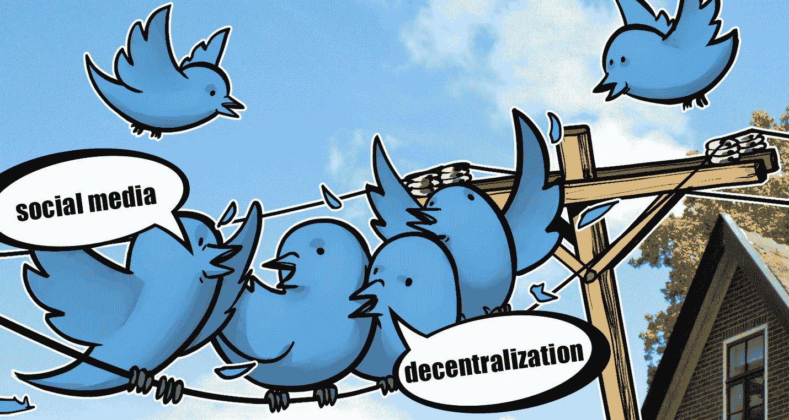
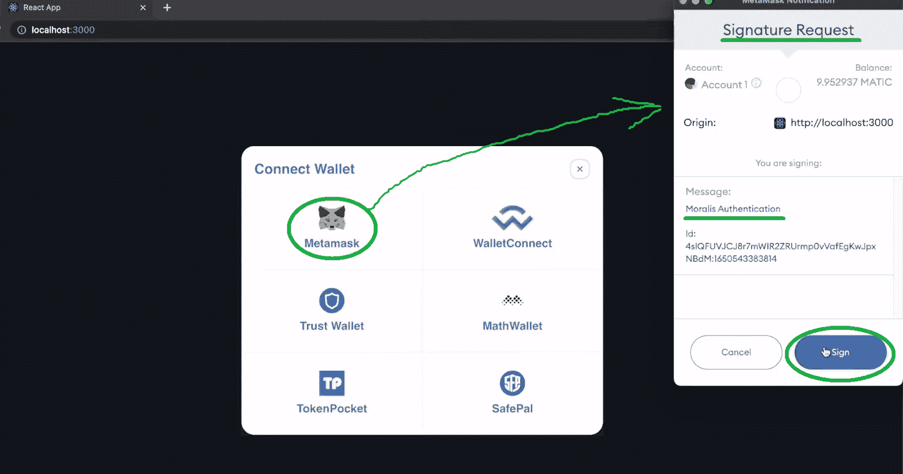
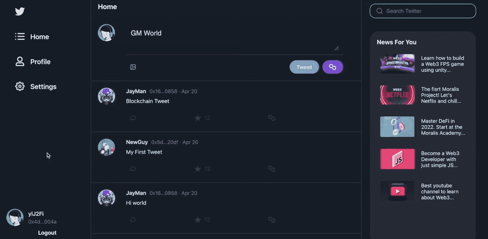
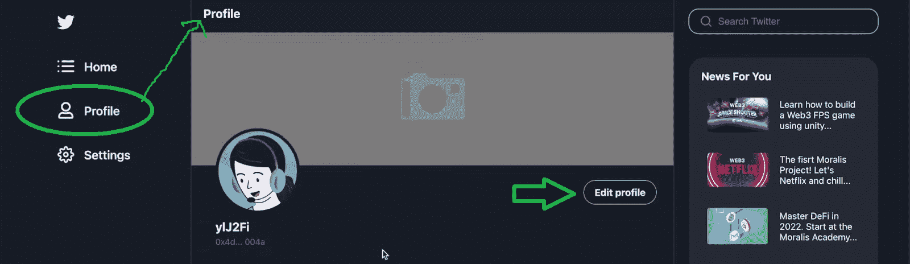
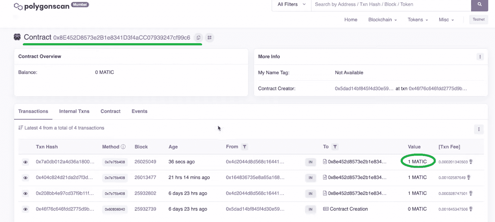
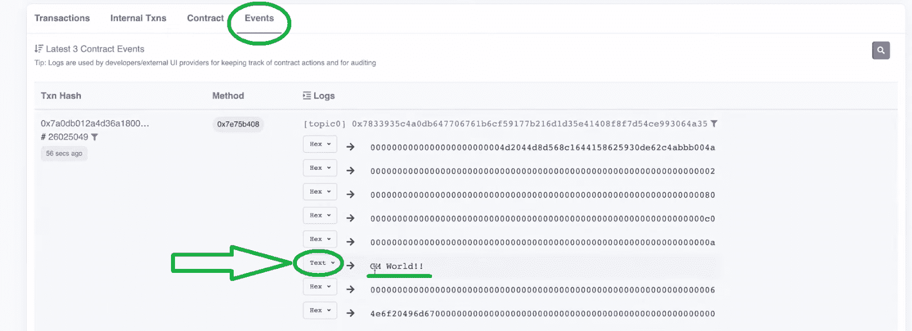
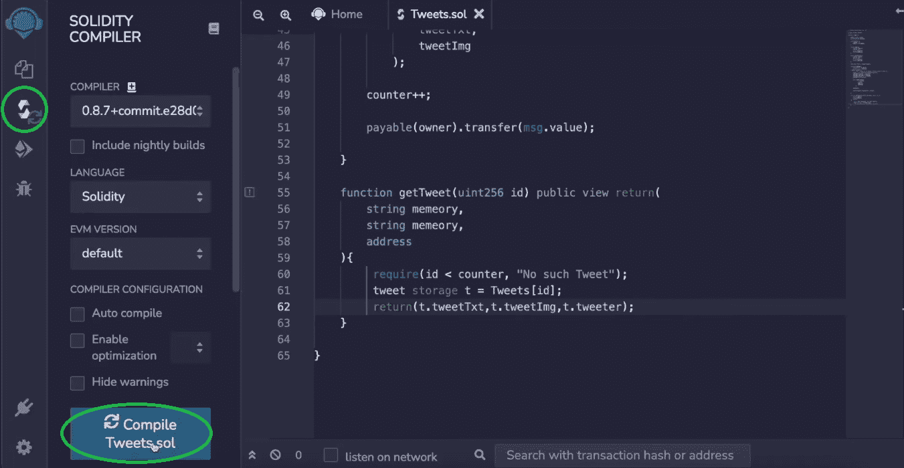

# 2022 年去中心化推特建设指南

> 原文：<https://moralis.io/2022-guide-to-building-a-decentralized-twitter/>

Twitter 是最受欢迎的社交媒体平台之一，被不同行业的不同社区和用户广泛采用。但像大多数现有的社交媒体平台一样，Twitter 是集中式的。当然，这家社交媒体巨头正在实施一些加密功能，例如使用 NFTs(****)作为个人资料图片。然而，该平台的用户面临审查、账户封锁、屏蔽等。，日常。幸运的是，** [**Web3**](https://moralis.io/the-ultimate-guide-to-web3-what-is-web3/) **为这些问题提供了优秀的解决方案。因此，我们决定展示如何在不到 90 分钟的时间内创建一个分散的 Twitter。为了确保你能毫不费力地建立一个去中心化的 Twitter，并且这个过程能顺利进行，我们把这篇文章分成了四个阶段:****

***   **部署智能合约在区块链上发布推文***   **构建我们去中心化 Twitter 的前端***   **构建我们去中心化 Twitter 的后端***   **使用 Moralis 仪表盘处理链外和链内数据****

**如果你决定接受今天的任务，你将会拥有一个你自己的去中心化的 Twitter。然而，这只是“顶端的樱桃”。一个更大的价值正以知识和技能的形式等待着你，你将在这个过程中获得。首先，你将学习如何使用 [Remix](https://moralis.io/remix-explained-what-is-remix/) 来创建和部署[智能合约](https://moralis.io/smart-contracts-explained-what-are-smart-contracts/)。您还将了解到[Moralis](https://moralis.io/)–[最好的 Web3 后端平台](https://moralis.io/exploring-the-best-web3-backend-platform/)。这个“ [Firebase for crypto](https://moralis.io/firebase-for-crypto-the-best-blockchain-firebase-alternative/) ”平台将为我们节省大量时间，因为它将使我们能够用简短的代码片段来满足 dapp 的后端需求。此外，这个当前 Web3 技术栈的顶峰也将帮助你索引区块链和外链数据。尽管如此，通过承担这个示例项目，你也可以更新你的[反应](https://moralis.io/react-explained-what-is-react/)技能。是的，[精通 JavaScript](https://moralis.io/javascript-explained-what-is-javascript/) 是你成为 Web3 开发者所需要的全部。**

**

## 分散的 Twitter–演示

在我们牵着你的手向你展示如何构建一个 [Web3 Twitter 克隆](https://moralis.io/how-to-build-a-web3-twitter-clone/)之前，你应该得到一些额外的见解。因此，我们准备了一个去中心化 Twitter 的快速演示。后者将帮助你决定是否要卷起袖子完成上面列出的四个前进阶段。

这是我们去中心化 Twitter 的登陆页面:

如果你对[去中心化应用](https://moralis.io/decentralized-applications-explained-what-are-dapps/) (dapps)略知一二，你就知道 [Web3 认证](https://moralis.io/web3-authentication-the-full-guide/)是必不可少的一部分。幸运的是，各种知名的 [Web3 钱包](https://moralis.io/what-is-a-web3-wallet-web3-wallets-explained/)让这变得相当简单。因此，点击“连接钱包”按钮，用户可以选择他们最喜欢的 [Web3 登录](https://moralis.io/how-to-build-a-web3-login-in-5-steps/)工具:

正如您在上面的截图中看到的，示例用户决定使用元掩码对[进行身份验证。当用户点击](https://moralis.io/how-to-authenticate-with-metamask/)[元掩码](https://moralis.io/metamask-explained-what-is-metamask/)图标时，这个钱包的扩展弹出，要求用户签名。点击“Sign”按钮后，用户登陆我们分散的 Twitter 主页:

此外，这是示例用户首次登录我们的 dapp。因此，他的简档被分配了默认的用户图标。当然，他可以很容易地改变它(见下文)。此外，用户已经在主页提要的中心看到了最新的推文。但是，在与之交互之前，用户应该完成初始配置文件设置。因此，用户选择“简档”标签，然后点击“编辑简档”:

这是用户输入他们的名字和简历的地方。在这里，我们包括了一个功能，让用户选择他们的 NFT 作为他们的个人资料图片:

“个人资料”设置还允许用户个性化他们的横幅。当他们点击上面的灰色区域时，他们可以上传他们的横幅图片。最后，用户需要点击“保存”按钮:

### 在我们分散的推特上展示推文

要创建和发布推文，用户需要点击我们分散式 Twitter 的“主页”按钮:

一旦进入主页，用户可以在点击文本输入字段后开始输入(“GM World”，如上所示)。他们还有机会通过“图片”图标在推文中添加图片。此外，用户可以做链外或链上的推文。在后一种情况下，他们的推文将被保存在区块链上。

注意:为了这个示例项目，我们使用了 Polygon 的 Mumbai testnet。因此，我们使用多边形图标作为“tweet on-chain”按钮。

当有问题时，用户必须使用“Tweet”按钮。通过这样做，他们的新推文几乎立即出现在推文线程中:

此外，在发布推文后，用户将在其个人资料选项卡(“您的推文”部分)中看到他们的推文:

当然，当用户想在区块链上发布推文时，他们需要点击“多边形”按钮:

如上面的截图所示，此操作会提示他们的 Web3 钱包扩展。因此，他们需要确认“tweet”交易。对于我们的分散式 Twitter，用户需要支付一个 MATIC 来保存他们在链上的推文:

确认的交易通常在几秒钟内得到处理。一旦发生这种情况，用户的链上推文也会出现在主页的推文线程上:

我们还想确认上述推文是否保存在区块链上。因此，我们使用 PolygonScan (testnet)来搜索我们的智能合同的地址。因此，我们可以查看上面显示的事务:

“事件”选项卡使我们能够看到我们的示例推文。但是，要以文本格式查看其内容，我们必须将“十六进制”转换为“文本”:

## 在不到 90 分钟的时间里建立一个分散的 Twitter

那些决定动手的人现在将学习如何完成我们“建立一个去中心化的 Twitter”探索的四个阶段。您将从使用 Remix 部署我们的“链上推文”智能合约开始。既然你可以复制我们合同的代码，你就不必担心你的[可靠性](https://moralis.io/solidity-explained-what-is-solidity/)技能。然后，您将使用 React 来构建我们的分散式 Twitter 的前端。最后，您将释放 [Moralis 的 SDK](https://moralis.io/exploring-moralis-sdk-the-ultimate-web3-sdk/) 的力量来覆盖后端特性。幸运的是，你可以在[创建你的免费 Moralis 账户](https://admin.moralis.io/register)，它提供了你建立一个去中心化 Twitter 所需的一切。

***注意:*** *由于视频可以显示的不仅仅是截图，我们将包括时间戳。跳转到本文底部视频中的每个时间戳。您将有机会在内部 Moralis 专家的带领下，在不到 90 分钟的时间内完成我们的项目。尽管如此，从克隆我们的代码开始。如果您想探索完成的 Twitter 克隆，请使用* [*最终代码*](https://github.com/MoralisWeb3/youtube-tutorials/tree/main/Twitter-Start) *。尽管如此，我们鼓励您使用* [*起始代码*](https://github.com/MoralisWeb3/youtube-tutorials/tree/main/Twitter-Starter) *并按照我们的指示实现其余代码。*

### 第一阶段——在区块链上部署智能合约来发布推文

当涉及到完成链上交易时，智能合约在幕后做着繁重的工作。因此，为了覆盖我们的分散式 Twitter 的“链上推文”特性，我们需要创建并部署一个 [Web3 契约](https://moralis.io/what-are-web3-contracts-exploring-smart-contracts/)。*详情请看下面 4:42 开始的视频。*首先打开 Remix IDE。接下来，创建一个新文件，并将其命名为“ [tweets.sol](https://github.com/MoralisWeb3/youtube-tutorials/blob/main/Twitter-Start/src/tweets.sol) ”:

与所有契约一样，我们必须首先添加一个“pragma”行。但是，如上所述，您可以使用“tweets.sol”链接，复制整个代码并粘贴到 Remix 中。然后，是时候编译你的智能合约了(15:51 使用下面的视频):

一旦你编译了你的智能契约，你就可以使用 Remix 来部署它。不要忘记将元掩码扩展连接到 Polygon 的 testnet (Mumbai)。此外，确保选择“注入的 Web3”环境:

*注意* *:要在 Mumbai testnet 上部署您的智能合约，您将需要一些“play”MATIC。因此，使用* [*孟买测试网龙头*](https://moralis.io/mumbai-testnet-faucet-how-to-get-free-testnet-matic-tokens/) *。*

成功部署智能合约后，您可以复制其地址。在前进的过程中，您将需要后者:

### 第二阶段——建立我们去中心化 Twitter 的前端

随着“tweets”智能合约实例的部署，您可以专注于构建一个良好的用户界面( [Web3 UI](https://moralis.io/web3-ui-how-to-create-a-great-dapp-ui/) )。这就是 React 派上用场的地方。作为额外的快捷方式，我们鼓励您使用 Moralis 的 [web3uikit](https://moralis.io/web3ui-kit-the-ultimate-web3-user-interface-kit/) 。*以下视频教程 20:15 详细指导等你来。*

首先，您将完成最初的项目设置。因此，您首先需要克隆我们的代码并安装所有的依赖项。您可以使用 Visual Studio 代码(VSC)或任何其他代码编辑器来完成此操作:

从 22:41 开始，你将学习构建你的分散式 Twitter 边栏。因此，您将使用“侧边栏”组件来简化事情，并在不到十分钟的时间内准备好侧边栏:

准备好边栏后，你将在 31:44 开始建立主页。“Home.js”文件将保存大部分代码。这是您编写适当逻辑的地方。此外，使用 web3uikit 将使添加图标、按钮和文本区域变得尽可能简单。此外，视频教程还将向您展示如何巧妙地整合图片的上传。因此，你很快就会有一个“推特”区。

接下来，您将创建分散的 Twitter feed。这是您关注“TweetInFeed.js”文件的地方。最后，您将通过添加“个人资料”和“设置”页面来总结您的前端工作。

### 第三阶段——构建我们去中心化 Twitter 的后端

前端完成后，您应该添加 Web3 功能来创建一个去中心化的 Twitter。因此，请务必从 57:29 开始使用下面的视频指南。如前所述，这是 Moralis 家让事情变得非常简单的地方。但是，您确实需要完成一些初始设置。因此，[登录](https://admin.moralis.io/login)到您的 Moralis 账户，访问您的 Moralis 管理区内的“服务器”选项卡(57:46)。在那里，你需要[创建你的 Moralis 服务器](https://docs.moralis.io/moralis-dapp/getting-started/create-a-moralis-dapp#2.-create-a-moralis-server):

成功启动服务器后，您可以使用它的详细信息(服务器 URL 和应用程序 ID):

最后，打开“index.js”文件，用服务器的详细信息填充标记行(如下所示):

上述步骤使您能够访问 Moralis SDK。您现在可以使用 [Moralis 文档](https://docs.moralis.io/)来复制正确的钩子(例如，“isAuthenticated”)。这样，您将很容易涵盖整个与 Web3 相关的后端，包括 Web3 认证。这是您将使用 web3uikit 的地方，它将为您提供一个外观整洁的“连接钱包”按钮。在实现这些特性时，您将主要关注“App.js”文件。

### 阶段 4–使用 Moralis 仪表板处理链外和链内数据

最后但同样重要的是，从 1:00:59 开始，您将学习使用 Moralis 仪表板。因此，您将能够轻松地[存储链外数据](https://moralis.io/how-to-store-off-chain-data-unity-web3-database/)和链上数据。对于我们示例项目的最后阶段，您将使用“Settings.js”文件将[上传到 IPFS](https://moralis.io/full-guide-how-to-upload-to-ipfs/) 。你将看到 [IPFS](https://moralis.io/what-is-ipfs-interplanetary-file-system/) 的 Moralis 集成如何让你以分散的方式保存文件。对于我们的分散式 Twitter，我们将使用该选项来保存用户想要发布的图片文件。在这个过程中，您将使用“useMoralis”和“useMoralisWeb3Api”方法。它们将使您能够创建“saveEdits”异步函数，并利用“useEffect”和“getNFTs”。最后，您将实现代码来启用“链上”推文(1:12:40)。这就是 Moralis dashboard 的“Tweets”类将发挥主要作用的地方。

https://www.youtube.com/watch?v=HrlpTJD_CF0

## 2022 年去中心化 Twitter 建设指南——摘要

如果你接手了上面的例子项目，你现在已经有了自己的分散式 Twitter。您已经学会了使用现有的 JavaScript 和 React 技能来创建相对高级的 dapp。此外，在 Remix 和 Moralis 等优秀工具的帮助下，你可以不费吹灰之力地报道区块链的方方面面。尽管如此，既然您知道了使用正确的工具和适当的指导进行区块链开发并不是什么大不了的事情，那么您应该着手其他的示例项目。例如，你可以深入我们的其他“克隆”专长。其中包括构建一个 [Uniswap DEX 克隆](https://moralis.io/build-a-uniswap-dex-clone-with-html-css-javascript-moralis-on-the-ethereum-network/)，一个 [Web3 网飞克隆](https://moralis.io/how-to-develop-a-web3-netflix-clone/)，一个 [Web3 Spotify 克隆](https://moralis.io/how-to-build-a-web3-spotify-clone/)，一个 [Reddit 克隆 Web3](https://moralis.io/create-a-reddit-clone-for-web3-step-by-step-guide/) ，一个 [OpenSea 克隆](https://moralis.io/opensea-clone-create-an-nft-marketplace-like-opensea/)，以及一个[比特币基地克隆](https://moralis.io/cloning-coinbase-wallet-how-to-create-a-coinbase-clone/)。

此外，您可能希望探索其他加密和区块链开发主题。如果是的话，去看看 Moralis 博客和 T2 的 YouTube 频道。那里的一些最新文章和教程包括一个 [EIP 1559 示例](https://moralis.io/eip-1559-example-what-is-eip-1559/)，完整的[去中心化财务指南](https://moralis.io/what-is-defi-the-full-decentralized-finance-guide/),“[mint 游戏资产作为 NFT](https://moralis.io/how-to-mint-game-assets-as-nfts/)”教程，构建一个[去中心化自治组织(DAO)](https://moralis.io/how-to-build-a-decentralized-autonomous-organization-dao/) , [分数 NFT](https://moralis.io/what-are-fractional-nfts-the-ultimate-2022-f-nft-guide/)， [SPL vs ERC20 令牌](https://moralis.io/spl-vs-erc20-tokens-comparing-solana-and-ethereum-tokens/)，构建一个[索拉纳令牌仪表板](https://moralis.io/how-to-build-a-solana-token-dashboard/)，[创建你自己的元宇宙](https://moralis.io/how-to-create-your-own-metaverse/)此外，如果你精通 Unity，请确保探索 [Unity Web3 编程](https://moralis.io/unity-web3-beginners-guide-to-unity-web3-programming/)。此外，您可以通过构建一个使玩家能够[购买游戏内 NFTs](https://moralis.io/build-a-marketplace-to-buy-nfts-in-game/)的 Web3 游戏来了解 [Web3 游戏设计](https://moralis.io/web3-game-design-explaining-the-web3-game-design-process/)。

尽管如此，你可能渴望尽快成为一名区块链开发者。如果是这样，你需要考虑采取更专业的方法。因此，报名参加[Moralis 学院](https://academy.moralis.io/)可能是你正确的道路。**