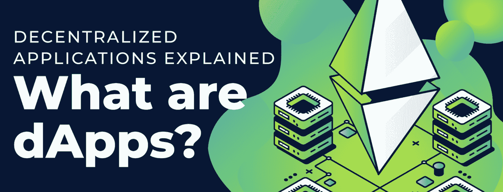
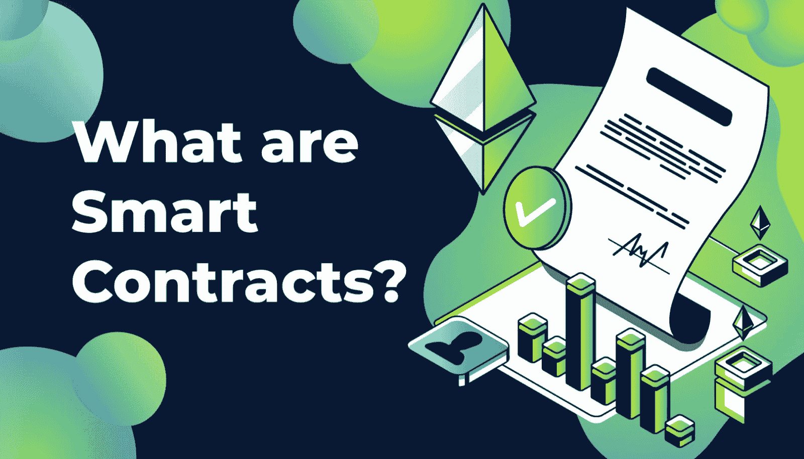

# Web3 是如何工作的？–web 3 解释道

> 原文：<https://moralis.io/how-does-web3-work-web3-explained/>

**如果你还没有，在不久的将来你会熟悉的一个术语是“** [**Web3**](https://moralis.io/the-ultimate-guide-to-web3-what-is-web3/) **”。Web3 标志着互联网的范式转变，它通常被称为去中心化的网络。随着新的去中心化应用的快速发展，Web3 正在蓬勃发展。然而，“网络 3”到底意味着什么？Web3 是如何工作的？开发者是如何创建 Web3 dApps 的？这是我们在这篇文章中要回答的三个问题。所以，如果你想了解更多关于去中心化网络的知识，请跟随我们解释 Web3 的基本方面。**

随着技术的进步，互联网也在不断变化和发展。顾名思义，Web3 是互联网的第三次也是最新的重大范式转变，它有两个在先的“阶段”,即 Web1 和 Web2。在互联网的历史上，没有具体的时间标记来标志这些转变；然而，它们具有独特的定义特征。网站 1 是静态的，网站 2 是动态的，网站 3 是分散的。

你很可能更熟悉 Web2，因为这是目前互联网的主导阶段。然而，Web3 正在快速发展，去中心化接管只是时间问题，Web3 将成为标准。

此外，随着 Web3 的发展和 [Web3 开发](https://moralis.io/how-to-build-decentralized-apps-dapps-quickly-and-easily/?utm_source=blog&utm_medium=post&utm_campaign=How%2520to%2520Build%2520a%2520Crypto%2520Wallet%2520in%25204%2520Steps)变得更加容易，Web3 正获得越来越多的关注。一个突出的例子是 [Moralis](https://moralis.io/) ，dApp 开发的最佳操作系统。Moralis 为用户提供了一个可扩展的后端基础设施，允许他们最大限度地减少所有区块链项目的开发时间。该操作系统还提供了一套广泛的开发工具，如 [NFT API](https://moralis.io/ultimate-nft-api-exploring-moralis-nft-api/) 、[快速节点](https://moralis.io/speedy-nodes/?utm_source=blog&utm_medium=post&utm_campaign=Ultimate%2520NFT%2520API%2520%25E2%2580%2593%2520Exploring%2520Moralis%25E2%2580%2599%2520NFT%2520API)和[价格 API](https://moralis.io/introducing-the-moralis-price-api/) 。此外，Moralis 是构建伟大的 Web3 UI 最简单的方法。

所以，如果你想进入 Web3，一个很好的起点是 Moralis！但是事不宜迟，让我们试着回答这个问题“Web3 是如何工作的？

### 什么是 Web1 和 Web2？

正如在简介中提到的，互联网在不断变化，已经从 Web1 发展到 Web2，现在又迅速过渡到 Web3。所以，要回答这个问题“什么是 Web3？”我们应该从头开始，解释它的前辈。

Web1 是互联网的第一阶段，这个时代的特征主要是提供信息。这一阶段的网络体验缺乏互动元素，互联网仍然是获取信息的主要来源。因此，互联网的早期被认为是相对静态的。

随着社交媒体的兴起，互联网摆脱了 Web1 的静态性质，过渡到了互联网的第二阶段——web 2。这一时期的特点是交互性，它将静态的本质转变为更加动态的网络体验。因此，用户现在有机会互动和撰写自己的内容，而不仅仅是消费信息。

此外，Web2 仍然是今天大多数人熟悉的主要阶段。然而，除了动态性，Web2 的另一个普遍特征是集中化。集中化可能很好，但在这种情况下，似乎弊大于利。隐私、透明度和单点故障问题部分源于大型社交媒体集团积累了大量个人信息和数据。

由于 Web2 的集中性质而产生的这些问题是目前推动向 Web3 转移的一些主要问题，而 web 3 的重点是去中心化。那么，Web3 到底是什么，它是如何工作的？

## 什么是 Web3，它是如何工作的？

集中化是互联网当前状态的主要关注点，源于这种结构的缺陷是推动向 Web3 转变的原因。由于集权是这些问题的根源，因此合理的假设是解决办法是分权。因此，Web3 旨在创建一个去中心化的网络，数据不归中心化的公司或实体所有，而是在用户之间共享。

Web3 的核心是区块链，同样的技术为加密货币和不可替代的 Tokes 奠定了基础。出于这个原因，人们将 Web3 与 crypto 联系在一起并不罕见。此外，区块链是在节点网络中共享的分布式分类帐或数据库。节点通过保持链中所有事务和事件的不变记录来保持网络安全。因此，区块链技术实现了 Web3 的主要思想，即保持数据分散，而不是像 Web2 的一般做法那样集中在大型服务器群中。

区块链技术使数据流变得极其透明，因为所有信息都是公开可用的。透明的性质还防止了滥用，并限制了例如实施欺诈的可能性。

此外，除了区块链技术，Web3 的另外两个基本组件是 dApps 和智能合约。顾名思义，dApps 本质上是去中心化的应用。然而，为了让你更好地理解 Web3 是如何工作的，我们将在下面的两个部分中进一步详细分解这两个附加组件，从 dApps 开始。

## Web3 是如何工作的？— dApps

[dApps](https://moralis.io/decentralized-applications-explained-what-are-dapps/) 或者说去中心化的应用和大多数应用一样；然而，与传统应用程序不同的是，它们带有 Web3 和区块链功能。此外，它们不是基于集中式系统，而是分布或散布在更广泛的基于区块链的 P2P 网络中的许多不同节点上。因此，dApps 的后端代码存在于网络上，而不是集中的服务器群上。

dApps 在大型网络中的分散提供了许多好处。首先，由于系统将数据和信息分布在各个节点上，因此不存在单点故障。这使得破解应用程序和审查内容变得更加困难。其次，由于我们将所有交易保持在链上，这使得这些系统更加透明，这是限制欺诈行为的一个因素。

此外，dApps 的另一个特性是它们拥有内部令牌经济的能力，这一点非常有用。dApps 使用内部令牌有几个原因，其中一个例子是作为一种治理机制。因此，可以向用户分发令牌来管理应用程序。这表明实际用户对改变 dApp 的提议进行投票，使其成为一种更民主的方式。

如果你正在寻找开发 dApp，dApp 开发最突出的链是[以太坊](https://moralis.io/full-guide-what-is-ethereum/)。该网络拥有一个庞大的 dApps 生态系统，在这里你可以找到创新和独特的想法。一个令人兴奋的领域是 DeFi。DeFi 部门在过去几年中发展迅猛，为完全去中心化的金融业奠定了基础。

此外，如果你想了解更多关于 dApp 开发的知识，请查看下面的指南[如何创建以太坊 dApp](https://moralis.io/how-to-create-ethereum-dapps/)。这篇文章将为你构建自己的基于以太坊的应用程序提供基础！

## Web3 是如何工作的？—智能联系人

除了 dApps，我们还需要解释一个额外的关键部分来回答“Web3 是如何工作的？”是智能合约。由于这种情况，我们将利用文章的这一部分来更深入地研究智能合约，并回答这个问题:“什么是智能合约？”。

智能合同是双方之间的成文协议。因此，智能合同的要点与传统合同相同；然而，主要的区别是区块链上的代码建立了条款和条件。此外，为了使智能合约的解释更容易理解，我们将使用以太坊合约作为例子。

所有以太坊智能合约一般由两部分组成；代码和数据。契约的代码是函数的积累，数据是契约的状态。所有以太坊智能合约都驻留在一个特定的地址上，它们是一种特殊类型的账户。这为他们提供了持有资金和进行交易的功能。然而，智能合约和普通账户的关键区别在于前者是由代码管理的。

澄清和描述智能合约的一个很好的类比是自动售货机，因为它们以类似的方式工作。因此，我们可以通过所需的输入获得所需的输出，类似于传统的自动售货机。

而且，开发人员一般用 [Solidity](https://moralis.io/solidity-explained-what-is-solidity/) 编程语言编写智能合约。Solidity 是一种面向对象的语言，在智能合同开发中有详细说明，它也兼容其他基于 [EVM](https://moralis.io/evm-explained-what-is-ethereum-virtual-machine/) 的区块链。但是，也有例外，其他语言如 [Rust](https://www.rust-lang.org/) 。

如果你对智能合同有进一步的兴趣，想了解更多，请仔细阅读下面的指南[如何创建智能合同](https://moralis.io/how-to-create-smart-contracts/)。

## 如何成为一名 Web3 开发者？

如果你想探索 web3 是如何工作的，很有可能你想成为一名区块链开发者。因此，我们将借此机会概述 Web3 开发最重要的方面和必要的技能。所以，事不宜迟，让我们看看如何成为一名区块链开发者。

说到 dApp 开发，可以将过程分为三个主要部分:前端、后端和智能合约开发。因此，我们将简要介绍这三个领域，从后端开始:

*   后端开发(back end Development)—至少从传统的角度来看，后端开发是创建 Web3 应用程序最繁重的部分。然而，情况不再是这样了，因为 Moralis 平台为您完成了大部分繁重的工作。Moralis 提供了无限可扩展的后端基础设施和功能，开箱即用。因此，您不需要“重新发明轮子”,因为该平台提供了一个坚实的基础。
*   **前端开发** —如果你有编程经验，那么你会很快掌握前端区块链开发！Web3 和 Web2 的前端开发没有太大区别。因此，你可以利用你可能已经精通的语言，比如 [JavaScript](https://moralis.io/javascript-explained-what-is-javascript/) ，HTML，和 [CSS](https://moralis.io/cascading-style-sheets-what-is-css/) 。然而，一个区别是你需要一些 Web3 库 [web3.js](https://moralis.io/web3-and-javascript-what-is-javascript-and-web3-js/) 的知识。
*   智能合同开发最后，你还需要能够开发智能合同。因此，学习像 Solidity 这样的语言是非常有益的。然而，如果你愿意，你可以在 Moralis 了解更多关于区块链发展的[最佳语言](https://moralis.io/best-languages-for-blockchain-development-full-tutorial/)。此外，额外的开发工具，如[松露套件](https://moralis.io/truffle-explained-what-is-the-truffle-suite/)、[加纳切](https://moralis.io/ganache-explained-what-is-ganache-blockchain/)、[混音](https://remix.ethereum.org/)和[毛毛雨](https://moralis.io/drizzle-explained-what-is-drizzle/)可以帮助开发智能合约。

## Web3 是如何工作的？—摘要

互联网在不断变化，经历了几个不同的“阶段”。互联网的第一阶段是 Web1，用户主要通过浏览网页来获取信息。随着技术的进步和社交媒体的诞生，互联网从相对静态发展到动态。因此，交互性成为网络体验的一个重要方面，允许人们写自己的内容，而不仅仅是接受信息。这是 Web2 的第二阶段，这是我们目前所处的阶段。

然而，集中化也是 Web2 中的一个常见主题，它会导致隐私、单点故障、透明性等问题。因此，互联网目前正经历着向第三阶段——web 3——的范式转变。Web3 保留了 Web2 的动态元素，但专注于 Web 的去中心化。这消除了我们在大型网络中传播数据时对集中化的担忧。

区块链技术为网络去中心化奠定了基础，这一领域目前正蓬勃发展。因此，Web3 成为互联网标准只是时间问题。此外，Web3 的另外两个重要方面是 dApps 和智能合约。新的 dApps 不断被开发出来，Web3 开发是编程界最热门的领域之一。因此，对于想要进入 dApp 开发的人来说，有无限的机会。

如果你想成为一名区块链开发者，那么从 Moralis 开始是合适的。该平台使区块链开发变得更加容易，并允许您减少所有未来项目的开发时间。此外，在 [Moralis 博客](https://moralis.io/blog/)，你会发现各种令人兴奋的指南，如 [Web3 认证](https://moralis.io/web3-authentication-the-full-guide/)、 [ERC-20 令牌](https://moralis.io/erc20-exploring-the-erc-20-token-standard/)、[智能合同索引](https://moralis.io/the-graph-alternative-for-smart-contract-indexing/)等等！

因此，如果您还没有注册，那么[现在就向 Moralis](https://admin.moralis.io/register) 注册，开始您的 Web3 开发之旅！