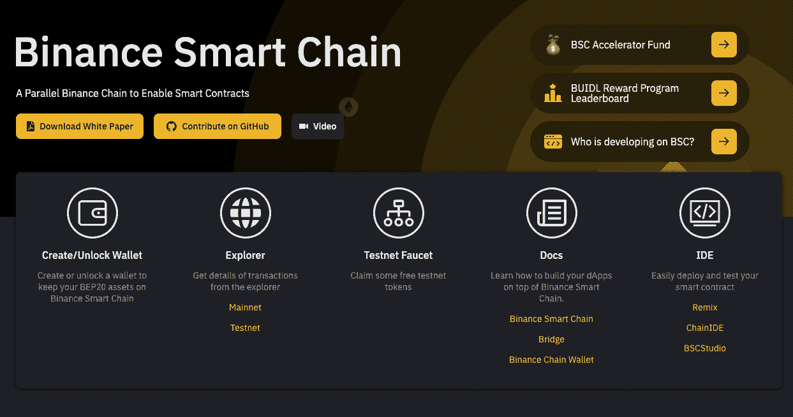
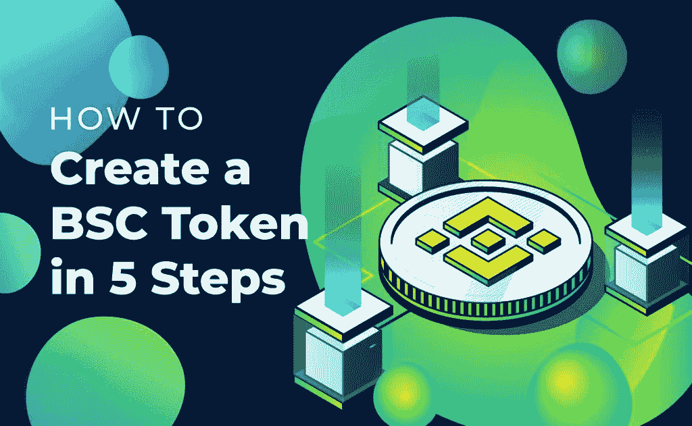
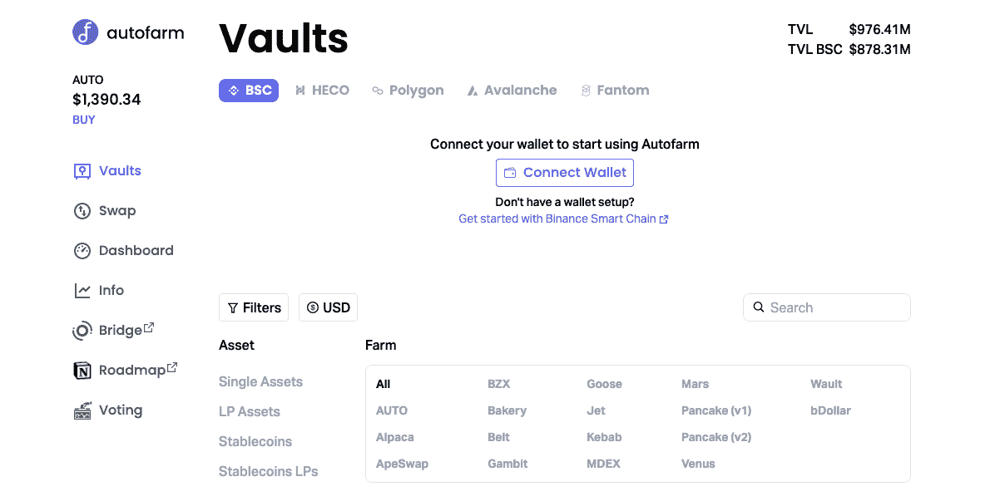

# BEP20 是什么？完整的币安智能链令牌指南

> 原文：<https://moralis.io/what-is-bep20-full-binance-smart-chain-token-guide/>

**[**web 3**](https://moralis.io/the-ultimate-guide-to-web3-what-is-web3/)**生态系统随着币安智能链(BSC)等区块链的出现而蓬勃发展。虽然以太坊是第一个尝试创建运行** [**智能合同**](https://moralis.io/smart-contracts-explained-what-are-smart-contracts/?utm_source=blog&utm_medium=post&utm_campaign=Want%2520the%2520Latest%2520in%2520%253Cspan%253EBlockchain%2520Development%253F%253C%252Fspan%253E) **并以 ERC20 作为其本机令牌的互联网计算机，但随着开发人员发现在 BSC 上创建 BEP20 令牌比在以太坊上创建 ERC20 令牌更有优势，具有 BEP20 令牌标准的 BSC 也越来越受欢迎。然而，你可能会想，“BEP20 是什么？”或者您可能已经知道 BEP20 是什么，并且想要立即创建自己的 BEP20 令牌。不管是什么情况，在这份完整的币安智能链令牌指南中，我们将回答“什么是 BEP20？”我们将为您提供一个快捷方式，以便您可以毫不费力地** [**创建 BEP20 令牌**](https://moralis.io/bep20-testnet-create-a-bep20-token-in-15-mins/) **。****

**要构建快速、高效、吸引人的项目，您需要灵活性。使用 BSC 和 BEP20 扩展了可能性，并通过跨链或多令牌选项丰富了您的构建。使用 Moralis 进行 BSC 开发可以进一步增强您的项目，因为 Moralis 使开发过程显著加快，而不会影响质量或安全性。Moralis 的终极 Web3 开发平台通过 [Moralis Speedy Nodes](https://moralis.io/speedy-nodes/) 以及 [Moralis 的 Price](https://moralis.io/introducing-the-moralis-price-api/) 和 [NFT API](https://moralis.io/ultimate-nft-api-exploring-moralis-nft-api/) 支持您的 BSC 构建！**

**在本指南中，您将了解 BEP20 以及它如何连接到 BSC 和币安的原始链，币安链。此外，您将大致了解 Moralis 如何帮助您开始创建 BSC 和 BEP20 令牌。**

## **BEP 基础–什么是 BEP20？**

**BEP20 是在 BSC 上创建令牌的标准，或者使用[币安智能链开发](https://moralis.io/bsc-programming-guide-intro-to-binance-smart-chain-development-in-10-minutes/)。代币是任何基于区块链的系统、dApp、平台或经济的重要组成部分。它们促进了价值的流动，并有助于跟踪区块链上的每一项活动。换句话说，它们是进行多种交易的关键。**

**缩写“BEP”是“币安智能链演进提案”的简称。BEP20 是币安为币安智能链创建的令牌标准，该智能合约平台与最初的币安链并行运行。在本文的后面，我们还将介绍 BEP2 令牌标准。然而，首先，你应该了解币安智能链的背景，以充分了解它。**

### ****什么是币安智能链？****

**为了了解 BEP20，让我们先来看看币安智能链的属性以及它的创建原因。简单地说，币安智能链，或 BSC，是一个区块链运行智能合同。它与币安第一台用于其非托管交易所的区块链币安链协同工作或并行工作。**

**

币安链是建立在一个想法:优化在币安的非托管平台上的快速交易。借鉴之前其他基于以太坊的项目，币安在设计中注重防止网络拥塞。因此，通过放弃扩展的功能，币安链可以在不降低速度的情况下处理高事务吞吐量。由于这种优化，币安链不够灵活，无法支持全面的 DEX(分散式交易所)的推出。币安意识到，他们需要构建一个新的链，专门用于容纳自动化交易的智能合同。因此，为此，币安创建了币安智能链(BSC)。BSC 现在是其分散交换或 DEX 项目的基础。

#### **双链架构**

今天，币安采用了独特的双链架构，支持两个链，币安链和币安智能链。该架构使用本机令牌(BNB)来支持这两者。

虽然每个链都是相互独立的，但是这个基础设施是通过一个桥来运行的。这座桥使链条互补。这座“[币安大桥](https://www.binance.org/en/bridge)”，原名“巴拿马计划”，采用了自己独特的力学原理。它利用包装技术在区块链转移资产。

作为补充基础设施，BSC 独立于币安链运行。这是一个独立的链，而不是第二层平台。因此，如果币安链有问题或离线，它仍然完全不受影响。

币安智能链兼容 [EVM](https://moralis.io/evm-explained-what-is-ethereum-virtual-machine/) (以太坊虚拟机)。因此，您可以移植一个 dApp 或使用 MetaMask 与之无缝交互。目前 BSC 上的共识算法是“PoSA”，代表“赌注授权证明”，是以太坊的“PoS”(赌注证明)算法的变种。这意味着验证者通过下注 BNB 硬币来保护网络。网络如何为这些验证者提供激励？网络向他们提供每个有效区块的累计交易费用。BNB 硬币意味着通货紧缩，因此随着币安定期进行硬币燃烧，其价值可能会增加，从而进一步减少其固定供应。这种机制为 BNB 持有者提供了另一种激励。

#### **BEP2 和 BEP20**

币安链采用 BEP2 令牌标准，币安智能链采用 BEP20 标准。如前所述，BNB 是两者的燃料。因此，如果您想在任一条链上进行交易，您需要获得一些 BNB。

这些令牌标准完全兼容。因此，当您在链之间切换时，您可以无缝地使用它们。在币安链上，你必须使用它的本地令牌 BEP2。在 BSC 上的时候，需要用 BEP20。因此，如果您正在与 dApp 交互，您将需要使用 BEP20，因为它是智能链的对等物。

## **BEP 20 令牌标准是什么？**

BEP20 是币安智能链的令牌标准。在许多方面，它类似于以太坊的 ERC20 标准；在其他方面，它扩展了它。BEP20 设置了所有在 BSC 上创建的令牌都需要遵循的规则。

BSC 上的 BEP20 令牌标准适用于在币安智能链平台上推出或创建的任何令牌。这种令牌的例子有实用令牌、稳定令牌和安全令牌。另一类硬币被称为“佩吉硬币”，也是使用 BEP20 标准制造的，可以与不同的资产挂钩。

正如以太坊收取汽油费一样，BNB 为币安智能连锁网络上涉及 BEP20 代币的交易付费。

创建一个 BSC 令牌或 BEP20 令牌相对容易，通过简单的在线搜索，你会找到几个关于 T2 BEP 20 令牌开发的有用的 web 教程。然而，如果你想要一个快速指南，Moralis 的 [BEP20 Testnet](https://moralis.io/bep20-testnet-create-a-bep20-token-in-15-mins/) 教程是目前可用的最实用和信息量最大的教程之一。

### **BEP 20 令牌标准的参数**

如果您正在考虑在 BSC 上创建令牌，了解 BEP20 令牌标准参数会有所帮助，例如:

*   **制罐**—“制罐”参数会引起通货膨胀，它指定是否可以铸造新的代币来增加 BEP20 的供应量。
*   **可以燃烧**—“可以燃烧”参数是一个紧缩参数，指定是否可以燃烧令牌，从而导致供应随着时间的推移而减少。
*   **黑名单**—“黑名单”参数使您能够禁止或黑名单恶意地址。
*   **Can Pause**–在平台易受攻击的恶意攻击或事件中,“Can Pause”参数非常有用。这指定了在平台受到恶意攻击或损害的情况下，是否可以暂停所有与令牌相关的操作。该参数是集中的，因为被给予类似权限的创建者或用户地址具有冻结操作的权力。

### **BEP20 vs ERC20**

由于 BEP20 是在 ERC20 之后设计的，因此可以理解它们有许多相似之处，例如以下功能:

*   **“total supply”函数**–该函数返回智能合约中的令牌总数。
*   **“balance of”功能**–提供关于用户地址内可用令牌数量的信息。
*   **Name**–为您正在创建的令牌添加一个人类可读的名称。
*   **符号**–为您的令牌创建股票代码。
*   **Decimal**–设置令牌的整除性。因此，它设置了小数位数。
*   **转移**–允许在 BSC 用户之间转移令牌。它特别要求调用方也是令牌的所有者。
*   **“转账自”功能**–用于由经批准的人员或经批准的智能合同自动转账。在这种情况下，您可以允许套餐或其他方自动从钱包或帐户中扣除款项。
*   **Approve**–通过任何智能合约限制从您的余额中提取代币的金额或数量的功能。
*   **津贴**–在授权智能合约花费了您一定数量的代币后，检查交易中未用完部分的功能。

### **BEP20 和 ERC20 的主要区别**

BEP20 和 ERC20 令牌之间的一些关键区别是:

*   函数“getOwner”是 BEP20 中唯一的必需规范。它返回 BEP20 令牌的所有者。
*   名称、符号和十进制函数在 ERC20 上是可选的，而在 BEP20 上是强制性的。

## **币安智能链上的项目和 dApps】**

您现在已经熟悉了币安智能链的演进协议或 BEP20 令牌标准。此外，您还了解了币安智能链相对于币安链的工作方式，以及 BEP2 和 BEP20 令牌如何相互交互，以及它们如何与 BNB 交互。

币安智能连锁是一个很有前途的连锁，用户群快速增长，交易量不断增加，TVL(总价值锁定)不断上升。此外，开发人员也在 BSC 上构建更多的 dApps。请注意，大多数 dApps 需要连接到 BEP20 钱包。

有了这里获得的信息，您就可以开始下一步了，创建自己的 BEP20 令牌。然而，在我们解释如何创建 BEP20 令牌之前，让我们看看币安智能链上一些知名的 dApps 和项目。

### **PancakeSwap**

PancakeSwap 是 BSC 上最成功的 dApp 之一。这是一个 AMM，或自动做市商，是互联网领先的指数之一。其功能允许用户在 BSC 上交换令牌。在撰写本文时，它服务于数百万用户、数千万笔交易，在 TVL 拥有高达 150 亿美元的资产。

此外，PancakeSwap 刚刚推出了 NFT 市场，这对该平台的粉丝来说是个好消息。此外，如果你是一名希望在 BSC 上创建一个索引的开发人员，PancakeSwap 应该是你的灵感之一。

### **自动武装**

[Autofarm](https://autofarm.network/) 既是 DEX 又是收益率聚合器。资产可以用作流动性和抵押品，金库在平台上执行自动化操作，包括复利收益率。该 DeFi 平台支持 [MetaMask](https://moralis.io/metamask-explained-what-is-metamask/) 、币安智能链或 BEP20 钱包、WalletConnect。

### **BEP20 货币市场协议**

如果你对货币市场感兴趣，维纳斯的协议应该是一个有用的模型。它提供借贷服务，类似于 Compound 和 Aave。区别在于，Venus 是建立在 BSC 之上的，而它的大多数竞争对手都是基于以太坊的。

此外，金星是一个基于算法的货币市场系统。加密资产可以作为抵押品提供给网络。这种抵押品可以通过抵押超额抵押的数字资产来借入。提供给市场的抵押品也可以用来借入其他资产和铸造合成稳定的硬币。维纳斯有两个 BEP20 代币:XVS 和 VAI。XVS 是治理的象征，而 VAI 则是这个网络中与美元挂钩的稳定货币。

#### **BEP 20 令牌示例**

此外，许多 BEP20 令牌已经获得成功。顶级令牌包括:

*   蛋糕
*   BUSD
*   安全月
*   WBNB
*   希腊字母的第一个字母
*   汉堡包
*   合杀威杀虫剂

考虑到这些平台和令牌的成功，更多的开发人员受到启发，以 BSC 为基础构建并创建他们独特的 BEP20 令牌。但是，请记住，构建 DeFi 项目有其自身的风险。作为一个创作者，你需要考虑这样的风险，并通过精心的设计来减轻这些风险。

## **打造自己的 BEP20 令牌**

到目前为止，您应该对创建 BEP20 令牌的最佳方式感到好奇。有一些有效的方法可以做到这一点，但是创建 BEP20 令牌的最好方法是使用 Moralis，它是当今最全面的 Web3 操作系统。

你需要使用诸如 Remix 和 OpenZeppelin 这样的工具，你还需要一些扎实的技能。幸运的是，可以使用智能合同模板，因此只需要很少的编码。此外，您需要连接到 MetaMask。此外，使用 Moralis 作为您的 Web3 平台，这应该不成问题，因为它提供了一种无缝的方式来使用 MetaMask 进行[认证。](https://moralis.io/how-to-authenticate-with-metamask/)

此外，随着 BSC 市场开始创建自己的 NFT，Moralis 可以通过 Moralis 的 NFT API 帮助您将 BEP20 或 BSC 项目提升到一个新的水平。因为 Moralis 是跨链构建的，所以您可以轻松地将非 BSC 项目或其他令牌集成到您的 BEP20 或 BSC 构建中。除了让你[创建 BSC dapp](https://moralis.io/how-to-create-bsc-dapps-quickly/)之外，Moralis 还帮助你[创建 BSC NFT](https://moralis.io/how-to-create-a-bsc-nft-in-less-than-20-minutes/) 在 BSC 市场上市。

### **在币安智能链上推出一枚 BEP20 硬币**

您现在已经准备好在币安智能链上创建和启动 BEP20 令牌。要做到这一点，请跟随下面的视频，因为 Ivan(来自 Ivan on Tech and Moralis)以简单的方式解释了如何构建 BEP20 令牌:

https://www.youtube.com/watch?v=h4gQD7R1r94

Moralis 确保您的 BSC 和 BEP20 令牌项目是快速的、跨链兼容的、面向未来的。面对不断发展的区块链空间，Web3 和 DeFi 项目变得越来越复杂和跨链，让 Moralis 的终极 Web3 操作系统通过处理后端来为您完成繁重的工作。

## **BEP 20 是什么？–完整的币安智能链令牌指南摘要**

您现在已经熟悉了币安智能链和 BEP20。此外，您现在理解了为什么某些开发人员在开发 dApps 和项目时选择 BEP20 令牌标准。此外，BEP2 和 BEP20 是其各自链条的标准，例如币安链条和币安智能链条。我们还查看了 BEP20 令牌标准的基本参数，并概述了 BEP20 和 ERC20 之间的差异。BEP20 标准在许多方面类似于以太坊的 ERC20 标准，但它也在此基础上进行扩展。

此外，通过对成功项目(如 PancakeSwap)的简要概述，您获得了灵感，因此您可以在 BSC 上创建和启动自己的 dApp。

在结束本文之前，我们想通知您一些重要的后续步骤，以便您可以进一步推进您在区块链的职业生涯。初入区块链或仍在摸索这个领域的程序员应该查找关于[可靠性](https://moralis.io/solidity-explained-what-is-solidity/)、[智能合约](https://moralis.io/smart-contracts-explained-what-are-smart-contracts/)和 [JavaScript](https://moralis.io/javascript-explained-what-is-javascript/) 的教程。此外， [Ivan on Tech Academy](https://academy.ivanontech.com/) 提供关于如何将 Solidity 和 JavaScript 技能应用于区块链项目的深入教程，并提供课程，如[面向区块链开发者的 JavaScript 编程](https://academy.ivanontech.com/courses/javascript-programming-for-blockchain-developers)和[以太坊智能合约编程 101](https://academy.ivanontech.com/courses/ethereum-smart-contract-programming-101) 。此外，Moralis 博客提供了大量免费指南——从分解 [Ethers.js 与 Web3.js](https://moralis.io/javascript-libraries-ethers-js-vs-web3-js/) ,展示为什么 Moralis 是 BSC 替代方案的最佳 [Infura，或者教授](https://moralis.io/infura-bsc-alternatives-the-best-alternative-to-infura-for-bsc/)[以太坊认证](https://moralis.io/ethereum-authentication-full-tutorial-to-ethereum-login-programming/)编程。

如果你已经有了使用 Solidity 和 Ethereum 的经验，你会很高兴知道使用币安智能链和 BEP20 不需要太多的学习曲线。使用 Moralis，这条曲线明显更快、更令人兴奋，它为您的 BSC 和 BEP20 项目添加了强大的功能。**