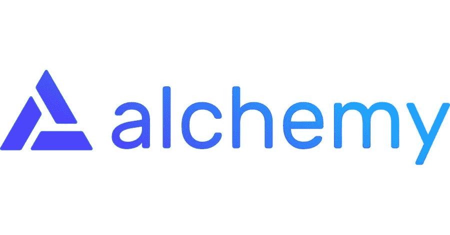
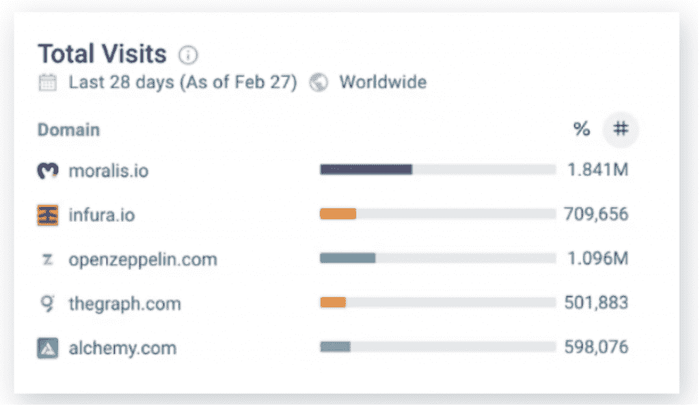
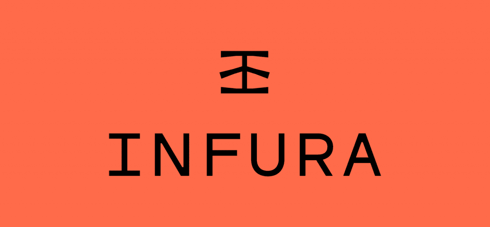
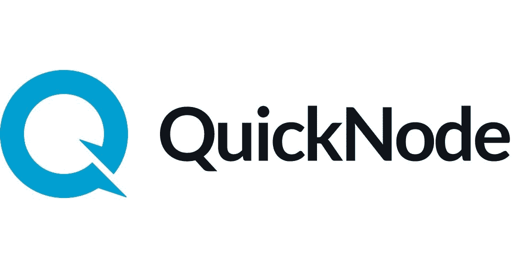
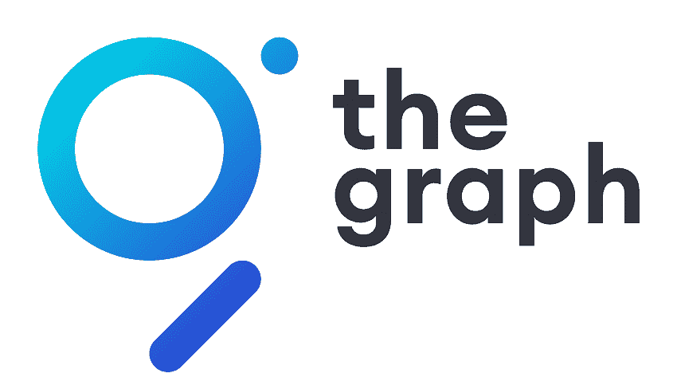
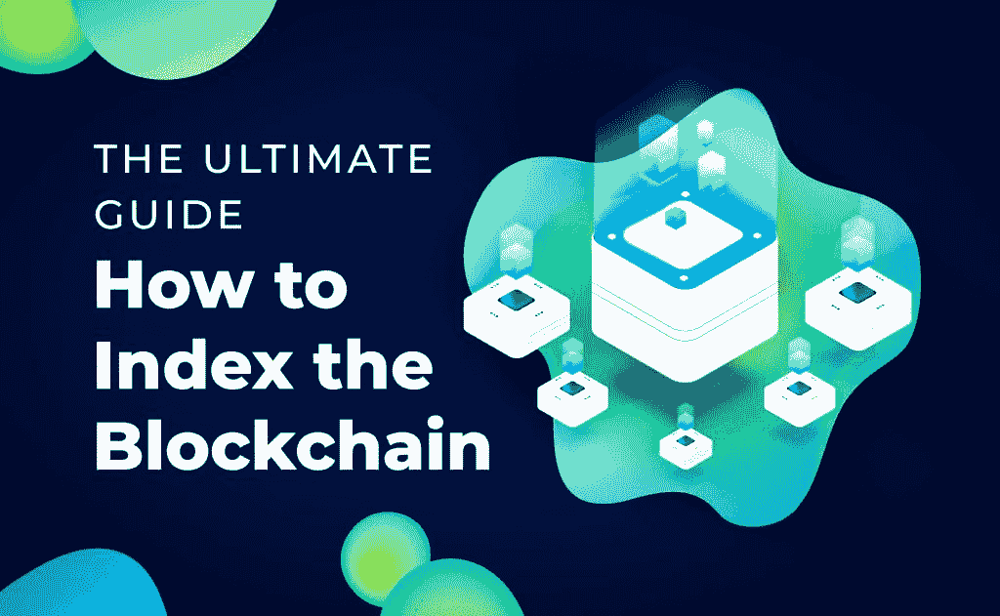

# 炼金术替代品–顶级区块链 API

> 原文：<https://moralis.io/alchemy-alternatives-top-blockchain-apis/>

缩短上市时间对 Web3 开发者来说至关重要。因此，你需要找到最适合你的 Web3 开发平台。作为一个 [**【区块链】开发者**](https://moralis.io/how-to-become-a-blockchain-developer/) **，你需要选择一个好的节点提供商和 Web3 平台，帮助你构建、管理和扩展，这一切都在一个包里。因此，炼金术的平台浮现在脑海中。然而，在你选择的时候，你也应该考虑炼金术的选择。在这里，我们列举了顶级炼金术替代方案和区块链开发平台，并讨论了它们的优缺点。**

在 [Web3](https://moralis.io/how-does-web3-work-web3-explained/) 上工作时，你可能会发现一路上的困难。例如，您可能会发现，采用运行自己的 RPC 节点这种繁琐的方式是低效的。这很费时间，很复杂，而且会占用你电脑上的大量存储空间。此外，您可能会在同步以太坊时遇到困难，从而进一步延迟您的项目。

幸运的是，有替代方案可以解决这个问题。在这里，我们将讨论流行的区块链节点提供商和 Web3 开发平台 Alchemy。然而，我们也将考虑区块链节点提供者和 Alchemy 替代品，如 Moralis、Infura、Quicknode 和 Graph。随着区块链开发商寻找最佳选择，这些选择正迅速获得动力。此外，这种炼金术的替代品提供了全面的功能，可以与炼金术媲美，甚至超过炼金术，正如你从我们的列表中所了解的那样。

开发人员不再从零开始运行区块链节点，而是依靠这样的通用提供商来提供服务，以最小的努力支持、加速和扩展他们的项目。如果你正在构建[去中心化应用](https://moralis.io/decentralized-applications-explained-what-are-dapps/?utm_source=blog&utm_medium=post&utm_campaign=How%2520to%2520Build%2520Cross-Chain%2520dApps) (dApps)，期待[开发自己的 NFT 市场](https://moralis.io/develop-your-own-nft-marketplace-step-by-step-guide/)，[创建一个 DAO](https://moralis.io/how-to-create-a-dao-in-10-minutes/?utm_source=blog&utm_medium=post&utm_campaign=DAO%2520Smart%2520Contract%2520Example%2520%25E2%2580%2593%2520DAO%2520Guide) ，去中心化交换、 [GameFi](https://moralis.io/what-is-gamefi-and-play-to-earn-p2e/) ，或者 Web3 上的 P2E (play-to-earn)项目，这篇文章是为你准备的。

## 炼金术的替代品——它们为什么重要？

今天，基于 Web3 的构建就是快速启动项目，让你的 dApps 在竞争日益激烈的市场中脱颖而出。认识到快速启动 dApp 的重要性至关重要。否则，有人会在第一个上市时击败你，可能会让你失去成为领跑者的机会。此外，你的竞争对手已经创造了他们的 MVP，很早就接触到了投资者和用户。

在 Web3 领域脱颖而出的最佳方式是快速行动，快速营销，并通过一个优秀而有吸引力的前端吸引用户。为此，你需要使用适当的工具来增强你的构建。因此，您需要使用 Alchemy 或 Alchemy alternatives 之类的平台来确保您拥有运行可靠的区块链节点所需的所有构件。然而，这样的平台需要提供的不仅仅是节点服务。他们需要为您的整个旅程提供全面的支持，确保您始终领先一步。

## **什么是炼金术？**

Alchemy 是区块链领域一家著名的节点提供商。2019 年，它大张旗鼓地推出，承诺“秘密修复区块链的节点噩梦”。因此，声誉良好的加密和区块链公司开始将项目外包给他们，包括当时的领导者 CryptoKitties、Augur、0x 和 Kyber Network。

虽然他们最初主要是作为节点基础设施提供商，用更敏捷、更灵活的架构取代了缓慢的架构，但他们在 2020 年推出了一整套开发工具。Alchemy 现在承诺为区块链开发者提供更全面的体验。此外，他们的一些关键营销点包括即时测试网、高消费者满意度得分、增强的 API 以及平均快 25%的开发时间和 99.9%的可靠性。

根据其网站，Alchemy Supernode 是“用于以太坊、多边形、Arbitrum、乐观、流和 Crypto.org 的最广泛使用的区块链 API”。此外，它承诺其 Alchemy Build 产品的调试时间更少，构建时间更多。这有助于那些想开发以太坊 dApps 的人。

此外，Alchemy 将其新的 NFT 相关产品作为一个突出的使用案例。炙手可热的 NFT 市场促使许多开发商学习如何创建 NFT，并深入研究如何在 T2 创建 NFT 市场。此外，区块链的开发者也开始理解, [ERC-1155](https://moralis.io/erc1155-exploring-the-erc-1155-token-standard/) 和 [ERC-721 令牌](https://moralis.io/erc-721-token-standard-how-to-transfer-erc721-tokens/)标准可以为数字艺术、财产和更多东西做些什么。

此外，Web3 开发人员对 NFT API 的功能知之甚少。因此，我们鼓励您阅读更多关于 [NFT API 替代品](https://moralis.io/nft-api-alternatives-comparing-alchemys-nft-api-with-moralis-nft-api/)的信息。

炼金术主要以以太坊为焦点而闻名；然而，他们确实支持其他区块链人。由于 Alchemy 非常关注以太坊的 mainnet 和 testnet，Moralis 等替代产品本身就是跨链的，非常适合您无缝构建跨链 dApps。

## **为什么要使用炼金术或炼金术替代品？**

对于区块链开发人员来说，主要的问题是，您是运行和维护自托管节点，还是依赖于节点提供商？

答案变得简单了，尤其是当你考虑到所涉及的费用、时间和复杂程度时。首先，自托管节点通常需要花费 4800 美元的工程时间。此外，根据 Alchemy 网站的数据，平均每年的总成本为 86，000 美元，每月的 AWS 成本为 2，000 至 5，000 美元。

自运行节点基础设施也占用了你团队的大量工程资源。此外，需要几个月的时间来使这个基础设施可靠和健壮。即便如此，还是有巨大的失败风险。例如，大约每隔几天就会出现节点问题。因此，您可能会遇到一些问题，如内部数据库损坏、错误和回归、很可能破坏“稳定版本”以及不一致的对等。此外，根据 Alchemy 的网站，还有磁盘问题、内存泄漏和 CPU 峰值需要担心。

“无痛”开发区块链、dApp 和 Web3 的唯一方法是相信专家。将繁重的工作留给平台和炼金术替代品(如 Moralis)要方便得多。

## 炼金术的替代方案——有哪些选择？

当搜索一个 Web3 开发平台时，了解那里还有什么是有帮助的。虽然 Alchemy 是解决 Web3 开发的最大项目之一，但 Alchemy 替代品为竞争对手 Alchemy 提供了全面的服务。更重要的是，每一个都有关键的不同点，这可能为开发人员创建他们的 Web3 项目或 dApps 提供独特的优势。

1.  **Moralis 伦理**

Moralis 是 Web3 开发平台竞赛中最强有力的竞争者之一。见证了开发者社区的大规模增长和采用，它正在赶上 Alchemy 和其他节点提供商，成为 Web3 开发和节点提供商选项的领头羊。

#### 最大的 Web3 开发平台

是什么让 Moralis 与众不同？在流量方面，Moralis 是目前最大的 Web3 开发平台，有数千个项目使用它作为他们的 Web3 基础设施提供商。此外，在区块链 API 平台中，它拥有最广泛的特性集和最高的易用性。因此，它被选为顶级炼金术的替代品之一。

虽然 Alchemy 为开发人员迈出了伟大的第一步，但今天竞争激烈且不断增长的 Web3 空间包括具有更全面功能集的平台，Moralis 提供了这些功能。目前，Moralis 在流量和参与度方面领先于 Web3 开发平台。截至 2021 年 12 月，SimilarWeb 的统计数据显示，Moralis 接待了超过 150 万(+1，500，000)的独立访客。相比之下，其他炼金术替代品，如 Infura 和 The Graph，每个都有大约 60 万独立访问者。此外，在同一时期，Alchemy 注册的独立访客不到 34 万。

### Moralis 的显著特征

Moralis 有许多令人兴奋的特点，使它区别于其他炼金术的替代品。此外，Moralis 允许用户只需一行代码就能添加或创建强大的 Web3 特性。因此，它对 Web3 开发有一个全面的 360 度方法。更何况它的跨链基础设施是无与伦比的。

#### 炼金术替代品中的佼佼者

除了作为节点提供商和 Alchemy 替代方案之一，Moralis 还提供以下服务:

*   无缝“同步”功能，允许您顺利地同步和索引智能合同事件。
*   完全集成的 [Web3 认证](https://moralis.io/web3-authentication-the-full-guide/?utm_source=blog&utm_medium=post&utm_campaign=Exploring%2520the%2520Web3%2520Tech%2520Stack%2520%25E2%2580%2593%2520Full%2520Guide)使用 MetaMask 或其他 Web3 钱包。
*   与其他 API 一起工作的能力，比如 Moralis open sea plugi n。
*   到项目前端的套接字连接。
*   让您[通过短信](https://moralis.io/get-web3-events-with-sms-messages/?utm_source=blog&utm_medium=post&utm_campaign=Exploring%2520the%2520Web3%2520Tech%2520Stack%2520%25E2%2580%2593%2520Full%2520Guide)和电子邮件推送通知(用于用户提醒)获得 Web3 事件。
*   一个强大的完整的数据库，以保存您的数据和纪事链上的事件。
*   从头开始构建跨链，所以当你[构建跨链 dapp](https://moralis.io/how-to-build-cross-chain-dapps/?utm_source=blog&utm_medium=post&utm_campaign=What%2520is%2520GameFi%2520and%2520Play-to-Earn%2520%28P2E%29%253F)时，它会提供更好的体验。
*   还有更多！

这些只是 Moralis 提供的众多特性中的一部分。除了这些功能之外，Moralis 还开发了令人印象深刻的产品来帮助您的每一步。

#### Moralis Web3 SDK

Moralis 的 Web3 SDK 功能丰富。在注册了 Moralis 之后，你只需要创建一个新的服务器来访问 Moralis 的全部功能。此外，通过单行代码，您可以进行各种查询，包括获取交易和令牌余额的用户信息。

Web3 SDK 还拥有业界组织最完善、导航最友好的文档之一。这样，学习曲线非常短，您将能够在项目开发期间轻松使用 Moralis Web3 SDK。

#### 炼金术替代品——Moralis 的跨链互操作性

如前所述，当您计划构建跨链 dApps 或项目时，Moralis 是最容易使用的平台。这是因为默认情况下，所有链都已经同步。因此，您可以使用 Moralis 的无缝系统简单地从一个链过渡到另一个链，并最大限度地减少未来的任何额外问题。这就是 Moralis 如何“检验”你的 dApp 和 Web3 开发的未来。

要了解 Moralis 非凡的 SDK 以及它如何超越节点提供商，成为最终的 Web3 开发平台，请观看此视频:

https://www.youtube.com/watch?v=txHnWDRB728

### 2\. Infura

Infura 是行业内 Alchemy 替代品中另一个著名的节点提供商。这是一家 ConsenSys 公司，默认情况下，专注于以太坊。Infura 解决了连接以太坊的问题，这是出了名的困难，通常同步很慢。此外，Infura 使连接以太坊区块链更容易，并提供速度、可伸缩性和存储方面的优势。它还有一个 IPFS API，目前处于测试阶段。

Infura 减少了同步以太坊节点的时间。有了内置的可伸缩性，区块链开发人员不需要雇用更大的团队或全职可靠性工程师来扩展。此外，Infura 还有助于提高存储效率。因此，它也降低了成本。

凭借其过往记录，很难不明白为什么 Infura 是炼金术替代品和以太坊建筑的首选。但在跨链支持方面，落后于竞争对手。因此，如果您计划现在或将来集成跨链支持，最好考虑其他的 [Infura 替代方案](https://moralis.io/infura-alternatives-and-blockchain-node-providers/)。如前所述，Moralis 天生是交叉链的，完全绕过了这个问题。

### 3.快速节点

QuickNode 作为一个节点提供者有着良好的声誉，并且被认为是 Alchemy 替代品的一个选择。像 Infura 一样，它提供可靠的节点支持。此外，它支持更多的区块链比 Infura。支持的链有 Solana，BSC，比特币，乐观，灵知，Celo，Polygon，Fantom，Terra 等。

<figcaption>QuickNode</figcaption>

不过，QuickNode 目前并没有为用户提供免费的套装选项。这个托管的区块链[基础设施即服务](https://moralis.io/iaas-explained-what-is-infrastructure-as-a-service/)提供七天免费试用，但没有免费计划。建议回顾一下 QuickNode 的特性，以了解它在速度和在企业基础设施中的使用方面的优势。

### 4.图表

该图是炼金术的另一种选择，被称为查询以太坊和 IPFS 的索引协议。有了这个图，你可以构建或发布开放的 API。这些开放的 API 被称为“子图”。

你可以把图表看作是区块链索引的工具。区块链索引是出了名的困难，即使对有经验的开发者来说也是如此。但是，出于以下原因，您需要对区块链进行索引:

*   分布式和不可变的数据是一把双刃剑。终结性、链重排和未调用的块使得检索准确的查询结果成为问题。
*   如此大量的分散数据分散地驻留在整个网络中。

因此，您需要一种可靠的方法来过滤或定位这些数据，以便对您的 dApp 或平台有用。因此，炼金术的替代品，如图表或 Moralis，有助于履行这一职能。此外，他们避免了从头开始学习如何索引区块链的复杂性。

该图的子图允许您为其他开发人员提供数据。此外，这些子图可以组成一个包含网络公共信息的全局图。GraphQL 编程语言也允许您通过几次击键来查询这样的数据。要了解更多关于图表作为智能合同索引的替代选择的信息，请查看 Moralis 博客。

## 炼金术替代品——总结

在寻找 Alchemy 替代方案时，有几个可靠的选项可以帮助您在 Web3 上构建并创建 dApps，而无需从零开始构建基础设施。然而，在这些炼金术替代品中，Moralis 脱颖而出，因为它拥有一个全面的 Web3 开发端到端解决方案。

此外，Moralis 结合了其他 Alchemy 替代方案的所有优势——集节点提供商、软件开发工具包(SDK)和区块链索引工具于一身。此外，Moralis 拥有最广泛的特性集和各种 API，以确保您的工具包中拥有构建优秀 dApps 所需的一切。

此外，根据最新数据，在所有 Alchemy 替代品中，它拥有最多的追随者和最高的网站访问量。因此，这使得 Moralis 成为迄今为止最令人兴奋的 Web3 开发平台。只需[在 Moralis 网站](https://admin.moralis.io/register?utm_source=blog&utm_medium=post&utm_campaign=How%2520to%2520Index%2520the%2520Blockchain%2520%25E2%2580%2593%2520The%2520Ultimate%2520Guide)上免费注册，就能了解其中的区别！