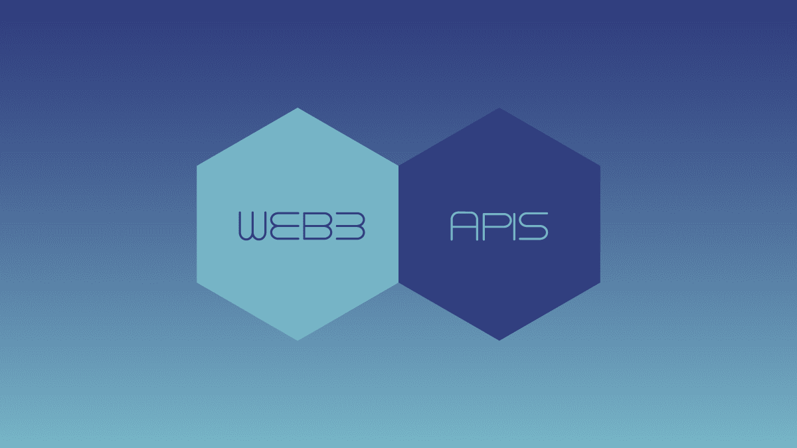
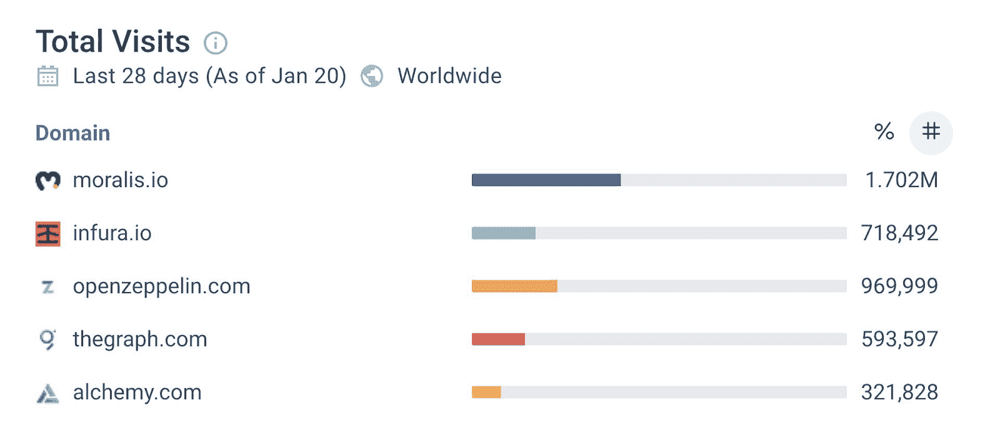
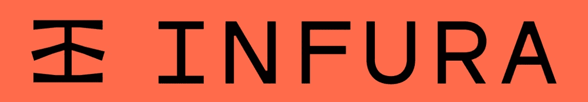
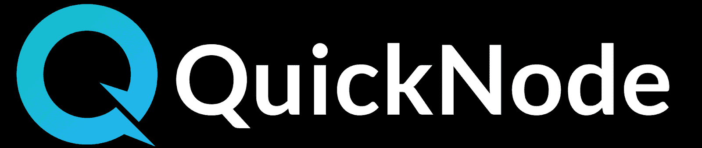
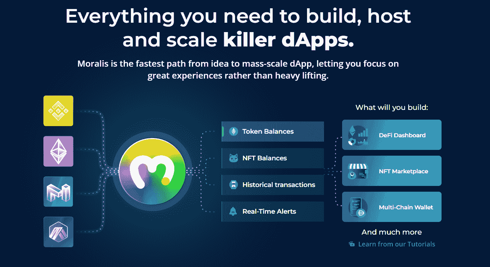

# Alchemy API 替代品–web 3 开发平台

> 原文：<https://moralis.io/alchemy-api-alternatives-web3-development-platforms/>

**不久前，每个区块链开发者都直接在** [**RPC 节点**](https://moralis.io/ethereum-rpc-nodes-what-they-are-and-why-you-shouldnt-use-them/) **之上构建。不幸的是，许多人仍然走这条路。因此，他们不得不处理 RPC 节点** **的** [**限制。然而，优秀的**](https://moralis.io/exploring-the-limitations-of-rpc-nodes-and-the-solution-to-them/)[**web 3**](https://moralis.io/the-ultimate-guide-to-web3-what-is-web3/)**开发平台及其工具可以使开发过程变得容易得多。您可能熟悉的另一种方法是 Alchemy API。虽然 Alchemy 是一个很好的** [**节点提供者**](https://moralis.io/infura-alternatives-and-blockchain-node-providers/) **并且它的 API 可能会让你上手，但是你可能会想考虑使用提供更多功能的 Alchemy API 替代品。幸运的是，有许多不同的 Alchemy API 选项可用。因此，在本文中，您将探索一些 Alchemy API 替代品和 Web3 开发平台。**

Alchemy API 的一个很好的解决方案和优秀的替代品是一个完整的 [Web3 SDK](https://moralis.io/exploring-moralis-sdk-the-ultimate-web3-sdk/) 。因此，我们分析了其他值得你关注的著名选择。此外，除了 Alchemy 的 API 之外，我们还将看看其他的 API，比如 Infura API、QuickNode API 和 Moralis API。虽然每种选择都有自己的优点和缺点，但有一种显然很突出。因此，我们将额外关注炼金术 API 替代品中的佼佼者——[Moralis 家](https://moralis.io/)。因此，您将有机会了解是什么使 Moralis 成为最终的 Web3 开发平台。此外，这个“ [Firebase for crypto](https://moralis.io/firebase-for-crypto-the-best-blockchain-firebase-alternative/) ”选项可以满足您所有与区块链相关的后端需求。这样，你就可以投入最大的努力、注意力和资源来创造最好的 Web3 UI。此外，使用 Moralis，您可以节省 87%的开发时间。

### Web3 开发平台

清楚地了解当前的 Web3 技术体系是至关重要的。它使您能够避免在过时的开发工具和方法上浪费时间。如果你想有竞争力，使用区块链节点提供者和 API 提供者现在基本上是“必须做的”。然而，还有一个更高级的工具可用——web 3 开发平台。有了一个合适的[后端 Web3 平台](https://moralis.io/exploring-the-best-web3-backend-platform/)，你可以快速轻松地开发你的 dApps。因此，Alchemy API 和它的一些替代品不一定适合你。因此，让我们列出一些最流行的 Alchemy API 替代方案:

*   Moralis
*   共价的
*   图表
*   快速笔记
*   魔力
*   bigquery
*   肖像学
*   Infura

此外，在我们仔细研究上面的一些 Alchemy API 备选方案之前，让我们快速概述一下 Web3 技术堆栈:

看上面底部的图像，你可以看到我们有各种各样的可编程区块链(网络)。虽然以太坊可能仍然是最受欢迎的选择，但也有其他收费更低的选择。此外，您需要一种与区块链沟通和互动的方式。这就是节点发挥作用的地方。

然而，对于许多开发人员来说，设置和运行自己的节点并不是明智之举。因此，节点提供商提供了一个更加实用的解决方案。然而，直接与节点通信仍然相当原始和有限。相反，Web3 开发平台为创建 dApps 提供了更全面、更先进的解决方案。这就是 Moralis 发挥作用的地方。作为市场上最受欢迎和最全面的 Web3 开发平台，Moralis 是绝对最好的 Alchemy API 替代品之一。下图显示了一些顶级 Web3 平台的总访问量，显示了 Moralis 有多受欢迎。

## Alchemy API 替代品

如上所述， [Moralis 的 Web3 API](https://docs.moralis.io/moralis-server/web3-sdk) 是 Alchemy API 最受欢迎的替代品之一。此外， [Moralis 的 NFT API](https://moralis.io/ultimate-nft-api-exploring-moralis-nft-api/) 比 Alchemy 的 NFT API 给予用户更多的灵活性(我们将在下面对这两个选项做一个快速的比较)。然而，如前所列，还有其他 Alchemy API 备选方案值得您了解。因此，我们将浏览这个列表，仔细看看一些值得一提的 API 提供者。然而，如果我们谈论炼金术 API 替代品，我们应该确保你知道什么是炼金术。

### 什么是炼金术？

Alchemy 是一家著名的区块链节点提供商和 API 提供商。Alchemy 的全套产品于 2020 年向公众推出。根据 Alchemy 团队的官方格言，其区块链开发平台的使命是为开发者提供基本的构建模块。此外，他们寻求授权密码开发者创造技术的未来。它们提供了对高度可扩展、一致且可靠的节点的访问。此外，他们的原型开发、调试和测试开发工具套件也很有帮助。此外，他们的平台还提供“显示器”产品。后者完全是为了提供全面的性能和用户洞察力。因此，它有助于提高应用程序的运行状况和性能。尽管如此，Alchemy 还提供了“通知”功能。因此，开发人员可以立即向他们的产品添加通知。

此外，炼金术支持以太坊链。这包括它的 mainnet 和[以太坊测试网](https://moralis.io/ethereum-testnet-guide-connect-to-ethereum-testnets/) (Rinkeby、Ropsten、Kovan 和 gorli)。此外，它还支持乐观以太坊、多边形、Arbitrum Rollup、流和 Crypto.org 网络。

以下是 Alchemy 强调的吸引以太坊开发者的一些要点:

*   高可靠性–99.9%。
*   在即时测试网上轻松测试。
*   简化编程的增强 API。
*   产品开发速度提高 25%。
*   满意的客户(98%的客户满意度得分[CSAT])。

### 炼金术 API

对于 Alchemy API 的详细概述，您需要访问他们的文档。但是，以下是它们涵盖的类别:

*   增强的 API:
    *   NFT API(与以下 Moralis 标准的快速比较)
*   传输 API
*   奇偶校验 API
*   通知 API
*   调试 API
*   跟踪 API
*   不可阻挡的域 API
*   链 API:
    *   以太坊 API
    *   Arbitrum API
    *   Polygon API
    *   乐观 API

## 排名第一的炼金术 API 替代品——Moralis

Moralis 是最终的 Web3 开发平台。因此，它也是头号炼金术 API 替代品。有了 Moralis，你只需要精通 [JavaScript](https://moralis.io/javascript-explained-what-is-javascript/) 和能够使用[元掩码](https://moralis.io/metamask-explained-what-is-metamask/)就可以开始了。事实上，您可以在几分钟内开始构建。只需简单地[创建您的免费 Moralis 账户](https://admin.moralis.io/register)并从今天开始！

值得注意的是，Moralis 的 SDK 非常广泛，并提供了完整的后端解决方案。这包括 Moralis 服务器、Moralis dashboard(数据库)、 [Moralis Speedy Nodes](https://moralis.io/speedy-nodes/) 、“同步”功能、 [Web3 钱包](https://moralis.io/what-is-a-web3-wallet-web3-wallets-explained/)集成、 [Web3 认证](https://moralis.io/web3-authentication-the-full-guide/)解决方案、 [IPFS](https://moralis.io/what-is-ipfs-interplanetary-file-system/) 集成、实时警报和最广泛的 Web3 API，包括终极[以太坊 API](https://moralis.io/ethereum-api-develop-ethereum-dapps-with-moralis/) 。有了这些工具，你就可以轻松完成 [Web3 登录](https://moralis.io/how-to-build-a-web3-login-in-5-steps/)。这包括 [Web3 社交登录](https://moralis.io/web3-social-login-sign-in-dapp-users-with-google-email-or-twitter/)和[通过电子邮件](https://moralis.io/how-to-do-web3-authentication-via-email/)进行 Web3 认证，这有助于推动 [Web3 用户的加入](https://moralis.io/how-to-boost-web3-user-onboarding-success-rates/)。此外，您还可以轻松地[同步和索引智能合约事件](https://moralis.io/sync-and-index-smart-contract-events-full-guide/)和[索引区块链](https://moralis.io/how-to-index-the-blockchain-the-ultimate-guide/)。此外，您可以处理您的用户，以分散的方式存储数据，跨多个链部署 dApps，等等。说了这么多，现在让我们对 Moralis 的 API 做一个概述。

### Moralis API

Moralis 的 Web3 API 可以获取各种区块链数据。为了方便起见，根据获取信息的主要参数，Moralis Web3 API 分为四个主要类别:

*   [原生](https://docs.moralis.io/moralis-server/web3-sdk/native)
    *   runContractFunction
    *   山羊块
    *   getDateToBlock
    *   getLogsByAddress
    *   getContractEvents
    *   getNFTTransfersByBlock
    *   获得交易
*   [账户](https://docs.moralis.io/moralis-server/web3-sdk/account)
    *   getTransactions
    *   getnactivebalance
    *   getTokenBalances
    *   getTokenTransfers
    *   getNFTs
    *   getNFTTransfers
    *   getNFTsForContract
*   [令牌](https://docs.moralis.io/moralis-server/web3-sdk/token)
    *   getTokenMetadata
    *   getTokenMetadataBySymbol
    *   getTokenAllowance
    *   getTokenPrice
    *   getAllTokenIds
    *   getNFTMetadata
    *   getNFTOwners
    *   搜索功能
    *   getContractNFTTransfers
    *   getTokenIdMetadata
    *   getTokenIdOwners
    *   getWalletTokenIdTransfers
    *   getNFTTrades
    *   getNFTLowestPrice
    *   重新同步元数据
*   [解决](https://docs.moralis.io/moralis-server/web3-sdk/resolve)
    *   已解决的域名
    *   解析地址

此外，还有额外的部分来轻松涵盖 Web3 开发的全部内容。其中包括:

*   [DeFi](https://docs.moralis.io/moralis-server/web3-sdk/defi-new)
    *   getPairAddress
    *   getpairbreservations
*   [IPFS 存储](https://docs.moralis.io/moralis-server/web3-sdk/ipfs-storage-new)
    *   上传文件夹
*   [Rest API](https://docs.moralis.io/moralis-server/web3-sdk/moralis-web3-api-rest)
*   [NFT API](https://docs.moralis.io/moralis-server/web3-sdk/nft-api)
*   [速率限制](https://docs.moralis.io/moralis-server/web3-sdk/rate-limit)

Moralis 的专家不断更新 Moralis API，这意味着会定期添加新的 API 端点。此外，您应该记住，您可以将其他一些著名的 API 与 Moralis 一起使用。例如，通过安装[共价 Moralis 插件](https://moralis.io/plugins/covalent/)，你可以使用[共价 API](https://moralis.io/how-to-build-with-the-covalent-api/) 。此外，通过对 Alchemy API 和 Moralis API 的概述，你可以更仔细地了解这两个 [NFT API 的替代品](https://moralis.io/nft-api-alternatives-comparing-alchemys-nft-api-with-moralis-nft-api/)。

### NFT API–炼金术与 Moralis

下图描绘了一幅清晰的画面:

正如你所看到的，Moralis 的 NFT API 是无比广泛的。它支持更多的区块链并提供更多的端点。因此，只有当您对更多选项不感兴趣时，使用 Alchemy API 进行 NFT 开发才有意义。此外，如果您想更深入地比较这两个 NFT API，我们建议您观看下面的视频。在这篇文章中，您将有机会看到 Moralis 的一位专业开发人员，他将更详细地介绍上述端点。

https://www.youtube.com/watch?v=MS6yeEVL1XQ

## 其他 Alchemy API 替代方案

如果您想探索其他可靠的 Web3 API 平台，我们建议坚持使用前面提供的列表。然而，由于 Moralis 的 SDK 也包括共价 API，并作为令人印象深刻的图形替代物，所以只剩下 Infura、QuickNode、Bitquery 和 Biconomy。现在，虽然我们将在这里对前两个做一个简要的概述，但是我们把探索 Bitquery 和 Biconomy 的任务留给了您。

### Infura API

就像 Alchemy 一样，Infura 也是知名的节点提供商。此外，Infura 是一家 ConsenSys 公司。因此，它默认专注于支持以太坊的开发者。因此，这种炼金术的选择主要是弥补连接以太坊的挑战。当然，由于后者是出了名的棘手，并且通常同步缓慢，这不是一个小任务。

除了更容易连接到以太坊区块链，Infura 还提供了更高的速度和更好的可扩展性。此外，Infura 还提供储物解决方案。然而，其 IPFS API 目前仍处于测试阶段。在我们看来，Infura 作为一个节点提供者确实配得上排名靠前，但作为一个 API 提供者，他们比不上前面两个选项。有关 Infura API 的更多细节，请查看他们的文档。

### quicknote api

就像 Infura 和 Alchemy 一样，QuickNode 的主要焦点是节点提供。在这方面，它们无疑是最佳选择之一。再者，它支持的区块链比 Infura 多，包括 Solana、 [BSC](https://moralis.io/bsc-programming-guide-intro-to-binance-smart-chain-development-in-10-minutes/) (现 BNB 链)、比特币、乐观、灵知、Celo、Polygon、Fantom、Terra 等。

不过，值得一提的是，QuickNode 目前不提供免费的软件包选项。而且，就 QuickNode API 而言，主要局限于以太坊。对于后者来说，它是相当有名的，并且它提供了许多端点。然而，如果您开始考虑其他链和跨链互操作性，Moralis 是唯一显而易见的选择。有关其终点的更多细节，请查看文档。

## Alchemy API 替代方案–web 3 开发平台–总结

至此，您已经对 Web3 开发工具有了相当多的了解。理解了当前的 Web3 技术栈所能提供的，你就能看到节点提供者和 API 提供者扮演着重要的角色。此外，您还了解到，对于大多数加密项目，使用更全面的方法是最有意义的。后者只能由高级平台提供。此外，也许未来会出现其他能够提供完整 Web3 SDK 的替代产品。然而，就目前而言，Moralis 仍然是 Web3 API 平台中唯一提供一体化解决方案的平台。因此，它是 Web3 开发的最佳后端平台。

一旦进入你的管理区域，你将[创建一个 Moralis 服务器](https://docs.moralis.io/moralis-server/getting-started/create-a-moralis-server)。这样做将使您能够完全访问各种服务器功能。此外，这个 Alchemy API 替代品将会给你留下深刻印象，它的跨链互操作性和速度是由 [Moralis Nitro](https://moralis.io/moralis-releases-moralis-nitro/) 引入的。此外，如果你想继续你的免费加密教育或想要一些灵感，请确保查看[Moralis 博客](https://moralis.io/blog/)和[Moralis YouTube 频道](https://www.youtube.com/c/MoralisWeb3)。那里有大量有价值的内容，包括无数的示例项目，您可以很容易地跟随。我们最近的一些话题集中在[克隆比特币基地钱包](https://moralis.io/cloning-coinbase-wallet-how-to-create-a-coinbase-clone/)，如何[创建一个索拉纳令牌](https://moralis.io/how-to-create-a-solana-token-in-5-steps/)，如何推出一个 [NFT 铸币页面](https://moralis.io/how-to-launch-an-nft-minting-page-full-walkthrough/)，如何[创建一个带有 Unity 的元宇宙](https://moralis.io/how-to-create-a-metaverse-dapp-with-unity/) dApp，[币安钱包](https://moralis.io/bsc-wallet-guide-how-to-set-up-a-binance-smart-chain-wallet/)设置，[治理令牌](https://moralis.io/what-are-governance-tokens-full-guide/)等等。

尽管如此，如果你真的想尽早成为一名区块链开发者，你可能需要考虑一种更专业的方法。在这种情况下，你应该报读[Moralis 学院](https://academy.moralis.io/)，这可能是你能做出的最佳选择。

