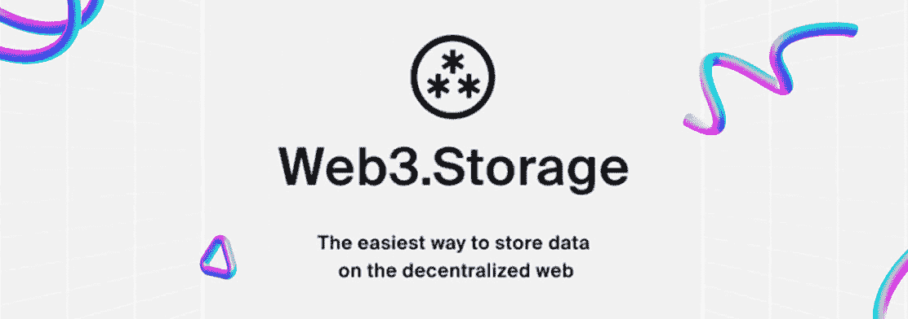
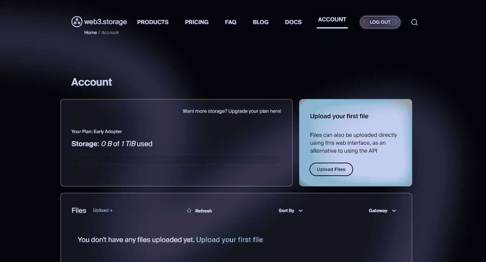
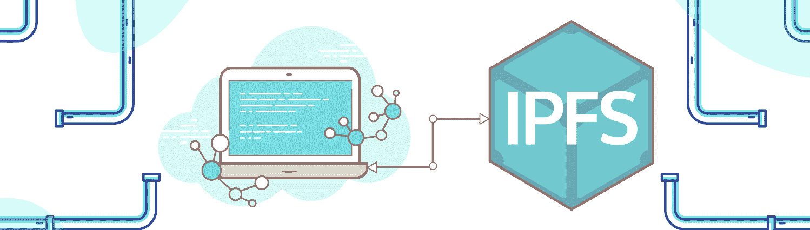
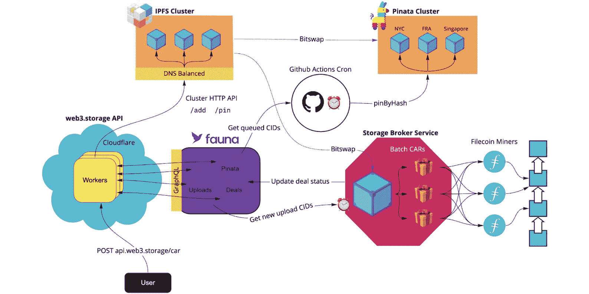
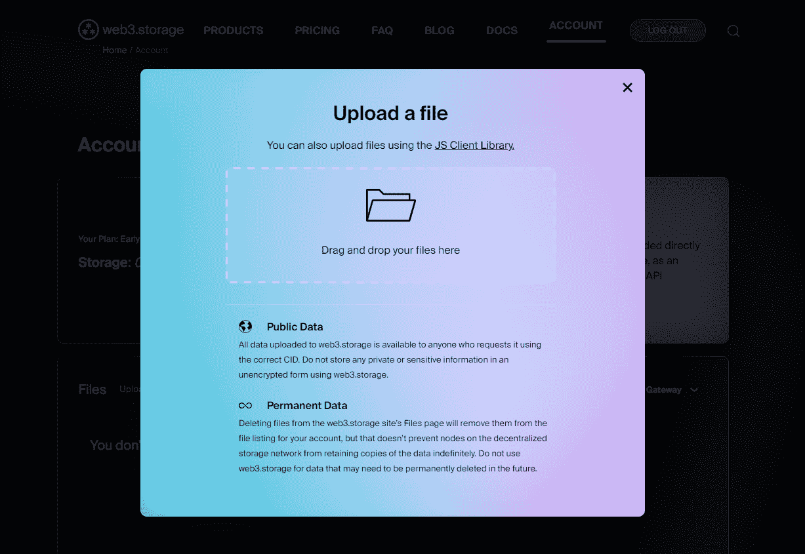
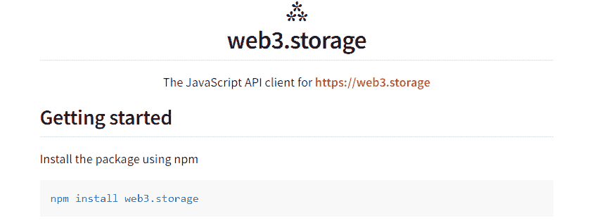
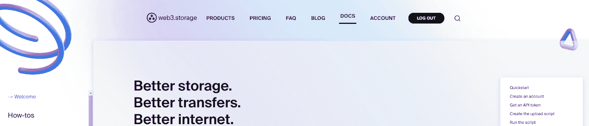
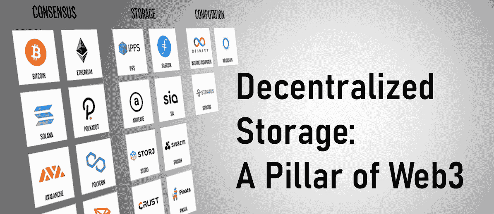
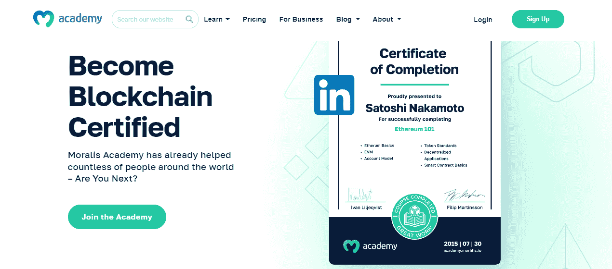

# Web3 简介。存储—它是什么？它是如何工作的？

> 原文：<https://moralis.io/an-introduction-to-web3-storage-what-is-it-and-how-does-it-work/>

多亏了 Protocol Labs(IPFS 和 Filecoin 背后的团队)及其 web3.storage 平台，web3 开发者现在可以以分散的方式存储数据。无论您是创建加密资产(例如，NFTs)还是分散式应用程序(dapps)，您总是需要存储特定的数据或文件。此外，如果您希望确保适当的分散化水平，您应该选择 Web3 存储解决方案。你也希望这些解决方案没有摩擦，而不是浪费宝贵的时间使用它们。这正是 web3.storage 脱颖而出的原因。

熟悉这种用户友好的分散式存储解决方案会带来巨大的好处。接下来，您将有机会了解什么是 web3.storage，它是如何工作的，以及为什么应该使用它。我们还将进一步了解这个简洁解决方案的一些主要优势。也就是说，我们还会考虑其他分散存储替代方案。毕竟，确定哪种解决方案最适合您和您的项目需求是非常重要的。一旦你学习了 web3.storage，当你在开发 dapps 时需要存储数据时，你就可以随时使用这个实用的工具。

在分散应用程序的主题上，dapp 开发非常简单，这要感谢 [Moralis](https://moralis.io/) 。毕竟，这个终极的跨平台、跨链互操作的 Web3 API 提供者为你提供了无数的 [API 端点](https://docs.moralis.io/reference/introduction)。最终，有了 Moralis 和 web3.storage，您可以满怀信心地加入 web3 革命。



## 什么是 Web3。存储？

简而言之，web3.storage 是开发人员从 Filecoin 的分散存储网络中存储和检索数据的简单接口。据该工具背后的组织 Protocol Labs 称，web3.storage 将无限期免费。因此，有了这个界面，您可以节省金钱和时间。毕竟，它代表您处理了与分散存储接口的大部分复杂性。

web3.storage 由两个主要组件组成。一个组件是跨多个 Filecoin 矿工和公共 IPFS 网络冗余存储数据的服务。该组件还提供有关数据存储位置的信息，并通过内容标识符(cid)检索数据。web3.storage 的第二个组件是 HTTP 端点、JavaScript 客户端库和用于与第一个组件交互的 web 用户界面(UI)。此外，这是新帐户的界面外观:



由于 Filecoin 是这个接口背后的 Web3 存储解决方案，并且 IPFS 是 Filecoin 不可或缺的一部分，所以你需要知道 Filecoin 和 IPFS 是什么才能充分理解 web3.storage。因此，在我们重点解释 web3.storage 如何工作之前，让我们先了解这两个。



### IPFS 101

星际文件系统，或 IPFS，是由协议实验室开发的分布式协议。IPFS 系统允许上传、存储和访问各种信息。后者包括网站、应用程序、数据和文件。本质上，IPFS 是一个对等(P2P)超媒体协议。同样值得注意的是，IPFS 旨在通过使网络具有弹性、可升级性和开放性来保存和增长人类的知识。

此外，这种 P2P 文件共享协议使用户能够以分散的方式托管和访问内容。由于运营商托管了部分数据，IPFS 存储和共享文件及其他内容的独特创新解决方案成为可能。

同样重要的是要记住，这个 Web3 存储解决方案与传统的 HTTP 系统有很大不同。毕竟，后者是基于位置的，而 IPFS 采用的是内容寻址解决方案。因此，IPFS 用户查找任何数据或文件都是基于其实际内容，而不是其位置。此外，这种内容寻址解决方案是可行的，因为 IPFS 生态系统中的所有内容都有一个 CID(哈希)。除了内容寻址，IPFS 还将内容链接在一起。

*注意:我们鼓励您也探索如何* [*将 IPFS 用于 NFT 元数据*](https://moralis.io/ipfs-nft-how-to-use-ipfs-for-nft-metadata/) *。通过涵盖该主题并完成相关教程，您将了解关于 IPFS 如何工作以及如何使用最佳 IPFS API 的更多细节。*


### Filecoin 101

与不涉及区块链技术的 IPFS 不同，Filecoin 涉及。它是由 Protocol Labs 发起的开源存储解决方案。此外，可以肯定地说，Filecoin 的核心是一个云存储市场。然而，它也是一个协议和一个具有微调经济学的激励层。如上所述，Filecoin 还利用 IPFS 来保护数据存储和检索。

Filecoin 允许任何人作为存储提供商加入和参与，确保极具竞争力的存储价格。有了这样的供应自由，该网络包括大量不同的存储提供商和开发商。后者是确保稳健可靠服务的关键之一。然而，Filecoin 的内容寻址和加密存储证明提供了可证明的安全性和真实性。此外，用户可以定制 Filecoin 的存储解决方案，以满足他们的需求。诸如调优冗余、检索速度和成本策略等选项提供了很大的灵活性。



## 网络是如何运行的？存储解决方案有效吗？

有了 IPFS 和 Filecoin 的基础知识，现在我们应该关注 web3.storage 是如何工作的。如上图所示，用户发送到 web3.storage 的内容通过 Filecoin 上的存储提供商网络得到持久存储。IPFS 也被认为是多余的。因此，Filecoin 和 IPFS 的联合力量提供了内容寻址能力和持久性。前者通过 CIDs 保证，后者通过 Filecoin 的经济模型保证。本质上，web3.storage 用户依赖于关于存储数据完整性的可验证证据。

### 存储数据

如果查看上图，您会发现系统会立即锁定 web3.storage 发送到 IPFS 集群的数据。后者由地理上分布的三个协议实验室节点组成。从那里，系统询问数据并将其存储在 Filecoin 网络上。在协议存储这些数据之前，系统会将其与 Filecoin 交易中的其他数据打包在一起。最后，自动化机制使用最少五个地理上分布的挖掘器来存储数据包。尽管如此，为了增加冗余和可用性，数据还被固定到其他 IPFS 固定服务，比如 Pinata。



最棒的是上述过程自动执行。你需要掌握的只是一个直观的 web3.storage 界面。您还可以通过 JavaScript (JS)客户端库存储数据。后者使用熟悉的语法，只需几行代码就可以在 Filecoin 上存储数据。本质上，您只需要构造客户端并使用“ *put()* ”方法。然而，在任何情况下，您都需要使用 web3.storage 的 UI 来创建帐户和 API 令牌。您还可以使用这个 UI 来查看所有存储文件的列表，包括数据存储的位置。



### 检索数据

至此，您理解了上面介绍的使用 web3 存储数据的方式。存储采用了 Filecoin 和 IPFS 冗余。因此，您可以用几种不同的方式检索数据。因此，你可以通过 web3.storage 本身、IPFS 网关、你自己的 IPFS 节点或通过 Filecoin 检索来实现。这些选项提供了很大的灵活性，可以最大限度地满足您的需求。此外，请务必记住，任何人都可以通过其 CID 请求一段数据。因此，如果您决定将这种 Web3 存储方法用于私有或敏感信息，请确保对其进行适当的加密。

*注意:要了解使用 web3.storage 的细节，请访问此解决方案的文档。此外，我们鼓励您参加我们的示例项目，该项目将教您如何在 Unity* *中使用* [*Filecoin。后者还将使您能够练习使用 web3.storage*](https://moralis.io/how-to-use-filecoin-in-unity-for-storage/)



## 为什么使用 Web3。存储解决方案？

大多数人不明白，今天互联网上的大部分数据是由大型中央企业托管的。这意味着亚马逊、谷歌和微软处理大部分数字数据。如您所知，这些公司是集中式的，存在单点故障。因此，存储在他们的服务中的数据既不安全，也不容易被利用。因此，要看到 Web3 的全部辉煌，它不能依赖这些类型的存储解决方案。相反，它需要分散存储。

因此，使用 web3.storage 或任何其他 web3 存储解决方案的首要原因是创造一个更美好的未来——一个我们不会损害数据所有权和安全性的未来。但是，为了向您提供使用 web3.storage 的其他论据，让我们来看看这种存储解决方案的主要优势。


### Web3 的好处和优势。储存；储备

如果您已经了解了以上部分，那么您已经知道 web3.storage 的价值所在。然而，你可以通过在一个地方看到主要的优点来获得不同的观点。所以，他们在这里:

*   **用户友好性**–您可以使用简洁的 web UI 或 JS 客户端库来利用 Filecoin 存储解决方案。这使得事情变得相当简单。这意味着你不需要处理基于区块链的分散存储解决方案所涉及的加密货币。

*   **经济高效**–web 3 .存储空间高达 5 GB，并且将无限期保持这种状态。因此，您可以通过节省存储成本来降低开发成本。他们的“精简”和“专家”计划也很实惠。

*   **灵活性**–这种分散式存储解决方案包含多种存储和检索数据的方法。因此，你可以选择一个最适合你的 dapps 的需求。

*   **获得 Filecoin 和 IPFS 的强大功能**–由于 Filecoin 和 IPFS 是 web3.storage 的底层协议，因此在使用该解决方案时，您将继承这两种协议的优势。事实上，您继承了数据层的所有优势:
    *   可验证性
    *   公开
    *   可组合性
    *   效率
    *   速度
    *   轻便
    *   有限的供应商锁定
    *   自我主权身份
    *   无服务器开发



## Web3 开发人员的替代存储解决方案

我们鼓励您试用 web3.storage，亲自探索这一有用工具的优势。然而，值得指出的是，在许多情况下，创建 dapps 或 NFT 只需要 IPFS。所以，一定要学会如何用 Moralis 的 IPFS API 毫不费力地将文件上传到 IPFS。

事实上，不要使用 web3.storage，而是使用 Moralis 并利用它的所有工具，包括最好的 IPFS API。此外，通过“上传文件夹”终端，您可以快速轻松地将文件上传到 IPFS。此外，您可以通过三个简单的步骤实现这一点:

1.  创建文件并初始化 Moralis
2.  定义文件数组
3.  上传文件到 IPFS

如果你想更深入地了解这个过程，可以探索我们的分步指南，“如何将文件上传到 IPFS——全指南 ”。简而言之，只需创建一个 Moralis 帐户，并完成上述步骤。最后，下面的端点完成了任务:

```js
const response = await Moralis.EvmApi.ipfs.uploadFolder({
```

[**Sign Up with Moralis**](https://admin.moralis.io/register)

### 其他存储解决方案

幸运的是，有多个项目专注于分布式存储方面。虽然 Filecoin、IPFS 和 web3.storage 形成了一个强大的三巨头，但其他提供商可能更适合你的需求。毕竟，每个 Web3 存储提供商在如何确保冗余、效率和适当的去中心化水平方面都采取了略微独特的方法。此外，由于 Web3 仍处于早期阶段，分散存储解决方案也仍在开发中。因此，最终的 Web3 数据存储解决方案尚未出现。但是，这些项目值得您关注:

*   阿尔韦弗
*   赫萝
*   地壳网络
*   斯托尔杰
*   希雅·凯特·伊索贝尔·富勒
*   蜂群
*   皮纳塔


## Web3 简介。存储—它是什么？它是如何工作的？–总结

在今天的文章中，您有机会了解了有关 web3.storage 的所有知识。因此，您现在知道了它是什么，它是如何工作的，以及这种 web3 数据存储解决方案的主要优势是什么。在此过程中，您还学习了 Filecoin 和 IPFS 的基础知识，它们是 web3.storage 所依赖的底层协议。尽管如此，您也有机会通过点击“ *Filecoin in Unity* ”链接来体验一下 web3.storage。通过这样做，您还可以直接看到 Moralis 的强大功能，无论您使用哪种 Web3 存储解决方案，它都是用来创建 dapps 的工具。你还发现 Moralis 公司合并了 IPFS。因此，对于您的特定项目，您甚至不需要额外的存储解决方案。

有了本文中获得的知识和技能，您就可以开始自己的 Web3 开发思路了。然而，你可能也需要先练习一下。如果是这样，请务必阅读 [Moralis 文档](https://docs.moralis.io/docs)中的教程。如果你想探索其他区块链发展话题，请访问[Moralis 网 YouTube 频道](https://www.youtube.com/c/MoralisWeb3)和[Moralis 网博客](https://moralis.io/blog/)。一些最新的主题探讨了一些问题，例如:[什么是 Ethers.js](https://moralis.io/full-guide-what-is-ethers-js/) ，如何将 [Python 和 Web3](https://moralis.io/python-and-web3-a-web3-and-python-tutorial-for-blockchain-development/) 结合起来，如何[设置自动化的 Web3 通知电子邮件](https://moralis.io/how-to-set-up-automated-web3-notification-emails-with-python/)，什么是[Palm 区块链](https://moralis.io/palm-blockchain-what-is-the-palm-network/)等等。

同样值得一提的是，区块链产业提供了很多机会。如果你想尽快成为全职加密员，拥有优势会有所帮助；被区块链认证已经成为许多其他人的优势。因此，一定要考虑报名参加[Moralis 学院](https://academy.moralis.io/)，在那里你可以先掌握[区块链和比特币基础](https://academy.moralis.io/courses/blockchain-bitcoin-101)。

