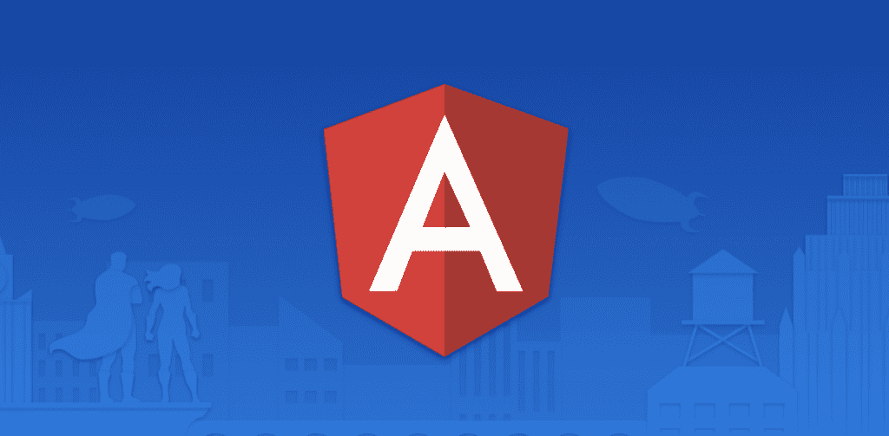
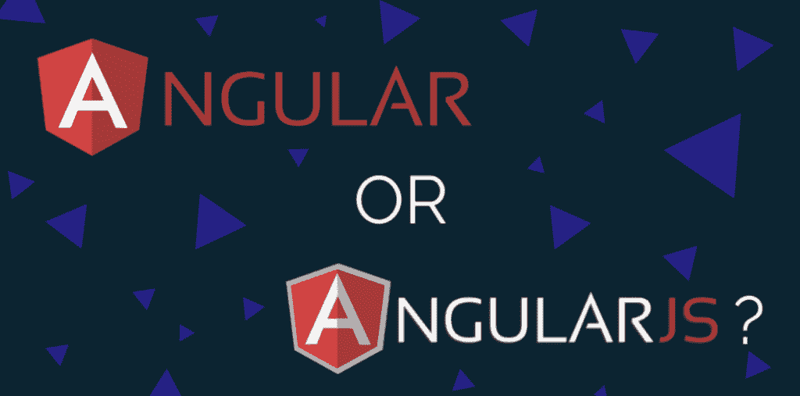
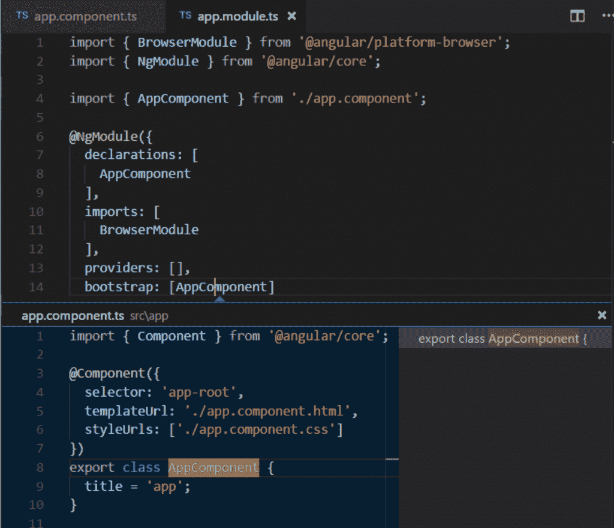
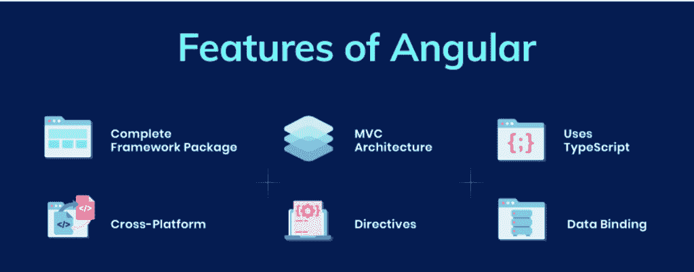

# 角度解释——什么是角度？

> 原文：<https://moralis.io/angular-explained-what-is-angular/>

在开发 dApps 或 Web3 应用时，你可能会遇到 Angular 框架。因为 Angular 在你用 Moralis 建造的时候是有帮助的，所以让我们深入 Angular 的细节。在这篇文章中，你将学习这个高级框架的所有基础知识来回答“什么是有角的”。这从它是什么延伸到它的用途、它的优点等等。总而言之，Angular 对于前端开发者来说是一个强大的工具。此外，它也是创建单页面应用程序的一个有用的快捷方式。此外，你还将了解 Moralis。Moralis 是一个强大的下一代 Web3 开发平台，使您能够立即使用您的前端开发技能。由于 Moralis 负责你的区块链后台，你可以将自己投入到这个蓬勃发展的行业中。

无论你已经是一个经验丰富的开发人员，还是一个完全的初学者，这篇文章都会为你提供所有“什么是有角的”相关信息。这样你会有一个清晰的画面，从而能够更有信心地采取下一步行动。下一步是什么？嗯，如果你是一个完全的初学者，我们强烈建议你先 [学习 JavaScript](https://academy.ivanontech.com/courses/javascript-programming-for-blockchain-developers) 。这种强大的编码语言就是你开始创造杀手[dApps](https://moralis.io/how-to-build-decentralized-apps-dapps-quickly-and-easily/)所需要的一切。

另一方面，如果你已经是一名经验丰富的 JavaScrip 开发人员，你基本上已经准备好开始用 Moralis 开发令人敬畏的分散式应用程序了。当然，就前端部分而言，您也可以学习如何使用 Angular 来使事情变得更加简单和快速。然而，这绝不是必须的。单单 JavaScript 就足够了。只需 [在 Moralis today](https://moralis.io/) 创建您的免费账户，将您的 JS 知识投入工作，毫不费力地启动您的 Web3 项目、dApp 或区块链计划！

# 什么是棱角分明？

因此，让我们开门见山，为你提供“什么是有角的”这个问题最直接的答案。本质上，Angular 是一个开发平台和框架，主要用于构建单页面客户端应用程序(spa)。鉴于 SPAs 是非常流行和高度可伸缩的 web 应用程序，许多开发人员喜欢使用 Angular。

此外，Angular 是一个基于组件的框架。这使得编程 spa 非常快。此外，Angular 附带了一系列集成良好的库，涵盖了各种各样的特性。这包括路由、客户机-服务器通信、表单管理等等。此外，Angular 还包括一套开发工具。后者帮助开发人员轻松地构建、测试和更新他们的代码。

Angular 平台的一个令人印象深刻的优势是，它可以轻松地从单个开发人员项目扩展到企业范围的应用程序。此外，值得注意的是，角生态系统的范围很广。它由超过 170 万开发人员、库作者和内容创建者组成的高度多样化的团队组成。

## 角度与角度对比

为了避免混淆，我们需要提到 AngularJS。后者也被称为 Angular 1，它是 Angular 的初始版本。正如“JS”所暗示的，它使用了 JavaScript。随着初始框架的增长，开发人员很快决定创建一个全新的框架。这一个最初被称为 Angular 2，然而，它很快被重新命名为 Angular。之后的所有版本也都命名为 Angular(最新版本(版本 12)发布于 2021 年 5 月 12 日)。

在谈论 Angular 和 AngularJS 时，需要注意的最重要的一点是，它们基于不同的编程语言。AngularJS 是基于 JavaScript 的，而 Angular 是基于类型脚本的。它们的成分也有所不同。此外，Angular 是基于组件的，而 AngularJS 使用指令。还有许多其他的不同，尽管我们会留给你去探索，以防你感兴趣。

由于 Angular 是被更新的对象，我们将在本文的其余部分重点关注它。然而，请记住，尽管它是一个旧版本，您可能仍然决定使用 AngularJS。

## 什么是 TypeScript？

由于 Angular 是基于 TypeScript 的，所以知道 TypeScript 是什么很重要。TypeScript 是一种基于 JavaScript 的开源编程语言。它通过添加静态类型定义来实现这一点。因为类型提供了一种描述对象形状的方式，所以提供了非常好的文档。这也允许 TypeScript 轻松验证代码是否正常工作。

TypeScript 的另一个优点是编写类型可以是可选的。这是可能的，因为类型推断允许用户在没有任何额外代码的情况下得到很多。

而且，所有有效的 JavaScript 代码也是 TypeScript 代码。可能会注意到类型检查错误，但是用户仍然可以运行生成的 JavaScript 代码。通过使用 TypeScript 编译器或 Babel，用户可以轻松地将 TypeScript 代码转换为 JavaScript 代码。后者是一段简洁的代码，可以在 JavaScript 运行的任何地方正常运行。此外，TypeScript 的类型推断意味着用户不必注释他们的代码，直到他们想要更多的安全性。

## 棱角分明背后的核心理念

既然你可以回答“什么是有角的”这个问题，是时候更仔细地看看这个强大的框架了。在这一节中，我们将介绍 Angular 背后的一些核心思想。这样你将加深对 Angular 平台的理解，从而帮助你更有效地创建应用程序。

Angular 的本质可以从三个方面来呈现:组件、模板、依赖注入。我们将在下面仔细看看每个方面。

### 角度分量

组件是应用程序的组成部分。每个组件都包括一个 TypeScript 类、HTML 模板和样式。TypeScript 类有一个***@ Component()***装饰器，它指定了某些特定于角度的信息(如下所列)。

@Component()指定了什么？

*   定义行为的 Typescript 类。
*   一个 [CSS](https://moralis.io/cascading-style-sheets-what-is-css/) 选择器，定义组件如何在模板中使用。
*   一个 HTML 模板，指示 Angular 如何渲染组件。
*   一组可选的 CSS 样式，定义模板 HTML 元素的外观。

这里是一个最小角度分量的例子:

***从' @angular/core '导入{ Component }；*T3】**

***@分量({***

***选择器:【你好-世界】，***

***模板:`*T3】**

***< h2 >你好世界< /h2 >***

***< p >这是我的第一个组件！< /p >***

***`、***

***})*T3】**

***导出类 HelloWorldComponent {***

***//这个类中的代码驱动组件的行为。*T3】**

***}***

使用上述组件非常简单。你只需要在一个模板里写***<hello-world></hello-world>***。而产生的 DOM (t.i. document 对象模型)，Angular 渲染这个组件时，看起来是这样的:

***<>***

***< h2 >你好世界< /h2 >***

***< p >这是我的第一个组件！< /p >***

***</hello-world>***

Angular 的组件模型提供了直观的应用程序结构和强大的封装。此外，组件使应用程序更容易测试。此外，组件也有助于提高代码的整体可读性。

### 角度模板

正如组件所指定的一样，每个组件都有一个 HTML 模板。后者声明组件如何呈现。此外，您(作为程序员)可以通过文件路径或内联来定义模板。

此外，Angular 通过附加语法扩展了 HTML。这允许您从组件中插入动态值。此外，每当组件的条件或状态改变时，Angular 会自动更新渲染 DOM。

为了让您更好地理解模板，我们来看看下面的例子。它围绕着插入动态文本。

***< p > {{消息}} < /p >***

上面将显示消息，其值来自下面的组件类。

***从' @angular/core '导入{ Component }；*T3】**

***@分量({***

***选择器:【你好-世界-插值】，***

***templateUrl:'。/hello-world-interpolation . component . html '*T3]**

***})***

***导出类 HelloWorldInterpolationComponent {***

***message = '你好，世界！'；*T3】**

***}***

当应用程序实际加载组件及其模板时，用户会看到 ***< p > Hello，World！
*T5。就是*
{ { message } }
*中的双花括号告诉 Angular 对里面的内容进行插值。**

#### 属性绑定

而且，Angular 还支持属性绑定。这有助于您设置 HTML 元素的属性和特性的值。Angular 然后将值传递给应用程序的表示逻辑。有关属性绑定的具体示例，我们建议您访问 angular.io.

作为一名 Angular 程序员，你也可以通过使用指令向你的模板添加额外的功能。虽然有许多类型的指令(为元素添加额外行为的 t.i 类)，但最流行的是 ****ngIf*** 和**** ngFor***。指令对于执行各种任务非常有用，特别是对于动态修改 DOM 结构。创建您自己的自定义指令使您能够创建出色的用户体验。

Angular 的声明性模板的伟大之处在于，它们可以让你清晰地将应用程序的逻辑和它的表现分离开来。同样重要的是要注意模板是基于标准 HTML 的。因此，它们确保了构建、维护和更新的简易性。

### 角度依赖注入

在“什么是棱角分明？”中，我们已经讨论了很多问题文章已经。角度组件和模板是关键。角度依赖性注入是我们列表中的下一个。根据 Angular 专家的说法，开始使用 Angular 并不需要理解这个部分。然而，这是他们强烈建议尽早掌握的东西。

Angular 拥有强大的处理实例化的能力。它通过依赖注入来实现。后者让您可以声明 TypeScript 类的依赖项，而无需关心它们的实例化。这个内置特性使您能够创建更加灵活和易于测试的代码。

### 角度 CLI

什么是 Angular CLI？它是一个命令行界面工具。您可以使用 Angular CLI 直接从命令外壳初始化、开发、搭建和维护 Angular 应用程序。这个命令行界面工具非常快速、简单，并且使许多任务没有麻烦。让我们来看一些例子。

*   ***ng 构建***–*它将一个 Angular 应用程序编译成一个输出目录*
*   ***ng serve****——它构建并服务你的应用，并在文件改变时重建*
*   ***ng 生成****–基于原理图* 生成/修改文件
*   ***ng 测试****——它对给定的项目* 运行单元测试
*   ***ng e2e****——它构建并服务一个 Angular app，然后运行端到端测试*

这些只是 Angular CLI 高度简化的一些非常有用的任务。

### 第一方图书馆

随着应用程序的增长，您希望添加更多功能。不用从头开始编写代码，您可以使用许多库。这样一来，你的编码就简化了，速度也快了很多。下面我们列举一些最常用的有角度的第一方库。

*   **Angular Router**–它提供基于角度组件的高级客户端导航和路由。它支持嵌套路由、延迟加载、自定义路径匹配等等。
*   **Angular Forms**–它为表单参与和验证提供了一个统一的系统。
*   **Angular HTTP client**–这是一个健壮的 HTTP 客户端，可以支持更高级的客户端-服务器通信。
*   **角度动画**–它提供了一个丰富的系统来驱动基于应用程序状态的动画。
*   **Angular PWA**–它提供了构建渐进式 Web 应用程序(PWA)的工具，包括一个服务工作者和 Web 应用程序清单。
*   **Angular Schematics**——它提供自动化的搭建、重构和更新工具，大规模简化开发。

此外，角度库是非常强大的工具。它们使您能够快速实施高级应用功能。这样，您就有更多的时间来关注使您的应用程序独一无二的特性。

## 与 Moralis 一起使用 Angular】

既然你上了 Moralis 的博客，你可能已经知道 Moralis 是什么了。然而，以防万一，让我们告诉你，Moralis 是最终的 Web3 开发平台。那是什么意思？嗯，它为您提供了基本上所有的后端区块链开发需求。

仅仅通过复制和粘贴简单的 Moralis 代码片段，你就可以将 Web2 应用变成 [Web3](https://moralis.io/the-ultimate-guide-to-web3-what-is-web3/) 应用。而这个独一无二的平台最神奇的地方在于，它完全免费让你入门。因此，今天就创建您的免费帐户，并深入研究 [Moralis 清晰而广泛的文档](https://docs.moralis.io/) ，在那里您可以找到完成下一个 dApp 所需的所有内容。最好的起点是解释如何在 3 分钟内 [构建一个简单的去中心化 app 的章节](https://docs.moralis.io/guides/build-a-simple-dapp-in-3-minutes) 。

## 什么是棱角分明？–总结

至此，你知道 Angular 是一个主要用于 spa 的强大框架。这意味着你终于可以回答“什么是有角的”这个问题了。你也知道 Angular 的第一个版本是基于 JavaScript 的，因此现在被称为 AngularJS。另一方面，所有其他的角度视野都是基于 TypeScript 的。此外，我们还浏览了 Angular 背后的核心思想，希望它能给你一些关于事物如何工作的可靠想法。

我们真的希望你在寻找“什么是有角的”这个问题的答案时学到了一些新东西。此外，请记住，此处提供的信息只有在您决定善加利用时才有价值。那么你的下一步是什么？

正如本文开头提到的“什么是有角的？”文章，使用 Moralis 需要了解 JavaScript。所以，如果你了解 JS，你可以通过学习 Angular 来提高你的前端开发技能。然后在的帮助下，通过快速创建一些杀手 dApps 来使用这些技能。