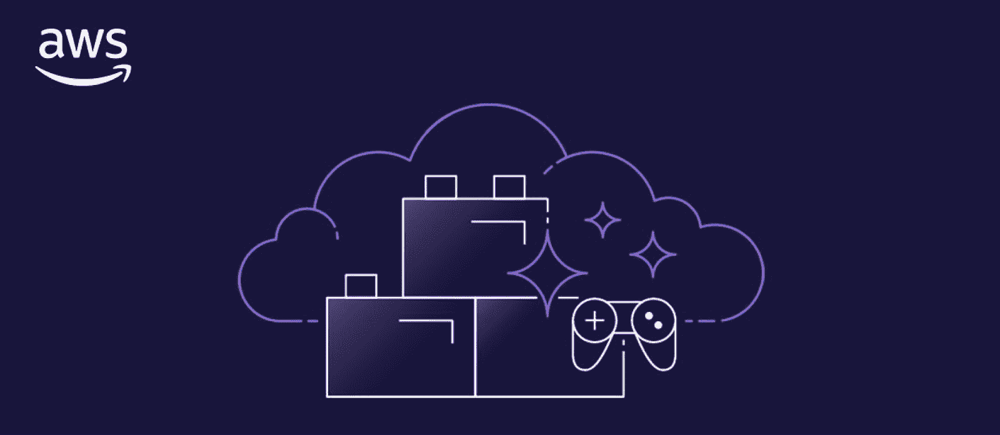
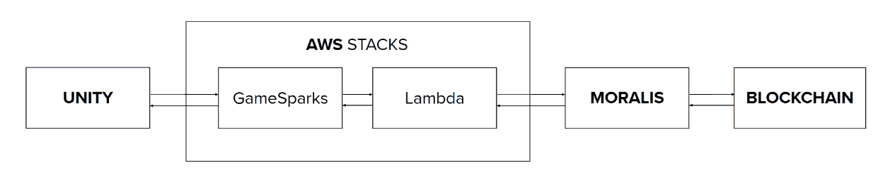

# AWS 游戏公园指南–什么是游戏公园？

> 原文：<https://moralis.io/aws-gamesparks-guide-what-is-gamesparks/>

亚马逊网络服务(AWS)是最全面的云平台之一，提供了许多广受欢迎的卓越服务。这些服务包括从计算、数据库和存储解决方案等基础设施技术到基于平台的分析工具、数据湖等。此外，随着游戏行业令人难以置信的增长，Web3 的出现，以及对元宇宙越来越多的关注，云服务现在正在寻求彻底改变传统游戏开发。对于亚马逊来说，这就是 AWS GameSparks 进入画面的地方！

GameSparks 是一个 AWS 产品，提供完整的多服务后端解决方案，促进更无缝的游戏开发者体验。因此，当使用 AWS GameSparks 时，开发人员可以避免大量的后端开发任务，专注于构建更全面的游戏体验。

如果你想了解更多关于 GameSparks 的信息，请跟随我们探索这个 AWS 服务的复杂性。在此过程中，您将了解更多关于其最突出的特性、优势、用例以及与[Moralis](https://moralis.io)AWS game parks 的集成！Moralis AWS GameSparks 集成在 Web3 空间中实现了更易访问的游戏开发体验。一旦你掌握了 GameSpark，你就可以将这项服务与 Moralis 的[Web3 API](https://moralis.io/web3-apis-exploring-the-top-5-blockchain-apis/)结合起来，创建复杂的 web 3 兼容游戏。

一个突出的例子是 Moralis 的 [Streams API](https://moralis.io/streams/) ，它允许你创建 [Web3 streams](https://web3streams.com) 来通过 webhooks 将链上数据直接查询到你的项目后端。如果你想熟悉 webhooks，可以看看我们解释[以太坊 webhooks](https://moralis.io/ethereum-webhooks-what-they-are-and-how-to-use-webhooks-for-ethereum/) 来龙去脉的文章！

然而，无论你从事什么样的区块链开发工作，[与 Moralis](https://admin.moralis.io/register) 签约，充分利用区块链技术的潜力！您可以在几秒钟内创建您的帐户，而且完全免费！

## 什么是 AWS GameSparks？

亚马逊网络服务(AWS)是世界上最广泛采用和最广泛的云平台，提供来自全球数据中心的大量网络服务。AWS 生态系统包括各种服务，从基于平台的技术，如分析、数据湖、物联网(IoT)等。以及存储、数据库和计算解决方案等基础设施服务。此外，在这个全面的云服务军火库中，你会发现 AWS GameSparks。然而，AWS GameSparks 到底是什么？

顾名思义，AWS GameSparks 是一款面向游戏开发者的全托管 AWS 服务。此外，GameSparks 为开发者提供了多服务后端解决方案，以促进更无缝的游戏开发工作流程。有了 AWS GameSparks，您可以将全部注意力放在构建引人注目的游戏体验上，而将扩展和管理云基础设施的工作留给 AWS。此外，GameSparks 处理所有集成组件，使您能够在云代码中使用它们作为构建块，而不是自己拼凑所有东西。

此外，凭借该服务的突出特性，您可以在游戏开发工作中充分利用 AWS 的强大功能。因此，您可以快速开发游戏，降低成本，提高效率，实现可预测的扩展，使用原生 AWS 集成等。此外，GameSparks 还采用了“现收现付”的定价模式。因此，您只需为您使用的资源付费。这与该服务的可预测扩展和成本降低优势密切相关。借助这种定价模式，您的项目可以通过增加灵活性来提高成本效益，帮助应对用户需求的波动。

随着对 AWS GameSparks 有了更好的理解，接下来的部分涵盖了该服务的一些主要特性。通过继续阅读，你将了解到更多关于这项服务的复杂性和它所需要的！

### 特征

GameSparks 包括许多开发特性，允许你轻松地将游戏逻辑实现到完全由服务管理的后端。这一部分提供了最突出的功能的概述，这将进一步突出 GameSparks 的能力！

*   **DynamoDB 集成**–game parks 与 DynamoDB 无缝集成。因此，您可以结合这两种服务来维护全局数据。这包括物品目录、队伍、玩家匹配和关卡地图。

*   **Lambda Integration**–通过 Lambda Integration，您可以使用函数来扩展后端，以便在您的游戏中利用第三方服务或其他 AWS 资源。

*   **消息&云代码**——有了 GameSparks，你就可以使用云代码来实现你的游戏逻辑，并利用额外的 AWS 服务。您定义的事件、响应和请求充当游戏后端的中枢。

一旦定义了消息，就可以使用该服务来生成和下载代码，以简化强类型客户端代码的编写。更重要的是，该服务提供了优秀的 API 来促进后端和客户端之间的消息传递。

*   **Unity Integration**–Unity Integration 使安装 GameSparks client SDK 成为可能，以便随时使用连接、验证和与后端通信。

*   **测试工具**–为了测试和迭代您的云代码，您不必每次都下载代码并添加到您的 IDE 中。相反，GameSparks 提供了一个测试工具特性，允许您直接在浏览器中测试消息。

现在你已经熟悉了 GameSparks 最突出的特性，接下来的部分将会深入探究 GameSparks 的一些主要优点！

## GameSparks 优势–无障碍游戏开发

随着对 GameSparks 及其主要功能的更深刻理解，本节将涵盖使用该服务的原因。这样做，我们将探索 GamesSparks 最突出的优势！

*   **快速入门**–由于该服务为游戏开发提供了现成的后端功能，您可以更高效地创建游戏项目。GameSparks 的标准功能需要最低配置。因此，你可以在没有基础设施管理经验的情况下开发游戏。

*   **降低成本**–由于 GameSparks 提供完全托管的后端服务，您有更多时间专注于游戏开发流程的其他部分。此外，通过“按需付费”的计费结构，您只需为您使用的资源付费。

*   **可预测的扩展**–当使用 GameSparks 时，你不需要担心预测你需要多少容量，因为你的游戏获得了更高的采用率。借助 AWS，您的游戏可以自动、可靠地扩展。

*   **安全性**-由于该服务的许多原生集成，如 AWS Lambda 和 Amazon DynamoDB，您可以使用久经考验的工具安全地开发定制功能。

*   **简单测试**–通过 test harness 特性，您可以通过浏览器轻松测试变更和新代码。因此，无论何时需要测试变更，您都可以避免下载代码并将其添加到 IDE 中。

这涵盖了 AWS GameSparks 的五大优势。因此，你现在知道 AWS GameSparks 需要什么，以及为什么你可能想使用这项服务。然而，一个问题仍然存在:“它是用来做什么的？”。为了回答这个问题，我们将在下一节更深入地探究一些著名的 AWS GameSparks 用例！

## GameSparks 是用来做什么的？

在上一节中，您了解了使用 GameSparks 的一些主要好处。两个最突出的优势是服务的伸缩能力和灵活性。该服务的可伸缩性使其成为游戏开发者的理想解决方案，他们希望在无需担心基础设施成本的情况下启动自己的项目。

更重要的是，GameSparks 的灵活特性允许开发人员创建各种各样的游戏，从高级的多人项目到休闲的单人游戏。因此，有可能以多种方式使用 gameparks，下面，我们将介绍一些著名的 gameparks 用例！

*   **新游戏**–如果你想开发并发布一款新游戏，GameSparks 是一个很好的选择。由于该平台具有可预测的可扩展性，您无需担心游戏增长时的基础设施成本。此外，它可能更具成本效益，因为您只需为项目消耗的资源付费。

*   **添加功能**–如果你已经有了一个游戏，想要添加新功能，你可以通过 GameSparks 来实现。因此，您可以使用这些服务快速添加功能，包括玩家身份验证、消息、排行榜等。

*   **分析游戏数据**–gameparks 提供游戏数据分析工具。因此，您可以使用 AWS GameSparks 来分析您的游戏数据，以优化设计，改进游戏机制，并跟踪用户的行为模式。

*   **服务器管理**–AWS gameparks 是管理游戏服务器的绝佳选择。该服务的功能使您可以轻松启动和管理游戏的替代服务器解决方案。这包括监控、日志记录、自动缩放等。

*   多人游戏–如果你想创建多人游戏，你可以从 GameSparks 中获益匪浅。该服务提供实时多人功能、配对和排行榜等功能。

### Moralis 的 GameSparks 集成——如何轻松构建 Web3 游戏

如果您已经了解了这么多，那么您现在应该知道 AWS GameSparks 是什么，该服务的主要特性，它的主要优势，以及它的一些最突出的用例。因此，最重要的是，本节简要概述了在 Web3 环境中使用 AWS GameSparks 的过程。如果您继续阅读，我们将为您指出开发完全模块化的“Web3 游戏设置”的正确方向。具体来说，我们将探索 Moralis 的 AWS 游戏公园集成的复杂性！

例如，使用 Moralis 和 GameSparks，您可以快速完成以下三项任务:

1.  在 GameSparks 中设置游戏后端。
2.  将你的游戏后端连接到 AWS Lambda 来调用它的功能。
3.  将 Unity 游戏连接到 GameSparks 后端。

完成这些任务后，通过 AWS、Unity 和 Moralis 形成了一个模块化的“Web3 游戏设置”。然而，我们不会深入研究如何实际使用 AWS GameSparks 集成，因为这超出了本文的范围。然而，如果你想了解更多关于 Web3 游戏开发的知识，请查看 Moralis 的官方 AWS GameSparks 文档,了解关于集成的所有信息！此外，如果你想探索 AWS Lambda，请阅读我们的文章探索 [AWS Lambda 及其用于](https://moralis.io/exploring-aws-lambda-and-what-it-is-used-for/)的用途！另外，如果你已经精通一些 JavaScript，并且想学习如何将 NodeJS SDK 与 AWS Lambda 集成，请查看我们的 [AWS Lambda NodeJS](https://moralis.io/aws-lambda-nodejs-tutorial-how-to-integrate-a-nodejs-sdk-example/) 示例指南！

然而，这涵盖了 AWS 游戏公园指南！如果你对 Web3 游戏开发空间有进一步的兴趣，你可以在 Moralis 找到更多的内容。例如，阅读我们的文章，了解更多关于[创作《我的世界》Web3 游戏](https://moralis.io/creating-a-minecraft-web3-game-take-ideas-into-production/)的信息。你也可以看看我们的指南，看看如何[用 Unity](https://moralis.io/how-to-build-a-web3-multiplayer-game-using-unity-multiplayer/) 构建一个 Web3 多人游戏。在本教程中，您将学习构建一个完整的多人游戏项目，玩家可以交易链上的资产！

上面的教程提供了对 Web3 游戏开发空间的见解，如果你学习掌握 AWS GameSparks，你将能够立即创建独特的游戏体验！

## AWS 游戏公园–摘要

AWS 是全球最著名、使用最广泛的云平台之一，为数百万客户提供服务。AWS 生态系统提供 200 多种服务，在这些服务中，您会发现 AWS GameSparks！GameSparks 服务提供了完整的游戏后端解决方案，允许开发者更高效地开发游戏。这项服务允许开发者将更多的精力放在开发游戏上，而不是建立后端基础设施。

此外，这个 AWS 服务有许多很棒的特性，包括本机 DynamoDB 和 Lambda 集成、其测试工具、Unity 支持等。这些特性提供了几个好处:降低成本、可预测的扩展、增强的安全性、易于测试等等。此外，开发人员可以在几种不同的场景中使用 GameSparks。这包括创建新游戏、向现有项目添加功能、分析游戏数据等等。

结合探索 game parks 的复杂性，我们在本文中讨论了 Moralis AWS GameSparks 集成。通过将 GameSparks 服务与最好的 Web3 基础设施提供商 Moralis 相结合，这种集成使 Web3 游戏开发变得更加容易。

然而，如果你觉得这篇文章有帮助，请收听 Moralis [Web3 博客](https://moralis.io/blog/)来探索更多与区块链相关的内容。例如，了解更多关于 [Web3 for business](https://moralis.io/web3-for-business-how-and-why-you-can-integrate-web3-into-your-enterprise/) 或如何[立即为链上事件](https://moralis.io/blockchain-discord-bot-build-a-discord-bot-for-on-chain-events/)创建一个不和谐机器人！

此外，假设您想更加精通 Web3 开发。如果是这样，马上报名[Moralis 学院](https://academy.moralis.io)！Moralis Academy 为初学者和更有经验的开发人员提供了一系列业界最好的区块链课程。例如，查看以下涵盖 Web3 开发基础的课程:“[区块链&比特币基础](https://academy.moralis.io/courses/blockchain-bitcoin-101)”。

尽管如此，如果你正在寻找开发 Web3 游戏或任何其他项目，请立即与 Moralis 签约！创建一个 Moralis 帐户是免费的，只需要几秒钟，所以你不会有任何损失！