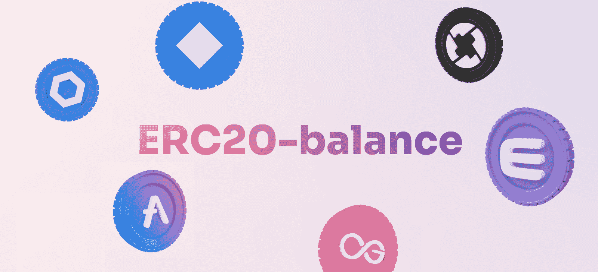
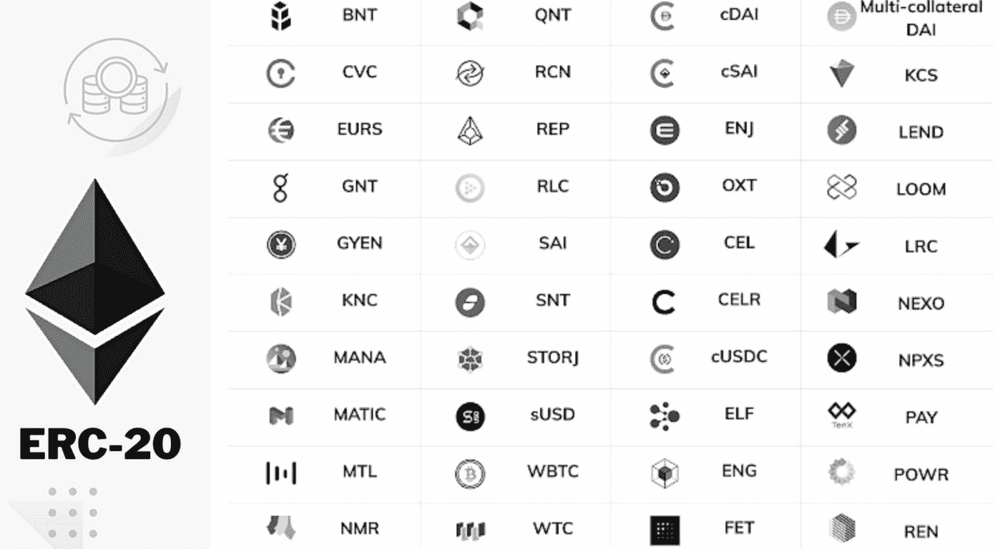
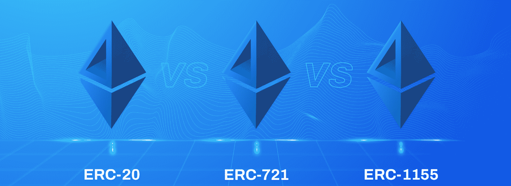
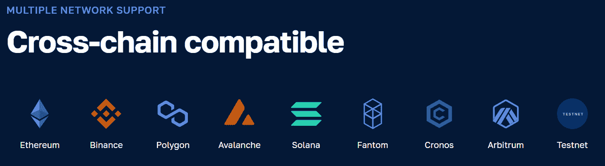
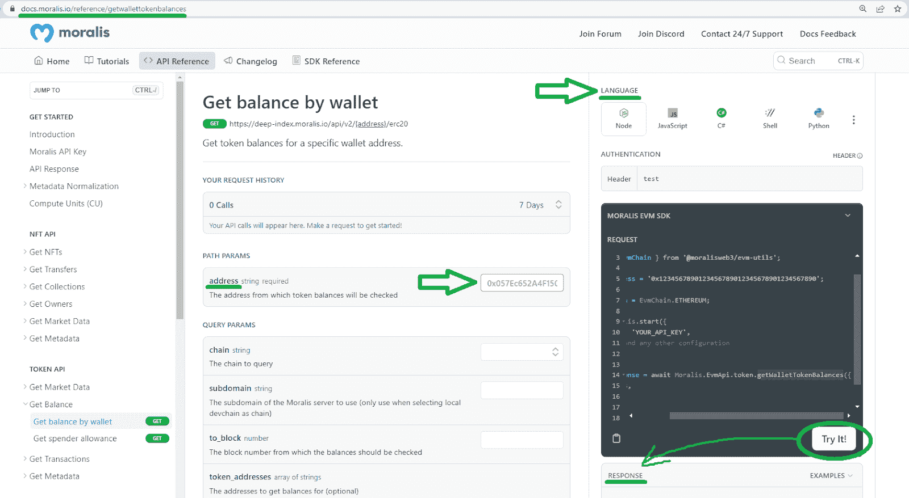
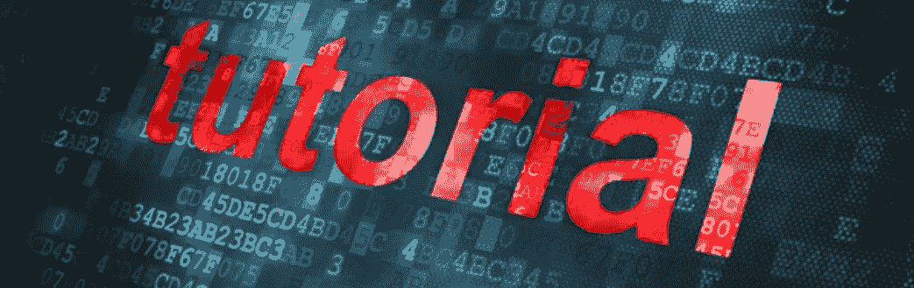
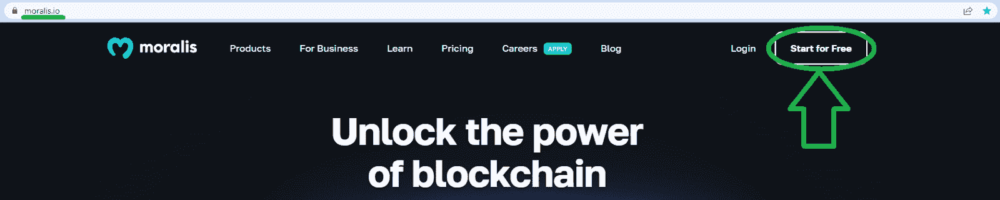
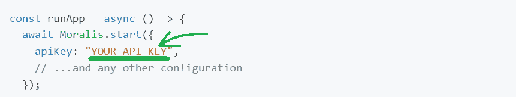

# ERC20 余额–如何从地址获取 ERC20 令牌的余额

> 原文：<https://moralis.io/balance-of-erc20-how-to-get-balance-of-an-erc20-token-from-address/>

有了合适的 Web3 API 端点，您可以使用一行代码获取 ERC20 的任何余额。事实上，看一下 Moralis 提供的以下代码片段，就可以毫不费力地获得 ERC20 令牌的余额:

```js
const response = await Moralis.EvmApi.token.getWalletTokenBalances({
```

上面的代码行获取任何钱包的 ERC20 余额，这使它成为创建各种 dapps 时的一个有价值的工具。无论是创建投资组合跟踪 dapp、钱包 dapp，还是包含 EVM 兼容的可替换令牌的更高级 dapp，dapp 的后端知道并显示 ERC20 令牌的余额都是至关重要的。此外，如果你以前和 [Moralis](https://moralis.io/) 一起工作过，你已经对如何实现上面的代码片段有了一些想法。另一方面，如果你是 Web3 开发的新手，一定要完成今天的教程。因此，你将学会如何不费吹灰之力获得 20 元代币的余额。你只需要一个[免费 Moralis 账户](https://admin.moralis.io/register)和一些 JavaScript 基础知识。

[**Sign Up with Moralis and Unlock the Power of Blockchain**](https://admin.moralis.io/register)

### 概观

如果你决定深入今天的话题，你首先要了解所有你需要知道的关于 ERC20 代币的知识。我们还将提到其他一些 ERC 令牌标准，并将其与 ERC20 进行快速比较。接下来，我们将探索获得 ERC20 令牌余额的终极工具。在这里，您将有机会了解 Moralis 和这个终极 Web3 API 提供商的 [Token API](https://moralis.io/token-api/) 。毕竟，后者是提供上述“ *getWalletTokenBalances* ”端点的工具箱。此外，我们还将进一步了解这个端点，并向您展示如何自己更详细地探索它。



此外，您还将了解如何获得包含您最喜欢的遗留编程语言/框架的端点的代码行。最后但同样重要的是，我们将带您通过一个简单的三步教程，教您如何使用 JavaScript 获得任何钱包地址的 ERC20 余额。



## 探索 ERC20

除非您是加密领域的新手，否则您会知道有许多加密令牌或加密货币可用。然而，许多人不知道这些令牌中的大多数是在以太坊之上创建的，遵循 ERC20 标准。话说回来，ERC20 是什么？

ERC20 或“以太坊征求意见稿 20”是由 Fabian Vogelsteller 在 2015 年 11 月提出的。社区接受了它；反过来，开发者将它设置到位，确保以太坊上创建的所有代币保持相同的基本质量。基本上，所有的 ERC20 代币都遵循以太币(原生代币)的特性。此外，使用同一智能合约铸造(创建)的所有 ERC20 令牌始终具有相同的特征，并且完全可互换(可替换)。

很多时候，Web3 devs 将 ERC20 标准称为“ERC20 契约”。这是因为智能合约用于实现该标准。每当有人决定创建 ERC20 令牌时，必须使用包含 ERC20 标准的智能合约。此外，用于铸造代币的智能合约确保关于这些代币的所有转移都遵循预定义的规则。因此，可以肯定地说，在创建和处理 ERC20 令牌时，ERC20 契约标准施加了适当的规则。因此，合同还确保 ERC20 令牌的每个余额都符合令牌的令牌组学。此外，这些规则使开发者能够准确预测他们的新 ERC20 令牌将如何在以太坊的生态系统中发挥作用。此外，由于智能合约的自动化特性，这些规则可以自动实现。

一些最受欢迎的 ERC20 令牌包括“基本注意力令牌”(BAT)、“制造者”(MKR)、“OMG 网络”(OMG)和“占卜者”(REP)。


### ERC20 规则和指南

每个 ERC20 智能合约的两个核心信息是其区块链地址和其管理的 ERC20 令牌的总供应量。除了这两个必需的参数之外，ERC20 智能合约还可能包括其他可选组件。最后，以下是 ERC20 令牌的参数:

*   合同地址(基本)
*   代币总供应量(基本)
*   令牌名称(可选)
*   令牌符号(ticker[可选])
*   令牌的小数位数(可选)

*注意:当我们在下面向您展示如何获得 ERC20 令牌的余额时，您将能够在您的终端上看到上述组件。此外，如果您想进一步了解上面列出的 ERC20 合约参数，请查看我们的“* [探索 ERC-20 令牌标准](https://moralis.io/erc20-exploring-the-erc-20-token-standard/) *”一文。*



### ERC20 与其他以太坊标准

上面提到的细节足以创建获取钱包地址 ERC20 余额的杀手级 dapps。然而，了解其他以太坊令牌标准很重要。例如，你可能听说过 [ERC721](https://moralis.io/erc721-contract-exploring-erc721-smart-contracts/) 和 [ERC1155](https://moralis.io/erc1155-exploring-the-erc-1155-token-standard/) 代币。毕竟，这是不可替换令牌(NFT)的两个主要标准。因此，这些智能合约包括不同的组件——有助于确保唯一性的组件。

另外两个流行的以太坊标准包括 ERC223 和 ERC777。前者是 ERC20 协议的协议升级，允许用户更安全地将令牌传输到数字钱包。另一方面，可替换令牌的 ERC777 标准侧重于确保与现有分散式交换的互操作性。它与以太坊的区块链协议相关，该协议定义了可与以太网互操作的令牌类型。

此外，其他几个令牌标准，如 ERC677，管理着流行的链接令牌。此外，如前所述，为了创建获得 ERC20 钱包平衡的杀手级 dapps，您不需要深入研究这些标准。然而，如果你决定在以太坊上铸造自己的代币，请确保更仔细地研究所有可用的标准。


## 获得 ERC20 代币余额的终极工具

除非你一直生活在岩石下，否则你很可能知道 Moralis 是 Web2-Web3 的桥梁，它使你能够使用遗留的开发平台和框架来加入 Web3 革命。除了跨平台互操作，Moralis 还支持所有领先的可编程区块链。因此，你可以在以太坊上创建 dapps，所有领先的 EVM 兼容链，甚至在几分钟内创建 Solana。此外，这种跨链的互操作性也使您的工作经得起未来的考验，因为您永远不会被任何特定的链所束缚。



Moralis 提供了几个产品，包括终极 [Web3 Auth API](https://moralis.io/authentication/) 、 [NFT API](https://moralis.io/nft-api/) 、 [Streams API](https://moralis.io/streams/) 和 Token API。当您开始创建更高级的 dapps 时，您会想要使用所有这些工具，而 Moralis Token API 使您能够毫不费力地获得 ERC20 钱包余额。因此，我们将在这里集中讨论后者。

Moralis 的令牌 API 允许您轻松地将实时令牌数据集成到您的应用程序中。此外，它使您能够获得所有主要区块链的令牌价格，所有权和转移数据的完全访问权。当然，它也能让你在所有支持的链上获得 ERC20 的钱包余额。

### “ *getWalletTokenBalances* ”端点

到目前为止，您已经知道，由于有了" *getWalletTokenBalances* "端点，获取钱包的令牌余额是可能的。因此，让我们一起来看看端点的[通过钱包获得平衡文档页面](https://docs.moralis.io/reference/getwallettokenbalances):



看上面的截图，可以看到这个端点接受了“ ***地址*** ”参数，这也是唯一需要的参数。毕竟，端点需要知道在获取令牌余额时应该关注哪个地址。另外， *getWalletTokenBalances* 包括一些可选参数。这些如下:

*   *"-连锁查询。*
*   *" ***子域***"–选择本地开发/测试链时使用。*
*   *"***To _ block***"-检查过去块的余额。*
*   *"***token _ addresses***"-将结果过滤到特定的地址列表中。*

*您可以使用上面提供的文档页面来测试端点。你所需要做的就是粘贴一个你想查询的地址，然后点击“试试看！”按钮。此外，通过使用上面页面的右上角，您可以选择想要使用的编程语言。然后，您只需从“请求”部分复制代码片段，并将其粘贴到您的脚本中。*

*

## 如何平衡伦理与 Moralis

既然您已经知道获得 ERC20 token 余额的最终工具是什么，那么是时候卷起袖子跟随我们了。但是，在我们带您完成这三步过程之前，请确保完成以下先决条件:

*   安装 Node v.14 或更高版本。
*   准备好自己喜欢的代码编辑器或者 IDE。我们倾向于使用 Visual Studio 代码(VSC)。
*   安装你喜欢的包管理器(“ *npm* ”、“*纱*”或“ *pnpm* ”)。



### 步骤 1:Moralis 设置

一旦您安装了 Moralis SDK 并获得了您的 Web3 API 密钥，任何剩余的 ERC20 令牌都将由您支配。因此，请确保您创建您的免费 Moralis 帐户来访问您的管理区。一旦您的帐户启动并运行，进入您的 Moralis 管理区，完成以下两个步骤，如图所示:


暂时保留您的 API 密钥，并专注于在您的项目中安装 Moralis SDK。幸运的是，您只需要运行正确的命令就可以做到这一点。因此，使用以下命令之一(取决于您使用的软件包管理器):

```js
npm install moralis
```

```js
yarn add moralis
```

```js
pnpm add moralis
```

### 步骤 2:获取 ERC20 令牌余额的示例脚本

现在您已经成功安装了 Moralis SDK，是时候使用正确的代码行来获得可替换令牌的平衡了。但是，您不需要从头开始编写脚本；相反，您可以简单地将以下代码行复制并粘贴到“index.js”文件中:

```js
const Moralis = require('moralis').default;
const { EvmChain } = require('@moralisweb3/evm-utils');

const runApp = async () => {
  await Moralis.start({
    apiKey: "YOUR_API_KEY",
    // ...and any other configuration
  });

  const address = '0xd8da6bf26964af9d7eed9e03e53415d37aa96045';

  const chain = EvmChain.ETHEREUM;

  const response = await Moralis.EvmApi.token.getWalletTokenBalances({
    address,
    chain,
  });

  console.log(response.toJSON());
}

runApp();
```

*注意:上面几行代码重点在于使用 JavaScript。但是，您可能希望使用 TypeScript。在这种情况下，进入“[如何获得一个地址](https://docs.moralis.io/docs/how-to-get-all-erc20-tokens-owned-by-an-address)拥有的所有 ERC20 令牌”文档页面，并选择“index.ts”。*

查看上面的示例脚本，可以看到“ *EvmChain。以太坊*”。后者定义了链。因此，如果你要在[其他支持的链](https://docs.moralis.io/docs/cross-chain-requests#supported-evm-chains)上获取代币余额，你需要相应地替换*以太坊*。

尽管如此，占位符“ *YOUR_API_KEY* ”表示需要粘贴 Moralis Web3 API 密钥的位置:



### 步骤 3:执行程序以获得钱包的 ERC20 余额

如果您已经正确地遵循了我们的指导，那么现在您已经准备好了自己的“索引”文件，并配备了 Web3 API 密钥。因此，您可以执行程序。通过这样做，您将能够看到上面使用的"*0 xd 8 da 6 BF 26964 af 9 D7 eed 9 e 03 e 53415d 37 aa 96045*"地址的 ERC20 令牌的余额。当然，您可以随意将此地址替换为任何其他地址。

要执行该程序，您需要运行以下命令之一:

**对于 JavaScript:**

```js
node index.js
```

**对于打字稿:**

```js
node index.ts
```

运行适当的命令后，您应该会在终端中看到以下结果:

```js
[
  {
    "token_address": "0x351d941fe1bbb94f142d3975da5019593ccd2ecc",
    "name": "PEPSI Metaverse",
    "symbol": "PEPSI",
    "logo": null,
    "thumbnail": null,
    "decimals": 18,
    "balance": "767387143779415173800484933"
  },
  {
    "token_address": "0xbab6f30c81209433a3ced28ca8e19256440547d9",
    "name": "Yu Gi Oh",
    "symbol": "YGO",
    "logo": null,
    "thumbnail": null,
    "decimals": 6,
    "balance": "30000000"
  },
  {
    "token_address": "0x39f21985611480595fa60696e04fe104998771eb",
    "name": "Bone Shiba",
    "symbol": "BONESHIB",
    "logo": null,
    "thumbnail": null,
    "decimals": 18,
    "balance": "50000000000000000000000000"
  }
]
```

尽管如此，要获得使用" *getWalletTokenBalances* "端点的正确诀窍，请尝试对其他地址和链运行上面的脚本。此外，可以随意试验使用这个端点的其他可选参数(前面已经介绍过了)。

## ERC20 余额–如何从地址获取 ERC20 令牌余额–摘要

如果您熟悉 Moralis，您可以使用简介中提供的代码片段立即获得 ERC20 令牌的平衡。但是，如果您决定开始阅读本文，那么您首先有机会更好地熟悉 Moralis Token API。在此过程中，您探索了关于 ERC20 令牌标准的一切，以便将这些类型的令牌整合到您的 dapps 中。最后但并非最不重要的是，您还有机会使用我们的示例脚本使用" *getWalletTokenBalances* "端点进行旋转。因此，您现在知道如何在任何支持的区块链上获得任何钱包的 ERC20 余额。

向前看，你有两个选择——如果你已经有了知识和信心，开始建立你自己的 dapps。另一方面，你可能需要一些额外的练习。如果是这样的话，您应该探索其他侧重于众多强大的 Web3 API 端点的教程。当然，你也可以扩展你对其他区块链发展主题的知识。如果你对此感兴趣，一定要访问[Moralis 伦理 YouTube 频道](https://www.youtube.com/c/MoralisWeb3)或[Moralis 伦理博客](https://moralis.io/blog/)。一些最新的话题集中在 [WalletConnect 集成](https://moralis.io/walletconnect-integration-how-to-integrate-walletconnect/)，在 Solana 上[创建 NFTs 的最简单方法，创建](https://moralis.io/the-easiest-way-to-create-nfts-on-solana/)[《我的世界》Web3 游戏](http://v)， [NFT 元数据存储](https://moralis.io/nft-metadata-storage-how-to-store-nft-metadata/)，等等。

此外，你可以通过报名参加[Moralis 学院](https://academy.moralis.io/)来获得更专业的区块链教育。通过完成那里的课程，你可以获得区块链认证。课程从初级到高级都有。因此，如果你已经了解区块链基础知识，[区块链商业大师班](https://academy.moralis.io/courses/blockchain-business-masterclass)课程可能是适合你的课程。你不仅可以提升你的区块链开发知识，还可以增加你获得梦想中的加密工作的机会。

*