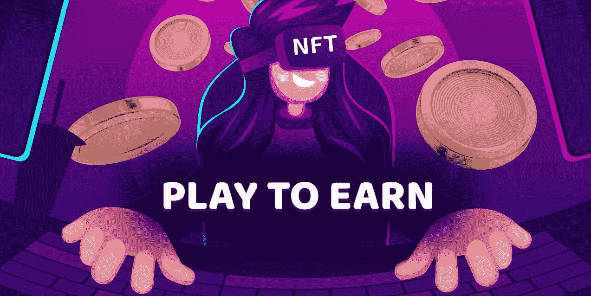
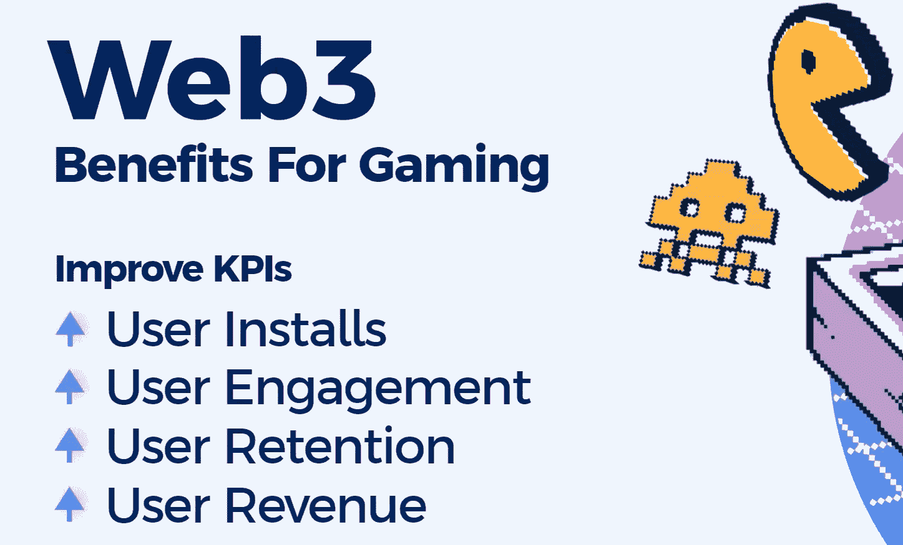
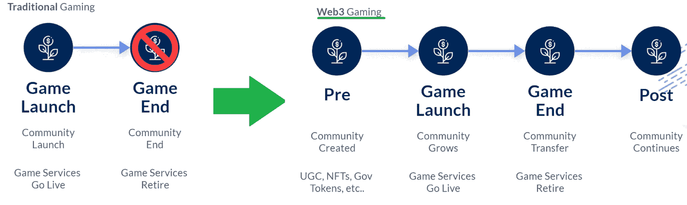
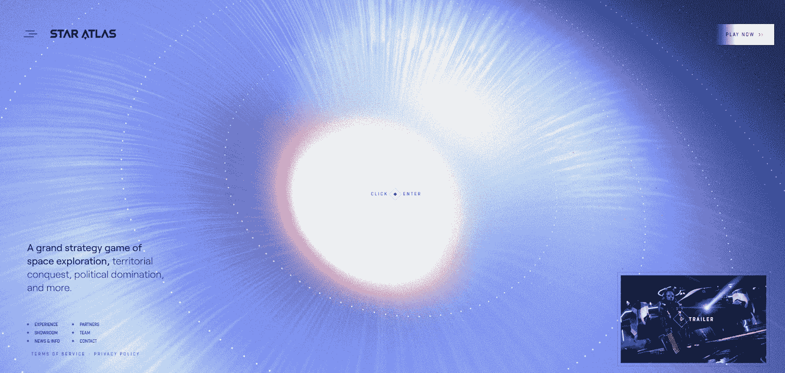
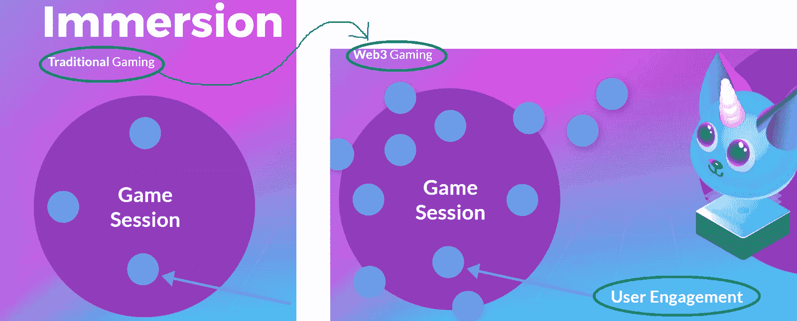
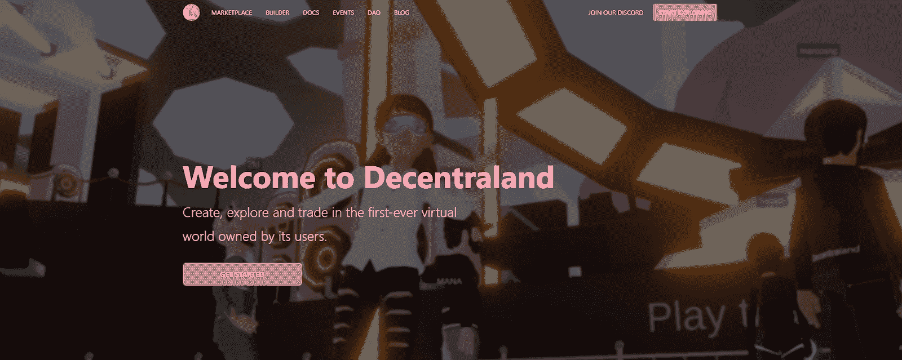
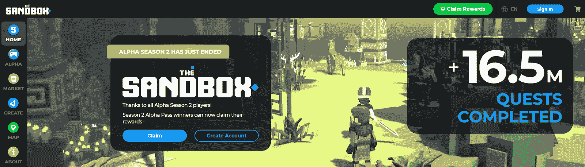
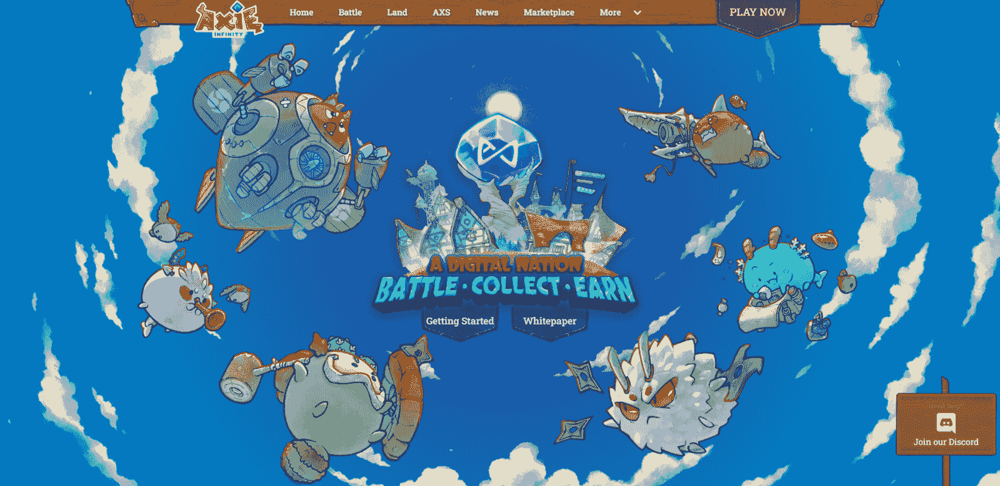
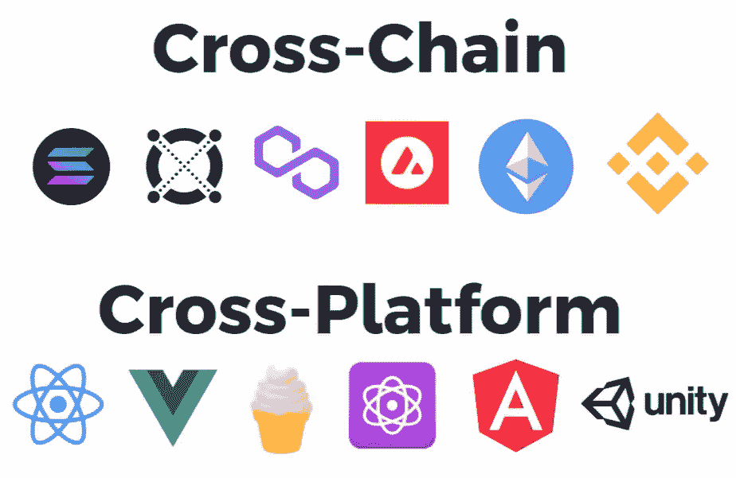
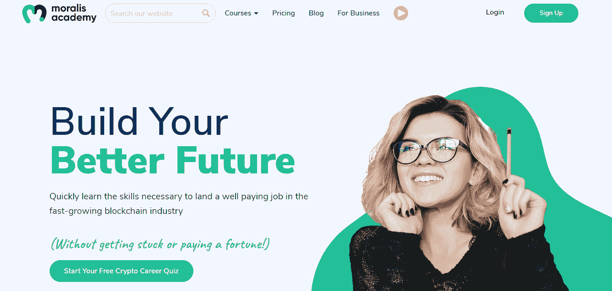

# Web3 游戏的优势——全面分析

> 原文：<https://moralis.io/benefits-of-web3-gaming-full-breakdown/>

**虽然在** [**Web3**](https://moralis.io/the-ultimate-guide-to-web3-what-is-web3/) **境界中游戏的吸引力和感染力主要是去中心化的方面，Web3 游戏还有其他众多的好处。赚取潜力和拥有游戏中的物品只是用户可以利用的 Web3 游戏的几个优势。但是从开发者的角度来看，Web3 游戏有什么好处呢？这些优势包括:**

*   安装
*   用户参与度
*   用户保留
*   收入

这是我们将在此进一步探讨的四个关键优势。因此，你可以决定 Web3 游戏是否值得你关注。此外，虽然许多人认为创建 Web3 游戏可能会令人生畏，但我们将深入了解 Moralis，并发现区块链开发如何在利用其平台时感觉轻而易举。

此外，有了当前 [Web3 技术栈](https://moralis.io/exploring-the-web3-tech-stack-full-guide/)的顶峰，你可以使用你的前端技能平稳地从 Web2 过渡到 Web3。使用您的 [JavaScript](https://moralis.io/javascript-explained-what-is-javascript/) 或 Unity 熟练度，您现在就可以开始创建[分散式应用](https://moralis.io/decentralized-applications-explained-what-are-dapps/) (dapps)。从本质上来说，Moralis 是“加密的燃料库”，被认为是最好的 Web3 后端平台。然而，我们在本文中的主要焦点将是探索 Web3 游戏的好处，它提供了无数的机会。我们将把事情分解，并指出现有的游戏例子，你可以进一步探索。此外，在此过程中，您将了解到 [GameFi 和“玩到赚”(P2E)](https://moralis.io/what-is-gamefi-and-play-to-earn-p2e/) 概念，这是 Web3 游戏的主要优势。另一方面，你可能已经熟悉了区块链游戏的好处，并想开始建设。如果是这样的话，[创建你的免费 Moralis 账户](https://admin.moralis.io/register)，将你的 Unity 知识投入到工作中。

### 游戏中的克里斯

当谈到开发者对 Web3 游戏的目标时，四个关键绩效指标最受关注。尽管前面已经说过，但我们还是来简单看一下四个 KPI:

*   安装
*   用户参与度
*   用户保留
*   收入

我们决定通过仔细研究区块链技术如何帮助改善上述 KPI 来介绍 Web3 游戏的优势。然而，在继续之前，让我们确保你们都知道基础知识。因此，让我们来看看显著标志着 Web3 游戏的两个概念:

*   GameFi——使用分散财务(DeFi)，很容易将各种财务方面实现到 Web3 游戏中。就这样，“ [GameFi](https://moralis.io/gamefi-tutorial-how-to-create-a-gamefi-game/) 这个术语诞生了。后者结合了“游戏”和“金融”两个词。然而，你需要意识到 GameFi 有一个相当广泛的含义。本质上，任何同时具有游戏化和金融功能的 dapp 都可以归入这一类。
*   **P2E**–P2E 概念是 GameFi 的一个方面。当游戏以一种能让玩家赚取可替代或不可替代代币的方式构建时，我们就谈到了 P2E。这些资产可以被储存或兑换成稳定的硬币、其他加密货币或纸币。因此，玩游戏所创造的价值可以转移到现实生活中。

同样值得指出的是，分散融资带来了许多优势，这些优势也成为了 Web3 游戏的优势。因此，分散化、透明性和不变性成为链上游戏的一部分。因此，从高尚的角度来看，从“付费游戏”到“游戏挣钱”的转变不再是一个“如果”的问题。我们相信很明显会有什么结果，趋势已经表明了这一点。

## Web3 游戏的优势——提高领先的 KPI

随着时间的推移，我们将进一步了解上面列出的每个 KPI。通过这种方式，您将在这些关键性能指标上看到 Web3 游戏的优势。此外，还有一些影响某些 KPI 的特定功能。然而，整体的好处往往是交叉的，往往同时改善多个方面。例如，Web3 gaming 在用户安装时显著改善了社交互动。当谈到用户参与时，Web3 项目中的沉浸感有所增加。就用户留存而言，用户生成内容(UGC)非常重要。此外，当我们考虑用户收入时，Web3 带来了新的和改进的收入流。所以，事不宜迟，让我们深入了解一下 Web3 游戏的这些优势。

### Web3 游戏好处#1:提高用户安装量

就第一个 KPI 而言，很明显，更多的安装意味着更多的玩家。此外，更多的玩家意味着更大的社区。此外，通过 Web3，游戏的生态系统超越了游戏本身的传统边界。如果我们看看传统游戏，社区是非常有限的-它的建设和货币化只是在游戏推出时才开始。一旦游戏开发者决定终止游戏服务，主动与用户互动就变得不可能了。这极大地限制了接合框架:

然而，如上图所示，Web3 游戏增加了额外的维度，极大地改善了社区机会。首先，我们可以在实际发布之前开始创建一个吸引人的社区。我们可以用许多不同的方法来实现这一点。例如，通过提供 UGC、NFTs 和[治理令牌](https://moralis.io/what-are-governance-tokens-full-guide/)，大量的价值和更多用户的兴趣进入了画面。此外，如果游戏在 Web3 的情况下结束，社区可以被重新利用。我们可以轻松地将所有资产转移到新游戏或市场。此外，这可以跨一个或几个标题来完成。因此，该选项确保了社区的延续。

如果你想看一个很棒的“预发布”Web3 游戏示例，请查看 Star Atlas:

尽管他们的核心游戏尚未推出，但用户已经可以彼此互动，并与市场互动。

### Web3 游戏优势#2:提高用户参与度

沉浸感是这里的关键——游戏越沉浸，用户体验就越深刻和多样。因此，用户更有可能玩更长时间和更频繁的会话。如果我们再次将重点转移到传统游戏，后者提供的用户参与机会有限。从本质上讲，用户只有在游戏打开并且他们在积极玩的时候才能参与进来。一旦他们关掉游戏或离开电脑，他们就不再参与了。然而，有了 Web3 游戏，即使用户不积极玩游戏，也有更多的机会让他们参与进来。这通常是通过让玩家参与游戏之外的市场来实现的。

我们已经可以看到一个很好的例子来说明这种分散化的沉浸感:

### Web3 游戏好处#3:提高用户保持率

前面两个 KPI 已经讲过了，现在你知道 Web3 游戏在吸引用户和提供丰富多样的体验方面具有优势。这是一个很好的开始；但是，要保证大量的长期用户，留存是一款游戏成功的关键。幸运的是，Web3 游戏的一个主要好处是提高了用户保持率。UGC(用户生成内容)在这里扮演着重要的角色。因此，用户不仅在消费游戏，而且还通过发挥他们的想象力来参与游戏。你可以用不同的方式来完成这种贡献。以下是一些例子:

*   创造皮肤——这是天才艺术家可以做出巨大贡献的地方。而且，如果程序员适当开发游戏经济学，美工甚至可以将那些皮肤货币化。这给游戏增添了新的化妆品。
*   创建 Mods-这是熟练的程序员可以以新游戏的形式增加大量价值的地方。

以上两个例子都可以以 NFTs 的形式出现。此外，游戏可以包括大量的其他非功能性游戏。因此，任何人都可以创造额外的游戏道具，并拥有游戏的一部分。尽管如此，如果没有 UGC，当用户数量增长很多时，游戏创作者很难创作出足够的内容。但是，有了 UGC，总会有很多新鲜的内容。此外，如果这能让用户赚到钱，你可以打赌他们会继续回来买更多。当然，这一方面已经跨越到我们的最终 KPI——用户收入。

通过 UGC(用户生成内容)巧妙地提高用户保留率的一个很好的例子是沙盒:

### Web3 游戏好处#4:提高用户收入

更多的收入使开发团队能够灵活地扩展功能，确保一流的质量，并推出新的游戏。现在，你已经知道 Web3 游戏提供了吸引和留住更多用户的方法。这显然意味着现有收入流的增加。然而，Web3 也极大地拓展了游戏的传统界限，创造了新的收入来源。

Web3 游戏提供的新收入流的一个很好的例子是 Axie Infinity:

如果你更喜欢视频，请务必观看下面的视频。其中，Moralis 的一位专家解释了 Web3 游戏的优势:

https://www.youtube.com/watch?v=YTSgJGHrmbI

## 将 Web3 游戏的优势与 Moralis 结合使用

如前所述，Moralis 是 Web3 开发(包括 Web3 游戏)的首选工具。通过 [Moralis 的元宇宙 SDK](https://moralis.io/metaverse/) ，你可以很容易地将 Unity 与 [Moralis SDK](https://moralis.io/exploring-moralis-sdk-the-ultimate-web3-sdk/) 联系起来。反过来，通过简单地复制和粘贴简短的代码片段，您可以涵盖所有与区块链相关的后端。这样的代码片段在业内最整洁的[文档](https://docs.moralis.io/)中等待着你。此外，Moralis 提供了构建高性能 dapps 的单一工作流程。它是一个一站式平台，帮助您避免处理 RPC 节点的[限制。此外，Moralis 还无缝集成了其他强大的 Web3 工具，如](https://moralis.io/exploring-the-limitations-of-rpc-nodes-and-the-solution-to-them/) [MetaMask](https://moralis.io/metamask-explained-what-is-metamask/) 、 [WalletConnect](https://moralis.io/what-is-walletconnect-the-ultimate-walletconnect-guide/) 和 [IPFS](https://moralis.io/what-is-ipfs-interplanetary-file-system/) 。因此，您可以使用 MetaMask 或 wallet connect[进行身份验证，并且](https://moralis.io/how-to-authenticate-with-metamask/)[将文件夹上传到 IPFS](https://moralis.io/how-to-upload-folders-to-ipfs/) 。因此， [Web3 认证](https://moralis.io/web3-authentication-the-full-guide/)和分散文件存储成为一个简单的过程。此外，Moralis 还有其他的集成，使你能够[促进 Web3 用户的加入](https://moralis.io/how-to-boost-web3-user-onboarding-success-rates/)。

看上面的图片，你可以看到 Moralis 工作流程支持你。如前所述，它使您能够轻松地进行 [Web3 登录](https://moralis.io/connecting-a-unity-game-with-web3-login/)并管理跨链身份和用户会话。它还为你提供了一种通过电子邮件进行 [Web3 认证](https://moralis.io/how-to-do-web3-authentication-via-email/)或使用 [Web3 社交登录](https://moralis.io/web3-social-login-sign-in-dapp-users-with-google-email-or-twitter/)的方式。此外，通过 Moralis dashboard(数据库),您可以轻松访问和处理链上数据。这个数据库也给你一个方法来[存储链外数据](https://moralis.io/how-to-store-off-chain-data-unity-web3-database/)。此外，Moralis 的 SDK 使您能够在自己喜欢的开发环境中工作。就 Web3 游戏而言，Unity 是大多数开发者的首选。当然，我们还必须提到 Moralis 的终极 [Web3 API](https://docs.moralis.io/moralis-server/web3-sdk/intro) ，它包括[以太坊 API](https://moralis.io/ethereum-api-develop-ethereum-dapps-with-moralis/) 、 [NFT API](https://moralis.io/ultimate-nft-api-exploring-moralis-nft-api/) 等等。从本质上讲，Moralis 使您能够轻松实现 Web3 游戏的所有优势。所以，今天就下载 Moralis 元宇宙 SDK，加入我们的每周项目！

## Web3 游戏的优势–详细分析–总结

随着从 Web2 到 Web3 的过渡，所有的行业都将被极大地颠覆。然而，Web3 游戏的革命已经开始。在以上章节中介绍了 Web3 游戏的主要优势后，您就能明白为什么了。Web3 游戏有潜力提高所有四个主要游戏 KPI，它将成为新的规范只是一个时间问题。所以，如果你想成为这场革命的一部分，你应该开发一些优秀的 Web3 游戏。幸运的是，您可以完全专注于前端，让 Moralis 满足您的后端需求。而且，别忘了，Moralis 是跨链跨平台可操作的。因此，你有无数的选择来留下你的印记。

如果你对创建 Web3 游戏感兴趣，我们建议从示例项目开始。例如，你可以用 JavaScript 构建一个 [2D Web3 游戏](https://moralis.io/how-to-build-a-2d-web3-game-full-guide%ef%bf%bc/)并添加 [NFT 能量](https://moralis.io/develop-a-web3-game-with-nft-power-ups-in-9-minutes/)。然而，如果你想运用你的 Unity 技能，从我们的 [Unity Web3 编程](https://moralis.io/unity-web3-beginners-guide-to-unity-web3-programming/)初学者指南开始吧。然后你可以构建一个 [Web3 MMORPG](https://moralis.io/build-a-web3-mmorpg-with-unity-in-10-minutes/) 或[中世纪元宇宙游戏](https://moralis.io/how-to-build-a-medieval-metaverse-game/)，并通过加入[区块链游戏交易](https://moralis.io/how-to-do-blockchain-game-transactions-with-unity/)来增加趣味。

尽管如此，你可能想先扩展你的 Web3 知识。如果是这样的话， [Moralis 的博客](https://moralis.io/blog/)和 [Moralis 的 YouTube 频道](https://www.youtube.com/c/MoralisWeb3)是应该去的地方。这两个渠道都提供了大量有价值的内容，包括您可以跟随的无数示例项目。一些最新的文章展示了[如何创建一个 ETH 钱包](https://moralis.io/how-to-create-an-eth-wallet-full-guide/)，如何构建一个[多链钱包](https://moralis.io/how-to-build-a-multi-chain-wallet-in-5-steps/)，以及[如何将 Web3 和元宇宙组合在一起](https://moralis.io/web3-metaverse-how-do-web3-and-the-metaverse-fit-together/)。此外，一些文章解释了什么是 [DeFi staking](https://moralis.io/what-is-defi-staking-full-guide/) 以及[web 3 为什么重要](https://moralis.io/why-is-web3-important-a-beginners-guide/)。如果你想立刻成为一名 Web3 开发者，你应该考虑一个更专业的方法——参加 Moralis 学院！

