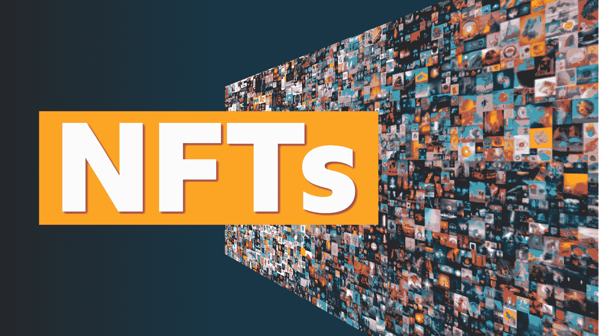
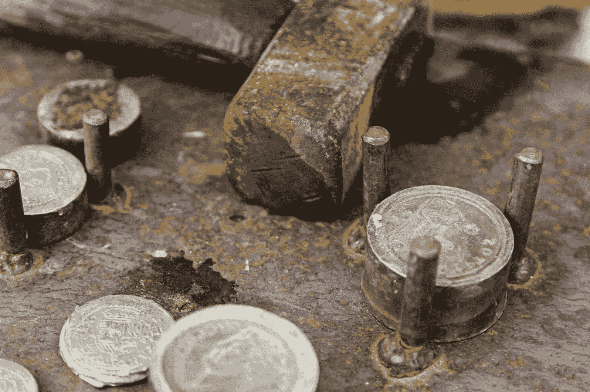
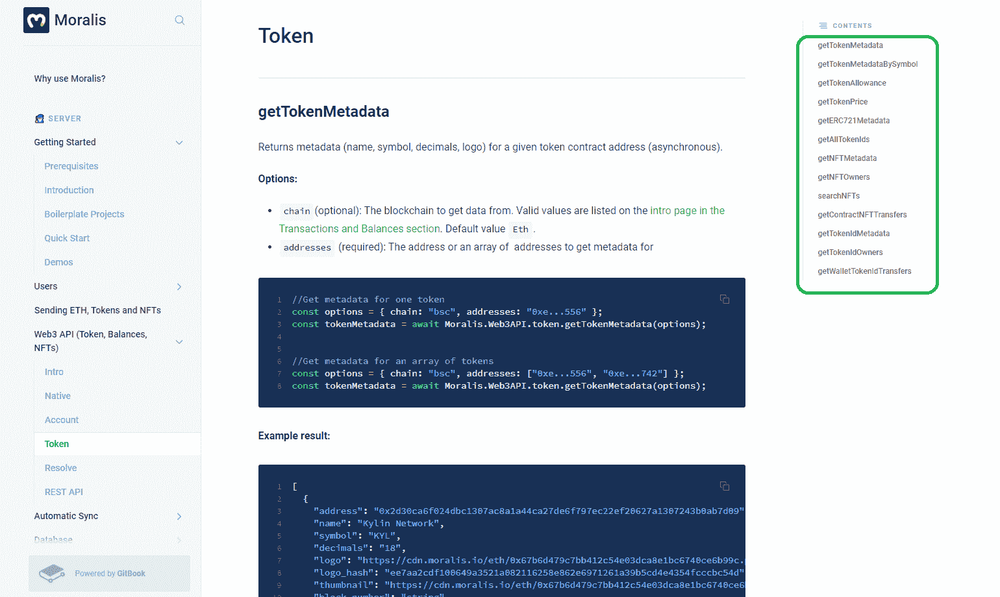
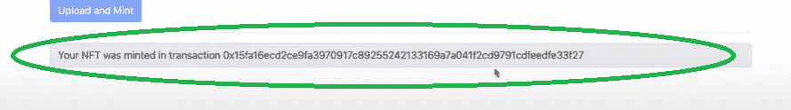
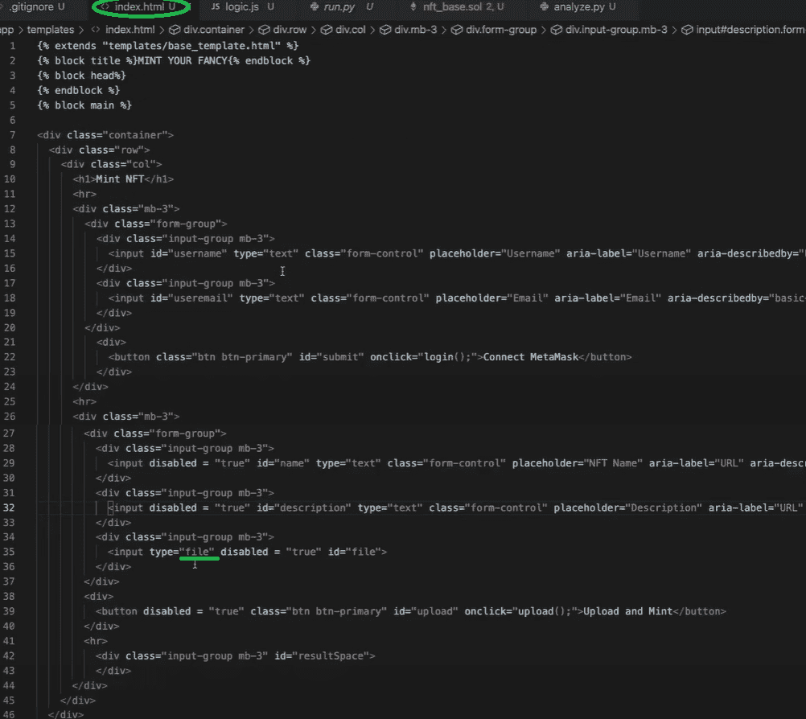

# 打造非功能性食物的最佳 API 完整指南

> 原文：<https://moralis.io/best-api-to-mint-nfts-full-guide/>

不可替代令牌(NFT)是区块链技术最广为人知的应用之一。事实上，从艺术家到名人，从运动员到电影明星，每个人都在发行自己的 NFT 代币和 NFT 收藏品。因此，一般公众开始越来越熟悉这种独特令牌的数字所有权的概念。这反过来又推动了艺术品、收藏品、门票等等的更大的符号化。虽然我们离主流采用还很远，但这个特殊的加密分支已经为开发人员提供了无数的机会，他们可以创建高质量的 NFT[**【dApps】**](https://moralis.io/decentralized-applications-explained-what-are-dapps/)**。此外，开发人员利用正确的工具来帮助他们加速开发过程将受益最大。因此，学习制造 NFT 的最佳 API 可能是您的区块链开发道路上的关键点之一。**

不久前，整个 [Web3](https://moralis.io/the-ultimate-guide-to-web3-what-is-web3/) 开发过程还充满挑战，主要是因为没有合适的工具来帮助后端编码。然而，现在我们有几个著名的平台提供广泛的解决方案。虽然这些解决方案大多专注于提供节点的 T2，但有一个平台将事情带到了一个全新的水平，它提供了强大的工具来充分装备区块链开发人员。这个最终的 Web3 开发平台是 [Moralis](https://moralis.io/) ，它提供了令人印象深刻的 Web3 SDK，包括创建 NFT 的最佳 API，这将是本文的主要焦点。所以，如果你对 NFT 的发展很认真，[今天就创建你的免费 Moralis 账户](https://admin.moralis.io/register)！

## 什么是 NFT？

在我们深入研究之前，让我们先了解一下基础知识。所以，让我们先来回答这个问题，“[什么是 NFT](https://moralis.io/non-fungible-tokens-explained-what-are-nfts/)？”。简而言之，NFT 或不可替代的令牌是独特的加密资产。正如“不可替代”一词所暗示的，没有两个或两个以上的非功能性语言是相同的。即使它们是它们所代表的同一项的副本，每个副本仍然具有唯一的属性。因此，NFT 非常适合数字艺术和收藏品。此外，它们已经提供了广泛的其他(更严重的)用例，比如认证和所有权表示。

就数字艺术而言，NFT 本质上是 jpeg 文件；然而，是特定区块链上的铸造过程将常规数字文件转换成了 NFT。这个过程分配所有权和许多其他可以进一步利用的财产。例如，可以为一个 NFT 分配某种佣金或小费属性。这意味着原始所有者将自动获得未来购买该 NFT 的预定百分比。这样，随着时间的推移，艺术家的作品会增值，他也会得到回报。这只是 NFTs 提供的众多优秀功能之一。因此，NFTs 的使用还带来了一种全新的方法，通过确保自动公平交易(使用智能合同)来实现所有权、透明度和消除(通常)不诚实的中间人。

### NFT 铸造的是什么？

创造 NFT 的过程与创造实体硬币的过程具有相同的措辞。虽然硬币是通过冲压金属铸造的，但 NFT 是通过转换不同格式的数字文件(PDF、JPEG、PNG、MP4 等)铸造的。)转化为独特的区块链资产。

此外,“铸造”一个 NFT 就是在一个特定的区块链上创建一个事务(最常用的是以太坊),它赋予 NFT 独特的属性，并存储我们要转换成区块链上的 NFT 的数据和文件。因此，“NFT 铸造”也被称为验证信息的过程。一旦铸造了 NFT，它就带有一系列数据，包括:

*   NFT 的所有权信息
*   NFT 的合同类型
*   NFT 创作时间(铸造)
*   所有 NFT 的元数据
*   令牌地址、ID、哈希和 URI

因此，使用一个合适的 API 来创建 NFT 是很重要的，这样所有的上述信息都可以自动合并，而不需要任何繁琐的后端编码。

让我们也指出，铸造一个 NFT 和创造一个 NFT 从技术上讲不是一回事。虽然制造 NFT 仅指将数字文件交易到区块链的过程，但是创建 NFT 的过程也包括数字文件本身的创建。然而，你会看到这两个术语经常互换使用。如果你想了解更多关于如何[创建你自己的 NFT](https://moralis.io/how-to-create-your-own-nft-in-5-steps/) ，一定要看看我们的五步指南。

## 解释了制造 NFT 的 API

API 或“应用程序编程接口”允许软件之间相互通信。因此，它能够以确保相互理解的方式翻译一系列不同的指令。因此，API 支持对每个请求的可复制功能的一致编码和可预测的可交付性。此外，API 通常是每个像样的 SDK 的一部分。如果您不确定 SDK 和 API 之间的区别，请务必查看我们的文章，了解更多细节。在那篇文章中，我们有一个专门的章节来解释这一点。

当我们谈论创建 NFT 的 API 时，我们本质上是指应用于这个特定用例的 API 的上述概念。因此，铸造 NFT 的最佳 API 使您能够最轻松地将铸造功能实现到您的 NFT dapp 中。

# 制造 NFT 的最佳 API

今天你可以在多条链上铸造 NFTs 然而，以太坊仍然是最受欢迎的选择。因此，就 NFT API 而言，ERC-721 和 ERC-1155 令牌标准是 Moralis 关注的焦点。除了为您提供创建 NFT 的最佳 API 之外，Moralis 还提供了一组广泛的代码片段，允许 NFT 开发人员将一整套 NFT 功能添加到他们的分散应用程序中。

在这一点上，你可能想知道，“为什么不使用市场来创造非功能性交易呢？”。使用诸如 OpenSea 这样的市场来铸造 NFT 肯定是一个选择。然而，由于区块链的主要目的是去中心化，使用集中的平台来制造 NFT 不符合区块链技术背后的愿景。此外，这些类型的市场有他们的额外费用。因此，至少在我们看来，以一种分散的方式创建自己的 NFT 是可行的，尤其是如果你是一名开发人员，因为这涉及到一些编码。如果您遵循运行您自己的 [RPC 节点](https://moralis.io/ethereum-rpc-nodes-what-they-are-and-why-you-shouldnt-use-them/)并围绕它构建基础设施的通用路径，这可能是一个冗长而复杂的过程。然而，通过使用 [Moralis 的 API](https://docs.moralis.io/moralis-server/web3-sdk/token) 来制造 NFT，事情变得简单多了。

此外，使用最好的 API 来铸造 NFT 使您能够轻松地将 NFT 铸造功能添加到任何 Web3 应用程序中，无论是 NFT 的游戏、T2 的 NFT 钱包还是 NFT 的市场。这样，你就可以确保你的用户可以在你的平台上创建 NFT。简而言之，Moralis 的 [NFT API](https://moralis.io/ultimate-nft-api-exploring-moralis-nft-api/) 代表了制造非功能性测试的最佳 API，或者一般来说与非功能性测试一起工作的最佳 API。

说到这里，让我们来看一个示例项目。

## Moralis 制造 NFT 的 API 一个示例项目

在这里，我们将[构建一个 Web3 应用程序](https://moralis.io/ultimate-guide-how-to-build-ethereum-dapps/)，它将使您能够创建 NFT。这样，您将能够看到创建 NFT 的最佳 API，同时提高您的 NFT 开发技能。此外，您将看到各种 Moralis 工具，包括其与 [IPFS](https://moralis.io/what-is-ipfs-interplanetary-file-system/) (分散存储的领先解决方案)的交互方式，如何简化开发过程。当然，您也可以避免使用 IPFS，但是这意味着您将限制自己使用更集中的方法，这将您的项目暴露在单点故障的风险中。因此，我们将关注这个项目的分散方式。

这是我们完成的 dApp 界面的样子:

它将使用户能够使用用户名和电子邮件地址登录，并使用元掩码验证自己，正如“Connect [元掩码](https://moralis.io/metamask-explained-what-is-metamask/)按钮所建议的那样。然后，他们将能够命名 NFT，添加描述，选择文件，最后上传文件并创建 NFT。如果操作正确，这种消息会出现在底部:

### 创造非功能性测试的最佳 API

为了实现上述结果，我们将创建一个 [Python](https://moralis.io/python-explained-what-is-python/) flask 应用程序。app 会触发所有关联的代码，包括“index.html”和“logic.js”，这是我们要重点关注的。

“index.html”文件将确保我们的 dApp 看起来像上图中显示的那样。它将使用户能够与我们的分散式应用程序进行交互，并创建他们的 NFT。然而，确保一切顺利运行的是“logic.js”文件(使用 [JavaScript](https://moralis.io/javascript-explained-what-is-javascript/) )。而且，这是”。js”文件，我们用它来插入由 [Moralis 的文档](https://docs.moralis.io/)提供的代码片段，包括创建 NFT 的 API。

下面是我们的“index.html”文件的样子:

下面是我们的详细情况”。js "文件:

多亏了 Moralis 和它的制造 NFT 的 API，我们能够用少至 71 行的代码得到我们的 dApp 的逻辑。

此外，我们需要指出，最上面的两行对于每个使用 Moralis 的项目都是至关重要的。他们确保你通过连接到你的 Moralis 服务器来访问整个军火库。要更详细地了解这些初始步骤，请参阅下面的“Moralis 设置”小节。

此外，铸造是通过与[智能契约](https://moralis.io/smart-contracts-explained-what-are-smart-contracts/)交互来进行的。然而，为了这个项目，我们不希望你处理创建自己的智能合同。因此，我们已经在第四行的代码中介绍了这个方面。因此，您可以将主要精力放在使用 Moralis 的 API 来制造 NFT 上。

此外，您可以在 [GitHub](https://github.com/DanielMoralisSamples/19_MINTNFT) 访问该项目的完整代码。

#### Moralis 设置

要获得 Moralis 服务器的 ID 和 URL，需要完成四个步骤:

1.  **创建您的 Moralis 账户**–如果您还没有 Moralis 账户，请确保现在就创建一个。最棒的是，它是完全免费的！只需[点击链接](https://admin.moralis.io/register)，输入你的电子邮件地址并创建你的密码。然后确认您的电子邮件地址(您将收到一封带有确认链接的电子邮件)。对于那些已经有一个活跃的 Moralis 账户的人来说，只需[登录](https://admin.moralis.io/login)。
2.  **创建一个新的服务器**–一旦你登录了你的 Moralis 账户，你需要创建一个新的服务器。只需点击右上角的“+创建新服务器”按钮，然后从出现的下拉菜单中选择一个选项(见下图)。我们建议从“Testnet 服务器”选项开始。

接下来，输入所需的详细信息:服务器名称(可以是您想要的任何名称)，选择区域、网络、链(您可以选择一个或多个选项)，然后单击“添加实例”。

3.  **访问服务器详细信息**–现在您的服务器已经准备就绪，您可以获取详细信息以在我们的中使用。js”文件。为此，请单击服务器名称旁边的“查看详细信息”按钮。然后，将出现一个包含所有信息的弹出窗口。*如果你以前用过 Moralis，你可能已经设置了一个或多个服务器。在那种情况下，你可以使用任何一个。*

4.  **初始化 Moralis-**通过填充。js”文件，我们获得了所需的后端功能:

*注意:请不要* *而不是* *从上图中复制服务器详细信息。您需要使用特定服务器的详细信息。*

如果您想了解我们的示例项目代码的更多细节，我们推荐您观看视频，视频中介绍了如何[创建您自己的 NFT 造币应用程序](https://www.youtube.com/watch?v=WdQHnb_5m5Q&feature=emb_title)。

## 打造 NFT 的最佳 API 总结

鉴于 NFT 受欢迎程度的增长和名人对其区块链用例的不断采用，将这一点转化为你的优势似乎是明智的。因此，本文为您提供了许多有价值且可行的建议，您应该加以利用。您已经了解到，当使用一个有用的工具时，NFT 开发会变得容易得多。其中一个工具是 Moralis 的终极 Web3 开发平台，它拥有制造 NFT 的最佳 API。使用这种快捷方式，您只需从 Moralis 整洁的文档中复制并粘贴简短的代码片段，就可以开发自己的具有各种 NFT 功能的 dApps。此外，我们还介绍了一个例子项目，我们创建了一个 NFT minting Web3 应用程序。

我们希望你能抓住这个机会，使用 Moralis 来加快你的投递速度，同时节省时间和其他资源。此外，Moralis 是 BSC 的首选 [Infura，并且还提供其他功能——如轻松访问](https://moralis.io/infura-bsc-alternatives-the-best-alternative-to-infura-for-bsc/) [BEP20 测试网](https://moralis.io/bep20-testnet-create-a-bep20-token-in-15-mins/)或关于[如何构建以太坊 dApps](https://moralis.io/ultimate-guide-how-to-build-ethereum-dapps/) 的指南。如果你想了解更多关于 Moralis 的信息，并从多个示例项目中获得更多灵感，我们建议查看 [Moralis 的博客](https://moralis.io/blog/)和 [Moralis 的 YouTube 频道](https://www.youtube.com/channel/UCgWS9Q3P5AxCWyQLT2kQhBw)。它们都定期提供新鲜的高价值内容。祝你的 [NFT 编程](https://moralis.io/nft-programming-for-beginners/)好运——有了 Moralis NFT API，现在比以往任何时候都容易！

