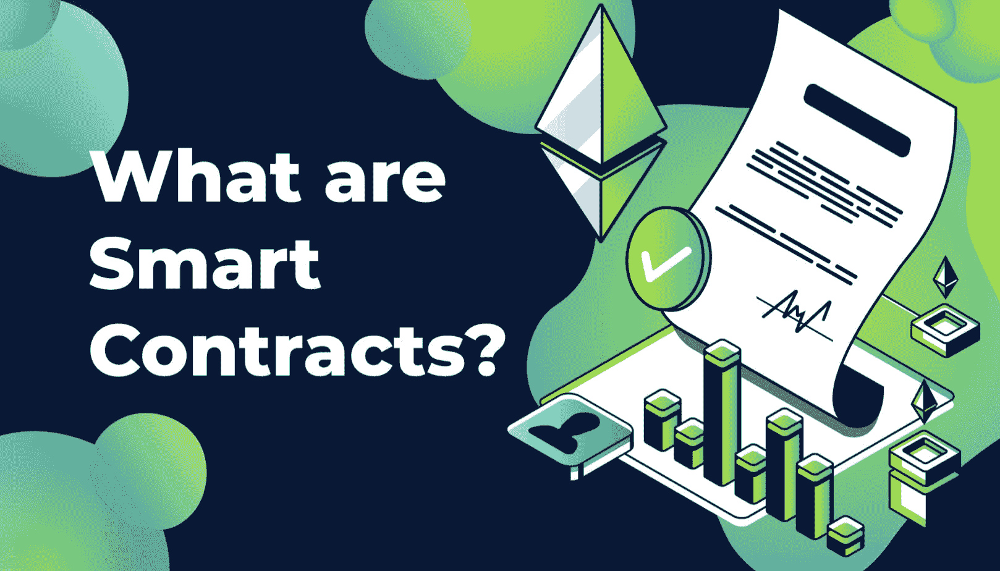
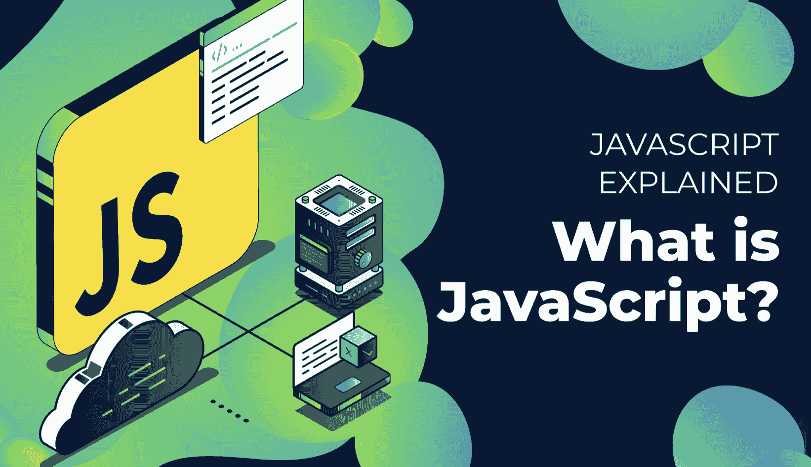
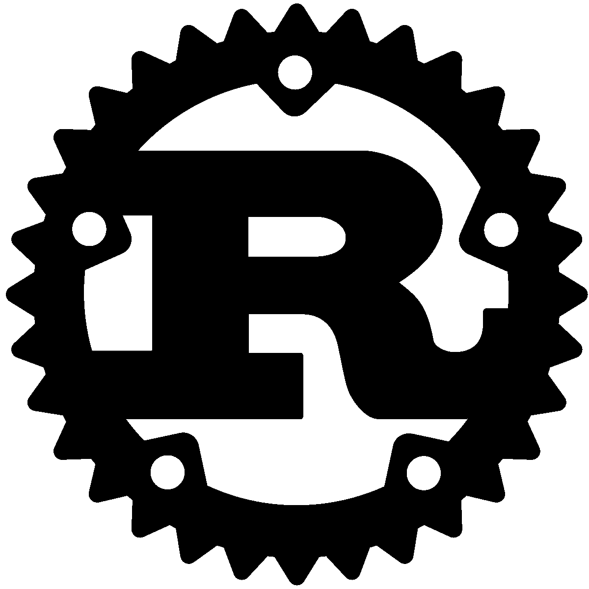

# 区块链开发的最佳语言——完整教程

> 原文：<https://moralis.io/best-languages-for-blockchain-development-full-tutorial/>

区块链开发依赖于编程语言，就像任何种类的软件开发一样。虽然像 Moralis 这样的平台让区块链编程变得前所未有的简单，但是在开发你的[**【dApps】**](https://moralis.io/decentralized-applications-explained-what-are-dapps/)**(去中心化应用)时，你还是应该了解一下最流行的语言。此外，区块链地区急需更熟练的程序员和 Web3 开发人员。因此，如果你已经是一名 Web3 开发者，现在是向 Web3 行业过渡的好时机。然而，要成为一名区块链开发者，你需要掌握一些特殊的技能。例如，你需要理解并精通特定的编程语言。出于这个原因，我们将在本文中更深入地研究适合区块链开发的最佳语言。**

你可能没有任何开发经验；然而，有了 [Moralis](https://moralis.io/) ，成为一名区块链开发者就容易多了！即使先前的开发技能是有利的，也没有什么需要学习的，例如，创建 dApp 或令牌。有了 Moralis，就有可能消除 Web3 开发中一些最麻烦的任务，比如开发复杂的后端基础设施。

此外，Moralis 提供了一些实用的开发工具，可以帮助您开发 dApps、可替换令牌和[NFT](https://moralis.io/?s=NFTs&asp_active=1&p_asid=1&p_asp_data=1&current_page_id=3594&qtranslate_lang=0&filters_changed=0&filters_initial=1&asp_gen%5B%5D=title&asp_gen%5B%5D=content&asp_gen%5B%5D=excerpt&customset%5B%5D=post)(不可替换令牌)。比如平台提供 [Moralis 极速节点](https://moralis.io/speedy-nodes/)和 [Moralis 的 NFT](https://moralis.io/announcing-the-moralis-nft-api/) 和[价格 API](https://moralis.io/introducing-the-moralis-price-api/) 。

所以，如果你想成为一名区块链开发者，那么正确方向的第一步是[与 Moralis](https://admin.moralis.io/register) 签约。注册是免费的，您将立即获得所有平台的开发工具！

# Solidity 和 JavaScript——区块链开发的最佳语言

成为一名区块链开发者可能看起来是一项繁琐的任务；然而，这并不一定那么难。有几个有用的开发工具和平台使得 dApp 开发变得更加容易。然而，有一些基本的要素你需要知道。说到加密领域，区块链开发的两种最佳语言是 Solidity 和 JavaScript。此外，根据你想开发的区块链，你可能还需要一些关于铁锈的技能。

然而，最突出的发展是区块链支持被称为 [EVM](https://moralis.io/evm-explained-what-is-ethereum-virtual-machine/) (以太坊虚拟机)的东西。因此，利用 EVM 的连锁店支持可靠的智能合同。因此，我们将重点关注 Solidity 和 JavaScript，因为它们是区块链开发中最常用的语言。

此外，JavaScript 和 Solidity 有许多相似之处，因为它们都是面向对象的语言。因此，如果你有 JavaScript 的先验知识，掌握 Solidity 应该不会太难。然而，即使这两种语言有一些相似之处，它们的目的却完全不同。

开发人员使用 Solidity 来开发智能合约，这在创建 dApp 时只占用大约 10%的代码。另一方面，JavaScript 更加充实，在使用 Moralis 时，我们可以用 JavaScript 完成很多事情。与 Solidity 相比，JavaScript 主要用于离线开发，例如，从各种区块链获取数据。

所以，这意味着了解 Solidity 和 JavaScript 将极大地推进你的区块链开发之旅。出于这个原因，我们将在接下来的章节中深入研究这两种语言。

然而，如果你想了解更多关于这些语言的知识，但更喜欢看视频，看看下面这个来自 [Moralis 的 YouTube 频道](https://www.youtube.com/channel/UCgWS9Q3P5AxCWyQLT2kQhBw)的视频:

https://www.youtube.com/watch?v=KTcX23wfLDA

## 区块链开发的最佳语言:可靠性

正如上一节提到的， [Solidity](https://moralis.io/solidity-explained-what-is-solidity/) 是一种用于开发智能合约的语言。因为 Solidity 擅长创建智能契约，所以社区认为 Solidity 是第一种面向契约的编程语言。这种语言同时受到 C++和 JavaScript 的影响，这意味着它们有许多共同的特性。例如，Solidity 是一种“花括号”语言，支持继承。因此，之前的 JavaScript 和 C++知识将帮助你更快地学习 Solidity。

由于 Solidity 是专门为开发智能合约而设计的，所以该语言提供了一些已经开发的功能和命令。这意味着，举例来说，开发人员可以轻松地访问各种链上特定块和地址的时间戳。这些命令和面向智能合约的方向使得区块链和智能合约开发更加无缝和可靠。

此外，这种面向对象的编程语言使开发人员能够创建与 EVM 兼容的智能合约。这意味着，每当一个合同被敲定，它就会被编译成 EVM 的字节码。因此，任何使用 EVM 的连锁店也可以运行使用 Solidity 开发的合同。由于这个原因，可以为大多数主要的区块链(如 BSC、以太坊、多边形等)编写智能合约。这意味着学习 Solidity 不会把你限制在以太坊开发上，而是给你进一步的行业机会。

此外，在解释可靠性时，我们一直提到智能合同。如果你不熟悉区块链，这可能是一个陌生的概念。因此，我们将在下一节更深入地探讨什么是智能合约。

此外，如果你对学习 Solidity 感兴趣，那就去参观一下 [Ivan on 科技学院](https://academy.ivanontech.com/)。在那里你可以找到关于[以太坊开发](https://academy.ivanontech.com/courses/ethereum-101)的课程，涵盖了智能合约的开发。

### 什么是智能合约？

智能合同是区块链发展最著名的例子之一，在创建 dApps 时至关重要。为了解释它们是什么，我们将以以太坊的区块链为例。因此，当涉及以太坊开发时，智能合约本质上是运行在区块链上的程序。任何以太坊智能合约都有两个必不可少的部分:1)合约的功能，2)合约的数据。一旦部署完毕，这些信息就会被存储在一个特定的以太坊地址上。

此外，所有智能合约也是一种特定类型的账户。既然是网络的账户，就有了余额，可以在链上进行交易。但是，它们不同于普通用户帐户，因为没有用户实际控制它们。相反，契约的代码控制账户并决定交易是否执行。

将智能合约比作数字自动售货机并不罕见，这是解释它们如何工作的一个绝佳类比。所以，把合同想象成一台自动售货机；你首先输入一些资金，然后机器分析金额，如果足够，它会返回一些结果。然而，智能合约通常执行某种形式的链上交易，而不是返回物理产品。

此外，区块链社区的一个显著特点是开源代码的数量。网上已经有很多智能合同，这意味着在很多情况下，你甚至不需要自己写合同。因此，无需从头开始构建一个契约就可以创建 dApps。

## 区块链开发的最佳语言:JavaScript

如果你想成为一名区块链开发者，你应该研究的第二种语言是 JavaScript。JavaScript 是一种面向对象的编程语言，主要用于 web 开发。JavaScript 代码为网站增加了功能和交互性元素。因此，每当网页不仅仅显示数据时，JavaScript 就很有可能成为等式的一部分。

此外，JavaScript 通常被称为 Web2 开发的第三层。前两层是 [CSS](https://moralis.io/cascading-style-sheets-what-is-css/) 和 HTML，这也是开发 web 应用程序时的重要因素。HTML 是一种向网页添加字段、按钮和结构的标记语言，而开发人员使用 CSS 根据他们的偏好来设计页面的样式。

JavaScript 使得网页比单独使用 CSS 和 HTML 时更加动态。因此，这种语言增强了网页，使其用户友好和动态。这对于确保用户再次使用我们的应用程序和网页非常重要。

此外，就 Web3 开发而言，JavaScript 也很重要。使用 Web2 的相同三层来为分散式 Web 创建 web 应用程序是可能的。因此，我们可以使用 JavaScript 来增加功能和难度，使用 HTML 来构建内容，使用 CSS 来设计 dApps。

然而，Web2 和 Web3 JavaScript 开发之间有一些细微的差别。例如，当涉及到 Web3 时，必须实现并知道如何使用“web 3 . js”web 3 库。但是，如果您以前有使用 JavaScript 进行 Web2 开发的经验，那么您将能够轻松掌握 Web3 库。

## 区块链开发的最佳语言:Rust

在市场上可用的大多数重要区块链上进行开发时，可以利用 Solidity。然而，也有一些例外，这意味着需要另一种语言来[创建智能合同](https://moralis.io/how-to-create-smart-contracts/)。例如，如果你想在 Solana 的基础上构建，Solidity 将不起作用，相反，你需要在创建智能合同时使用 Rust。那么，什么是铁锈呢？

Rust 是一种多范式、静态类型、低级编程语言，强调安全性和性能。该语言旨在解决一些最重要的 C++和 C 编程问题，例如构建并发程序。

以下是 Rust 编程语言的三个最突出的优点:

1.  编译器确保了更好的内存安全性。
2.  更易访问的并发性。
3.  零成本抽象。

然而，这只是对 Rust 的一个简要总结，我们不会深入探讨这个主题。原因是 Solidity 和 JavaScript 更广泛地用于 Web3 开发。所以，如果需要优先排序，从 Solidity 和 JavaScript 入手应该是首选。这将为你提供最多的机会，给你一个更全面的工作链。

### Moralis 解释道

尽管在大多数区块链上的开发需要相同的语言，但还是有一些例外。然而，对于大多数区块链开发来说，一个不变的共性是利用 Moralis 的可能性。

Moralis 是 Web3 开发的终极中间件，该平台为其用户提供了已经开发好的后端基础设施。因此，Moralis 允许开发人员避免设置后端的复杂开发过程。

此外，编写 JavaScript 代码时另一个有用的工具是 [Moralis SDK](https://moralis.io/exploring-moralis-sdk-the-ultimate-web3-sdk/) (软件开发工具包)。Moralis SDK 提供了在 dApp 开发中常用的已开发的函数。因此，你不需要重新发明轮子，因此，你可以节省大量的时间和资源。例如，以下是 Moralis 的一些现成功能:

1.  登录用户。
2.  获取从 NFT 到可替换令牌的所有内容的余额。
3.  提取交易。
4.  获取智能合同事件。
5.  发送交易。

从头开始创建这些功能是浪费时间，因为 Web3 开发的这一部分相当复杂。然而，这正是为什么你应该用 Moralis 来补充你在可靠性和 JavaScript 方面的技能。此外，如果你使用 Moralis，你不需要了解太多关于这些语言的知识，因为这个平台使得 Web3 的开发更加容易。你可以在官方文档中找到更多关于 Moralis 的信息。

所以，如果你想成为一名区块链开发者，你应该马上和 Moralis 签约。这将使您能够立即访问该平台的工具，包括 SDK。

## 区块链开发的最佳语言——总结

简而言之，你应该检查一下最适合区块链开发的语言是 Solidity 和 JavaScript。Solidity 是开发智能合同的头号编程语言。然而，在某些情况下，甚至没有必要知道可靠性，因为市场上已经有可以用于 dApp 开发的开发合同。

此外，就离线编程而言，JavaScript 是区块链开发的最佳语言。结合使用 JavaScript 和 Moralis，可以相对容易地设置 dApps 所需的必要功能。如果你有兴趣学习更多关于 JavaScript 的知识，你可以访问 Ivan on Tech Academy，它提供了一门优秀的 [JavaScript 课程](https://academy.ivanontech.com/courses/javascript-programming-for-blockchain-developers)。

此外，Solidity 和 JavaScript 将允许您在众多链上进行开发，如[以太坊](https://moralis.io/full-guide-what-is-ethereum/)、Polygon、Avalanche 和 BSC。因此，理解这些语言将为你提供无限的机会。此外，有一个平台将在开发过程中对你有很大的帮助，不管你是在哪个链上开发的，那就是 Moralis。该平台提供的后端基础设施使您能够避免重新发明轮子，因此，您将能够节省大量资源。

因此，[与 Moralis](https://admin.moralis.io/register) 签约是成为顶级区块链开发商的第一步！加入该平台是完全免费的，您可以立即开始您的开发之旅。此外，查看 Moralis 的免费指南，从 RPC 节点的[限制](https://moralis.io/exploring-the-limitations-of-rpc-nodes-and-the-solution-to-them/)、 [BEP20 testnet](https://moralis.io/bep20-testnet-create-a-bep20-token-in-15-mins/) 或 [NFT 令牌开发](https://moralis.io/nft-token-development-the-ultimate-guide/)到 Moralis 的综合 [NFT API](https://moralis.io/ultimate-nft-api-exploring-moralis-nft-api/) 。