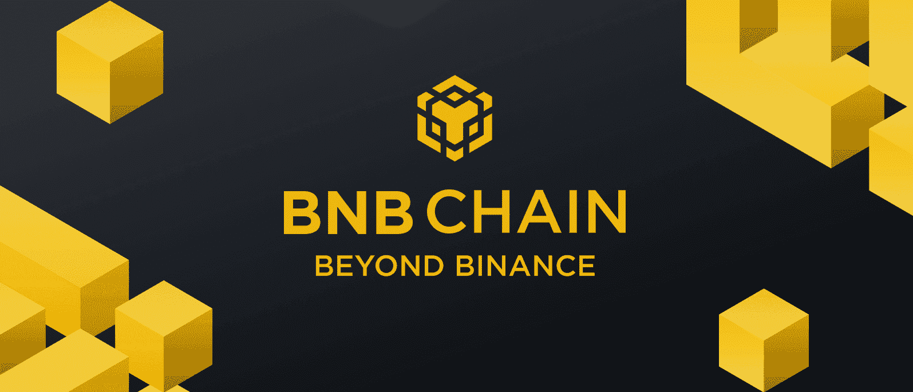
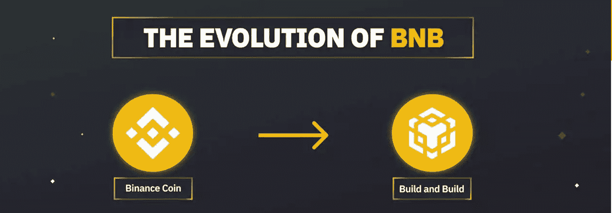
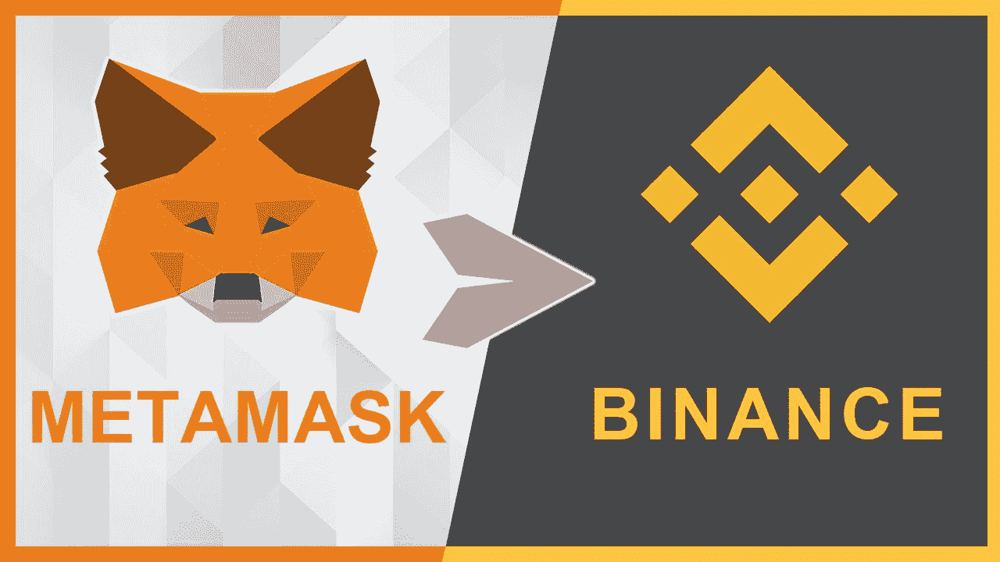
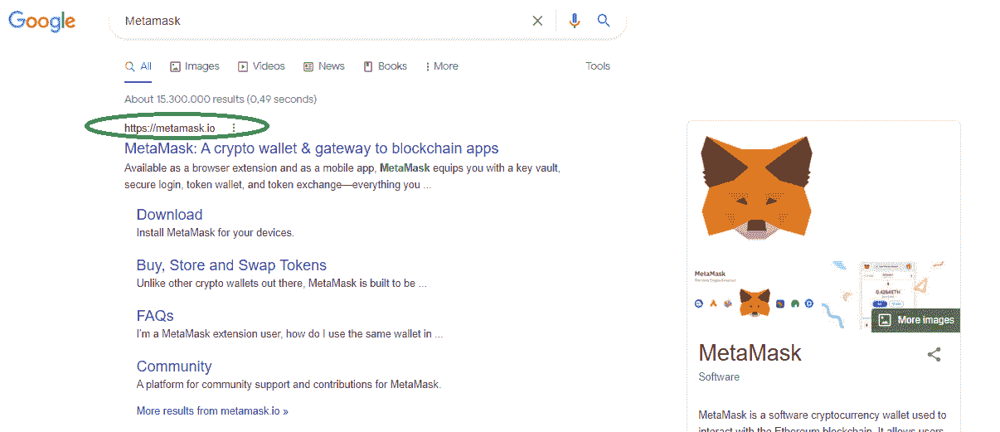
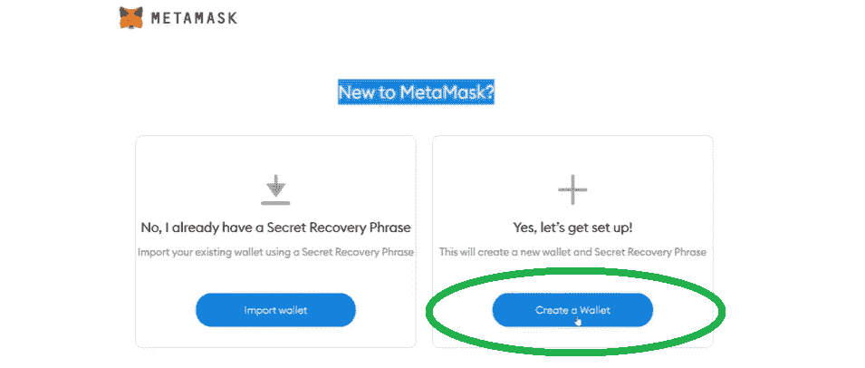
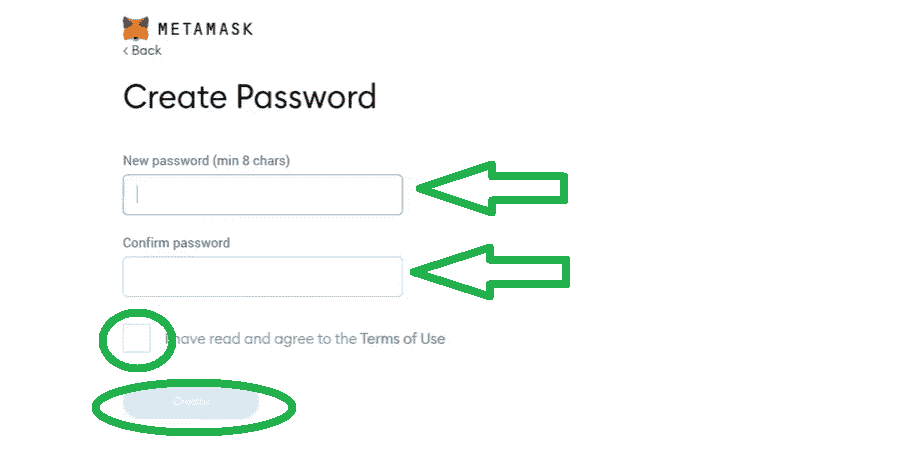
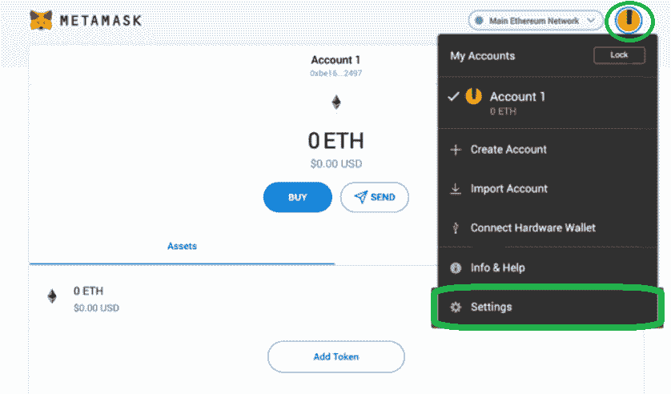
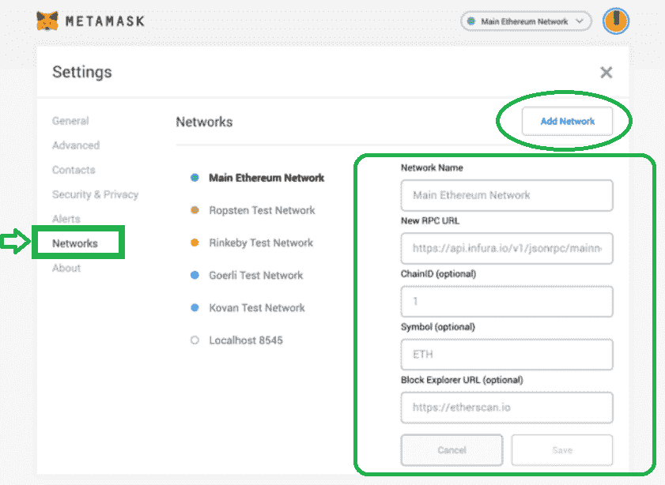

# 金融硬币钱包指南——如何设置 bnb 钱包

> 原文：<https://moralis.io/binance-coin-wallet-guide-how-to-set-up-a-bnb-wallet/>

如果你想利用 [**BNB 链**](https://moralis.io/how-to-create-a-bnb-chain-token-in-5-minutes/) **为区块链发展，你应该学会如何设置一个 BNB 钱包。创建这样的钱包是必不可少的，因为它使用户能够与 BNB 链上的 dapps 进行交互。有了这么多可编程区块链作为** [**去中心化应用**](https://moralis.io/decentralized-applications-explained-what-are-dapps/) **(dapps)的基础，我们知道以太坊广受欢迎。然而，BNB 链正在获得吸引力，因为它比以太坊有很多好处，如低费用。因此，程序员决定使用更具成本效益的替代方案并不奇怪，因为这样更有利可图。如果你是那些想深入 BNB 连锁发展，并一直在寻找币安硬币钱包指南的人之一，不要再找了！我们准备了如何轻松设置 BNB 钱包的分步指南，我们将在此进行探讨。**

在处理本文主题的核心之前，我们需要从基础开始。因此，我们将首先确保您了解什么是 BNB、币安连锁、BSC 和 BNB 连锁。然后，我们将集中讨论 BNB 钱包指南的主题。这时你将学习如何使用[元掩码](https://moralis.io/metamask-explained-what-is-metamask/)设置 BNB 钱包。当然，你也可以使用其他的 BNB 钱包；然而，面向开发者的[元掩码](https://moralis.io/metamask-for-developers-how-to-launch-web3-apps-with-metamask/)是一个必不可少的工具。如果你想与最好的 [Web3 后端平台](https://moralis.io/exploring-the-best-web3-backend-platform/)、 [Moralis](https://moralis.io/) 合作，也是如此。这个" [Firebase for crypto](https://moralis.io/firebase-for-crypto-the-best-blockchain-firebase-alternative/) "平台使得[使用元掩码](https://moralis.io/building-dapps-with-metamask/)构建 dapps 毫不费力。此外，您可以[使用元掩码](https://moralis.io/how-to-authenticate-with-metamask/)进行认证，并进而负责 [Web3 认证](https://moralis.io/web3-authentication-the-full-guide/)。此外， [Moralis SDK](https://moralis.io/exploring-moralis-sdk-the-ultimate-web3-sdk/) 是当前 [Web3 技术栈](https://moralis.io/exploring-the-web3-tech-stack-full-guide/)的巅峰之作。这是在包括 BNB 连锁店在内的不同连锁店创建全系列 dapps 的终极捷径。

### 探索 BNB、理学士、卑诗和 BNB 链

正如我们前面提到的，我们首先要确保你正确理解基础知识。希望我们也能澄清币安最近更名所引起的一些困惑。然而，如果你急于学习如何设置一个 BNB 钱包，请随意跳转到“分步指南”部分。

说到币安——一家区块链公司和集中交易所(CEX)——这一切都要追溯到 2017 年。这是他们推出币安链(公元前)和链的本地硬币——BNB。然而，币安链不能作为开发人员可以创建 dapps 的可编程链。于是，2020 年，币安智能链(BSC)诞生了。随着这一举动，币安不仅仅是另一个 CEX。因此，币安现在提供了一个相当广泛的加密服务生态系统。这些包括币安实验室，币安发射台，币安云，币安 NFT 市场，等等。这清楚地表明，币安是一种混合 CeFi 平台。

### 遇见 BNB 连锁店

在继续前进之前，我们必须指出，2022 年 2 月中旬，币安更新或更名其连锁店。因此，他们引入了“BNB 链”。后者包括 BSC(币安智能连锁)和 BC(币安连锁)。然而，让事情变得更复杂的是，他们还决定重命名他们现有的链。因此，币安智能链现在是 BNB 智能链。好在这意味着缩写没变，还是 BSC。此外，币安连锁店成为 BNB 灯塔连锁店。此外，这一更新也影响了币安硬币，现在被称为“建设和建设”。因此,“BNB”这个代号仍然有效。此外，幸运的是，它没有影响两条链的功能。

以下是币安 2022 年 2 月更新的要点:

*   币安连锁和币安智能连锁变成了 **BNB 连锁**。因此，BNB 链由现有的两条链组成。
*   币安链变成了 **BNB 信标链**，服务于 BNB 链治理(跑马圈地，投票)。
*   币安智能链变成了 **BNB 智能链** ( **BSC** 仍然存在)，这是一个 EVM 兼容的共识层，具有多个链的集线器。
*   BNB(以前叫做币安硬币)现在代表“建设和建设”。然而，BNB 用例保持不变。虽然，它现在被认为是区块链的汽油令牌，为 BNB 链条上的交易“加油”。
*   BNB 链旨在建立世界并行虚拟生态系统基础设施。

作为开发人员，您应该记得 BSC 与以太坊区块链非常相似。毕竟，BSC 本质上使用相同的代码库。当然，一些参数被调整和更新，但原则是相同的。

## 什么是 BNB 钱包？

你可能知道有很多加密货币。可以存储这些货币的地方被称为加密钱包或 Web3 钱包。一般来说，有两种加密钱包:热加密钱包和冷加密钱包。后者是离线存储。然而，热钱包指的是使用户能够与不同的区块链互动的在线应用。因此，这取决于你如何看待事情——BNB 钱包可以被称为存储 BNB 的冷加密钱包。然而，“BNB 钱包”通常是指一个热门的加密钱包，可以存储 BNB 硬币。尽管如此，请注意，每个支持 BNB 的区块链地址都可以用作 BNB 钱包。在回答“如何设置一个 BNB 钱包？”时，这绝对是要记住的事情问题。*T3*T5】**

我们还必须告诉你，币安有自己的加密钱包。它以浏览器扩展和移动应用程序的形式提供。根据网上评论，前者是币安交易所用户的可靠选择。然而，如上所述，Web3 开发者和任何想成为区块链开发者的人都应该专注于使用 MetaMask。

## 如何使用 MetaMask 设置 BNB 钱包–分步指南

这本 BNB 钱包指南将带你经历建立你的第一个 BNB 钱包的过程。默认情况下，元掩码使您能够[创建一个 ETH 钱包](https://moralis.io/how-to-create-an-eth-wallet-full-guide/)。那是因为 MetaMask 最初只支持以太坊的 mainnet 和[testnet](https://moralis.io/ethereum-testnet-guide-connect-to-ethereum-testnets/)。然而，我们可以将其他网络添加到钱包中。因此，我们将向您展示如何添加 BNB 智能链到您的元蒙版。此外，您将能够使用相同的原则添加其他著名的 EVM 兼容链到这个加密钱包。

在接下来的几节中，我们将向您展示如何下载、安装和设置您的第一个带有 MetaMask 的钱包。另外，我们将展示如何添加 BNB 链网络。这四个步骤基本上就是“如何设置 BNB 钱包”任务的全部内容。尽管如此，如果你的浏览器已经配备了元掩码扩展，你可以直接跳到“添加 BNB 链到元掩码”部分。

### 下载并安装元掩码

1.  首先使用您喜欢的浏览器搜索“元掩码”。我们建议使用谷歌浏览器。接下来，仔细检查您将要点击的官方元掩码 URL 地址:

2.  进入 MetaMask 官网后，需要点击“下载”。您可以在右上角或主页上找到此按钮:

3.  一旦进入“下载”页面，你需要在“Chrome”、“iOS”和“Android”之间做出选择。如果你打算在 Web3 开发中使用 MetaMask wallet，那就关注“Chrome”选项。选择“Chrome”选项后，点击“为 Chrome 安装 MetaMask”按钮:

4.  接下来，你会被重定向到谷歌浏览器的网上商店。在那里，你需要点击“添加到 Chrome”:

5.  将扩展添加到浏览器后，会出现一个弹出窗口要求确认。要继续，您需要点击“添加扩展”:

6.  完成以上步骤后，MetaMask 的欢迎消息会问候你。此消息还告诉您，您刚刚完成了元掩码扩展的安装过程。因此，是时候创建你的新钱包了。因此，点击“开始”:

### 使用元掩码创建您的新钱包

上面的“开始”按钮将带你到一个屏幕，在那里你可以选择作为一个新的或现有的元掩码用户。因此，如果您已经有一个 MetaMask 钱包，您可以使用您的秘密恢复短语来设置它。如果是这种情况，你需要点击“导入钱包”按钮。但是，如果您想创建一个新的钱包，请选择“创建钱包”选项。这就是我们在这里要关注的。

1.  点击“创建钱包”:

2.  然后，想出密码，输入两次。记住你的密码很重要。当然，我们也建议把它写下来，存放在安全的地方。

3.  在某些地区，您会看到带有教学视频的元掩码指南。如果这适用于你的情况，请注意。下一个重要的步骤将围绕你的秘密恢复短语。因此，请选择“点击此处揭示秘密词汇”:

4.  一旦你看到你的密语，抄下来。这一点极其重要，我们怎么强调都不为过！另外，把你的笔记存放在安全的地方。许多用户认为将它们手写在纸上是最好的方法。如果您选择这种方法，请确保仔细检查您的拼写。既然这是极其重要的一步，慢慢来，把事情做对。使用您的秘密恢复短语，您将能够从另一台设备访问您的钱包。此外，如果需要，它将使您能够恢复您的帐户。复制完短语后，单击“下一步”。

5.  现在，请确保按照正确的顺序输入上一步中的短语:

## 将 BNB 链添加到元掩码

此时，您已经准备好了 MetaMask 钱包。然而，它还不能作为 BNB 钱包。因此，你还没有完成“如何建立一个 BNB 钱包”的任务。你仍然需要添加 BNB 连锁网络。此外，当您想要将 BNB 链或任何其他区块链添加到元掩码时，您可以采取两种途径:

1.  可以手动做**。*如果安全是你的首要任务，选择这种方法。***
2.  自动完成**。*你可以使用各种知名网站，点击* *按钮，这些网站会将任何支持的链添加到你的元掩码* ***中。因此，这种方法要快得多。然而，它有潜在的风险。因此，只使用你信任的网站至关重要。幸运的是，有许多著名的网站提供这种捷径，但我们只能担保 Moralis。*****

### **如何手动设置 BNB 钱包**

***   访问您的 MetaMask 钱包。然后，单击“帐户”图标，并从下拉菜单中选择“设置”选项:**

**

2.  接下来，选择“网络”选项:

3.  要添加 BNB 连锁店的详细信息，请点击“添加网络”(见上图)。

4.  以下是您需要输入的详细信息。输入或粘贴详细信息后，单击“保存”按钮。
    1.  要**添加 BSC mainnet，**请使用以下详细信息:

*   *网络名称:智能链*
*   *新的 RPC URL:https://bsc-dataseed.binance.org/*
*   *链条 ID: 56*
*   *符号:BNB*
*   *区块浏览器网址:https://bscscan.com*

2.  要**添加 BSC 的测试网络，**请使用以下详细信息:

*   *网络名称:智能链-测试网*
*   *新的 RPC URL:https://data-seed-prebsc-1-s1.binance.org:8545/*
*   *链条 ID: 97*
*   *符号:BNB*
*   *区块浏览器网址:https://testnet.bscscan.com*

### 如何自动设置 BNB 钱包

现在，让我们来探讨一下如何自动设置 BNB 钱包。如上所述，你可以使用 Moralis。一旦您[创建了您的免费 Moralis 帐户](https://admin.moralis.io/register)，您就可以访问您的 Moralis 管理区。从那里，你可以进入[Moralis 高速节点](https://moralis.io/speedy-nodes/):

1.  导航到“快速节点”选项卡:

2.  选择“BSC 网络”下的“端点”，如上图。

3.  接下来，您将在弹出窗口中看到端点。在那里，您可以单击“添加到元蒙版”按钮。因此，您可以轻松地添加 BSC mainnet 和 BSC testnet:

4.  最后，单击元掩码中的“切换网络”按钮来确认您的操作:

## bnb 钱包指南-如何设置金融硬币钱包-摘要

至此，您知道如何为开发人员建立一个 BNB 钱包了。一路上，你已经了解了 BNB 链的基本知识。结果，你现在知道什么是理学士，BC 和 BNB。此外，您经历了下载和安装 MetaMask 扩展的过程。最后，您还学习了如何手动和自动将 BNB 链添加到 MetaMask 中。这样，你就可以开始使用你的新 BNB 钱包了。接下来，我们建议从我们的 [BSC 编程指南](https://moralis.io/bsc-programming-guide-intro-to-binance-smart-chain-development-in-10-minutes/)开始，并学习使用 [BscScan](https://moralis.io/exploring-bscscan-full-guide/) 。接下来，您可以探索如何[创建 BSC dapp](https://moralis.io/how-to-create-bsc-dapps-quickly/)或者甚至学习如何[在几分钟内创建 BSC NFT](https://moralis.io/how-to-create-a-bsc-nft-in-less-than-20-minutes/) 。此外，了解如何[连接到 BSC 节点](https://moralis.io/how-to-connect-to-bsc-nodes/)或了解更多关于 [Infura BSC 替代方案](https://moralis.io/infura-bsc-alternatives-the-best-alternative-to-infura-for-bsc/)。

另一方面，一定要访问 [Moralis YouTube 频道](https://www.youtube.com/c/MoralisWeb3)和 [Moralis 博客](https://moralis.io/blog/)来探索区块链发展的其他方面。那里的一些最新话题涵盖了 Web3 游戏的[好处](https://moralis.io/benefits-of-web3-gaming-full-breakdown/)，如何[开发 Web3 网飞](https://moralis.io/how-to-develop-a-web3-netflix-clone/)克隆，如何[构建多链钱包](https://moralis.io/how-to-build-a-multi-chain-wallet-in-5-steps/)，如何[与 Web3 数据库](https://moralis.io/how-to-communicate-with-a-web3-database-from-unity/)通信，以及如何[构建元宇宙游戏](https://moralis.io/how-to-build-a-metaverse-game-in-25-minutes/)。另外，它回答了“为什么 Web3 很重要？”提问并探讨诸如 [DeFi staking](https://moralis.io/what-is-defi-staking-full-guide/) 、 [NFT 加电](https://moralis.io/develop-a-web3-game-with-nft-power-ups-in-9-minutes/)、 [Web3 元宇宙](https://moralis.io/web3-metaverse-how-do-web3-and-the-metaverse-fit-together/)等话题。因此，你可以通过这两个途径轻松获得免费的加密教育。然而，如果你想更自信地成为 Web3 开发者，我们建议你采取更专业的方法。因此，考虑参加[Moralis 学院](https://academy.moralis.io/)！

**