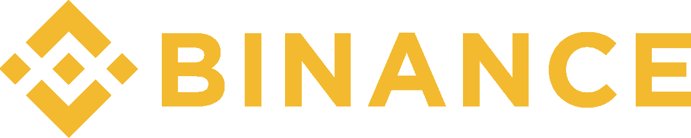
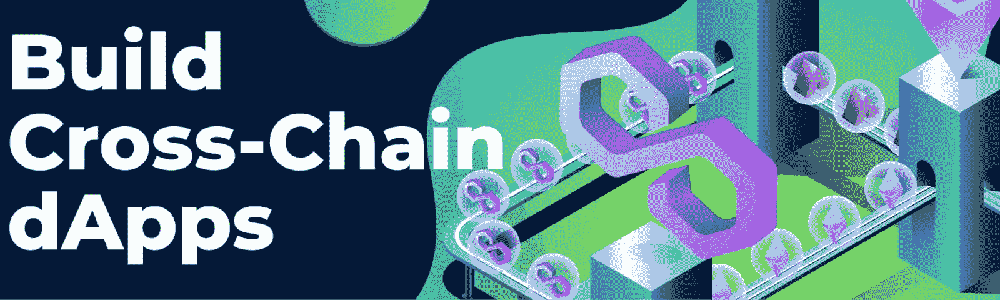
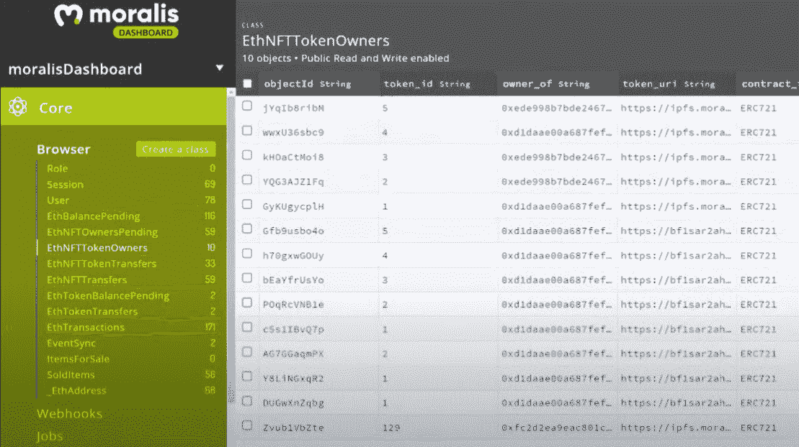

# 财务 dapp API——如何轻松构建财务项目

> 原文：<https://moralis.io/binance-dapp-api-how-to-easily-build-projects-on-binance/>

**以太坊是** [**Web3 开发**](https://moralis.io/how-to-build-decentralized-apps-dapps-quickly-and-easily/) **最大的区块链，其连锁店曾多次遭遇网络拥塞问题。这导致了缓慢的交易速度和高昂的汽油费，即使是在执行只值几美元的代币交换时。正因为如此，开发商现在开始关注经济上更可持续的替代网络，币安就是其中之一。币安生态系统的特点是交易成本较低，这提供了机会，并使其成为以太坊的一个有吸引力的替代品。但是，即使作为一个著名的** [**Web3**](https://moralis.io/the-ultimate-guide-to-web3-what-is-web3/) **开发网络，如果没有合适的工具，仍然很难构建复杂的 dapps。由于这个原因，对币安 dapp API 这样的工具的需求很高，因为这将使开发过程更容易实现。**

那么，到底什么是币安 dapp API，为什么它们会有帮助呢？这是我们在本文中试图回答的两个问题。我们将首先简要介绍什么是币安 dapp API，为我们打下坚实的基础。接下来，我们将看看如何通过 [Moralis](https://moralis.io/) 获得币安 dapp API。最后，我们将通过提供该工具如何实现更易访问的开发过程的示例，进一步了解 Moralis 的 dapp API 的可能性。因此，如果你继续学习，你将有希望学到关于什么是币安 dapp API 的基础知识，以及它们如何帮助你成为更好的开发者！

尽管如此，你有成为区块链开发者的雄心吗？如果是这样，那么你来对地方了！Moralis 提供了您快速、轻松开发显著 dapps 所需的一切。因此，免费注册 Moralis，立即开始您的 Web3 开发之旅！

## 什么是币安 Dapp API？

为了回答“什么是币安 dapp API？”我们首先需要探索 API 的复杂性。API 是“应用编程接口”的缩写，它们促进了两个软件之间的通信。每当你使用应用程序、发送消息或浏览社交媒体时，你都会接触到 API。因此，它们对于 Web2 和 Web3 的基础设施都是必不可少的。


所有 dapps 或 web 应用程序通常都必须连接到互联网，并将信息传输到服务器。接收数据的服务器需要解释一切，执行操作，并向用户设备发回响应。然后，设备需要分析信息，并以可读的方式呈现给用户。这整个过程通常由 API 来协调。

这表明 API 负责传输或翻译一堆指令，以便相互理解。通过这样做，API 可以通过在查询时一致地提供函数来确保在受控和安全的开发环境中进行可靠的编程。

因此，在币安和 dapp 的环境中，API 本质上确保了上述关于币安网络上的 dapp 开发的功能。因此，币安 dapp API 可以让你以一种更容易理解的方式开发令人兴奋的 dapp。这意味着您可以专注于开发过程的其他部分，例如创建引人注目的用户体验(UX)和用户界面(UI)。如果你对 UI 开发感兴趣，看看我们的指南[如何使用 Moralis 的](https://moralis.io/web3-ui-how-to-create-a-great-dapp-ui/) [web3uikit](https://moralis.io/web3ui-kit-the-ultimate-web3-user-interface-kit/) 创建一个伟大的 dapp UI ！

此外，还有其他类型的 API 与 NFTs 相关。如果这听起来很有趣，请查看 Moralis 的 [NFT API](https://moralis.io/nft-api/) ，它支持几个网络，包括币安。

### 为什么用 Moralis 来创造币安 Dapps？

虽然以太坊仍然是区块链最突出的发展，但网络有其拥挤的局限性。然而，这些问题表明，该行业正走在正确的轨道上，因为它是网络上采用和交易增加的直接结果。这一拥堵问题带来了高昂的交易成本，使得在以太坊区块链开发和运行 dapp 的成本更高。这是开发商选择币安等其他网络的最重要原因之一。



尽管如此，即使币安比以太坊小，它也绝不是一个小网络。作为最大的网络之一，它拥有很高的声誉、庞大的社区和不断扩展网络的大量开发人员。因此，较低的交易成本和网络的声誉使其成为 dapp 开发者的一个有吸引力的选择。

前面提到的两个因素，结合 Moralis，使币安 dapp 的发展明显更容易。作为区块链开发最突出的操作系统，Moralis 提供了广泛的后端基础设施以及一些游戏中最好的工具。例如，使用 Moralis，您可以避免 RPC 节点的[限制，并更有效地创建 dapps。](https://moralis.io/exploring-the-limitations-of-rpc-nodes-and-the-solution-to-them/)

像 [Moralis Speedy Nodes](https://moralis.io/speedy-nodes/) 、对 [IPFS](https://moralis.io/what-is-ipfs-interplanetary-file-system/) 的本地支持以及币安 dapp API 这样的工具提供了一种更容易获得的开发体验。然而，在深入研究币安 dapp API 之前，我们将介绍使用 Moralis 的另一个基本好处:跨链兼容性。

### 跨链兼容性–为未来打造币安 Dapps

尽管区块链行业仍处于起步阶段，但该领域正在迅速发展和扩大。这提供了一定程度的不确定性，很难预测哪些连锁店将在未来占据主导地位，并为未来几年提供最佳解决方案。因此，创建能够在链之间无缝传输的面向未来的 dapps 至关重要。如果您选择直接在 RPC 节点上开发，这个过程会变得非常困难和乏味。



相反，如果您选择使用 Moralis 开发 dapps，由于操作系统的跨链互操作性，这一方面将被涵盖。使用 Moralis，您可以选择构建适用于多个链的 dapp，并且您可以轻松地通过 dapp 添加链，只需简单地点击几下。您会发现以太坊、多边形、Avax、Fantom、Cronos 和币安(BSC)都是受支持的网络。

此外，Moralis 还在不断发展和增加新的网络/信誉良好的连锁店。如果你使用 Moralis，你就不会把你的项目限制在一个链上，在过渡到其他网络时也不需要从头开始。此外，假设一个 dapp 适用于几个链。在这种情况下，你将迎合更多的潜在用户，使你的项目对更多的人更有吸引力。

## 什么是 Moralis 的币安 Dapp API？

为了避免运行自己的节点的麻烦，开发人员转向所谓的区块链节点提供商。市场上的主要供应商之一是 Infura 但是，这个提供商主要迎合以太坊网络。取而代之的是 Moralis，它不仅仅提供节点和跨链兼容性。


除了是一个著名的节点提供商，Moralis 还提供了其他几个重要的工具，可以提供更有吸引力的开发人员体验。你会在这些工具中找到 Moralis 的 Web3 SDK 和 Web3 API。此外，这些工具也是跨链兼容的。因此，Web3 API 适用于多个网络，是一个非常可行的币安 dapp API。此外，无论你在做什么类型的币安项目，币安 dapp API 都非常好用。因此，如果你想[创建一个 NFT 市场](https://moralis.io/how-to-create-an-nft-marketplace/)、钱包、DeFi 平台、Web3 游戏等都没关系。，API 仍然为您提供了一个更易访问的开发过程。

许多 dapps 共享一组标准功能，例如，它们要求用户验证自己、发送交易、获取余额等等。因此，避免为所有 dapps 从头开始重新发明这些功能是有意义的。相反，你可以通过简单地复制和粘贴已经开发的代码片段，利用 Moralis 币安 dapp API 来实现这个特性。

## Moralis 的币安 Dapp API 是如何工作的？

现在，随着对 Moralis 的币安 dapp API 有了更好的理解，并探索了与 Moralis 合作的好处，我们可以更仔细地看看 API 是如何工作的。在接下来的部分中，我们将看看在开发币安 dapps 时，如何利用 API 来获取必要的信息。

下面的例子将迎合币安网络；然而，通过 Moralis 的跨链兼容性，每个函数和代码片段都与其他链兼容。这表明，如果你正在寻找，例如，[创建一个以太坊 dapp](https://moralis.io/how-to-create-an-ethereum-dapp-instantly/) 或[构建多边形 dapp](https://moralis.io/how-to-build-polygon-dapps-easily/)，你可以利用相同的方法做一些调整。

尽管如此，让我们仔细看看如何用一行代码将各种信息填充到数据库中！

### 填充您的 Dapp 数据库

许多 dapps 共享一些他们需要实现的公共功能。一个明显的例子是认证用户并允许他们登录的能力。如果你选择自己实现它，它会变得很麻烦，并且会占用大量的时间。但是，使用 Moralis，您可以通过下面的代码片段用 MetaMask 对[进行认证:](https://moralis.io/how-to-authenticate-with-metamask/)

```js
Moralis.authenticate().then(function (user) {
    console.log(user.get(''))
})
```

上面的代码允许你的 dapps 用户使用他们的 [Web3 钱包](https://moralis.io/what-is-a-web3-wallet-web3-wallets-explained/)登录。此外，还可以利用其他解决方案来验证用户身份。一个突出的例子是 [WalletConnect](https://moralis.io/what-is-walletconnect-the-ultimate-walletconnect-guide/) ，如果你正在开发移动应用，这是一个很好的例子。如果这听起来很有趣，看看我们关于[如何用 WalletConnect](https://moralis.io/how-to-connect-users-with-walletconnect/) 连接用户的文章。

一旦用户登录，这将自动填充您的 Moralis 数据库。这些信息将实时更新，为您提供最新的供应链数据。在下面的截图中，您将看到一些您有权访问的信息。但是我们如何在 dapps 中获取和使用这些数据呢？下面一节来看看吧！



### 财务 dapp API–读取数据库

通过访问关键的链上信息，我们可能需要查询这些数据。这是一个额外的过程，币安 dapp API 派上了用场，因为你可以使用代码的简短片段来访问这些信息。例如，以下是获取代币余额和交易历史的方法:

1.  **Mainnet 用户交易:**

```js
const transaction = await Moralis.Web3API.account.getTransaction();
```

1.  **本地令牌余额:**

```js
const balance = await Moralis.Web3API.account.getNativeBalance();
```

1.  **代币余额:**

```js
const balances = await Moralis.Web3API.account.getTokenBalances();
```

这只是几个例子，您还可以查询关于 [NFTs](https://moralis.io/non-fungible-tokens-explained-what-are-nfts/) 的信息。然而，如果你想了解更多，请查看 Moralis 的 NFT API。如果你对币安网络特别感兴趣，我们的“[币安 NFT API](https://moralis.io/binance-nft-api-what-is-it-and-how-does-it-work/) ”指南非常适合你！


### 财务 dapp API–发送资产

结合令牌和交易历史数据，允许用户和 dapps 转移资产也是有益的。例如，如果你想创建一个 [Web3 亚马逊市场](https://moralis.io/how-to-build-a-web3-amazon-marketplace/)，你会希望你的 dapp 能够进行交易。这也是 Moralis 的币安 dapp API 为您提供便捷解决方案的地方:

**发送本机令牌:**

```js
const options = {
  type: "native",
  amount: Moralis.Units.ETH("0.5"),
  receiver: "0x..",
};
let result = await Moralis.transfer(options);
```

**发送 BEP-20 令牌:**

```js
// sending 0.5 tokens with 18 decimals
const options = {
  type: "erc20",
  amount: Moralis.Units.Token("0.5", "18"),
  receiver: "0x..",
  contractAddress: "0x..",
};
let result = await Moralis.transfer(options);
```

**传输 NFTs:**

```js
// sending a token with token id = 1
const options = {
  type: "erc721",
  receiver: "0x..",
  contractAddress: "0xc02aaa39b223fe8d0a0e5c4f27ead9083c756cc2",
  tokenId: 1,
};
let transaction = await Moralis.transfer(options);
```

然而，这只是涵盖了 Moralis 的币安 NFT API 的一些基本部分。如果你想了解更多的信息，请查阅官方的 Moralis 规范文档。此外，我们建议查看一些关于如何创建 BEP-20 令牌的指南[或关于如何创建 BSC dappss 的指南](https://moralis.io/bep20-testnet-create-a-bep20-token-in-15-mins/)或关于如何创建 BSC dapp 的指南，以便直接了解币安 dapp API 的全部功能！

## 什么是币安 Dapp API？–总结

随着行业走向主流采用，像[以太坊](https://moralis.io/full-guide-what-is-ethereum/)这样的网络正在经历拥塞问题。出于这个原因，开发商需要转向更经济可行的解决方案，如币安网络。更重要的是，Web3 开发通常非常棘手，这就是为什么开发人员需要他们所能得到的所有帮助。此外，有助于在币安网络上更容易访问 dapp 开发过程的一个因素是 API。

币安 dapp API 促进了两个软件之间的通信，使得为币安网络开发应用程序更加容易和高效。获得优秀的币安 dapp API 的一个方法是通过 Moralis。Moralis 的 Web3 API 是跨链兼容的，币安是支持的网络之一。因此，您可以在开发币安 dapps 时利用这个 API。例如，API 允许您对用户进行身份验证，查询有关余额、交易历史等信息。，只需几行代码就能发送不同的令牌。因此，在与 Moralis 合作时，很容易快速开发币安 dapps。

诸如 Moralis 的[元宇宙 SDK](https://moralis.io/metaverse/) 之类的附加工具允许你创建先进的元宇宙项目。比如你可以[打造一个中世纪的元宇宙游戏](https://moralis.io/how-to-build-a-medieval-metaverse-game/)，[用 Unity 打造一个元宇宙 dapp】，甚至](https://moralis.io/how-to-create-a-metaverse-dapp-with-unity/)[打造你自己的元宇宙](https://moralis.io/how-to-create-your-own-metaverse/)！

此外，如果你计划成为一名区块链开发者，下一步就是[与 Moralis](https://admin.moralis.io/register) 签约。创建一个帐户是免费的，你将立即获得该平台的后端基础设施以及所有著名的开发工具！