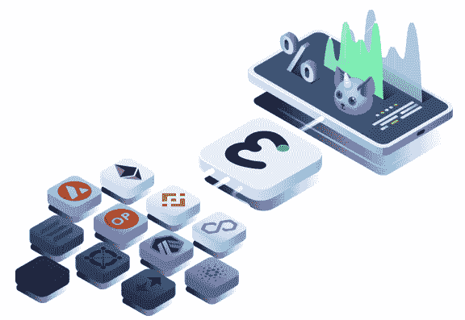
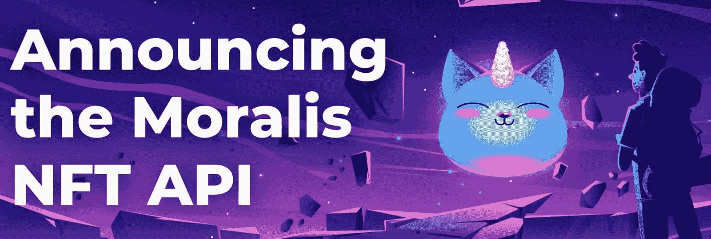
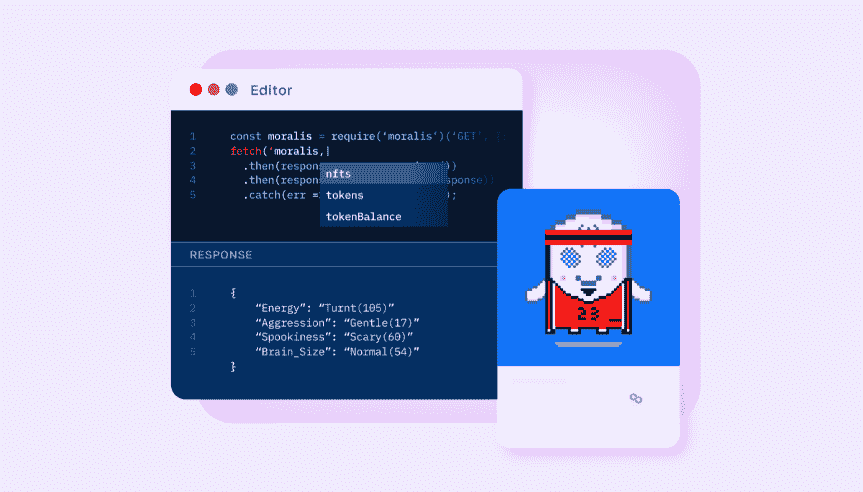

# 币安 NFT API——它是什么，是如何工作的？

> 原文：<https://moralis.io/binance-nft-api-what-is-it-and-how-does-it-work/>

要建立一个伟大的币安 NFT dapp，你需要一个币安 [NFT API](https://moralis.io/nft-api/) 。Moralis 的企业级 NFT API 为 BNB 链提供全面支持，是市场上最好的 BNB NFT API。事实上，Moralis 的币安 NFT API 将通过一个 API 调用为您获取 BNB 连锁 dapp 的所有 NFT 元数据，您可以获取以下数据:

*   **NFT 元数据**–在一次 API 调用中获取所有 NFT 元数据。该 API 是跨链兼容的，并具有搜索端点，这意味着您可以在 NFT 的元数据中进行搜索。有关更多信息，请参见我们的[元数据端点页面](https://docs.moralis.io/reference/getnftmetadata)。
*   **NFT 转会数据**–想要了解最新的 NFT 转会信息吗？或者，您可能想查看 NFT 的转账历史、钱包的转账或跟踪实时转账？不管是什么情况，Moralis 的币安 NFT API 都可以让你实现它。查看我们的[转移终点页面](https://docs.moralis.io/reference/getnfttransfers)了解更多信息。
*   **NFT 所有权数据**–无需定制代码或额外的基础设施。只需一次 API 调用就可以获取特定不可替换令牌或整个集合的所有者！想了解更多？参见我们的[所有权端点页面](https://docs.moralis.io/reference/getnftowners)。

使用 Moralis NFT API 意味着您可以跳过传统的繁琐步骤，例如:

❌ 10+调用以获取必要的 NFT 元数据。

❌解析单个智能合约。

通过不规则数据集进行❌排序。

❌向节点查询元数据。

相反，可以通过使用 Moralis 的 NFT API 来绕过上述问题:

**✅只需一个 API 调用就能在任何支持的网络上检索 NFT 数据！**

[**Use the Binance NFT API Now!**](https://docs.moralis.io/reference/nft-api)

### **Moralis 币安 NFT API 后端基础设施的优势**

以下是开发人员从利用 NFT API 进行 BNB 连锁开发中获得的一些好处:

*   开发时间节省高达 80%。
*   支持标准和非标准的 NFTs(例如 CryptoPunks)。
*   NFT API 自动解析元数据。
*   完全兼容多个游戏引擎。

在本文中，我们展示了如何利用 NFT API 的特性——因此您可以充分利用 Moralis 的基础设施。然而，如果你是 Web3 开发的新手，在开始编程之前，你可能想了解币安·NFT API 实际上是什么。此外，我们还首先介绍了 NFT API 的总体概念。因此，让我们探索 NFT API，然后看看币安 NFTs 如何为您提供关于这些令牌的更多信息。最后，我们将探索如何获取币安 NFT 元数据，所有权，并使用 Moralis 的 NFT API 传输数据。因此，如果您对 NFT 开发感兴趣，请跟随并了解您需要了解的关于币安 NFT API 的一切！

然而，在我们开始之前，[现在就向 Moralis 注册](https://admin.moralis.io/register)！创建一个帐户是完全免费的，你可以在几分钟内开始你的第一个 Web3 项目。

## 什么是 NFT 空气污染指数？

要掌握 NFT API 的概念，例如币安 NFT API，我们必须首先了解什么是 API。API 是“应用程序编程接口”的缩写，它基本上是一个允许两个软件相互交互的接口。此外，应用编程接口能够翻译或传输各种指令集，以实现相互理解。但是我们也可以进一步澄清什么是 API。我们可以用房子里的“管道”作为类比。我们可以将“管道”与 API 和整个软件开发工具包进行比较。这表明，API 通过在每个查询上交付具有可预测性的函数，确保了安全环境中的一致编码。



记住前面的描述，NFT API 具有前面提到的所有关于 NFT 的特性。因此，NFT API 使得 NFT 后端信息的获取变得更加容易，从而可以快速轻松地开发与 NFT 相关的项目。随着对 NFT 市场兴趣的增加，对 NFT 原料药的需求比以往任何时候都高。尽管如此，到目前为止，市场一直缺乏一些有价值的工具供 Web3 开发者使用——这就是 Moralis 介入的地方。

Moralis 提供了一个强大的跨链 NFT API，兼容众多网络，包括 BNB 链。因此，利用 Moralis 工具只需要五个步骤就可以创造出一个币安·NFT。此外，由于 API 支持多个链，你可以额外学习[如何创建以太坊 NFT](https://moralis.io/how-to-create-an-ethereum-nft-full-guide/?utm_source=blog&utm_medium=post&utm_campaign=Binance%2520NFT%2520API%2520%25E2%2580%2593%2520What%2520Is%2520It%2520and%2520How%2520Does%2520It%2520Work%253F) 。所以，如果你选择使用 Moralis，你就不会把自己局限在一个网络中。在我们的“币安 NFT API”之旅中，我们已经了解了什么是 API，让我们进入下一部分，探索什么是币安 NFT！

### 什么是币安 NFT？

为了理解什么是币安 NFT，我们必须首先更详细地研究 NFTs。因此，让我们从回答什么是 NFT 开始。“问题！

NFT 是“不可替代代币”的缩写，“不可替代”是一个传统的经济学术语，用于描述独特的资产。因此，我们使用这个术语来标记独特的资产。从本质上讲，NFT 是独一无二的象征，无法复制或伪造。此外，由于这些令牌完全是独一无二的，所以它们非常适合表示其他不可替代的资产，比如歌曲、交易卡或数字艺术。


另一方面，我们发现了可替代资产。货币是传统经济学中可替代资产的一个很好的例子。例如，一美元不是唯一的，可以直接换成另一美元。同样，在加密领域，我们有可替代的资产，如 ETH 或比特币。所有比特币都是平等的，这意味着它们可以互换。

总而言之，NFT 是存储在区块链上的唯一令牌，该令牌通常包含指向独特事物(如数字艺术)的元数据。这基本上意味着币安 NFTs 是存在于币安·区块链网络上的不可模仿的令牌。

您是否希望为币安网络创建 NFT？如果是这样，那么请随意查看我们关于如何打造 BNB·NFT 的文章。本指南将教你 BNB NFT 发展的来龙去脉，并让你在任何时候创建一个令牌！此外，你可能听说过 NFT 收集，如[隐朋克](https://opensea.io/collection/cryptopunks)。如果你想创造你自己的，看看我们关于[如何创造 10，000 个 NFT](https://moralis.io/how-to-mint-10000-nfts-full-walkthrough/?utm_source=blog&utm_medium=post&utm_campaign=Binance%2520NFT%2520API%2520%25E2%2580%2593%2520What%2520Is%2520It%2520and%2520How%2520Does%2520It%2520Work%253F)的文章！现在，让我们继续我们的“币安 NFT API”之旅，深入挖掘 Moralis 的 NFT API！

### 什么是 Moralis 家的 NFT API？

如果你想创建 dapps，高效总是有益的。这不仅能让您更快地推出我们的应用并获得竞争优势，还能让您节省资金。提高效率并不总是一件容易的事情，在区块链工业中有几个障碍。但是，可以从 Moralis 开始，因为这是 blockend 开发的首要解决方案。

Moralis 提供了一个完全托管的、无限可扩展的后端基础设施，使得 Web3 开发更加容易。此外，Moralis 还提供了一些市场上最令人难以置信的开发工具，比如 Moralis 的 Price API、Solana API，当然还有 Moralis 的 [NFT API](https://moralis.io/nft-api/?utm_source=blog&utm_medium=post&utm_campaign=Binance%2520NFT%2520API%2520%25E2%2580%2593%2520What%2520Is%2520It%2520and%2520How%2520Does%2520It%2520Work%253F) 。我们在上一节简要提到了 Moralis NFT API；然而，让我们仔细看看这个工具的复杂性！



Moralis 的 NFT API 是一个标准化的跨链 API，让你从大部分繁重的工作中解脱出来。如果你利用这个 API，你将有更多的时间关注真正重要的事情，比如通过一个优秀的 UI(用户界面)和 UX(用户体验)为你的用户创造价值。如果你对 UI 设计感兴趣，请查看我们的一篇关于如何使用 Moralis 的 [web3uikit](https://moralis.io/web3ui-kit-the-ultimate-web3-user-interface-kit/?utm_source=blog&utm_medium=post&utm_campaign=Binance%2520NFT%2520API%2520%25E2%2580%2593%2520What%2520Is%2520It%2520and%2520How%2520Does%2520It%2520Work%253F) 创建一个伟大的 dapp UI 的文章！此外，Moralis NFT API 是跨链兼容的，并支持以下网络:以太坊，多边形，雪崩，Fantom 和币安。因此，利用这个 API 使得这些网络的开发更加易于管理，并且您可以在创记录的时间内推出项目！

当我们通过这篇文章来发现什么是币安·NFT API 时，我们将在接下来的章节中，更深入地探究如何轻松地获取币安·NFT 元数据、所有权和传输数据！

## **获取币安 NFT 元数据**

现在，我们对币安 NFTs 和什么是币安 NFT API 和 API 有了更好的理解，我们可以继续，并仔细看看什么是 Moralis NFT API。所以，让我们先来看看如何获取币安·NFT 元数据。

通过利用 Moralis NFT API，您可以避免繁琐的手动解析智能合同的传统过程。相反，您可以让 API 来完成标准化数据的繁重工作，让您完成简单查询信息的任务。因此，有了这种跨链兼容性，不仅可以获取币安 NFT 元数据，还可以从其他链获取元数据。

API 甚至有搜索端点，让您有机会在 NFTs 的元数据中进行搜索。此外，您可以很容易地找到特定的描述或属性，结果包括完全解析的元数据，供您在 dapps 中使用。这就是 NFT 元数据开发应该做的，没有比这更容易实现的了。以下是获取 NFT 元数据时的样子:

```js
const nftMetadata = await Moralis.EvmApi.nft.getNFTMetadata({
address: "0x.....",
chain: EvmChain.BSC,
tokenId: "1",
});
```



## **获取币安所有权数据**

如果你正在寻找创建 NFT 项目，一个重要的信息是准确的 NFT 所有权数据。有了 Moralis NFT 应用编程接口或币安 NFT 应用编程接口，您可以不用再担心设置额外的基础设施来跟踪币安 NFT 或在交易代币时需要客户代码。API 提供币安 NFT 所有权数据的最新信息。更重要的是，用几行简单的代码就可以检索到完整的 NFT 收藏的所有所有者！

此外，API 允许您通过几次简单的点击来“令牌门”您的内容，使您能够获得对您所创建的内容的控制。借助 Moralis 的 SDK，您可以像下面这样轻松地查询这种类型的数据:

```js
await Moralis.EvmApi.nft.getNFTOwners({
address: "0x..",
chain: EvmChain.BSC,
});
```

## **获得币安·NFT 的转会数据**

对于 blockend 开发人员来说，另一个重要的信息是传输数据。有了这些数据，您可以跟踪令牌如何在链上移动，从而构建功能强大的应用程序。该 API 将使您能够通过从特定块号搜索所有 NFT 转移来保持最新。甚至可以根据钱包地址、NFT 合同地址或特定令牌来搜索 NFT 转账。这种功能是跨链的，一旦确认，就可以在 API 中找到转移。

有了这种跨链兼容性，就有可能轻松地查询币安 NFT 传输数据，并且您将能够为币安生态系统创建复杂的 dapps。因此，你可以节省宝贵的开发时间与 Moralis NFT API，因为你可以避免基础设施设置时间，跨链开发的关注，和托管的担忧。例如，您可以使用以下代码来获取传输数据:

```js
await Moralis.EvmApi.nft.getNFTTransfers({
address: "0x...",
chain: EvmChain.BSC,
tokenId: "1",
});
```


现在，这仅仅触及了 Moralis NFT API 的皮毛，还有很多东西需要探索。一个很好的起点是官方的 NFT API [GitHub 文档](https://github.com/nft-api/nft-api/#moralis-sdk-8)，在那里你可以学到你需要知道的关于 API 的一切！

如果这激发了你对 Web3 或 blockend 开发的兴趣，你应该考虑报名参加 [Moralis Academy](https://academy.moralis.io/) 。学院提供市场上最好的[区块链课程](https://academy.moralis.io/all-courses)，可以显著提高你在该领域的熟练程度。


例如，如果你是 Web3 的新手，可以去看看初学者的[加密](https://academy.moralis.io/courses/crypto-for-beginners)课程。更重要的是，你不需要成为一个初学者就可以从 Moralis Academy 中受益；有针对更有经验的开发人员的课程！

## 什么是币安 NFT API？–总结

NFT 正在蓬勃发展，这使得它比以往任何时候都更适合进入 NFT 的发展。随着对该领域的日益关注，人们正在寻求开发各种与 NFT 相关的项目。然而，如果没有合适的工具，Web3 开发可能是一项乏味的任务。因此，当创建 NFT [dapps](https://moralis.io/decentralized-applications-explained-what-are-dapps/?utm_source=blog&utm_medium=post&utm_campaign=Binance%2520NFT%2520API%2520%25E2%2580%2593%2520What%2520Is%2520It%2520and%2520How%2520Does%2520It%2520Work%253F) 时，利用 API 是非常有益的。

市场上最好的 API 之一是 Moralis 的 NFT API。这个工具可以极大地帮助减少开发时间。Moralis NFT API 是跨链兼容的，使得不同网络的 NFT 开发更加容易。这些包括以太坊、多边形、方托姆、阿尔比特鲁姆和币安。


在本文中，我们深入探讨了如何使用 Moralis 的 NFT API 来支持币安网络上的 NFT 开发。在前面的章节中，我们探讨了如何轻松获得币安 NFT 元数据、所有权和传输数据。这表明 Moralis 提供了一个优秀的币安 NFT API。有了币安 NFT API，为币安网络开发 NFT 项目变得更加容易。此外，你可以创建各种有趣的 dapps。除了更多传统的 NFT，您还可以在 Moralis 了解更多关于[分数 NFT](https://moralis.io/what-are-fractional-nfts-the-ultimate-2022-f-nft-guide/?utm_source=blog&utm_medium=post&utm_campaign=Binance%2520NFT%2520API%2520%25E2%2580%2593%2520What%2520Is%2520It%2520and%2520How%2520Does%2520It%2520Work%253F)和[动态 NFT](https://moralis.io/what-are-dynamic-nfts-the-ultimate-2022-guide/?utm_source=blog&utm_medium=post&utm_campaign=Binance%2520NFT%2520API%2520%25E2%2580%2593%2520What%2520Is%2520It%2520and%2520How%2520Does%2520It%2520Work%253F)的信息。

如果你对令牌开发感兴趣，你可以了解更多关于 [BEP20](https://moralis.io/what-is-bep20-full-binance-smart-chain-token-guide/?utm_source=blog&utm_medium=post&utm_campaign=Binance%2520NFT%2520API%2520%25E2%2580%2593%2520What%2520Is%2520It%2520and%2520How%2520Does%2520It%2520Work%253F) 令牌或者[如何创建 BNB 链令牌](https://moralis.io/how-to-create-a-bnb-chain-token-in-5-minutes/?utm_source=blog&utm_medium=post&utm_campaign=Binance%2520NFT%2520API%2520%25E2%2580%2593%2520What%2520Is%2520It%2520and%2520How%2520Does%2520It%2520Work%253F)。然而，这只是 Moralis 的一小部分。作为一名更有经验的开发人员，您可以使用该系统来创建更复杂的 dapps。例如，学习[如何建立一个中世纪的元宇宙游戏](https://moralis.io/how-to-build-a-medieval-metaverse-game/?utm_source=blog&utm_medium=post&utm_campaign=Binance%2520NFT%2520API%2520%25E2%2580%2593%2520What%2520Is%2520It%2520and%2520How%2520Does%2520It%2520Work%253F)或[创建你自己的元宇宙](https://moralis.io/how-to-create-your-own-metaverse/?utm_source=blog&utm_medium=post&utm_campaign=Binance%2520NFT%2520API%2520%25E2%2580%2593%2520What%2520Is%2520It%2520and%2520How%2520Does%2520It%2520Work%253F)与 Moralis 的[元宇宙 SDK](https://moralis.io/metaverse/?utm_source=blog&utm_medium=post&utm_campaign=Binance%2520NFT%2520API%2520%25E2%2580%2593%2520What%2520Is%2520It%2520and%2520How%2520Does%2520It%2520Work%253F) ！

那么，想进入 Web3 开发领域吗？然后[注册 Moralis](https://admin.moralis.io/register?utm_source=blog&utm_medium=post&utm_campaign=Binance%2520NFT%2520API%2520%25E2%2580%2593%2520What%2520Is%2520It%2520and%2520How%2520Does%2520It%2520Work%253F) 并立即开始您的发展之旅！