# 基于区块链的认证——如何整合？

> 原文：<https://moralis.io/blockchain-based-authentication-how-to-integrate/>

集成基于区块链的认证是任何想从 Web2 过渡到 Web3 的开发者必须采取的第一步。虽然这听起来像是一项复杂的任务，但使用适当的工具实际上是相对简单的。这就是 Moralis 的 Web3 Auth API 发挥作用的地方。想知道这个 API 适合你吗？

*   ✅:你在开发一个新的区块链应用吗？
*   ✅您想使用基于区块链的身份验证连接您现有的 Web2 用户数据库吗？
*   ✅想为您的业务或企业的认证流使用 Auth0 之类的认证聚合器吗？

[**Integrate Authentication Now**](https://docs.moralis.io/docs/sign-in-with-metamask) 

如果你正在读这篇文章，你的答案很可能是肯定的！现在，在我们进一步探讨如何集成基于区块链的身份验证之前，让我们先回顾一些基础知识。

除了介绍基础知识之外，我们还将了解领先的区块链身份认证替代方案。其中一些对于没有 crypto 经验的新用户来说特别有用。此外，我们将利用今天的文章向您展示如何集成 Moralis 为您带来的基于区块链的最佳认证系统。有了 Moralis 的 Web3 认证 API，你可以很容易地实现所有种类的 [Web3 认证](https://moralis.io/authentication/)方法。当然，如果你想加入我们，你需要[创建你的免费 Moralis 账户](https://admin.moralis.io/register)。但是，如上所述，让我们首先确保您都知道基于区块链和区块链的身份验证的基础知识。

## 什么是区块链？

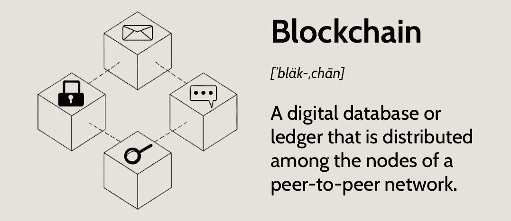

看上面的图片，你可以看到区块链最贴切的定义之一。从本质上讲，每个区块链都是一个分散的数字分类账或数据库。然而，为了理解它为什么被称为“区块链”，我们必须挖得更深一点！

当事务被区块链节点通过利害关系证明(PoS)或工作证明(PoW)一致机制验证时，它们被添加到称为块的一系列事务中。这些事务块然后被线性链接，使得每个块包含链接到其前一个块的加密数据。因此，区块链这个名字。唯一的例外是所谓的“创世纪板块”。毕竟，创世纪区块是任何区块链的第一个区块，所以它没有任何前辈。

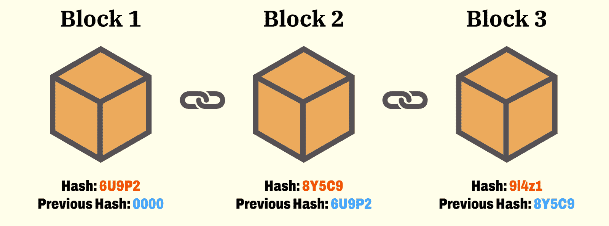

请务必注意，完整节点包含区块链的整个当前副本。此外，当涉及到区块链网络时，没有一个集中的权威。然而，去中心化的程度显然取决于节点的数量和它们的分布。此外，值得指出的是，比特币是第一个区块链，至今仍是最受欢迎的链条。然而，这是第二个区块链以太坊的诞生，当事情发展到一个全新的水平。以太坊引入了智能合约，进而引入了可编程区块链的概念。这也是开发人员开始创建 dapps(分散式应用程序)所需的基础。如今，我们有许多声誉良好的区块链，其中大多数依赖于 EVM(以太坊虚拟机)。此外，它们被称为 EVM 相容链。

*注* *:有了 Moralis 基于区块链的认证系统，你可以锁定以太坊、Solana 和所有领先的 EVM 兼容连锁店。*

### 区块链技术安全吗？

区块链技术是最安全的技术之一。当然，这并不意味着发现一些漏洞是不可能的。然而，如果设计得当，它是非常安全的，同时也是透明的。当然，需要指出的是，并非所有的区块链都是平等的，它们的安全级别可能会有所不同。此外，到目前为止提到的链是所谓的公共区块链。另一方面，也有私人区块链，一般提供更高的安全水平。因此，许多公司专注于使用私有区块链。

任何特定区块链的安全取决于其设计和共识机制。如果一个设计没有瑕疵，节点的分布适当分散，那么安全级别应该是相当高的。例如，比特币继续表现出极高的安全性。另一方面，某些可编程链已经遭到黑客攻击，有些还不止一次。

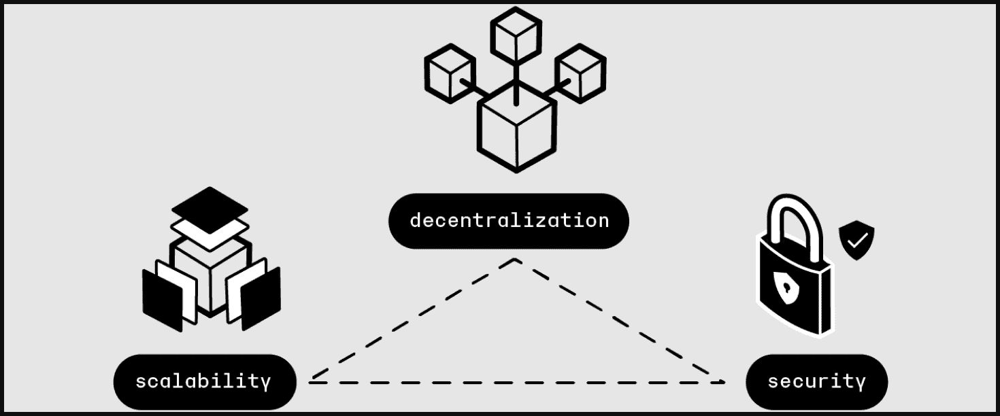

此外，我们不能在谈论区块链安全时不提到“区块链三难困境”。目前，仍然不可能同时实现最高级别的去中心化、可伸缩性和安全性。因此，项目通常决定稍微牺牲一个方面来促进其他两个方面。然而，创新的想法，如分片，侧链和国家渠道正在探索和测试，以解决三难问题。

关于区块链和它的安全，我们可以告诉你更多。然而，以上信息已经足够了，特别是因为本文的目的不一定是向您介绍区块链，而是向您展示如何集成基于区块链的身份验证。但是，如果你想了解更多关于区块链和比特币的知识，可以报名参加 Moralis 学院的“[区块链&比特币基础](https://academy.moralis.io/courses/blockchain-bitcoin-101)课程！

## 什么是区块链认证？

区块链认证，也称为 Web3 认证，是用户与任何特定区块链网络连接的过程。本质上，一个合适的基于区块链的认证系统使开发者能够允许用户将他们的 Web3 钱包连接到 dapps。区块链认证有时可能包括其他登录替代方案，如电子邮件，它创建一个新的钱包地址，并使用该地址连接到手边的 dapp。如果用户对 Web3 知之甚少，并且没有自己的 Web3 钱包，这种方法特别有用。然而，使用 MetaMask(领先的 Web3 钱包)仍然是最受欢迎的 Web3 认证方法，尤其是对于 web dapps。另一方面，WalletConnect 往往服务于最好的移动 dapp 用户。

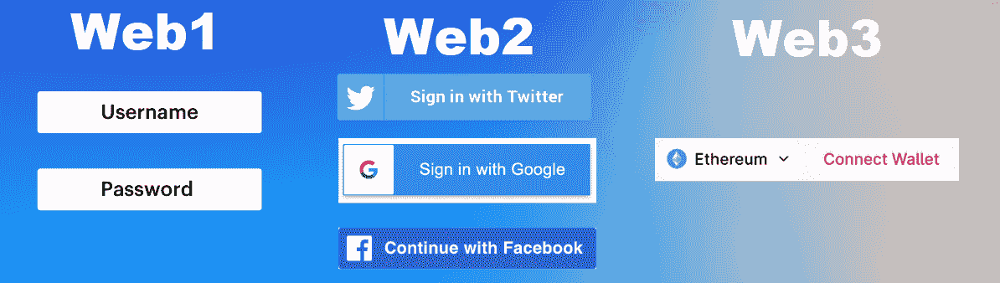

看上面的图片，你可以看到一个典型的 Web3 认证按钮。同一个按钮甚至可以让用户在不同的链中进行选择。在接下来的小节中，我们将向您展示如何集成这种基于区块链的身份验证。此外，我们将使用 Moralis 的 Auth API 毫不费力地做到这一点，它使您能够用一行代码覆盖这样一个“连接钱包”按钮的功能。此外，您可以使用任何您喜欢的遗留开发工具。下面我们将关注使用 NextJS，但是您也可以使用其他框架、平台和编程语言。尽管如此，如果你有兴趣了解 Moralis Auth API 是如何工作的，请务必查看 [Moralis 文档](https://docs.moralis.io/reference/auth-api-overview)！

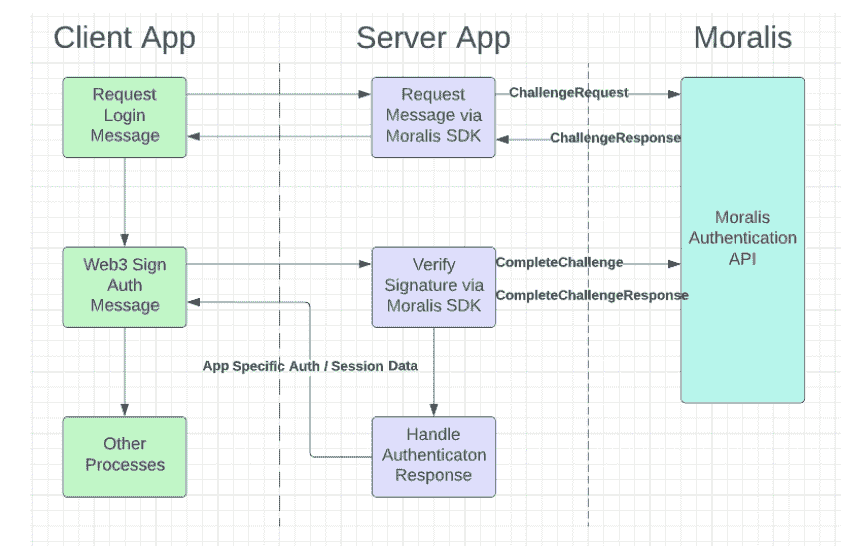

### 区块链认证替代方案

当谈到区块链身份验证替代方案时，我们主要指的是元掩码替代方案。上面，我们已经提到了 WalletConnect。然而，当您决定将基于区块链的身份验证与 Moralis 集成时，您还有其他一些简单的选择:

*   魔法。环
*   WalletConnect
*   Web3Auth

基于区块链的 Moralis 认证系统还支持 RainbowKit 和比特币基地钱包认证方法。上面列出的每个元掩码替代方案都有其特定的用例、优点和缺点。因此，让我们快速概述一下这三种 Web3 身份验证解决方案。

#### 魔法。环

魔法。链接，或魔术，是由魔术实验室带给你的。这是提供无密码 Web3 onboarding 的最著名的方式之一。由于实用的 Magic SDK，您可以实现这种高级身份验证方法，创建钱包和管理密钥。此外，Magic 是使您能够集成基于区块链的身份验证的解决方案之一，只需要电子邮件地址、社交帐户或电话号码。因此，它特别适合 Web3 的新用户，因为它在幕后创建了 Web3 钱包。

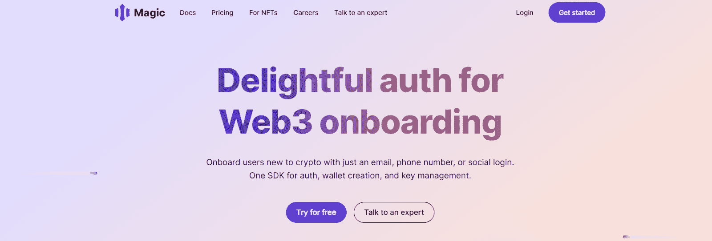

#### WalletConnect

与常见的误解不同，WalletConnect 不是一个应用程序或加密钱包。事实上，它是一个开源协议，可用于在各种加密钱包和 dapps 之间建立连接。此外，WalletConnet 协议的属性确保应用程序、钱包或设备之间的连接是安全的。毕竟，以这种方式建立的连接是通过两个对等体之间的共享密钥对称加密的。此外，值得指出的是，WalletConnect 与 100 多家领先的钱包合作(更多详情请访问 WalletConnect 的官方网站)。

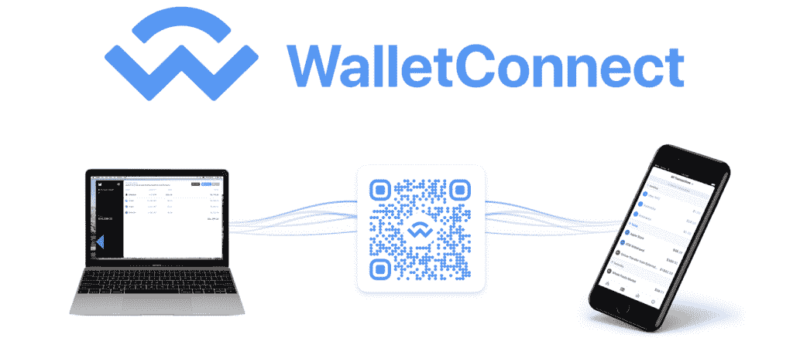

当使用 WalletConnect 进行 Web3 身份验证时，您有两种选择来建立 wallets 和 dapps 之间的连接。你可以通过深层链接或扫描二维码来实现。在这两种情况下，一个对等体(或 dapp)发出代码或链接，另一个对等体需要扫描或批准它。通过将 WalletConnect 集成到 dapps 中，您可以为您的用户提供安全可靠的连接。

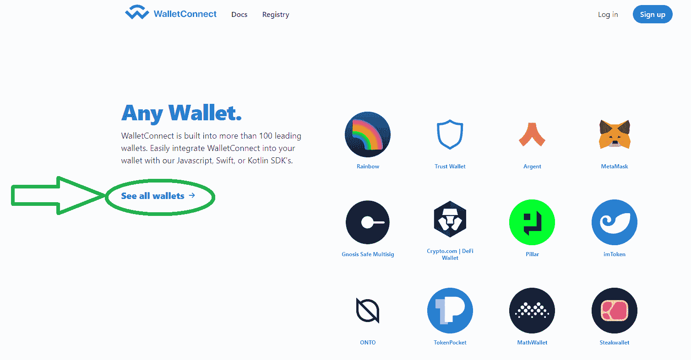

#### Web3Auth

Web3Auth 类似于魔术。毕竟，它也为 Web2 用户提供了一个顺利进入 Web3 领域的好方法。Web3Auth 还提供了一些超越 Web3 onboarding 的功能。例如，Web3Auth 的 fiat-to-crypto API 允许您的客户在您的 dapp 上购买问题链并与之直接交互。这种区块链身份验证替代方案还消除了种子短语，从而减少了支持票。此外，We3Auth 利用了一种非托管的多因素身份验证方法，这是一种保护私钥的安全和分散的方法。尽管如此，Web3Auht 也兼容 OAuth 2.0。因此，它允许您通过单个 API 在后端验证用户。

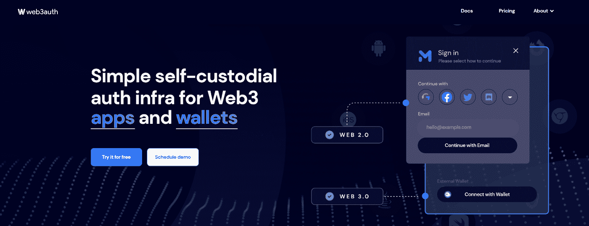

## 如何集成基于区块链的认证解决方案

Moralis 提供了许多不同的方法来集成基于区块链的身份验证。由于 NextJS 非常受欢迎，所以在本文中，我们将重点放在使用该框架和使用元掩码进行身份验证上。

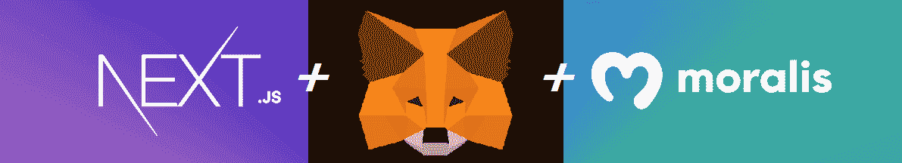

然而，在我们将您交给我们内部专家的视频教程之前，让我们来看看您将创建什么:

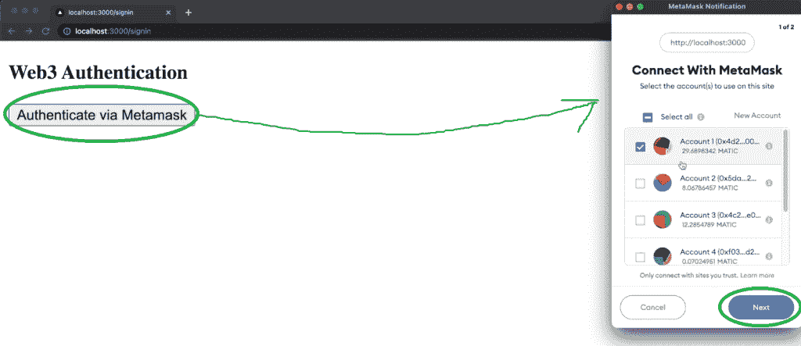

看上面的截图，你可以看到这一切都是从简单的点击“通过 MetaMask 认证”按钮开始的。接下来，用户需要选择他们想要使用的帐户。他们通过点击“下一步”按钮继续前进。第二步，用户必须点击“连接”:

然后，要使用 MetaMask 完成 Web3 认证，用户需要签署我们的 dapp 签名请求:

认证成功的用户登陆“用户”页面:

接下来的视频将带您完成将基于区块链的认证与 NextJS 和 Moralis Auth API 集成所需的步骤。简而言之，要集成基于区块链的身份验证，您必须首先完成一些先决条件，包括创建一个 Moralis 帐户和设置 VSC。然后，对于区块链身份验证的实际 dapp 创建和实施，完成以下步骤:

1.  使用“ *npx create-next-app* 命令创建一个新的 NextJS dapp(参见我们的 [NextJS dapp 教程](https://docs.moralis.io/docs/nextjs-dapp))。
2.  安装所需的依赖项(Moralis、“next-auth”和“axios”)。还要安装“ *wagmi* 和“*醚*包。
3.  设置好前端和后端之间的通信。这是您将重点调整“index.js”文件的地方。至于前端，您将专注于调整“_app.js”文件并创建“登录”和“用户”页面。

以上是需要的一些初始步骤。要获得完整的代码教程，请访问我们的[文档页面](https://docs.moralis.io/docs/sign-in-with-metamask)。现在，让我们看看集成 Web3 身份验证的另一个重要步骤，获取您的 Web3 API 密钥。

### 获取您的 Moralis Web3 API 密钥，用于基于区块链的身份验证

要将基于区块链的身份验证集成到您的 NextJS 应用程序中，您必须拥有您的 Moralis Web3 API 密钥。此外，您将把它粘贴到" . env.local "文件中。因此，如果您还没有这样做，请使用简介中的“创建您的免费 Moralis 账户”链接，完成入职培训。随着你的 Moralis 帐户的建立和运行，你将能够访问你的管理区。从那里，您将通过两个简单的步骤获得您的 Moralis Web3 API 密钥:

下面的视频教程将向您展示如何将 Moralis 提供的基于区块链的认证与 NextJS 集成:

[https://www.youtube.com/embed/hhkWQPorBKQ?feature=oembed](https://www.youtube.com/embed/hhkWQPorBKQ?feature=oembed)

*注意:你也可以在* [*GitHub*](https://github.com/MoralisWeb3/demo-apps/tree/main/nextjs_moralis_auth) *上访问上述 Web3 认证示例 dapp 的最终代码。*

## 基于区块链的认证——如何整合？–总结

今天的文章向您介绍了什么是区块链，它有多安全，以及什么是基于区块链的认证系统。因此，你现在知道区块链是一个数字分布式账本，如果设计得当，是高度安全的。然而，你也发现了区块链三难困境。因此，您现在知道，同时拥有最高级别的安全性、可伸缩性和去中心化仍然是不可能的。就 Web3 身份验证而言，您现在知道它是通向加密领域的网关。此外，您现在已经意识到 Moralis Auth API 是多么有用。尽管如此，您还了解了一些不错的 Web3 身份验证替代方案。最后，您有机会使用 Moralis Auth API 将 Web3 身份验证实现到 NextJS 应用程序中。

如果您对掌握 Moralis 认证 API 感兴趣，我们鼓励您完成 Moralis 文档中的其他 Web3 认证操作指南。此外，您可以学习本文档提供的其他教程。此外，您还可以通过浏览 [Moralis YouTube 频道](https://www.youtube.com/c/MoralisWeb3)和 [Moralis 博客](https://moralis.io/blog/)来扩展您的区块链发展知识。那里的一些最新主题向您展示了如何[快速构建 BNB 链 dapp](https://moralis.io/bnb-chain-boilerplate-how-to-build-bnb-chain-dapps/)，如何[将 dapp 连接到以太坊网络](https://moralis.io/set-up-and-connect-a-dapp-to-the-ethereum-network/)，如何[将 dapp 连接到多边形](https://moralis.io/tutorial-how-to-connect-a-dapp-to-polygon-network/)，[克隆 Zapper](https://moralis.io/how-to-clone-zapper-in-less-than-1-hour/) ，如何[使用 Azure 函数](https://moralis.io/how-to-connect-playfab-with-web3-using-azure-functions/)连接到 PlayFab 和 Web3，等等。

另一方面，你可能想尽快成为全职加密员。如果是这样，你应该采取更专业的方法来进行加密教育。毕竟，成为区块链认证大大增加了你在这个破坏性行业中获得梦想工作的机会。因此，考虑报名参加[Moralis 学院](https://academy.moralis.io/)。

