# 区块链不和谐机器人——为链上事件构建不和谐机器人

> 原文：<https://moralis.io/blockchain-discord-bot-build-a-discord-bot-for-on-chain-events/>

说到加密社区，Discord 是一个非常受欢迎的平台。因此，我们想向您展示如何为链上事件构建一个 Discord bot，并且感谢 Moralis[**Streams API**](https://moralis.io/streams/)**，您可以毫不费力地构建一个加密监控 Discord bot。所需要的只是一个** [**免费的 Moralis 账号**](https://admin.moralis.io/register) **，一个 Discord 服务器，以及一些简单的 JavaScript 编程。此外，构建一个不和谐机器人比你想象的要简单得多，在本文中，我们将通过五个简单的步骤来完成这个任务:**

1.  设置一个简单的 NodeJS Express 后端
2.  添加新的 Moralis 流
3.  验证 Webhook 发送方
4.  设置一个不和谐机器人
5.  实现一个示例区块链不和谐机器人

此外，设置东西不应该需要超过二十分钟。此外，由于 Moralis 的跨链互操作性，我们的 Discord bot 最大的优点是，您可以收听以太坊和其他 EVM 兼容链上的任何链上事件。但是，为了本教程，我们将重点放在多边形测试网(孟买)。

接下来，我们将首先确保你们都知道什么是不和谐机器人。然后，我们将进入今天的教程。然而，在我们向您展示如何构建 Discord bot 之前，我们先来看一个演示，它将帮助您更好地理解什么是加密监视器 Discord bot。此外，通过观看我们的演示，您还可以决定是否要专注于为您自己的目的构建一个不和谐机器人。也就是说，如果你已经知道什么是不和谐机器人，请随意进入我们的区块链不和谐机器人教程。

[**Join Moralis’ Discord Channel and Moralis Magazine**](https://moralis.io/joindiscord/)

## 什么是不和谐机器人？

如果你在网上购物，你可能会遇到聊天机器人。这些机器人是帮助某些过程自动化的程序。此外，当这些人工智能驱动的工具用于在 Discord 服务器上自动执行任务时，它们被称为 Discord 机器人。您可能知道，Discord 服务器提供了许多功能，其中许多可以自动化。

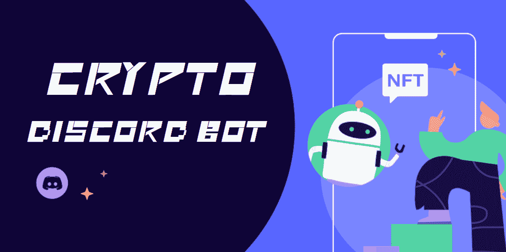

那么，区块链不和谐机器人到底是什么？它是一个 Discord bot，当特定的链上事件(bot 侦听的事件)发生时，它会在特定的 Discord 服务器上触发特定的操作。因此，对于各种各样的加密不和谐社区来说，加密监控不和谐机器人是一个非常实用的工具。毕竟，它可以为私人和公共不和谐渠道增加许多价值。

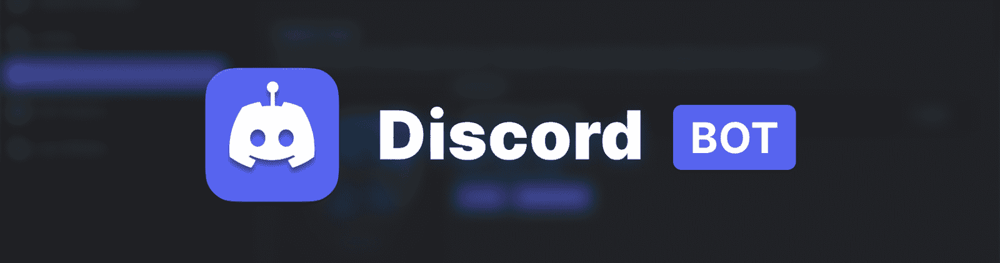

另外值得一提的是，Discord 的开发者门户上提供了 Discord bot 功能。因此，你不必做任何认真的编码来创建不和谐的机器人。相反，您可以简单地在给定的选项中进行选择，并使用 Discord 的预建解决方案。你将会看到这一点，因为我们将在下一节向你展示如何构建一个不和谐机器人。

## 如何为区块链事件搭建一个不和谐机器人

多亏了 Moralis 的 Streams API，为 crypto 构建一个 Discord bot 不费吹灰之力。这个强大的工具使您能够通过 webhooks 将区块链数据传输到您的后端(在这里是 Discord 的后端)。要访问这个强大的工具，你只需要一个免费的 Moralis 帐户。当然，你也需要决定什么样的链上事件让你感兴趣。这将决定您是否可以监听现有的智能合约，或者您是否需要首先创建和部署您的智能合约。然而，出于本教程的考虑，我们将使用现有的智能合约。事实上，为了避免任何混淆，从关注我们的示例 Web3 契约开始。

此外，要在我们的带领下构建您自己的 crypto monitor Discord bot，您需要以下工具:

*   **一个 Moralis 账户，**你可以[免费创建](https://admin.moralis.io/register)！
*   **某种类型的代码编辑器或 IDE** 。*我们将使用 Visual Studio 代码(VSC)。*
*   **一个 Discord 服务器**和对 Discord 开发者门户的访问。
*   一位区块链探险家。 *我们的示例 Web3 合同位于孟买* *网络上，因此我们将使用 PolygonScan。*
*   **(可选)邮差站台。这是一个帮助你对不同的帖子进行 API 调用，获取端点等的工具。**

*

此外，我们将带您完成以下步骤:

1.  **设置一个简单的 NodeJS Express 后端**
2.  **添加新的 Moralis 流**
3.  **验证 Webhook 发送方**
    1.  你需要确保只有 Moralis 家才能发布网页挂钩帖子。
4.  **设置不和谐机器人**
5.  **实现一个示例区块链不和谐机器人**
    1.  *用 Discord.js 发送消息*

现在，如上所述，在我们向您展示如何构建一个不和谐机器人之前，让我们来看一个演示。

### 我们的加密监视器不和谐机器人–演示

这是我们的 Discord 服务器示例，我们是为了本教程而创建的:

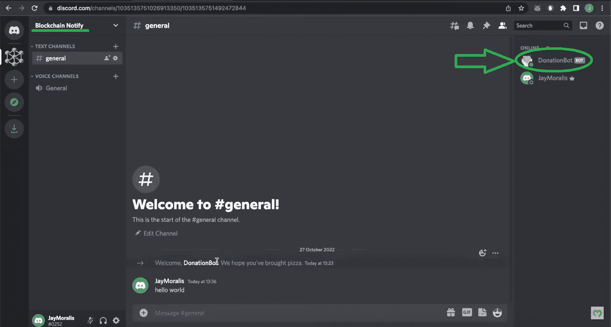

看上面的截图，你可以在右边栏看到我们的加密监视器 Discord bot(“donation bot”)。接下来，我们使用 PolygonScan 与我们的示例" *donationExample* "智能合同进行交互。显然，这是我们的例子区块链不和谐机器人听取的智能合同。

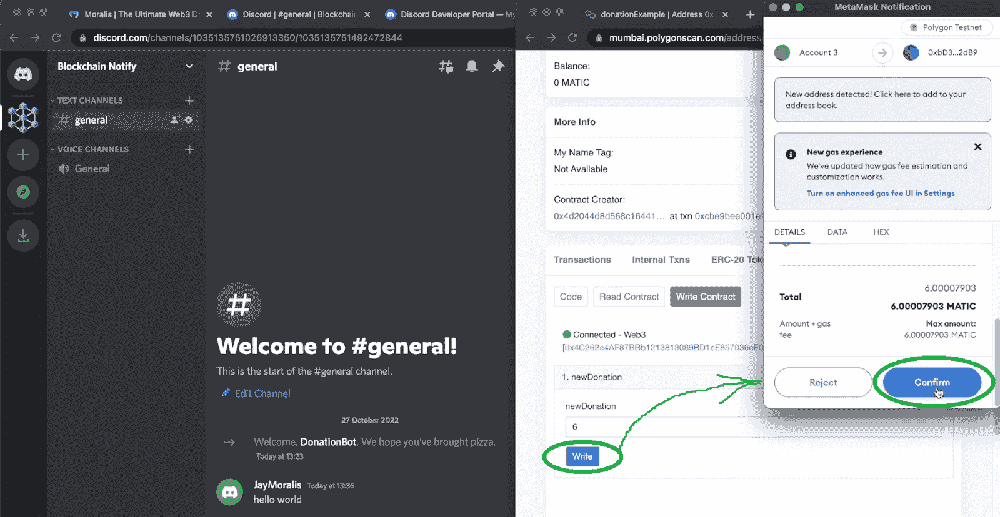

上图显示，在我们的示例 Web3 契约中，通过点击 PolygonScan 页面上的“Write”按钮，我们实际上使用 MetaMask 执行了一个链上事务。另外，正如你在上面看到的，我们捐赠了六个 MATIC tokens。最后，一旦我们的交易通过，我们的 Discord bot 就会发布一条消息，通知我们的 Discord 成员有关此次捐赠的信息:

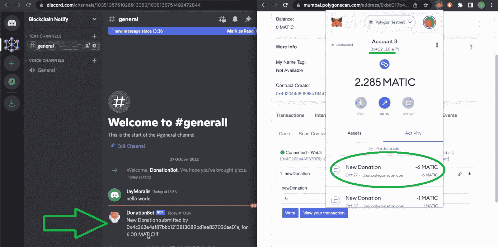

如您所见，该消息包括捐赠者的地址和捐赠金额。但是，关键是链上事件(一个捐赠交易)触发了我们的 Discord bot。

如果您觉得这个特性很有用，请在接下来的部分中遵循我们的指导，我们将介绍如何构建一个 Discord bot 来监听链上事件(就像本演示中展示的那样)。

### 设置一个简单的 NodeJS Express 后端

如果您想学习如何以最简单的方式为链上事件构建一个 Discord bot，可以从一个简单的 NodeJS Express dapp 开始。你可以在本教程的 GitHub repo 中找到[启动代码](https://github.com/MoralisWeb3/youtube-tutorials/blob/main/Discord-Blockchain-Bot/starter.js)。此外，确保您安装了“ngrok ”,以创建到您的 Express dapp 的“ngrok”隧道。为此，请打开一个新的终端并输入以下命令:

```js
ngrok http 3000
```

*注意* *:如果您使用不同的端口，请确保相应地替换“3000”。*

运行上述命令的结果是，您将获得一个运行 Express dapp 的地址:

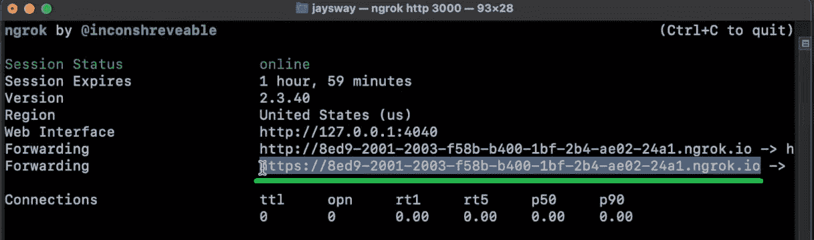

接下来，您希望使用以下命令安装所有依赖项:

```js
npm i express moralis discord.js dotenv
```

此外，我们建议您也安装" *nodemon* "以便您能够查看更改，而无需停止并重启您的服务器。因此，也使用下面的命令:

```js
npm i nodemon
```

依赖项就绪后，打开“package.json”文件，并为“ *nodemon* ”添加“启动”脚本:

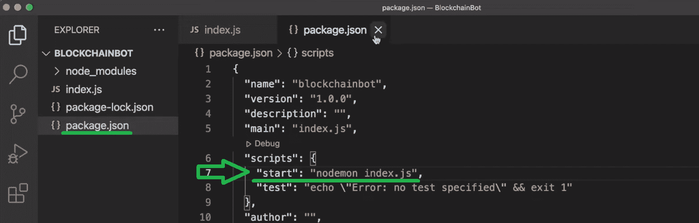

最后，您可以使用下面的命令运行 dapp 了:

```js
npm run start
```

### 添加新的 Moralis 流

随着 dapp 的运行，是时候创建一个新的 Moralis 流了。要做到这一点，你需要你的 Moralis 帐户。因此，如果您还没有创建您的帐户，现在就创建吧。使用您的凭证，您将访问您的管理区。从那里，您将能够转到“流”页面，在那里您需要点击“新流”按钮:

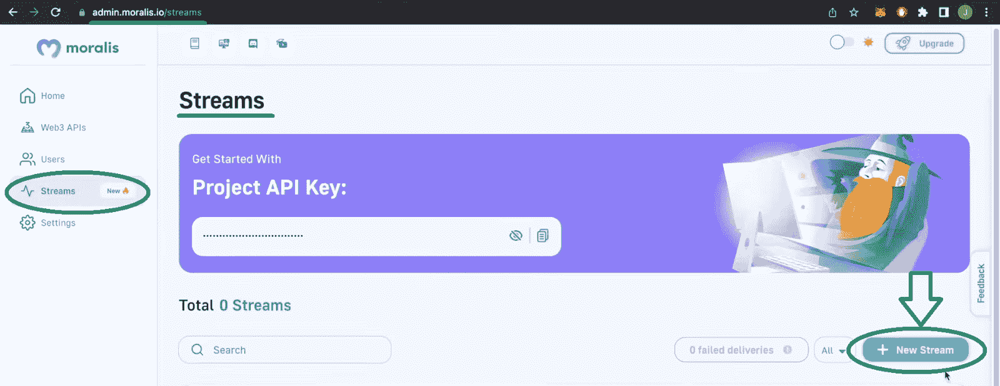

然后，选择“从头开始创建”选项:

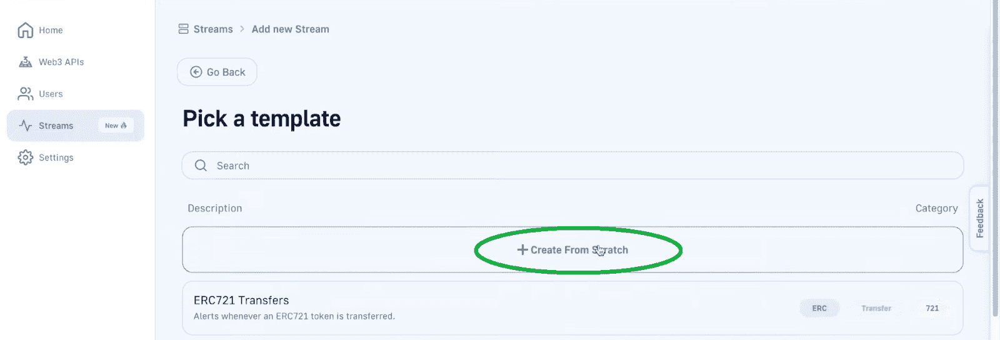

接下来，您需要输入与您想要收听的智能合约相关的几个细节。这是“*如何构建一个不和谐机器人*”过程中的一个重要步骤。此外，在未来，您会希望使用自己的智能契约或其他已经部署的契约。然而，出于本教程的考虑，我们建议您使用我们的示例智能契约(“exampleDonation”契约)。

#### 获取和输入智能合同详细信息

通过关注“示例捐赠”合同，转到 PolygonScan 并复制该智能合同的地址:

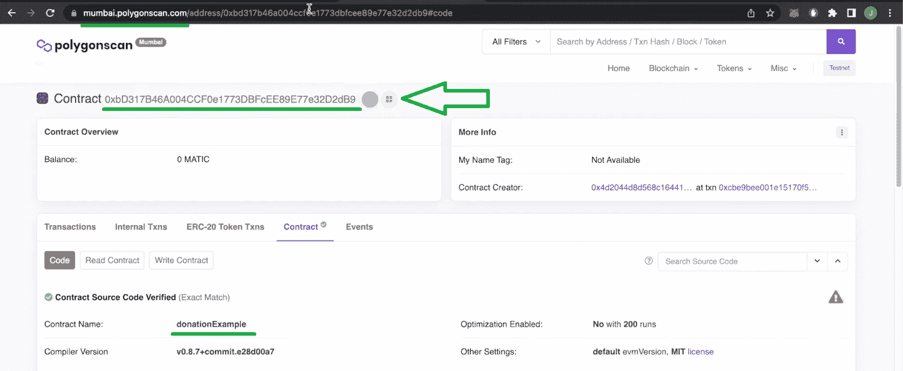

然后，返回到“添加新流”窗口，将上面复制的地址粘贴到指定位置:

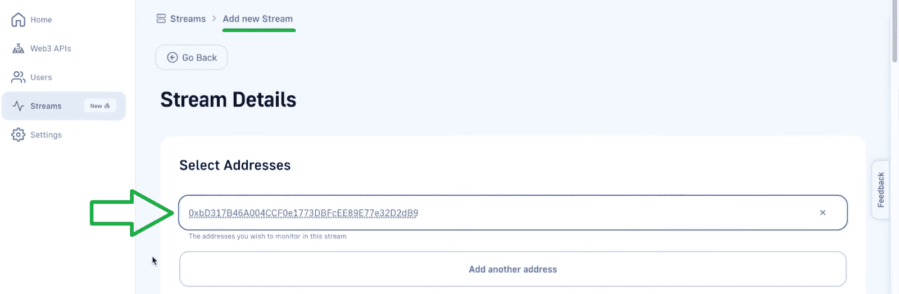

继续，向下滚动添加您的新 Moralis 流的描述。这可以是你想要的任何东西；但是，为了避免任何不必要的混淆，您可以使用“新捐赠”:

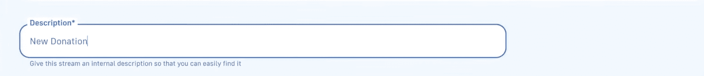

接下来，将您的“ *ngrok* ”地址粘贴到“Webhook URL”输入字段中，并在末尾添加“ */webhook* ”:

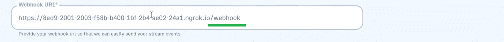

就标签而言，你可以选择“新捐赠”:

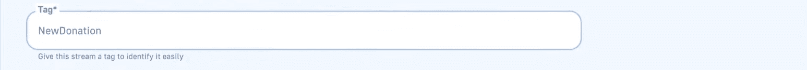

在选择网络时，您需要确保选择您想要侦听的智能合约所在的网络。如果你还记得的话，Polygon 的 testnet 上有“exampleDonation”合同。因此，确保选择“多边形孟买”选项:

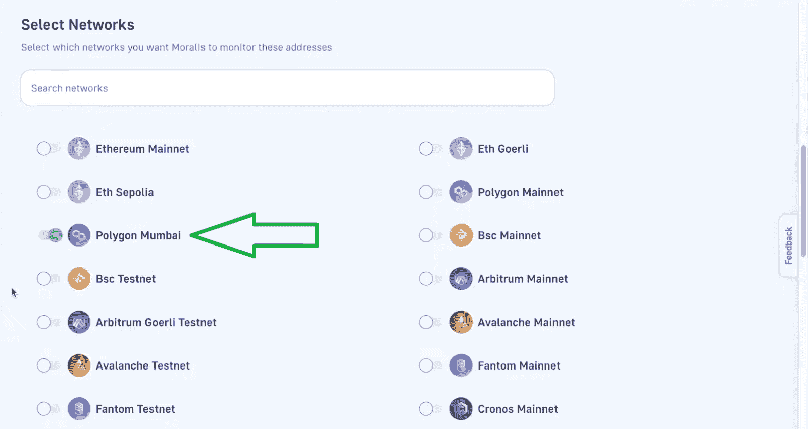

然后，您需要选择“本地交易”选项(捐款在 MATIC 中进行):

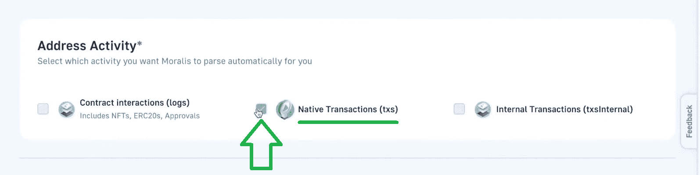

此外，请确保打开“事件发射”:

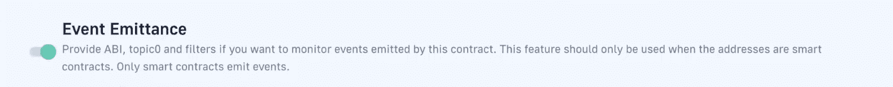

接下来，返回 PolygonScan 复制智能合约的 ABI:

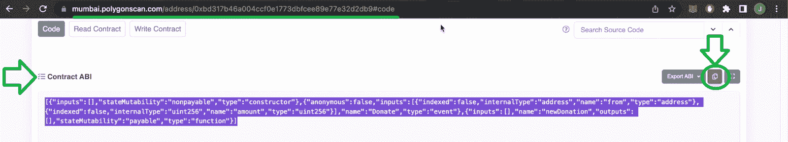

通过将复制的 ABI 粘贴到指定区域，您将可以选择此智能合约的事件:


最后，点击右下角的“创建流”按钮，创建新的 Moralis 流。因此，您应该得到“New Stream Created”成功消息。您还应该能够在“流”页面的底部看到您的 Moralis 流:

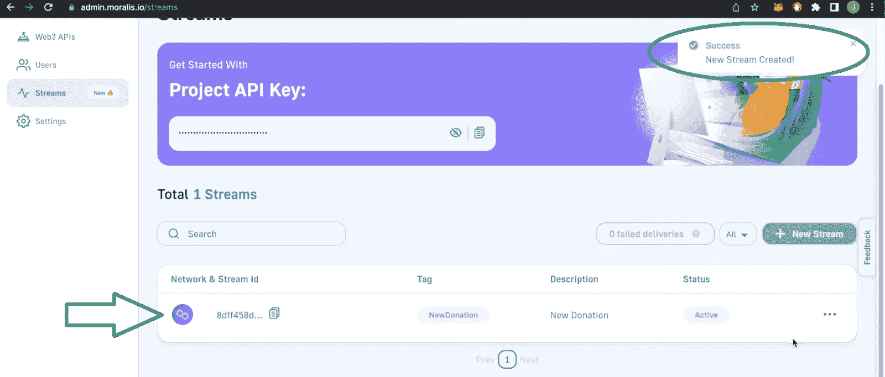

你现在可以测试你的 Moralis 流了。要了解如何做到这一点，请使用文章底部的视频，从 5:36 开始。

### 验证 Webhook 发送方

使用当前的“index.js”代码(在“starter.js”文件中提供)，任何拥有您的 webhook 地址的人都可以发出 post 请求。因此，您必须实现必要的调整来验证 webhook 发送方。首先，在“index.js”文件的顶部导入 Moralis:

```js
const Moralis = require("moralis").default;
```

然后，通过添加以下代码行来初始化 Moralis 的实例:

```js
Moralis.start({
  apiKey: process.env.APIKEY,
})
```

查看上面的代码行，您会发现您需要 Moralis Web3 API 密钥。您需要从您的 Moralis 管理区复制它:

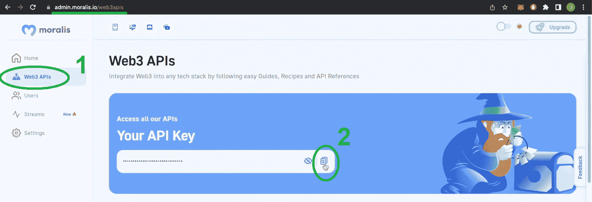

接下来，返回 VSC，创建一个新文件(“。env”)，并将您的 Web3 密钥粘贴到“APIKEY”旁边:

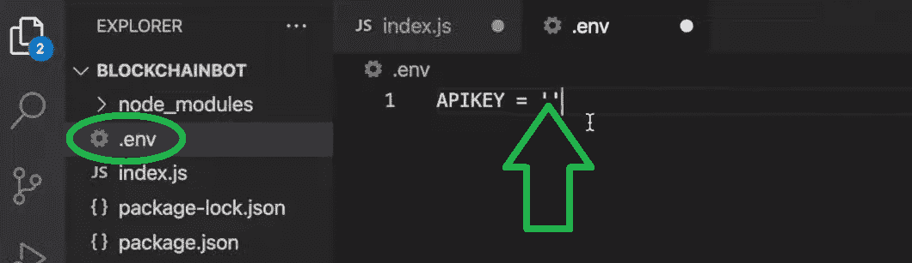

准备好 Web3 API 密钥后，返回到“index.js”文件，并在顶部要求“ *dotenv* ”:

```js
require("dotenv").config();
```

现在，您希望通过将“ *app.listen* ”放入“*中，然后放入*，确保您的 dapp 仅在启动 Moralis 后启动:

```js
Moralis.start({
  apiKey: process.env.APIKEY,
}).then(() => {
  app.listen(port, () => {
    console.log(`Listening to streams`);
  });
});
```

然后，您还需要查看“*标题*，并添加 Moralis 签名“*验证签名*”:

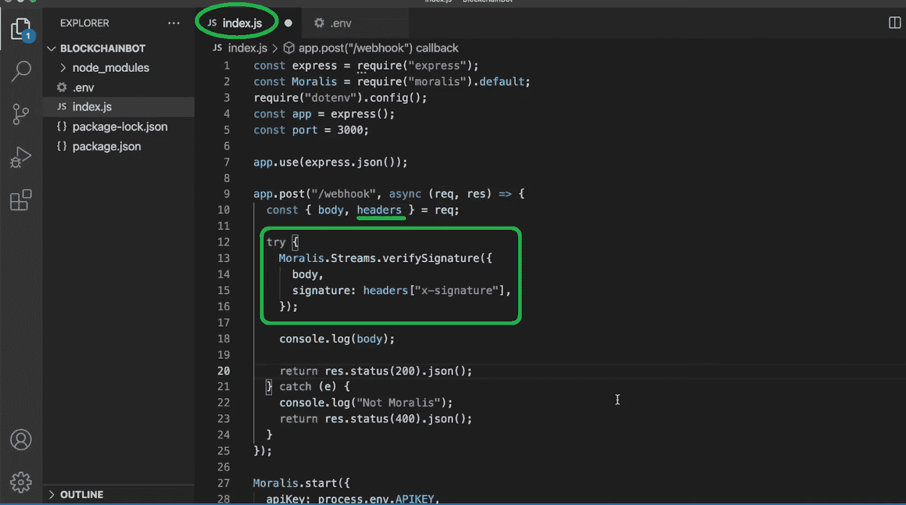

*注意* *:我们鼓励你在我们内部专家的带领下测试你目前的进度(下面 10:20 的视频)。这就是你要用邮递员的地方。*

### 设置一个不和谐机器人

如果没有我们向您展示如何设置不和谐机器人，演示如何构建不和谐机器人将是不完整的。所以，从你的不和谐账户开始。在那里，创建一个新的服务器(“区块链通知”)。如果你以前从未创建过 Discord 服务器，请确保使用下面的视频(11:30)。

一旦你的服务器准备好了，就该给它添加一个新的不和谐机器人了。为此，请访问 Discord 的开发者门户并登录。然后转到“应用程序”页面，点击“新应用程序”按钮:

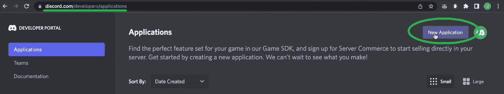

接下来，命名您的应用程序，选中复选框，并点击“创建”按钮:

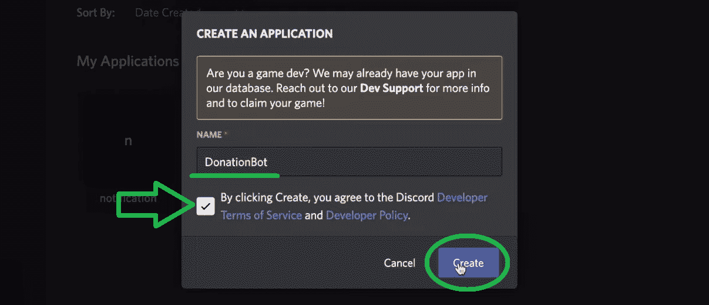

您也可以在应用程序中添加图标:

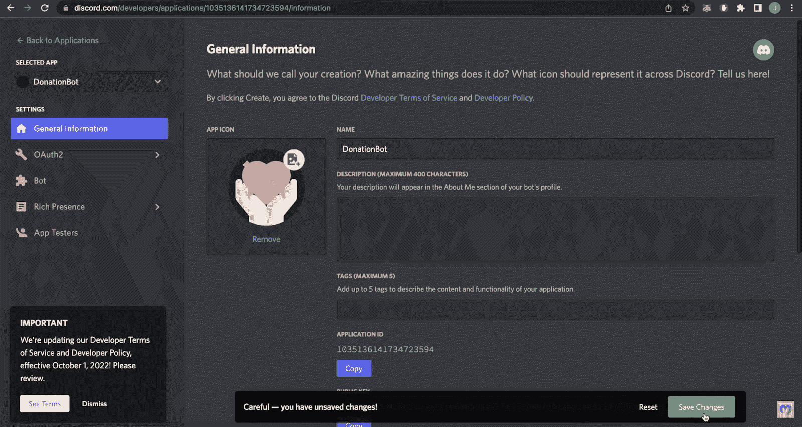

然后，你想选择“机器人”选项，点击“添加机器人”按钮，并点击“是，做吧！”：

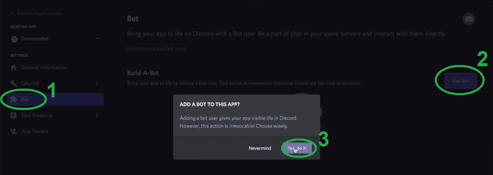

接下来，您希望展开“OAuth2”并单击“URL 生成器”选项:

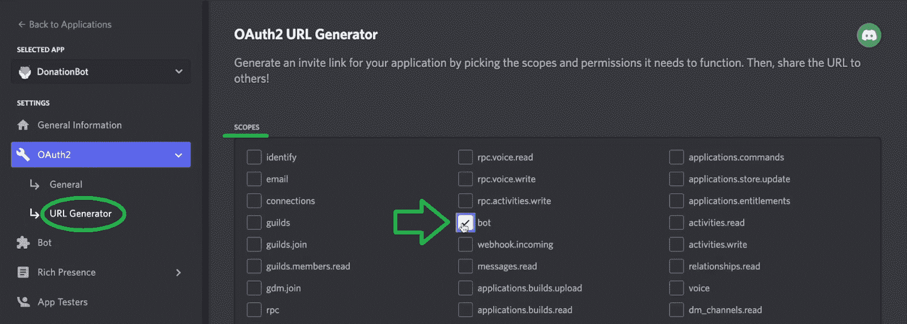

接下来，如上图所示，检查“bot”范围。然后，向下滚动并检查“发送消息”权限:

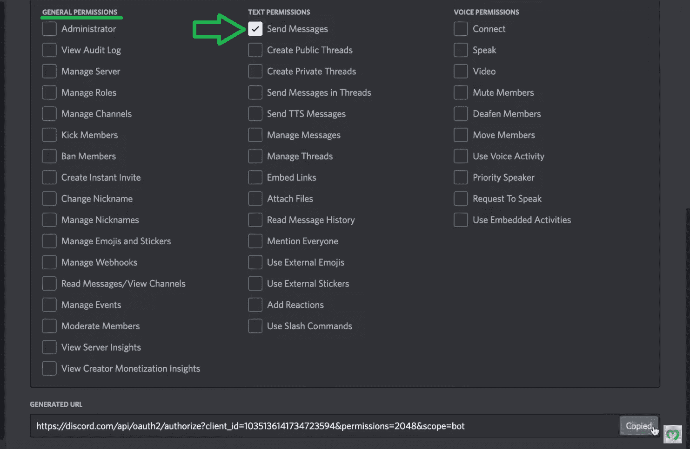

如上图截图所示，复制生成的 URL。通过将该 URL 粘贴到您的浏览器中，您将能够选择要添加该 bot 的服务器:

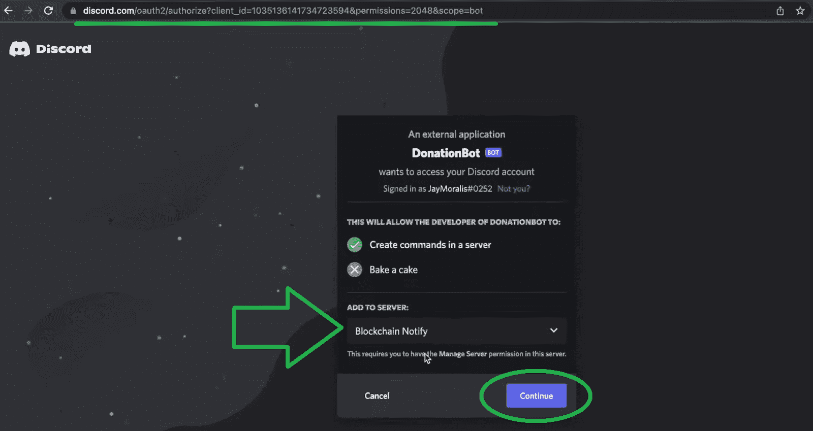

要完成为 crypto 构建 Discord bot 的这一步，您还需要单击“授权”按钮，并确认您是人类:

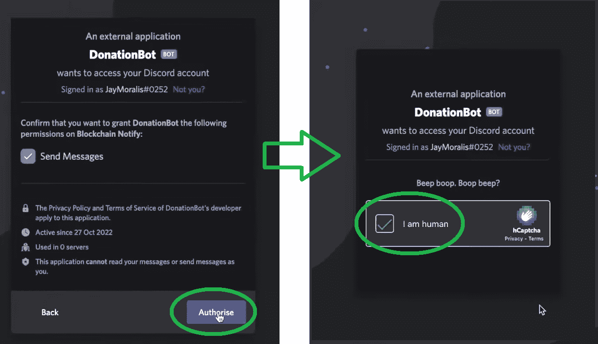

现在，你可以关闭标签，访问你的不和谐。如果你遵循了我们的指示，现在你的“区块链通知”Discord 服务器中应该有“捐赠机器人”机器人:

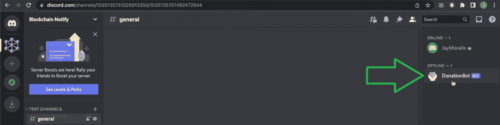

### 实现一个示例区块链 Discord Bot——用 Discord.js 发送消息

在我们“*如何构建一个不和谐机器人*”任务的最后一步，您需要添加必要的代码行，以确保上面创建的机器人成为一个加密监视器不和谐机器人。因此，返回到您的“index.js”脚本，并在顶部导入“ *discord.js* ”:

```js
const discord = require("discord.js");   

Next, create a Discord client just below the imports:

const client = new discord.Client({
    intents: [],
  });

client.login(process.env.PASS);
```

查看上面代码的最后一行，可以看到您需要将“PASS”变量添加到您的。env "文件。要获取此变量，请返回到您的“捐赠机器人”应用程序(“机器人”选项)，然后单击“重置令牌”按钮。然后复制令牌:


继续前进，去你的”。env "文件，创建" PASS "变量，并粘贴上面复制的标记:

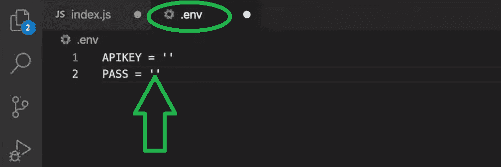

接下来，转到您的 Discord 服务器，复制您的频道 ID(右键单击您希望您的机器人发布消息的频道):

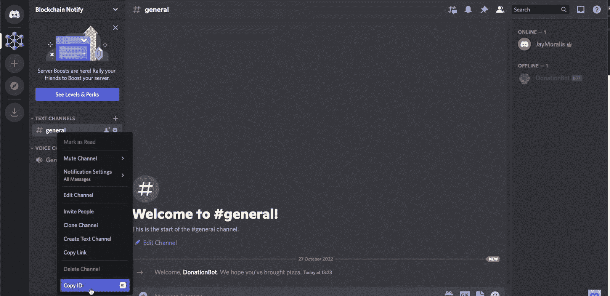

返回到”。env "文件，并创建一个新变量来存储上面复制的 ID:

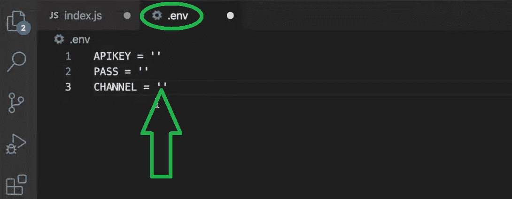

变量就位后，您可以在“ *try* ”中添加必要的代码行:

```js
    let from = body.txs[0].fromAddress;
    let amount = Number(body.txs[0].value / 1E18);

    const channel = await client.channels.fetch(process.env.CHANNEL);
    channel.send(`New Donation submitted by ${from}, for ${amount.toFixed(2)} MATIC!!!!`);
```

*注:您可以在 GitHub 上访问* [*最终代码*](https://github.com/MoralisWeb3/youtube-tutorials/blob/main/Discord-Blockchain-Bot/index.js) *。*

有了上面几行代码，您已经成功地完成了“*如何构建一个不和谐机器人*”实现中涉及的所有五个步骤。现在，确保带着你的机器人转一圈。*使用下面的视频作为指导(17:34)* 。

最后但同样重要的是，这是我们在整篇文章中引用的“*如何构建一个不和谐机器人*”教程的视频版本:

[https://www.youtube.com/embed/GiDXKT_AAIs?feature=oembed](https://www.youtube.com/embed/GiDXKT_AAIs?feature=oembed)

## 区块链不和谐机器人–为链上事件构建不和谐机器人–摘要

我们在今天的文章中谈了相当多的内容。首先，你有机会了解什么是不和谐机器人。我们还确保你知道什么是加密监视器不和谐机器人。有了这些基础知识，你就有机会跟随我们的领导。此外，通过带您完成五个主要步骤，我们为您提供了与构建不和谐机器人相关的所有细节。这五个步骤包括:

1.  设置一个简单的 NodeJS Express 后端
2.  添加新的 Moralis 流
3.  验证 Webhook 发送方
4.  设置一个不和谐机器人
5.  实现一个示例区块链不和谐机器人

尽管如此，我们也分享了一个视频教程，其中包含了关于为链上事件构建不和谐机器人的更多细节。

我们建议您使用上面获得的“*如何构建 Discord bot* ”知识，为另一个智能合约构建您自己的加密监视器 Discord bot。这样，你就能适当地巩固你的知识。另一方面，您可能想要探索其他区块链开发主题并创建各种 dapps。如果是这样的话，你应该使用[Moralis 文件](https://docs.moralis.io/)、[Moralis YouTube 频道](https://www.youtube.com/c/MoralisWeb3)和[Moralis 博客](https://moralis.io/blog/)。毕竟，这些渠道有能力免费帮助你成为 Web3 开发者。例如，我们的一些最新主题向您展示了如何在 Solana 上编写智能合同的程序，将文件上传到 IPFS 的程序，以及在 Solana 上铸造硬币的程序等等。

当然，你也可以采取更专业的方法来进行你的加密教育。通过注册[Moralis 学院](https://academy.moralis.io/)，你可以成为区块链认证，并大大提高你获得加密工作的机会。为了建立一个合适的基础，我们鼓励你从专注于[区块链和比特币基础](https://academy.moralis.io/courses/blockchain-bitcoin-101)的课程开始。*