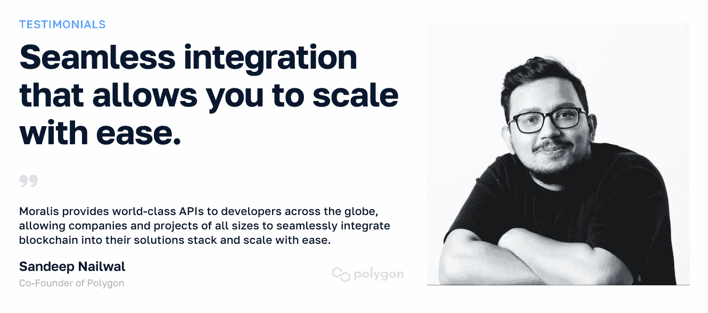
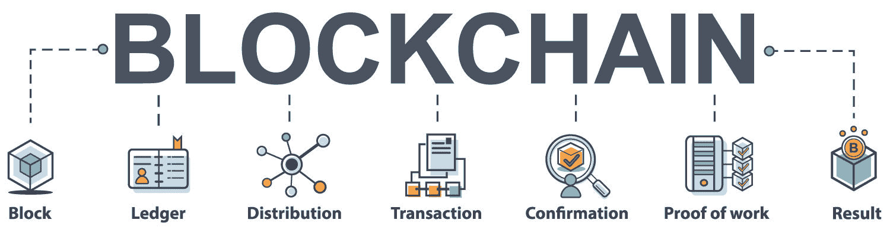
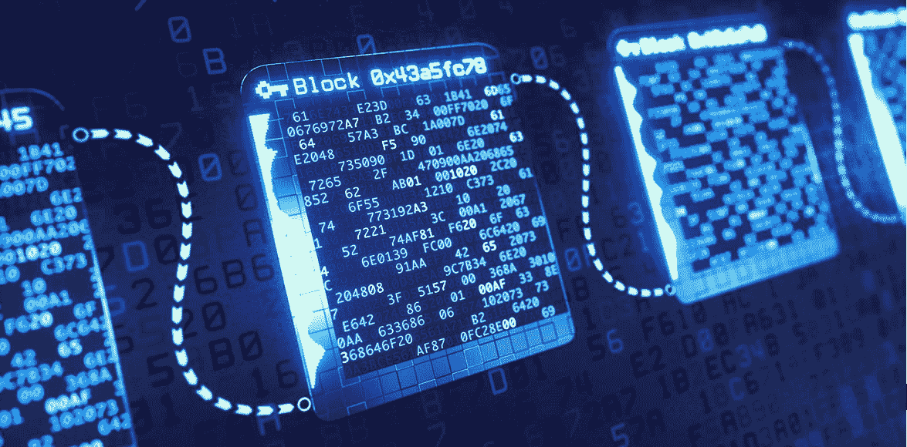
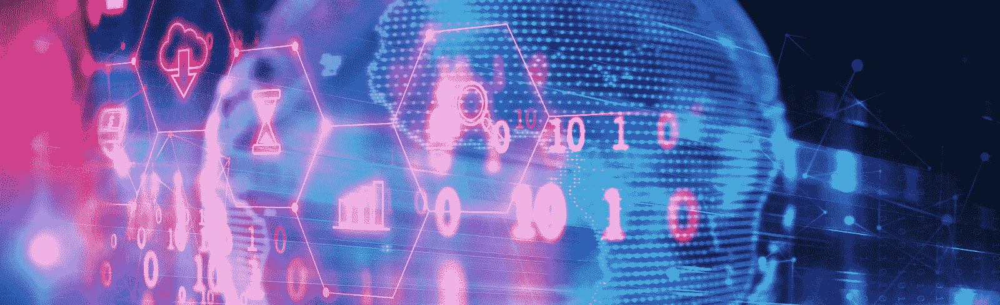
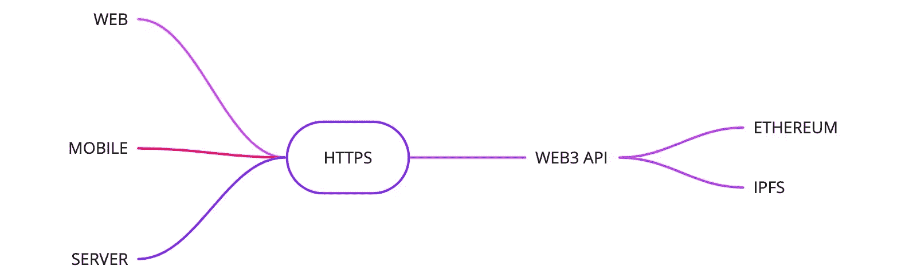
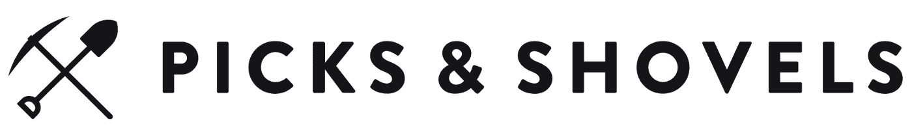
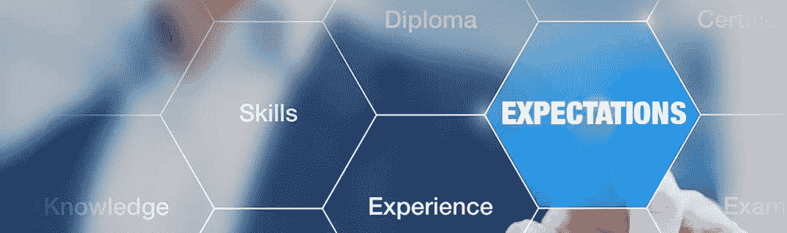
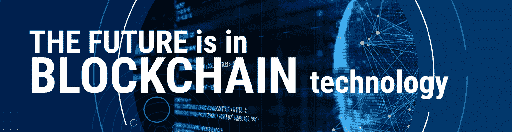

# 区块链基础设施公司——如何选择合适的提供商

> 原文：<https://moralis.io/blockchain-infrastructure-companies-how-to-choose-the-right-provider/>

**区块链基础设施公司正在扩张，并努力加快区块链颠覆性新技术的采用。此外，有这么多的供应商，新的供应商不断涌现，选择合适的区块链基础设施公司来满足您的项目需求是一项挑战。如果你发现自己处于这种情况，这篇文章是给你的。**

在完成这篇文章后，你会知道你应该选择哪家公司来做你的开发工作。然而，如果你一直在寻找一个 Web3 API 提供者，我们可以让你知道 Moralis 应该是你的首选！

**受到行业领导者的信任**

[**Access Moralis’ Scalable Web3 Infrastructure**](https://moralis.io/scale/)

### 概观

顾名思义，这篇文章将为你提供所有你需要的信息，以选择合适的 [Web3 提供商](https://moralis.io/web3-provider-why-blockchain-developers-should-use-one/)来满足你的需求。也就是说，值得指出的是，你可能需要使用区块链基础设施公司的组合，尤其是如果你的目标是构建更复杂的 dapps。此外，要识别最适合您项目的区块链基础设施公司，您需要了解一些基本知识。因此，我们将从回答区块链技术及其基础设施需要什么开始今天的讨论。在这里，您将了解当前的[区块链理工学院](https://moralis.io/the-ultimate-blockchain-tech-stack-guide/)和[区块链基础设施状况](https://moralis.io/blockchain-infrastructure-the-tech-and-landscape-empowering-developers/)。接下来，我们将了解区块链基础设施领域的领先项目和公司。本质上，这将为你提供一个选择项目和公司，你应该考虑在这个行业开始建设。

尽管如此，我们还将解释对区块链基础设施提供商的期望。这是一个极其重要的方面，当选择最好的区块链基础设施公司为您的加密努力。然而，你也需要知道你的目标是什么。例如，您想构建一个获取链上数据的 dapp 吗？或者，您想创建自己的加密资产并将其整合到您的 dapps 中吗？毕竟，你的目标将决定你需要关注哪些参与区块链基础设施建设的公司。最后但同样重要的是，我们还将进一步了解 dapp 开发的最佳区块链基础设施公司。在这里，您将了解到[Moralis](https://moralis.io/)-最终的 Web3 API 提供商-如何帮助您的“ [Web3 for business](https://moralis.io/web3-for-business-how-and-why-you-can-integrate-web3-into-your-enterprise/) ”需求。

## 什么是区块链技术？

多亏了区块链的基础设施公司，即使你不是区块链的专家，你也可以在这个领域开始建设。尤其是如果你专注于创造 dapps，你的传统技能会让你走得更远。然而，理解基础知识将帮助你更有信心地继续下去。

那么，区块链是什么？这是一个开放的分布式数字账本。后者可以有效地并以可验证和永久的方式记录双方之间的交易。也就是说，区块链技术是在某种程度上帮助区块链顺利运转的技术。此外，区块链理工大学的核心是区块链网络——硬件、代码和软件的组合。你可能知道，比特币是 2009 年第一个问世的区块链。然而，比特币过去和现在在可编程方面都非常有限。因此，一群开发人员创造了以太坊——第一个也是领先的可编程区块链。以太坊(2015)的诞生也标志着智能合约的开始。后者是链上的软件，能够根据预定义的规则自动进行区块链交易。

为了帮助你更好地理解为什么我们称它为“区块链”，我们需要简要地解释一下区块链技术是如何工作的。简而言之，每个区块链网络由网络验证器(节点)组成，在大多数情况下，网络验证器还存储区块链当前状态的副本。使用某种共识机制(PoW、PoS、PoH 等。)，验证器确认链上事务并将它们存储在块中。当存储在链上时，这些块被链接到它们的前一个。这导致一连串的块或区块链。如果设计得当，这个链是不可变的、分散的、安全的和永久的。

## 什么是区块链基础设施？

在上一节中，您了解了区块链基础设施的基本层—可编程区块链。因此，值得指出的是，在过去的几年里，我们有许多其他项目效仿 Ethreum 的例子，进行了一些独特的改变。因此，现在有几个著名的开发区块链(又名区块链基础设施)可以建立 dapps。

除了第 1 层区块链，区块链基础设施还包括物理设备、软件和当前区块链技术堆栈所有层中涉及的其他移动部件。也就是说，一定要好好看看下面的图片:

接下来，我们将从上述技术堆栈的第二层、第三层和第四层更深入地了解一些领先的区块链基础设施公司。毕竟，最有可能的是，您对构建自己的第 1 层区块链不感兴趣，而是对开发 dapps 感兴趣。因此，您可以将可编程区块链视为理所当然，并使用可用的技术、工具和解决方案来创建出色的 dapps，而无需重新发明轮子。然而，在我们深入了解领先的区块链基础设施提供商之前，让我们也考虑一下 CoinDesk 的“*数字资产分类标准*”(DACS)，以帮助您更好地了解区块链应用的范围。因此，让我们仔细看看下面的 DAC 图形表示:

上图显示，DACS 将区块链项目分为以下六个主要领域:计算、货币、DeFi、文化和娱乐、智能合同平台和数字化。可以肯定地说，在这六个领域中，每个领域都有不同的区块链基础设施提供商。然而，“计算”和“智能合约平台”在支持 dapp 创建方面承担了最多的负载。然而，一些最好的区块链基础设施公司实际上是脱链的，它们作为一座桥梁帮助你将 Web3 特性整合到你的去中心化应用中。

## 参与区块链基础设施的公司

我们在上面指出，计算和智能合同平台领域扮演着最重要的角色。因此，我们可以认为基础设施区块链(智能合约平台的另一个术语)是理所当然的。因此，我们可以关注计算机行业的公司。此外，这些类型的区块链基础设施公司可以进一步分为以下五个行业组:

*   **物联网**–物联网产业集团内部的区块链基础设施提供商专注于通过将区块链网络融入现实世界来开发“物联网”和 Web3。可以说，物联网协议有助于物联网网络和区块链之间的互操作性。氦是物联网协议的一个很好的例子。

*   **Oracle 协议**—在收集、组织和传输数据方面，Oracle 协议独占鳌头。令人印象深刻的是，这些协议支持实时链上和链下数据以及两者之间的数据共享。此外，oracles 倾向于利用其网络的本地令牌来支付交易成本和治理权。oracle 协议的一个很好的例子是 Chainlink。

*   **私有计算**–私有计算协议旨在建立一个自由、分散的云计算能力、安全即服务、剩余带宽和其他计算服务市场。

*   **共享网络**–共享网络是分布式云计算的网络，允许参与者以不同的成本向匿名买家提供能源和计算资源。

*   **共享存储**–在革新传统的集中式存储服务器方面，共享存储协议引领潮流。他们的目标是通过一个经济激励系统，在矿工/利益相关者的开源网络中分配存储责任。共享存储协议的一个很好的例子是基于 IPFS 的 Filecoin。

### 节点和 Web3 API 提供程序

在这一部分和下一部分中，我们将仔细研究使区块链开发变得更加简单的领先工具和技术。此外，在大多数情况下，这些捷径是由外链项目和公司提供的。他们通常被称为“区块链基础设施即服务”提供商。此外，我们将提及参与区块链基础设施建设的最有声誉的公司，包括以下各类区块链基础设施提供商:

*   **节点提供商**–节点是区块链网络的主干。因此，与分散式数字总账的所有通信都是通过节点进行的。然而，运行一个完整的节点是一项全职工作，大多数开发人员都不想做。幸运的是，有几个可靠的区块链基础设施公司提供开发人员使用他们的节点。因此，当/如果您决定开始部署智能合约时，您会希望研究以下节点提供商提供的服务:Alchemy、QuickNode、Chainstack、Infura、Pocket Network、RunNode 和 GetBlock。

*   Web3 API 提供商–这些类型的区块链基础设施公司是 dapp 开发者最需要的。毕竟，Web3 APIs 使用简短的代码片段在稳定的环境中实现了一致的编码。因此，一个优秀的 Web3 API 提供者使您能够获得各种有用的预编译和预先计算的链上数据，而无需自己构建所需的基础设施。主要的例子包括图形，炼金术，双经济，共价，位查询，快速节点和 Moralis。

### 其他精选区块链基础设施提供商

*   智能合同编程语言–开发人员使用这些工具来编写智能合同。值得指出的是，它们因可编程链而异。例如，Solidity 是以太坊和其他 EVM 兼容链上智能合约的主要编程语言。另一方面，索拉纳利用铁锈来达到这个目的。

*   智能合同开发框架和 ide–这些工具支持智能合同编码、编译、部署、验证和测试。以下是一些主要的例子:
    *   hard hat–以太坊开发环境。
    *   ganache——测试环境。
    *   remix Online IDE–使开发人员能够通过浏览器编译、部署和验证 EVM 兼容链的智能对比。
    *   open zeppelin——Solidity 智能合同模板提供商。
    *   meta plex-Solana 智能合同模板和工具解决方案。

*   **Web3 钱包**–也称为加密钱包，这些工具主要用于管理、发送、接收和存储加密货币。然而，它们还有其他用例，包括简化 Web3 身份验证、链上事务执行、dapp 测试等。一些领先的 Web3 钱包包括 MetaMask(以太坊和 EVM 兼容链)，Phantom(索拉纳)，Trust Wallet，Rainbow，比特币基地钱包，Argent 和 Ledger(硬件钱包)。

*   **区块链浏览器**–区块链浏览器是一种特殊的 dapps，使用户和开发人员能够探索链上数据，甚至与智能合同进行交互。主要的例子包括以太坊的 Etherscan、BNB 链的 BscScan、多边形的 PolygonScan 和雪崩的 SnowTrace。

### 对区块链基础设施提供商有什么期待

在了解了上述领先的区块链基础设施公司后，您可能对这些类型的提供商有所期待。根据定义，参与区块链基础设施建设的知名公司负责协调和维护区块链设施的使用。他们还开发在分散网络上构建的代码。此外，他们还可以提供平台、开发工具、度量和分析、容器服务和社区支持，让开发人员的生活尽可能简单。

然而，正如你在上面看到的，Web3 工具和技术有许多不同的形式。因此，确切的服务显然差别很大。然而，只要有一家声誉良好的公司参与区块链的基础设施建设，除了实际的产品和服务之外，你可以(也应该)期待得到适当的客户支持。后者可能具有巨大的价值。事实上，这一点非常重要，以至于它常常能让区块链最好的基础设施公司脱颖而出。毕竟，大多数开发人员和团队都是加密领域的新手，通常会感谢他们所能得到的所有支持。

此外，在了解更多关于区块链最佳基础设施公司——Moralis 的信息后，您将更好地了解区块链基础设施供应商的期望。

## 最好的区块链基础设施公司

Moralis 是最终的 Web3 API 提供者。它的主要目标是使遗留开发者能够弥合 Web2 和 Web3 之间的开发差距。Moralis 凭借其出色的跨平台互操作性实现了这一目标。因此，这个企业级 API 提供者支持所有领先的遗留开发平台、编程语言和框架。因此，基本的区块链知识足以加入网络 3 革命。此外，Moralis 支持所有领先的可编程链。因此，您和您的团队可以使用 Moralis 的工具箱来构建完全跨链互操作的 dapps。

此外，作为区块链领先的基础设施公司之一，Moralis 支持高容量请求。因此，您可以快速顺利地处理大量呼叫，以访问所有 NFT、DeFi、交易和令牌数据。事实上，Moralis 为您提供了市场上最具[可扩展性的 Web3 基础设施](https://moralis.io/scale/)解决方案之一。也就是说，许多其他知名的区块链基础设施公司依赖 Moralis 的 [Web3 来获得企业](https://moralis.io/web3-for-enterprise-business-applications-in-web3/)解决方案也就不足为奇了。这就是 MetaMask、Delta、Polygon 和许多其他公司能够将上市时间平均缩短 87%并总共节省 8600 多万美元工程成本的原因。

尽管如此，Moralis 的两个额外的突出优势来自 Moralis 的 24/7 全球支持和行业领先的[业务培训项目](https://academy.moralis.io/business)。这使得来自全球各地的团队能够充分利用终极的[令牌 API](https://moralis.io/token-api/) 、[授权 API](https://moralis.io/authentication/) 、 [NFT API](https://moralis.io/nft-api/) 和[流 API](https://moralis.io/streams/) 。最终，有了 Moralis 的支持，获取链上数据和创建 dapps 变得简单明了。

## 区块链基础设施公司——如何选择合适的提供商——总结

通过以上几节，您有机会根据自己的需求选择合适的 Web3 提供商。快速浏览后，我们解释了什么是区块链技术。接下来，您还了解了关于区块链基础设施的所有信息，以便在寻找可靠的区块链基础设施公司来支持您的 dapp 开发时做出明智的决策。您也有机会了解哪些是参与区块链基础设施建设的领先公司。在这里，我们提到了一些来自计算领域、node 和 Web3 API 领域的著名代表，以及其他一些工具和技术。

此外，我们告诉了您对区块链基础设施公司的期望。你现在知道你需要清楚你需要什么样的服务/工具。最后，您还了解了如何将 Moralis 定义为区块链最佳基础设施公司。

如果你是一个开发人员，想以简单的方式开始构建 dapps，创建一个[免费的 Moralis 账户](https://admin.moralis.io/register)并处理 [Moralis 文档](https://docs.moralis.io/docs)中等待你的教程。但是，如果您有好的想法，并且希望利用 Moralis 来实现它们，请使用上面的“可扩展的 Web3 基础设施”链接，并与我们的支持团队联系。

使用 [Moralis YouTube 频道](https://www.youtube.com/c/MoralisWeb3)和 [Moralis 博客](https://moralis.io/blog/)拓展你的区块链发展视野。那里的一些最新主题探索了 [NFT 元数据存储](https://moralis.io/nft-metadata-exploring-metadata-for-nft-storage/)、[部署 AWS Lambda 函数](https://moralis.io/deploying-lambda-functions-how-to-deploy-aws-lambda-function-tutorial/)、[终极 ERC20 令牌 API](https://moralis.io/exploring-the-ultimate-erc20-token-api/) 等等。当然，你也可以通过注册[Moralis 学院](https://academy.moralis.io/)来采取更专业的方式来进行你的加密教育。“[区块链和比特币基础](https://academy.moralis.io/courses/blockchain-bitcoin-101)”课程是一个很好的起点。