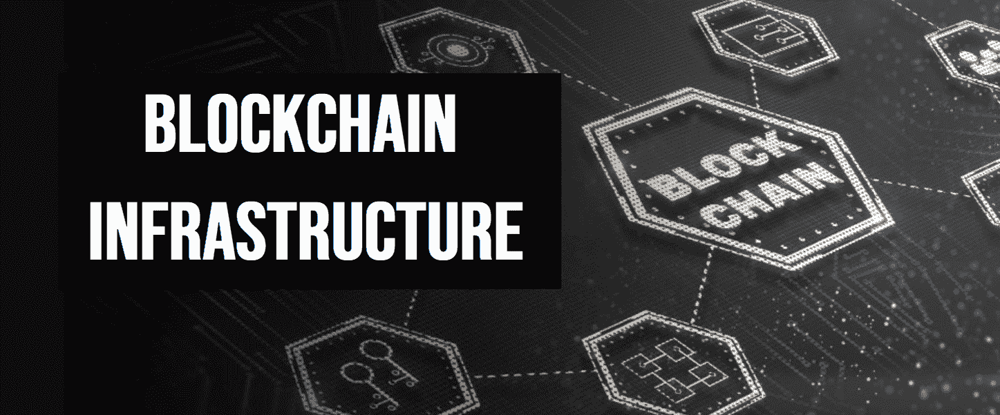
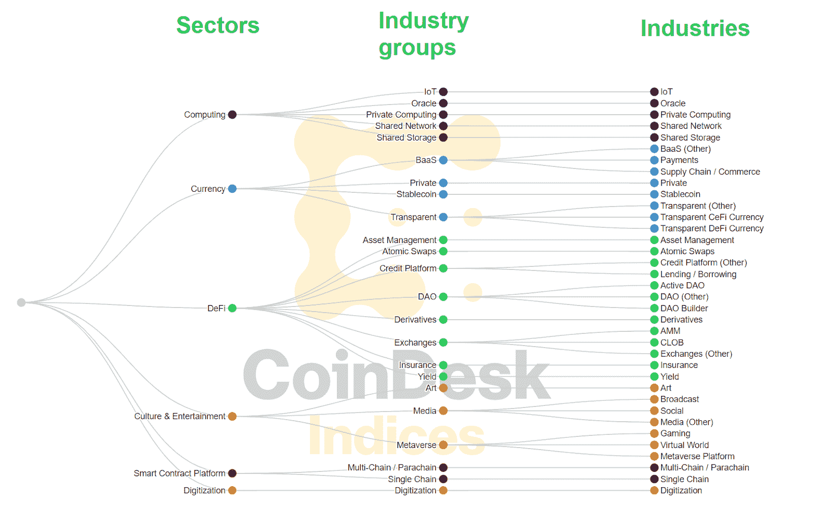
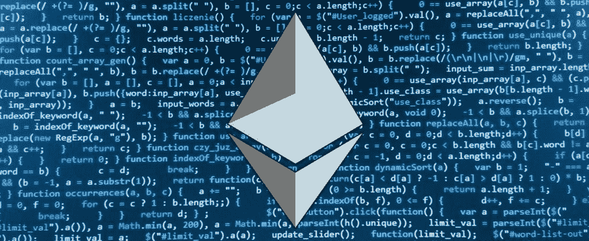
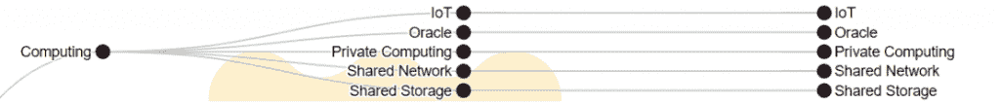
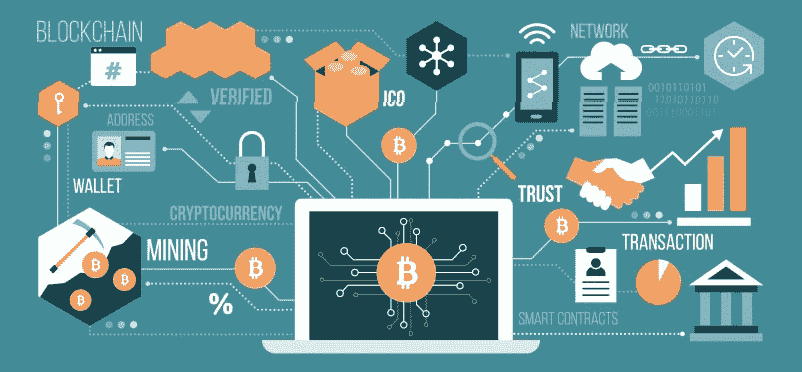
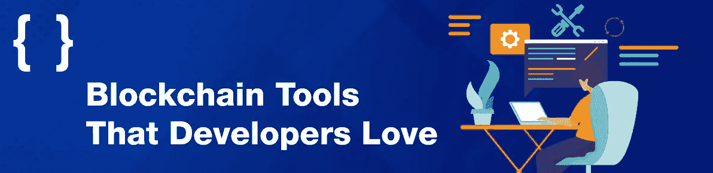

# 区块链基础设施——赋能开发者的技术和景观

> 原文：<https://moralis.io/blockchain-infrastructure-the-tech-and-landscape-empowering-developers/>

为了在开发工作中取得成功，开发人员必须使用提供下一代技术、工具和解决方案的区块链基础设施。由于 Moralis 及其企业级区块链基础设施，开发人员可以释放 Web3 的力量，快速轻松地构建 dapps。

**受到行业领导者的信任**

[**Use Scalable Web3 Infrastructure Today**](https://moralis.io/scale/)

Moralis 弥合了 Web2 和 Web3 之间的发展差距。因此，这个最终的 Web3 API 提供者通过授权 Web2 开发者使用传统工具创建分散式应用程序(dapps ),丰富了区块链基础设施的前景。然而，值得指出的是，我们还将关注 Moralis 之外的解决方案。因此，本文旨在帮助您更好地了解区块链的整体基础设施。

### 概观

你可能知道可编程区块链网络是区块链科技栈的基础层。您可能还意识到，在构建和操作 dapps 时，您希望避免直接处理这个基础层。幸运的是，区块链网络基础设施已经取得了长足的进步，您现在可以使用许多开箱即用的解决方案来完成繁重的工作。如果您有兴趣进一步探索这些解决方案，请继续阅读！

接下来，我们将首先确保您能够回答“什么是区块链基础设施？”问题。此外，您将了解 CoinDesk 的“*数字资产分类标准*”(DACS)，这在试图了解区块链基础设施时会非常有帮助。接下来，我们将探索区块链的技术基础设施及其当前的状况，尤其是计算领域。然后，我们还将关注 dapp 开发的领先提供商。最后，我们将密切关注区块链开发者的头号基础设施——Moralis。

另一方面，如果你喜欢边做边学，确保现在就创建你的[免费 Moralis 账户](https://admin.moralis.io/register)。然后，通过完成[Moralis 文件](https://docs.moralis.io/)中概述的一些教程，开始使用这个 [Web3 提供商](https://moralis.io/web3-provider-why-blockchain-developers-should-use-one/)。

## 什么是区块链基础设施？

区块链基础设施的基础层和重要部分是可编程区块链，以太坊是其中的佼佼者。然而，区块链的基础设施还包括物理设备、软件和区块链技术堆栈的所有其他层。然而，在这篇文章中，我们想把全部注意力放在 Web3 开发者构建和操作 dapps 所需的技术、工具和解决方案上。

值得注意的是，区块链术语和分类尚未统一。因此，了解 crypto 仍然有点像“狂野的西部”有助于理解这个主题。然而，许多先进的组织、团队和公司都在尽最大努力让整个区块链行业更加清晰。这就是 CoinDesk 的“*数字资产分类标准*”(DAC)的突出之处。因此，我们将使用这种分类来帮助我们回答“什么是区块链基础设施？”问题。

这是 DAC 的图示:

上图显示，DACS 定义了区块链基础设施的六个主要部分:

*   计算
*   货币
*   挑战
*   文化和娱乐
*   智能合约平台
*   数字化

虽然上述所有内容在某种程度上都有助于区块链的基础设施，但“计算”和“智能合同平台”部门代表了区块链基础设施领域的大部分。

### 智能合约平台

记住上面这张来自 CoinDesk 的图片，“智能合约平台”在某种程度上只是可编程区块链的另一种说法。此外，这种网络无疑是区块链发展基础设施的基础。然而，作为一名 dapp 开发人员，您不需要与该特定层进行交互。计算部门和它提供的技术值得你关注。在继续之前，请确保也调查当前区块链理工学院堆栈的五个层次。为此，请使用下图，这将有助于您更好地了解区块链的技术基础架构:

## 探索区块链技术基础设施及其前景

前两节回答了“什么是区块链基础设施？”问题；然而，如果你想正确理解它，我们需要更深入地研究。也就是说，让我们首先确保你知道区块链是什么。区块链是一个分布式的数字账本或者数据库。相应的，它自己也做不了多少。只有与其他技术和工具(如领先的基础设施区块链解决方案)相结合，它才能大放异彩。

如前所述，计算领域包括几项关键技术，可充分运行分散式互联网。尽管如此，还涉及其他重要技术或区块链基础设施。例如，许多遗留的编程语言和平台在为 dapps 创建前端方面继续扮演着重要的角色。此外，一些专门用于智能合约开发的编程语言，如 Solidity，也是必不可少的。

### 计算机行业

根据上述 DAC，计算领域包括侧重于构建和支持区块链基础设施的协议。这个部门的协议和项目的目标是分散和消除计算、云存储、数据库和网络等服务的中介。因此，这一部门是将数据和信息的所有权归还给网络参与者的关键。根据 DAC，这是计算领域的五个行业组(和独立的新行业):

*   **IoT**–这些协议专注于“物联网”和 Web3 的开发。他们通过将区块链网络基础设施融入现实世界来实现这一目标。因此，这些协议有助于物联网网络和区块链之间的互操作性。

*   **Oracle 协议**–在收集、组织和传输数据方面，Oracle 协议是不二之选。他们不仅可以关注“链上数据到链上数据”，还可以实时处理“链外数据到链上数据”。通常，oracle 协议使用本机令牌来覆盖交易成本和治理权限。

*   **私有计算–**私有计算协议旨在建立一个自由、分散的云计算能力、剩余带宽、安全即服务和其他一次性按需计算服务市场。

*   **共享网络**–共享网络是分布式云计算的开放网络。因此，他们允许参与者以不同的价格向匿名买家提供能量和计算资源。

*   **共享存储**–共享存储协议致力于革新传统的集中式存储服务器。为了实现这种分散化，这些类型的协议通过一个开源的矿工/利益相关者网络和一个经济激励系统来分配存储责任。

### 区块链的其他重要基础设施技术和工具

区块链的基础设施景观侧重于后端功能。以下技术和工具在这方面发挥了巨大作用。所以，他们在这里:

*   **节点提供商**–节点对于与区块链通信至关重要。然而，运行一个节点是一项全职工作，作为一名 dapp 开发人员，您很可能希望避免这样做。幸运的是，节点提供商(运行节点的公司)允许您使用他们的服务。因此，当/如果您决定深入智能契约开发时，您可能希望使用一两个可靠的节点提供者(用于冗余)。

*   **Web3 API 提供者**–高质量的 API 能够在稳定的环境中实现一致的编码。因此，它们是“区块链基础设施”拼图中至关重要的一块。此外，各种 Web3 API 提供者正在提供不同的 API。通常，这些提供商连接到节点并创建自己的区块链技术基础设施。这些提供程序使您能够通过简短的代码片段获得大量有用的预编译和预先计算的链上数据。因此，这些提供商往往对 dapp 开发者来说价值最高。

*   **智能合约编程语言**–它们用于创建智能合约(链上软件),并根据您想要关注的可编程链而变化。有些语言包括实和锈。

*   智能合同开发框架和 ide–您需要这些工具来编写、编译、部署、验证和测试智能合同。

*   **Web3 钱包**–web 3 钱包的主要用途是帮助您管理、发送、接收和存储加密货币。然而，它们对于 Web3 认证过程也是必不可少的，例如确认所有链上交易、测试 dapps 等。

*   **区块链探索者**–这些是特殊类型的 dapps，使用户和开发人员能够探索链上数据，甚至与智能合同互动。

## 区块链网络基础设施提供商

既然你可以回答“什么是区块链基础设施？”问题以及哪些技术和工具支持区块链的基础设施，现在我们应该列出值得您关注的领先提供商。

*   **计算界代表**:
    *   共享存储器
    *   Chainlink (oracle)
    *   Helium (IoT)
    *   IPFS(流行的分散商店解决方案，但不在区块链)

*   **节点提供商**:
    *   Infura
    *   魔力
    *   快速笔记
    *   链板
    *   山羊块
    *   袖珍网络
    *   运行节点

*   **Web3 API 提供者**:
    *   共价的
    *   图表
    *   快速笔记
    *   魔力
    *   bigquery
    *   双经济
    *   Moralis

*   **专注于智能合同开发的项目**:
    *   坚固性(适用于以太坊和其他 EVM 兼容链)
    *   Rust(为[建立一个索拉纳智能合约](https://moralis.io/solana-smart-contract-building/)
    *   以太坊开发环境
    *   Truffle(开发环境、测试框架和 EVM 兼容链的资产管道)
    *   Ganache(测试环境)
    *   Remix Online IDE(通过浏览器编译、部署和验证 EVM 兼容链的智能对比)
    *   OpenZeppelin (Solidity 智能合同模板)
    *   Metaplex (Solana 智能合同模板和工具)

*   **Web3 钱包**:
    *   元掩码(以太坊和 EVM 兼容链)
    *   信任钱包
    *   彩虹
    *   阿尔根特
    *   比特币基地钱包
    *   幻影(索拉纳)

*   **区块链探索者**:
    *   以太坊的以太扫描
    *   多边形可以用于多边形
    *   BNB 连锁商业银行
    *   雪崩的雪迹

你可能知道，区块链产业提供了很多机会。因此，有许多项目致力于成为区块链基础设施的主要贡献者。这也意味着区块链的基础设施状况变化很快。因此，一定要自己探索快速发展的加密领域。虽然上面列出的许多工具和提供商都做得很好，但我们只能担保 Moralis——区块链开发人员的头号基础设施。因此，让我们仔细看看 Moralis 提供了什么。

## 区块链开发者的首选基础设施

Moralis 在弥合 Web2 和 Web3 之间的发展差距方面做了令人难以置信的工作。得益于其跨平台的互操作性，Moralis 使传统开发人员能够轻松创建 dapps。此外，Moralis 还具有跨链互操作性。因此，只要更改一行代码，您就可以轻松地从一开始就创建多链 dapps 或切换链。

Moralis 是一个高度可扩展的 Web3 基础设施工具。毕竟，它的企业级 API 可以覆盖大量的调用，以快速访问所有 NFT、DeFi、事务和令牌数据。它还支持以太坊和其他 EVM 网页挂钩。这就是为什么领先的项目，如 MetaMask、Delta、Polygon 和许多其他项目使用 Moralis 作为“ [Web3 for business](https://moralis.io/web3-for-business-how-and-why-you-can-integrate-web3-into-your-enterprise/) ”来获取链上数据。到目前为止，利用 Moralis 力量的项目在上市时间上平均减少了 87%。此外，还节省了超过 8600 万美元的工程总成本。

此外，Moralis 提供 24/7 全球支持，帮助确保所有使用此 [Web3 for enterprise](https://moralis.io/web3-for-enterprise-business-applications-in-web3/) 解决方案的项目获得成功所需的所有协助。此外，Moralis 学院还通过 Moralis 学院建立了行业领先的[区块链商业培训项目](https://academy.moralis.io/business)。因此，您的团队可以使用 Moralis 的核心产品——[EVM API](https://moralis.io/evm-api/)、[索拉纳 API](https://moralis.io/solana-api/) 、 [NFT API](https://moralis.io/nft-api/) 、 [Auth API](https://moralis.io/authentication/) 、 [Streams API](https://moralis.io/streams/) 和 [Token API](https://moralis.io/token-api/) 启动一个成功的 Web3 项目。

如果你想尝试这个区块链技术基础设施的发电站，创建你的免费 Moralis 帐户，并承担一个或两个示例项目。但是，如果您决心更大规模地为区块链基础设施的发展做出贡献，请使用上面的“可扩展的 Web3 基础设施”链接并联系我们的支持人员。

## 基础设施的技术和环境为区块链开发者提供支持——摘要

在今天的文章中，您有机会了解区块链网络基础设施的所有信息。从“什么是区块链基础设施？”问题，我们为您提供了一些基础知识，您能够探索 CoinDesk 的“*数字资产分类标准*”(DAC)。展望未来，我们专注于推动这一颠覆性行业向前发展的计算领域和其他重要技术和工具。此外，我们甚至列出了区块链网络基础设施的领先提供商。最后但同样重要的是，您发现了是什么使 Moralis 成为区块链开发者的头号基础设施。

现在由你来决定你是否会让这里得到的信息有价值。当然，这完全取决于你目前的目标和情况。例如，如果你主要对免费了解区块链的发展感兴趣，你可能想探索一下[Moralis 的 YouTube 频道](https://www.youtube.com/c/MoralisWeb3)和[Moralis 的博客](https://moralis.io/blog/)。一些最新的话题涵盖了 [AWS GameSparks](https://moralis.io/aws-gamesparks-guide-what-is-gamesparks/) 、 [NFT 收集数据](https://moralis.io/nft-collection-data-how-to-get-nft-collection-data/)、 [IPFS 对于 NFT 元数据](https://moralis.io/ipfs-nft-how-to-use-ipfs-for-nft-metadata/)等。你也可以通过注册[Moralis 学院](https://academy.moralis.io/)来接受更专业的加密教育。如果你是 Web3 初学者，我们建议从[区块链和比特币基础](https://academy.moralis.io/courses/blockchain-bitcoin-101)开始。

另一方面，你可能更喜欢通过弄脏双手来学习。如果是这样的话，你应该学习 Moralis 文档中的教程。然而，您可能还需要一个可靠的区块链技术基础设施来支持您的企业。在这种情况下，请联系我们的支持团队，让他们知道您的需求和愿望。