# 区块链同步–探索链上同步

> 原文：<https://moralis.io/blockchain-syncs-exploring-on-chain-syncing/>

**开发 dapps(去中心化应用)时，必不可少的是使用活的** [**链上数据**](https://moralis.io/on-chain-data-the-ultimate-guide-to-understanding-and-accessing-on-chain-data/) **来提供更引人注目的 UX(用户体验)。此外，在处理实时数据时，你需要确保正确的同步，尤其是在区块链，那里的连锁事件经常发生。这些频繁发生的事件使得为所有未来项目实现可靠的 Web3 同步变得迫切和必要。然而，不幸的是，这在过去是相当麻烦和资源密集型的过程，因为对区块链进行指数化可能是具有挑战性的。好在** [**Web3 开发**](https://moralis.io/how-to-build-decentralized-apps-dapps-quickly-and-easily/) **空间已经走得很远，RPC 节点** **的** [**限制不再是问题。而且，有了 Moralis 家的**](https://moralis.io/exploring-the-limitations-of-rpc-nodes-and-the-solution-to-them/)[**web 3 syncs**](https://moralis.io/syncs/)**，就可以让区块链毫不费力地同步。此工具允许您索引和同步智能合同事件，这对于区块链同步至关重要！**

您可能知道，智能合约对于以太坊、BNB 智能链等可编程链是必不可少的。 [Web3 合同](https://moralis.io/what-are-web3-contracts-exploring-smart-contracts/)基本上是支持这些区块链的链上软件。这些契约确保预定义的操作在满足预定义的条件时执行。作为 Web3 开发世界的基本特征，我们需要关于智能联系人的信息，实现 Web3 同步的最佳方式是通过[Moralis](https://moralis.io/)。

然而，这只是 Moralis 大放异彩的领域之一。除了为区块链同步提供出色的服务，Moralis 还让 [Web3 认证](https://moralis.io/authentication/)和 [Web3 webhooks](https://moralis.io/web3-webhooks-the-ultimate-guide-to-blockchain-webhooks/) 更易访问。此外，Moralis 提供了一些市场上最好的 API(应用程序编程接口)。在这些接口中，你会发现 [Web3 API](https://docs.moralis.io/moralis-dapp/web3-api) 和 [NFT API](https://moralis.io/nft-api/) 。这些允许您轻松创建 dapps 和 NFT！

所以，如果你想成为区块链开发者，现在就创建你的 Moralis 账户吧！可以免费报名；只需要几秒钟。

### 什么是智能合同事件

在深入研究区块链同步之前，确保您了解基础知识是至关重要的。出于这个原因，我们需要探索智能合约事件的复杂性。最简单的形式，智能合同是双方或多方之间的成文协议。此外，正如简介中提到的，当满足预定义的条件时，这些协议会执行预定义的操作。如果你想了解更多关于智能合约的信息，请查看我们的文章，这篇文章进一步探讨了智能合约。

有了对智能合约的更好理解，理解什么是[智能合约事件](https://docs.moralis.io/moralis-dapp/automatic-transaction-sync/smart-contract-events)就相当简单了。智能协定事件本质上是当基于它们的代码在这些协定中发生有意义的事情时发生的事件。因此，智能合约事件基本上是智能合约发出的信号。这些信号可以被 dapps、附加智能合同或其他 Web3 项目用来进行通信。

为了让智能合约事件更容易理解，我们可以仔细看看智能合约的 [ERC-20 令牌标准](https://moralis.io/erc20-exploring-the-erc-20-token-standard/)。每当有人发送令牌时，实现此标准的令牌都会发出一个事件。此外，这些事件通常包含更多信息。例如，当用户交易代币时，有关于交易的更详细的信息。基于这些信息，很明显区块链同步在 dapps 和其他区块链项目的开发中起着重要的作用。

现在，随着对智能合约及其事件有了更深刻的理解，我们可以向前看，更仔细地了解 Web3 同步。在接下来的部分中，我们将展示这个简单的任务，并强烈建议您遵循它。这将让您了解区块链同步的复杂性。此外，它将使您能够在未来创建更复杂的 dapps。

## 区块链与 Moralis 同步

随着 NFT 或不可替代令牌在 2021 年和 2022 年不断成为头条新闻，我们将举例说明如何通过索引和同步加密朋克的智能合约事件来实现区块链同步。此外，我们将假设我们已经有了一个 dapp，我们需要在其中跟踪这些 NFT。基于此，我们需要 CryptoPunks 集合的实时和历史数据。

密码朋克实现 [ERC-721 令牌标准](https://moralis.io/erc-721-token-standard-how-to-transfer-erc721-tokens/)，意味着 [ERC-721 合同](https://moralis.io/erc721-contract-exploring-erc721-smart-contracts/)运行显示。这使得您可以更容易地应用区块链同步来传输通过 crypto 朋克协定发生的事件。尽管如此，为了用 Moralis 创建区块链同步，您必须注意创建 Moralis dapp 的简单初始设置。

此外，如果你对 NFT 收藏有进一步的兴趣，比如 CryptoPunks，我们鼓励你学习更多关于创建你自己的收藏。因此，请务必阅读我们的文章，并学习如何在几分钟内开始生成 NFT。

### 创建 Moralis Dapp

为了获得 Moralis 后端基础设施和功能的力量，我们建议创建一个 Moralis dapp。此外，创建一个分散的应用程序对于区块链同步和智能合同事件的索引非常重要。因此，要创建一个 Moralis 账户，你需要做的第一件事就是创建一个 Moralis 账户。

有了帐户，您可以通过点击“+创建新 Dapp”按钮启动设置过程。这将在您的浏览器中打开一个小窗口，您需要在其中选择环境、地区和 dapp 的名称。

在我们的例子中，当涉及到环境时，我们将选择“mainnet”替代方案，并选择以太坊 Mainnet。一旦你完成了所有的选项，你可以简单地点击“创建你的 Dapp”按钮，这将立刻启动你自己的 Web3 项目！

## 区块链同步–示例项目

有了 dapp，设置区块链与 Moralis 同步的下一步是点击有问题的 dapp 的“设置”:

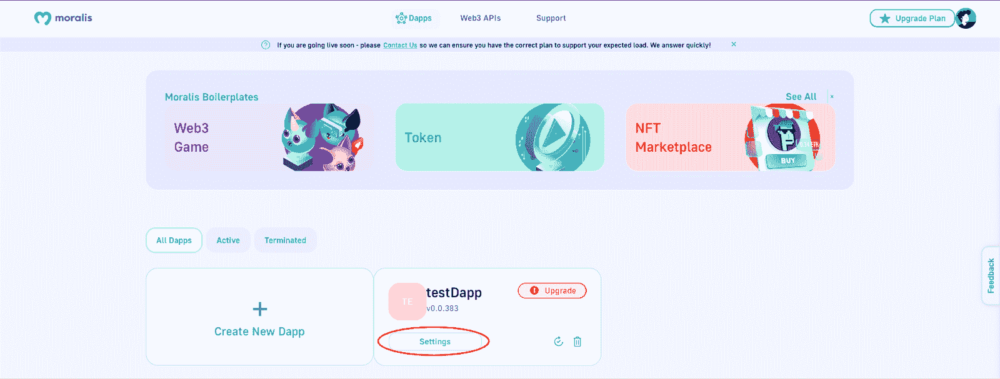

在这里，您可以点击左侧导航栏中的“同步”选项卡，然后单击“+新智能合同事件同步”继续操作:

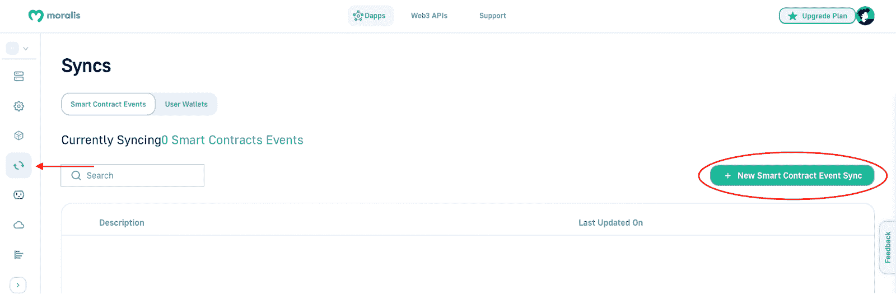

接下来，您将有四个选项。由于我们的项目与 CryptoPunks 集合相关，我们需要单击“自定义事件”选项。这将把你带到区块链同步的第二阶段或页面。

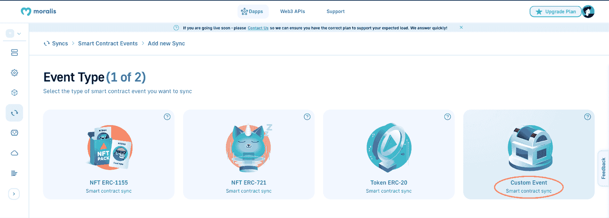

第二页，即“同步设置(第 2 页，共 2 页)”，是您需要输入与项目目标一致的具体信息的地方。因此，在我们的例子中，我们需要添加允许我们跟踪 CryptoPunks 转账的数据。然而，由于你是与 Moralis 一起工作，这个过程变得相对容易。所有你需要做的就是复制粘贴公开可用的链上数据！

## 使用公开可用的链上数据进行区块链同步

在接下来的几个小节中，我们将介绍为 crypto 朋克项目的链上事件完成区块链同步所必需的步骤。然而，这仅仅是一个示例项目。因此，在您的开发工作中应用这些知识取决于您。

如果你已经按照我们的文章，你应该在同步设置的第二部分。此外，这意味着您应该在 Moralis 管理面板的顶部有一个“地址”输入字段:

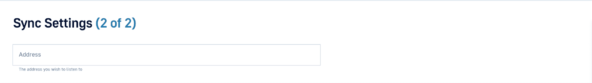

这个“地址”是一个合同地址，在这种情况下，应该与 CryptoPunks 相关。您可以使用 Etherscan 轻松获得这些信息，我们将在下一节中介绍。

### 使用以太网扫描获取合同地址

一旦打开 Etherscan，就可以使用搜索选项，输入“CryptoPunks”。此外，请确保选择“已验证”选项:

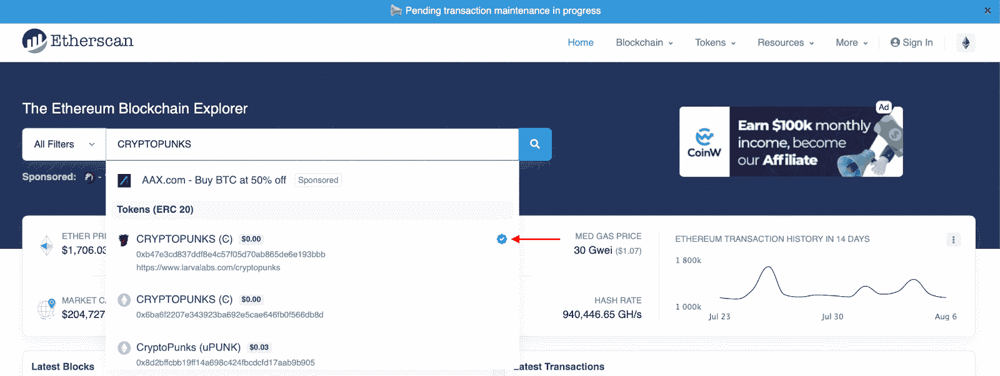

接下来，您需要点击右下角的“复制”图标来复制合同地址:

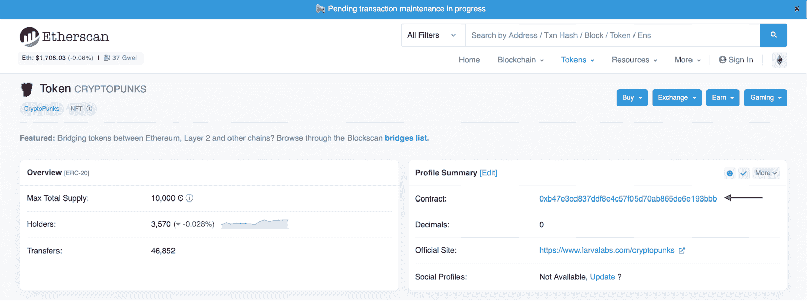

有了这些信息，下一步就是导航回 Moralis 并将地址粘贴到正确的字段中。在地址输入字段下方，您可以看到“Eth Mainnet”。这是自动选择的，因为我们在上一步设置 dapp 时选择了这个链。

有了从 crypto 朋克添加的合同地址，下一步就是找到并输入 ABI。因此，我们将在下一节更详细地探讨这个过程。

### 用以太扫描获取 ABI

我们需要获取的下一条信息是加密朋克的合同 ABI，这也可以在以太扫描上获得。要获得 ABI，您首先需要单击我们在前一阶段获取的合同地址。

从这里开始，您需要向下滚动一点。然后你会看到一个带有几个选项的水平导航栏。在不同的备选方案中，您可以通过单击“合同”选项卡继续。单击此选项卡后，您还必须确保您位于“代码”部分。

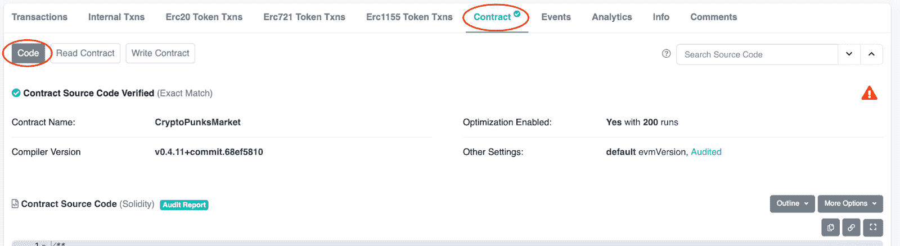

此外，您还需要向下滚动到标有“合同 ABI”的部分:

这是一个相对较长且笨重的数组；然而，我们只需要整个代码的特定部分。在我们的例子中，我们对 ABI 的“PunkTransfer”部分感兴趣。因此，您需要做的就是找到这个对象并复制它。

手头有了 ABI，您需要导航回 Moralis 并将 ABI 粘贴到适当的部分。此外，请确保在 ABI 周围包含方括号。粘贴好 ABI 后，您需要选择正确的主题。然而，在这种情况下，你只有一个选择。

### 名称、描述和历史数据

接下来，您需要命名该表，您可以随意命名。然而，在我们的例子中，我们将把表名设置为“TransferPunks”。更重要的是，你可以使用相同的名称进行描述。

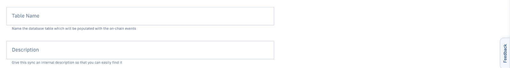

此外，正如我们之前提到的，我们希望包括历史事件。因此，我们需要启用这个选项，并输入我们想要包含的历史事件的最大数量。

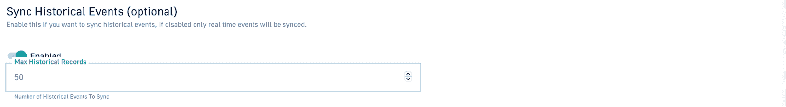

最后，我们想点击右下角的“继续”按钮。这将在你的 dapp 的“同步”设置标签中产生一个新的区块链同步元素。

现在，这就是创建一个区块链同步！让我们继续，仔细看看最终的结果，以及我们通过创建这些同步得到了什么。因此，在下一节中，我们将进一步了解区块链同步的结果。

## 区块链同步的结果

区块链同步全部建立后，您将能够查看数据库中相关事件的所有详细信息。要访问这些信息，您需要再次点击 dapp 的“设置”按钮。从那里，您需要导航到您的仪表板的选项卡，并单击“访问数据库”按钮:

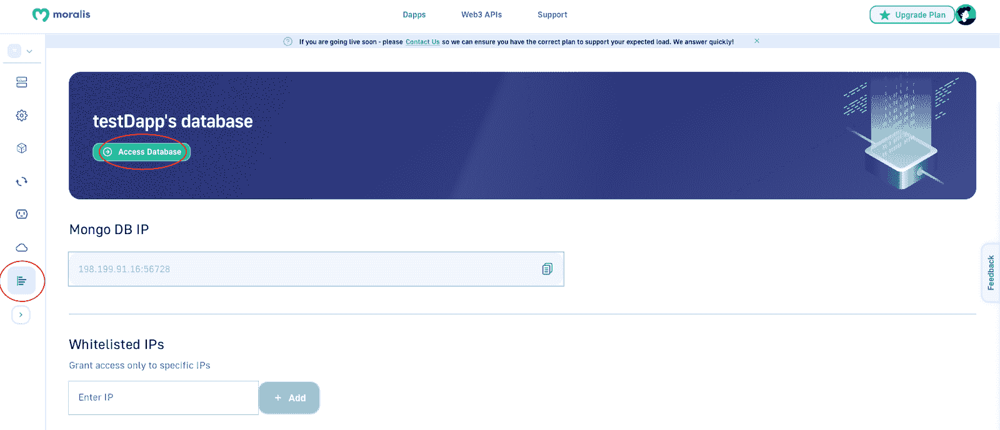

在数据库的仪表板中，您现在会看到“TransferPunks”类。这是通过你的新区块链同步自动添加的。此外，它看起来会像这样:

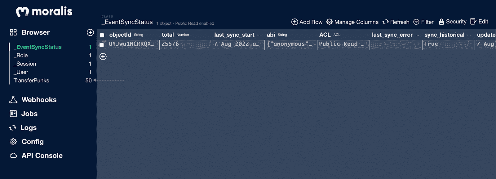

如果你更喜欢观看整个过程的视频，请查看来自 [Moralis 的 YouTube](https://www.youtube.com/channel/UCgWS9Q3P5AxCWyQLT2kQhBw) 频道的剪辑。在此视频中，我们的一名开发人员将带您更详细地了解设置您自己的区块链同步的基本步骤:

https://www.youtube.com/watch?v=LMqqxkuo7b0

## 区块链同步–总结

在本文中，您有机会了解了什么是区块链同步，以及如何自己实现它。最初，我们解释了智能合约事件的复杂性。接下来，我们展示了如何毫不费力地创建自己的区块链同步。通过这样做，我们可以创建一个简单的 dapp(分散式应用程序),为 CryptoPunks 集合获取有关传输的链上数据。因此，如果您跟随了，您现在有希望知道如何为所有未来的 Web3 项目实现您自己的区块链同步。

如果你喜欢这个指南，并发现它很有帮助，我们强烈建议你进一步探索 [Moralis 博客](https://moralis.io/blog/)。你会发现大量高质量和有趣的内容，让你成为一个更深刻的 Web3 开发者。例如，你可以了解不同的[类型的道](https://moralis.io/full-2022-guide-to-different-types-of-daos/)，如何[创建一个 NFT 糖果机](https://moralis.io/how-to-create-an-nft-candy-machine/)，或者探索[以太坊认证](https://moralis.io/sign-in-with-ethereum-ethereum-auth-guide/)。

此外，如果你想获得区块链认证，可以考虑 Moralis 学院。在那里，你会发现最令人惊叹的[区块链课程](https://academy.moralis.io/all-courses)，教你从基础到更高级技能的一切。

例如，我们强烈推荐初学者使用“[以太坊 101](https://academy.moralis.io/courses/ethereum-101) ”或“[区块链&比特币 101](https://academy.moralis.io/courses/blockchain-bitcoin-101) ”。参加这些课程将为你作为开发者打下良好的基础，并开启你的 Web3 之旅！

尽管如此，如果你有成为一名 Web3 开发者的雄心，那就马上和 Moralis 签约吧！创建一个账号只需要几秒钟，以后可以更无缝地开发 dapps。