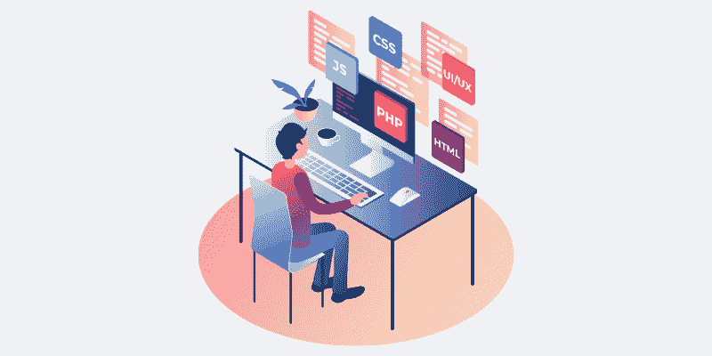
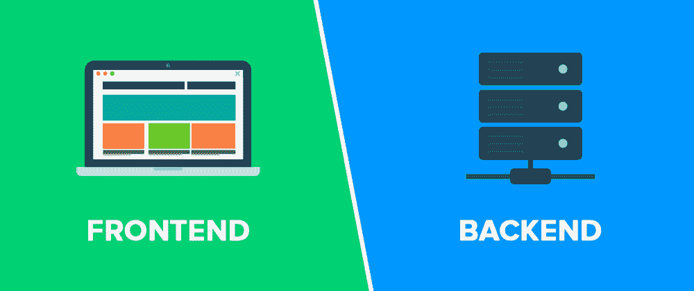
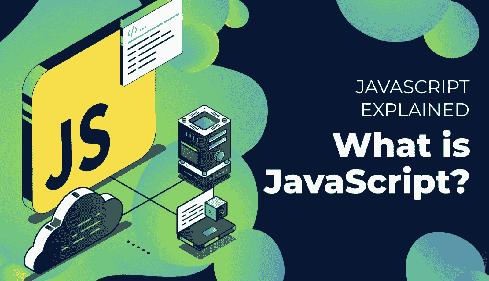
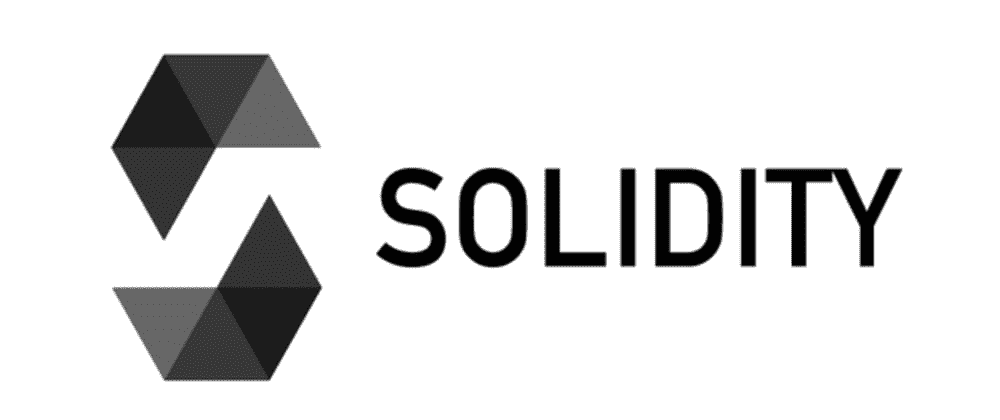
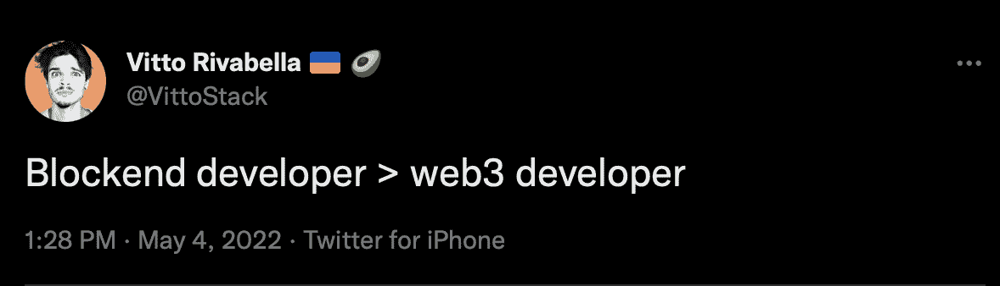
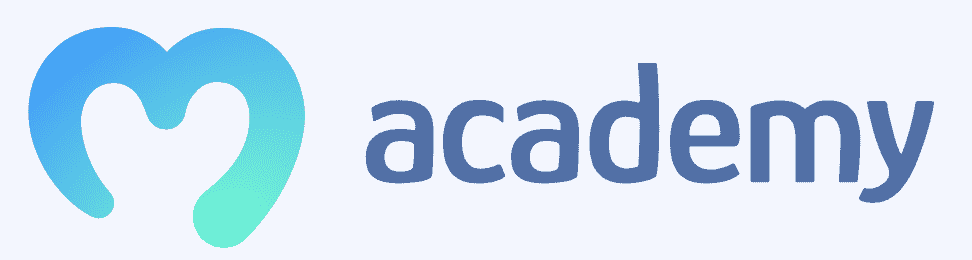

# Blockend 开发——什么是 Blockend 开发，如何成为 Blockend 开发人员？

> 原文：<https://moralis.io/blockend-development-what-is-it-and-how-to-become-a-blockend-developer/>

传统的 Web2 开发一般分为两个独立的类别:前端和后端开发。不幸的是，由于 Web2 与 [**Web3**](https://moralis.io/the-ultimate-guide-to-web3-what-is-web3/) **之间的固有差异，这两个类别并不能很好地转化为去中心化的 Web。“Web3 开发人员”和“区块链开发人员”这样的头衔通常被用来描述在该领域拥有熟练技能的人。不幸的是，这些术语不像更传统的 Web2 术语那样“响亮”。因此，最近出现了一个新术语来描述专门从事 Web3 的开发人员:“blockend 开发人员”。对于许多人来说，这可能是一个陌生的术语，我们将更深入地研究 blockend 开发以及这个概念在这里意味着什么！**

Blockend 开发一般包括三个主要领域:前端、后端和智能合约开发。为了解释什么是 blockend 开发者，我们首先需要了解前端和后端开发。此外，我们还需要在 Web3 的环境中探索这些概念。接下来，我们可以更深入地研究智能合约，这将提供 blockend 开发的完整概述。最后，我们将用一个解释术语起源的部分来结束一切！

如果你想成为一名 blockend 开发者，你就在你想去的地方！ [Moralis](https://moralis.io/) 是 blockend 开发的首要操作系统，该平台允许您轻松创建复杂的 dapps。例如，在 [Moralis 博客](https://moralis.io/blog/)学习如何创建 [Web3 Spotify](https://moralis.io/how-to-build-a-web3-spotify-clone/) 或 [Web3 Twitter](https://moralis.io/how-to-build-a-web3-twitter-clone/) 的复制品。

该平台的底层后端基础设施，以及诸如 [Moralis Speedy Nodes](https://moralis.io/speedy-nodes/) 、Moralis 的 [NFT API](https://moralis.io/ultimate-nft-api-exploring-moralis-nft-api/) 和 [Price API](https://moralis.io/introducing-the-moralis-price-api/) 等工具，可以让您平均节省 87%的开发时间。所以，如果你想拓展你的编程技能，成为一名 blockend 开发者，你的下一步就是马上创建一个 Moralis 账户！

## 什么是前端开发？

我们可以把 Web2 编程分为前端和后端开发。因此，人们通常要么做前端开发人员，要么做后端开发人员，这两个领域需要不同的技能。出于这个原因，我们将在接下来的两个部分中更多地探讨这些概念，从前者开始。那么，前端开发到底是什么？

前端开发本质上围绕着实现用户在网站或应用程序上可以看到和交互的一切。这意味着前端开发人员为所有东西编写代码，从徽标和整体布局到更多的交互式元素，如搜索栏、按钮、字段等。

前端开发者的目标是设计用户可以轻松导航的网页或应用程序。这表明用户界面(UI)设计和用户体验(UX)是前端开发的核心。如果你对 UI 设计感兴趣，我们强烈推荐你去看看 Moralis 的 [web3uikit](https://moralis.io/web3ui-kit-the-ultimate-web3-user-interface-kit/) 。这个工具包使 Web3 UI 开发变得更加容易，并允许您为潜在用户提供一个优秀的 UX。

所以，现在我们对前端开发有了更好的理解，让我们来看看成为前端开发人员需要哪些技能！

### 前端开发技能

如果你计划开发网站或网络应用程序，你必须精通 HTML、CSS 和 JavaScript。理解这些概念将使你能够处理网页或 web 应用程序的前端开发。因此，让我们更仔细地看看这三个要素是什么，以及为什么它们是必不可少的组件。

*   **HTML**–HTML 是“超文本标记语言”的缩写，程序员使用这种语言来显示和结构化一个网站的内容。这包括按钮、输入字段、搜索栏、标题等元素。
*   CSS–[CSS](https://moralis.io/cascading-style-sheets-what-is-css/)代表“级联样式表”，开发者用它来设计网页或应用程序的样式。这包括添加动画、颜色、改变布局等。，这些都是创造一个更美好的 UX 的要素。更重要的是，CSS 进一步用于创建响应式设计，这意味着创建一个在不同设备上看起来不错的网页或应用程序。此外，CSS 使开发人员更容易创建独特的设计和定制他们的产品。
*   JavaScript–[JavaScript](https://moralis.io/javascript-explained-what-is-javascript/)是最成熟的编程语言之一，主要用于 web 开发。这种语言提供了一种简单直观的方法来使网站具有交互性，因为这种语言能够改变和更新 HTML 和 CSS 元素。JavaScript 运行在 HTML 和 CSS 之上，这就是为什么它经常被称为 Web2 的第三层。学习 JavaScript 可以让您创建动态更新的内容，并使页面和应用程序更具交互性。

更重要的是，如果你有野心，例如，为其他平台开发游戏，那么 Unity 是值得一试的。Unity 让你可以轻松构建游戏应用，结合[Moralis 元宇宙 SDK](https://moralis.io/metaverse/) ，你将能够，例如，[立刻创建一个元宇宙 dapp](https://moralis.io/how-to-create-a-metaverse-dapp-with-unity/) ！

## 什么是后端开发？

随着对前端开发和必要技能的更好理解，我们可以通过下面的部分来更深入地研究后端开发。让我们继续回答这个问题，“什么是后端开发？”。

前端开发涵盖了用户可见的元素，而后端则涵盖了服务器端的逻辑和集成活动。这里的重点是脚本、数据库、网站架构、API、库等。因此，后端开发人员需要编写允许数据库和应用程序或浏览器相互通信的代码。这实质上意味着后端开发包含了网站或应用程序功能所需的所有“幕后”活动。这还包括数据库、服务器和应用程序的维护。

所以，虽然前端开发构成字体、颜色、设计等。，项目的后端部分负责从服务器渲染和从数据库获取信息。此外，后端代码包含所有需要对用户隐藏的敏感信息，例如私钥。

后端开发人员需要许多不同的技能，从数据结构和算法知识到几种编程语言、数据库管理系统、版本控制、web 托管平台等。因此，后端开发通常比前端开发更乏味。出于这个原因，将活动外包给专门从事这些类型实践的组织并使用软件使后端开发更容易进行并不罕见。这通常被称为[基础设施即服务](https://moralis.io/iaas-explained-what-is-infrastructure-as-a-service/) (IaaS)或后端即服务(BaaS)，这两种解决方案使后端开发更易于管理。

传统 Web2 开发中最常用的服务之一是 Google Firebase——后端开发软件应用程序。该软件提供了 SDK 等工具，使后端开发更加容易。

## 什么是 Blockend 开发？

随着对传统意义上的前端和后端开发有了更好的理解，我们可以继续深入了解 blockend 开发需要什么。因此，在接下来的章节中，我们将深入探讨 Web3 中前端和后端开发的不同之处。此外，我们将进一步探索在加密领域还需要哪些额外的技能，为我们解释成为 blockend 开发人员需要什么！

### Web2 vs Web3:前端

当涉及到前端开发时，Web2 和 Web3 之间所需的过程和技能没有明显的区别。因此，通常可以利用相同的技能，使前端开发人员更容易在两个空间之间转换。这意味着 Web3 前端开发需要精通 HTML、CSS 和 JavaScript。

然而，就前端开发而言，Web2 和 Web3 之间最显著的区别是 Web3.js。作为 Web3 领域的前端开发人员，了解 Web3.js 非常有益，它是 Web3 [JavaScript 库](https://moralis.io/javascript-libraries-ethers-js-vs-web3-js/)的集合。

这些库允许开发人员使用 IPC 或 HTTP 连接与远程或本地以太坊节点进行交互。因此，Web3.js 与以太坊区块链交互，并有可能检索账户，与智能合约交互，并发送交易。

### Web2 与 Web3:后端

说到后端开发，这是我们发现 Web2 和 Web3 之间最显著的不同之处。此外，从传统的角度来看，后端开发是 Web3 最麻烦的任务，需要大量的开发时间。

主要的区别来自于 Web3 的去中心化性质和空间与区块链技术的互联性。与传统的 Web2 后端开发不同，Web3 后端主要围绕 dapps 和市场的各种区块链之间的通信基础设施。建立适当的基础设施需要时间，并且对于许多从更传统的开发实践过渡过来的人来说是相当陌生的。这表明 Web3 后端开发者需要建立一些功能，例如，认证用户和获取链上用户信息。

此外，就像在 Web2 领域一样，建立后端基础设施既困难又耗时。因此，这就是 Moralis 进入画面！Moralis 操作系统提供了一个已经开发的、可无限扩展的后端基础设施，让您可以避免“重新发明轮子”。这意味着您可以利用 Moralis 的 SDK 来获取信息，同步智能合同等。，轻松与各种网络通信。此外，该平台进一步提供了一些非凡的工具和集成，如对 [IPFS](https://moralis.io/what-is-ipfs-interplanetary-file-system/) 和[元掩码](https://moralis.io/metamask-explained-what-is-metamask/)的原生支持。

如果你想成为一名 blockend 开发者，注册 Moralis 来获得 Moralis 的好处！

现在，我们对 Web2 和 Web3 之间的前端和后端开发有了更好的理解，我们需要密切关注构建 Web3 应用程序所需的最后一个组件，即智能合约。

## 什么是 Blockend 开发？–智能合同

blockend 开发的一个重要部分是[智能合约](https://moralis.io/smart-contracts-explained-what-are-smart-contracts/)，这对 Web3 的 dapps 至关重要。描述智能合同的一个很好的类比是数字自动售货机。这样，有人可以输入资金；然后，契约决定输入是否足够，如果足够，就像自动售货机一样执行一个功能。正是这种技术在一定程度上允许创建复杂的 dapps，其中代码在区块链上协调交互。

首先，开发者使用[可靠性](https://moralis.io/solidity-explained-what-is-solidity/)来开发智能合同。此外，Solidity 是一种面向对象的编程语言，用于编写与 T2 和 EVM 兼容的合同。此外，智能合约开发的其他有用工具还有 [Ganache](https://moralis.io/ganache-explained-what-is-ganache-blockchain/) 、 [Truffle](https://moralis.io/truffle-explained-what-is-the-truffle-suite/) 和 Remix。如果您想了解有关智能合同开发的更多信息，请点击下面的链接[如何创建智能合同](https://moralis.io/how-to-create-smart-contracts/)，深入了解该流程的复杂性。

总而言之，blockend 开发需要前端、后端和智能合约开发。这表明 blockend 开发者有足够的技能通过管理链上和智能合约开发来为 Web3 领域开发 dapps。因此，blockend 开发本质上是一种封装了为去中心化 web 构建 dapps 和项目所需的一切的类别！

通过选择利用 Moralis，您可以将大部分注意力放在前端和智能合同开发上，因为 Moralis 管理后端方面。所以，如果你想成为一名 blockend 开发者，你必须了解 HTML、CSS、JavaScript、Web3.js，还有，你要学习 Solidity 或者另一种智能合约编程语言，你就万事俱备了！

学习 blockend 开发最好的地方是 Moralis Academy。学院提供市场上最好的区块链课程！不管你是编程新手还是有 Web2 或 Web3 的经验！

## 发展受阻的词源

现在我们已经更好地理解了 blockend 开发需要什么以及成为一名 blockend 开发人员所必需的技能，我们将进一步了解这个短语的词源。正如前面几节所解释的，为 Web2 和 Web3 开发有着内在的区别。因此，需要区分在这些空间内运营的开发人员。传统上，人们使用“Web3 开发者”或“区块链开发者”；然而，它没有“前端开发人员”和“后端开发人员”那么响亮。

然而，5 月 4 日， [Vito Rivabella 在一条推文中创造了术语](https://twitter.com/VittoStack/status/1521813974181941248)“blockend 开发者”。这个短语已经获得了描述那些使用智能合同和构建 Web3 项目的人的牵引力。所以，如果你将来偶然发现这个术语，你会知道它指的是精通 Web3 的开发者！

## 什么是 Blockend 开发？–总结

常规开发通常包括两个主要类别:前端和后端开发。精通这些领域的人通常被称为“前端”或“后端开发人员”。然而，这些标签或类别并没有充分涵盖为分散式网络开发 dapps 或项目所需的技能。

精通 Web3 的开发者以前被称为“Web3 开发者”或“区块链开发者”；然而，这些术语并没有流行起来。因此，最近引入了一个越来越受欢迎的新术语:“blockend developer”。

Blockend 开发是指从构思到在区块链上启动一个项目所需的一切。因此，它涉及前端、后端和智能合同开发。此外，从传统的角度来看，后端开发通常是 Web3 中最大的障碍。为了解决这个问题，出现了 Moralis 等 IaaS 平台，使 blockend 开发更容易实现。Moralis 负责 blockend 开发的后端方面，让您专注于前端和智能合约！

如果你想成为 blockend 开发者，你应该去看看 [Moralis Academy](https://academy.moralis.io/) 。该学院提供各种[区块链课程](https://academy.moralis.io/all-courses)，涵盖成为一名完全成熟的 blockend 开发者的所有方面。比如参加 [JavaScript 编程 101](https://academy.moralis.io/courses/javascript-programming-for-blockchain-developers) 更精通 Web3 前端开发，参加[以太坊智能合约编程 101](https://academy.moralis.io/courses/ethereum-smart-contract-programming-101/) 了解更多智能合约！

此外，在 Moralis，您可以获得 blockend 开发所需的一切。因此，如果你[与 Moralis](https://admin.moralis.io/register) 签约，你就可以[轻松构建 dapps](https://moralis.io/how-to-build-decentralized-apps-dapps-quickly-and-easily/) 和其他 Web3 项目。事实上，加入该平台可以让您为所有未来项目节省平均 87%的开发时间！