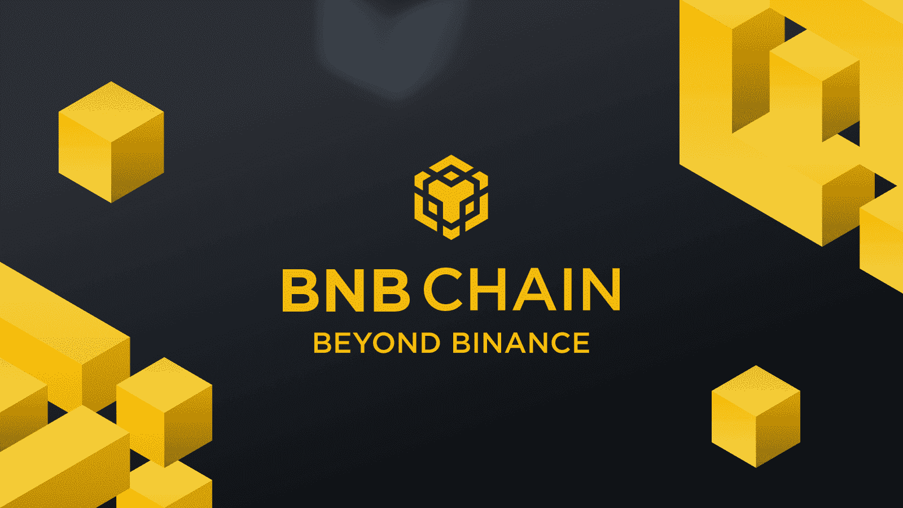
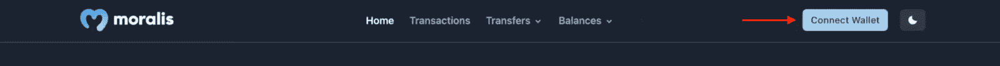
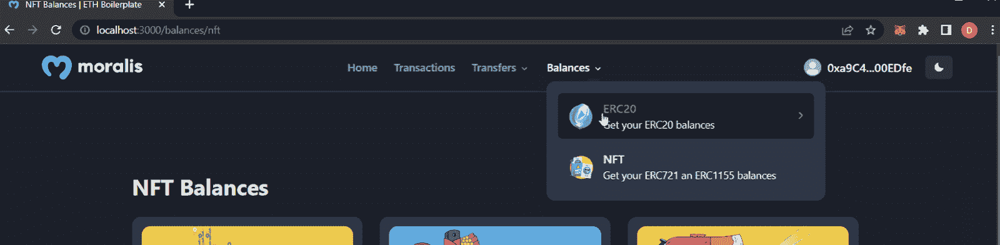
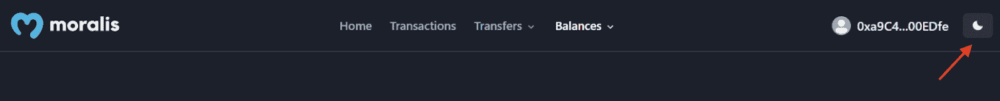
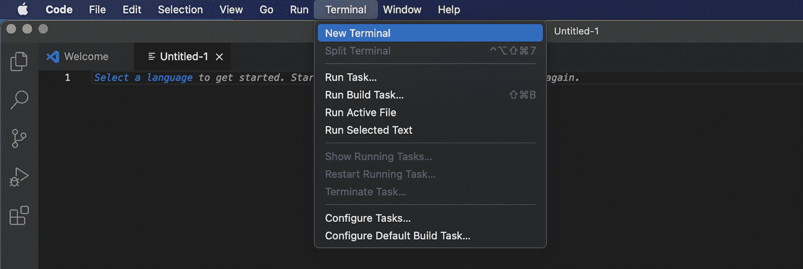

# BNB 连锁样板——如何建立 BNB 连锁超市

> 原文：<https://moralis.io/bnb-chain-boilerplate-how-to-build-bnb-chain-dapps/>

如果你正在阅读这篇文章，你可能正在寻找建立 BNB 链 dapps。你知道吗 [Moralis](https://moralis.io/) 为[创建 Web3 dapp](https://moralis.io/how-to-create-a-web3-dapp-in-3-steps/) 提供了最快最简单的方法？如果你想了解更多这方面的知识，请继续阅读，因为我们将说明如何在几分钟内建立一个 BNB 连锁 dapp 使用 Moralis 的 BNB 连锁样板！此外，如果您想跳过教程并立即检查项目，您可以使用下面的链接直接进入代码:

**完整的 BNB 连锁样板文件——**[**https://github . com/以太坊-样板/以太坊-样板**](https://github.com/ethereum-boilerplate/ethereum-boilerplate)

如果你点击上面的链接，你会注意到这个库叫做“以太坊-样板”。这可能会令人困惑，因为你正在寻找创造 BNB 链 dapps。然而，不用担心；Moralis 的以太坊样板是 EVM 兼容的，这意味着它同样适用于创建 BNB 连锁 dapps。

BNB 链样板——结合各种其他开发工具——使得在瞬间构建 BNB 链 dapps 成为可能。最明显的例子是 Moralis 的企业级[Web3 API](https://moralis.io/web3-apis-exploring-the-top-5-blockchain-apis/)，让你在任何 web 3 项目上节省宝贵的资源和时间。例如，看看 [Web3 Streams](https://moralis.io/streams/) API，它允许你将重要的区块链数据传输到你所有项目的后端！

所以，如果你有雄心使用 BNB 连锁店样板创建 BNB 连锁店 dapps，现在就向 Moralis 注册吧！您可以完全免费设置您的帐户，并立即获得各种 Moralis 工具，从而促进更无缝的开发人员体验。

## 什么是 BNB 链？

今年早些时候，币安决定将其区块链网络更名为“BNB 链”。更名的原因之一是强调生态系统的两个链的互操作性和 BNB(“建设和建设”)标志，同时使网络远离币安的品牌。这一决定背后的动机是 BNB 不仅仅是币安。因此，token 与 BNB 连锁店结合，现在是一个独立的生态系统，走的是一条与币安不同的路线。



此外，BNB 连锁店由两个连锁店组成:BNB 灯塔连锁店和 BNB 智能连锁店。更名之前，这两个区块链被命名为币安链和币安智能链。然而，BNB 链生态系统仍然由两个相互平行的区块链组成。

第一个是 BNB 信标链，其主要目的是处理和验证 BNB 链网络中的分散事务。该链被设计为承载网络的本地 BNB 令牌。然而，BNB 灯塔连锁店没有智能合同，这限制了生态系统，并导致了另一个连锁店的发展:BNB 智能链。

BNB 智能链以智能合约为特色，与 BNB 灯塔链并行。然而，即使它们并行运行，它们仍然是分离的。因此，这表明它们可以独立工作，例如，如果其中一个链离线。此外，BNB 链是 EVM 兼容的，这意味着 BNB 链的开发非常类似于以太坊区块链。因此，如果你有以太坊开发的经验，你可以很快为 BNB 连锁生态系统开发 dapps。

对 BNB 链有了更深刻的理解后，现在是时候仔细看看 BNB 链样板文件了，它展示了构建 Web3 应用程序的最快方式！

## BNB 连锁样板——打造 BNB 连锁超市的最快方法

在探索构建 BNB 连锁 dapp 的最简单方法之前，我们将仔细看看 Moralis 的 BNB 连锁样板文件。这将让你了解样板文件的功能以及你正在努力的方向。然而，这是 BNB 连锁样板文件的登录页面:


您首先会注意到的是应用程序顶部的一个导航栏。该栏具有“交易”、“转账”、“余额”等标签。然而，如果你立即点击这些标签中的一个，你就没那么幸运了。相反，您需要首先通过点击“连接钱包”按钮来验证您的 [Web3 身份](https://moralis.io/web3-identity-the-full-guide-to-authentication-identity-and-web3/):



点击此按钮将提示您的元掩码钱包，允许您签署消息。一旦消息被签名，它将自动用关于你的 Web3 钱包的信息填充 BNB 链样板文件的各个标签。因此，例如，如果您点击“交易”选项卡，您将看到一个显示您的交易历史的表格:


此外，如果你点击其他标签，你可以在“ERC-20”和“NFTs”之间进行筛选。此外，如果您选择“balances”选项卡，它将如下所示:



例如，如果你从那里点击“NFTs”选项，dapp 将整齐地显示你的所有 NFTs:


此外，BNB 链样板文件的一个附加特性是亮/暗模式。要在这两者之间切换，您可以使用最右边的按钮:



这基本上涵盖了模板的主要特性。因此，BNB 链样板为您未来的任何项目提供了一个极好的基础，它具有诸如 [Web3 认证](https://moralis.io/authentication/)，获取[链上数据](https://moralis.io/on-chain-data-the-ultimate-guide-to-understanding-and-accessing-on-chain-data/)等特性。您所要做的就是定制模板，以满足您的客户/用户的需求！

## 用 BNB 链样板建立 Dapps 三步分解

现在你已经知道了 Moralis 的 BNB 连锁样板是如何工作的，以及你的目标是什么，我们将直接进入创建一个 BNB 连锁 dapp！因为您将使用 BNB 链样板文件，所以只需三个步骤就可以创建 dapp:

1.  克隆 BNB 链样板文件
2.  环境变量配置
3.  启动 Dapp

遵循这些步骤将让你在几分钟内创建一个 dapp！然而，如果你更多的是视频学习者，你也可以看看下面的教程。在下面的片段中，Moralis 的一名开发人员以视频格式提供了整个过程的完整分解:

https://www.youtube.com/watch?v=Bb5Pc–kyAY

尽管如此，您还可以在这里加入我们，因为我们将提供每个步骤的完整演练。所以，事不宜迟，让我们直接进入第一步，演示如何将 BNB 链样板文件克隆到您的本地目录中！

### 步骤 1:克隆 BNB 链样板文件

要克隆 BNB 链样板文件，首先需要为项目创建一个文件夹，并打开一个 IDE(集成开发环境)。本教程我们使用 VSC (Visual Studio 代码);然而，你可以选择任何你喜欢的环境。此外，请注意，如果不使用 VSC，该过程可能会有所不同。

随着 IDE 的启动和项目文件夹的使用，下一步是打开一个新的终端。如果您使用的是 VSC，您可以点击顶部的“终端”，然后点击“新终端”:



接下来，访问 GitHub 库，获取 BNB 链样板文件。你会在简介里找到回购的链接。一旦你点击链接，你必须复制回购网址。您可以点击“代码”按钮并复制 URL:


从那里，您可以通过在终端中输入以下命令来克隆模板(确保您在项目的文件夹中运行该命令):

```js
git clone “BOILERPLATE_URL”
```

接下来，您可以使用以下命令导航到正确的文件夹:

```js
cd ethereum-boilerplate
```

如果您在合适的位置输入了所有正确的命令，那么现在您的本地目录中应该有一个 BNB 链样板文件。因此，它应该是这样的:


### 步骤 2:环境变量配置

接下来，将“. env.local.example”重命名为“. env.local”并打开该文件。这应该是文件的原始内容:

```js
APP_CHAIN_ID=0x1
APP_DOMAIN=ethereum.boilerplate 
MORALIS_API_KEY= # Get your KEY https://admin.moralis.io/account/profile
NEXTAUTH_SECRET= # Linux: `openssl rand -hex 32` or go to https://generate-secret.now.sh/64
NEXTAUTH_URL=http://localhost:3000 # replace for production
```

如上面的代码片段所示，总共有五个环境变量。我们将逐一介绍，并向您展示正确的配置。所以，我们先从“ *APP_CHAIN_ID* ”开始，初始设置为“ *0x1* ”。这是以太坊网络的链 ID，当你想创建一个 BNB 链应用程序时，你需要修改这个值。因此，将“ *0x1* ”改为“ *0x38* ”，与 BNB 链 mainnet 相对应。

第二个变量是“*APP _ DOMAIN*”；你可以让这个保持原样。第三个变量是“ *MORALIS_API_KEY* ”，目前没有值。因此，您将需要自己的 API 密钥，并且要获得该密钥，您将需要一个 Moralis 帐户。因此，如果你还没有，现在就创建你的 Moralis 帐户并登录。登录后，导航到“Account”选项卡，单击“Keys ”,然后复制 Web3 API 密钥:


您必须将其粘贴到代码中，并确保“ *MORALIS_API_KEY* ”等于该值。第四个变量是“ *NEXTAUTH_SECRET* ”，您需要向其中添加一个密钥。您可以使用以下链接生成您需要输入到代码中的值:“【https://generate-secret.now.sh/32】[”。](https://generate-secret.now.sh/32)

最后一个变量是“ *NEXTAUTH_URL* ”，初始设置为“ *http://localhost:3000* ”。这是可行的，因为我们还处于开发阶段。因此，您可以在本地主机上测试应用程序。但是，当您启动 dapp 时，这需要等于 dapp 的域。

下面是最终的" . env.local "代码的示例:

```js
APP_CHAIN_ID=0x38
APP_DOMAIN=ethereum.boilerplate 
MORALIS_API_KEY= "YOUR_API_KEY"
NEXTAUTH_SECRET= b8e786967d7bcbc0f920d35bcc3f891c
NEXTAUTH_URL=http://localhost:3000
```

### 步骤 3:启动 Dapp

所有的配置都最终形成了 BNB 链样板，您几乎已经完成了所有的工作，并准备好测试 dapp 了。但是，在这样做之前，您需要安装一些依赖项。为此，使用以下任一命令输入终端(取决于您使用的是“ *yarn* 还是“ *npm* ”):

```js
npm i
yarn
```

一旦安装了所有依赖项，您就可以通过在终端中输入以下命令来运行应用程序:

```js
npm run dev
yarn run dev
```

这将在本地主机上运行应用程序，允许您使用您在前面的步骤中指定的 URL 来启动应用程序:“ [http://localhost:3000](http://localhost:3000/) ”。*T3】*

现在你完成了！您已经使用 Moralis 的 BNB 连锁样板成功创建了一个 dapp。剩下的工作就是通过添加或删除功能来定制模板，使其适合您的客户群！

例如，如果您想添加额外的认证机制，您可以在 Moralis 找到一些优秀的指南。如果您对此感兴趣，请学习如何[使用 RainbowKit 添加登录功能](https://moralis.io/how-to-add-a-sign-in-with-rainbowkit-to-your-project-in-5-steps/)或[添加比特币基地钱包登录功能](https://moralis.io/how-to-add-coinbase-wallet-login-functionality/)！

## 总结-BNB 连锁样板文件

在本文中，我们展示了如何使用 Moralis 的 BNB 链样板文件创建 BNB 链 dapp。多亏了这个" [Web3 模板](https://moralis.io/web3-template-build-a-dapp-using-a-web3-website-template/)，您只需三个步骤就能创建一个简单的 dapp:

1.  克隆 BNB 链样板文件
2.  环境变量配置
3.  启动 Dapp

按照上面的步骤，您创建了一个 dapp，用户可以用他们的 Web3 钱包登录。一旦通过身份验证，他们就可以浏览 dapp 的各个选项卡，找到与他们的 Web3 钱包相关的信息。例如，用户可以点击一个标签，在一个整洁的表格中显示他们的交易历史！

如果你觉得这篇文章有帮助，仔细看看 Moralis 的 [Web3 博客](https://moralis.io/blog/)上的一些附加内容。例如，学习如何[用 Web3](https://moralis.io/how-to-connect-playfab-with-web3-using-azure-functions/) 连接到 PlayFab 或者[创建自己的索拉纳·NFT](https://moralis.io/solana-nft-mint-tools-create-your-own-solana-nft/)。此外，如果你想为其他网络开发 dapps，我们还有一些其他指南。例如，学习如何[建立一个以太坊 dapp](https://moralis.io/full-guide-how-to-build-an-ethereum-dapp-in-5-steps/) 或者建立并[连接一个 dapp 到多边形](https://moralis.io/tutorial-how-to-connect-a-dapp-to-polygon-network/)！

此外，如果你是区块链发展的新手，我们建议你去看看[Moralis 学院](https://academy.moralis.io/)。该学院为新的和有经验的开发人员提供一些最复杂的区块链课程。如果你想学习基础知识，可以看看下面的课程:“[以太坊基础 101](https://academy.moralis.io/courses/ethereum-101) ”。开始您的 Web3 开发之旅，立即成为区块链认证！

然而，如果你想建立任何类型的 dapp，[注册 Moralis](https://admin.moralis.io/register) ！Moralis 的工具大大提高了开发体验的可访问性，这使得您可以为任何进一步的 Web3 项目节省宝贵的时间和资源。更重要的是，创建你自己的 Moralis 账户是完全免费的，所以你不会有任何损失！