# BSC 编程指南——10 分钟币安智能链开发简介

> 原文：<https://moralis.io/bsc-programming-guide-intro-to-binance-smart-chain-development-in-10-minutes/>

**无论你是初学者还是经验丰富的区块链开发人员，币安智能链开发综合指南对构建 BSC 至关重要..此外，了解 BSC 开发是在该领域推进职业发展的先决条件。** **当以太坊及其生态系统保持其作为大多数** [**dApps**](https://moralis.io/decentralized-applications-explained-what-are-dapps/) **(去中心化应用)的领先环境的地位时，其他区块链正在快速追赶。** **特别是有一种链条一直很受欢迎——币安智能链条(BSC)。** **BSC 相对于以太坊的主要优势在于，尽管以太坊的燃气费非常高，但 BSC 提供的费用较低，这使得 BSC 对普通用户来说更实惠且更具吸引力。** **因此，学习 BSC 编程并将其添加到您的区块链开发库中是有意义的。此外，没有比这篇文章更好的起点了，在这里我们用十分钟解释币安智能连锁的发展！**

在我们继续之前，我们想向您介绍一下 Moralis，它将加速您的 Web3 开发过程。无论你是 [创造令牌](https://moralis.io/how-to-create-a-bsc-token-in-5-steps/) ， [NFTs](https://moralis.io/non-fungible-tokens-explained-what-are-nfts/) ，还是 dApps， [Moralis 家](https://moralis.io/) 都有你罩着。这个强大的 Web3 开发平台使您能够将注意力放在项目的前端，而它负责后端的繁重工作。Moralis 支持多个链，BSC 就是其中之一。因此，我们将在本文中使用 Moralis 进行币安智能连锁开发。更棒的是，Moralis 完全免费。 [创建您的账户](https://admin.moralis.io/register) ，从今天开始快速轻松地开发吧！

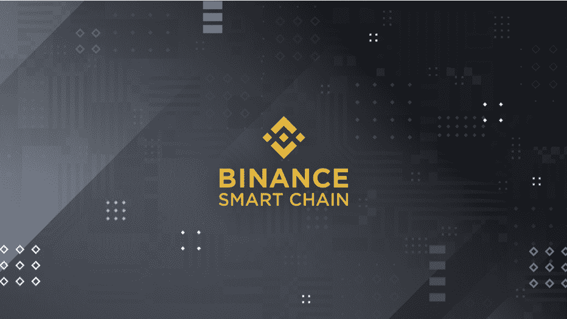

# 开始 BSC 编程之旅

如前所述，这篇文章是您开始 BSC 编程之旅的绝佳资源。我们将从基础开始，慢慢地转移到一些实际的币安智能链开发的例子，这将告诉你，开发可以很容易，如果利用 Moralis。此外，当您决定进行 BSC 编程的下一步时，这将对您非常有用。

在阅读这篇文章时，我们建议你做一些笔记，最重要的是，在你写完文章后采取行动。现在是全职加密的时候了，通过让 Moralis 指导你完成这一旅程，你已经拥有了优势。所以，我们开始吧！

### 币安智能连锁发展介绍

币安智能连锁店于 2020 年首次创建，并立即获得了巨大的知名度。当然，由于它得到了领先的集中交易市场之一币安的支持，这并不令人意外。然而，引起许多开发者注意的是 BSC 相对于以太坊的低费用。

BSC 的主要目标是获得比以太坊更快的吞吐量和更低的费用，同时也让新开发者的加入变得更容易。此外，他们决定聪明地对待他们的方法，而不是从头开始建立一个全新的链，他们分叉了“去以太坊”【Geth】协议。因此，BSC 与以太坊区块链有许多相似之处。这加快了过程，因为他们只需要进行必要的调整来满足他们的目标。

分叉以太坊的决定确保了该链开发人员使用的现有工具也适用于 BSC 编程。这包括访问(以太坊虚拟机)，使用编程语言如[Solidity](https://moralis.io/solidity-explained-what-is-solidity/)和 Vyper，以及其他工具，如[【meta mask】](https://moralis.io/metamask-explained-what-is-metamask/)。通过这一举措，所有对节省费用感兴趣的以太坊开发者都能够在没有任何开销的情况下进行过渡。

让我们快速提一下区块链三难困境，即安全性、可伸缩性和去中心化。不幸的是，还不可能以一种顶级的方式涵盖所有这三个方面。因此，他们中的一个必须被稍微牺牲。在 BSC 案例中，币安开发人员决定牺牲分散性，专注于安全性和可伸缩性。此外，他们还从工作证明(PoW，也称为采矿)转向利益证明(PoS)权威模型，在这种模型中，本地硬币被赌以确保安全。后者被证明是一个明智的举动，因为现在，以太坊也在为同样的转变做准备。

## 学习 BSC 编程

因为我们相信学习任何类型的编程的最好方法是尽可能快地展示真实的例子，我们将用 BSC 编程来做同样的事情。如前所述，我们将使用 Moralis 使这个过程尽可能简单和容易。我们建议您先阅读这篇文章，然后进行第二次阅读，在第二次阅读中，您可以尝试实现所有步骤。这样，您将更好地学习 BSC 编程的基础知识。

在接下来的小节中，我们将介绍一个基于 BSC 的项目，该项目将包含几个非常重要的功能，包括 onboarding、 [【元掩码认证】](https://moralis.io/how-to-authenticate-with-metamask/) 、获取可替换令牌和 NFT 的用户余额，以及向我们的 BSC dApp 显示用户的交易历史。我们将从头开始构建这一切。虽然这听起来可能很多，但你会惊讶地发现，通过使用 Moralis，上述所有内容都不是一项繁琐的任务。此外，我们确保下面的例子是完全初学者也能做到的。

*请注意——下面图片中使用和显示的所有代码都可以在*[*GitHub*](https://github.com/DanielMoralisSamples/20_BSC_Development_Intro)*上访问。T13】*

### BSC 编程–HTML 部分

HTML 是设计用于在网络浏览器中显示的文档的基本编程语言，也用于 Web3 应用程序(结合 [CSS](https://moralis.io/cascading-style-sheets-what-is-css/) 和[JavaScript](https://moralis.io/javascript-explained-what-is-javascript/))。我们将从一个包含所有必要部分的基本 HTML 模板开始:

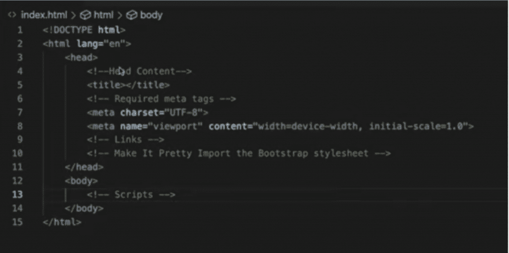

随着我们的继续，我们将对模板进行一些简单的修改，首先在<标题>和</标题>标签之间添加标题。让我们以“我的第一个 BSC dApp”为标题，然后继续讨论正文，在这里我们开始添加元掩码认证所需的代码。我们首先创建< main >和< /main >标签，然后在其中添加以下代码:

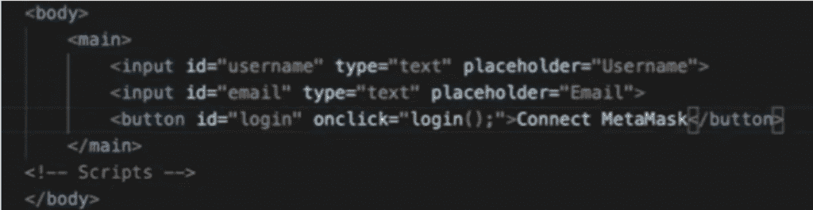

这是非常基本的输入，因为我们想让它看起来更好，我们添加了一个“h1”标题、多个< div > < /div >标签和一些样式。为了使样式化成为可能，我们还添加了一行代码来导入引导样式表。完成上述操作后，我们有了一个类似这样的代码:

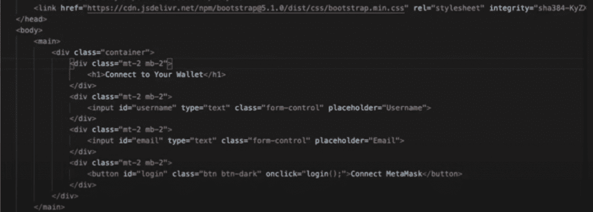

*请记住，这些是截图，有些线条可能看不到。要访问完整的代码，请使用上面提供的 GitHub 链接。T3】*

对于上一张图片顶部显示的“style”链接，我们还需要添加如下所示的“script src”代码行。

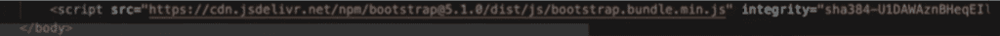

### BSC 编程–逻辑

有了上面的 HTML 代码，我们就有了一个相当不错的网站。这是用户将与之交互的界面。现在是时候给我们的项目添加逻辑了。为此，我们将使用 Moralis 和 JavaScript。

如果您已经创建了免费的 Moralis 帐户，请登录。否则，直接去[moralis . io](http://moralis.io/)报名吧。登录后，选择左侧的“服务器”选项卡。接下来，单击右上角的“+创建新服务器”按钮，然后从下拉菜单中选择“Testnet 服务器”选项。将出现一个弹出窗口，我们需要命名服务器，选择一个区域、网络和链类型。出于本文的目的，选择“BSC (Testnet)”链选项。然后单击“添加实例”按钮。请记住，服务器启动可能需要几分钟时间。

在我们开始处理 JavaScript logic.js 文件之前，我们需要将一些额外的库导入我们的 index.html 文件:

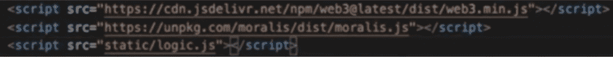T2】

接下来，我们开始将下面的代码输入(或粘贴)到 logic.js 文件中。上面部分显示了服务器 URL，它是通过单击“我的第一个 BSC dApp”服务器标题旁边的“查看详细信息”按钮，从我们的 Moralis 管理面板(我们创建新服务器的地方)获得的。然后我们复制并粘贴细节。这里需要注意的是，您需要使用自己在 Moralis 上创建的服务器，而不是使用与下面代码中完全相同的服务器细节:

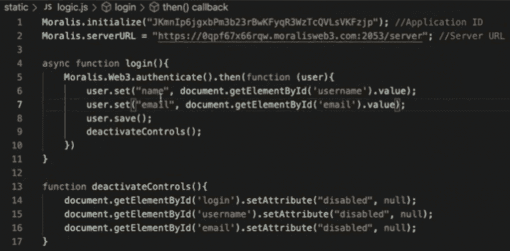T2】

#### **登录功能**

查看上图中的代码，您可以看到我们使用了一个“登录”功能来获取用户信息，然后将这些信息存储在您的 Moralis 数据库中。此外，另一个功能用于在输入详细信息后禁用控件。您可以看到，Moralis 使得用简单的代码行完成事情成为可能。

此时，我们能够捕获用户的详细信息，并让他们连接他们的元掩码。此外，我们可以在我们的 Moralis 仪表板中访问他们的详细信息。此外，查看 Moralis dashboard 侧栏(见下图)，您可以看到我们将使用一些部分来完成我们的 BSC 编程示例项目。其中包括“BscTokenBalance”、“BscNFTTransfers”和“BscTransactions”。为了利用这些，我们必须在 index.html 和 logic.js 文件中添加一行代码来完成这个过程。

### 币安智能链开发–BSC 令牌和 NFT 余额

为了确保用户可以看到他们的余额，我们需要更新我们的 HTML 代码。添加以下几行:

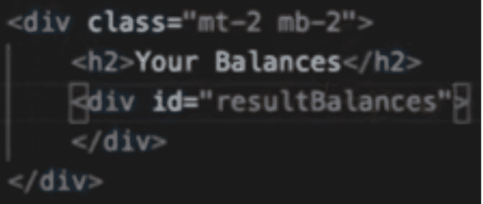

以上代码用于代币余额，NFT 余额的代码如下:

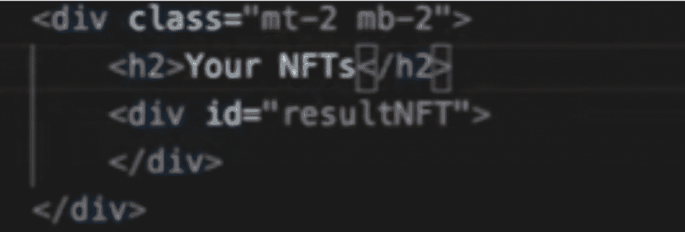

然后，我们转到 logic.js 文件，添加几行代码来创建一个显示余额的表格。此外，我们相应地添加构建表的逻辑，然后使用 Moralis 对象填充它。确切的代码行如下:

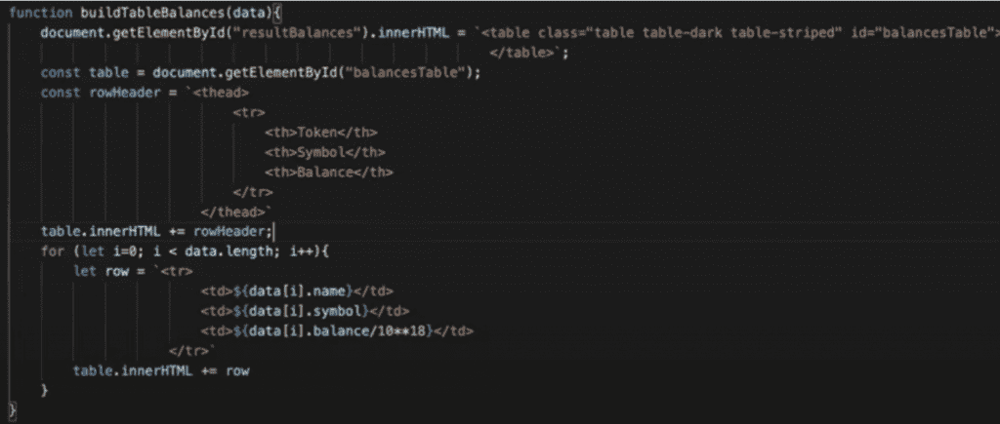T2】

上面几行代码是针对代币余额的。因此，我们也需要为 NFTs 添加代码。请记住，为了避免增加复杂性，我们不会在我们的 BSC 编程示例项目中显示 NFTs 的图形。以下是攻击 NFT 天平的逻辑代码:

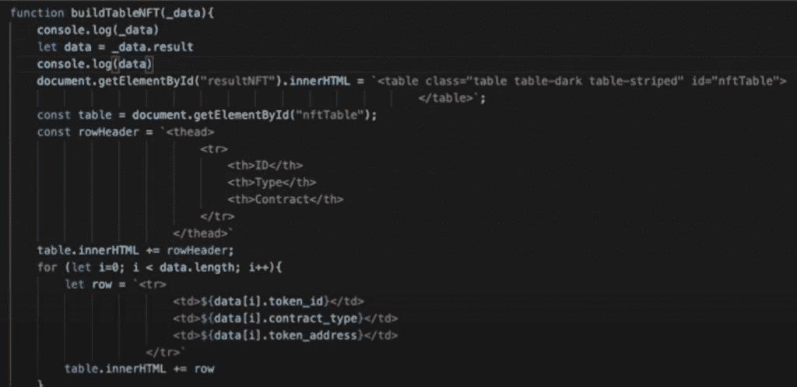T2】

除了上面的代码，我们需要确保当用户点击我们界面页面上的按钮时，表格填充被执行。我们添加了“populate()；”并创建一个额外的“填充”函数。同样，这也是 Moralis 让事情变得极其简单的地方，因为它为我们提供了简短的代码片段:

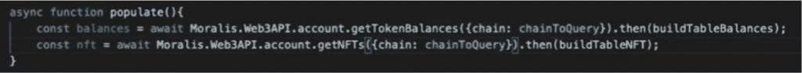

### 币安智能连锁发展-展示交易

像以前一样，我们必须在 index.html 文件中添加一行特定的代码，以确保交易能够显示。后者是通过下面几行代码实现的:

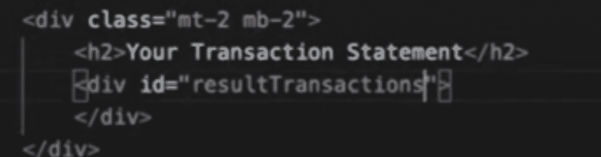

接下来，我们需要相应地更新我们的 logic.js 文件。同样，我们将使用另一个“buildTable”函数。以下是交易代码:

最后一步，我们需要更新“填充”功能。下面是这些函数的代码在我们加入交易行后的样子:

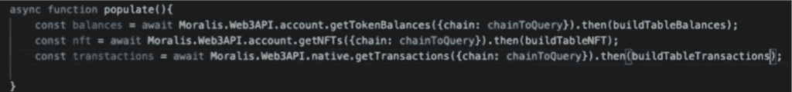

### 我们币安智能连锁发展实例成果

为了帮助您了解我们使用上一节给出的代码行创建了什么，让我们来看看结果。在下图中，您可以看到显示 BSC 令牌和 NFT 余额以及交易的网络浏览器截图。所有这些都是基于用户在输入信息后点击“连接元掩码”按钮。很漂亮，对吧？

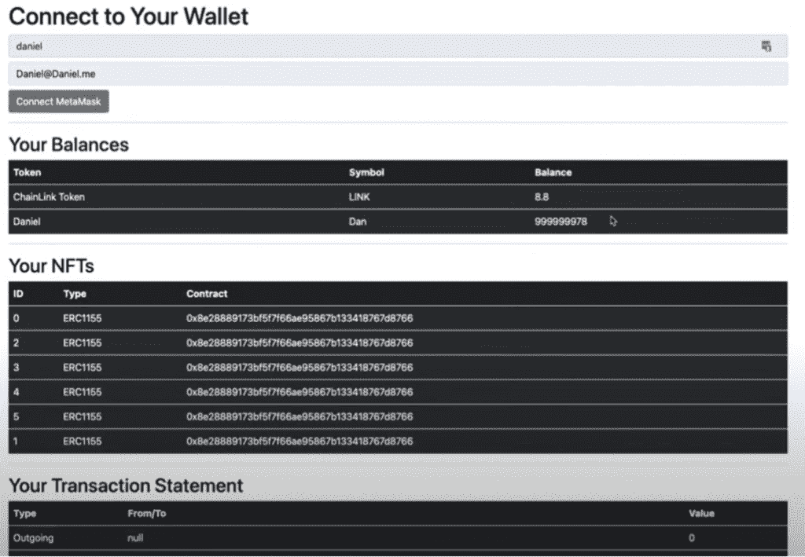

## BSC 编程指南——10 分钟币安智能链开发简介——摘要

首先，让我们祝贺您完成本指南。如果您遵循了上面的所有步骤，您现在知道如何使用 HTML、JavaScript 和 Moralis 的基础知识来创建一个简单而有效的 Web3 应用程序。我们希望您已经密切关注了细节，并能够注意到 Moralis 的力量，它使我们能够使用非常短的代码片段来实现令牌和 NFT 余额以及交易。如果您想通过观看视频来遵循上述每个步骤，请确保 [遵循此链接](https://www.youtube.com/watch?v=_4kCcGvfxaE) 。

如前所述，这些是 BSC 编程的简单和基本示例。然而，毫无疑问，这是您开始币安智能连锁发展之旅的好地方。如果您有兴趣扩展您的 BSC 编程技能并拓宽您的视野，请务必查看我们博客上的以下文章:“ [如何在不到 20 分钟的时间内创建 BSC NFT](https://moralis.io/how-to-create-a-bsc-nft-in-less-than-20-minutes/)”、“ [如何快速创建 BSC dapp](https://moralis.io/how-to-create-bsc-dapps-quickly/)”以及“ [如何轻松构建 BSC dapp](https://moralis.io/how-to-build-bsc-dapps-easily/)”。

此外，如果你还没有创建你的 Moralis 家账户，我们建议你查看一下 [Moralis 家文档](https://docs.moralis.io/) 。与网上的大多数文档不同，Moralis 文档简洁，易于阅读和使用。