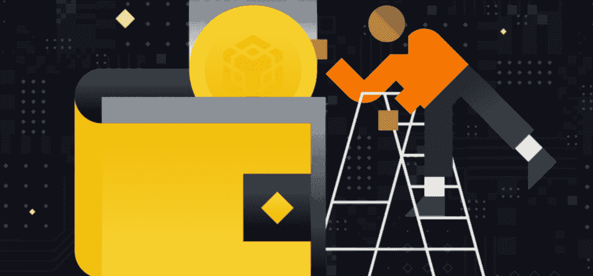
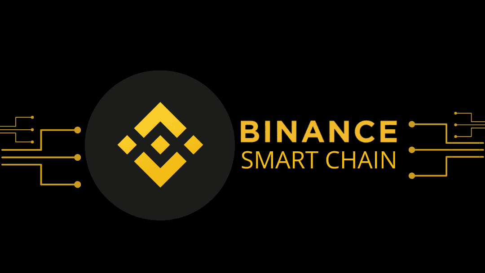
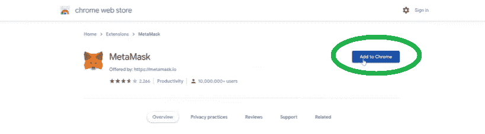
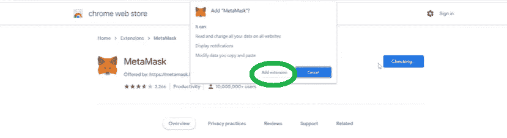
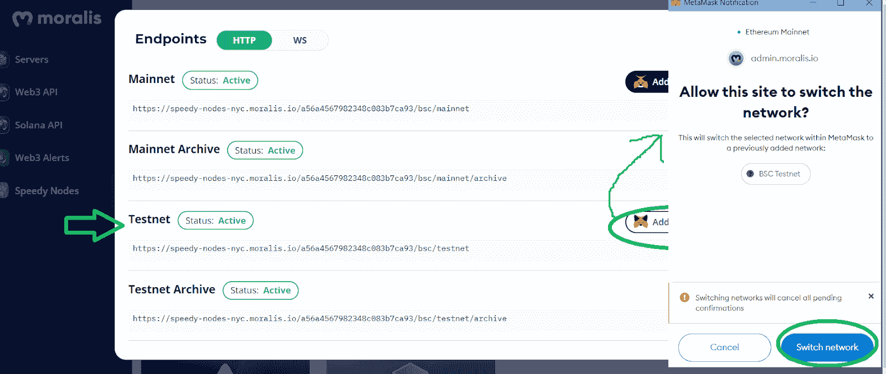

# bsc 钱包指南——如何设置金融智能链钱包

> 原文：<https://moralis.io/bsc-wallet-guide-how-to-set-up-a-binance-smart-chain-wallet/>

**除了** [**以太坊**](https://moralis.io/full-guide-what-is-ethereum/) **之外，其他很多可编程的区块链都无愧于排行榜榜首。其中之一是币安智能链，它实际上仍然是寻求启动 dApps (** [**分散应用**](https://moralis.io/decentralized-applications-explained-what-are-dapps/) **)或** [**快速部署加密令牌**](https://moralis.io/create-free-token-how-to-deploy-your-own-testnet-crypto-token-in-10-mins/) **)的开发人员的首选。这并不奇怪，因为与** [**以太气费**](https://moralis.io/ethereum-gas-fees-the-ultimate-2022-guide/) **不同，BSC 提供的费用特别低。因此，对于寻求利润最大化的项目来说，这是一个极好的选择。现在，由于** [**币安智能连锁开发**](https://moralis.io/bsc-programming-guide-intro-to-binance-smart-chain-development-in-10-minutes/) **中的大部分编程任务都需要 BSC 钱包，所以您需要密切关注本 BSC 钱包指南的内容。之后，您将对 BSC 基础知识有一个坚实的理解，并且您还将知道如何使用 Moralis 快速设置币安智能链钱包。**

接下来，我们将向您展示使用最流行的 [Web3 钱包](https://moralis.io/what-is-a-web3-wallet-web3-wallets-explained/)–[meta mask](https://moralis.io/metamask-explained-what-is-metamask/)之一来设置您的 BSC 钱包是多么简单。请记住，开发人员的[元掩码](https://moralis.io/metamask-for-developers-how-to-launch-web3-apps-with-metamask/)对程序员来说是一个强大而有用的工具。此外，当[使用元掩码](https://moralis.io/building-dapps-with-metamask/)构建 dApps 时， [Web3 认证](https://moralis.io/web3-authentication-the-full-guide/)、 [Web3 登录](https://moralis.io/how-to-build-a-web3-login-in-5-steps/)和 [Web3 认证通过电子邮件](https://moralis.io/how-to-do-web3-authentication-via-email/)成为一个简单的过程。除了使用合适的 BSC 钱包，你还可以通过使用最好的 Web3 后端平台–[Moralis](https://moralis.io/)来使你的 [BSC 编程](https://moralis.io/bsc-programming-guide-intro-to-binance-smart-chain-development-in-10-minutes/)变得更加简单。这个终极的 Web3 开发平台(又名 [Firebase for crypto](https://moralis.io/firebase-for-crypto-the-best-blockchain-firebase-alternative/) )让你完全专注于前端。因此，你可以[创造一个伟大的 dApp UI](https://moralis.io/web3-ui-how-to-create-a-great-dapp-ui/) 并吸引更多的用户。同时，您最终节省了超过 87%的开发时间。

## 什么是 BSC 钱包？

在深入潜水之前，对基础知识有一个清晰的了解总是很重要的。因此，我们希望确保你们都能回答“什么是 BSC 钱包？”自信地提问。因此，让我们来分解“BSC”和“wallet”术语。你可能已经意识到，“BSC”代表币安智能连锁。后者是币安区块链，旨在开发 dApps 和智能合同部署。在下一节中，我们将更详细地介绍 BSC。

虽然你们都知道现实世界中的钱包是什么，但在我们的例子中，这个词指的是加密钱包。此外，加密钱包可以分为两组:冷加密钱包和热加密钱包。冷钱包是离线存储(甚至可以是一张纸)，而热钱包是允许你与 Web3 领域交互的在线应用。有些人可能认为，BSC 钱包指的是一个冷加密钱包，旨在存储币安链和 BSC-币安硬币(BNB)的本地令牌。然而，它实际上意味着一个热门的加密钱包，服务于同样的目的。此外，值得注意的是，任何可用于存储 BNB 的加密地址都可以被称为 BSC 钱包。如果你有兴趣深入了解区块链钱包，一定要点击前面提到的“Web3 钱包”链接。

让我们也指出，币安有自己的热门钱包，形式是移动应用程序和浏览器扩展。后者是一个可靠的选择，尤其是如果你使用币安的加密交换。然而，如果你是一名开发人员(或者希望成为一名区块链开发人员)，在选择加密钱包时，使用元掩码通常是首选。

### 什么是币安智能链？

刚接触加密领域的人通常不会意识到币安不仅仅是一个集中的交换中心(CEX)。因此，我们必须指出，币安拥有一个庞大的加密产品生态系统。这包括作为项目孵化器的币安实验室，用于代币销售活动的币安 Launchpad，与币安云的企业交换解决方案，其自己的 NFT 市场，等等。考虑到所有这些因素，很难说币安是 CEX。它更像是一个混合平台。

此外，币安链是币安的专用区块链，用于处理和验证币安生态系统内的交易。此外，这是来自币安的原始链，它已经被设计用来存放 BNB 硬币。尽管如此，币安链还支持完全保管私钥的交易。然而，币安链并不是为了促进智能合约而构建的。因此，它不支持分散应用程序的开发。因此，币安智能链(BSC)应运而生。

与币安链不同，BSC 是一个支持智能合同的区块链，它与币安链平行运作。此外，值得注意的是，这两个链是完全可互操作的。然而，另一方面，它们的基础设施是完全独立的。因此，万一币安链崩溃，BSC 将继续不间断运行。

从开发者的角度来看，BSC 感觉很像以太坊区块链。原因在于 BSC 基本上使用与以太坊相同的代码库。当然也有一些调整更新的参数，但是原理是一样的。这也使得 BSC [与 EVM](https://moralis.io/evm-explained-what-is-ethereum-virtual-machine/) 兼容。而且，如果我们加上用户的视角(他们想要速度和低费用)，你不应该忽视 BSC。

## BSC 钱包指南

因为我们都关心区块链的发展，并且理解其中的一些可能看起来令人生畏，所以我们希望尽可能的简单。这是让区块链理工( [Web3 tech stack](https://moralis.io/exploring-the-web3-tech-stack-full-guide/) )更接近主流采用的方式。因此，听到 Moralis 包括完整的 MetaMask 集成并不奇怪。此外，如前所述，后者使得 dApps 和令牌的创建和启动更加简单。因此，让这份 BSC 钱包指南来引导你建立你的第一个 BSC 钱包。此外，我们将向您展示如何将 BSC mainnet 和 testnet 添加到元掩码中。通过学习将 BSC 网络添加到 MetaMask，您将能够使用相同的原则将其他信誉良好的链添加到此 Web3 wallet。

## 元掩码作为 BSC 钱包

在以下几节中，我们将指导您完成下载 MetaMask、安装它、设置您的第一个 wallet 以及添加 BSC 网络的过程。基本上，这些是您设置第一个 BSC 钱包需要完成的步骤。如果您已经在浏览器上安装了元掩码扩展，您可以跳到下面的“将 BSC 添加到元掩码”部分。

### 下载和安装元掩码

1.  使用您喜欢的浏览器，在搜索栏中输入“MetaMask”。然后，一定要选择 MetaMask 官方网站:

2.  进入 MetaMask 主页后，点击顶部菜单中的“下载”按钮或下方的“立即下载”按钮:

3.  在“下载”页面上，您可以选择“Chrome”、“iOS”和“Android”。假设你计划将 MetaMask 钱包用于开发目的，我们将关注“Chrome”选项。因此，确保选择了“Chrome”选项，并点击“为 Chrome 安装 MetaMask”按钮:

4.  一旦重定向到谷歌 Chrome 的网络商店，你需要点击“添加到 Chrome”按钮:

5.  然后，您会看到一个弹出窗口，要求您确认。因此，只需点击“添加扩展”按钮:

6.  如果您正确地完成了上述所有步骤，您应该会收到 MetaMask 的欢迎消息。元掩码扩展安装过程也到此结束。但是，要创建新钱包，您需要点击“开始”按钮:

### 使用元掩码创建新的 Wallet

点击“开始”后，会询问您是否是 MetaMask 的新手。如果您已经有了您的钱包，您可以使用您的秘密恢复短语来访问它(点击“导入钱包”)。如果没有，请选择“创建钱包”。如上所述，我们将在这里着重于创建一个新的钱包。

1.  首先点击右侧的“创建钱包”:

2.  要完成下一步，您需要创建并确认您的密码。确保记住您的密码或写下密码并存放在安全的地方。

3.  作为该过程的一部分，元蒙版指南可以与教学视频一起呈现。我们推荐看。然而，下一个至关重要的步骤是关于秘密恢复短语，您需要安全地存储它。首先点击“点击此处透露密语”:

4.  在说出你的秘密单词后，你需要按照正确的顺序把它们抄下来，并存放在安全的地方。最安全的做法是将它们手写在一张纸上(确保仔细检查拼写)。然后把那张纸放在安全的地方。这是至关重要的一步，所以一定要做好。另外，注意单词的顺序很重要。您的秘密恢复短语将使您能够从任何其他设备访问您的钱包，或在需要时恢复您的帐户。写下您的密码后，点击“下一步”。

5.  您将被要求按照正确的顺序输入上一步中的短语。这样做以完成您的钱包创建:

至此，您已经成功创建了元掩码钱包。但是，默认情况下，MetaMask 只支持[以太坊测试网](https://moralis.io/ethereum-testnet-guide-connect-to-ethereum-testnets/)和 mainnet。因此，您仍然需要将 BSC 网络添加到您的钱包中，才能真正获得 BSC 钱包。

### 将 BSC 添加到元掩码

在将 BSC(或任何其他区块链)添加到元掩码时，您有两种选择:

1.  手动操作**。*这是一种更安全的方法，因此也是我们推荐的方法。***
***   自动完成**。*使用一个信誉良好的网站，点击一个按钮* *就可以添加一个特定的链* ***。这是一种更快的方法，但有潜在的危险。如果您决定使用这种方法，请确保您信任该网站。有许多网站提供这种捷径；然而，我们不能担保他们。不过，我们可以担保 Moralis。因此，请查看下面的说明。*******

#### ****如何手动将 BSC Wallet 添加到元掩码****

*****   打开您的元掩码扩展，单击“帐户”图标，然后选择“设置”:****

****

2.  进入设置页面后，选择“网络”选项:

3.  要有机会手动输入 BSC 的详细信息(将输入到上面的圆形矩形中)，您需要单击“添加网络”按钮。

4.  添加以下详细信息，然后单击“保存”按钮。
    1.  **添加 BSC 的 mainnet** 的详细信息:

*   *网络名称:智能链*
*   *新的 RPC URL:https://bsc-dataseed.binance.org/*
*   *链条 ID: 56*
*   *符号:BNB*
*   *区块浏览器网址:https://bscscan.com*

2.  详细信息到**添加 BSC 的测试网**:

*   *网络名称:智能链-测试网*
*   *新的 RPC URL:https://data-seed-prebsc-1-s1.binance.org:8545/*
*   *链条 ID: 97*
*   *符号:BNB*
*   *区块浏览器网址:https://testnet.bscscan.com*

#### 如何自动将 BSC Wallet 添加到元掩码

如果你计划使用 Moralis 来加速你的 dApp 开发，你需要[创建你的免费 Moralis 账户](https://admin.moralis.io/register)。因此，您将能够访问您的 Moralis 管理区。在这里，您可以选择通过单击按钮将 BSC 钱包添加到元掩码中。方法如下:

1.  选择“快速节点”选项卡:

2.  点击“BSC 网络”下的“端点”(见上图)。

3.  在弹出窗口中，您将看到 mainnet 和 testnet 的“添加到元掩码”按钮。单击您要添加的网络的按钮:

4.  最后一步是确认元掩码中的网络交换:

## BSC 钱包指南-如何设置币安智能链钱包-摘要

在这本币安智能连锁钱包指南中，我们已经介绍了很多内容。因此，您现在知道了什么是 BSC wallet，以及如何为开发目的设置它。在此过程中，您还了解了一些关于币安智能链条的有用信息，以及它与币安链条的不同之处。此外，您还了解了最终的 Web3 开发平台 Moralis。后者使您能够在几分钟内[创建一个 BSC 令牌](https://moralis.io/how-to-create-a-bsc-token-in-5-steps/)或[构建 BSC dapp](https://moralis.io/how-to-build-bsc-dapps-easily/)，而不用担心后端。此外，Moralis 也是了解所有 BSC 相关事物的最佳地点之一，比如 [BEP-20](https://moralis.io/what-is-bep20-full-binance-smart-chain-token-guide/) 和 [BscScan](https://moralis.io/exploring-bscscan-full-guide/) 。

此外， [Moralis YouTube 频道](https://www.youtube.com/c/MoralisWeb3)和 [Moralis 博客](https://moralis.io/blog/)是继续免费区块链教育的绝佳资源。这两个出口都拥有无数的示例项目，并解决了许多有趣的加密主题。例如，我们的一些最新文章专注于[可升级智能合约](https://moralis.io/what-are-upgradable-smart-contracts-full-guide/)、 [Web3 数据科学](https://moralis.io/web3-data-science-importing-on-chain-events/)、[如何铸造 10，000 个 NFT](https://moralis.io/how-to-mint-10000-nfts-full-walkthrough/)、 [NFT 游戏角色](https://moralis.io/nft-game-characters-how-to-mint-in-game-nft-characters/)、 [Web3 游戏化](https://moralis.io/web3-gamification-creating-a-coinmarketcap-diamonds-dapp/)、 [React Native Web3](https://moralis.io/react-native-web3-full-react-native-web3-dev-guide/) 以及[什么是元宇宙](https://moralis.io/what-is-the-metaverse-full-guide/)。然而，如果你是那些渴望尽快成为全职加密员的人之一，那么你可能需要考虑一个更专业的方法。如果是这样的话，你或许应该报名参加[Moralis 学院](https://academy.moralis.io/)。除了获得优秀的[课程](https://academy.moralis.io/all-courses)，你还将成为一个不可思议的社区的一部分。除此之外，您将获得一份详细的计划，以最佳方式优化您的学习路径，并获得专家指导。

****