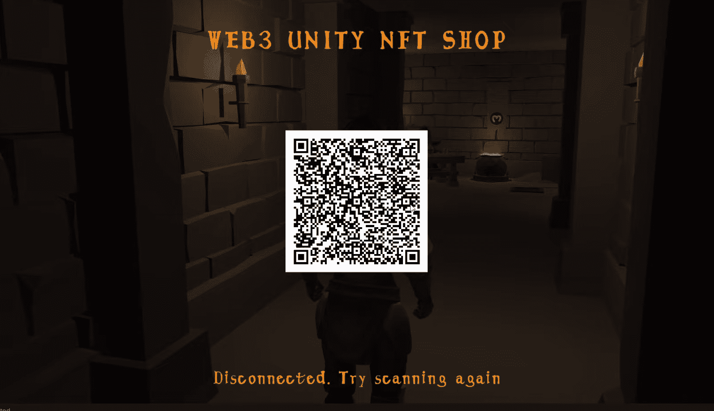
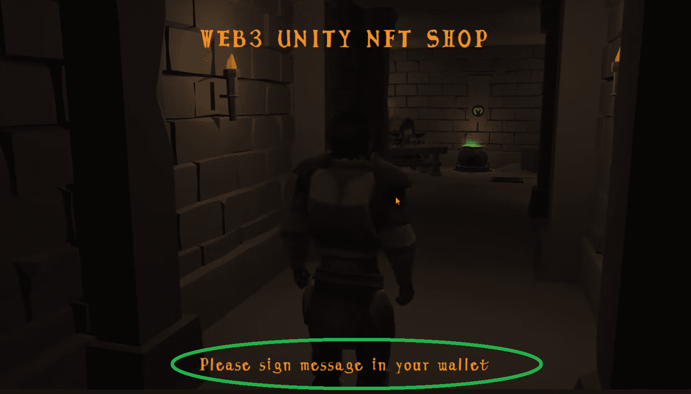
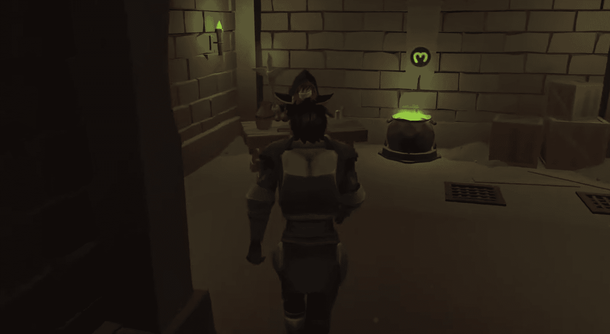
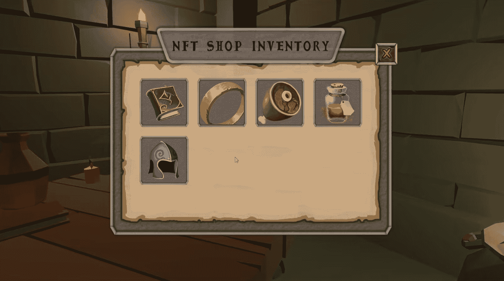
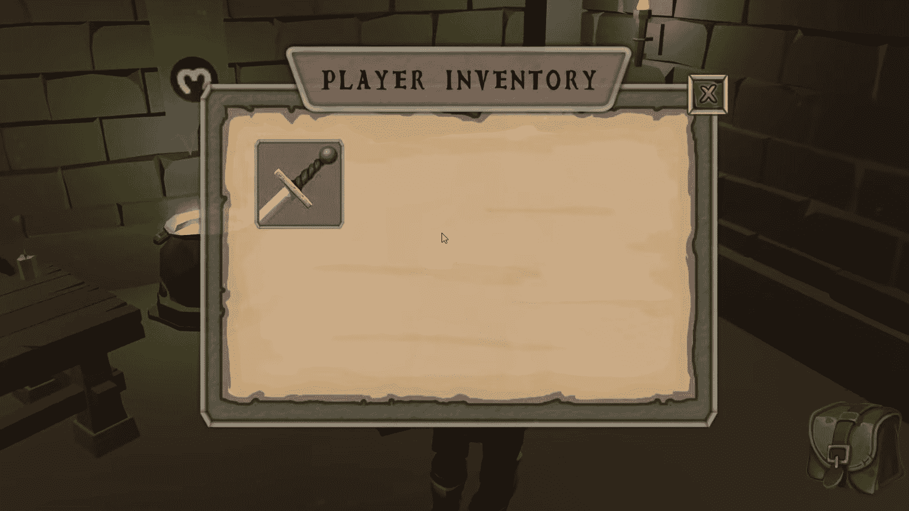
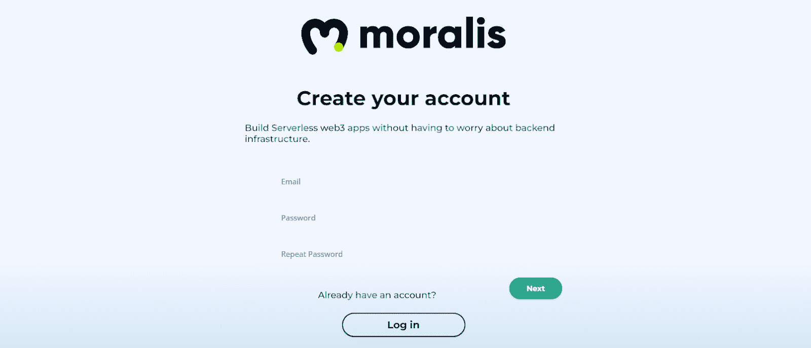
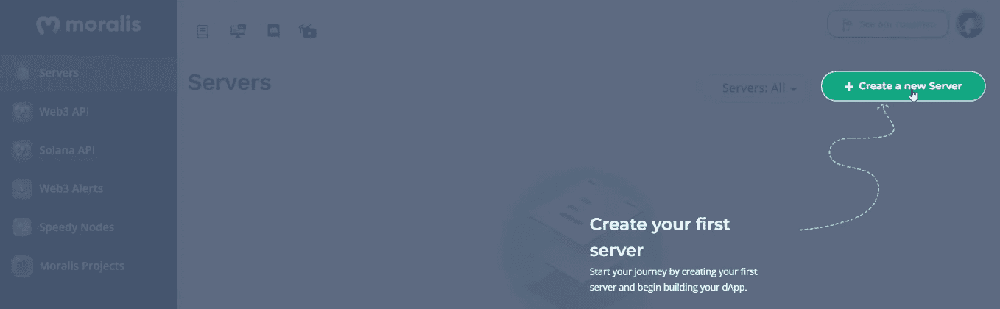
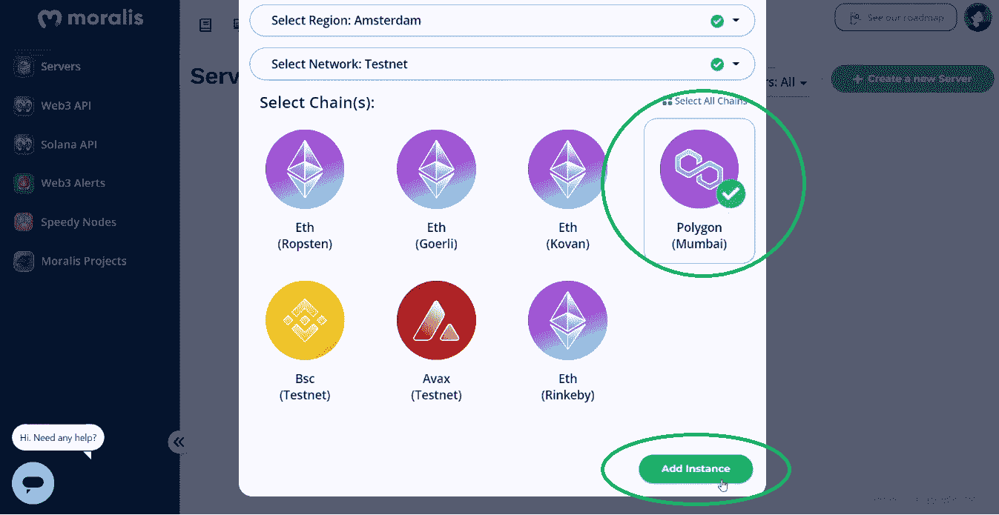
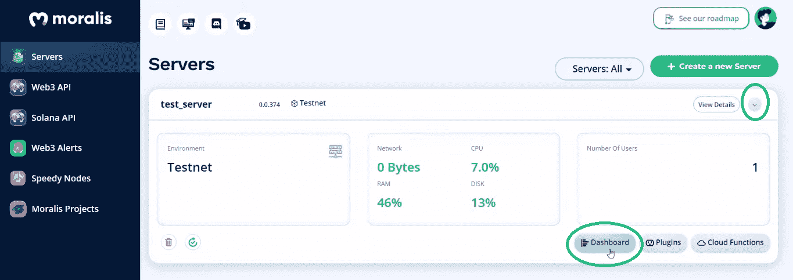
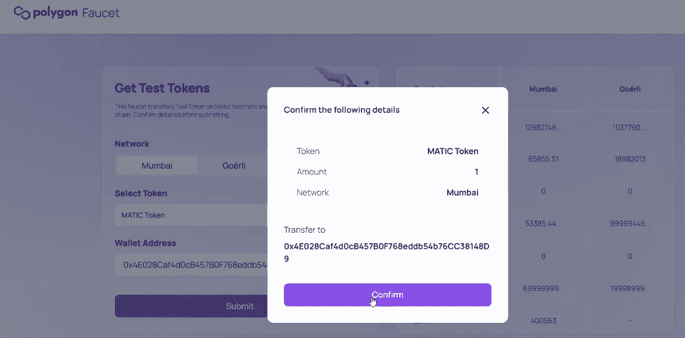

# 建立一个市场来购买游戏中的 NFTs

> 原文：<https://moralis.io/build-a-marketplace-to-buy-nfts-in-game/>

今天大多数游戏都提供了一个游戏内市场，玩家可以在那里购买物品。随着区块链游戏的兴起，加入一个游戏内的 NFT 市场，玩家可以购买不可替换的代币在游戏中使用，并将它们存储在一个 [**Web3 钱包**](https://moralis.io/what-is-a-web3-wallet-web3-wallets-explained/) **中，这将是非常有益的。但是我们如何建立一个市场来购买游戏中的非功能性游戏呢？本文研究了如何使用特定的工具快速、轻松地完成这项工作。如果您遵循我们的指南和下面列出的步骤，您可以将您的**[**GameFi**](https://moralis.io/gamefi-tutorial-how-to-create-a-gamefi-game/)**或**[**【P2E】**](https://moralis.io/how-to-build-a-play-to-earn-p2e-game/)**项目带到下一个级别。那么，你准备好建立一个可以让玩家在游戏中购买 NFT 的市场了吗？我们开始吧！**

展望未来，我们将经历以下几个阶段:

1.  **项目结构概述**–我们将首先介绍项目的结构，以便您能够正确理解我们示例游戏的每个方面。
2.  **初始 Moralis 设置**——您将了解创建自己的服务器并使用终极 [Web3 后端平台](https://moralis.io/exploring-the-best-web3-backend-platform/)、 [Moralis](http://moralis.io/) 进行 [Unity Web3](https://moralis.io/unity-web3-beginners-guide-to-unity-web3-programming/) 开发是多么容易。
3.  **准备 NFT**——我们将向您展示如何使用 Moralis 仪表盘来[索引区块链](https://moralis.io/how-to-index-the-blockchain-the-ultimate-guide/)和[商店的链外数据](https://moralis.io/how-to-store-off-chain-data-unity-web3-database/)。
4.  **部署我们的 Web3 合约**–您将看到如何部署一个智能合约，以确保游戏中的物品被铸造并转化为非功能性物品。*没有* [*智能合约*](https://moralis.io/smart-contracts-explained-what-are-smart-contracts/) *(* [*Web3 合约*](https://moralis.io/what-are-web3-contracts-exploring-smart-contracts/) *)，就不可能在游戏内买到 NFTs。*
5.  **Minting NFTs**–我们还将向您展示如何与 Unity 部署的智能合约进行交互。
6.  **获得新造的 NFT**–尽管如此，你还将了解玩家如何获得新造的 NFT，甚至在 OpenSea 上查看它们。

***注:*** *我们将对上面列出的阶段做一个简要的概述。如果你想更深入地了解，请观看文章末尾的视频链接。*

## 购买游戏中的 NFTs–我们的示例 Web3 游戏的演示

在我们处理示例项目的上述阶段之前，让我们快速演示一下我们的游戏。这样，你就能决定是否要卷起袖子继续前进。虽然，我们确信你渴望创建一个优秀的 Unity dapp ( [去中心化应用](https://moralis.io/decentralized-applications-explained-what-are-dapps/))的自己的实例。毕竟，这是实现“购买游戏内 NFTs”功能的最快方法。

这是我们示例游戏的初始屏幕:

正如上面的二维码所示，玩家需要使用他们的 Web3 钱包扫描它。出于我们演示的目的，一个示例用户正在使用[元掩码](https://moralis.io/metamask-explained-what-is-metamask/) ( [使用元掩码](https://moralis.io/how-to-authenticate-with-metamask/)进行身份验证)。因此，在扫描代码后，玩家需要确认他们的加密钱包中的 [Web3 登录](https://moralis.io/how-to-build-a-web3-login-in-5-steps/):

一旦玩家完成了他们的 [Web3 认证](https://moralis.io/web3-authentication-the-full-guide/)，用户就可以移动他们的头像。因此，他们可以去游戏区购买游戏中的 NFT:

一旦到了商店柜台，用户就可以与它交互并查看可用的商品:

### 如何在游戏中购买 NFTs

正如你在上面的截图中看到的，NFT 商店的库存中有几件商品。通过点击任何可用的项目，玩家可以看到该项目的详细信息。这也是他们可以使用“购买”按钮的地方。假设玩家点击了剑:

再者，假设玩家想买上面的剑。当用户点击购买按钮时，它将创建该项目的元数据并保存到 IPFS。接下来，玩家被要求确认他们的 Web3 钱包中的交易，这将确认交易:

如果玩家在购买后回到商店柜台，这把剑将不再出现在 NFT 商店:

### 玩家的库存和 OpenSea

然而，玩家在游戏中购买了 NFT 后，他们可以通过按“I”键来查看库存中的这些物品:

正如你在上面的截图中看到的，示例玩家的库存现在显示了那把剑。此外，我们的示例游戏还允许玩家在 OpenSea 上查看他们的项目。他们只需点击商品即可完成:

## 使用 Unity 和 Moralis 实施“购买游戏内 NFTs”——示例项目

可能有些人第一次听说 Moralis。如果是这样，你应该知道这是最终的 Web3 开发工具。这个" [Firebase for crypto](https://moralis.io/firebase-for-crypto-the-best-blockchain-firebase-alternative/) "平台是满足您 Web3 相关后端需求的一站式解决方案。它使前端开发人员能够使用 Moralis 的基础设施，轻松创建出色的 Web3 应用程序。通过使用 Moralis，您不需要处理 RPC 节点的[限制。凭借其单一的工作流程，你可以在几分钟内](https://moralis.io/exploring-the-limitations-of-rpc-nodes-and-the-solution-to-them/)[创建一个 Moralis dapp](https://docs.moralis.io/moralis-dapp/getting-started/create-a-moralis-dapp) 。此外，Moralis 的跨链和跨平台互操作性为您提供了许多选择。因此，如果你想在我们的带领下完成示例项目，请确保[创建你的免费 Moralis 账户](https://admin.moralis.io/register)。此外，我们鼓励您加入 [Moralis 项目](https://moralis.io/projects/)并获得一些独特的 NFT。

随着我们继续前进，我们将对简介中介绍的所有六个阶段进行适当的概述。然而，更多的细节，我们将参考视频的时间戳，你可以在本文的结尾找到。在该视频中，来自 Moralis 的 Unity 专家将帮助您到达终点线。尽管如此，请确保使用我们项目的 [GitHub](https://github.com/MoralisWeb3/youtube-tutorials/tree/main/unity/unity-web3-nft-shop) 库来访问整个代码，包括所有的示例资产。

### 项目结构概述

从 4:25 开始，你将有机会浏览我们项目的结构。因此，您将了解到可以在“_Project”文件夹中找到所有资源和脚本:

在“场景”文件夹中，你也有机会找到我们的“游戏”场景。至于第三方资产，它们在“第三方”文件夹中等待着您。尽管如此，在“Moralis Web3 Unity SDK > Resources”中，您会发现您将使用 Moralis 服务器的详细信息填充的预置。然后，从 5:37 开始，您将看到项目的层次结构:

“MoralisStandaloneAuth”预设将涵盖上面演示中介绍的 Web3 身份验证。此外，“游戏经理”将处理游戏阶段和触发一些事件。还有“cameraManager”预设，处理化身的相机和聚焦于 NFT 商店的相机。这也是你能看到 Unity Cinemachine 的力量的地方。尽管如此，您还会看到“玩家”、“世界”、“UI 元素”和“事件系统”。至于“购买游戏内 NFTs”的视觉效果，你会在“世界”中看到 NPC 的卖家和商店柜台:

正如上面的截图所示，商店柜台的碰撞器将发挥至关重要的作用。毕竟，这将触发 NFT 商店，并给玩家一个在游戏中购买 NFTs 的机会。但是，包含“商店库存”和“游戏库存”的是“UI 元素”。此外，您将在视频中了解更多关于新游戏输入系统(“GameInputAction”资产)的信息。

### 初始 Moralis 设置

现在是时候完成初始 Moralis 设置了(10:00)。幸运的是，这个设置很简单，几乎不需要时间。如果您还没有这样做，首先创建您的免费 Moralis 帐户。否则，只需登录您的帐户并访问您的 Moralis 管理面板。在那里，您会看到“服务器”选项卡内的“+创建服务器”按钮:

对于这个示例项目，选择“Testnet 服务器”选项。接下来，输入您的服务器的详细信息，并选择多边形的 testnet(孟买)。最后，单击“添加实例”按钮启动您的服务器:

一旦您的服务器准备就绪，您就可以通过“查看详细信息”按钮访问其详细信息:

由于 Unity SDK 的最新版本，您可以轻松地将上面复制的详细信息粘贴到 Unity 中:

以下是您需要输入 Moralis 服务器详细信息的界面:

### 准备 NFT

从 12:30 开始，你将学习如何管理商店物品。在这里，Moralis 专家将带您浏览“商店库存”脚本。因此，您将熟悉如何从 Moralis 仪表板查询数据。其中大部分都围绕着“ItemData”类。后者有一个名称、一个描述和一个图像 URL，这是我们的游戏内 NFTs 示例的本质。此外，下面的视频教程将向您展示如何创建自己的“ItemData”类(15:10)。

此外，“商店库存”脚本代码演练将帮助您了解 Moralis 的力量。此外，您将看到像“FindAsync()”这样的挂钩是如何简化事情的。

### 部署我们的 Web3 合同

正如我们在最初的 Moralis 设置中指出的，我们的示例项目基于 Mumbai testnet。因此，您需要将此网络添加到元掩码中。幸运的是，[Moralis 快速节点](https://moralis.io/speedy-nodes/)让这变得相当容易(29:30):

此外，要部署我们的智能合同，您还需要一些“play”MATIC。为了获得一些测试自动化，你必须利用一个 [Mumbai testnet 水龙头](https://moralis.io/mumbai-testnet-faucet-how-to-get-free-testnet-matic-tokens/) (30:21):

随着你的元蒙版切换到孟买，并在你的钱包里“播放”MATIC，你准备好打开 [Remix](https://moralis.io/remix-explained-what-is-remix/) (31:13)。接下来，您可以复制我们合同的整个代码(“[商店合同](https://github.com/MoralisWeb3/youtube-tutorials/blob/main/unity/unity-web3-nft-shop/Assets/_Project/ShopContract.txt)”)。当然，下面的视频将带您浏览智能合约的代码。此外，我们的合同重点是 [ERC-1155 令牌标准](https://moralis.io/erc1155-exploring-the-erc-1155-token-standard/)。准备就绪后，使用“注入的 Web3”环境并部署智能合约:

在你的上面的智能契约的实例被部署之后，你将能够把它的地址复制到“GameManager”脚本中(35:45)。

### 铸造 NFT

如果你记得我们的演示，你知道在游戏中购买 NFT，玩家通过点击“购买”按钮来铸造它们。他们还需要用他们的 Web3 钱包确认铸造交易。那么，我们如何在 Unity 内部设置它呢？我们使用“商店项目”脚本(36:45)。后者触发相应的事件，由“PurchaseItemManager”脚本处理。确切的事件处理程序(“ActivateItemPanel”)在玩家从商店中选择任何特定物品时被触发。最后，触发“购买”功能的是“购买”按钮(39:16):

这就是 [Moralis 的 SDK](https://moralis.io/exploring-moralis-sdk-the-ultimate-web3-sdk/) 用它的力量(例如“SaveToIpfs”方法)再次迷惑你的地方。感谢 Moralis 的 [IPFS](https://moralis.io/what-is-ipfs-interplanetary-file-system/) 集成，您可以轻松地创建您的 NFTs 的元数据(JSON 文件)。这些元数据然后通过上面部署的智能契约被用于[制造 NFT](https://moralis.io/how-to-mint-nfts-full-tutorial-to-minting-an-nft/)。此外,“PurchaseItemFromContract”函数触发相关的合同。此外，我们的脚本还确保从商店库存中删除购买的商品(45:43)。

### 获得铸造的 NFT

最后，是时候让你知道是什么让物品能够在玩家的物品清单和 OpenSea 上显示。详情请看下面 49:46 开始的视频。为了使这个方面正常工作，“PlayerInventory”需要做一些繁重的工作。首先，我们的游戏通过“LoadPurchadedItems”方法获取玩家的 NFTs，并在玩家的库存中显示它们。至于在 OpenSea 上显示 NFT,“CheckNftOnOpenSea”方法将完成任务。它将通过 Unity 的“openURL”方法来实现。

最后，这是我们在整篇文章中引用的视频教程:

https://www.youtube.com/watch?v=RRvUWx0AivI

## 建立一个购买游戏内 NFTs 的市场——总结

这篇文章让你有可能用 Unity 构建一个 Web3 游戏，允许玩家在游戏中购买 NFTs。您需要做的只是部署您自己的智能合约实例，并完成初始的 Moralis 设置。通过使用我们的代码，您有机会在几分钟内完成整个项目。此外，使用上面的视频教程，您有机会更详细地浏览代码。因此，在这一点上，你知道如何[铸造游戏资产为 NFT](https://moralis.io/how-to-mint-game-assets-as-nfts/)。

如果你喜欢这个示例项目，我们强烈建议你参加我们的其他 Unity 教程。比如，学习做[区块链游戏交易](https://moralis.io/how-to-do-blockchain-game-transactions-with-unity/)，掌握用 Web3 登录连接 [Unity 游戏，或者搭建](https://moralis.io/connecting-a-unity-game-with-web3-login/) [Web3 MMORPG](https://moralis.io/build-a-web3-mmorpg-with-unity-in-10-minutes/) 。另一方面，你可能渴望探索区块链发展的其他方面。如果是这样，请访问[Moralis 博客](https://moralis.io/blog/)和[Moralis YouTube](https://www.youtube.com/c/MoralisWeb3) 。一些最新的话题包括一个 [EIP 1559 示例](https://moralis.io/eip-1559-example-what-is-eip-1559/)，一个完整的[去中心化财务指南](https://moralis.io/what-is-defi-the-full-decentralized-finance-guide/)，构建一个 [Web3 Twitter 克隆](https://moralis.io/how-to-build-a-web3-twitter-clone/)，构建一个[去中心化自治组织(DAO)](https://moralis.io/how-to-build-a-decentralized-autonomous-organization-dao/) ， [SPL 与 ERC20 令牌](https://moralis.io/spl-vs-erc20-tokens-comparing-solana-and-ethereum-tokens/)比较，构建一个[索拉纳令牌仪表板](https://moralis.io/how-to-build-a-solana-token-dashboard/)，如何[创建自己的元宇宙](https://moralis.io/how-to-create-your-own-metaverse/)，创建一个 [BNB NFT](https://moralis.io/how-to-create-a-bnb-nft/) 因此，这两个内容出口可以支持您的免费持续区块链发展教育。

然而，如果你想尽早成为 Web3 开发人员，你可能需要采取更专业的方法。因此，你应该考虑报名参加[Moralis 学院](https://academy.moralis.io/)——发展最快的专注于区块链发展的在线学院。除了顶级的[课程](https://academy.moralis.io/all-courses/)，这里也是获得专家指导、个性化学习路径以及成为业内最令人惊叹的社区之一的成员的地方。