# 在以太网上用 HTML、CSS、JavaScript 和 Moralis 构建一个 Uniswap DEX 克隆

> 原文：<https://moralis.io/build-a-uniswap-dex-clone-with-html-css-javascript-moralis-on-the-ethereum-network/>

在过去，创建一个指数是相当困难的。为什么？因为它需要大量的后端开发，这既耗费资源又耗费时间。就性能和用户体验而言，大多数 dex 可能会更好。

然而，通过使用 Moralis，您可以跳过其中的大部分，因为该平台已经有了一个强大的后端基础设施。因此，所有区块链项目都可以大大减少开发时间。此外，Moralis 为您提供了一长串用于创建和部署 dapps 的优秀开发工具。这些技术对所有的 Web3 开发项目都有帮助，不仅仅是 DEX 的创建。

本教程将教你如何在以太网上用 HTML、CSS、JavaScript 和 Moralis 构建一个 Uniswap DEX 克隆。

**目录**

*   什么是 DEX(分散交换)？
*   什么是 Moralis？
*   项目设置和安装
*   Moralis 服务器设置
*   安装 1 英寸 DEX 插件
*   构建 Uniswap 索引
*   结论

这里有一个链接指向 [live demo](https://uniswap-dex-with-moralis.vercel.app/) 和 GitHub 仓库—[Uniswap DEX with Moralis。](https://github.com/Olanetsoft/uniswap-dex-with-moralis)

## **什么是 DEX(去中心化交易所)？**

分散式交易所(DEX)是一个点对点市场，加密货币交易者可以直接相互交易。dex 使金融交易能够在没有银行、经纪人、支付处理商或任何其他中介的情况下进行。

智能合同和订单簿中继是两种突出的功能方式，尽管还有许多其他选项和不同程度的去中心化。

分散的交易所通过消除交易者在完成交易之前将他们的资产发送到交易所的必要性，减少了来自交易所黑客的盗窃的危险。尽管如此，流动性提供者必须将代币转移到分散的交易所。

dex 经常用“流动性池”取代传统的交易所订单簿，后者根据订单价格和数量匹配买家和卖家。这些都是隐藏在交易所表面下的加密货币资产，等待清算任何买卖订单。资金池中的投资来自投资者，他们存钱是为了从向资金池用户收取的交易费用中获利。

## **什么是 Moralis？**

[Moralis](https://moralis.io/) 是一项服务，汇集了各种工具和资源，用于构建连接到区块链的去中心化软件，如以太坊、多边形、[币安智能链](https://moralis.io/bsc-programming-guide-intro-to-binance-smart-chain-development-in-10-minutes/)(现 BNB 智能链)。

Moralis 的终极 Web3 开发平台包括内置的跨链功能，允许新手和有经验的开发人员快速轻松地工作。此外，Moralis 为您提供了一个 Web3 后端基础设施，让您专注于前端开发。它基本上处理了让你的 dapps 运行所需的所有复杂的、幕后的 Web3 事情。

Moralis 也是可控的和无限可扩展的，所以你的 dapps 将毫无困难地扩展。

## **项目设置和安装**

为了快速开始项目设置和安装，我们将在 GitHub 上克隆这个[项目](https://github.com/Olanetsoft/uniswap-dex-with-moralis/tree/setup),并确保我们位于设置分支。接下来，我们将在本地启动克隆后的项目。

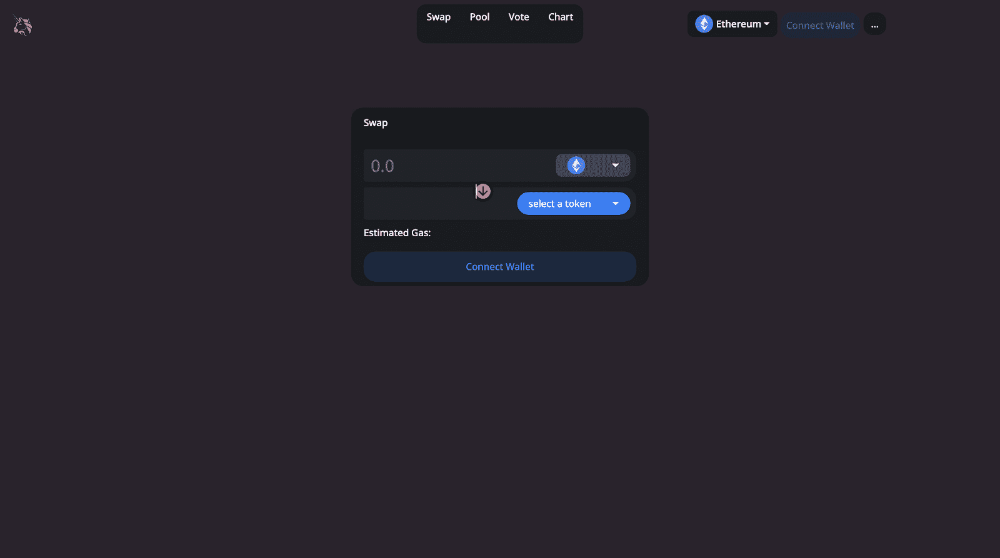

## **Moralis 服务器设置**

让我们从设置我们的 Moralis 服务器开始，因为我们将在下一节中使用它来开发 Uniswap DEX。我们将在我们的 Moralis 管理面板上设置一个服务器。如果您还没有帐户，请在此注册一个[。注册很容易，而且可以免费开始。](https://admin.moralis.io/register)

我们将单击创建一个新服务器，如下所示，然后在我们的管理面板上选择 mainnet 服务器:

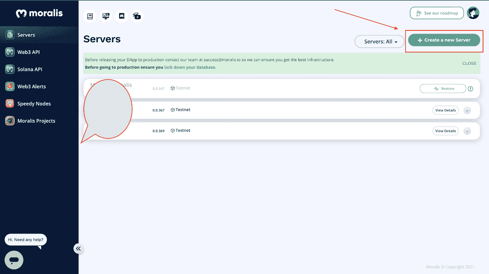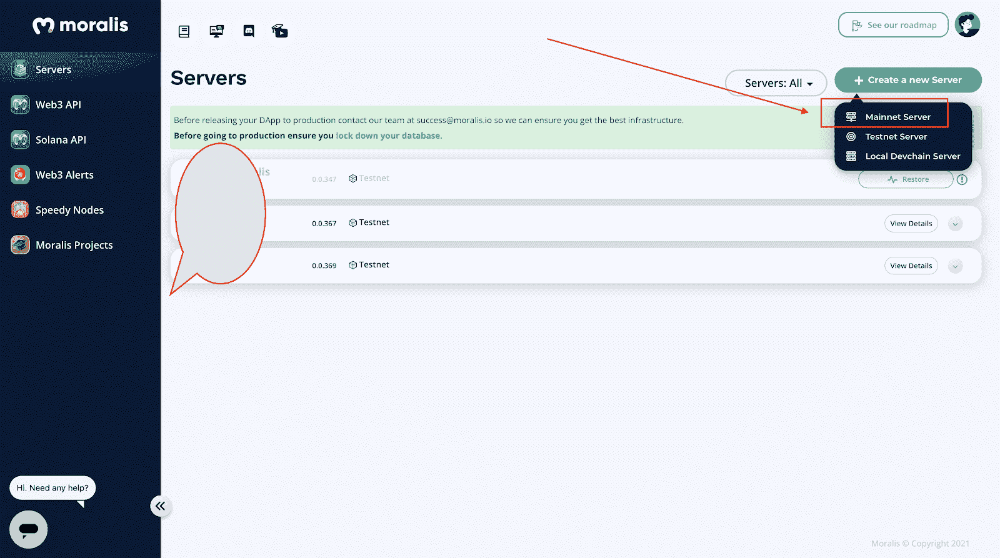

我们现在将输入我们的服务器详细信息，如下所示:

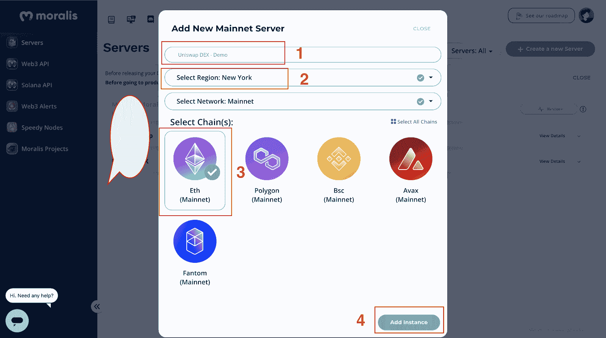

我们的服务器将在几秒钟内准备好，我们将不得不从我们的 Moralis 管理面板上新创建的服务器实例中访问我们的服务器 URL 和应用程序 ID。

我们将使用这些详细信息从我们的应用程序连接到服务器实例，如下所示:

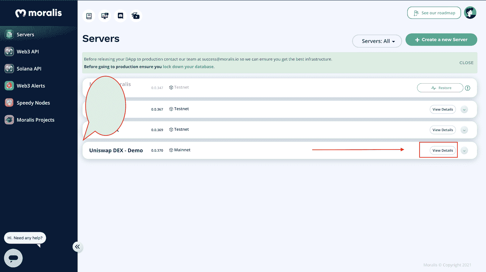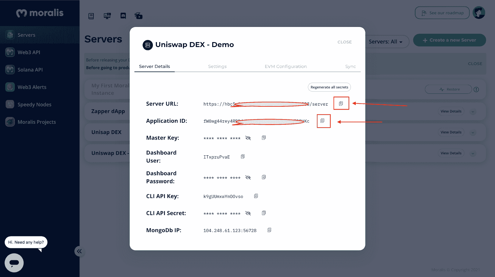

## **安装 1 英寸 DEX 插件**

在本节中，我们将向服务器添加 [**1inch DEX 插件**](https://moralis.io/plugins/1inch) 。我们需要访问 [**Moralis 插件商店**](https://moralis.io/plugins) ，我们可以通过点击服务器上的插件按钮，然后点击转到插件商店找到它。

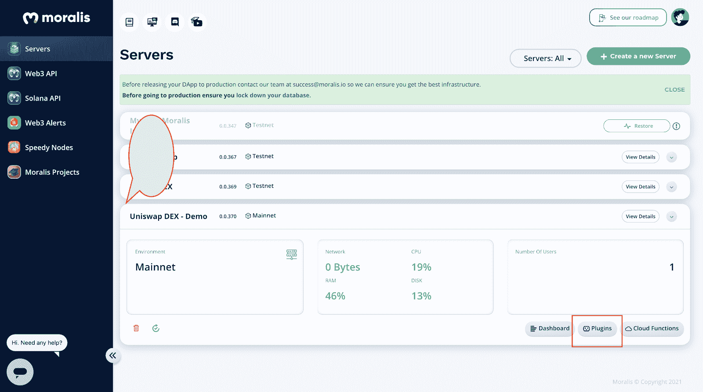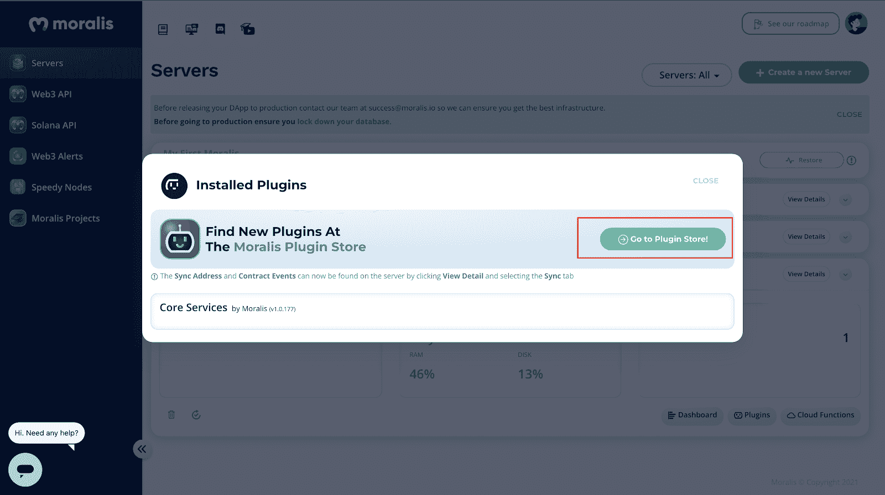

该网站会将我们重定向到 Moralis 插件商店，在那里我们可以安装 1inch 插件，该插件将 DeFi / DEX 聚合器 1inch 集成到任何使用 Moralis 的项目中。

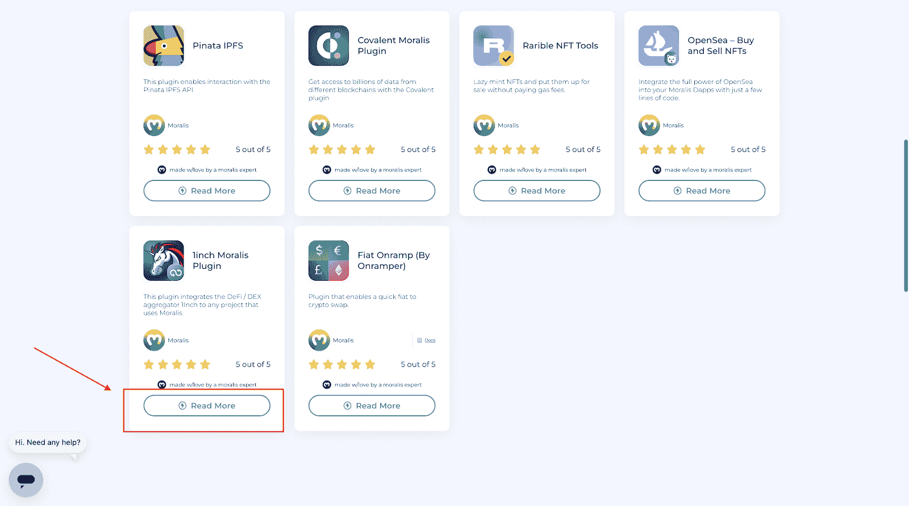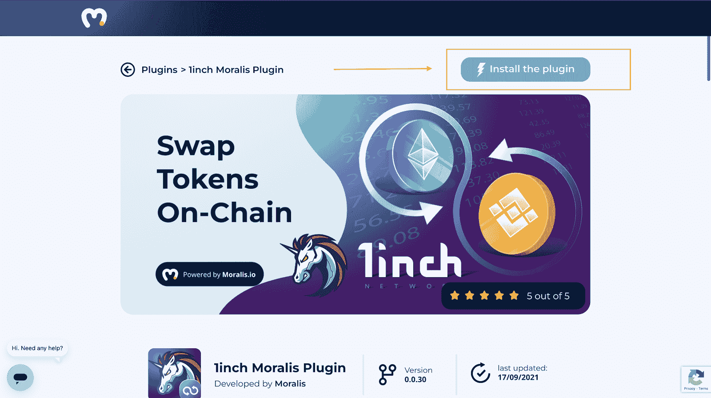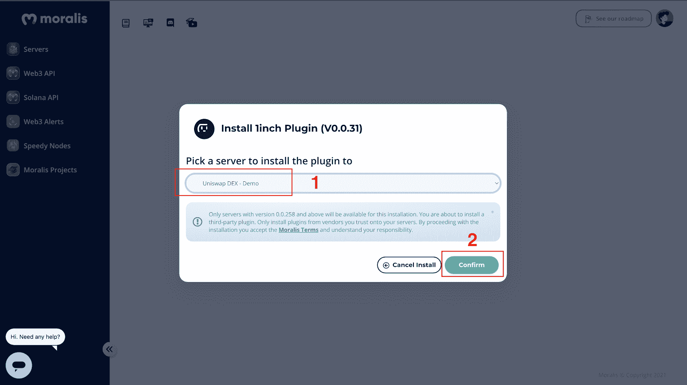

## **构建 Uniswap 指数**

在完成设置和用户界面(UI)之后，我们将继续初始化 Moralis。

我们需要从之前创建的服务器中获取服务器 URL 和应用程序 ID。通过选择服务器的 View Details 按钮，我们将能够获得这些信息。然后，在 script.js 文件中，我们可以将这些信息复制并粘贴到我们的应用程序中:

参见 [CodePen](https://codepen.io) 上 Moralis web 3([@ moralisweb 3](https://codepen.io/moralisweb3))的 Pen[Create uni swap DEX Clone 1](https://codepen.io/moralisweb3/pen/wvpVJGe)。