# 用 Unity 在 10 分钟内构建一个 Web3 MMORPG

> 原文：<https://moralis.io/build-a-web3-mmorpg-with-unity-in-10-minutes/>

《魔兽世界》和《江湖》等大型多人在线角色扮演游戏(MMORPGs)在不同年龄段的人群中非常受欢迎。而且，既然 [**Web3**](https://moralis.io/the-ultimate-guide-to-web3-what-is-web3/) **和区块链博彩越来越流行，我们有必要谈谈 Web3 MMORPG 的进步。如你所知，Web3 的主流采用预计在未来五年左右。因此，现在是学习如何用 Unity 构建区块链 MMORPG 游戏的最佳时机。当然，一些大玩家已经加入了 Web3 MMORPG 领域。然而，渴望创建一个 Web3 MMORPG 的勇敢的开发者有无数的机会等待着他们。**

正如您将在本文中了解到的，当您想要快速构建一个带有 Unity 的 Web3 MMORPG 时，非凡的工具可以为您提供额外的优势。除了 Unity，我们还将向你展示如何利用光子引擎和 Moralis 规范。第一个使多人游戏变得简单，而第二个涵盖了你所有的 Web3 后端需求。

为了启发和教育您，我们创建了一个简单的 Web3 MMORPG。随着我们继续前进，你将有机会看到区块链比赛的预告。此外，通过使用我们在 GitHub 提供的代码，你将有机会在短短十分钟内用 Unity 自己构建一个区块链 MMORPG 游戏。因此，你将学会如何将统一与光子引擎和 Moralis 的力量结合起来。后者将使您能够使用这些不可替代的工具，满怀信心地处理您自己的 Web3 MMORPG 项目。

无论你想创建 dapp([分散应用](https://moralis.io/decentralized-applications-explained-what-are-dapps/))还是令牌，Moralis(又名 [Firebase for crypto](https://moralis.io/firebase-for-crypto-the-best-blockchain-firebase-alternative/) )都会支持你。速度、可靠性、极致的 [Web3 API](https://docs.moralis.io/moralis-server/web3-sdk/intro) ，包括 Moralis 的 [NFT API](https://moralis.io/ultimate-nft-api-exploring-moralis-nft-api/) ，以及跨链互操作性让 Moralis 成为最好的 [Web3 后端平台](https://moralis.io/exploring-the-best-web3-backend-platform/)。

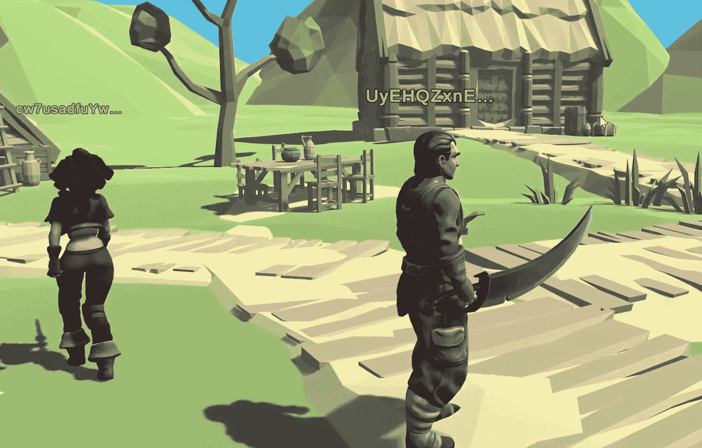

## 用团结、Moralis 和光子构建一个网络 3 MMORPG

在接下来的章节中，我们将为你提供使用 Unity 构建区块链 MMORPG 游戏所需的所有必要指导。当然，您可以使用我们的代码这一事实使得您可以在不超过十分钟的时间内完成这项工作。此外，在我们向你展示如何完成 Moralis 和光子设置，我们想做一个快速预览我们的 Web3 MMORPG 的例子。请记住，我们尽可能保持事情简单。然而，在你的角落里有了上面提到的工具，它应该足够让你看到可供你支配的潜力。

### 我们的 Web3 MMORPG 示例演示

让我们先来看看登录屏幕:

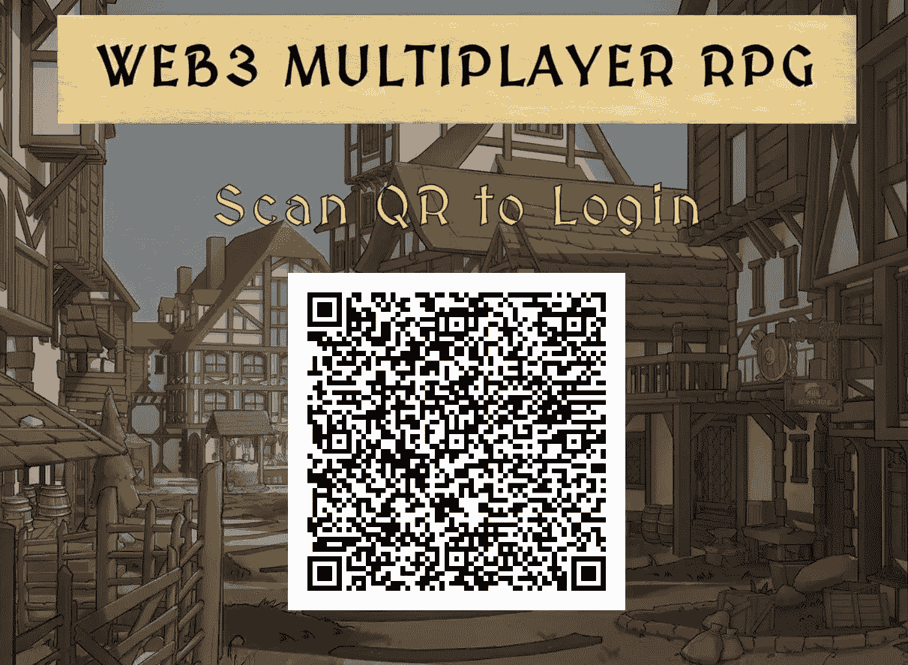

查看上面的截图，您可以看到我们的示例 Web3 游戏首先要求用户登录。为了尽可能方便用户，我们决定使用二维码。因此，用户可以使用他们的设备简单地扫描这个代码，并用他们的 [Web3 钱包](https://moralis.io/what-is-a-web3-wallet-web3-wallets-explained/)执行 [Web3 认证](https://moralis.io/web3-authentication-the-full-guide/)。在这方面，Moralis 为你提供了几种选择。对于有一些加密经验的网络用户来说，使用元掩码进行[认证是最好的选择。另一方面，](https://moralis.io/how-to-authenticate-with-metamask/) [WalletConnect](https://moralis.io/what-is-walletconnect-the-ultimate-walletconnect-guide/) 最适合在手机上 [Web3 登录](https://moralis.io/how-to-build-a-web3-login-in-5-steps/)。然而，如果你想提高 [Web3 用户的参与度](https://moralis.io/how-to-boost-web3-user-onboarding-success-rates/)，坚持使用 Web2 方法可能是一个不错的选择。幸运的是，Moralis 使你能够通过电子邮件或使用 [Web3 社交登录](https://moralis.io/web3-social-login-sign-in-dapp-users-with-google-email-or-twitter/)轻松完成 [Web3 认证。](https://moralis.io/how-to-do-web3-authentication-via-email/)

一旦新用户扫描二维码并使用他们的热钱包签署确认消息，他们就登录了。然后，他们有机会通过点击“加入房间”按钮加入游戏:

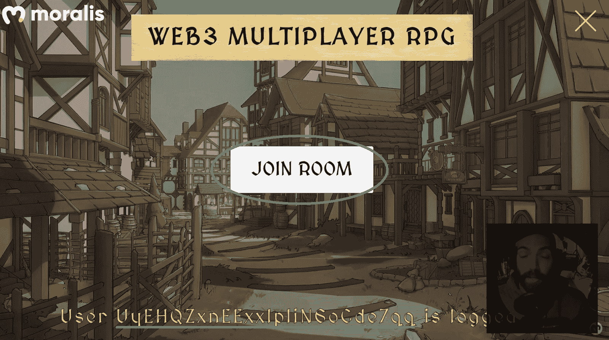

此外，成功登录后，屏幕底部会出现一条消息。它让用户知道他们的钱包地址已登录。点击“加入房间”按钮后，游戏加载场景:

一旦场景被加载，用户可以移动他们的角色。此外，字符上方还显示了部分用户地址:

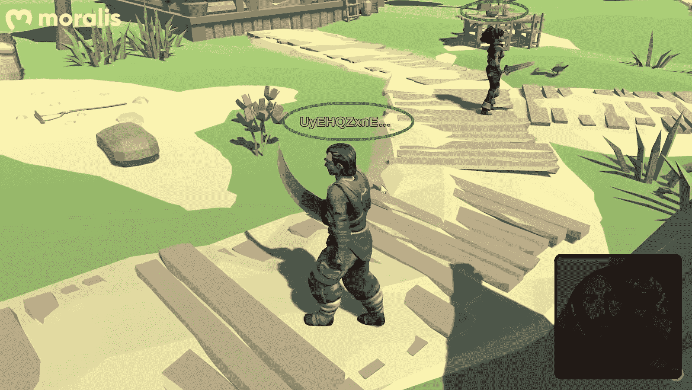

当接近其他玩家时，用户可以检查他们的用户名和钱包地址:

### 使用 Unity 构建区块链 MMORPG 游戏–工具概述

现在，您已经清楚地了解了我们将要构建的内容，让我们更仔细地看看我们将要使用的工具。如前所述，我们将使用 Unity、Moralis 和光子引擎。

*   **Unity** 是一个跨平台的游戏引擎。在我们看来，这是游戏创作最完整的解决方案。此外，能够使用我们熟悉的 Web2 工具进行 Web3 开发是非常棒的。

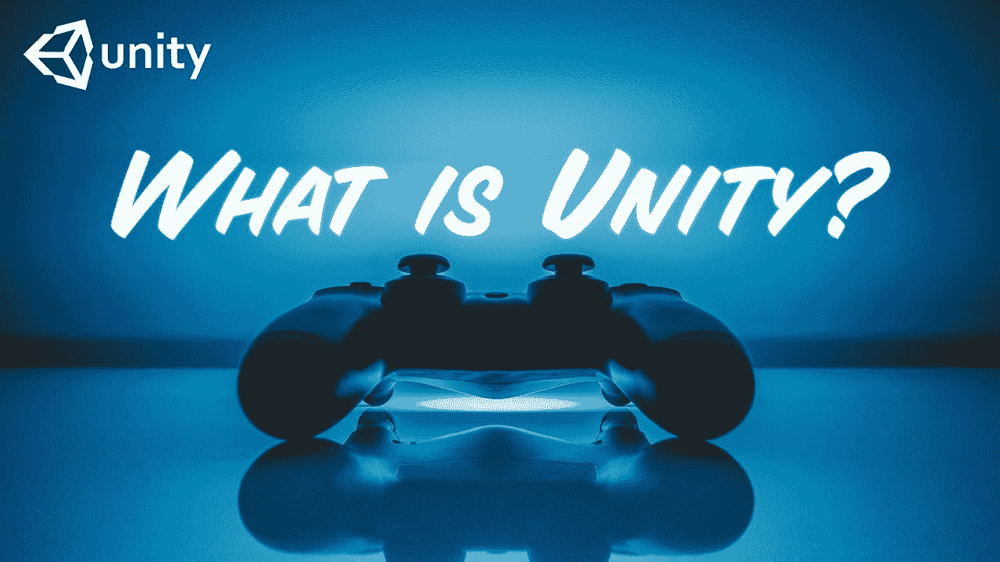

*   **Photon** 是一款专门从事多人游戏开发的游戏引擎。因此，它为我们提供了一个应用 ID，我们可以在 Unity 中使用它来满足我们的大多数多人游戏需求。光子的另一个伟大之处是它让你可以免费开始。

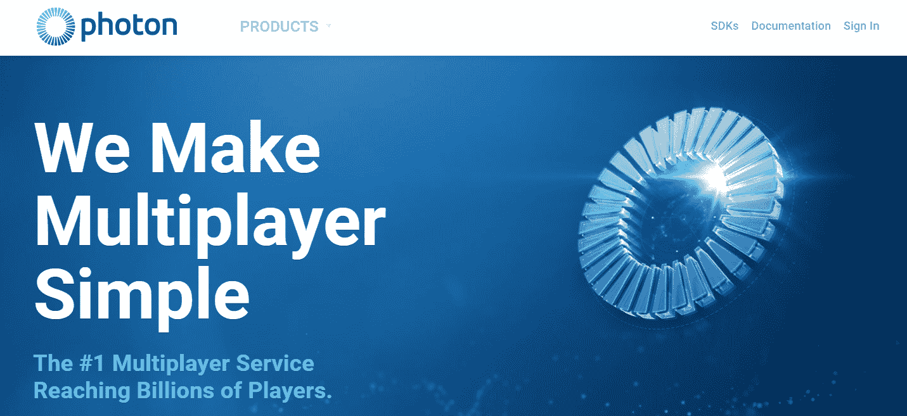

*   **Moralis** 是最终的 Web3 开发平台。当考虑当前的 [Web3 技术栈](https://moralis.io/exploring-the-web3-tech-stack-full-guide/)时，Moralis 是可以使用的工具。除此之外，它能让你节省 87%的开发时间。因此，Moralis 使得跨多个可编程链部署 dApps 变得异常简单。此外，Moralis 使您能够避免处理 RPC 节点的所有[限制。这样，你就可以把最大的注意力放在前端。因此，你可以为你的客户提供一个很棒的 Web3 UI。](https://moralis.io/exploring-the-limitations-of-rpc-nodes-and-the-solution-to-them/)

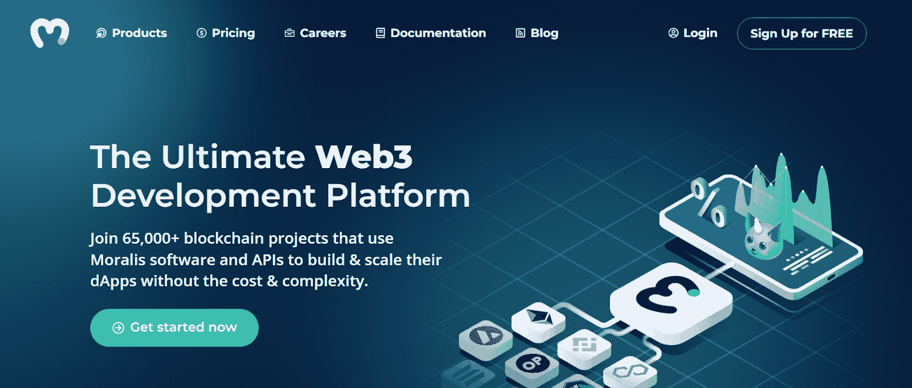

此外，Moralis 的免费版本提供了入门所需的一切。它使您能够创建您的 Moralis 服务器并访问其数据库(Moralis dashboard)。后者与 Moralis 的“同步”功能相结合，使您能够[同步和索引智能合约事件](https://moralis.io/sync-and-index-smart-contract-events-full-guide/)。本质上，这是[不费吹灰之力索引区块链](https://moralis.io/how-to-index-the-blockchain-the-ultimate-guide/)的最佳工具。最重要的是，[Moralis 元宇宙 SDK](https://moralis.io/metaverse/) 也能让你[轻松创建一个元宇宙](https://moralis.io/how-to-create-a-metaverse-dapp-with-unity/)。

## 用 Unity 在 10 分钟内搭建一个区块链 MMORPG 游戏

如上所述，我们在 [GitHub](https://github.com/MoralisWeb3/youtube-tutorials/tree/main/unity-web3rpg) 提供了之前展示的 Web3 MMORPG 的全部代码。因此，您可以从克隆代码或下载[项目 ZIP 文件](https://github.com/MoralisWeb3/youtube-tutorials/releases/tag/v1.0.0-web3-mutiplayer-rpg)开始:

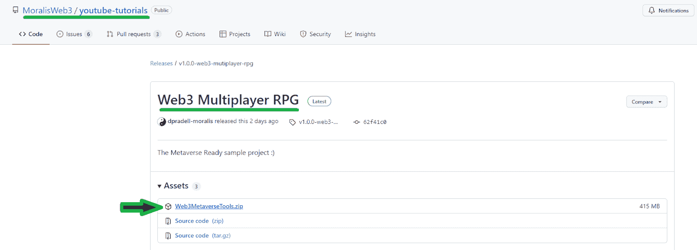

一旦你下载了 ZIP 文件，解压它，然后用 Unity 打开主文件夹。接下来，在 Unity 中，找到“登录”场景:

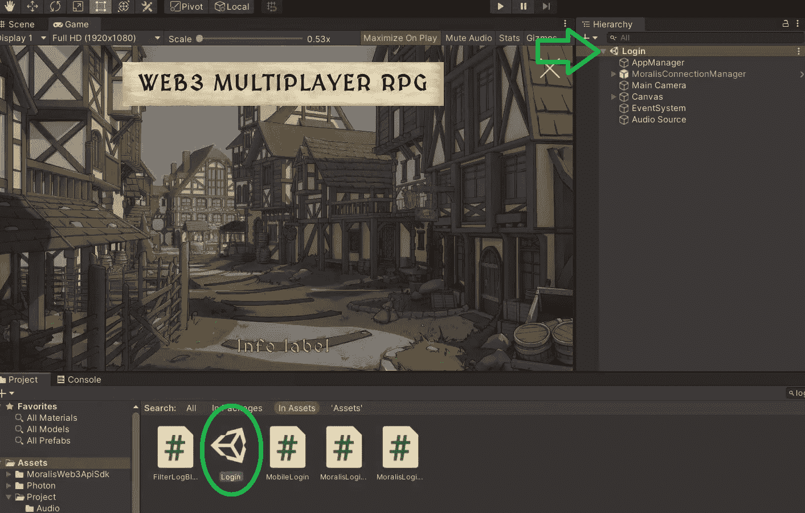

说到用户端的登录工具，我们推荐使用 Trust Wallet。根据我们的经验，它是最可靠的产品之一。幸运的是， [Moralis 的 SDK](https://moralis.io/exploring-moralis-sdk-the-ultimate-web3-sdk/) 使得登录实现非常简单。它为我们提供了两个“预制体”:

当您选择“MoralisSetup”预置时，您会看到它要求您的 Moralis 服务器 URL 和 Moralis 应用程序 ID。因此，您需要创建自己的 Moralis 服务器来获取这些细节。也就是说，是时候完成初始的 Moralis 规范设置了。

### 初始 Moralis 设置

无论您是使用 Unity 构建 Web3 MMORPG，还是使用 ultimate [Ethereum dApp 样板](https://moralis.io/ethereum-dapp-boilerplate-full-ethereum-react-boilerplate-tutorial/)创建 dApp，您都必须首先完成初始的 Moralis 设置。该设置的目标是创建您的 Moralis 服务器并访问其详细信息。因此，请遵循以下步骤。

#### 访问您的 Moralis 管理区并创建您的 Moralis 服务器

1.  **登录您的 Moralis 账户**–我们假设您已经拥有一个有效的 Moralis 账户；于是，只需[登录](https://admin.moralis.io/login)。*另一方面，万一你还没有一个 Moralis 家账号，* [*使用这个链接*](https://admin.moralis.io/register) *。它会带你到注册页面。在那里，输入您的电子邮件，创建您的密码，并点击确认链接，这将被发送到您的电子邮件的收件箱。*

2.  [**创建 Moralis 服务器**](https://docs.moralis.io/moralis-server/getting-started/create-a-moralis-server)–登录 Moralis 管理区后，点击“服务器”选项卡右上角的“+创建新服务器”按钮。页面上的教程也将指导您:

点击“创建新服务器”按钮后，您需要选择最适合您项目的网络类型(见下面的截图)。当处理示例项目或测试 dApps 时，“Testnet 服务器”或“本地 Devchain 服务器”是最好的选择。不过，当要上线时，你需要点击“Mainnet 服务器”。

接下来，将出现一个弹出窗口，询问您的服务器详细信息。首先输入您的服务器名称(可以是您想要的任何名称)，然后选择您的地区、网络类型和链。一旦您选择了您所选择的链，您将能够通过点击“添加实例”来运行您的服务器:

#### 访问您的 Moralis 服务器的详细信息并填充 Unity

3.  **访问您服务器的详细信息**–现在您已经创建了您的服务器，您可以访问它的详细信息了。只需点击“查看详情”按钮:

您将在新窗口中看到详细信息。在这里，您可以使用右侧的复制图标轻松复制服务器的 URL 和应用程序 ID:

4.  **在 Unity***–*中填入您的 Moralis 服务器的详细信息，现在是时候在 Unity 中填入适当的字段了。因此，请确保将这两个详细信息分别粘贴到正确的字段中:

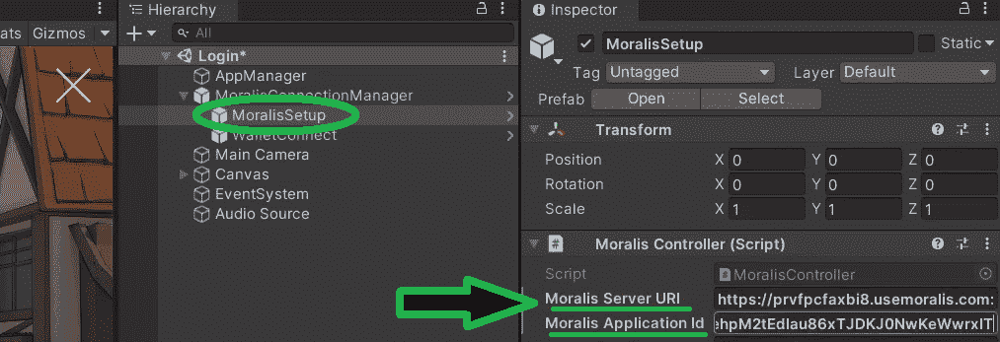

现在您的服务器已经启动，您还可以访问您的 Moralis 仪表板。您可以通过点击“查看详细信息”按钮旁边的箭头来完成此操作。然后，点击“仪表板”访问您的数据库。在那里，所有相关的链上事件都被记录下来:

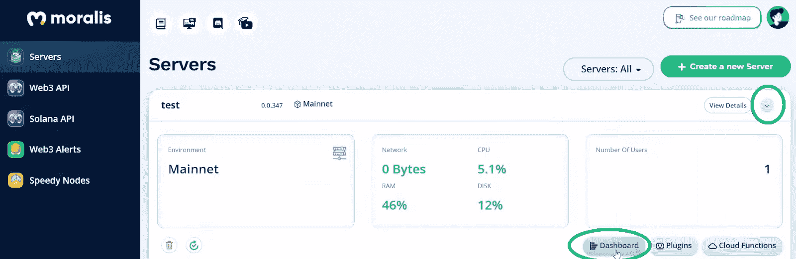

这是 Moralis 仪表板的预览:

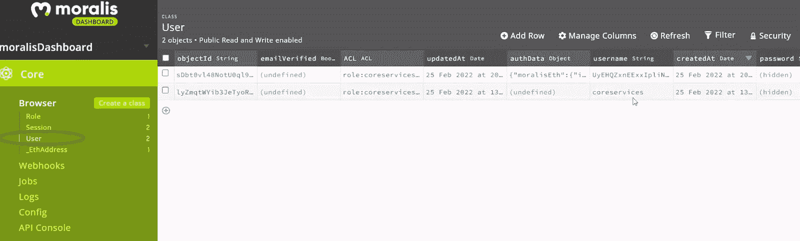

在“User”类中，您可以查看用户的登录信息。而且在“_ EthAddress”里面，会看到用来登录的钱包地址。因此，所有这些链上数据都由您处理。因此，你可以很容易地阅读它，并使用它来正确编程您的 Web3 MMORPG。后者是用“Moralis 界面”方法巧妙地完成的。您可以通过在场景中打开 Unity 中“脚本”旁边的“AppManager”来查看后端功能的详细信息:

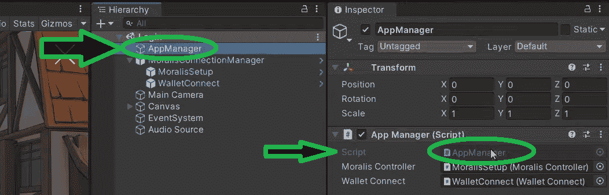

然后可以使用搜索栏，输入“MoralisInterface”。这将标记所有相关的方法:

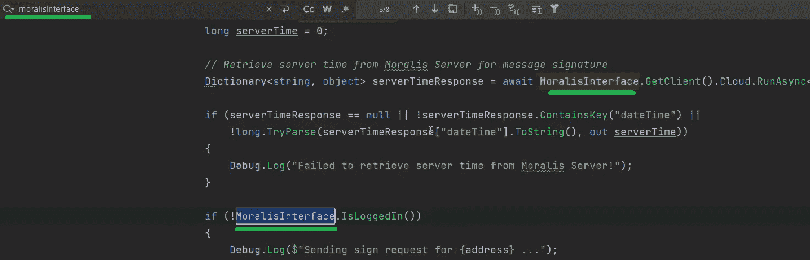

### Web3 多人游戏设置

有了 Moralis 负责你的后台，你的 Web3 MMORPG 游戏已经在运行了。然而，你仍然需要加入多人游戏的功能。对于我们“用 Unity 构建一个区块链 MMORPG 游戏”任务的这一部分，我们将使用光子。

首先，进入 Unity 内部的“游戏”场景(*资产>项目>场景*):

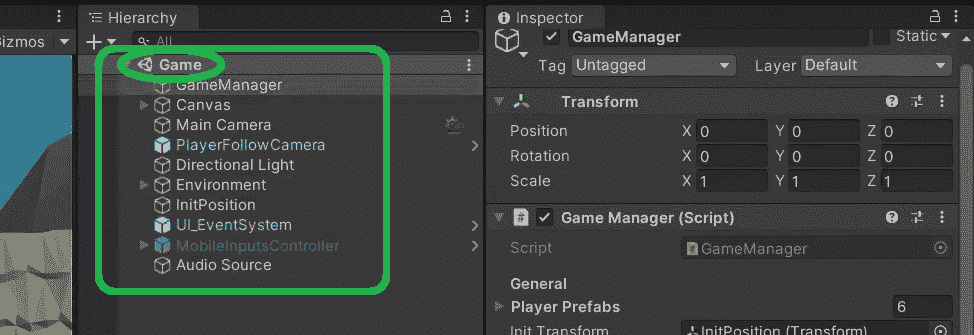

查看“游戏”场景的层次，可以看到没有光子预设。然而，我们的“游戏管理员”会随机选择玩家:

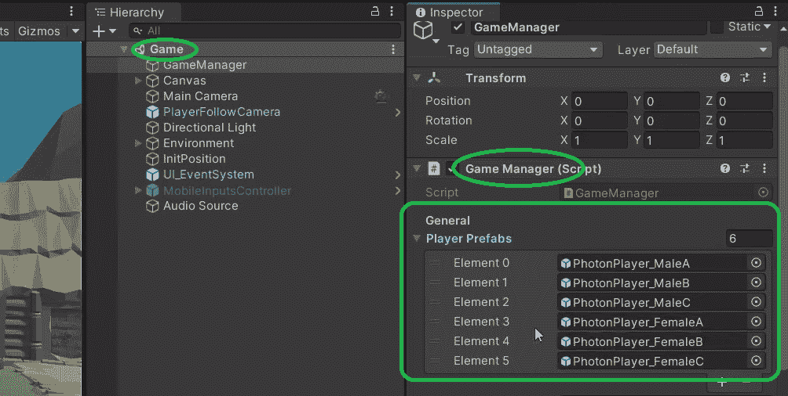

因此，我们的“PhotonPlayer”预置包含在每个“PhotonPlayer”中:

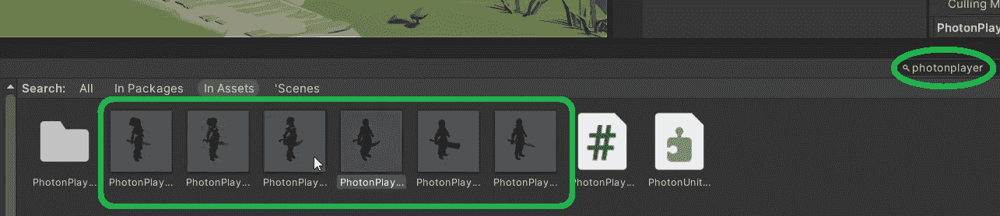

如果你现在打开任何一个上面标有“PhotonPlayer”的预置，你可以看到几个 Photon 预置。其中包括“光子视图”、“光子传递视图”和“光子动画视图”。然而，要让所有这些工作，你需要粘贴你的光子应用程序 ID 在“光子服务器设置”里面。要访问这些设置，请使用搜索工具并输入“设置”。接下来，打开“PhotonSer…”:

要获得自己的 Photon 应用 ID，您需要创建自己的 Photon 帐户。你可以使用谷歌或任何其他搜索引擎，在搜索栏中输入“光子引擎”。一旦在光子的官方主页上，创建您的帐户。登录后，您需要转到您的控制面板:

你已经猜到了；这是您获取 Photon 应用 ID 的地方。如果这是您第一次使用 Photon，您需要创建一个新的应用程序:

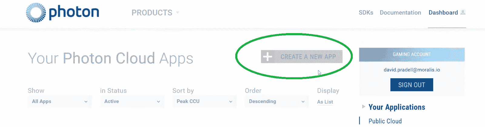

接下来，确保选择“光子类型”下的“双关”:

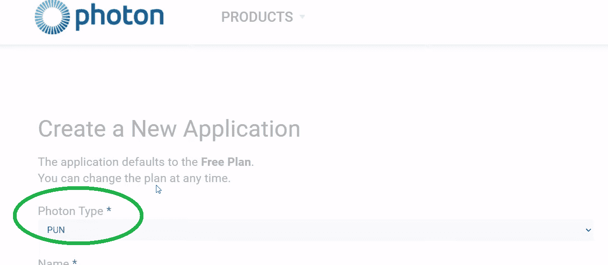

其余的细节可以是你想要的任何东西。然后，点击“创建”按钮。最后，复制您的应用 ID 并粘贴到 Unity:

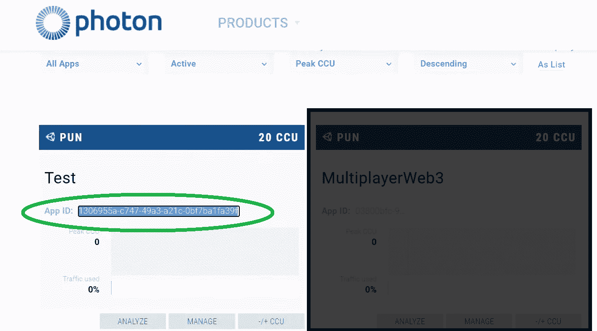

这就结束了我们的“用团结打造一个区块链 MMORPG 游戏”的任务！

*这里还有上述教程的视频版本:*

https://www.youtube.com/watch?v=5Bz-r1KBres

## 用 Unity 在 10 分钟内构建一个 web 3 MMORPG–总结

我们希望你已经遵循了上述指南，并采取了必要的步骤来建立一个统一的区块链 MMORPG 游戏。如果是这样，您已经学会了如何轻松地完成初始 Moralis 设置和 Photon 设置，以获得正确的功能。此外，虽然我们的示例 Web3 MMORPG 游戏非常酷，但我们敦促您使用您的技能和想象力将事情带到下一个级别。然而，如果你首先需要增强你的信心，我们建议进一步区块链发展教育。

如果你更喜欢免费内容，没有比 [Moralis YouTube 频道](https://www.youtube.com/c/MoralisWeb3)和 [Moralis 博客](https://moralis.io/blog/)更好的了。这两个渠道都提供了无数的示例项目和中肯的解释。例如，我们的一些最新主题涵盖了如何[构建一个中世纪的元宇宙游戏](https://moralis.io/how-to-build-a-medieval-metaverse-game/)，如何[构建一个 Web3 亚马逊市场](https://moralis.io/how-to-build-a-web3-amazon-marketplace/)，如何[将一个 Unity 应用程序连接到一个 Web3 钱包](https://moralis.io/how-to-connect-a-unity-app-to-a-web3-wallet/)，如何[创建一个 BNB 链令牌](https://moralis.io/how-to-create-a-bnb-chain-token-in-5-minutes/)，[炼金术 API 替代品](https://moralis.io/alchemy-api-alternatives-web3-development-platforms/)，如何[克隆一个比特币基地钱包](https://moralis.io/cloning-coinbase-wallet-how-to-create-a-coinbase-clone/)，如何[创建一个索拉纳令牌](https://moralis.io/how-to-create-a-solana-token-in-5-steps/)，一个 [NFT 铸造页面](https://moralis.io/how-to-launch-an-nft-minting-page-full-walkthrough/)

如果你对更专业的方法感兴趣，我们建议你报名参加[Moralis 学院](https://academy.moralis.io/)。通过这样做，你将获得专业的[课程](https://academy.moralis.io/all-courses)，个性化的学习路径，最先进的社区之一，以及专家指导。有了这些优势，你应该很快就会[成为一名区块链开发者](https://moralis.io/how-to-become-a-blockchain-developer/)。

