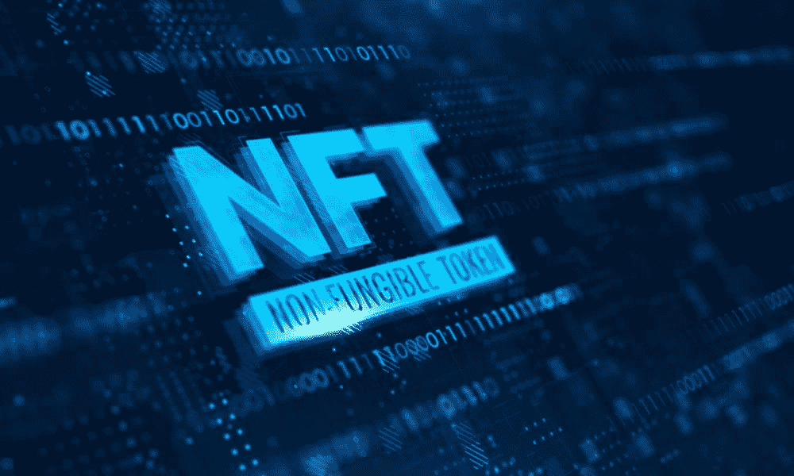
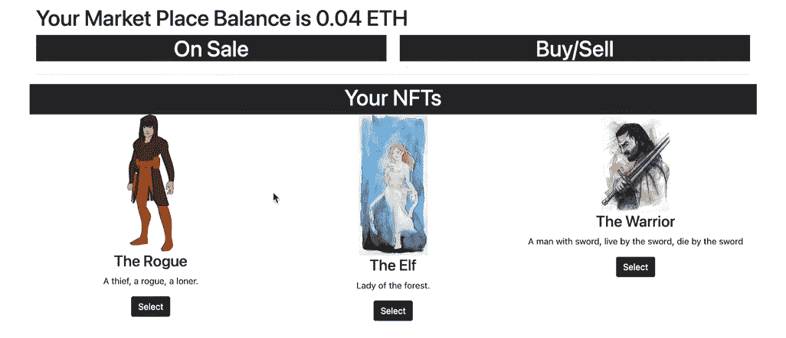
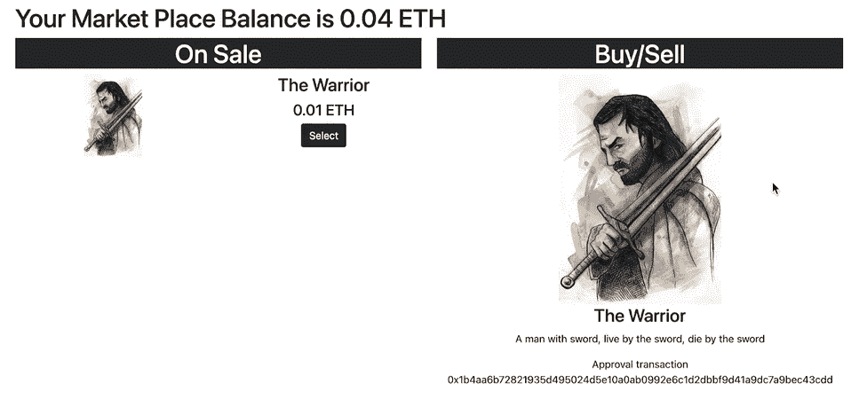
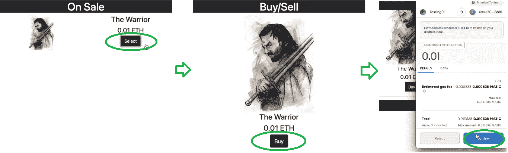
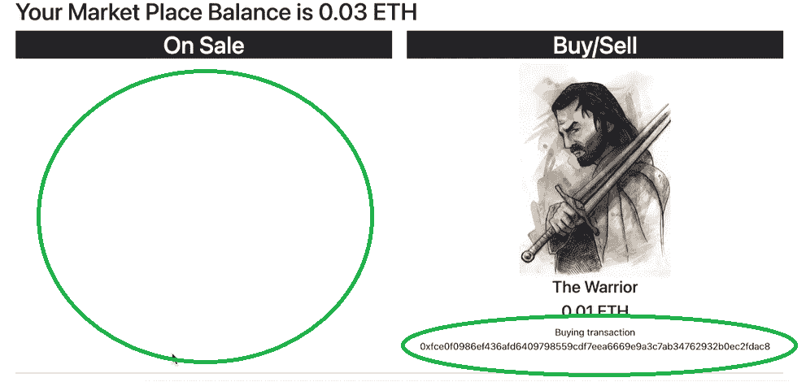
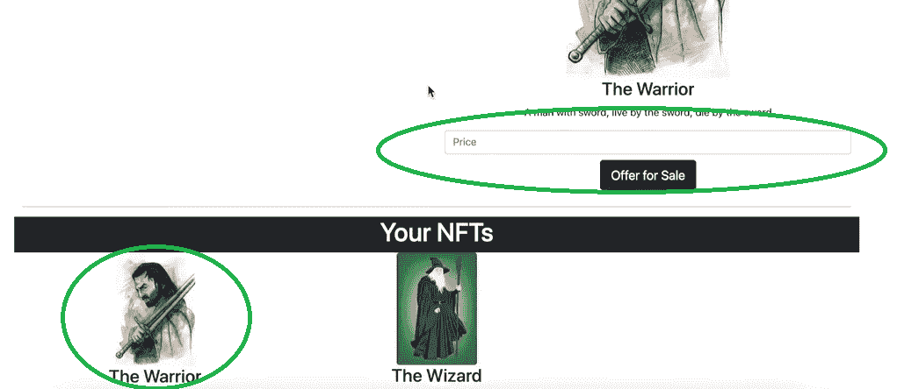
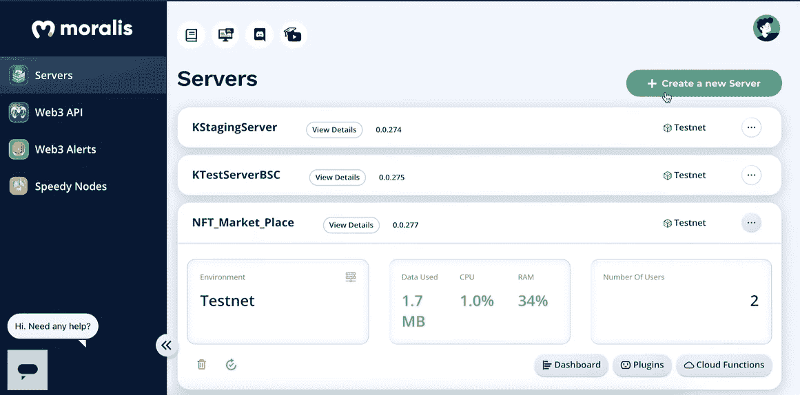
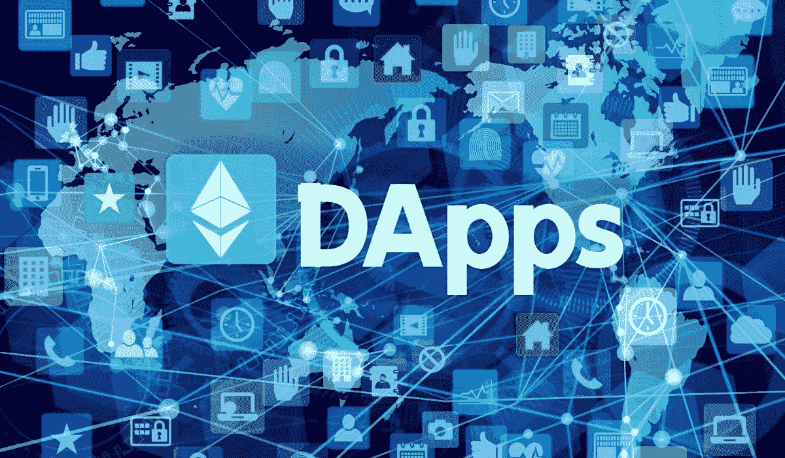
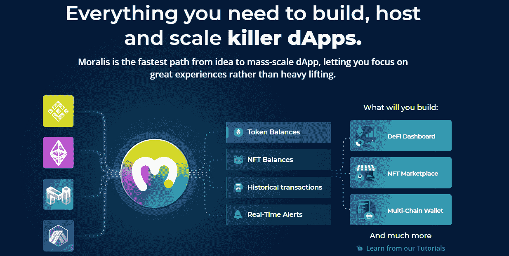

# 构建 NFT 交易界面-完整指南

> 原文：<https://moralis.io/build-an-nft-trading-interface-full-guide/>

毫无疑问，建立一个实用的、高质量的 NFT 交易界面应该是 NFT 代币开发课程的一部分。为 NFT 交易创建一个包含所有必要功能和组件的界面，对于用户如何发现你的 Web3 应用程序是否有价值也起着重要作用。此外，您可能已经注意到缺乏高质量的界面，更重要的是，缺乏开发 NFT 界面的实用解决方案。然而，当利用 Moralis 的终极 [**Web3**](https://moralis.io/the-ultimate-guide-to-web3-what-is-web3/) **开发平台(又名**[**Firebase for crypto**](https://moralis.io/firebase-for-crypto-the-best-blockchain-firebase-alternative/)**)时，您可以轻松构建一个吸引用户并使其在竞争中脱颖而出的 NFT 交易界面。**

在这份完整的指南中，你将学习如何使用 Moralis 来创建一个全功能的 NFT 界面，它将教你如何最大限度地利用这个[区块链开发者](https://moralis.io/how-to-become-a-blockchain-developer/)套件。此外，通过自己构建一个示例 NFT 交易界面，您将清楚地了解 Moralis 是如何处理与区块链相关的后端的。因此，它使你能够将你的资源投入到大多数 [dApps](https://moralis.io/decentralized-applications-explained-what-are-dapps/) (分散式应用)的最关键的方面——创建一个吸引人的和用户友好的界面。如果你有任何编程经验，你知道一个优秀的用户界面(UI)确保了一个伟大的用户体验(UX)，这导致了应用程序的成功。此外，特别是对于 NFT 交易界面，UI 必须是简单性和醒目外观的完美结合。此外，有了 Moralis 覆盖你的后端，你就有机会准确地交付它。



## 构建 NFT 交易界面-示例项目

如上所述，我们将接受构建一个示例 NFT 界面的挑战。我们鼓励你跟随我们的脚步，使用 [Moralis 的 SDK](https://moralis.io/exploring-moralis-sdk-the-ultimate-web3-sdk/) ，包括它的终极 [NFT API](https://moralis.io/ultimate-nft-api-exploring-moralis-nft-api/) ，构建你自己版本的 NFT 交易界面。接下来，我们将首先预览我们将要创建的示例 NFT 界面。接下来，我们将介绍必要的设置。最后，我们将带您浏览完成这个示例项目所需的代码。当然，我们鼓励你使用你的 [JavaScript](https://moralis.io/javascript-explained-what-is-javascript/) 技能来创建一个独特的 UI，这将为你的用户提供一个难忘的无缝 NFT 体验。

### 我们的 NFT 界面预览

在编程时，对你要创建的东西有一个清晰的印象是很重要的。因此，我们准备了一些 NFT 交易界面的截图，并附有解释，这应该可以清楚地描绘出我们的前进方向。



看上面的截图，你会注意到我们的示例 NFT 交易界面包括几个选项和功能。这些选项和功能如下:

*   显示登录用户的**本地令牌余额**。*你可以在我们的 dApp 顶部看到这个。重要的是，用户可以看到购买 NFTs 的可用令牌余额。*
*   监控我们市场上正在销售的 NFT。*这包含在“打折”部分(在上面的截图中是空的)。*
*   用户有机会**购买或出售 NFT**。*该选项包含在“购买/出售”部分，该部分显示用户决定采取行动(购买或出售)的 NFT。*
*   我们的 NFT 界面**还显示登录用户持有的收藏**。*“你的非关税壁垒”部分就是为这个目的服务的。*

*注意* *:在上面的截图中,“出售”和“购买/出售”部分都不包含 NFT，因为我们或使用我们的示例 NFT 交易界面(我们的市场)的任何其他用户都没有出售 NFT。*

### 预览我们的 NFT 界面-列出一个 NFT

在介绍了 NFT 界面的基础知识之后，现在让我们看看它是如何用于列出 NFT 的。我们首先在连接的钱包中选择一个 NFT。我们通过点击“您的 NFT”部分中的一个 NFT 下的“选择”按钮来完成此操作。


通过这样做，NFT 在“买入/卖出”部分变得可用，这表明我们可以对该 NFT 执行操作。这使我们有机会输入价格，并通过单击“出售要约”来出售选定的 NFT。接下来，我们的[元掩码](https://moralis.io/metamask-explained-what-is-metamask/)被自动提示，要求我们确认交易。 *MetaMask 是最好的认证工具之一，与 Moralis 完全集成。*确认交易后，应在链上进行处理(需要足够的资金)。交易完成后，我们可以在“特价”部分看到 NFT:



### 我们的 NFT 界面预览——购买 NFT

现在让我们来看看一个合适的 NFT 交易界面应该提供的第二个方面——购买非功能性交易。请记住，用户不能购买自己的 NFT。因此，我们使用另一个帐户来展示此功能。在下面的截图中，你可以看到我们使用另一个帐户购买上述 NFT。首先，我们关注“打折”部分，在这里我们点击 NFT 旁边的“选择”。这将显示在“买入/卖出”下(也称为“采取行动”部分)。接下来，我们单击所选 NFT 下的“购买”按钮，这将提示 MetaMask 进行确认:



交易确认后，NFT 购买成功。因此，它不再出现在“打折”区。但是，它现在出现在帐户的“您的 NFTs”部分。当然，这也给了新主人出售那辆 NFT 的选择权:



我们的预览到此结束。正如您所看到的，我们为我们的示例 NFT 交易界面采用了简单的设计。我们这样做是因为我们的 NFT 界面的目标是向您展示使用 Moralis 时令人印象深刻的后端功能。然而，当你创建自己的 NFT 交易界面时，一定要发挥你的创造力，以确保最吸引眼球的界面和最友好的用户体验。

## 用 Moralis 建立一个 NFT 交易界面

为了获得上一节展示的所有功能，我们需要以下后端特性和组件:

*   **用户认证**–*您的 NFT 界面必须能够认证用户(Web3 登录)。如果不登录，您的 dApp 就无法洞察他们的钱包和非功能性交易。*
*   **追踪用户余额**–*如果你还记得的话，我们的 dApp 会在顶部显示原生令牌的余额。因此，您需要能够实时跟踪用户的余额。*
*   **跟踪智能合约事件**–*如您所知，我们依赖于* [*智能合约*](https://moralis.io/smart-contracts-explained-what-are-smart-contracts/) *，它们是我们市场和其他智能合约的运营商，包括那些用于制造 NFT 以提供信号(事件)的智能合约。因此，我们必须有一种方法来跟踪我们的 dApp 中的智能合约事件。*

如果您过去采用过创建 dApp 的老式方法，那么您会知道 RPC 节点的[限制使得事情变得乏味且耗时。因此，将上述所有后端功能设置到位将花费您数周的时间。幸运的是，Moralis 使我们能够减少 90%的时间，主要是因为它使我们能够通过复制和粘贴来自](https://moralis.io/exploring-the-limitations-of-rpc-nodes-and-the-solution-to-them/) [Moralis 文档](https://docs.moralis.io/)的代码片段来覆盖我们 dApp 的整个后端。此外，Moralis 是所有关于跨链的互操作性，这意味着你可以创建一个多链 NFT 交易界面，反过来，未来证明你的工作。因此，确保遵循使用 Moralis SDK 所需的初始设置。


### 初始设置–创建 Moralis 服务器

无论你是想使用 Moralis 来建立一个 NFT 交易界面还是任何其他的 dApp，你都需要首先创建你的 Moralis 服务器。请按照以下步骤正确操作:

1.  [**创建您的免费 Moralis 账户**](https://admin.moralis.io/register)——点击链接，输入您的电子邮件，创建您的密码，点击确认链接将发送到您的电子邮件。然而，如果你已经有了一个 Moralis 账户，只需[登录](https://admin.moralis.io/login)就可以进入你的管理区。

2.  [**创建 Moralis 服务器**](https://docs.moralis.io/moralis-server/getting-started/create-a-moralis-server)–登录后，在导航选项卡中选择左侧的“服务器”选项卡。然后，点击右上角的“+创建新服务器”按钮，从下拉菜单中选择最适合您需求的网络类型(见下图)。*在处理示例项目时，总是选择“Testnet 服务器”选项(* [*连接到以太坊测试网*](https://moralis.io/ethereum-testnet-guide-connect-to-ethereum-testnets/) *)。*


接下来，将出现一个弹出窗口，询问服务器的详细信息。只需输入服务器名称(可以是您想要的任何名称)，选择您所在的地区，选择网络类型、链，然后单击“添加实例”按钮启动您的服务器:


3.  **访问服务器详情**–现在，您可以通过点击“查看详情”按钮来访问您的服务器详情:


你需要的所有信息都会显示在一个新窗口中。您可以通过单击复制图标来复制这些详细信息(一个接一个):


4.  **初始化 Moralis** *(暂时跳过)*–要获得 Moralis 所涵盖的所需后端功能，您需要填充您的编码文件(".env "[如果使用了 [Web3 样板文件](https://moralis.io/web3-boilerplate-beginners-guide-to-web3/)，"。js“，”。html“，”。jsx”等。)和 Moralis 服务器详细信息(应用程序 ID 和服务器 URL):


为了让你 [*用 Moralis 建造 dApps*](https://moralis.io/ultimate-guide-how-to-build-ethereum-dapps/) *，以上设置必不可少。幸运的是，您可以看到这些步骤是多么简单。现在您已经有了一个活动的服务器，您可以使用 Moralis 的* [*以太坊 API*](https://moralis.io/ethereum-api-develop-ethereum-dapps-with-moralis/) *。*

### 与 Moralis 同步并观察合同事件

Moralis 的一个重要特性是其同步和索引智能合同事件的能力。此外，如果你记得我们需要的功能列表，这是我们的待办事项。



使用 Moralis 创建同步事件很容易，您可以使用您的 Moralis 服务器(“查看详细信息”>“同步”选项卡)来完成。为了创建您的示例 NFT 接口，您将需要两个“监听器”(见下图)——一个用于检测新报价何时发出(卖出)，另一个用于知道报价何时结束(买入)。


除了“同步”功能，Moralis 还为您的服务器提供了一个数据库(Moralis dashboard)。您可以访问数据库中关于您的用户的实时链上数据，包括他们的令牌余额、交易历史、未决交易、NFT 等等。此外，这也是我们的听众发出信号的地方:


有了两个监听器和我们的数据库，我们就有了创建上述 NFT 交易界面所需的所有链上数据。

### 用 Moralis 构建 NFT 交易界面——代码概述

为了构建我们的示例 NFT 接口，我们需要包括两个部分。我们需要创建一个 dApp，这将是我们的市场授权合同运营商。此外，我们需要使用智能契约来确保所有事务都相应地执行。先说后者。

*注:* *您可以在* [*GitHub*](https://github.com/DanielMoralisSamples/25_NFT_MARKET_PLACE/blob/master/contracts/market_place.sol) *上访问我们的智能合约。*


以下是我们的智能合同涵盖的事件:

```js
contract MarketPlace{

    event OfferingPlaced(bytes32 indexed offeringId, address indexed hostContract, address indexed offerer,  uint tokenId, uint price, string uri);
    event OfferingClosed(bytes32 indexed offeringId, address indexed buyer);
    event BalanceWithdrawn (address indexed beneficiary, uint amount);
    event OperatorChanged (address previousOperator, address newOperator);
```

此外，我们的智能合约代码的其余部分定义了特定的函数，以确保完全涵盖上述四个事件。因此，我们确保事情遵循一般规则。例如，用户只能出售他们拥有的非功能性交易，而购买者只能购买列出的非功能性交易。此外，我们的智能合约还会将价格分配给有问题的令牌。



### 与 Moralis 建立 NFT 交易界面 dApp 部分

这是我们确保用户能够查看和使用我们的 NFT 界面的地方，如“我们的 NFT 界面的预览”部分所示。此外，有许多方法可以创建 dApps 然而，我们更喜欢使用 JavaScript。因此，我们在 Visual Studio 代码中创建了“ [logic.js](https://github.com/DanielMoralisSamples/25_NFT_MARKET_PLACE/blob/master/static/logic.js) ”、“ [cloudCode.js](https://github.com/DanielMoralisSamples/25_NFT_MARKET_PLACE/blob/master/moralis_cloud_code/cloudCode.js) ”和“[index.html](https://github.com/DanielMoralisSamples/25_NFT_MARKET_PLACE/blob/master/index.html)”文件，这些文件都在 GitHub 上供您使用。此外，我们的 dApp 的主要功能是通过“ *logic.js* ”文件实现的。这也是您完成“初始设置-创建 Moralis 服务器”一节的最后一步的地方。只需将您的 Moralis 服务器 URL 和应用程序 ID 粘贴到指定的代码行中:

```js
Moralis.initialize(""); // Application ID from moralis.io
Moralis.serverURL = ""; // Server URL from moralis.io
```

下面的代码行涵盖了我们的 dApp 的主要目的。通过使用“Moralis.authenticate()”，我们确保在对用户进行身份验证时执行正确的功能:

```js
 Moralis.authenticate().then(function(){
    populateNFTs();
    populateOfferings();
    populateBalance();
    subscribeOfferings();
    subscribeBuys();
    subscribeUpdateNFTs();
});
```

我们的代码使用“填充”和“订阅”功能。因此，它获得适当的数据，并巧妙地显示给我们的用户。这就是 Moralis 通过从“moralisDashboard”数据库中获取数据来完成所有繁重工作的地方。此外，这些是用于该目的的核心代码片段:

```js
Moralis.Query("PlacedOfferings")
Moralis.Query("ClosedOfferings")
Moralis.Query("PolygonNFTOwners")
Moralis.Cloud.run("getBalance", params)
Moralis.Units.FromWei(presentBalance)
Moralis.Cloud.run("placeOffering", params)
Moralis.Units.ETH(offering.price)
```

如果你对更详细的代码演练感兴趣，请务必观看下面的视频(从 6:35 开始)，在视频中，Moralis 专家会一步一步地指导你了解细节。

https://youtu.be/EMOYpgl5S1w

## 构建 NFT 交易界面-完整指南-摘要

我们希望你已经采纳了我们的建议，在我们的带领下建立了你自己的 NFT 交易平台。如果您这样做了，您现在应该知道 Moralis 为您提供了创建一个合适的 NFT 界面所需的所有后端功能。通过创建您的 Moralis 服务器并为我们提供给您的智能合约设置两个同步事件，您确保了您相应地获得了所有链上数据。剩下的工作很容易通过使用简短的代码片段并围绕它构建前端来完成。此外，我们希望你已经尽了最大努力为你的 NFT 界面创造一个令人惊叹的 UI。

展望未来，我们鼓励你参加 [Moralis YouTube 频道](https://www.youtube.com/c/MoralisWeb3)和 [Moralis 博客](https://moralis.io/blog/)上的其他示例项目，以提升你的区块链开发技能。我们的一些最新主题将向您展示如何[构建一个跨链桥](https://moralis.io/how-to-build-a-cross-chain-bridge/)，如何[使用 OpenSea API 替代方案](https://moralis.io/opensea-api-alternative-list-nfts-with-this-opensea-plugin/)，如何在以太坊上进行[无气体交易，面向开发者的](https://moralis.io/how-to-do-gasless-transactions-on-ethereum/)[元掩码](https://moralis.io/metamask-for-developers-how-to-launch-web3-apps-with-metamask/)，如何[在几分钟内创建一个 DAO](https://moralis.io/how-to-create-a-dao-in-10-minutes/) ，如何[构建一个预测市场 dApp](https://moralis.io/how-to-build-a-prediction-market-dapp/) ，如何[创建免费令牌](https://moralis.io/create-free-token-how-to-deploy-your-own-testnet-crypto-token-in-10-mins/)，如何[创建 NFT](https://moralis.io/create-nft-on-binance-smart-chain-full-guide/)

