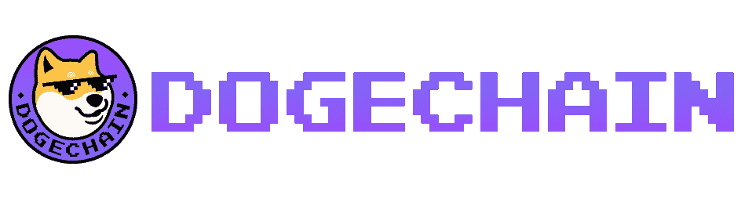
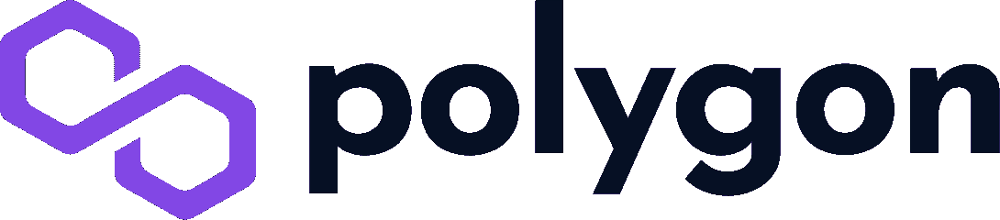
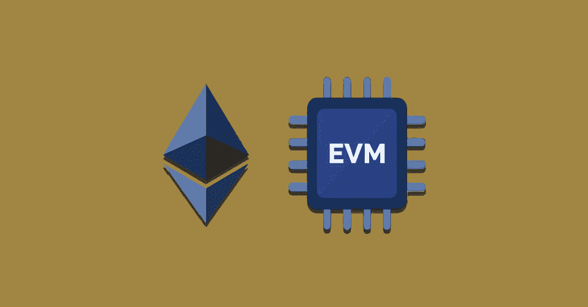

# 在 EVM 与 doge Cain 一起建造——什么是 Dogechain？

> 原文：<https://moralis.io/build-with-dogecoin-on-evm-what-is-dogechain/>

Dogecoin 是首批 meme 币之一，自 2013 年推出以来，经历了巨大的增长和巨大的价格波动，为早期投资者带来了令人难以置信的成功故事。然而，Dogecoin 的用例非常有限，除了销售或“HODLing ”, meme coin 没有提供多少实用功能——直到现在。随着最近 Dogechain 的推出，这个受狗启发的令牌可能会有所不同。Dogechain 是一个 EVM 兼容的，基于多边形边缘的区块链，通过增加它的用例来增强 doge chain。此外，Dogechain 通过促进 Web3 功能(如 NFT 铸币、访问 DeFi 项目和构建 dapps(分散式应用程序))增强了 Dogecoin 的效用。如果您对此感兴趣，请跟随我们探索 Dogechain 的复杂性以及如何使用 doge chain 进行构建！T3】

由于 Dogechain 是 EVM 兼容的，您可以利用许多用于以太坊开发的相同工具、平台和编程语言在 Dogechain 网络上构建 doge chain。这表明您可以在 Dogechain 开发工作中利用 JavaScript 和 Solidity 等语言，以及 Moralis 的[可伸缩 Web3 基础设施](https://moralis.io/scale/)！

使用 [Moralis](https://moralis.io) ，您可以通过其各种 Web3 APIs 充分释放区块链技术的力量。Moralis 的 API 弥合了 Web2 和 Web3 开发之间的差距，允许您更快、更有效地构建 dapps。例如，查看 Moralis 的 [Web3 Streams API](https://moralis.io/streams/) ，使您能够通过 [Web3 webhooks](https://moralis.io/web3-webhooks-the-ultimate-guide-to-blockchain-webhooks/) 将[的链上数据](https://moralis.io/on-chain-data-the-ultimate-guide-to-understanding-and-accessing-on-chain-data/)传输到您项目的后端。此外，Streams API 具有跨链功能，这意味着您可以构建与多个区块链网络兼容的 dapps 和 Web3 项目。

因此，无论你是想在 Dogechain 还是其他区块链建造 dapps，Moralis 都是你的首选。因此，[立即与 Moralis](https://admin.moralis.io/register) 签约，充分利用区块链技术的潜力！

## Dogechain 是什么？

Dogechain 最初是作为“Dogecoin 的第二层”引入的；然而，这种描述并不完全准确，因为 Dogechain 并不是建立在 Dogecoin 区块链之上的。更准确地说，Dogechain 是一个在多边形网络上运行的 PoS(proof-of-stage)区块链。Polygon 是以太坊最著名的 EVM 兼容侧链之一，是 Dogechain 共享的一个功能。

Dogechain 旨在通过提高流行的迷因硬币的效用来增强 Dogecoin。此外，Dogecoin (DOGE)是第一个非常成功的迷因硬币之一；然而，DOGE 有其局限性。硬币主要是一种在线支付手段，这一功能不再独特，因为大多数加密令牌都提供这一功能。因此，这就是 Dogechain 进入等式的地方！

Dogechain 的主要目的是通过启用 Web3 特性来扩展 Dogecoin 的用例数量，例如构建 dapps、创建 NFT、访问 DeFi 平台等等！

Dogechain 令牌称为$DC，网络参与者可以使用该令牌参与链的 PoS 管理。除了$wDOGE(我们将在下一节中进一步探讨)，$DC 可用于支付 Dogechain 网络上的交易。此外，整个$DC 代币供应是在 mainnet 发布时预先确定的。与此同时，该协议同时铸造了 1000 个$wDOGE 代币，作为过渡汽油费的燃料。

值得注意的是，尽管 Dogechain 和 Dogecoin 的名字彼此相似，但它们之间或它们背后的组织之间没有直接的从属关系。Doge 基金会和 Dogecoin 的创始人杰克逊·帕尔默和比利·马库斯都表示了这种缺乏联系的情况。

现在，随着对 Dogechain 更深刻的理解，让我们仔细看看网络在实践中是如何工作的！

## Dogechain 是如何工作的？

Dogechain 是一个依赖于 Polygon 的多边形边缘框架的 EVM 兼容的区块链。Polygon Edge 是专门为创建可扩展的以太坊兼容的区块链网络而设计的。此外，由于 Dogechain 是使用 Polygon 构建的，因此链会自动继承父协议的一些属性。

多边形边缘有几个优点，一个是 EVM 兼容性。因此，Dogechain 还在其操作核心使用了基于 EVM 的代码执行结构。因此，开发人员可以使用基于以太坊的工具和编程语言铸造令牌、开发 dapps、DeFi 平台等等！

然而，尽管 Dogechain 是基于多边形边的，但值得注意的是，它在几个方面与许多其他区块链不同。例如，它没有利用 Polygon 的“安全特性”功能，而是依赖于它自己的验证器集合。因此，Dogechain 在确保网络安全方面非常独特。

此外，Dogechain 生态系统的另一个重要组成部分是跨链协议，它是 Dogecoin 和 Dogechain 之间的纽带。该协议使用户能够用他们的 DOGE 来交换 wDOGE 令牌，wDOGE 令牌代表“包装的 DOGE”。跨链协议要求 1:1 的比率。因此，如果你想包装你的代币，你可以用一个金币换取一个金币。该协议还提供了销毁 wDOGE 令牌的选项，允许您撤回 DOGE 作为回报。

然而，跨链协议，结合 EVM 兼容性，为 Dogecoin 提供了更大的效用。因此，网络增加了 Dogecoin 的使用案例数量，允许持有者做更多的事情，例如铸造令牌和 NFT，参与 DeFi 协议，当然，还有构建 dapps！

但是，如何在 Dogechain 上构建呢？如果您想了解更多这方面的内容，请跟随下一节提供的答案！

## 如何在 Dogechain 上构建？–用 Dogecoin 构建

由于 Dogechain 是基于 EVM 的，这意味着构建 Dogechain dapps 的过程与以太坊的开发有许多相似之处。因此，您可以选择使用您已经熟悉的工具、平台和编程语言，在 Dogechain 上使用 Dogecoin 进行构建。更重要的是，只需对原始代码稍加修改，就可以轻松地将当前的 dapps 和其他平台连接到 Dogechain！

所以，如果你想在 Dogechain 上使用 Dogecoin，你可以利用你已经精通的技能。这包括 JavaScript、智能合约开发的可靠性等。此外，您还可以使用优秀的开发工具，如 Truffle、Hardhat，当然还有 Moralis 的[web 3 API](https://moralis.io/web3-apis-exploring-the-top-5-blockchain-apis/)来帮助您的开发工作。

即使 Moralis 不直接支持 Dogechain，也可以使用 Moralis 的 [EVM API](https://moralis.io/evm-api/) 快速构建兼容 EVM 的 dapps，只需稍加修改就可以轻松连接到 Dogechain。因此，当使用 Moralis 时，您可以更快、更有效地使用 Dogecoin 进行构建！

Moralis 的 EVM API 提供了快速获取链上数据所需的一切，这是大多数区块链开发工作必不可少的任务。此外，这意味着你，除了别的以外，可以获取块信息，令牌价格，DeFi 流动性数据，用户余额等。此外，EVM API 是一个所谓的 REST API。这意味着默认情况下，它可以在任何编程语言中被调用。因此，可以通过多个平台和 dapps 从任何 EVM 区块链获取数据！

如果你想了解更多关于创建 EVM 兼容的 dapp 的复杂性，我们建议查看我们关于如何构建 Web3 应用的文章。本教程与 Dogechain 没有直接关系；然而，稍作调整，你应该能够快速原型 EVM dapp 和连接到 Dogechain！

## 什么是 EVM 链？

在整篇文章中，我们连续几次提到 EVM，你可能需要澄清这是什么意思。因此，我们将在这一节深入探究 EVM 的错综复杂，并回答这个问题，“什么是 EVM 链？”。

所有分布式区块链网络都需要一个虚拟机来处理和执行链上事务。比特币的虚拟机相对简单，因为比特币区块链的核心目的是处理交易。然而，当涉及到以太坊等平台时，事情变得更加复杂，因为它们处理图灵完全智能合约。因此，以太坊使用了一种叫做 EVM 的特殊虚拟机。

你可能已经猜到了，EVM 是“以太坊虚拟机”的缩写。此外，它还具有一系列独特的必备功能:

*   **决定论**–EVM 以决定论为特色，这对于智能合约至关重要。如果一个程序永远向相同的输入提供相同的输出，那么它就是确定性的。因此，确定性确保网络用户可以确定智能合同的结果。

*   **可终止的**–并不总是能够判断智能合约是否能够在给定的时间内完成所有操作。因此，智能合约需要一个终止机制。此外，EVM 使用天然气来定义智能合约的生命周期。

*   **隔离**–EVM 智能合约需要在隔离的环境中运行。因此，如果某些东西影响了合同(比如 bug 或 hacks)，它不应该影响底层协议。

现在，对 EVM 有了更深刻的理解，回答“什么是 EVM 链？”这个问题就变得相对容易了。简而言之，EVM 兼容的区块链本质上是支持在类似于 EVM 的环境中执行代码的网络。这样做的一个重要好处是互操作性。这意味着开发人员不需要为各种现有网络从头开始构建协议！

## Dogechain Dapps 示例

尽管 Dogechain 是一个相对较新的网络，但 Dogechain 生态系统已经托管了几个不同的 dapps 和 Web3 平台。本节涵盖了 Dogechain 网站上的一些 dapps。然而，由于时间有限，我们将只讨论以下三个示例:狗交换、OASIS 和狗外出。

*   **Dog Swap**–Dog Swap 是一个社区驱动的 DEX(去中心化交易所)，专门从事 Dogechain 资产。该平台的特点是交易费用低，结算速度快，民主分配。

*   **OASIS**–OASIS 是 Dogechain 网络上的一个分散的 NFT 市场。这个平台允许你买卖基于 ERC-721 标准的 NFT。更重要的是，绿洲还拥有一个 NFT 探险者。这个探索者提供 Dogechain 上存在的任何 ERC-271 资产的信息。

*   **dog egress**–dog egress 是一个 DAO 或“去中心化自治组织”。Dao 通常指 Web3 项目或协议的管理机构。此外，这种去中心化的治理平台使得 Dogechain 社区成员可以轻松地创建提案并进行投票。有资格参与这些决策过程的成员通常需要持有 Dogechain 的本地$DC 令牌。

然而，这只是三个由 Dogechain 驱动的 dapps，还有更多需要您自己去发现。但是，要小心。请记住，生态系统相对较新。因此，在尝试任何基于 Dogechain 的平台之前，要做充分的研究！

## 总结–在 EVM 与 Dogecoin 一起建造

Dogecoin 是首批成功的 meme 币之一，自推出以来的过去九年里，它已经取得了令人难以置信的增长。然而，Dogecoin 主要用作在线支付的手段，意味着硬币的效用相对微薄。因此，开发 Dogechain 是为了增加 Dogecoin 用例的数量！

Dogechain 是一个 EVM 兼容的基于多边形边缘的区块链，旨在增加 doge chain 的效用。此外，该平台支持 Web3 功能，如访问 DeFi(分散金融)平台、铸造代币、开发 dapps(分散应用)等。，使用 Dogecoin。此外，由于区块链是 EVM 兼容的，所以在进行 Dogechain 开发时，您可以选择使用您已经熟悉的开发工具和语言。这包括熟练的 Web3 开发工具，如 Moralis 的 Web3 APIs，以及著名的语言，如 JavaScript 和 Solidity。因此，如果您熟悉 Web3 开发空间，那么如果您想在 Dogechain 上使用 Dogecoin 进行构建，将会很容易甚至不会遇到任何问题！

如果你觉得这个指南很有帮助，请点击 [Web3 博客](https://moralis.io/blog/)查看更多 Moralis 独特的 Web3 开发内容。例如，你可以了解所有你需要知道的关于[跨链桥接](https://moralis.io/cross-chain-bridging-deep-dive/)或如何[上传文件到 IPFS](https://moralis.io/how-to-upload-files-to-ipfs-full-guide/) ！

更重要的是，如果你想磨练你的 Web3 开发技能，考虑报名参加[Moralis 学院](https://academy.moralis.io)。该学院为新的和更有经验的开发人员提供一系列高质量的区块链课程。如果这听起来很有趣，请通过“[区块链&比特币 101](https://academy.moralis.io/courses/blockchain-bitcoin-101) ”或“[以太坊 101](https://academy.moralis.io/courses/ethereum-101) ”课程开始您的 Web3 开发之旅！

然而，无论你想创建什么样的 Web3 项目，[与 Moralis](https://admin.moralis.io/register) 签约，充分利用区块链技术的潜力。你可以创建一个完全免费的账户，只需要几秒钟，所以你不会有任何损失！