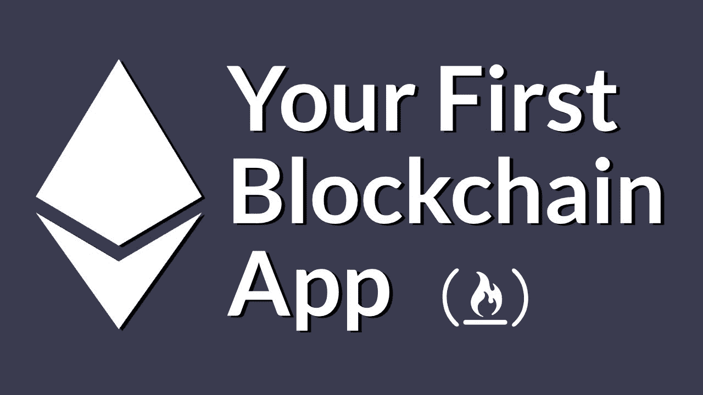
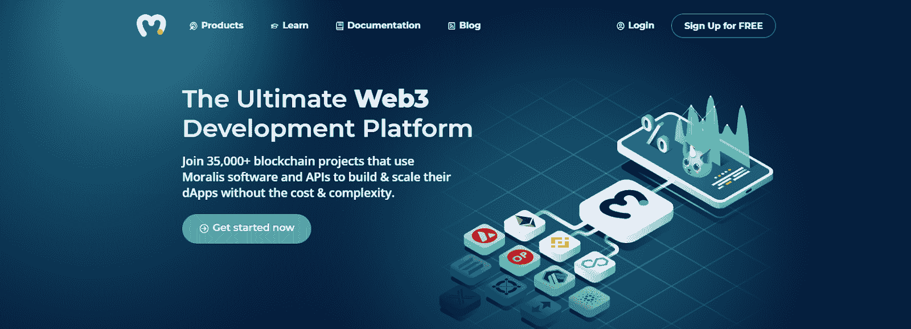
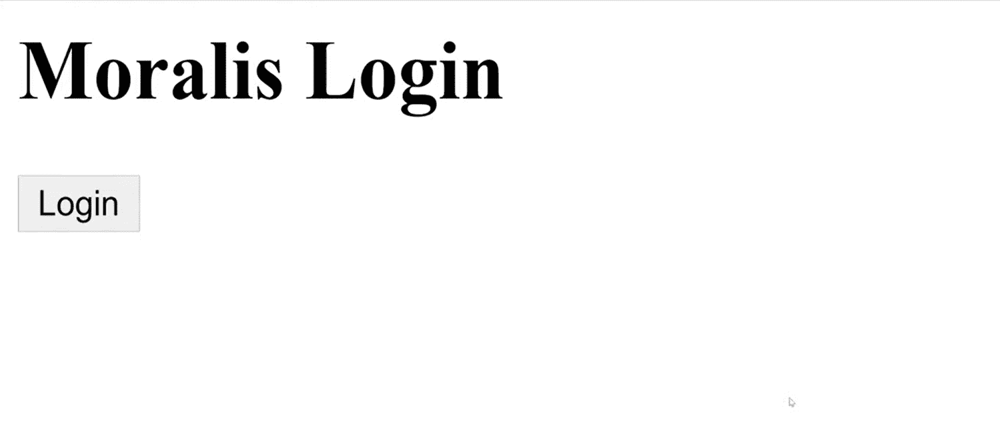
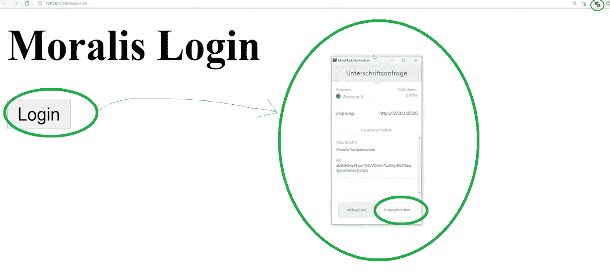
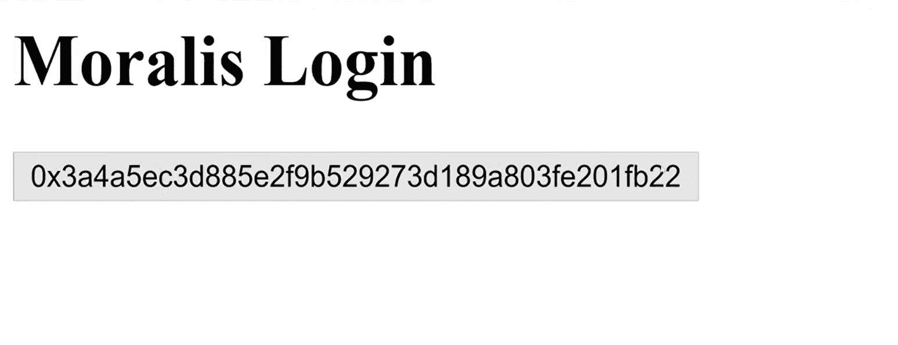
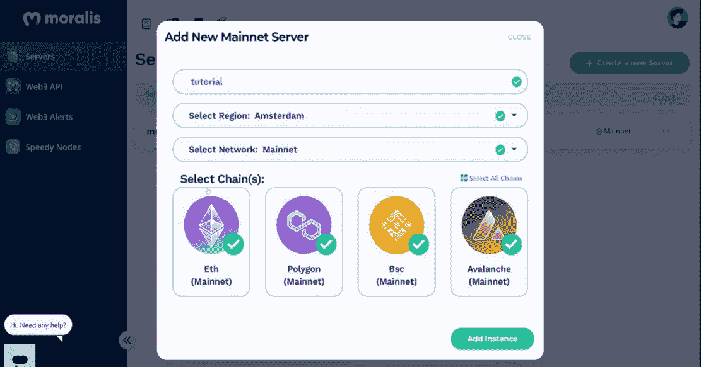
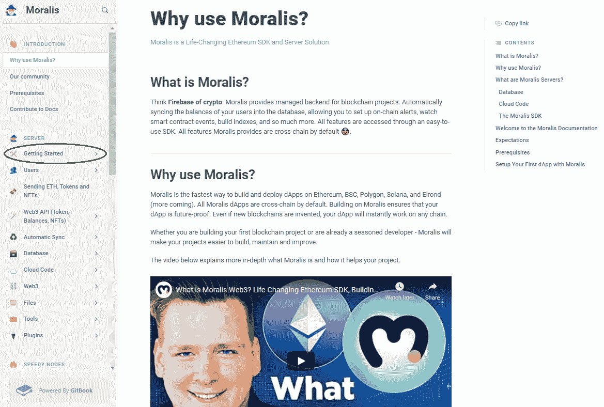
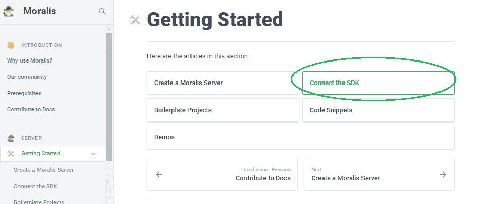
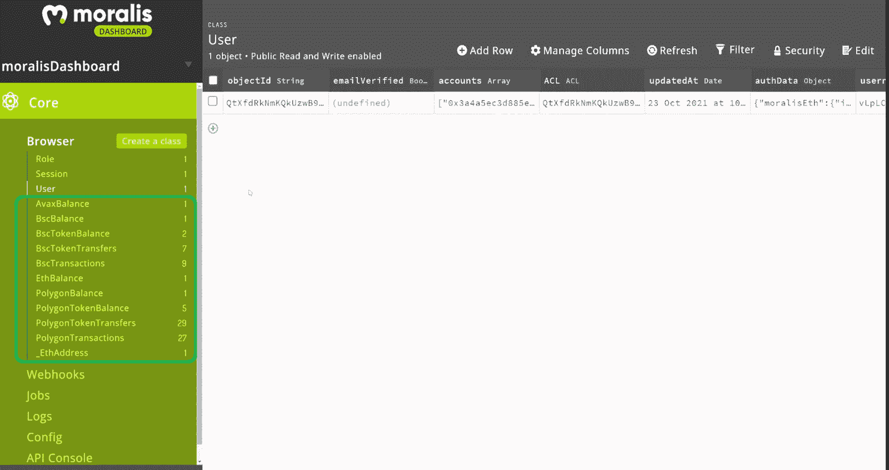

# 构建您的第一个 dApp–以太坊教程

> 原文：<https://moralis.io/build-your-first-dapp-ethereum-tutorial/>

**如果你是一名** [**dApp**](https://moralis.io/decentralized-applications-explained-what-are-dapps/) **开发者，你一定渴望学习如何在以太坊上构建你的第一个 dApp。此外，即使你不是一个开发新手，以太坊 dApp 教程也是非常有益的，在开发 dApp(分散式应用程序)时可以作为一个很好的复习工具。因此，这个**[**web 3**](https://moralis.io/the-ultimate-guide-to-web3-what-is-web3/)**dApp 教程将被证明对有经验的程序员和有志于** [**成为区块链开发者的人很有帮助。因此，对于那些想要创建他们的第一个基于以太坊的 dApp 并且一直在问“如何在以太坊上构建 dApp”的人来说，本教程将展示在以太坊区块链上创建分散式应用程序的过程在使用诸如 Moralis 这样的工具时是多么简单和容易。**](https://moralis.io/how-to-become-a-blockchain-developer/)

在这篇文章中，你将学习到[Moralis](https://moralis.io/)ultimate[web 3](https://moralis.io/the-ultimate-guide-to-web3-what-is-web3/)开发平台的基础知识。使用该平台使得构建以太坊 dApps 跨链具有可操作性。这意味着你可以在以太坊的链上建立你的第一个 dApp，它也可以在其他领先的链上运行，比如[币安智能链](https://moralis.io/bsc-programming-guide-intro-to-binance-smart-chain-development-in-10-minutes/)(BSC)[多边形](https://moralis.io/how-to-build-polygon-dapps-easily/)，[雪崩](https://moralis.io/how-to-build-avalanche-dapps-in-minutes/)。除了跨链互操作性，Moralis 还为您提供了一个 [ultimate Web3 SDK](https://moralis.io/exploring-moralis-sdk-the-ultimate-web3-sdk/) ，包括[以太坊 API](https://moralis.io/ethereum-api-develop-ethereum-dapps-with-moralis/) ，这使得区块链开发变得有趣、快速和简单。

使用 [Moralis Speedy Nodes](https://moralis.io/speedy-nodes/) 时，Moralis 还能让你避免处理 RPC 节点的[限制。此外，Moralis 也是最好的](https://moralis.io/exploring-the-limitations-of-rpc-nodes-and-the-solution-to-them/) [Infura 替代品](https://moralis.io/infura-alternatives-and-blockchain-node-providers/)之一。使用您的 [JavaScript](https://moralis.io/javascript-explained-what-is-javascript/) 技能，您可以轻松部署出色的 Web3 应用程序。此外，由于 Moralis 涵盖了您的后端需求，您可以将精力投入到前端，从而提供最佳的用户体验。那么，你准备好建立你的第一个 dApp 了吗？



## **与 Moralis 一起建立你的第一个 dApp】**

如果您要围绕 [RPC 节点](https://moralis.io/ethereum-rpc-nodes-what-they-are-and-why-you-shouldnt-use-them/)构建以太坊 dApps，并创建一个适当的基础设施来登录或验证用户，显示用户的硬币或令牌余额，查看他们的交易，并使他们能够发送和接收加密资产，这将花费您数周甚至数月的时间。然而，当您使用 Moralis 时，您可以在几分钟内用简短的代码片段涵盖所有这些方面。

此外，开始使用 Moralis 也很简单，创建一个帐户是免费的。事实上，在构建以太坊 dApps 时，你需要完成一些特殊的步骤来使用 Moralis。本质上，您需要创建一个 Moralis 服务器，然后在代码中使用该服务器的详细信息来访问 Moralis 的后端功能。

有了这个设置，你只需从 [Moralis 的文档](https://docs.moralis.io/)中为不同类型的 Web3 功能复制并粘贴单行代码。后者涵盖了您的后端需求。当然，接下来就要靠你的前端创造力来确保你围绕它构建出最好的用户界面(UI)。然而，我们在 [Moralis 的 YouTube 频道](https://www.youtube.com/c/MoralisWeb3)上为你提供了一些非常棒的想法，可以作为一个很好的起点。

因此，以下是用 Moralis 建造以太坊的必要步骤:

1.  创建您的免费 Moralis 账户。
2.  创建你的 Moralis 服务器。
3.  连接到您的 Moralis 服务器。
4.  启动 Moralis 的 SDK。
5.  从 Moralis 的文档中复制并粘贴简短的代码片段。
6.  利用您的 JavaScript 熟练程度，让您的 dApps 看起来很棒并且用户友好。



## **构建您的第一个 dApp–示例项目**

由于这可能是你第一次上 [Moralis 的博客](https://moralis.io/blog/)，我们需要指出，我们相信通过采取行动来学习。因此，我们通过承担简单的示例项目来尝试解决区块链开发的不同方面，您可以很容易地跟随。因此，我们将成为您构建第一个 dApp 的向导。本质上，我们将经历上面列出的每一个步骤，从而教你如何正确地设置和开始。然后，您将能够使用这些知识来构建具有更高级功能的以太坊 dApps。此外，由于 Moralis 的跨链互操作性，您也可以使用相同的原则在任何其他支持的链上创建 dApps。

出于这个示例项目的目的，我们将创建一个相对基本的 dApp，除了能够登录(验证)用户之外，没有任何特殊的功能。正如您将看到的，这个基本特性为您提供了添加其他功能所需的一切。正是这一基本功能让用户进入了区块链领域。

这是你第一个 dApp 的图片:



幸运的是，Moralis 为您提供了多个[以太坊认证](https://moralis.io/ethereum-authentication-full-tutorial-to-ethereum-login-programming/)选项，易于实施。出于这个示例项目的目的，我们将使用[元掩码认证](https://moralis.io/how-to-authenticate-with-metamask/)。因此，当用户登陆上图所示的界面时，他们可以点击“登录”按钮，这将提示他们的[元掩码](https://moralis.io/metamask-explained-what-is-metamask/)扩展:



接下来，他们需要点击“确认”按钮。此外，对于本例，我们将让 dApp 在用户成功登录后显示他们的地址:



### **Moralis 设置–建造以太坊 dApps 的开始**

为了使用 Moralis 并在几分钟内构建您的第一个 dApp，您需要完成以下步骤:

1.  [**创建您的 Moralis 家账户**](https://admin.moralis.io/register)——如果您还没有创建您的免费 Moralis 家账户，请务必现在就创建。单击上面的链接，输入您的电子邮件地址，并创建您的密码。然后，通过确认您的电子邮件地址来完成该过程(您将收到一封带有确认链接的电子邮件)。*如果您已经有了一个有效的 Moralis 帐户，只需* [*登录*](https://admin.moralis.io/login) *并进入您的管理区。*T12
    T14*T16】*
2.  **创建新服务器**–在您的 Moralis 管理区域，点击右上角的“+创建新服务器”按钮。将出现一个下拉菜单，提供几个网络类型选项(见下图)。由于这是一个示例项目，我们建议使用“Testnet 服务器”选项。然而，一旦您准备好部署全功能的 dApps，您将需要选择“Mainnet 服务器”选项。


在出现的弹出窗口中，输入所需的服务器详细信息。后者包括服务器名称(这可以是您想要的任何名称)，选择区域、网络、链(您可以选择一个或多个选项)，然后单击“添加实例”。服务器启动需要一些时间，请耐心等待。



3.  **访问服务器详细信息**–一旦您的服务器准备就绪，您就可以访问它的详细信息。您可以通过单击服务器名称旁边的“查看详细信息”按钮来完成此操作。


接下来，您将看到一个弹出窗口，其中包含您需要的所有信息:


4.  **初始化 Moralis 规范**–现在填充您的”。js“或者”。html”文件，其中包含 Moralis 服务器的详细信息(应用程序 ID 和服务器 URL ),以获得所需的后端功能:


*注意* *:确保使用您特定服务器的详细信息和* ***而不是*** *上图中的信息。*

## **构建你的第一个 dApp——HTML 结构**

为了给我们的示例 dApp 提供结构，我们需要创建一个 HTML 文件。这也将使我们能够在浏览器中查看它。此外，为了帮助您养成使用 Moralis 文档的习惯(这是业界最好的文档之一)，我们将使用它来帮助您构建您的第一个 dApp。



查看上图，您可以在左侧的导航菜单中看到“[入门](https://docs.moralis.io/moralis-server/getting-started)”部分。这一类别为你提供了构建你的第一个 dApp 所需的所有细节，包括如何[创建一个 Moralis 服务器](https://docs.moralis.io/moralis-server/getting-started/create-a-moralis-server)的详细说明，我们已经在上面介绍过了。因此，让我们关注一下[连接 Moralis 的 SDK](https://docs.moralis.io/moralis-server/getting-started/connect-the-sdk) :



在下一页，你会看到如何在你的网页上添加 Moralis 的详细说明。此外，您还可以使用 HTML 样板代码，其中已经包含了脚本、登录和注销按钮。因此，您可以简单地将代码复制并粘贴到在代码编辑器中创建的“index.html”文件中(我们使用 Visual Studio Code [VSC])。然而，为了这个示例项目的目的，我们将从普通代码开始。然后，我们将添加必要的元素来获得我们所追求的基本功能。

### **构建您的第一个 dApp–代码演练**

如上所述，我们将从一个基本的 HTML 结构开始:

```js
<html>
  <head>
    <title>Moralis</title>
  </head>

  <body>
    <h1>Moralis Login</h1>

    <button id="login">Login</button>

  </body>
</html>
```

接下来，我们需要初始化 SDK。在上面的“Moralis 设置”一节中，我们已经完成了这一部分的大部分工作。然而，由于我们那时还没有准备好 HTML 文件，现在是实现这一步的时候了。使用 Moralis 的文档，并将“初始化 SDK”部分中的代码复制到“连接 SDK”部分下:

```js
const serverUrl = "https://xxxxx/server";
const appId = "YOUR_APP_ID";
Moralis.start({ serverUrl, appId });
```

您必须将上面的代码行添加到“”中。此外，确保用您实际的服务器 URL 和应用程序 ID 填充空格。接下来，我们需要在" "里面添加两个脚本来激活 Moralis 和 Web3:

```js
<script src="https://cdn.jsdelivr.net/npm/[email protected]/dist/web3.min.js"></script>
<script src="https://unpkg.com/moralis/dist/moralis.js"></script>
```

剩下的就是添加“***moralis . authenticate***”函数，该函数会将功能添加到“登录”按钮中。同样，我们在按钮上添加了“***”onclick = " log in()*“**”。将所有这些放在一起，这就是您现在应该拥有的 HTML 代码:

```js
<html>
  <head>
    <title>Moralis</title>
    <script src="https://cdn.jsdelivr.net/npm/[email protected]/dist/web3.min.js"></script>
    <script src="https://unpkg.com/moralis/dist/moralis.js"></script>
  </head>

  <body>
    <h1>Moralis Login</h1>

    <button onclick=”login()” id="login">Login</button>

    <script>
       const serverUrl = "https://xxxxx/server";
       const appId = "YOUR_APP_ID";
       Moralis.start({ serverUrl, appId });

       async function login() {
           Await Moralis.authenticate()
       }

    </script>

  </body>
</html>
```

现在，运行代码来访问您的 dApp。此外，确保准备好元掩码扩展，以便能够检查功能。因此，如果您已经相应地遵循了这些步骤，那么您现在应该有了一个功能完整的 Web3 应用程序。

## **使用 Moralis 仪表盘构建以太坊 dApps】**

我们指出，我们将帮助您构建您的第一个 dApp，它只具有认证功能。但是，现在让我们向您展示一下对用户进行身份验证后的强大功能。在继续之前，确保运行 dApp 并使用 MetaMask 登录。

通过使用 Moralis，您还可以完全访问 Moralis 仪表板。这是存储用户详细信息的地方，例如他们的令牌余额和交易。此外，这是一个实时数据库，这意味着它会根据最新的区块链状态不断更新。通过访问所有这些信息，您可以轻松地为您的 dApps 添加大量功能。

要访问您的 Moralis 仪表板，请转到您的 Moralis 管理区，然后转到“服务器”部分。然后点击服务器名称右侧的三个点，然后点击“仪表板”按钮:


按照上述步骤，您将访问 dApp 的 Moralis 仪表盘:



查看左侧的部分，您可以看到所有支持的链(创建 Moralis 服务器时选择的链)的详细信息就在那里。此外，当包含这些选项的用户登录时，仪表板会自动添加新选项。例如，我们的仪表板中还没有列出 NFT 余额，因为我们用来登录的钱包中没有 NFT。但是，如果在任何受支持的链上有 NFTs 的用户要登录，我们也可以使用这些部分。

我们希望您能看到 Moralis 仪表板为您提供的大量选项。结合 Moralis 的 ultimate [Web3 API](https://docs.moralis.io/moralis-server/web3-sdk/intro) ，后者提供了在创纪录的时间内构建最先进的以太坊应用程序所需的一切。

## **构建您的第一个 dApp——以太坊教程——摘要**

谁说建造以太坊 dApps 很难？在上面的章节中，我们证明了您可以在几分钟内构建您的第一个 dApp。当然，我们关注的是完整的基础，然而，这足以向您展示，一旦您使用一个简单的代码片段——“**moralis . authenticate**”让您的用户参与进来，就可以获得各种可能性。此外，通过使用 Moralis，您有机会更快地构建跨链的功能性 dApps。得益于 Moralis 服务器和 Moralis 仪表盘，您拥有了访问和处理实时链上数据所需的一切。因此，您可以通过创建一个吸引人的 UI 来关注用户的体验。

如果你对自己的 JavaScript 能力有信心，那么你就有能力承担更高级的项目。例如，你可以[创建一个 DeFi 仪表板](https://moralis.io/how-to-create-a-defi-dashboard-in-5-steps/)、 [BEP20](https://moralis.io/what-is-bep20-full-binance-smart-chain-token-guide/) 代币、[生成 NFT](https://moralis.io/how-to-generate-nfts-full-guide/)、[创建一个 NFT 市场](https://moralis.io/how-to-create-an-nft-marketplace/)或[批量造币 NFT](https://moralis.io/how-to-bulk-mint-nfts-batch-minting-guide/)，这里仅列出几个选项。此外，你也可以将你的 React 原生技能用于[创建移动以太坊 dapp](https://moralis.io/create-mobile-ethereum-dapp-with-react-native-template/)。当您将前端开发技能与 Moralis 结合起来时，构建以太坊 dApps 就变成了一个简单的过程。此外，您甚至可以通过使用 Moralis 提供的终极[以太坊 dApp 样板](https://moralis.io/ethereum-dapp-boilerplate-full-ethereum-react-boilerplate-tutorial/)来进一步简化这个过程。

此外，如果你不精通 JavaScript，我们鼓励你参加[Moralis 学院](https://academy.moralis.io/)的 [2021 区块链开发者 JavaScript 编程](https://academy.moralis.io/courses/javascript-programming-for-blockchain-developers)课程。这样，你将学会这种有用的编程语言，并准备在最有前途的行业中使用它。此外，您可以随意探索[Moralis 学院](https://academy.moralis.io/)的其他优质课程。

