# 使用元掩码构建 dApps

> 原文：<https://moralis.io/building-dapps-with-metamask/>

[**分散的应用**](https://moralis.io/decentralized-applications-explained-what-are-dapps/) **(dApps)每天都被部署在可编程的区块链上，如** [**以太坊**](https://moralis.io/full-guide-what-is-ethereum/) **。作为一名** [**区块链开发者**](https://moralis.io/how-to-become-a-blockchain-developer/) **，利用工具使 dApp 开发过程更加简单是必不可少的。因此，使用元掩码构建**[**web 3**](https://moralis.io/the-ultimate-guide-to-web3-what-is-web3/)**应用程序及其** [**以太坊认证**](https://moralis.io/ethereum-authentication-full-tutorial-to-ethereum-login-programming/) **功能使事情变得简单了许多。此外，当使用 Moralis 时，您可以在创建 dApps 时利用它的默认元掩码集成。所以用 MetaMask 和 Moralis 开发 dApps 是每个开发者都应该做的事情。**

难怪 MetaMask 仍然是最受欢迎的钱包。不仅在 DeFi 用户中，而且在开发者中。此外，使用 MetaMask 结合正确的工具构建 dApps 变得非常简单。如果有一种工具能让一切变得不同，那就是[Moralis。这个终极的 Web3 开发平台提供了与 MetaMask 的完全集成。因此，它使您能够使用这个钱包作为您和您的用户进入 Web3 领域的门户。因此，我们邀请你加入我们，让我们更仔细地看看如何用 MetaMask 构建 dApps。](https://moralis.io/)

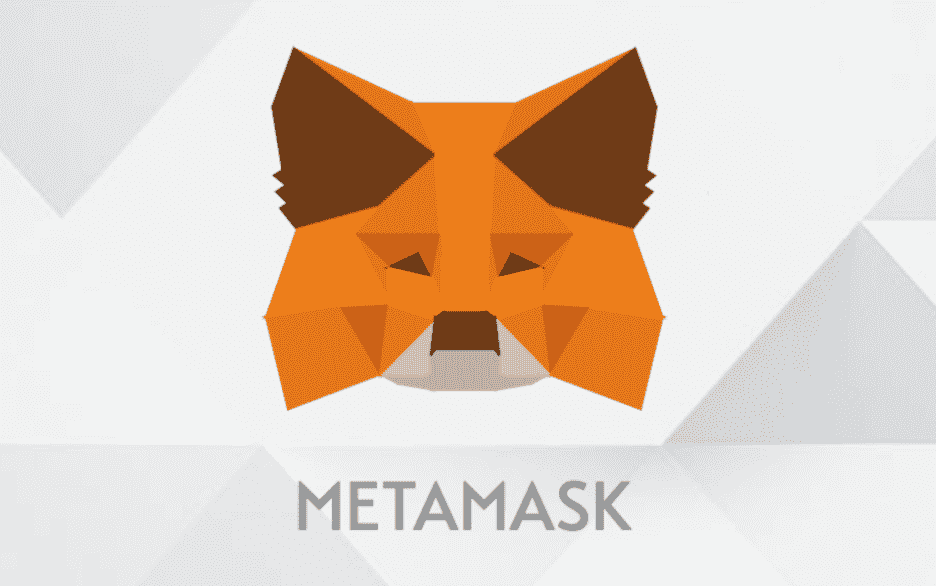

# 使用元掩码构建 dapp–概述

在我们向您展示如何使用 MetaMask 构建 dApps 之前，我们需要准备好所有的工具。如前所述，如果您想快速部署 dApps，MetaMask 和 Moralis 是两个必不可少的工具。此外，我们还将使用 Visual Studio 代码(VSC)；但是，可以随意使用您喜欢的任何其他代码编辑器。因此，如果您对以最快的方式和最少的努力用元掩码构建 dApps 感兴趣，您需要采取以下步骤:

1.  **下载/安装 MetaMask 浏览器扩展。**
2.  创建您的元掩码帐户。
3.  创建您的免费 Moralis 账户。
4.  创建您的 Moralis 服务器。
5.  使用终极以太坊 dApp 样板在几分钟内创建你的第一个 dApp。

这五个步骤是用 MetaMask 构建 dApps 的要点。此外，它们也是我们将在此讨论的内容，我们邀请你跟随。因此，如果你能够承诺采取行动，那么在本文结束时，你可以很容易地[建立你的第一个 dApp](https://moralis.io/build-your-first-dapp-ethereum-tutorial/) 。

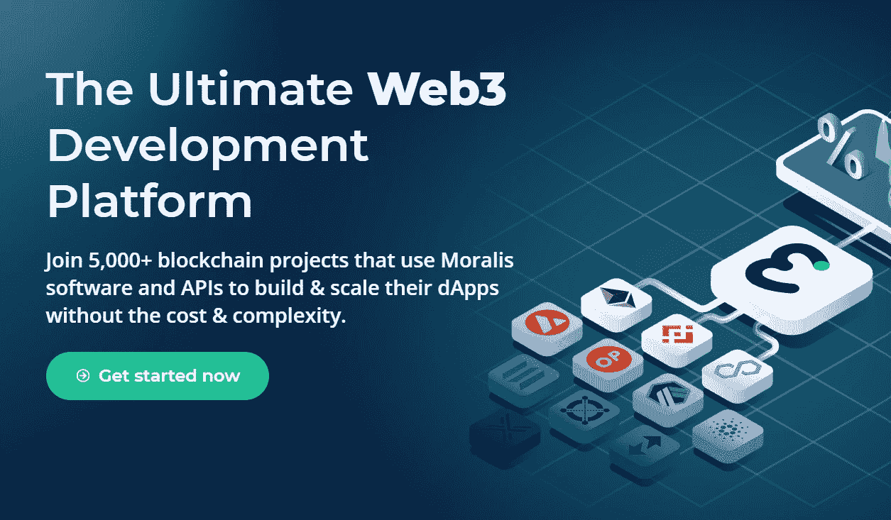

## 使用元掩码构建 dapp–设置

既然我们有单独的文章回答“[什么是元掩码](https://moralis.io/metamask-explained-what-is-metamask/)？”，我们宁愿专注于安装这个钱包，并在这里创建您的帐户。这样，您将能够接收和发送加密资产，并在创建 Web3 应用程序时使用 MetaMask 作为身份验证工具。

### 安装元掩码

我们先去“ [metamask.io](https://metamask.io/) ”看看。在那里，我们点击“立即下载”按钮:

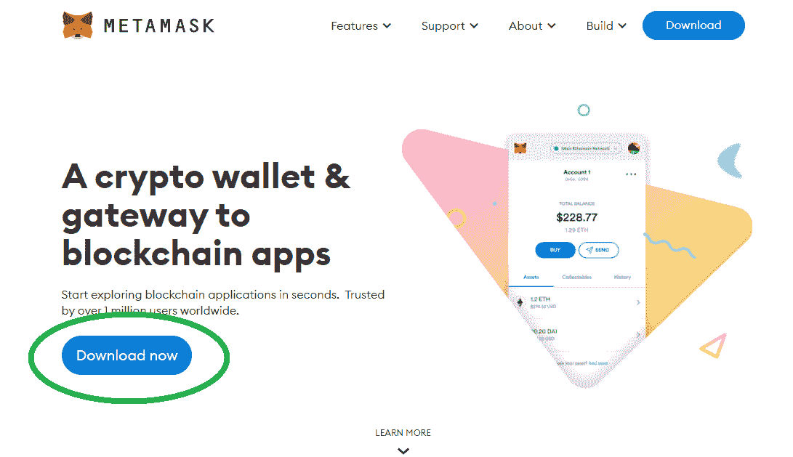

虽然 MetaMask 也适用于 iOS 和 Android，但作为一名开发人员，你很可能会使用它的 Chrome 扩展。因此，我们将把重点放在那个选项上(它通常是默认选中的)。接下来，只需点击“为 Chrome 安装 MetaMask”按钮:

然后，你将被重定向到 Chrome 的网络商店，在那里你需要点击“添加到 Chrome”按钮:

此外，您还需要通过单击弹出窗口中的“添加扩展”按钮来确认您的操作:

之后，您应该会欢迎 MetaMask，在这里您需要单击“开始”按钮:

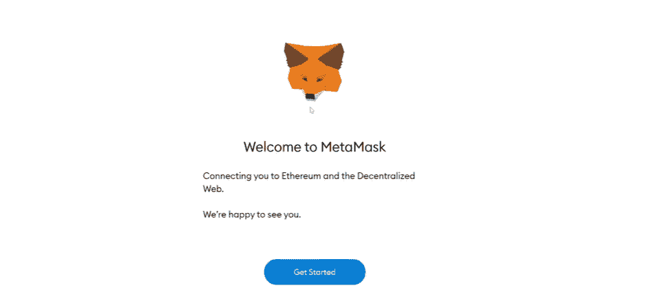

### 使用元掩码创建新的 Wallet

下一步，系统会询问您是否是 MetaMask 的新手，并让您选择是创建新钱包还是导入现有帐户。在本教程中，我们将重点介绍如何创建新的钱包。因此，点击右侧的“创建钱包”按钮:

接下来，您需要创建并确认您的密码(确保将其写在安全的地方):

当你继续前进时，你可能会看到一个教学视频。想看就看；然而，下一个重要的步骤是关于一个秘密恢复短语，你应该安全地存储。

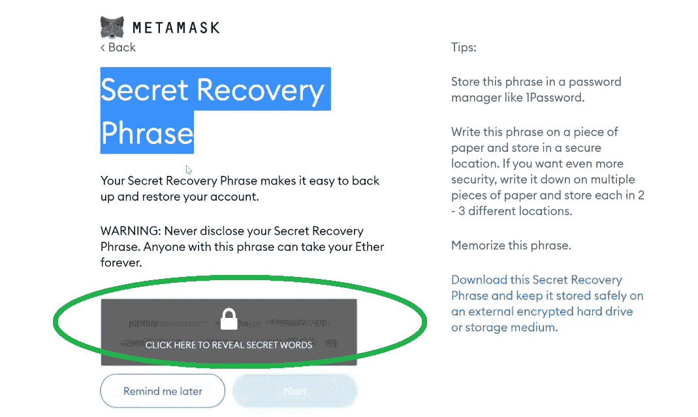

一旦你泄露了密语，就把它们抄在安全的地方(最好是手写的，并储存在一张纸上)。这是很重要的，所以一定要做对(单词的顺序很重要)。使用这些恢复短语，您将能够从任何其他设备访问您的钱包，或者在需要时恢复您的帐户。写下短语后，点击“下一步”按钮，进入下一步，您需要按照正确的顺序输入上一步的短语:

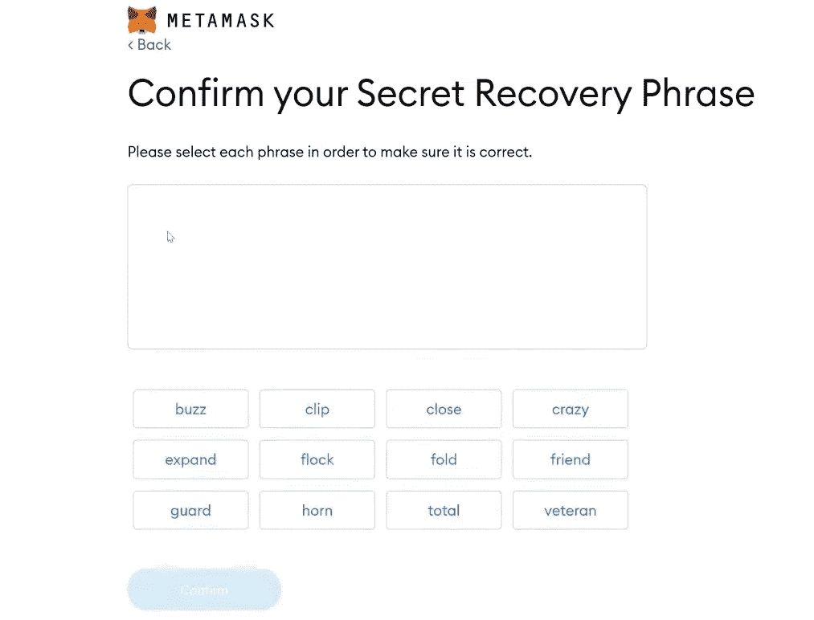

### MetaMask Wallet 概述

以上是创建 MetaMask 钱包的最后一步。一旦你按正确的顺序输入单词，点击“确认”按钮完成整个过程。现在，您终于可以使用您的新钱包了:

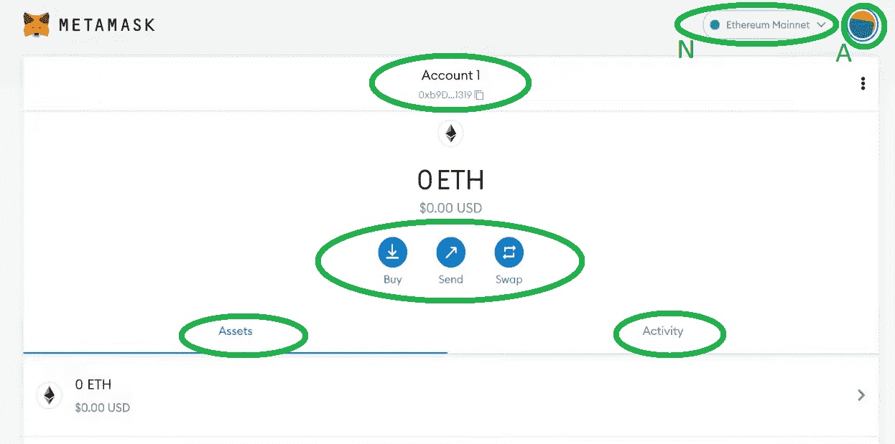

如果您想使用 MetaMask 构建 dApps，您需要熟悉新钱包的基本选项(见上图):

*   **网络选择**(N)–*点击此部分，将显示包含所有已添加网络的下拉菜单。要选择其中任何一个，您只需点击它们，MetaMask 就会切换到该网络。默认情况下，MetaMask 自带以太坊的 mainnet 和四个* [*以太坊 testnet*](https://moralis.io/ethereum-testnet-guide-connect-to-ethereum-testnets/) *选项。还有一个从元掩码中添加网络的选项；然而，通常有一种更简单的方法可以实现这个目的(我们将在继续讨论时介绍一个例子)。*
*   **账户选择**(A)–*点击此图标，您可以导入或创建新账户，在现有账户之间切换(如果您有多个账户)，连接硬件钱包，锁定您的账户，以及访问高级设置。*
*   **您的钱包地址**–*通过查看 MetaMask 钱包顶部中间的“帐户 1”框，您可以看到数字和字母的组合。这是你的钱包地址。此外，你只需点击那个区域就可以复制它。使用这个地址，您可以从对等方接收加密资产，或者从中央交换中心(CEX)取款。*
*   购买、发送、交换–*当你想购买、发送或交换硬币和代币时，你可以使用这些相应的按钮。*
*   **资产和活动**–*“资产”部分显示所选网络上您钱包中所有受支持的(您也可以自己添加令牌)加密资产。此外，活动选项卡显示您的交易。*

#### MetaMask Demo

如果您觉得自己对元蒙版的工作原理或使用方法没有清晰的理解，我们建议您查看以下 4:24 开始的视频:

https://www.youtube.com/watch?v=9kdVAeZ7knk

## 使用 MetaMask 构建 dapp–第 2 层扩展解决方案

如果您已经涉足加密领域有一段时间了，那么您一定听说过第 2 层解决方案。这些类型的区块链网络的主要优势之一是，它们帮助你避免支付荒谬的以太坊燃气费。因此，让我们向您展示如何将最著名的第二层缩放解决方案之一(多边形网络)添加到元蒙版中。

我们可以在元掩码中手动完成这项工作；然而，通过使用 Moralis，我们只需点击一个按钮就可以做到这一点。方法如下:

1.  [**创建你的 Moralis 家账户**](https://admin.moralis.io/register)——如果你还没有创建你的免费 Moralis 家账户，现在就创建吧。按照链接，输入您的电子邮件地址，并创建您的密码。不要忘记通过确认您的电子邮件地址来完成该过程(您将收到一封带有确认链接的电子邮件)。*如果您已经拥有一个有效的 Moralis 账户，只需登录*。
2.  **转到 Speedy Nodes**–在你的 Moralis 管理区内，从左侧菜单中选择 [Speedy Nodes](https://moralis.io/speedy-nodes/) 部分。

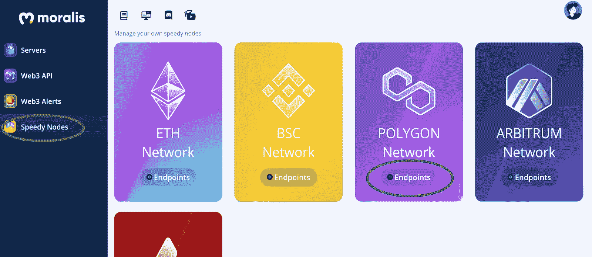

3.  **访问端点**–点击多边形网络选项下的“端点”按钮。
4.  **添加到元蒙版**–通过点击“添加到元蒙版”按钮(见下图)，你可以将多边形的 mainnet 添加到元蒙版中。您也可以按照相同的步骤添加多边形的 testnet (Mumbai)。单击按钮后，MetaMask 将要求您确认此操作。由于 Moralis 是一个值得信赖的平台，您可以点击“批准”按钮。接下来，你也可以点击“切换网络”按钮将你的元蒙版网络切换到多边形。

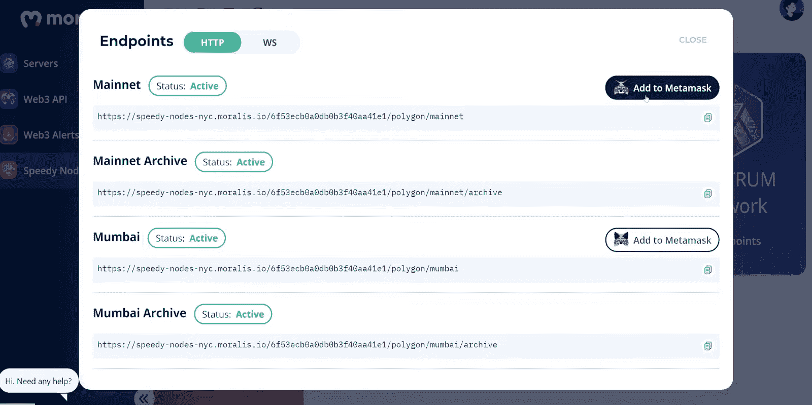

如果您已经正确完成了上述步骤，现在您应该在元蒙版中拥有可用的多边形网络:

如果你有兴趣观看在 Polygon 上使用 MetaMask 进行简单交易的演示，请务必观看 9:27 的视频。

## 使用元掩码和 Moralis 标准构建 dApps

最后，我们将向您展示 Moralis 如何让使用 MetaMask 构建 dApps 变得极其简单。通过创建一个免费的 Moralis 帐户，你可以完全使用这个强大的工具。这包括[终极 Web3 SDK](https://moralis.io/exploring-moralis-sdk-the-ultimate-web3-sdk/) 和 [API](https://docs.moralis.io/moralis-server/web3-sdk/intro) ，包括终极[以太坊 API](https://moralis.io/ethereum-api-develop-ethereum-dapps-with-moralis/) 、 [NFT API](https://moralis.io/ultimate-nft-api-exploring-moralis-nft-api/) 等等。然而，为了让事情变得更简单，我们创建了最好的[以太坊 dApp 样板](https://moralis.io/ethereum-dapp-boilerplate-full-ethereum-react-boilerplate-tutorial/)，在 GitHub 上可以公开获得。后者包括多个组件，使您能够在几分钟内实现功能和 UI。

### 使用 Moralis 使用元掩码构建 dApps

当我们说用 MetaMask 和 Moralis 构建 dApps 可以在几分钟内完成时，我们并没有夸大其词。为了做到这一点，您需要遵循以下简单步骤:

1.  访问以太坊样板 [GitHub](https://github.com/ethereum-boilerplate/ethereum-boilerplate) 页面。
2.  为我们的样板文件复制 GitHub URL:

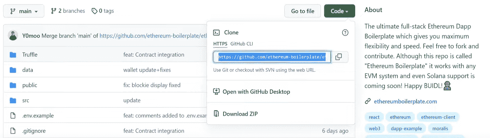

3.  打开 VSC，然后打开一个新的终端，最后打开“Git Bash”。
4.  在终端内，键入:
    1.  *$ git 克隆(粘贴样板文件的 GitHub URL)*
    2.  *$ cd 以太坊-样板文件*
    3.  *$纱线安装*
5.  在“. env.example”文件中插入您的 Moralis 服务器 URL 和应用程序 ID(使用下面的说明获取这些详细信息):

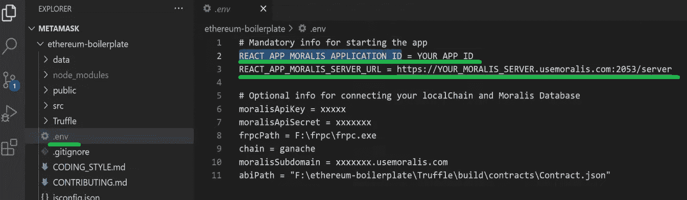

6.  再次使用 VSC 终端，输入" *$ yarn run start"* 。*这会启动你的 dApp。*

如果您不想使用样板文件的任何特定部分，请导航到“App.jsx”文件并进行必要的编辑。详细说明看以上视频(16:22)。视频还涵盖了上述所有步骤(12:45)。

#### Moralis 设置

任何时候你想创建一个项目并使用 MetaMask 和 Moralis 构建 dApps，你总是需要完成以下步骤:

1.  **登录你的 Moralis 利斯账户**–*此时，你应该已经准备好了你的 Moralis 利斯账户。所以，只要[登录](https://admin.moralis.io/login)进入你的管理区。然而，如果你还没有创建你的免费 Moralis 账户，请确保现在就创建。*

***创建新服务器**–在您的 Moralis 管理区内，点击右上角的“+创建新服务器”按钮。从出现的下拉菜单中，选择最适合您需求的网络类型(见下图)。*

**

*接下来，将出现一个弹出窗口，要求输入服务器名称(可以是您想要的任何名称)、区域、网络和链。输入此信息，然后单击“添加实例”。服务器启动需要一些时间，请耐心等待。*

*

3.  **访问服务器详细信息**–一旦您的服务器准备就绪，您就可以通过服务器名称旁边的“查看详细信息”按钮访问其详细信息。

点击“查看详情”按钮将弹出一个窗口，其中包含您需要的所有信息:

4.  **初始化 Moralis 规范**–现在填充您的”。env”文件，其中包含 Moralis 服务器的详细信息(应用程序 ID 和服务器 URL ),以获得 Moralis 涵盖的所需后端功能:

*注意* *:确保使用您特定服务器的详细信息和* ***而不是*** *上图中的信息。*

## 使用元掩码构建 dapp–摘要

如果您遵循了上面的步骤，您现在知道用 MetaMask 构建 dApps 一点也不复杂。虽然 MetaMask 是通往 Web3 世界的门户，但你可以将它的全部力量用于 Moralis 的终极 Web3 开发平台(又名 [Firebase for crypto](https://moralis.io/firebase-for-crypto-the-best-blockchain-firebase-alternative/) )。本质上，在使用元掩码构建 dApps 时，您需要完成以下五个步骤:

1.  下载/安装 MetaMask 浏览器扩展。
2.  创建您的元掩码帐户。
3.  创建您的免费 Moralis 账户。
4.  创建你的 Moralis 服务器。
5.  使用终极以太坊 dApp 样板在几分钟内创建您的第一个 dApp。

当然，这只是一个起点。除了使用样板文件的组件，您还可以关注它的钩子。这样，您可以运用您的 [JavaScript](https://moralis.io/javascript-explained-what-is-javascript/) 技能，创建最佳用户界面(UI)来促进 Moralis 为您提供的后端功能。有了这个优秀的工具，您可以创建各种各样的 Web3 应用程序，而不用担心与区块链相关的后端编程。

此外，尽管 MetaMask 是认证网络用户的高级工具，但 [WalletConnect](https://moralis.io/what-is-walletconnect-the-ultimate-walletconnect-guide/) 为移动用户提供了更好的解决方案。幸运的是，Moralis 还集成了 WalletConnect。此外，当你准备好越过以太坊样板时，你可以使用 [OpenZeppelin](https://moralis.io/what-is-openzeppelin-the-ultimate-guide/) 使用实用的模板来加快你的进度。此外，你可以使用 [Moralis 的 YouTube 频道](https://www.youtube.com/c/MoralisWeb3)和 [Moralis 的博客](https://moralis.io/blog/)来访问涵盖无数示例项目的指南。因此，你将提升你的开发技能并获得一些非凡的想法，包括[如何启动 NFT 市场](https://moralis.io/how-to-launch-an-nft-marketplace/)，创建 [ERC20](https://moralis.io/erc20-exploring-the-erc-20-token-standard/) 令牌，或[创建 DeFi 仪表板](https://moralis.io/how-to-create-a-defi-dashboard-in-5-steps/)。*