# 构建以太坊 dapp–创建、测试和部署

> 原文：<https://moralis.io/building-ethereum-dapps-create-test-and-deploy/>

您知道吗，您可以通过简单的三个步骤在以太坊上构建 dapp？如果您想进一步探索这些步骤，请跟随本 dapp 教程，带您完成创建、测试和部署阶段。在这个过程中，你会注意到构建以太坊 dapps 非常简单。简而言之，我们将创建一个后端和一个前端，连接两者，然后使用 Moralis 的企业级 Web3 API 在后端获取各种链上数据。最后，我们必须确保前端以用户友好的方式整洁地呈现数据。

此外，在以太坊上构建 dapps 时，还必须添加 Web3 认证。幸运的是，Moralis 的 Auth API 可以让您在几分钟内解决这个问题。此外，由于 Moralis 的 web3uikit，您甚至可以节省添加时尚按钮和其他小部件的时间。此外，由于 Moralis 是跨链互操作的，您不仅可以开发以太坊 dapps，还可以构建其他 EVM 兼容链。如果以上听起来都很有趣，今天的 dapp 教程就是为你准备的。然而，在我们开始本教程的主要任务之前，我们需要了解一些基础知识。现在，如果你已经知道以太坊上的去中心化应用是什么，你可能想马上动手。如果是这样，请随意跳转到“ *Dapp 教程——用 Moralis* 构建以太坊 Dapp”部分。即便如此，首先要确保你已经准备好了你的[免费 Moralis 账户](https://admin.moralis.io/register)。

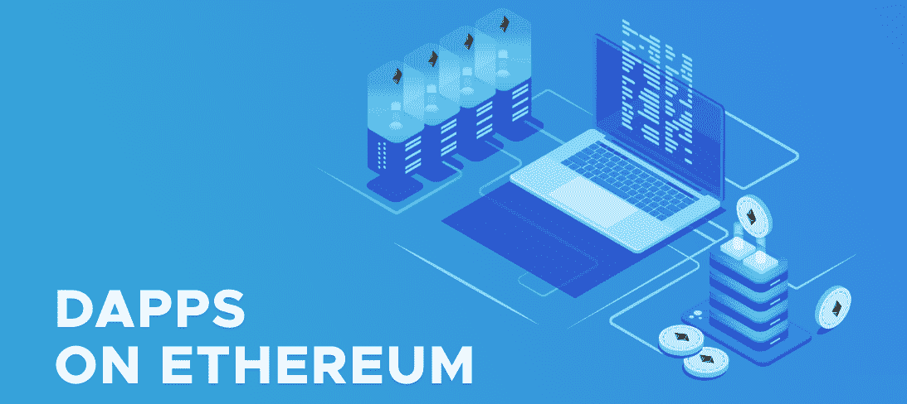

## 以太坊上有哪些去中心化的应用？

分散式应用或 dapps 是以某种方式与一个或多个区块链网络交互的应用。所以，当我们谈论以太坊上的 dapp 时，我们指的是与以太坊链交互的 dapp。此外，需要指出的是 dapps 有多种形式。有些是简单的 explorer dapps，只是获取某些链上的数据。尽管如此，大多数 dapps 都带有 [Web3 认证](https://moralis.io/authentication/)。这意味着用户可以使用他们的 Web3 钱包来验证自己。一旦用户将他们的加密钱包连接到 dapps，他们就可以与他们连接的区块链进行交互。

请记住，可用的 Web3 功能因 dapp 而异。因此，在某些情况下，一些 dapp 仅获取与连接的钱包相关的数据，并将其呈现给连接的用户，这是我们将在今天的 dapp 教程中重点介绍的内容。然而，在其他情况下，其他 dapps 使用户能够执行所有种类的链上事务。此外，dapp 的实现特征决定了它的分类。例如，允许用户交易 NFT 的 dapps 被称为 NFT 市场。或者，提供金融服务的 dapps 被称为 DeFi 平台或仪表板。即使是 Web3 游戏也只是特殊种类的 dapps。考虑到这一点，很明显，在以太坊上构建 dapps 还有很多东西要学。

此外，许多基本原则适用于所有 dapps。因此，当你想造一个轮子的时候，你不需要重新发明轮子。事实上，即使是第一次构建以太坊 dapps，也不需要从头开始。毕竟，有许多高质量的代码库和工具可以让你毫不费力地到达终点。

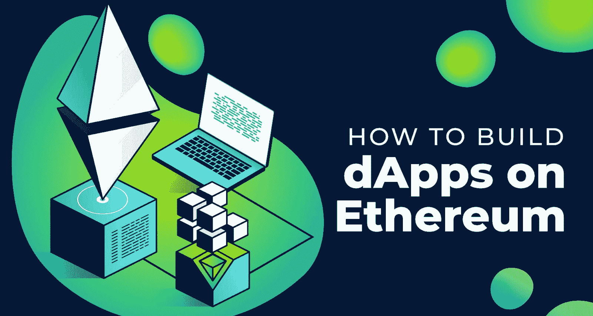

## 如何在以太坊上建立 Dapp

在过去的几年里，Web3 技术已经取得了长足的进步。因此，在构建 dapps 时，您不再需要处理 RPC 节点的所有限制。相反，你只需要使用合适的工具来获取链上数据并与智能合约交互。所以，如果你想在以太坊上构建一个 dapp，你必须完成以下步骤:

1.  使用传统工具创建 dapp 的后端。
2.  使用传统工具构建 dapp 的前端。
3.  连接你的前端和后端。
4.  使用最终的 Web3 API 进行调用，并在后端获取各种链上数据。
5.  确保您的前端以整洁和用户友好的方式呈现数据。

此外，当您想要创建更高级的 dappss(与智能合约交互的 dapp)时，您还需要学习如何部署智能合约。但是，至于同步和触发链上事件，由于 Moralis 的 [Streams API](https://moralis.io/streams/) ，Moralis 使事情尽可能简单。

然而，在今天的 dapp 教程中，我们将坚持获取链上数据。此外，我们将使用 NodeJS、NextJS 和 Moralis 的 EVM API。此外，在以太坊上构建 dapp 的同时，我们将使用 web3uikit 和一些 CSS 来创建一个值得生产的 UX。

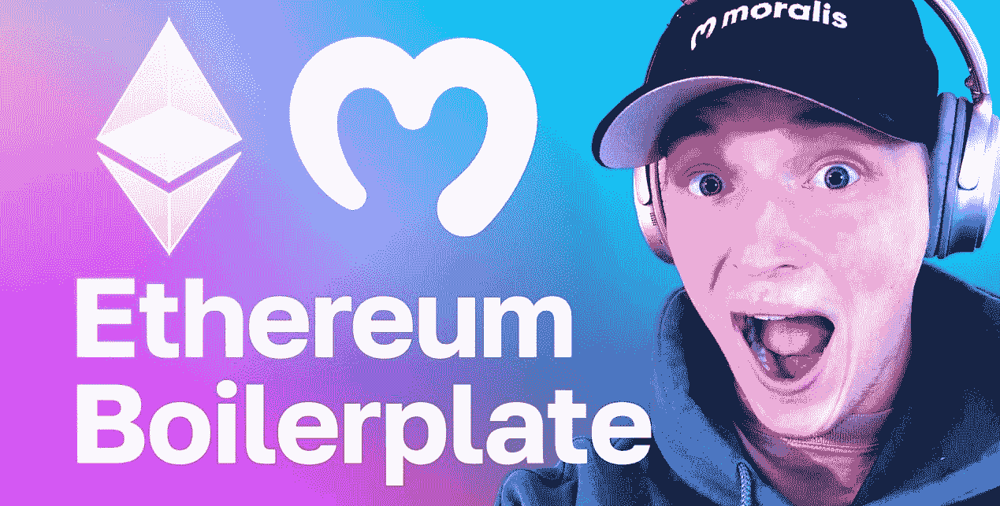

### 构建 Dapps 的最佳入门方式

如果你是初学者，想知道如何在以太坊上快速构建 dapp，以太坊样板就是答案。毫无疑问，这是构建 dapps 最简单的方法。通过利用这一终极捷径，您可以在大约 7 分钟内建立并运行自己的 dapp。

然而，如果你想学会更加独立，按照下面的教程在以太坊上构建 dapps 是一个更好的选择。这样的话，你的 dapp 启动和运行就需要一点时间；然而，你也学到了更多。因此，你知道如何更好地满足你的特定需求。也就是说，如果你的时间非常有限，一定要专注于构建 dapps 的最简单的方法。然而，如果你能抽出大约 90 分钟的时间，参加下面等着你的 dapp 教程。

## Dapp 教程-用 Moralis 建造以太坊 dapp

我们现在已经到了本教程的主要部分——建造以太坊 dapps。如果你跟随我们的领导，我们将要创建的以太坊上的 dapp 是一种“类似 Zapper”的 dapp。此外，您需要完成以下步骤:

*   设置 NodeJS 后端
*   设置您的 React 前端

*   获取您的 Moralis Web3 API 密钥
*   访问 Moralis 的 EVM API 端点
*   添加 Web3 功能和前端样式

### 创建 Dapp

此外，上面概述的步骤是我们将在本文中指导您完成的步骤。然而，要实现必要的 Web3 功能和高级样式，请确保遵循下面等待您的视频教程。

#### 设置 NodeJS 后端

因此，我们将从设置 NodeJS 后端开始。因此，我们需要安装 NodeJS 和" *npm* "包。有了这两个先决条件，我们继续创建一个新文件夹，命名为“zapper”，并在 Visual Studio 代码(VSC)中打开它。

接下来，我们打开一个新的 VSC 终端，使用" *mkdir backend* "命令创建我们的" backend "目录。然后我们将“ *cd* 放入那个文件夹:

然后，我们输入“ *npm init* ”命令来初始化一个新项目，这会提示我们一些初始选项。然而，我们将坚持使用默认设置。因此，只需按几次*进入*。在成功初始化我们的项目之后，我们在“backend”文件夹中得到一个新的“package.json”文件:

接下来，我们在终端中输入“ *touch index.js* ”来创建一个“index.js”文件。接下来，我们输入"*NPM I moralis express CORS dotenv nodemon "*命令，该命令安装所有需要的依赖项。

然后，我们使用“ *hello world example express* ”模板填充“index.js”文件:

有了上面几行代码，我们将端口从“ *3000* ”更改为“ *8080* ”。我们还进口了“ *cors* 包:

尽管如此，我们不能忘记将" *start* "脚本添加到我们的" package.json "文件中:

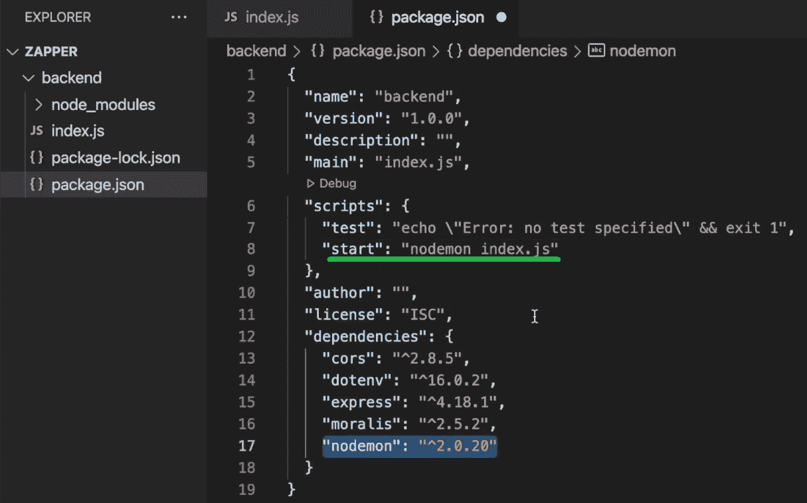

我们使用“ *nodemon index.js* ”在对“index.js”文件进行任何更改后自动刷新我们的后端。我们现在已经有了基本的后端设置，我们可以在“ *localhost: 8080* ”上查看它的功能。为此，我们需要使用" *npm start* 命令:

我们的示例应用程序列在端口“8080”上，我们可以用浏览器访问它:

*注意* *:我们需要在创建前端的同时保持后端的运行。*

#### 设置您的 React 前端

我们首先创建一个新的终端实例:

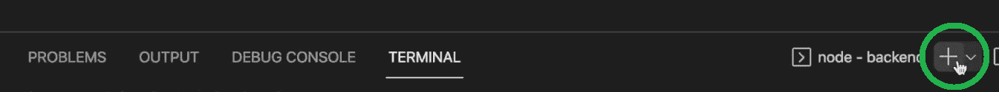

接下来，我们输入"*npx create-react-app frontend*来创建我们的 React 应用程序:

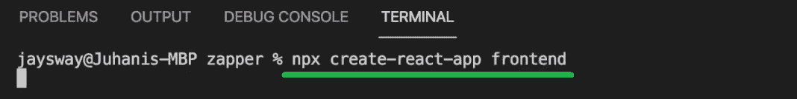

结果，我们在“前端”文件夹中得到几个文件夹和文件:

然后，我们将 *cd* 放入“frontend”文件夹。接下来，我们用“ *npm start* ”命令运行我们的模板 dapp。我们已经可以在“ *localhost: 3000* ”访问我们的 React 应用程序模板:

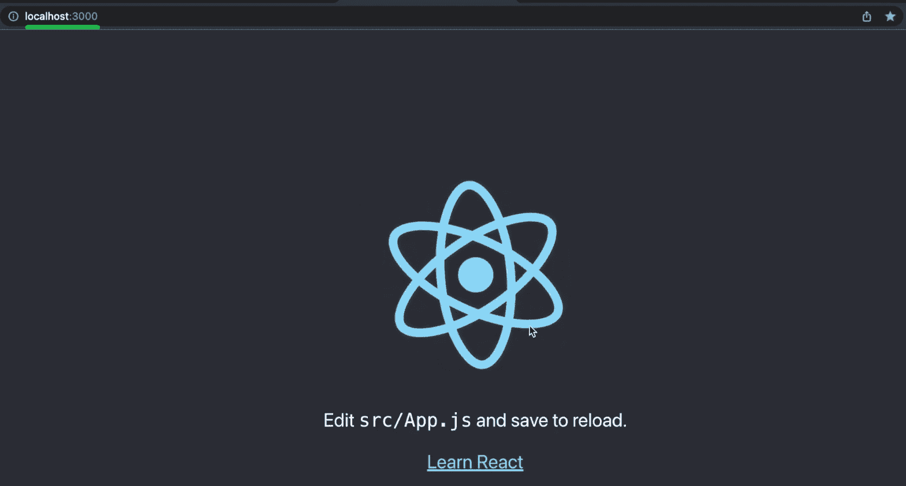

我们现在需要调整“App.js”文件来连接我们的前端和上面创建的后端。首先，我们移除 React 徽标和"*App*div 中的内容:

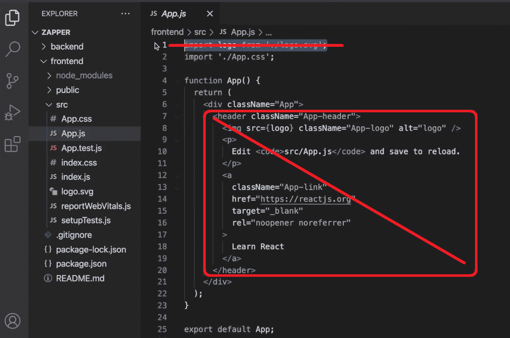

然后，我们用“ *npm i axios* ”命令安装 Axios。我们还需要将 Axios 导入到“App.js”文件中。接下来，我们在“App”div 中创建“Fetch Hello”按钮。此外，要使用按钮从我们后端获取数据，我们还必须定义“ *backendCall* ”异步函数:

通过输入“ *npm start* ”并进入浏览器，我们可以探索我们的前端应用程序的当前结果。此外，为了查看按钮是否正常工作，我们使用浏览器的控制台:

#### 获取您的 Moralis Web3 API 密钥

现在我们已经成功地连接了后端和前端，我们可以开始添加 Web3 功能了。这也是建造以太坊 dapps 变得有趣的地方。此外，这也是我们将向您展示如何以最简单的方式在以太坊上构建 dapp 的地方。因此，我们将使用 Moralis 的 EVM API。这意味着我们需要创建我们的 Moralis 账户。为此，我们可以从一开始就使用该链接，或者访问 Moralis 的主页，然后点击“[免费开始](https://admin.moralis.io/register)”按钮:

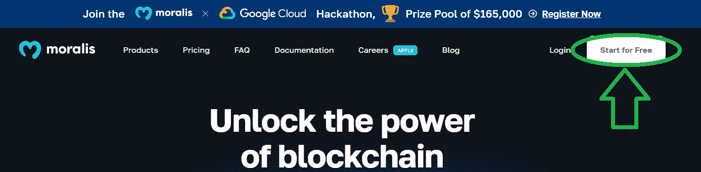

使用我们的凭证，我们可以访问我们的管理区。在那里，我们可以复制我们的 Moralis Web3 API 密钥:

我们将上面复制的 API 密匙粘贴到。env”文件，它是我们在“后端”文件夹中创建的:

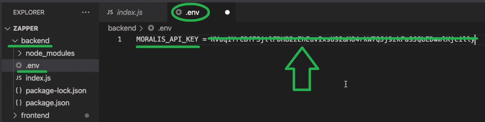

然后，我们重新关注“index.js”文件，在这里我们导入了 Moralis 和"*requires*" the "。env(" dotenv ")文件:

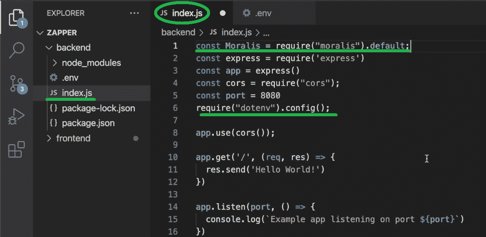

#### 访问 Moralis 的 EVM API 端点

此时，我们已经做好了开始实现 Web3 API 调用的一切准备。此外，当使用 Moralis 时，您有许多有用的端点，使得在以太坊上构建 dapp 更加简单。但是，我们将重点关注联网钱包的原生余额、ERC-20 代币余额和 NFTs。此外，您可以在 Moralis 文档中找到关于 Moralis API 端点的所有细节。例如，下面是“ *getNativeBalance* ”页面:

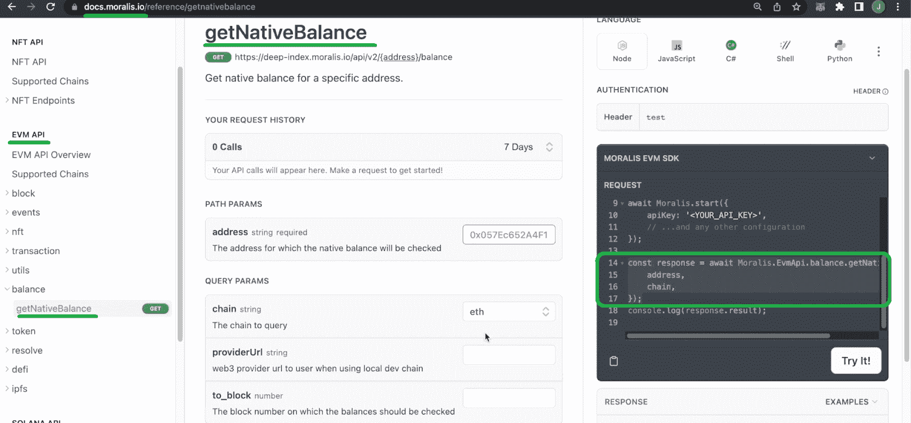

通过选择我们项目使用的语言/框架，我们可以简单地复制所需的代码行。然后，我们返回到“index.js”文件，将这几行代码粘贴到正确的位置:

在下面的视频中，从 14:24 开始，您将能够看到上述端点的运行。在这里，您还将了解如何使用“ *getTokenPrice* ”端点来获取本机余额的当前美元值。您还将了解如何使用一个简单的“ *if* ”语句在两个链之间进行选择:

一旦您的后端正确地获取了链上数据，您只需要将它传递到您的前端，就像您对“Hello World”所做的那样问候(19:04)。这就是在以太坊上建造 dapps 的精髓！

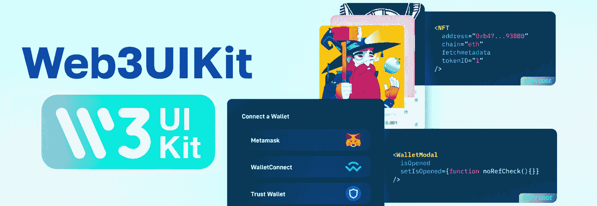

#### 添加 Web3 功能和前端样式

下面的视频将带你到达终点。它将向你展示如何在以太坊上从头开始构建一个 dapp，包括一个抛光的前端。下面是你一路上要学的内容:

*   27:50–使用“*getWalletTokenBalances”*端点开始实施获取和显示 ERC-20 余额所需的代码。
*   40:45–添加必要的功能来显示投资组合的美元总价值。
*   44:57–关注使用“ *getWalletTokenTransfers* ”端点实现传输历史。
*   1:06:27–使用“ *getWalletNFTs* ”端点添加 NFT 获取和显示功能。
*   1:14:21–使用 web3uikit 和 CSS 覆盖前端样式。

最后，这个视频将教你如何使用 NodeJS、NextJS 和 Moralis 在以太坊上构建 dapps:

[https://www.youtube.com/embed/C9yA8LcJsIY?feature=oembed](https://www.youtube.com/embed/C9yA8LcJsIY?feature=oembed)

*注:如果不喜欢从头开始编码，可以在* [*GitHub*](https://github.com/MoralisWeb3/youtube-tutorials/tree/main/ZapperAcademy) *上访问最终代码。*

### 测试 Dapp

在构建好你的 dapp 之后，你可以通过访问“ *localhost: 3000* ”来测试它的所有特性。如果您正确完成了上述所有步骤，现在您可以通过将钱包地址粘贴到“钱包地址”栏来浏览任何钱包地址:

您还应该能够在多边形和以太坊之间进行选择:

此外，有了两个条目参数(钱包地址和链)，您将能够看到该地址的本地、ERC-20 和 NFT 余额。此外，跟随我们的脚步在以太坊上构建 dapp 也应该能够让您看到投资组合的总价值:

此外，要浏览余额和转账，您可以使用“代币”、“转账”和“非转账”选项卡:

*   ERC-20 天平示例:

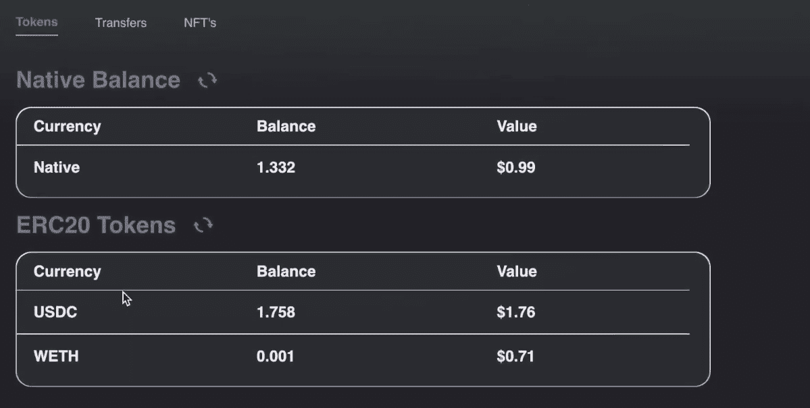

*   “转账”选项卡示例:

*   “NFTs”选项卡示例，其中您还可以使用“名称”和“ID”过滤器:

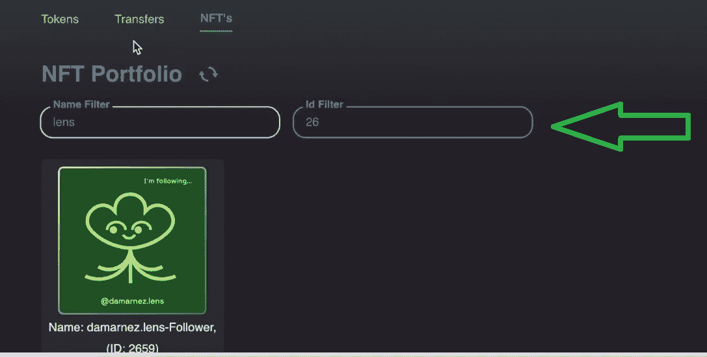

### 部署 Dapp

在上面的 dapp 教程中，我们向您展示了在以太坊上构建 dapp 时需要完成的步骤。如果你还记得的话，我们关注的是本地服务器，这意味着你可以测试你的 dapp，但是用户无法访问它。所以，如果你有兴趣在以太坊上构建一个 dapp 并让公众可以访问，你也需要部署它。为此，您需要一个域。这也是真正分散的 dapps 的不同之处。当然，您可以使用集中式域提供者和协议；但是，我们鼓励您探索真正分散的服务。

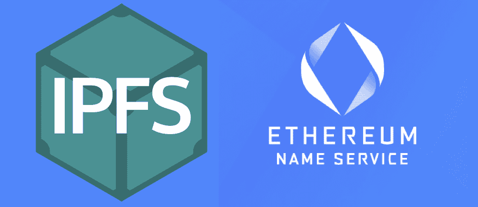

所以，你应该从[以太坊域名服务](https://moralis.io/what-is-ethereum-name-service-full-ens-guide/) (ENS)获得你的域名。接下来，你需要上传你的 dapp 文件到 [IPFS(星际文件系统)](https://moralis.io/what-is-ipfs-interplanetary-file-system/)。*要获得以真正分散的方式部署 dapp 的详细分步说明，请确保使用 ENS 和 IPFS 的文档。*

## 构建以太坊 dapp–创建、测试和部署:摘要

我们在今天的文章中谈了相当多的内容。在向您展示如何在以太坊上构建 dapp 之前，我们解释了以太坊上的去中心化应用程序是什么。然后，我们概述了构建以太坊 dapps 的步骤。我们甚至告诉您，在以太坊网络上构建 dapps 时，使用以太坊样板是最简单的入门方式。最后但同样重要的是，在我们的带领下，你有机会卷起袖子创建你自己的 dapp。

如果你喜欢这个教程，我们鼓励你访问[Moralis YouTube 频道](https://www.youtube.com/c/MoralisWeb3)和[Moralis 博客](https://moralis.io/blog/)。一些最新的文章关注于[编写一个 Solana 智能合同](https://moralis.io/how-to-write-a-solana-smart-contract/)，实现[基于区块链的认证](https://moralis.io/blockchain-based-authentication-how-to-integrate/)，使用 [Avalanche 样板](https://moralis.io/avalanche-boilerplate-fastest-way-to-build-avalanche-dapps/)，[创建 Cronos dapp](https://moralis.io/cronos-boilerplate-how-to-create-cronos-dapps/)，[构建多边形 dapp](https://moralis.io/polygon-boilerplate-how-to-build-polygon-dapps/)，等等。除了伟大的范例项目，这些出口也解释了 dapp 开发的核心概念。此外，它们是很好的资源，可以帮助你免费成为一名 Web3 开发者。

另一方面，你可能有兴趣尽快成为全职加密员。在这种情况下，[成为区块链认证的](https://academy.moralis.io/)才是正确的选择。因此，一定要考虑报名参加 Moralis 学院。我们建议从“[区块链和比特币基础](https://academy.moralis.io/courses/blockchain-bitcoin-101)课程开始。