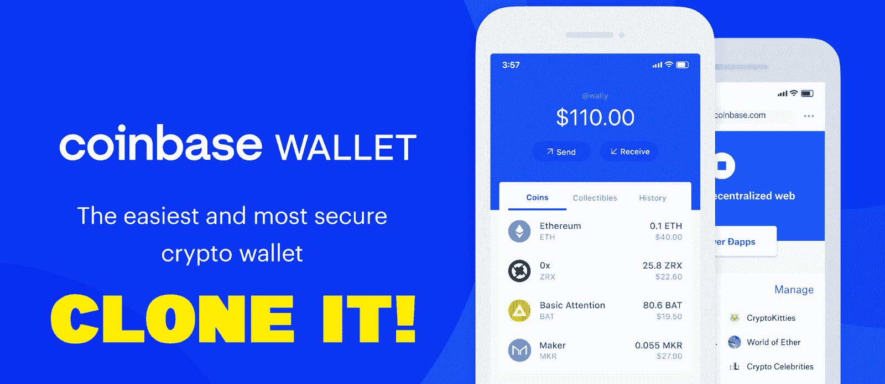
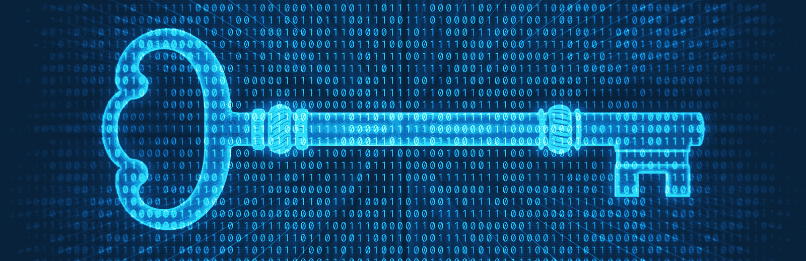
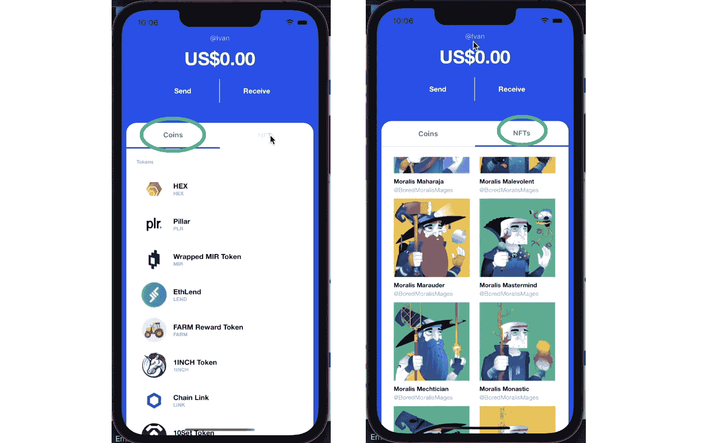
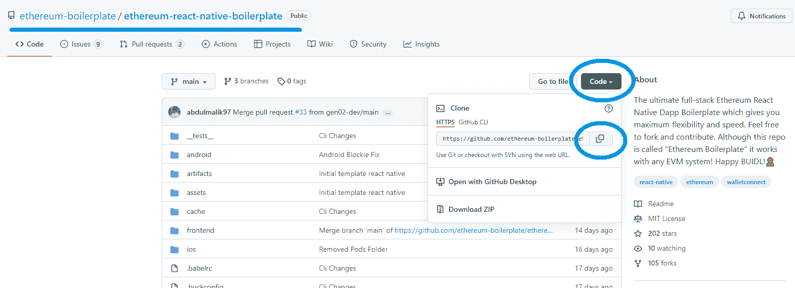
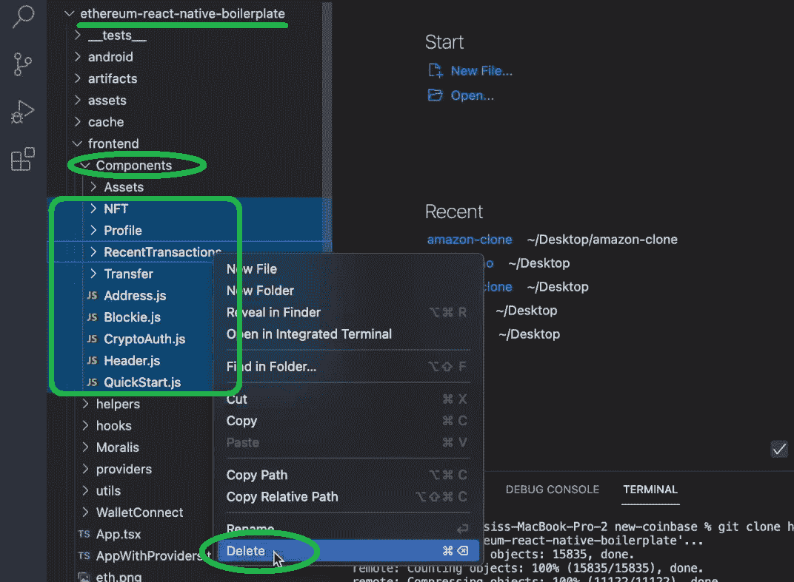
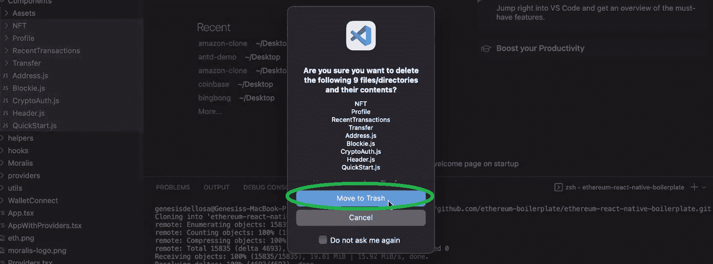
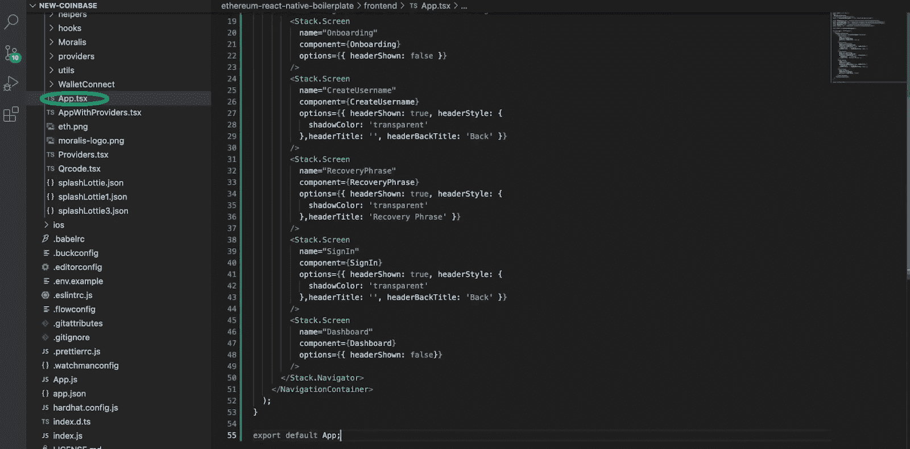
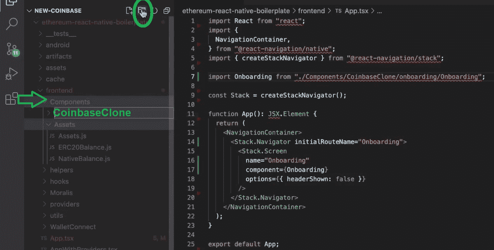
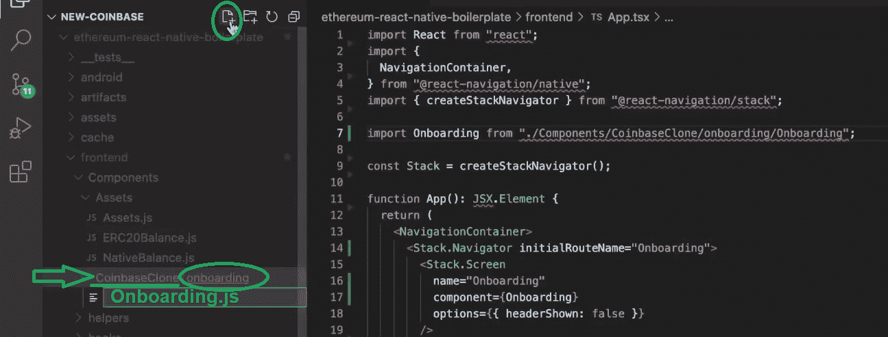

# 克隆比特币基地钱包——如何克隆比特币基地

> 原文：<https://moralis.io/cloning-coinbase-wallet-how-to-create-a-coinbase-clone/>

比特币基地是加密货币行业无可争议的巨头之一。除了众所周知的集中交易(CEX)之外，比特币基地钱包还为用户提供了一个访问加密世界的简单方法。许多进入 Web3 领域的人这样做是因为其分散的方面——然而，像比特币基地这样的集中式平台仍然被广泛采用。这仅仅是由于某些集中式平台的易用性。因此，克隆比特币基地钱包并实现你自己的去中心化元素可能是个好主意。例如，您可以创建一个具有钱包功能的比特币基地克隆体， [**为其创建一个 DAO**](https://moralis.io/how-to-create-a-dao-in-10-minutes/) **，并利用** [**治理令牌**](https://moralis.io/what-are-governance-tokens-full-guide/)**；是的，有很多选择。但是，让我们从基础开始，看看当使用正确的工具时，克隆比特币基地钱包的过程是多么容易。**

使用接下来的部分结合广泛的视频指南，你将有机会掌握克隆比特币基地钱包的过程。在这一过程中，你将学习如何使用一些优秀的工具，由 [Moralis](https://moralis.io/) 领衔。Moralis 的终极 [Web3](https://moralis.io/the-ultimate-guide-to-web3-what-is-web3/) 开发平台，又称“ [Firebase for crypto](https://moralis.io/firebase-for-crypto-the-best-blockchain-firebase-alternative/) ”，是最好的 [Web3 后端平台](https://moralis.io/exploring-the-best-web3-backend-platform/)。它涵盖了您的所有后端需求，以便您可以完全专注于创建最佳用户体验。通过完成一些基本的初始 Moralis 设置步骤(下面提供了一个分步指南)，您可以使用 [Moralis 的 SDK](https://moralis.io/exploring-moralis-sdk-the-ultimate-web3-sdk/) 的全部功能。这个发电站为您提供了 Moralis 服务器、Moralis 仪表板(数据库)和 Moralis 的“同步”功能。此外，后者使您能够轻松地[同步和索引智能合约事件](https://moralis.io/sync-and-index-smart-contract-events-full-guide/)和[索引区块链](https://moralis.io/how-to-index-the-blockchain-the-ultimate-guide/)。因此，你可以很容易地创建一个比特币基地克隆。现在，在我们探索如何做到这一点之前，让我们看一些基础知识。

### 加密钱包解释

这篇文章将是所有关于克隆比特币基地钱包。反过来，通过使用适当的工具，您将能够在创纪录的时间内创建一个比特币基地克隆。然而，在我们真正关注我们的示例项目之前，我们想确保你们都跟上了速度。因此，我们想快速解释一下 [Web3 钱包](https://moralis.io/what-is-a-web3-wallet-web3-wallets-explained/)是什么。

因此，正如“Web3”和“钱包”这两个词所暗示的，我们谈论的钱包能够存储加密资产并提供通往加密领域的网关。此外，我们可以主要将 Web3 或加密钱包分为两类。首先，我们有“冷”钱包，它们是硬件存储(甚至是一张纸)。这些提供了最高水平的安全性；然而，它们的主要目的是用于长期存储。第二种选择是“热”钱包，它以软件的形式出现。这些可以是在线应用程序、移动应用程序或浏览器扩展。此外，除了提供加密资产存储，热钱包还使我们能够与各种区块链互动。

MetaMask 可能是最流行的热门加密钱包，也是一个强大的开发工具。因此，它经常用在“[开发人员元掩码](https://moralis.io/metamask-for-developers-how-to-launch-web3-apps-with-metamask/)短语中。通过使用这个不可思议的工具， [Web3 认证](https://moralis.io/web3-authentication-the-full-guide/)变得简单了。然而，为了让 [Web3 用户的加入](https://moralis.io/how-to-boost-web3-user-onboarding-success-rates/)更加简单，我们还应该实现 [Web3 社交登录](https://moralis.io/web3-social-login-sign-in-dapp-users-with-google-email-or-twitter/)和[通过电子邮件进行 Web3 认证](https://moralis.io/how-to-do-web3-authentication-via-email/)。此外，许多声誉良好的集中交易所(cex)也有自己的热门钱包。最受欢迎的两个是币安——参见我们的 [BSC Wallet](https://moralis.io/bsc-wallet-guide-how-to-set-up-a-binance-smart-chain-wallet/) 文章了解更多信息——和比特币基地钱包。作为前两个选择之一，很容易理解为什么克隆比特币基地钱包如此有趣。

## 克隆比特币基地钱包-示例项目

用 Moralis 和以太坊 React 本地样板文件创建一个比特币基地克隆的任务，比如克隆比特币基地钱包，可以在几个小时内完成。如前所述，我们将在本文中展示流程概述。然而，要获得更详细的指导，请观看下面的视频。此外，为了进一步帮助您，我们将在本文的所有内容中引用特定的视频时间戳。如果这是你第一次听说终极[以太坊移动样板](https://moralis.io/ethereum-mobile-boilerplate-full-guide-to-ethereum-for-mobile/)，我们建议你看看我们的 [React Native Web3](https://moralis.io/react-native-web3-full-react-native-web3-dev-guide/) 指南。此外，我们相信，对我们将要构建的东西有一个清晰的了解会让事情变得更简单，尤其是当我们想要创建一个比特币基地克隆体的时候。因此，让我们做一个快速预览我们的比特币基地钱包克隆。

### 克隆比特币基地钱包–预览

以下是显示新用户如何使用我们的比特币基地钱包克隆版的一系列屏幕:

查看上图中的屏幕，您可以看到用户可以选择创建新的钱包或导入现有的钱包。他们可以通过点击相应的按钮来选择两个选项中的任何一个。在这次演示中，我们制作了一款新钱包。因此，在新用户点击“创建新钱包”按钮后，我们的移动 dApp 会将他们带到下一个屏幕。在这里，他们需要选择他们的用户名。因此，他们需要在底部的输入字段中输入他们喜欢的字符组合。

输入用户名后，用户必须点击“下一步”按钮。这会将他们带到“种子短语”屏幕。这是他们需要复制 12 个随机安全词的地方。请注意，这是一个关键步骤，使用户能够恢复钱包或将钱包导入其他设备。甚至还有“复制到剪贴板”按钮，为额外的方便。要前进，用户需要单击“下一步”按钮。通过这样做，他们进入了钱包的仪表盘。在那里，他们可以看到自己的总余额，发送和接收资金，并查看列出的代币(可替换和[不可替换代币](https://moralis.io/non-fungible-tokens-explained-what-are-nfts/) [NFTs】)。此外，以下是这两个选项卡的显示方式:

我们的快速预览也到此结束，你应该准备好创建一个比特币基地克隆了。现在，如果你更喜欢视频，请查看下面 3:15:15 开始的视频教程，以获得更详细的预览。此外，我们还在[*【Figma】*](https://www.figma.com/file/Fvp2fihhDtopg4Iga8mTCO/Coin-Wallet?node-id=0%3A1)*为您提供了整个设计布局。*

## 以太坊反应原生样板–克隆比特币基地钱包快捷方式

*注* *:我们的开发者一直在努力打造终极* [*以太坊 React 原生样板*](https://github.com/ethereum-boilerplate/ethereum-react-native-boilerplate) *。不过，请记住，后者是一项正在进行的工作。然而，由于我们已经测试了样板文件一段时间，它已经有了很大的改进。尽管如此，如果您遇到任何错误，请务必使用我们的论坛让我们了解详细信息。我们可以一起为主流用户带来非凡的 Web3 dApps，从而为加密的采用做出贡献。*

为了让你的 dApp 看起来像我们在上面的预览中展示的那样，你需要完整地完成视频教程。下面简要概述了如果您想要创建比特币基地克隆，需要完成的一些必要的初始步骤。

### 正在初始化以太坊反应本机样板文件

当涉及到使用我们的任何样板文件时，您需要从克隆代码开始。此外，以下是您需要完成的步骤(您也可以使用下面 4:21 开始的视频):

1.  访问 GitHub 上的以太坊 React 本地样板页面(上面的链接)。*为了这次“克隆比特币基地钱包”的挑战，你也可以使用我们的* [*【比特币基地】克隆起始码*](https://github.com/gen02-dev/coinbase-clone-starter) *甚至* [*最终码*](https://github.com/MoralisWeb3/youtube-tutorials/tree/main/coinbase-clone) *。为了充分利用这个示例项目，我们建议从 Ethereum React 原生样板文件开始，然后应用调整(参见下一节)。*

2.  接下来，复制 HTTPS 地址:

3.  然后，在 Visual Studio 代码(VSC)中打开一个新项目。接下来，运行 VSC 的终端来克隆代码。为此，您需要输入“git clone”命令，后跟上面复制的地址:

4.  一旦你克隆了代码，你需要进入相应的文件夹。这很容易用 VSC 的终端(“ls”和“cd”命令)来完成:

5.  现在，您需要安装所有的依赖项。于是，使用" ***纱在终端安装*** 命令。*如果您喜欢使用 npm 软件包管理器，请使用与 NPM 相关的命令。*

6.  接下来，是时候进入 iOS 文件夹了(在终端中输入“ ***cd ios*** ”)。一旦进入“ios”文件夹，在终端中运行“ ***pod 安装*** ”命令。

7.  然后，您需要返回到根文件夹。照此，输入 ***cd..*** ”在终端的命令行中。

8.  完成以上所有步骤后，你就可以运行这个应用程序了。您可以通过在终端中输入以下命令来实现这一点:
    1.  对于 iOS:***npx react-原生运行-ios***
    2.  对于安卓:***npx react-原生运行-安卓*** *或****npx react-原生启动***

### 调整克隆以太坊反应原生样板

如果您决定走最有教育意义的道路，那么您已经从以太坊 React 原生样板开始了。这意味着您需要对代码进行一些调整(5:50 的视频)。让我们从删除一些前端文件夹开始。因此，转到 VSC 内部的“前端”文件夹。在“前端”文件夹中，选择“组件”文件夹，并选择这些文件夹:

接下来，右键单击您的选择，然后单击“删除”。然后，单击“移至垃圾桶”按钮确认您的操作:

接下来，使用上一节第一步中给出的最终代码的链接。然后复制" [App.tsx](https://github.com/MoralisWeb3/youtube-tutorials/blob/main/coinbase-clone/frontend/App.tsx) "文件中的代码，并用它替换项目的" App.tsx "文件中的代码:

此外，使用 9:27 的视频，跟随 Moralis 专家，向您展示删除哪部分代码。因此，你将能够完全专注于入职。

接下来，您需要再次转到“组件”文件夹。在这里，您需要创建一个名为“CoinbaseClone”的新文件夹，方法是单击 VSC 顶部的“创建新文件夹”图标:

然后重复相同的步骤，在“CoinbaseClone”文件夹中创建“onboarding”文件夹。在“onboarding”文件夹中，您希望通过单击“创建新文件夹”图标左侧的图标来创建“Onboarding.js”文件:

为了快速填充上面创建的“ [Onboarding.js](https://github.com/MoralisWeb3/youtube-tutorials/blob/main/coinbase-clone/frontend/Components/CoinbaseClone/onboarding/Onboarding.js) ”，从最终代码中的同名文件复制内容。同样，使用下面的视频(11:30)来看看你现在应该删除哪部分代码。

*注意* *:记住，如果你想避免上面的调整，你也可以使用启动代码(上一节的链接)。*

### 克隆比特币基地钱包–视频教程

完成初始设置后，您就可以更深入地了解我们的“克隆比特币基地钱包”任务了。此外，为了确保您从这次经历中获得最大收益，我们将把您交给 Moralis 的一位专家。从 12:18 开始，他将向您展示如何运行 Xcode (12:18)。这也是您将学习创建如上面预览中所示的入职屏幕的地方。但是，在等待应用程序运行时，您将看到如何正确填充“Providers.tsx”文件(16:45)。在这里，您需要完成一些初始的 Moralis 设置来[创建一个 Moralis 服务器](https://docs.moralis.io/moralis-server/getting-started/create-a-moralis-server)并获取它的详细信息。

接下来，您将能够创建用户注册屏幕(56:24)。在这里你将看到 Moralis 的 SDK 和它的 Web3 API 的威力。接下来，您需要创建恢复短语屏幕(1:48:10)。在 02:07:48，专家将指导您创建仪表板屏幕。最后，您还将有机会创建登录屏幕(02:53:12)。因此，您将覆盖我们示例移动 dApp 的所有屏幕。因此，你将知道如何创建一个比特币基地克隆。

最后，这是我们在整篇文章中引用的视频教程:

https://www.youtube.com/watch?v=A1otlAAIsME

## 克隆比特币基地钱包–如何创建比特币基地克隆–摘要

在本文中，你已经有机会了解了克隆比特币基地钱包的要点。此外，如果你已经使用了我们的指导，包括上面的视频，你现在知道如何使用最终的移动 dApp 样板。后者，结合 Moralis，使所有的差异。这就是开发人员在创建移动 dApps 时节省 87%以上开发时间的方法。此外，在处理 web dApps 时，您可以使用终极的 [Web3 样板文件](https://moralis.io/web3-boilerplate-beginners-guide-to-web3/)来获得更快的结果。

既然您已经知道如何创建比特币基地克隆，我们鼓励您进一步开发您的移动 dApp。因此，你可以开始构思自己的想法，或者在 [Moralis YouTube 频道](https://www.youtube.com/c/MoralisWeb3)或 [Moralis 博客](https://moralis.io/blog/)获得一些灵感。在那里，你可以找到大量的内容，提供各种加密方面的简单解释和示例项目教程。例如，我们的一些最新主题包括推出一个 [NFT 铸造页面](https://moralis.io/how-to-launch-an-nft-minting-page-full-walkthrough/)、[什么是元宇宙](https://moralis.io/what-is-the-metaverse-full-guide/)、如何[用 Unity](https://moralis.io/how-to-create-a-metaverse-dapp-with-unity/) 创建一个元宇宙 dApp、一个[可重入智能合约示例](https://moralis.io/what-is-reentrancy-reentrancy-smart-contract-example/)等等。此外，这两个出口是一个伟大的方式来继续你的免费区块链发展教育。

然而，如果你真的想尽快成为一名区块链开发者，你可能需要考虑一种更专业的方法。在这种情况下，你应该报读[Moralis 学院](https://academy.moralis.io/)，在众多高质量的[课程](https://academy.moralis.io/all-courses)中做出选择。尽管如此，一个更大的价值正以最不可思议的社区的形式等待着你。此外，您将获得个性化的教育途径，以优化您的进步，并获得专业指导，以获得更多捷径。

