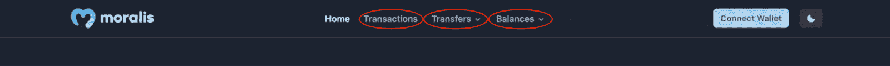

# 完整指南:如何通过 3 个步骤构建雪崩 Dapp

> 原文：<https://moralis.io/complete-guide-how-to-build-an-avalanche-dapp-in-3-steps/>

Avalanche 是一个著名的区块链网络，拥有一个庞大的 dapps 生态系统和其他有趣的 Web3 项目。此外，该网络是其他 EVM 兼容链(如 Polygon、BNB 智能链和以太坊)的绝佳替代品。您有兴趣利用 Avalanche 作为 dapp 开发的区块链吗？如果是这样，你来对地方了。有了 [Moralis](https://moralis.io/) ，学习如何构建 Avalanche dapp 就简单了。更重要的是，建立一个雪崩 dapp 只需要三个步骤！请继续阅读，我们将带您了解整个过程！

**样板文档—**[**https://github . com/以太坊-样板/以太坊-样板**](https://github.com/ethereum-boilerplate/ethereum-boilerplate)

如果您不想在这个简短的教程中继续学习，您可以选择使用上面的链接更详细地研究代码。否则，请加入我们，我们将解释整个过程，并向您展示如何通过三个步骤构建 Avalanche dapp。那么，怎么可能这么容易地构建一个雪崩 dapp 呢？这个问题的答案是 Moralis 的以太坊样板，它支持 EVM 链，包括雪崩！因此，我们将使用这个模板创建一个简单的应用程序，用户可以用他们的 [Web3 钱包](https://moralis.io/what-is-a-web3-wallet-web3-wallets-explained/)登录。一旦他们验证了自己的 [Web3 身份](https://moralis.io/web3-identity-the-full-guide-to-authentication-identity-and-web3/)，他们就可以访问用户信息，比如他们的交易历史、钱包余额等等。

因此，如果你想构建一个雪崩式的 dapp，跟随我们展示构建 Web3 应用程序的最快方法。然而，在我们开始之前，注册 Moralis，因为在本教程中你将需要一个帐户。加入 Moralis 是免费的，您可以在几秒钟内设置您的帐户！

## 什么是雪崩 Dapp？

为了回答这个问题，“什么是雪崩 dapp？”这可能是一个好主意，以打破什么是雪崩和 dapps。因此，我们将从这一节开始，进一步详细探讨雪崩网络。


Avalanche 创建于 2020 年，是一个可编程的智能合约平台。Avalanche 着手解决以太坊网络的一些拥堵问题，将以太坊的燃气费推高到令人发指的数字。因此，Avalanche 专注于速度和保持最低的交易成本。此外，Avalanche 为构建快速、低成本、可靠兼容的应用程序提供了一个平台。此外，该网络将自己标榜为在时间终结方面最快的智能合约平台。

现在，随着对雪崩网络的理解，我们可以很容易地回答这个问题，“什么是雪崩 dapp？”。简而言之，雪崩 dapp 是建立在雪崩网络上的应用。也就是说，探索 dapps 的错综复杂以及它们需要什么可能更有趣。

因此，dapps(分散式应用程序)本质上实现了与传统 Web2 应用程序相同的功能。关键的区别在于 dapps 配备了 Web3 功能，因为开发人员是在诸如 Avalanche 或 Ethereum 等 P2P(点对点)网络上构建这些应用的。因此，dapps 本质上是建立在区块链网络之上的传统应用。

对什么是雪崩 dapps 有了更好的理解，我们可以继续本教程的中心部分。因此，我们将通过以下几节来演示如何通过三个步骤构建雪崩 dapp！

## 如何用 3 个步骤构建雪崩 Dapp

随着对 Avalanche dapps 的复杂性有了更好的理解，现在是时候演示如何构建一个了。由于我们将使用来自 Moralis 的以太坊样板代码，因此可以将该过程分为以下三个步骤:

1.  **克隆 GitHub 库**
2.  **配置变量**
3.  **开始雪崩 Dapp**

以太坊样板文件有一个简单的 dapp，用户可以用他们的 MetaMask Web3 钱包登录。一旦通过身份验证，用户就可以自由浏览应用程序。例如，用户可以访问他们的交易历史，包括 ERC-20 令牌和 NFTs。此外，dapp 还会显示用户的余额。但是，在下一节中，您将了解更多关于 dapp 如何工作的信息，在这一节中，我们将仔细研究以太坊样板文件的复杂性。

此外，如果你更喜欢看视频教程来教育自己，请随时查看来自 [Moralis 的 YouTube](https://www.youtube.com/c/MoralisWeb3) 频道的以下剪辑:

https://www.youtube.com/watch?v=Bb5Pc–kyAY

上面的视频是一个简短的剪辑，解释了如何建立一个雪崩 dapp。因此，它更详细地介绍了本教程的步骤。尽管如此，你也可以跟着这里，因为这个指南的特点是一个完整的分解，你如何可以建立一个雪崩 dapp 只有三个步骤！

### 以太坊样板——它是如何工作的？

在我们说明如何构建 Avalanche dapp 之前，我们将探索 Moralis 的以太坊样板，向您展示我们正在努力的方向。如下图所示，这是您将要创建的 Avalanche 应用程序的登录页面:


您可以看到，应用程序一启动，您就有了许多选项。例如，您会发现应用程序顶部有四个选项卡:



这些功能选项包括“交易”、“转账”和“余额”。但是，在您验证自己之前，如果您点按这些选项中的任何一个，您将不会找到太多信息。您必须首先使用右上角的“连接钱包”按钮连接您的 Web3 钱包:


点击此按钮将提示您的元掩码钱包，并允许您签署消息。此外，MetaMask 是该模板的默认选项，在使用 Moralis 时，您可以轻松实现额外的 [Web3 身份验证](https://moralis.io/authentication/)方法。例如，Web3 [Auth API](https://docs.moralis.io/reference/auth-api-overview) 允许你轻松[添加比特币基地钱包登录功能](https://moralis.io/how-to-add-coinbase-wallet-login-functionality/)或者[用 RainbowKit](https://moralis.io/how-to-add-a-sign-in-with-rainbowkit-to-your-project-in-5-steps/) 添加登录。

一旦通过认证，你现在可以探索雪崩 dapp 的标签。例如,“余额”选项卡将显示用于签署消息的钱包的余额。因此，点击此按钮将允许您选择 NFTs 或 ERC-20 代币:


因此，例如，点击“NFTs”选项，将整齐地显示钱包包含的所有 NFTs:


此外，如果你点击“交易”标签，它会在一个干净的表格中显示钱包的交易历史:


现在就是这样！您可以点击简介中的链接，向下滚动到样板文档，查看应用程序功能的更详细的分类！

## 构建雪崩式 Dapp–3 步分解

对我们的目标有了更好的了解，现在是时候说明如何分三步构建雪崩 dapp 了。但是，在此之前，您需要创建一个 Moralis 帐户。因此，如果您还没有，您需要访问 Moralis 网站并点击右上角的“免费开始”按钮:


在那里，您需要输入必要的信息，选中“我接受…”框，然后单击“注册”:


有了您的帐户，我们就可以进入本教程的第一步，开始构建 Avalanche dapp！因此，请跟随我们演示如何将以太坊样板文件克隆到您的本地存储库中！

### 步骤 1:克隆 GitHub 存储库

这个初始步骤的第一部分是打开您首选的 IDE(集成开发环境)。在我们的例子中，我们将使用 VSC (Visual Studio 代码)。如果您决定使用另一个环境，本教程的某些部分可能会略有不同。然而，不要担心，因为不会有任何显著的差异让你分心。

打开首选 IDE 后，您可以继续创建新文件夹。我们已经决定将我们的文件夹命名为“样板”，但是你可以随意命名。接下来，你需要打开一个新的终端。如果您正在使用 VSC，您可以点击顶部的“终端”选项卡，然后点击“新终端”:


接下来，您需要导航到我们最初链接的 GitHub 存储库。点击此链接后，您可以继续操作，按右侧的“代码”按钮，复制 URL:


从那里，导航回您的 IDE，并使用您刚才获取的 URL 将以下命令输入到终端中(在运行该命令之前，确保您位于正确的文件夹中，该文件夹应该是您刚才创建的文件夹):

```js
git clone “BOILERPLATE_URL”
```

接下来，您可以使用以下命令跳转到以太坊样板文件夹:

```js
cd ethereum-boilerplate
```

因此，如果您遵循上面的说明，它应该在您的本地目录中为您提供以下结构:


### 步骤 2:配置变量

第二步，我们需要对五个环境变量进行一些配置。因此，您可以导航到“. env.local.example”文件:


我们将带您完成所有环境变量的必要配置。所以，我们先从“ *APP_CHAIN_ID* ”说起。最初，链 ID 对应于以太网，由于您希望构建一个雪崩 dapp，所以需要配置这个值。因此，您可以将值从“ *0x1* ”更改为“ *0xA869* ”，这是雪崩测试网的 ID。

接下来，您有了" *APP_DOMAIN* "变量，您可以保持不变。接下来，您必须将您的 API 密钥添加到“*Moralis _API_KEY* ”。要获得 API 密钥，您需要一个 Moralis 帐户。因此，如果你还没有，一定要马上注册。

一旦你有一个帐户，你必须通过登录导航到 Moralis 管理面板。从那里，点击“帐户”，“密钥”选项卡，然后复制“Web3 API 密钥”:


有了这个值，就可以确保“ *MORALIS_API_KEY* ”等于 API 键。

接下来，您需要为变量“ *NEXTAUTH_SECRET* 生成一个秘密值。如果你需要帮助，请使用以下链接:【https://generate-secret.now.sh/32[。](https://generate-secret.now.sh/32)

最后，你需要考虑的最后一个变量是“ *NEXTAUTH_URL* ”，目前设置为“ [http://localhost:3000](http://localhost:3000/) ”。此外，您可以让这个*保持原样*，因为您仍处于开发阶段。通过这样做，您将能够使用本地主机在安全的环境中测试 dapp。然而，当您计划启动 dapp 时，您需要将这个值更改为您的 dapp 的 URL。

配置完成后，您必须将文件名更改为“. env.local”。

#### 最终配置

. env.local 文件的最终代码应该是这样的:

```js
APP_CHAIN_ID=0xA869
APP_DOMAIN=ethereum.boilerplate 
MORALIS_API_KEY= "YOUR_API_KEY"
NEXTAUTH_SECRET= b8e786967d7bcbc0f920d35bcc3f891c
NEXTAUTH_URL=http://localhost:3000
```

### 步骤 3:启动雪崩 Dapp

现在您已经完成了对“. env.local”文件的配置，剩下的就是启动应用程序了。但是，要这样做，您必须首先安装必要的依赖项。此外，根据您使用的是“*NPM”*还是“*yarn”*，您可以使用任一命令并将其输入终端:

```js
npm i
yarn
```

一旦安装了依赖项，您就可以继续使用以下任一项运行本地开发服务器:

```js
npm run dev
yarn run dev
```

这应该会让您的应用程序在 *localhost 3000* 上运行。因此，您可以使用以下 URL 启动应用程序: [http://localhost:3000](http://localhost:3000/) 。

这就是关于如何用三个步骤构建雪崩 dapp 的教程！接下来，你要做的就是确保 dapp 符合你的目标客户群的需求。因此，您可以添加任何附加功能或删除您认为不必要的功能。

如果你在教程中遇到了问题，请查看简介中的 GitHub 库。此外，你也可以通过查看官方的 Moralis EVM API 文档来学习更多关于雪崩编程的知识！

## 分 3 步构建雪崩 Dapp–总结

在本教程中，我们简要展示了如何在几分钟内构建一个 Avalanche dapp。由于 Moralis 平台的可访问性，您能够通过以下三个步骤构建您的 Avalanche dapp:

1.  克隆 GitHub 存储库
2.  配置变量
3.  开始雪崩 Dapp

大部分可访问性源自 Moralis 的以太坊样板和该平台提供的优秀企业级 API。所以，如果你觉得这篇文章有趣，你可以，例如，在 Moralis 的 [Web3 博客](https://moralis.io/blog/)上查看我们关于如何[构建多边形 dapp](https://moralis.io/how-to-build-a-polygon-dapp-in-3-steps/) 的指南！


除了提供关于 dapp 开发的精彩内容，Moralis 还提供了其他有趣的指南。例如，您可以阅读不同类型的 Dao 或[如何建立自托管解析服务器](https://moralis.io/how-to-set-up-a-self-hosted-parse-server/)。所以，如果你对 Web3 的开发感兴趣，一定要进一步探索这个博客！

然而，如果你想为任何一家 EVM 连锁店建立一个雪崩式的 dapp 或 dapps，[与 Moralis](https://admin.moralis.io/register) 签约。您可以立即创建您的帐户，并在几秒钟内开始您的 Web3 开发之旅。更重要的是，设置 Moralis 是完全免费的，所以你不会有任何损失！