# 使用 Web3 登录连接 Unity 游戏

> 原文：<https://moralis.io/connecting-a-unity-game-with-web3-login/>

如果你是一名 Unity 开发者，现在可能是学习如何涉足 [**Web3**](https://moralis.io/the-ultimate-guide-to-web3-what-is-web3/) **领域的最佳时机。虽然 Web3 具有广泛的功能，并为用户提供了进入元宇宙的能力，但用户的加入始终是第一步。因此，我们想向您展示如何轻松地用 Web3 登录连接 Unity 游戏。通过使用终极的 Web3 开发平台，**[](https://moralis.io/)****，你就能走上阻力最小的道路。****

**Moralis(又名 [Firebase for crypto](https://moralis.io/firebase-for-crypto-the-best-blockchain-firebase-alternative/) )及其终极 [Web3 SDK](https://moralis.io/exploring-moralis-sdk-the-ultimate-web3-sdk/) 让区块链的开发变得简单明了。本质上，Moralis 涵盖了你所有与加密相关的后端需求，这样你就可以完全专注于创建一个优秀的 [Web3 UI](https://moralis.io/web3-ui-how-to-create-a-great-dapp-ui/) 。因此，你可以吸引更多的用户，并确保你的 dApps ( [分散应用](https://moralis.io/decentralized-applications-explained-what-are-dapps/))是成功的。此外，当使用 Web3 登录创建 Unity 游戏时，Moralis 的 [Web3 后端平台](https://moralis.io/exploring-the-best-web3-backend-platform/)为您提供了 [Moralis 元宇宙 SDK](https://moralis.io/metaverse/) 。**

**接下来，我们将向您展示使用正确的工具构建包含 Web3 登录的 Unity 游戏有多简单。因此，我们还会牵着你的手，引导你完成最初的 Moralis 设置。后者是你获得 Moralis 全部力量的途径。随着初始设置的完成，我们将采取一个简单的例子项目，使事情向你清楚。我们强烈建议您跟随我们的脚步，通过 Web3 登录创建您自己的 Unity 游戏。此外，为了最大限度的方便，我们还让整个项目可以在 GitHub 上访问。尽管如此，我们将首先预览用 Unity 构建的已完成的 [Web3 登录](https://moralis.io/how-to-build-a-web3-login-in-5-steps/)示例。因此，您将确切地知道期望从下面的示例项目中获得什么。**

**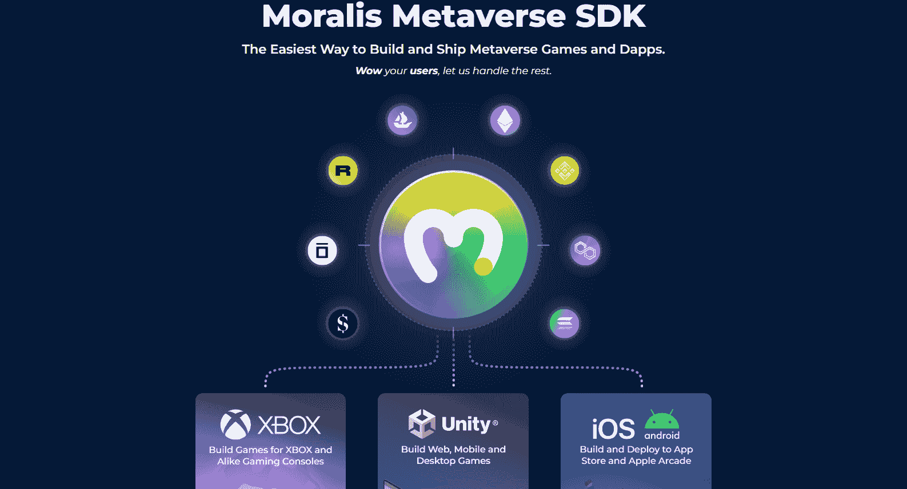

## 带有 Web3 登录示例的 unity Game–预览

如前所述，我们的 [Web3 认证](https://moralis.io/web3-authentication-the-full-guide/)示例非常简单。这是它在网络浏览器中的样子:

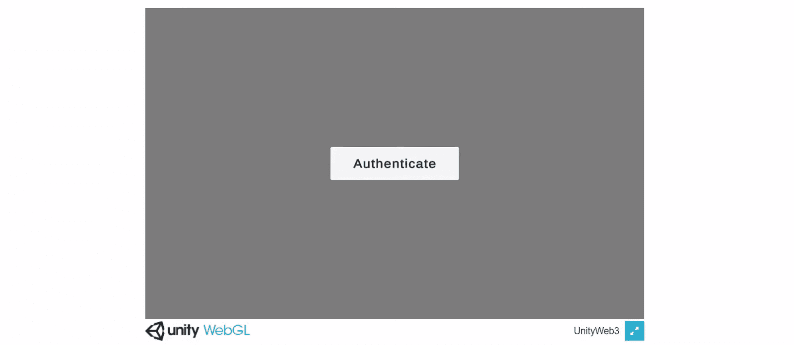

是的，你是正确的；上面的截图中有一个单独的按钮。当用户点击“认证”时，弹出一个 [Web3 钱包](https://moralis.io/what-is-a-web3-wallet-web3-wallets-explained/)，提示用户连接[元掩码](https://moralis.io/metamask-explained-what-is-metamask/):

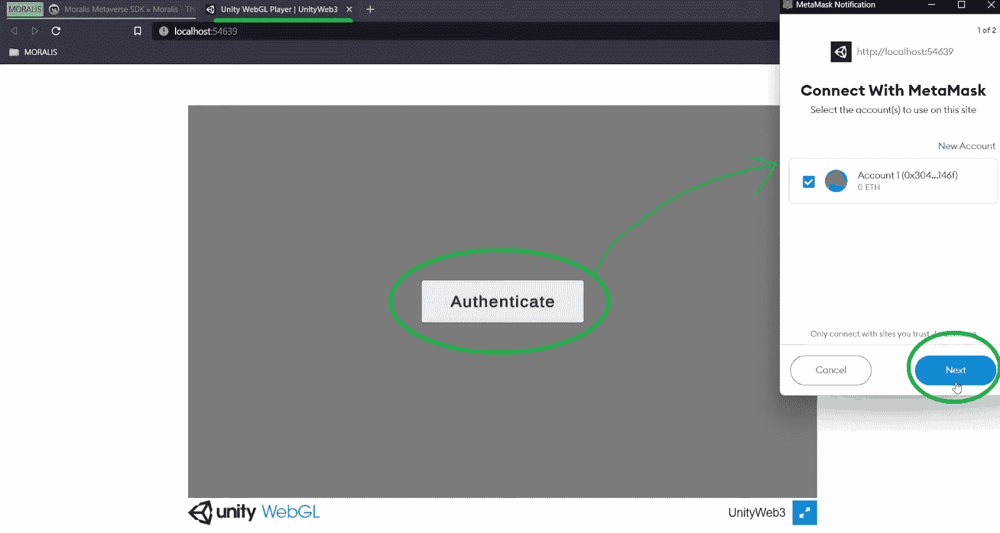

要继续，用户需要单击“下一步”按钮。这将检测他们的钱包地址，并要求他们确认连接:

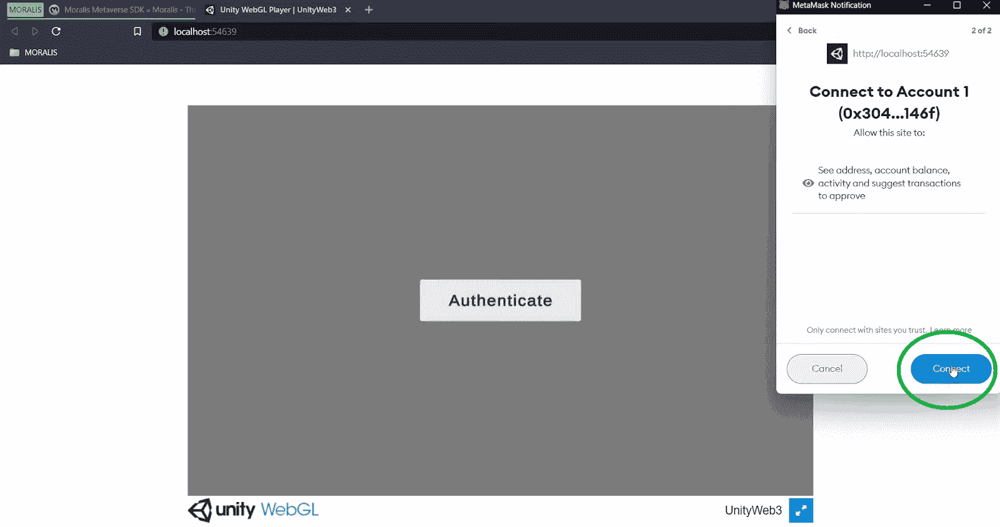

通过点击“连接”按钮，连接被建立，并且用户最终能够签署他们的权限:

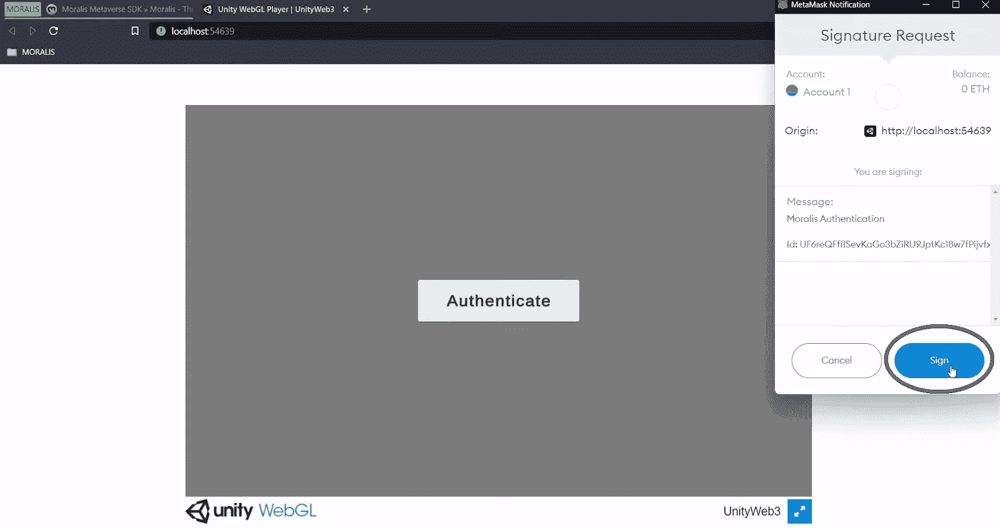

点击“Sign”按钮后，我们的示例 Unity game with Web3 登录会显示一个登录地址:

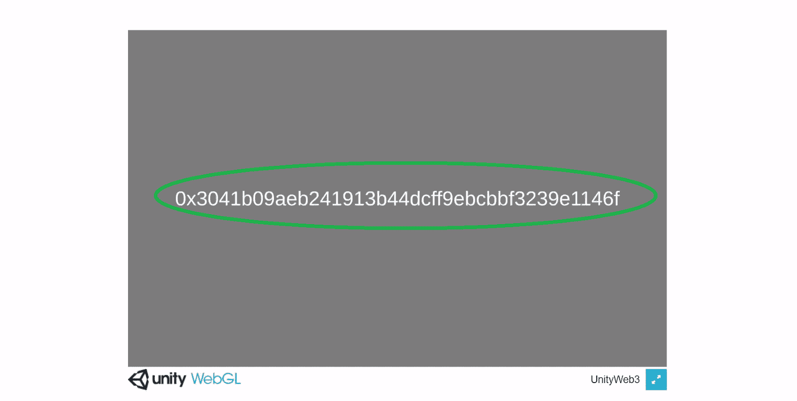

此外，如您所见，我们使用了 Moralis 的 MetaMask 集成，这使我们能够将这款最受欢迎的热门钱包用作身份验证工具。然而，Moralis 提供了其他 [Web3 用户加入](https://moralis.io/how-to-boost-web3-user-onboarding-success-rates/)选项。虽然元掩码可能是网络用户的最佳选择，但 [WalletConnect](https://moralis.io/what-is-walletconnect-the-ultimate-walletconnect-guide/) 为移动用户提供了更好的解决方案。此外，通过电子邮件或使用 [Web3 社交登录](https://moralis.io/web3-social-login-sign-in-dapp-users-with-google-email-or-twitter/)进行 [Web3 认证也是可能的。尽管如此，请记住](https://moralis.io/how-to-do-web3-authentication-via-email/)[元掩码对于开发者来说](https://moralis.io/metamask-for-developers-how-to-launch-web3-apps-with-metamask/)是非常重要的。

## 通过 Web3 登录连接 Unity 游戏–示例项目

如简介中所述，这个带有 Web3 登录示例的 Unity 游戏的整个项目已经在 [GitHub](https://github.com/MoralisWeb3/youtube-tutorials/tree/main/unity-webgl-web3) 上可用。因此，您可以从克隆代码开始。然而，在使用 Unity 时，最好下载[示例项目的 ZIP 文件](https://github.com/MoralisWeb3/youtube-tutorials/releases/tag/v1.0.0-unity-web3-general):

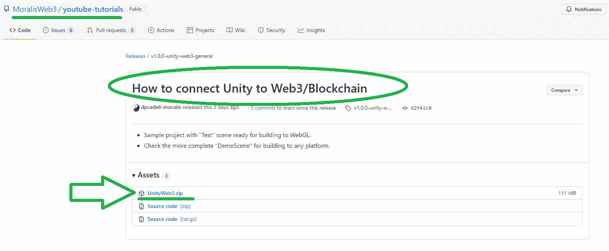

成功下载 ZIP 文件后，如上图，需要解压。然后，在 Unity 中打开“WebGL_Test”。由于我们将为 WebGL 构建，请确保您在“构建设置”(“文件”>“构建设置”)中将此设置作为选定的平台:

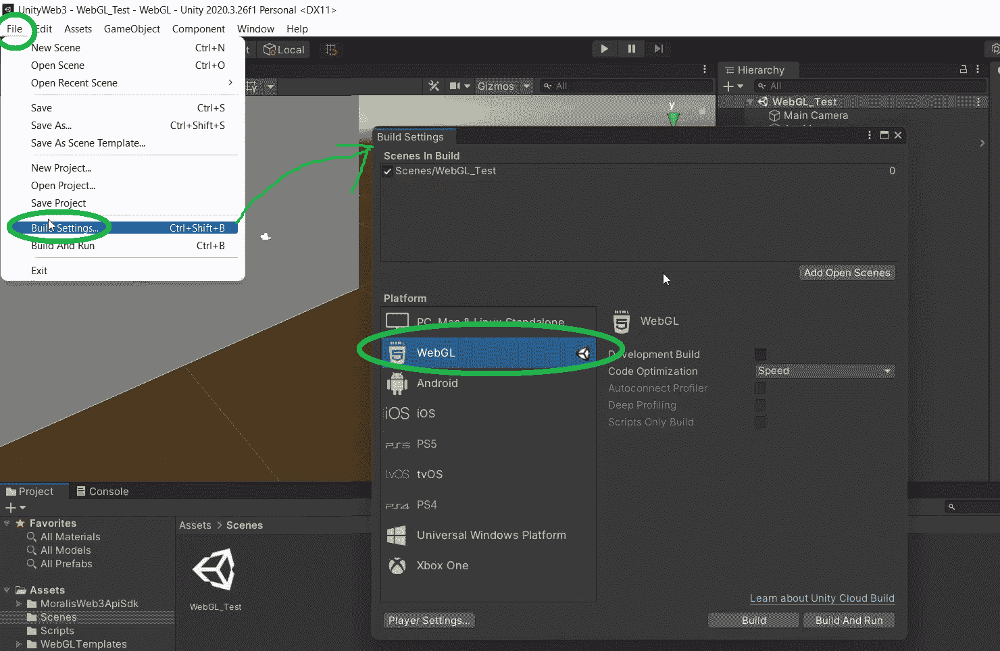

另外，请注意“MoralisWebApiSdk”文件夹包含所有 Sdk 元素，包括演示。但是，现在让我们关注“WebGL”场景:

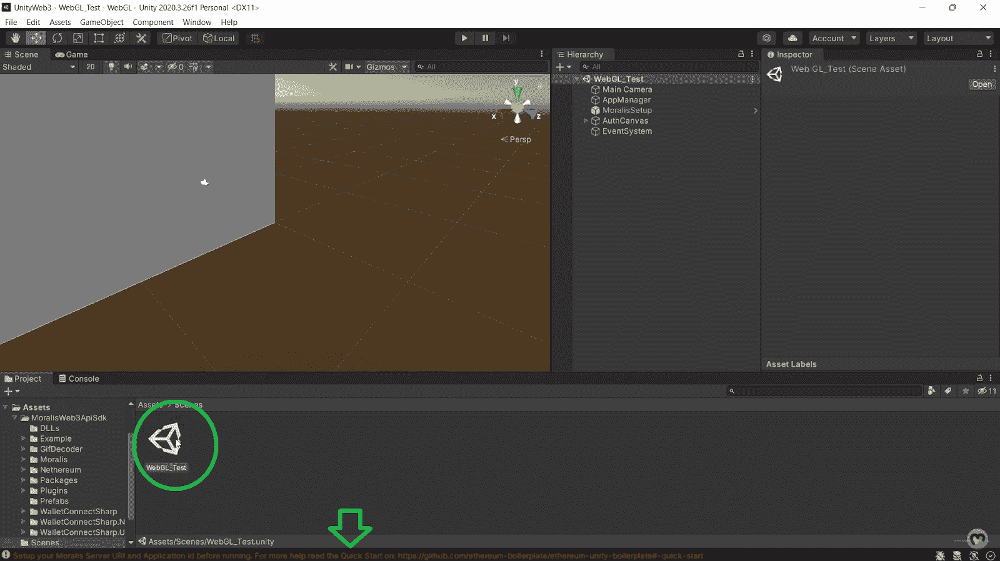

如果您继续操作，您可以在 Unity 屏幕的底部看到一条错误消息。这表明我们还没有输入我们的 Moralis 服务器 URL 和应用程序 ID。要查看这些详细信息的输入字段，您需要选择“Moralis 设置”预置:

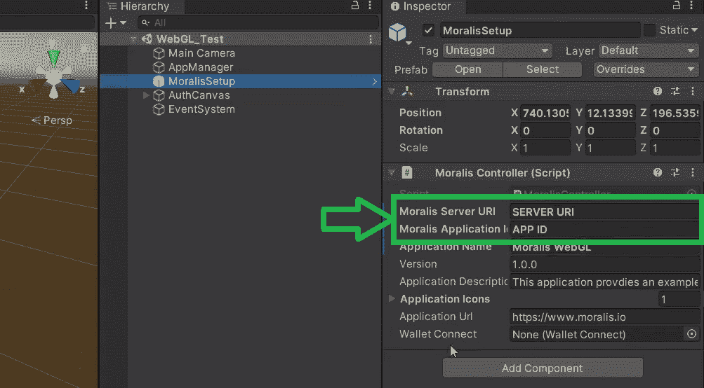

要获得 URL 和 ID 细节，您需要创建您的 Moralis 服务器。幸运的是，这很容易做到。然而，为了进一步帮助您，我们在以下两个部分中列出了所需的步骤。

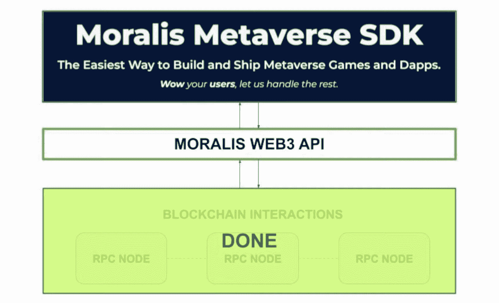

### 初始 Moralis 设置

无论你只是用 Web3 登录连接一个 Unity 游戏，索引区块链，还是使用终极[以太坊 dApp 样板](https://moralis.io/ethereum-dapp-boilerplate-full-ethereum-react-boilerplate-tutorial/)创建 dApp，你都需要从初始的 Moralis 设置开始。这让你可以访问 Moralis 的 SDK。此外，这个设置的主要目标是让您的 Moralis 服务器启动并运行。只有那时你才能看到它的细节。

#### 访问您的 Moralis 管理区并创建您的 Moralis 服务器

1.  [**创建一个免费的 Moralis 账户**](https://admin.moralis.io/register)——使用左边的链接进入 Moralis 注册页面。在那里，输入您的电子邮件地址并创建您的密码。然后点击确认电子邮件，完成整个过程，确认电子邮件将发送到您的电子邮件收件箱。*另一方面，如果你已经有一个活跃的 Moralis 账户，只需* [*登录*](https://admin.moralis.io/login) *。*

2.  [**创建一个 Moralis 服务器**](https://docs.moralis.io/moralis-server/getting-started/create-a-moralis-server)–此时，您应该登录到您的 Moralis 帐户，并进入您的管理区域。在“Servers”选项卡中，单击位于右上角的“+ Create a new Server”按钮。*如果你是第一次这么做，页面上的教程会指导你:*


点击“+创建新服务器”按钮后，您需要在三个网络类型选项中进行选择(见下面的截图)。选择最适合您项目的方案。

*注* *:在处理示例项目或测试 dApps 时，我们建议您坚持使用“Testnet 服务器”或“本地 Devchain 服务器”选项。然而，到了上线的时候，你需要选择“Mainnet 服务器”。*


选择网络类型后，将出现另一个弹出窗口。您将被要求输入服务器的详细信息。这些包括您的服务器名称(可以是您想要的任何名称)、您的地区、网络类型和链。要最终运行您的服务器，请单击“添加实例”按钮:


#### 访问您的 Moralis 服务器的详细信息并填充 Unity

3.  **访问您服务器的详细信息**–现在，您的服务器应该已经启动并运行。因此，您可以访问它的详细信息。为此，请单击服务器旁边的“查看详细信息”按钮:


详细信息将显示在新窗口中。在右侧，您会看到复制图标。使用它们可以轻松地逐个复制服务器的 URL 和应用程序 ID:


4.  **填充 Unity***–*要将 Moralis 的 SDK 与 Unity 连接起来，剩下的工作就是填充 Unity 中的相关字段。因此，只需将这两个详细信息分别粘贴到相应的输入字段中:


## 使用 Web3 登录的 Unity 游戏–我们的主场景和 Unity 设置

现在，我们已经通过将 Web3 与 Moralis 连接，在功能上为 Unity 添加了 web 3，是时候看看我们示例的主要场景了:

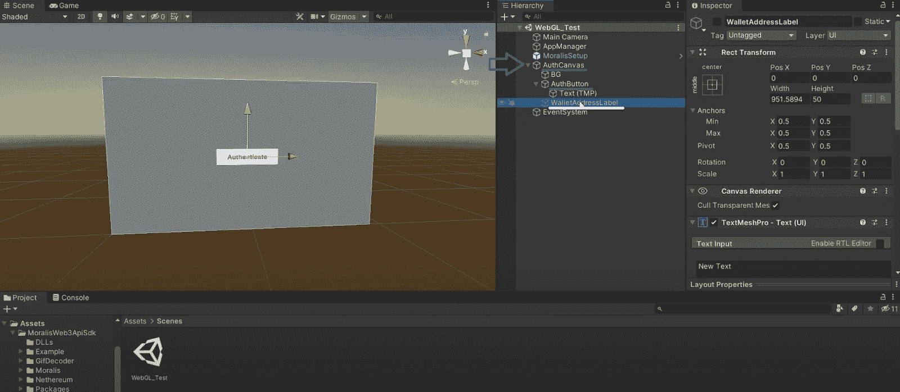

正如您在上面的截图中看到的，我们的身份验证画布由背景、身份验证按钮和“EventSystem”组成。还有“WalletAddressLabel”，确保用户的地址在成功登录后显示。

现在让我们仔细看看我们的按钮。“On Click()”选项当前为空。因此，为了获得我们所追求的功能，我们显然需要在这里做一些事情。因此，首先单击加号图标:


接下来，您需要将“AppManager”附加到新添加的点击事件上。您可以通过从层次结构中单击并拖动“AppManager”来完成此操作:

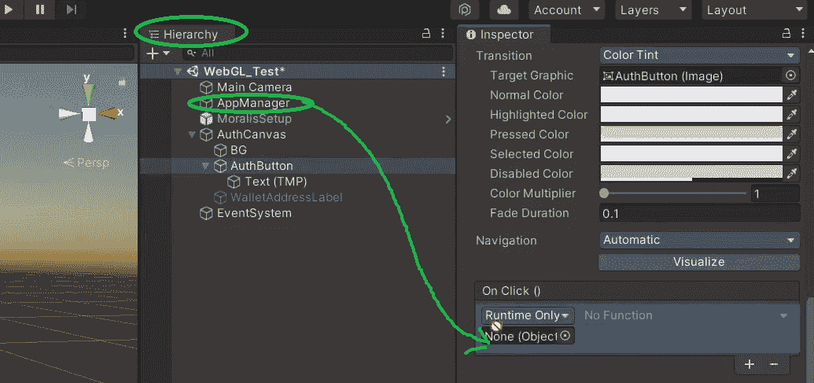

然后，通过点击“无功能”打开下拉菜单。然后，选择“AppManager”，最后点击“HandleAuthButtonClick()”:

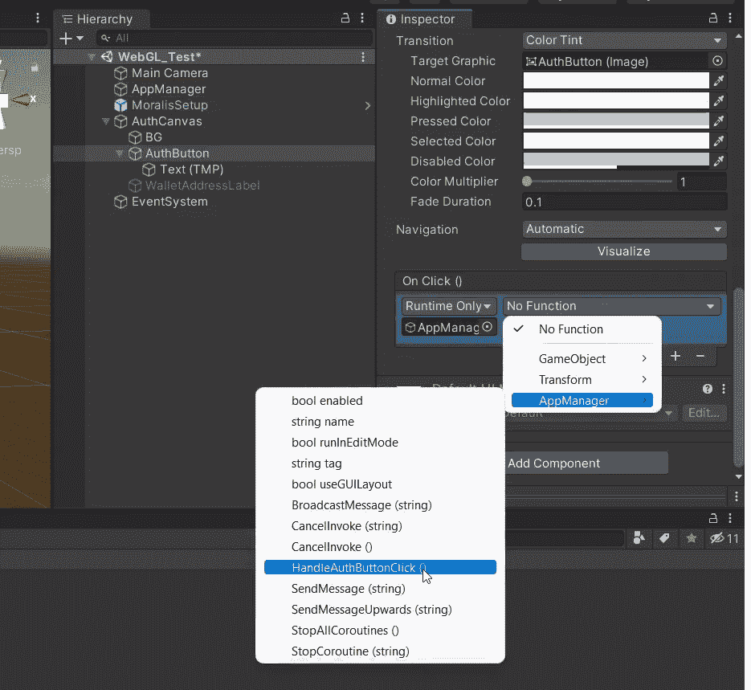

现在，您可以仔细看看支持我们项目的 Web3 功能的方法。因此，点击“层次结构”选项卡中的“应用管理器”:

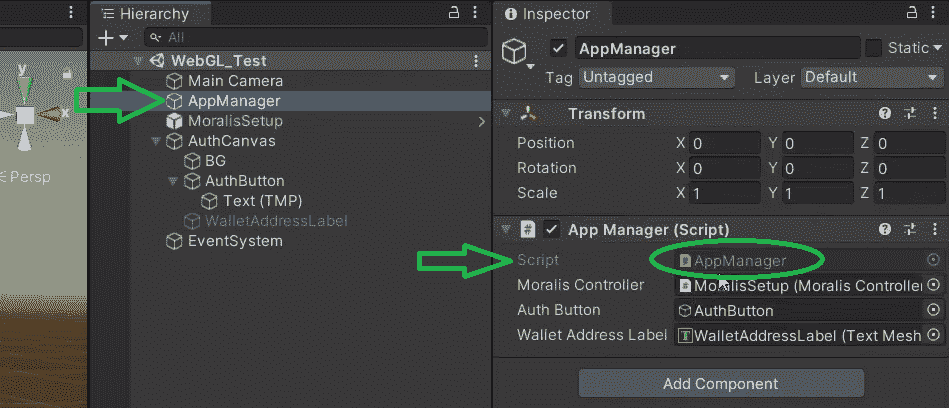

要打开相关脚本，请单击右侧“应用管理器(脚本)”选项卡中的“应用管理器”。

### 主脚本演练

第一个*值得一提的*行包含了 Moralis 的名称空间:

```js
using MoralisWeb3ApiSdk;
using Moralis.WebGL;
using Moralis.WebGL.Platform.Objects;
```

接下来，我们来关注一下“MoralisController”。这个钩子负责 Moralis setup 选项卡(我们在这里输入服务器的详细信息)。此外，我们还需要一个身份验证按钮(“authButton”)和一个钱包地址标签(“wallet address label”):

```js
    public MoralisController moralisController;
    public GameObject authButton;
    public TextMeshProUGUI walletAddressLabel;
```

我们希望在 start 上启动 Moralis 控制器。此外，我们希望检查用户是否已经登录:

```js
    private async void Start()
    {
        if (moralisController != null)
        {
            await moralisController.Initialize();
        }
        else
        {
            Debug.LogError("MoralisController is null.");
            return;
        }

        authButton.SetActive(!MoralisInterface.IsLoggedIn());
    }
```

查看上面的最后一行，您可以看到它还确保了只有当用户尚未登录时才启用身份验证按钮。

脚本中使用的另一个重要方法是“LoginWithWeb3”。后者与 GL 兼容，完成所有繁重的工作。它还包括“GetWalletAddress”方法，该方法获取用户的地址，并在用户成功登录后显示这些地址:

```js
  private string GetWalletAddress(MoralisUser user)
    {
        return user.ethAddress;
    }
```

多亏了莫利斯，”。“ethAddress”是获取用户地址的唯一途径。如果您对我们的“使用 Web3 登录的 Unity 游戏”示例中使用的主脚本的更多细节感兴趣，请查看下面 4:40 的视频。

### Moralis 仪表板

创建 Moralis 服务器后，您可以使用的另一个强大工具是 Moralis dashboard(数据库)。此外，您可以通过单击“查看详细信息”按钮旁边的箭头来访问该数据库(见下图)。接下来，您只需点击“仪表板”按钮:


在您服务器的仪表板内，您将能够看到所有登录和其他用户的详细信息。此外，结合 Moralis“同步”功能，Moralis 仪表盘使您能够[索引区块链](https://moralis.io/how-to-index-the-blockchain-the-ultimate-guide/)。此外，当您[同步和索引智能合同事件](https://moralis.io/sync-and-index-smart-contract-events-full-guide/)时，所有链上数据在您的 Moralis 服务器的仪表板内变得可用。有了所有这些链上数据，您可以很容易地阅读它并在编程中使用它。因此，你可以给你的 Web3 游戏或 dApps 添加各种功能。

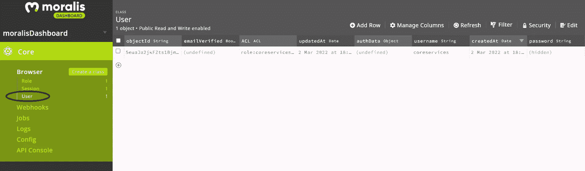

### 多平台就绪

由于我们的示例项目集中在 WebGL 平台上，我们想向您展示也可以选择其他平台。要访问支持多平台的演示场景，请导航到“MoralisWeb3ApiSdk”中的“Example”文件夹:

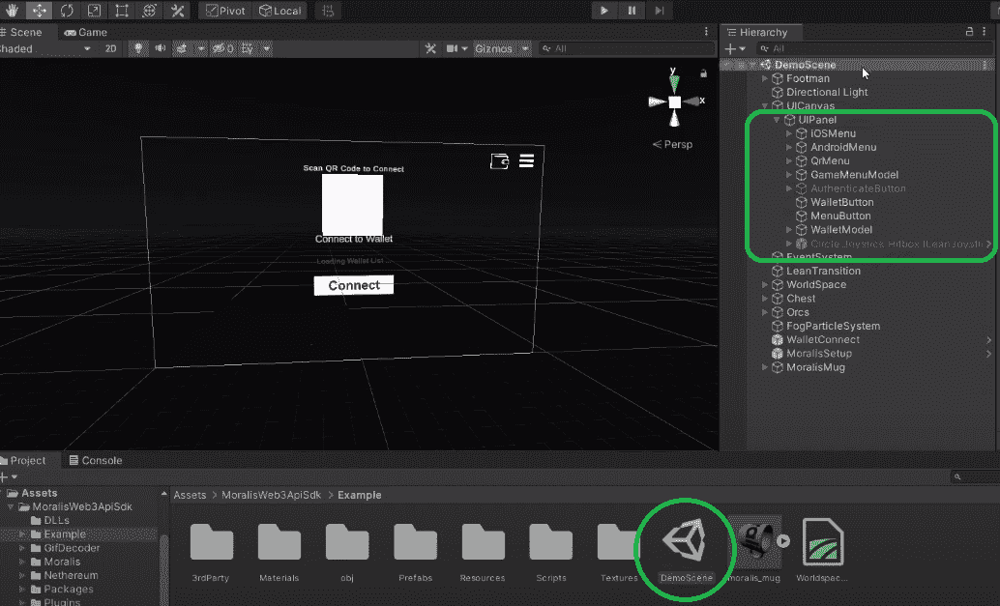

通过“MainMenuScript”脚本可以正确激活上述所有面板(在上图中标记)。

## 使用 Web3 登录的 Unity 游戏–构建和运行

到目前为止，我们已经介绍了正确使用我们的项目模板所需要知道的一切。此外，您应该已经正确完成了初始设置。这样，您就可以使用 Web3 登录构建并运行您自己版本的示例 Unity 游戏了。因此，再次转到“构建设置”并单击“构建并运行”按钮:

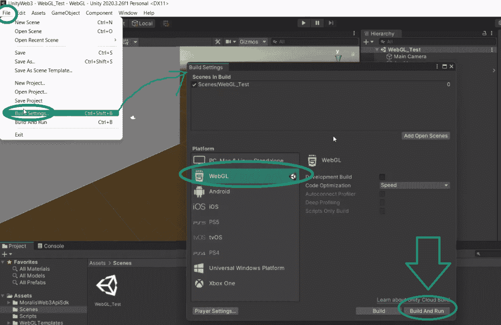

这将打开一个新窗口。在那里，您需要选择您想要构建的文件夹。我们建议创建一个新文件夹:

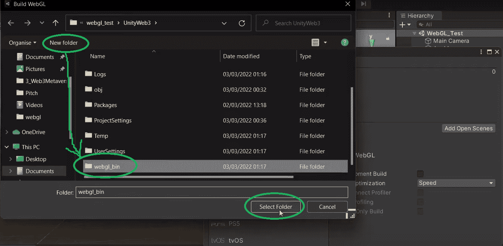

接下来，您会看到一个“进度条”,显示 Unity 正在构建和测试您的项目:

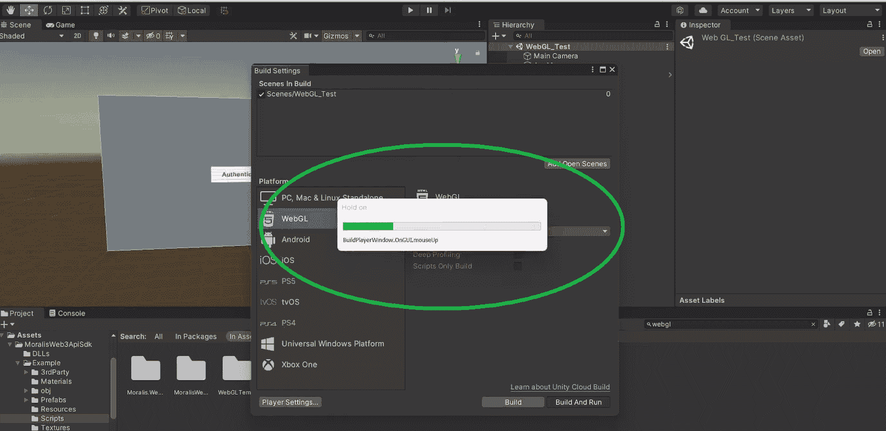

一旦完成，你就可以用 Web3 登录来测试你的 Unity 游戏了。如果你已经按照我们的指南去做了，你应该已经完成了“Unity Game with Web3 登录示例-预览”一节中介绍的相同步骤，事情应该会正常工作。

尽管如此，如果你更喜欢视频，我们推荐你观看下面的视频。在这本书里，Moralis 专家经历了与上面相同的步骤:

https://www.youtube.com/watch?v=FY77ImUpciI

## 通过 Web3 登录连接 Unity 游戏–摘要

在这一点上，你知道当使用 Moralis 的元宇宙 SDK 时，用 Web3 登录连接一个 Unity 游戏是一件轻而易举的事情。此外，当您使用我们的项目 ZIP 文件时，您只需要添加您的 Moralis 服务器的详细信息。此外，您还了解了支持许多平台。因此，我们真的鼓励你更上一层楼。因此，请确保使用此处获得的知识将您独特的 Unity 游戏与 Web3 登录连接起来。

然而，如果你缺乏想法或需要更多的实践，我们建议检查我们的其他元宇宙的例子项目。例如，你可以学习如何[构建一个中世纪的元宇宙游戏](https://moralis.io/how-to-build-a-medieval-metaverse-game/)或者一个[网络 3 MMORPG](https://moralis.io/build-a-web3-mmorpg-with-unity-in-10-minutes/) 。另一方面，您可能对探索其他区块链发展主题感兴趣。如果是这样，我们鼓励你访问[Moralis 伦理 YouTube 频道](https://www.youtube.com/c/MoralisWeb3)和[Moralis 伦理博客](https://moralis.io/blog/)。这两个出口都可以完美地服务于你的免费加密教育进程。此外，一些最新的话题包括 [Web3 电子商务](https://moralis.io/web3-e-commerce-create-a-web3-e-commerce-platform-in-5-steps/)，一个 [Web3 亚马逊市场](https://moralis.io/how-to-build-a-web3-amazon-marketplace/)，[炼金术 API 替代品](https://moralis.io/alchemy-api-alternatives-web3-development-platforms/)，创建一个 [BNB 链令牌](https://moralis.io/how-to-create-a-bnb-chain-token-in-5-minutes/)，克隆[比特币基地钱包](https://moralis.io/cloning-coinbase-wallet-how-to-create-a-coinbase-clone/)，创建一个[索拉纳令牌](https://moralis.io/how-to-create-a-solana-token-in-5-steps/)，以及一个 [NFT 铸币页面](https://moralis.io/how-to-launch-an-nft-minting-page-full-walkthrough/)演练。

然而，免费教育很少获得最佳结果。如果你想尽快成为一名区块链开发者，这一点尤其重要。因此，您可能会对更专业的方法感兴趣。如果是这样的话，报名参加[Moralis 学院](https://academy.moralis.io/)可能正是你所需要的。

**