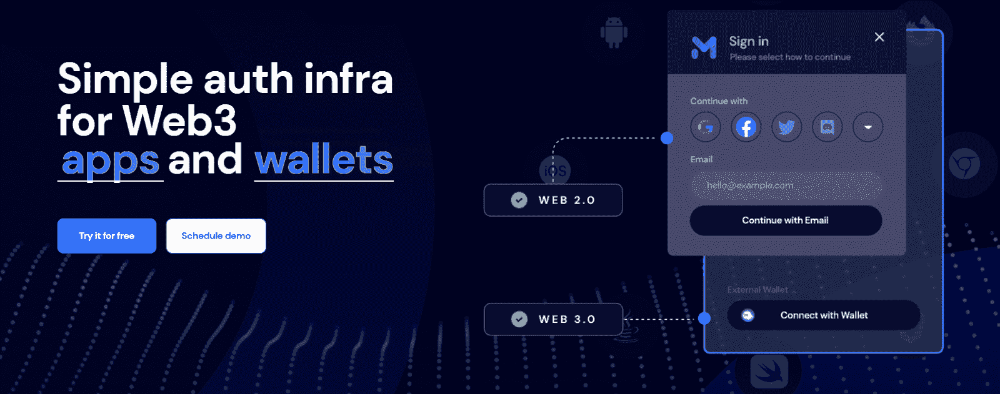
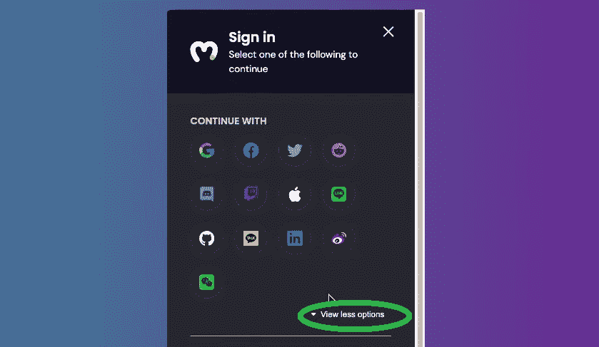
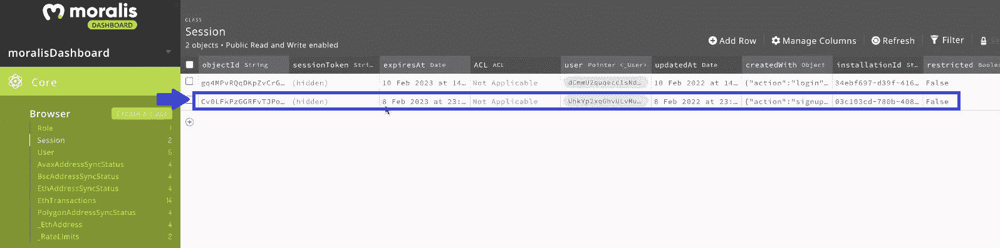

# 将 Web3 钱包连接到 Twitter 帐户

> 原文：<https://moralis.io/connecting-web3-wallet-to-twitter-account/>

在今天这个时代，大多数人都有一个 Twitter 账户。Twitter 拥有近 4 亿活跃用户，事实证明它非常受欢迎，尤其是在 Web3 和加密爱好者中。有了如此庞大的用户基础，让你的 dapps 使用 Twitter 进行 Web3 登录将是非常有益的。我们可以通过将 Web3 钱包连接到 Twitter 账户来实现这一点。使用 Web3Auth 和 [**Moralis**](https://moralis.io/) **这两个现象级工具，你可以轻松地将 Web3 登录用 Twitter 整合到你的** [**去中心化应用(dapps)**](https://moralis.io/decentralized-applications-explained-what-are-dapps/) **中。而且，在使用 Moralis 时，您不必手动实现这种** [**Web3 社交登录**](https://moralis.io/web3-social-login-sign-in-dapp-users-with-google-email-or-twitter/) **。完成此处演示的初始设置后，您可以轻松完成“将 Web3 钱包连接到 Twitter 帐户”功能。本质上，你可以从 Moralis 家的文档** [**中复制并粘贴代码片段，然后在创纪录的时间内完成这项任务！**](https://docs.moralis.io/)

接下来，您将有机会加入我们，创建一个 dapp 示例。后者将全部是关于 [Web3 认证](https://moralis.io/web3-authentication-the-full-guide/)。当然，它将包括一个用 Twitter 完成 Web3 登录的选项。您将要学习的是使用熟悉的方法覆盖 Web3 登录的最简单的方法。因此，你将提高 [Web3 用户加入](https://moralis.io/how-to-boost-web3-user-onboarding-success-rates/)的成功率。在此过程中，您将学习如何设置您的 Web3Auth 和 Moralis 帐户。后者是最好的 [Web3 后端平台](https://moralis.io/exploring-the-best-web3-backend-platform/)，能让你在几分钟内创建优秀的 dapps。这个用于加密操作系统的[Firebase 也是关于跨链互操作性的。因此，在所有受支持的链上将 Web3 钱包连接到 Twitter 账户成为可能。目前这些包括](https://moralis.io/firebase-for-crypto-the-best-blockchain-firebase-alternative/)[以太坊](https://moralis.io/full-guide-what-is-ethereum/)、[多边形](https://moralis.io/how-to-connect-to-polygon-nodes/)、[雪崩](https://moralis.io/how-to-connect-to-avalanche-nodes/)、[索拉纳](https://moralis.io/how-to-create-a-solana-token-in-5-steps/)和 Fantom。所以，在继续之前，不要忘记[创建你的免费 Moralis 账户](https://admin.moralis.io/register)。



## 为什么要在你的 Dapps 中添加使用 Twitter 的 Web3 登录？

对某件事有一个正确的理解通常会为“为什么”提供强有力的答案。、*什么？*“提问，可以成为强大的动力。因此，让我们从一些关于用 Twitter 登录 Web3 的基础知识开始我们的讨论。你知道什么是“社交登录”吗？它是所有利用用户社交媒体账户的登录选项的统称。这样，用户只需点击一个按钮就可以注册并登录其他应用程序。因此，用户可以跳过他/她需要输入电子邮件地址和创建密码的部分。因此，社交登录显然是一个简洁实用的解决方案。但是，它能用于 Web3 吗？在 Web3 中，通常需要使用 [Web3 钱包](https://moralis.io/what-is-a-web3-wallet-web3-wallets-explained/)，如[元掩码](https://moralis.io/metamask-explained-what-is-metamask/)进行认证。感谢 Web3Auth，答案是“是”。那样的话，我们参考 [Web3 社交登录](https://moralis.io/how-to-build-a-web3-login-in-5-steps/)。

*注* *:如果你不确定什么是* [*Web3*](https://moralis.io/the-ultimate-guide-to-web3-what-is-web3/) *的话，可以去看看我们其他关于那个话题的文章。通过深入研究"*[*" web 3 是如何工作的？*](https://moralis.io/how-does-web3-work-web3-explained/) *”话题，发现当前的*[*web 3 tech stack*](https://moralis.io/exploring-the-web3-tech-stack-full-guide/)*长什么样，你就见多识广了。*

你现在知道让用户使用他们的 Twitter 账户或其他社交媒体账户登录是用户友好的。这使他们能够跳过创建新帐户的过程，反过来也节省了他们的时间。同样，这也是用户从 Web2 中习惯的东西。因此，各种社交登录方法可以帮助新手进入加密领域。


## 将 Web3 钱包连接到 Twitter 帐户–示例项目

我们相信构建范例项目是最好的学习方式。因此，我们邀请你跟随我们的脚步，创建你自己的 dapp，提供使用 Twitter 的 Web3 登录。然而，在我们卷起袖子开始编码之前，让我们先看一下我们的示例 dapp 的预览。当然，我们让事情变得非常简单。然而，我们确保包含了对我们的“将 Web3 钱包连接到 Twitter 帐户”任务很重要的所有方面。因此，我们的示例 dapp 还包括“测试事务”特性。因此，我们能够向您展示，通过将 Web3 钱包连接到 Twitter 帐户或其他社交媒体帐户登录的用户实际上可以参与 Web3 领域。

### 使用 Twitter 登录 web 3–我们的 Dapp 预览示例

正如您在下面的截图中看到的，我们决定同时运行我们的 dapp 的两个实例。这样，我们可以在两个帐户之间执行测试交易。首先，我们的两个示例用户都还没有登录:


看上面的截图，可以看到用户需要点击“用 Web3Auth 登录”按钮才能继续。点击按钮后，他们将看到以下登录模块:


让我们关注上图的左侧，这里有登录模块。后者包括三个部分:“继续”、“电子邮件”和“外部钱包”部分。因此，我们的登录模块涵盖了三种不同的登录方法。有兴趣将 Web3 钱包连接到 Twitter 账户的用户需要点击顶部的 Twitter 图标。当然，他们可以使用任何其他提供的社交登录方法。此外，用户可以通过“查看更多选项”按钮查看其他 Web3 社交登录选项:



*如果用户想通过电子邮件* *进行* [*Web3 认证，需要重点关注“电子邮件”部分。然而，“社交”和“电子邮件”登录的很大一部分是 Web3Auth 自动为用户创建加密钱包。因此，您可以向登录用户提供 Web3 的全部功能，就像他们使用自己的热钱包一样。此外，他们不需要创建加密钱包，甚至不知道他们是什么。尽管如此,“外部钱包”部分是为那些想要使用元掩码、利用*](https://moralis.io/how-to-do-web3-authentication-via-email/)[*wallet connect*](https://moralis.io/what-is-walletconnect-the-ultimate-walletconnect-guide/)*替代或其他热门钱包的用户准备的。*

## 使用 Twitter 进行 Web3 登录的演示

*注意* *:在这个演示中，一个示例用户决定使用他的 Google 帐户。然而，在用 Twitter 登录 Web3 的情况下，原理是相同的。用户需要点击 Twitter 标志，然后选择他们的 Twitter 账户，而不是“Google”图标。将 Web3 钱包连接到 Twitter 账户的过程将由 Web3Auth 在后端完成。*

如上所述，用户首先在“继续”部分选择他们喜欢的社交媒体平台:


单击任何特定图标后，将出现一个弹出窗口，要求他们选择自己的帐户:


此外，一旦用户选择了他们的社交媒体帐户，他们还有机会设置免费的双因素身份验证(2FA)方法:


假设我们的假设用户决定选择“也许下次”选项。如果是，他们现在已经登录并准备完成加密交易。此外，由于有了 [Moralis SDK](https://moralis.io/exploring-moralis-sdk-the-ultimate-web3-sdk/) ，我们还可以访问 Moralis 仪表板(数据库)。因此，我们可以很容易地确认登录。此外，下面的屏幕截图清楚地表明我们的演示登录是成功的:



此外，我们的示例 dapp 的界面还让用户知道他们现在已经登录:


上面的屏幕截图显示了一个钱包地址，该地址已被自动创建并分配给用于本演示的 Google 帐户。将 Web3 wallet 连接到 Twitter 帐户的过程也是以同样的方式完成的。

### 将 Web3 钱包连接到 Twitter 账户–交易示例

让我们完成一个测试事务来确认 Web3 登录 Twitter、Google 和其他社交媒体的功能。为此，我们还必须使用另一个帐户登录，在那里我们将使用“外部钱包”选项和我们的元掩码扩展。两个示例用户都通过身份验证后，我们可以发送一些测试 ETH。我们将在 Ropsten 上这样做，它是[以太坊测试网](https://moralis.io/ethereum-testnet-guide-connect-to-ethereum-testnets/)中的一个:


*注* *:如果你更喜欢看上面演示的视频版本，可以看看下面 0:53 开始的视频。*

## 将 Web3 钱包连接到 Twitter 帐户–实施

Moralis 最近增加了一个来自“Web3Auth”的新认证功能，使 Web3 登录 Twitter 和其他社交媒体选项成为可能。因此，您需要完成一些初始设置来访问 Web3Auth 和 Moralis。幸运的是，Moralis 的文档在“用户> Web3 身份验证> Web3Auth”中提供了清晰的说明。但是，我们希望通过在以下部分指导您完成初始设置来进一步帮助您。

### 使用 Twitter 登录 Web3 的本质——web 3 auth 设置

完成以下步骤，使用 Web3Auth 将 Web3 wallet 连接到 Twitter 帐户:

1.  创建您的 [Web3Auth](https://dashboard.web3auth.io/) 账户。您可以使用您的电子邮件地址或社交媒体帐户:


2.  创建帐户后，您可以访问您的仪表板。在您的 Web3Auth 仪表板中，转到“即插即用”:


3.  在“即插即用”选项卡中，单击“创建项目”按钮。

4.  创建新项目后，您可以访问和复制项目的客户 ID:


5.  将 Web3Auth 的 SDK 添加到应用程序中。
    1.  如果您通过“CDN”导入 Moralis，可以使用以下代码行:

```js
<script src="https://unpkg.com/@web3auth/[email protected]/dist/web3auth.umd.min.js"></script>
```

2.  但是，如果您通过“npm”或“yarn”导入 Moralis，请使用以下命令:

```js
npm install --save @web3auth/web3auth
```

6.  有了 Web3Auth 项目的客户机 ID，SDK 也准备好了，就可以使用 authenticate 函数了。正如您在下面看到的，该函数接受一些参数。此外，客户机 ID 是唯一必需的参数。以下是您需要使用的代码行(不要忘记用您的客户端 ID 替换占位符):

```js
const user = await Moralis.authenticate({
	provider: "web3Auth",
	clientId: "ABC*****************",
})
```

可选参数包括“chainId”、“theme”、“appLogo”和“loginMethodsOrder”。有关每个参数的更多详细信息，请参考 Moralis 的文档或使用下面 4:38 的视频。

### 用 Moralis 实现 Twitter 的 Web3 登录

这是你通过创建自己的 dapp 将 Web3 钱包连接到 Twitter 账户的部分。为了让事情变得简单，我们建议您使用我们在 [GitHub](https://github.com/MoralisWeb3/youtube-tutorials/tree/main/web3Auth) 上为您准备的代码。因此，您将可以毫不费力地创建上述示例 dapp。确保重点关注“ [SignIn.js](https://github.com/MoralisWeb3/youtube-tutorials/blob/main/web3Auth/components/SignIn.js) ”文件。这是您将使用上一节中的代码行的地方。本质上，如果使用我们的代码，您只需要粘贴您的 Web3Auth 项目的客户端 ID。此外，我们建议您使用下面的视频，从 8:33 开始。在那里，Moralis 专家将指导您完成一些可选的定制。尽管如此，为了使用 Moralis 的 SDK，您需要首先完成初始的 Moralis 设置。

以下是设置 Moralis 时需要经历的步骤:

1.  [**登录你的 Moralis 利斯账户**](https://admin.moralis.io/login)——如果你还没有创建你的免费 Moralis 利斯账户，请使用本文开头的链接。

2.  [**创建一个 Moralis 服务器**](https://docs.moralis.io/moralis-dapp/getting-started/create-a-moralis-dapp#2.-create-a-moralis-server)–选择网络类型，输入您的服务器的详细信息，并启动服务器。


3.  **访问服务器详情**–使用“查看详情”按钮:


4.  **复制您的服务器的 URL 和应用程序 ID**–只需复制如下所示的详细信息:


5.  **初始化 Moralis***–*进入“ [_app.js](https://github.com/MoralisWeb3/youtube-tutorials/blob/main/web3Auth/pages/_app.js) ”文件，将上面复制的详细信息粘贴在标记的地方:


*如前所述，这是我们在文章* *:* 中一直引用的视频教程

https://www.youtube.com/watch?v=44ItBuw86AA

## 将 Web3 Wallet 连接到 Twitter 帐户–摘要

至此，您已经是 Web3 身份验证的半个专家了。您现在知道，使用正确的工具，您可以将 Web3 wallet 连接到 Twitter 帐户。您还将使用两个主要工具:Web3Auth 和 Moralis。将这些工具与您的 JavaScript 技能结合使用，您可以使用 Twitter 和其他社交媒体实现 Web3 登录。因此，您已经准备好接受更高级的 dapps，并使入职流程更加用户友好。

然而，如果你想先建立你的自信，我们建议你做一些其他的例子项目。你可以在[Moralis 博客](https://moralis.io/blog/)和[Moralis YouTube 频道](https://www.youtube.com/c/MoralisWeb3)上找到它们。除了无数的范例项目，这两个渠道还涵盖了广泛的区块链发展主题。例如，一些最新的文章向您展示了如何[将 Web3 钱包连接到网站](https://moralis.io/how-to-connect-a-web3-wallet-to-a-website/)，[设置 BNB 钱包](https://moralis.io/binance-coin-wallet-guide-how-to-set-up-a-bnb-wallet/)，[创建 Web3 视频流服务](https://moralis.io/how-to-create-a-web3-video-streaming-service/)或 [Web3 网飞克隆](https://moralis.io/how-to-develop-a-web3-netflix-clone/)，以及[创建多链钱包](https://moralis.io/how-to-build-a-multi-chain-wallet-in-5-steps/)或 [ETH 钱包](https://moralis.io/how-to-create-an-eth-wallet-full-guide/)。此外，我们探索一切有关于 [NFT 公用事业](https://moralis.io/nft-utility-exploring-nft-use-cases-in-2022/)、[索拉纳是什么？](https://moralis.io/what-is-solana-the-full-2022-guide/)、Web3 游戏的[好处](https://moralis.io/benefits-of-web3-gaming-full-breakdown/)、 [Unity Web3](https://moralis.io/unity-web3-beginners-guide-to-unity-web3-programming/) 等等。因此，请确保充分利用这些有价值的内容。

尽管如此，你可能会满怀信心地渴望[成为一名 Web3 开发人员](https://moralis.io/how-to-become-a-web3-developer-full-guide/)，并尽快成为全职加密人员。在这种情况下，你应该考虑采取更专业的方法。因此，[Moralis 学院](https://academy.moralis.io/)可能就是你要去的地方。通过专业的[区块链发展课程](https://academy.moralis.io/all-courses)，先进的社区，个性化的学习路径和专家导师，你将最大限度地增加成功的机会。