# 为 Web3 创建 Reddit 克隆–分步指南

> 原文：<https://moralis.io/create-a-reddit-clone-for-web3-step-by-step-guide/>

在传统的“集中式”社交媒体世界里， [Reddit](https://www.reddit.com) 是一个非常受欢迎的用户平台。尽管如此，Reddit 仍然是一个中心化的平台——随之而来的是审查或用户数据被利用的风险。因此，今天的集中式社交媒体平台存在几个问题。然而，Web3 时代已经来临。这一范式转变无疑将颠覆各种学科——甚至可能颠覆社交媒体——让用户拥有去中心化的平台。以 Reddit 为例，你能想象开发一个不同版本的平台吗，比如 Web3 Reddit？事实上，通过使用 Moralis，您可以快速轻松地为 Web3 创建 Reddit 克隆。因此，我们邀请您跟随这份逐步指南，用 Moralis 构建一个 Web3 Reddit 克隆。

多亏了 Moralis 这个终极的 Web3 开发平台，前端开发人员只需熟练掌握 T2 的 JavaScript 就能承担各种区块链项目。有了 Moralis 的支持，你就可以[创建自己的 NFTs](https://moralis.io/how-to-create-your-own-nft-in-5-steps/) 、 [ERC-20](https://moralis.io/erc20-exploring-the-erc-20-token-standard/) 代币、[启动 NFT 市场](https://moralis.io/how-to-launch-an-nft-marketplace/)、[创建 DeFi 仪表板](https://moralis.io/how-to-create-a-defi-dashboard-in-5-steps/)，以及许多其他类型的[dapp](https://moralis.io/decentralized-applications-explained-what-are-dapps/)(去中心化应用)。此外，覆盖整个区块链相关的后端所需要的只是复制和粘贴由 [Moralis 的文档](https://docs.moralis.io/)提供的代码片段。因此，您需要克服 RPC 节点的所有限制，因此，将您的注意力和资源集中在创建令人印象深刻和用户友好的前端上。

在本文中，我们将接受创建 Reddit Web3 克隆的挑战，在此期间，您将直接看到 [Moralis 的 SDK](https://moralis.io/exploring-moralis-sdk-the-ultimate-web3-sdk/) 的威力。它的[以太坊 API](https://moralis.io/ethereum-api-develop-ethereum-dapps-with-moralis/) ，结合它的 IPFS 和[元掩码](https://moralis.io/metamask-explained-what-is-metamask/)集成和终极以太坊 dApp 样板，将使我们能够在几个小时内准备好一个全功能的 Web3 Reddit dApp。


## **用 Moralis 创建 Web3 Reddit 克隆**

当承担分散的项目时，比如用 Moralis 构建一个 dApp，你首先需要把事情设置好。幸运的是，这个设置很简单，并且围绕着我们将要使用的工具。后者包括以下内容:

*   **Moralis**–Moralis 是一个终极的 Web3 开发平台，可以满足您所有与区块链相关的后端需求。

*   **meta mask**–meta mask 是最受欢迎的热门钱包，它还为开发者提供了对其 dApp 用户进行[认证](https://moralis.io/how-to-authenticate-with-metamask/)的功能。本质上，它是进入加密领域的门户。此外，由于 Moralis 的 MetaMask 集成，您可以无缝地使用这个钱包。

*   **代码编辑器**——尽管 Moralis 提供了所有的快捷方式，你仍然需要做一些编码工作(最常见的是对模板进行简单的调整)。为此，您需要一个代码编辑器。我们一般用 [Visual Studio 代码](https://code.visualstudio.com)(VSC)；但是，请随意使用任何其他选项。

*   [**以太坊 dApp 样板**](https://moralis.io/ethereum-dapp-boilerplate-full-ethereum-react-boilerplate-tutorial/)——为了让创建各种 dApp 的过程尽可能简单，我们创建了一个以太坊 dApp 样板。这样，您可以在几分钟内启动并运行通用 dApps。当然，这取决于你的创造力和前端技能来应用必要的调整和添加，以获得独特的 Web3 应用程序。

当谈到设置提到的工具时，我们建议查看我们的文章，该文章涵盖了构建一个[以太坊社交网络](https://moralis.io/ethereum-social-network-how-to-build-an-ethereum-social-media-platform/)的主题。在那里，您将学习如何启动 Ethereum dApp 样板文件并创建一个 Moralis 服务器。此外，那篇文章还涵盖了我们的 Web3 Reddit 克隆完成后的所有细节，以及它将包含什么样的功能。后者包括认证用户(Web3 登录)，发布不同类别的帖子，以及对特定帖子投赞成票或反对票的选项(见下一节)。

### **我们的 Web3 Reddit 克隆版–快速预览**

在我们仔细研究本指南的每一步之前，让我们快速预览一下我们要创建的 Web3 Reddit 克隆。这是我们完成的平台的图像:

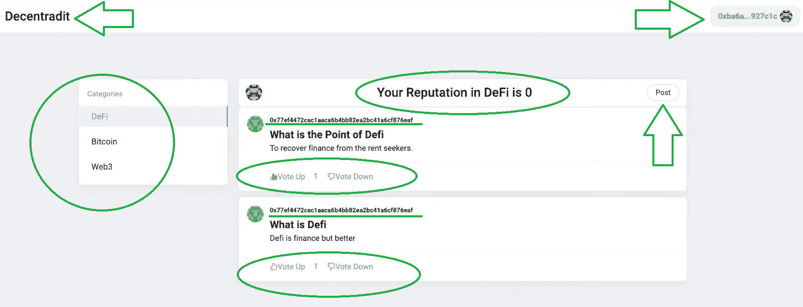

上图在左上角显示了我们的 Web3 Reddit 克隆的名称(分散的),以及一个登录用户的地址(右上角)。此外，您还可以看到，我们的分散式 Reddit 克隆整合了用户的声誉和不同类别的帖子。此外，一旦选择了特定的类别，用户就可以通过点击“发布”按钮来发布。此外，每个帖子的顶部都有创建者的地址，后面是标题，然后是内容本身。此外，如前所述，每个帖子都可以被投票赞成或投票反对，这是用户声誉得分的基础。*后者是应用特定规则的绝佳领域，可为平台增加更多可信度。例如，您可以添加一个规则，通过将较高声誉的用户的投票相乘来增加权重。*

*注意* *:要查看我们即将创建的 Web3 Reddit 克隆的详细演示，请查看本文末尾的视频(从 0:30 开始)。此外，您可以看到用户如何在 1:36 发布帖子，以及他们如何在 2:14 投赞成票(或反对票)。*

## **用 Moralis 创建 Web3 Reddit 克隆的分步指南**

在我们真正卷起袖子，开始调整和添加代码来创建一个 Web3 Reddit 克隆之前，让我们简要概述一下我们需要完成的步骤:

1.  [**创建您的免费 Moralis 拉斯账户**](https://admin.moralis.io/register) **，这将使您能够** [**创建 Moralis 拉斯服务器**](https://docs.moralis.io/moralis-server/getting-started/create-a-moralis-server) **。**

2.  **通过使用代码编辑器(如 VSC)利用终极以太坊 dApp 样板(** [**【快速入门】**](https://github.com/ethereum-boilerplate/ethereum-boilerplate#-quick-start) **)。**

3.  [**创建一份智能合同**](https://moralis.io/how-to-create-smart-contracts/) **，确保我们的 Web3 Reddit 平台内所有与发帖和投票相关的交易都能正确执行。**

4.  为我们的 Moralis 服务器设置事件监听器。

5.  对以太坊 dApp 样板进行必要的调整和添加，以获得我们正在寻找的前端(如上面的预览所示)。

6.  添加适当的代码来覆盖我们的 Reddit 克隆的功能。这包括使用 IPFS 集成以分散的方式将帖子存储为内容。此外，正确连接创建的智能合同，以便添加帖子、投票以及更新帖子提要和用户信誉的功能将按计划执行。

如上所述，我们有一篇单独的文章，详细介绍了如何正确设置来创建一个 Web3 Reddit 克隆(步骤一和步骤二)。因此，我们将把注意力集中在这里的第三步到第六步。此外，为了更容易理解某些步骤，我们将在视频中引用特定的时间戳，在视频中，Moralis 专家将介绍上面列出的所有步骤。


### **添加必要的智能合同**

我们为此目的创建的智能合约在 GitHub("[dec undit . sol](https://github.com/ethereum-boilerplate/web3-social-network-boilerplate/blob/main/smart%20contracts/contracts/decentradit.sol)")供您使用。如上所述，我们的 Web3 Reddit 平台将实现发布和投票功能，这将通过使用“分散的. sol”智能合同来指导。此外，让我们更仔细地看看这个智能合约的一些特定部分。*如果你喜欢看视频解释，看看下面 3:13 的视频。*

以下四个事件是我们智能合约的核心:创建帖子、添加内容、创建新类别和投票(向上投票或向下投票)。

```js
contract Decentradit {

    event PostCreated (bytes32 indexed postId, address indexed postOwner, bytes32 indexed parentId, bytes32 contentId, bytes32 categoryId);
    event ContentAdded (bytes32 indexed contentId, string contentUri);
    event CategoryCreated (bytes32 indexed categoryId, string category);
    event Voted (bytes32 indexed postId, address indexed postOwner, address indexed voter, uint80 reputationPostOwner, uint80 reputationVoter, int40 postVotes, bool up, uint8 reputationAmount);
```

必须设置适当的“映射”,以确保上述关键事件被正确触发并遵循预定义的规则。因此，我们需要为 Reddit 克隆映射类别注册中心、内容注册中心、帖子注册中心、投票注册中心和信誉注册中心:

```js
 mapping  (address => mapping (bytes32 => uint80)) reputationRegistry;
    mapping (bytes32 => string) categoryRegistry;
    mapping (bytes32 => string) contentRegistry;
    mapping (bytes32 => post) postRegistry;
    mapping (address => mapping (bytes32 => bool)) voteRegistry;
```

对于上述四个事件中的每一个，我们至少有一个功能可以自动执行适当的功能。总的来说，我们的智能合同有以下九个功能:

*   "*create post*"-提供创建帖子的指南。
*   "*vote up*"–提供向上投票的指南。
*   "*voted own*"–提供否决的指导原则。
*   "*validateReputationChange*"–确保跟踪正确的用户信誉。
*   "*add categor*y "–提供添加类别的指南。
*   "*Get content*"–从内容注册中心获取内容。
*   "*Get category*"–从类别注册表中获取类别。
*   "*Get reputation*"–从信誉注册表中获取信誉。
*   "*Get post*"–从帖子注册中心获取帖子。

*注意* *:要激活您的智能合约，您必须部署它。*

### **设置事件监听器**

如果我们希望我们的智能合约在适当的情况下执行所需的功能，它需要能够“倾听”我们的 Web3 Reddit 平台正在发生的事情。为此，我们需要设置适当的事件侦听器。这是另一个我们可以依靠 Moralis 来简化事情的领域。要设置事件监听器，请完成以下步骤(观看 14:08–21:35 的视频):

1.  登录您的 Moralis 帐户，并导航到您的管理区。
2.  转到您的 Moralis 管理区的“服务器”部分，然后单击“查看详细信息”。*此时，你应该已经准备好了你的服务器(如果没有，使用* [*以太坊社交网络*](https://moralis.io/ethereum-social-network-how-to-build-an-ethereum-social-media-platform/) *文章中提供的说明)。*

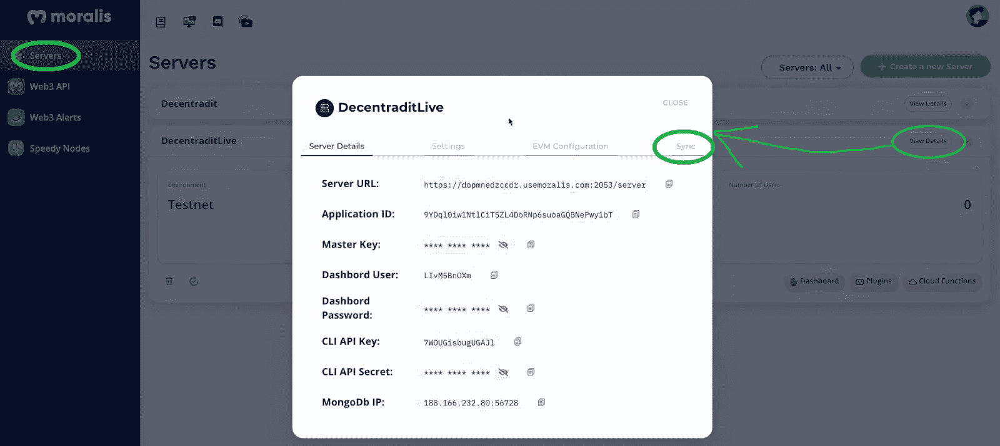

3.  出现包含您的 Moralis 服务器详细信息的弹出窗口后，单击右上角的“同步”选项卡。
4.  然后点击“添加新同步”和“同步并观察合同事件”:

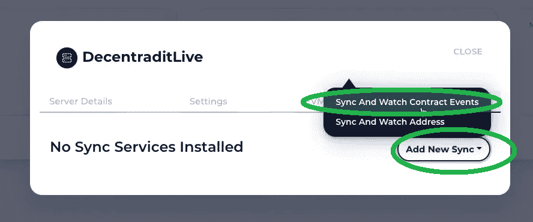

5.  选择一个链，为每个事件添加描述、主题、ABI、地址和“表名”。以下是智能合约的“类别创建”事件的所有子步骤:
6.  通过单击创建服务器时为服务器选择的链来选择链:

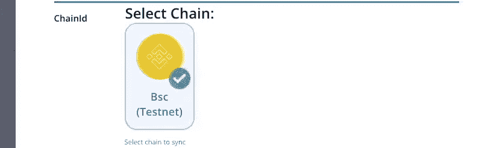

2.  添加描述；我们对此事件监听器使用“类别”:

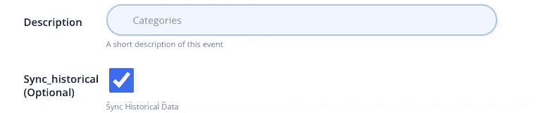

3.  添加一个话题；对于我们的“类别创建”事件，我们使用以下内容:


4.  添加 ABI，它是从" [eventsAbi.json](https://github.com/ethereum-boilerplate/web3-social-network-boilerplate/blob/main/smart%20contracts/eventAbi/eventsAbi.json) "文件中复制的:

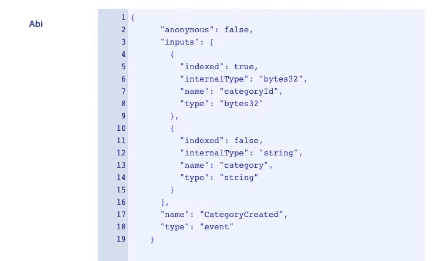

5.  插入您的智能合同的地址(您已在上一步中部署):


6.  添加表名；我们对此事件监听器使用“类别”,并通过单击“确认”按钮来完成此监听器:

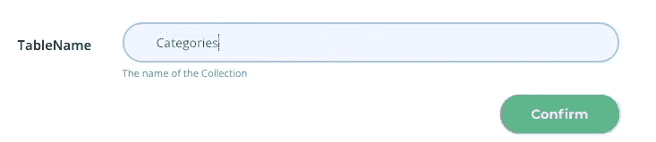

现在，为智能合约中的其他事件重复第五步(以及上述所有子步骤):

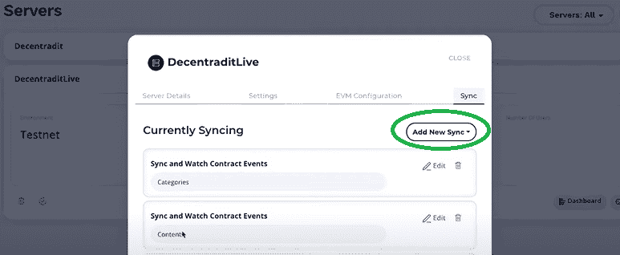

这意味着在继续之前，您总共需要四个侦听器(类别、内容、帖子和投票)。

### **对以太坊 dApp 样板文件进行调整**

通过完成第二步(如“使用 Moralis 创建 Web3 Reddit 克隆的分步指南”一节所述)，您应该准备好样板文件，并激活我们的模板 dApp。为了创建一个 Web3 Reddit 克隆，我们需要进行必要的调整。你应用这些改变的最简单的方法是从 25:35 开始跟随下面视频中的 Moralis 专家。接下来，您可以遵循 Moralis 专家的指导，使用 Bootstrap，避免 CSS 编码。

接下来，您将被引导删除某些组件(在“src”文件夹中)，包括“Chains”、“Contract”、“ERC20Transfers”、“InchDex”、“NativeTransactions”和“Wallet”。您将继续删除" ERC20Balances.jsx "、" NativeBalance.jsx "、" NFTBalance.jsx "、" Ramper.jsx "、" QuickStart.jsx "和" TokenPrice.jsx "。

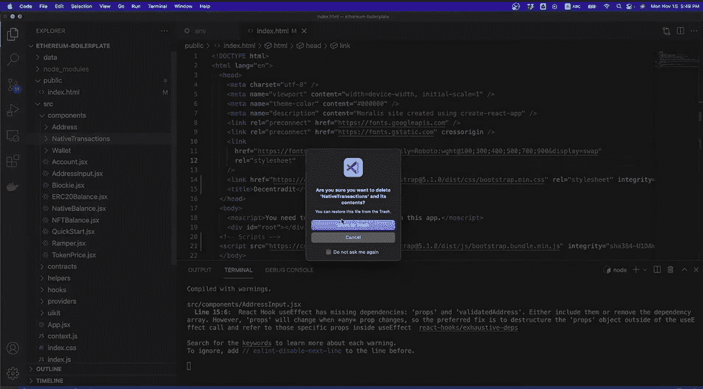

接下来，您将清理“App.jsx”文件(28:38)，首先删除几个“import”行。

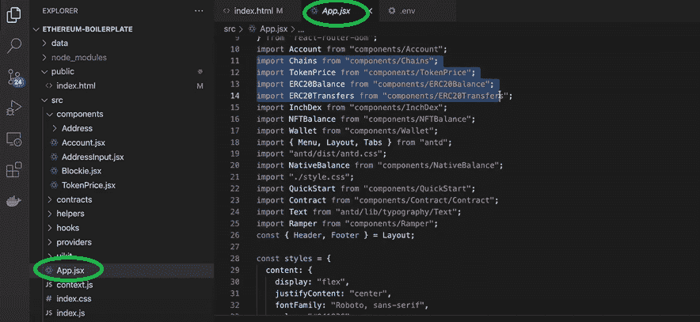

接下来，您将删除

<menu>和<chains>。然后，您将通过消除除“未认证”路由之外的所有路由来清除<switch>。接下来，你将会删除很多我们的 Web3 Reddit dApp 不需要的页脚。此外，您还将删除徽标。为了完成清理，您将被指示向 VSC 添加一个特定的附加组件(“ES7 React/Redux/graph QL/React-Native snippets”)。接下来，您将创建一个新组件“main . jsx”(32:20)，并添加适当的“import”行。在应用所有这些调整后，您将拥有我们的 Reddit 克隆 dApp 的初始阶段:</switch>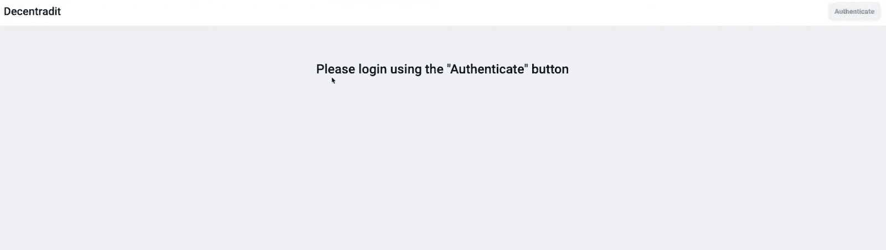

这是用户登录后将看到的内容:

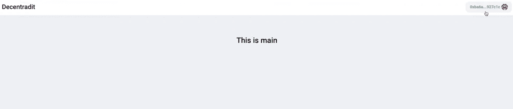

我们的 Web3 Reddit 克隆的当前状态是一张白纸，我们必须通过添加适当的代码来升级它。

## **使用 Moralis 创建 Web3 Reddit 克隆–添加代码**

这是编程部分，您将开始添加必要的代码来创建我们所追求的 Web3 Reddit 克隆。为了完成我们的这部分任务，我们委托你在 36:03 的视频中与 Moralis 专家合作。他将向您展示如何编写几个文件(组件)，从“Main.jsx”开始。接下来，您还将为 dApp 添加完整的前端和后端功能。我们的 Web3 Reddit 克隆的最重要的部分将是将应用程序与之前创建的智能契约连接起来(1:04:25)。此外，为了获得最高水平的去中心化，你将学习如何利用 Moralis 的 [IPFS](https://moralis.io/what-is-ipfs-interplanetary-file-system/) 集成，这将使你能够以去中心化的方式存储你的 Reddit 克隆的帖子。

最后，这是我们在整篇文章中引用的视频:

https://www.youtube.com/watch?v=52BvLrj-KrE

## **为 Web3 创建 Reddit 克隆–分步指南–总结**

我们希望您已经成功地完成了本文各节中的所有步骤，并且现在您已经有了自己的 Web3 Reddit 克隆版本。总而言之，要成功完成这个示例项目，您需要完成六个步骤:

1.  创建您的免费 Moralis 账户。
2.  使用终极以太坊 dApp 样板。
3.  创建一个合适的 smart 契约并部署它。
4.  为您的 Moralis 服务器设置事件监听器。
5.  对以太坊 dApp 样板文件进行必要的调整和添加。
6.  添加适当的代码来覆盖 Reddit 克隆的全部功能。

而且，请注意，这是一个稍微高级一点的项目。因此，我们花了大约两个小时来涵盖所有方面。然而，在我们看来，我们能够在如此短的时间内创建一个 Web3 Reddit 克隆，这仍然是非常令人印象深刻的。如果你对其他更简单快捷的项目感兴趣，一定要访问 [Moralis 的 YouTube 频道](https://www.youtube.com/c/MoralisWeb3)和 [Moralis 的博客](https://moralis.io/blog/)。我们的一些最新任务将向你展示如何[懒惰薄荷 NFT](https://moralis.io/how-to-lazy-mint-nfts/)，如何[立即创建以太坊 dApp】，以及如何](https://moralis.io/how-to-create-an-ethereum-dapp-instantly/)[生成数千个 NFT](https://moralis.io/how-to-generate-thousands-of-nfts/)。此外，除了创建 Web3 应用程序，我们还鼓励您关注移动 dApps，您可以使用我们的[以太坊移动样板](https://moralis.io/ethereum-mobile-boilerplate-full-guide-to-ethereum-for-mobile/)轻松创建。

</chains></menu>