# 创建一个 OpenSea 克隆:建立一个像 OpenSea 一样的 NFT 市场

> 原文：<https://moralis.io/create-an-opensea-clone-build-an-nft-marketplace-like-opensea/>

**作为不可替代的令牌，或**[**NFT**](https://moralis.io/non-fungible-tokens-explained-what-are-nfts/)**，是区块链最受欢迎的用例之一，面临着突出的未来，区块链用户在 OpenSea 等市场上寻找这种资产并不奇怪。开发者正在寻找克隆 OpenSea 的方法，这也并不令人吃惊，因为他们可能反过来建立下一个流行的 NFT 市场。然而，假设你刚刚开始作为一个区块链开发者使用******并且最近发现了** [**NFT 令牌开发**](https://moralis.io/nft-token-development-the-ultimate-guide/) **的基础知识。在这种情况下，您可能想知道如何快速创建一个 OpenSea 克隆，并将其转化为一个创收平台。幸运的是，通过利用 Moralis 优秀的 Web3 工具，您将能够建立一个像 OpenSea 一样的 NFT 市场，并且在不到两个小时的时间内就可以建立并运行您的 OpenSea 克隆。****

**

在本文中，您将学习如何使用终极的 [Web3](https://moralis.io/the-ultimate-guide-to-web3-what-is-web3/) 开发平台—[Moralis](https://moralis.io/)(又名 [Firebase for crypto](https://moralis.io/firebase-for-crypto-the-best-blockchain-firebase-alternative/) )和最棒的 [Web3 样板文件](https://moralis.io/web3-boilerplate-beginners-guide-to-web3/)来创建您自己的 OpenSea 克隆。多亏了 [Moralis 的 SDK](https://moralis.io/exploring-moralis-sdk-the-ultimate-web3-sdk/) 和[终极 NFT API](https://moralis.io/ultimate-nft-api-exploring-moralis-nft-api/) ，你可以专注于前端，同时通过复制和粘贴 [Moralis 文档](https://docs.moralis.io/)中提供的简短代码片段来满足所有后端需求。此外，使用 Moralis，您可以克服 RPC 节点的所有[限制，并让您的 dApps(分散式应用程序)面向未来。由于 Moralis 的跨链互操作性，后者是安全的，使您能够通过调整单行代码跨所有支持的链部署 dApps。](https://moralis.io/exploring-the-limitations-of-rpc-nodes-and-the-solution-to-them/)

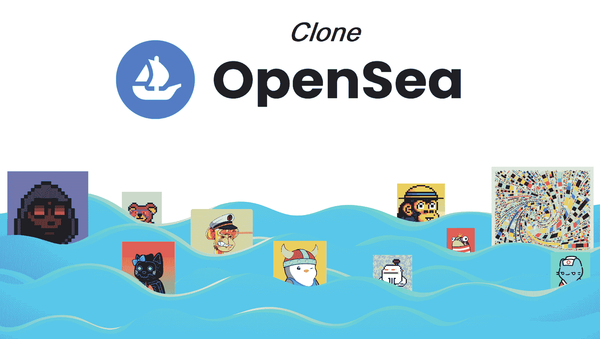

## 用 Moralis 创建你自己的 OpenSea 克隆

如果这是您第一次使用 Moralis，请不要担心，因为我们将向您展示如何在最短的时间内充分利用这个令人难以置信的平台。此外，我们还创建了最终的 Web3 样板，加速了创建 dApps 的过程。因此，我们将首先向您展示如何正确设置以使用这两个基本的区块链开发工具。

设置完成后，我们将对我们将要创建的 OpenSea 克隆进行预览，让您对未来的发展有一个很好的了解。最后，我们将卷起袖子，调整样板代码，并添加必要的代码来获得适当的功能。在这一部分，我们将让 Moralis 的一位专家通过详细的视频教程来指导您，以尽可能清晰地说明每一步。此外，为了创建自己的 OpenSea 克隆，请确保自己采取行动并实施每个步骤。

### OpenSea Clone–web 3 样板文件和 Moralis 设置

这是我们向您展示如何使用我们的 Web3 样板文件的地方。设置步骤简单快捷；即使你是一个完全的初学者，你也不应该花超过 15 分钟来启动和运行 Web3 样板 dApp。因此，完成这些步骤:

1.  到 GitHub 上的终极 Web3 样板网页:[https://GitHub . com/ether eum-boilerplate/ether eum-boilerplate](https://github.com/ethereum-boilerplate/ethereum-boilerplate)

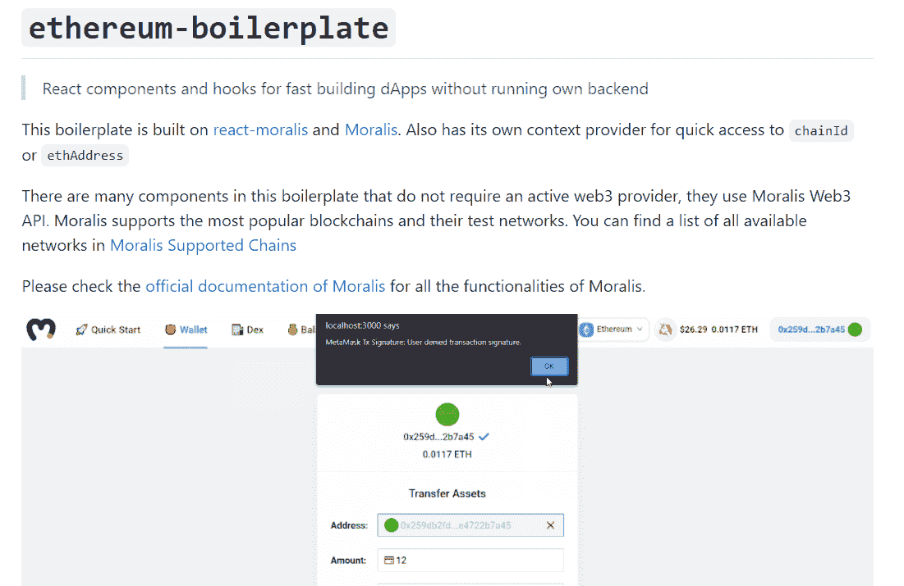

2.  接下来，使用“***git clone https://github . com/ether eum-boilerplate/ether eum-boilerplate . git***”来分叉或克隆“以太坊-boilerplate”存放库。*实际上，一旦进入网站，你只需点击复制按钮:*

然后，打开您的代码编辑器(我们使用 Visual Studio 代码[VSC])，将上述地址粘贴到 VSC 的终端中:

3.  接下来，您需要安装所有的依赖项(使用代码编辑器的终端):
    1.  ***cd 以太坊-样板***
    2.  ***纱装***

4.  接下来，将“以太坊-样板”文件夹添加到代码编辑器中:

5.  现在是时候将“. env.example”文件重命名为”。env”。右键单击“. env.example”并选择“重命名”:

6.  然后，在上面刚刚重命名的文件中使用 Moralis 服务器的“appId”和“serverUrl”。env "):

*注* *:要设置您的 Moralis 服务器并获取其详细信息，请使用下面“Moralis 服务器设置”小节中的说明。获得服务器 URL 和应用程序 ID 后，将它们复制并粘贴到。env "文件:*

7.  最后，是时候运行您的样板 dApp 了。只需在您的代码编辑器终端内输入或粘贴“ ***纱线开始*** ”:

*注意* *:你也可以使用“npm”包管理器来代替“yarn”。*

#### Moralis 服务器设置

如果你想使用终极的 Web3 样板或者使用 Moralis 的 Web3 API 构建你完全独特的 dApp，你需要设置你的 Moralis 服务器。以下是指导您完成该过程的步骤:

1.  [**创建您的免费 Moralis 账户**](https://admin.moralis.io/register)-在 Moralis 账户创建您的免费 Moralis 账户。然后，输入您的电子邮件地址，创建您的密码，并单击将发送给您的确认链接。然而，如果你已经有一个有效的 Moralis 账户，只需[登录](https://admin.moralis.io/login)。

[**创建一个 Moralis 服务器**](https://docs.moralis.io/moralis-server/getting-started/create-a-moralis-server)–登录后，点击您的 Moralis 管理区的“服务器”选项。然后，单击“+创建新服务器”按钮(右上角)。接下来，从下拉菜单中选择最适合您需求的网络类型。*“测试网服务器”选项(* [*连接以太网测试网*](https://moralis.io/ethereum-testnet-guide-connect-to-ethereum-testnets/) *)通常是处理新项目时的最佳选项。* *但是，要使您的 dApps 对用户可用，您需要选择“Mainnet 服务器”。*

然后，输入服务器名称(可以是您想要的任何名称)，在弹出窗口中选择区域、网络和链(我们使用 Mumbai 的 testnet ):

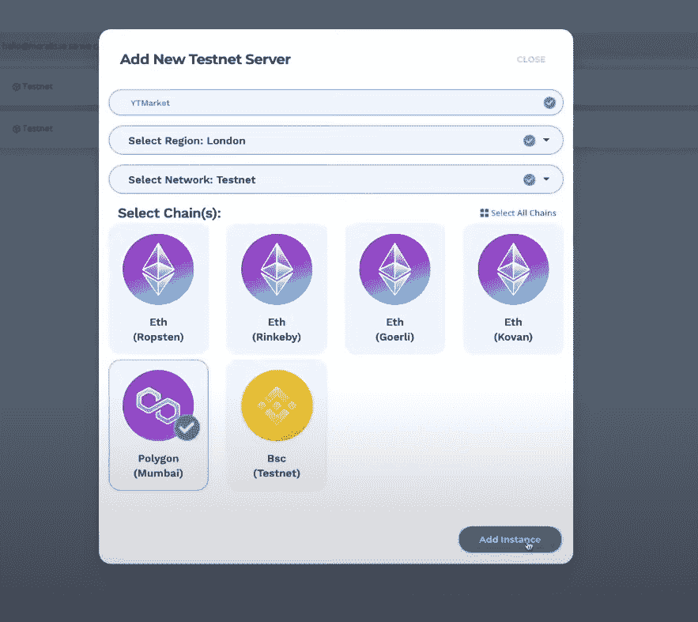

单击“添加实例”完成服务器设置。

3.  **访问服务器详细信息**–现在您的服务器已经启动并运行，您可以通过单击服务器名称旁边的“查看详细信息”按钮来访问其详细信息:

然后，会出现一个弹出窗口。在这里您可以找到服务器的 URL 和应用程序 ID。此外，您可以通过单击复制图标来复制详细信息:

4.  **初始化 Moralis 规范**–剩下的就是填充你的”。env "文件。因此，粘贴您的 Moralis 服务器的详细信息(应用程序 ID 和服务器 URL)以获得 Moralis 涵盖的完整后端功能(上一节中的第六步):

*注意* *:* ***不要*** *使用上图中的细节(使用你的服务器的细节)。*

## OpenSea 克隆预览

现在您已经设置好了，您准备应用必要的调整并添加适当的代码来实际创建您自己的 OpenSea 克隆。然而，在我们这样做之前，让我们先预览一下我们的 OpenSea 克隆。因此，让我们来看看下图:

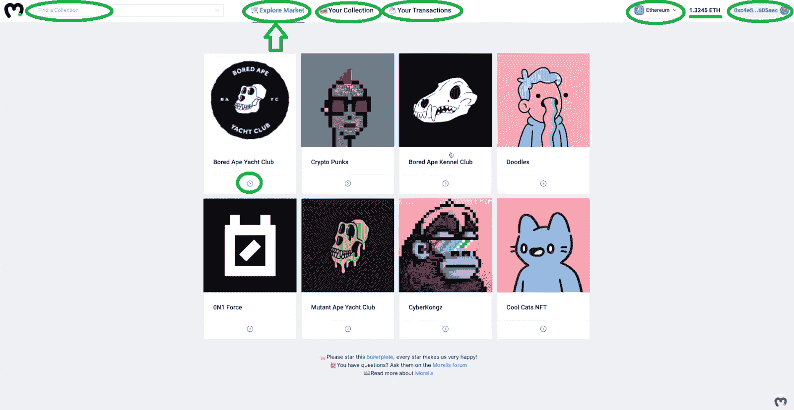

看上面的图片，你可以看到我们的 OpenSea 克隆提供了几个选项，都是覆盖像 OpenSea 这样的 NFT 市场的全部功能所必需的。从左上角开始，您可以看到一个搜索选项。用户可以在这里输入关键词来查找特定的 NFT 收藏。接下来，我们有“探索市场”选项。这是当前可用的菜单选项，用户可以在这里查看热门收藏。通过单击每个集合下的箭头图标，用户可以查看该集合的所有 NFT:

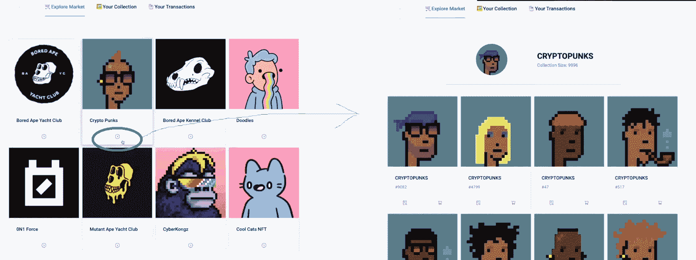

“探索市场”旁边是“您的收藏”选项卡，在这里显示连接的钱包中可用的 NFT:

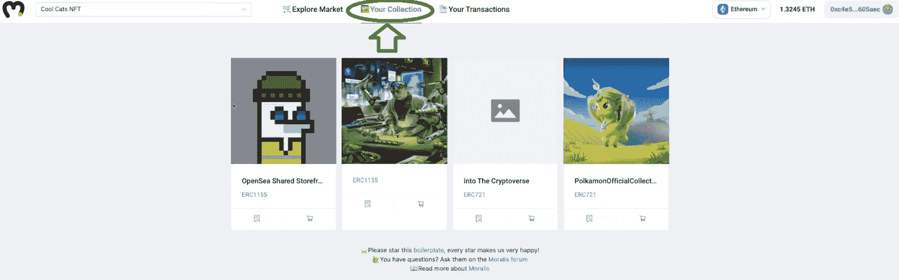

继续向右，我们看到了“您的交易”选项卡。这是显示与连接地址相关的所有交易的位置:

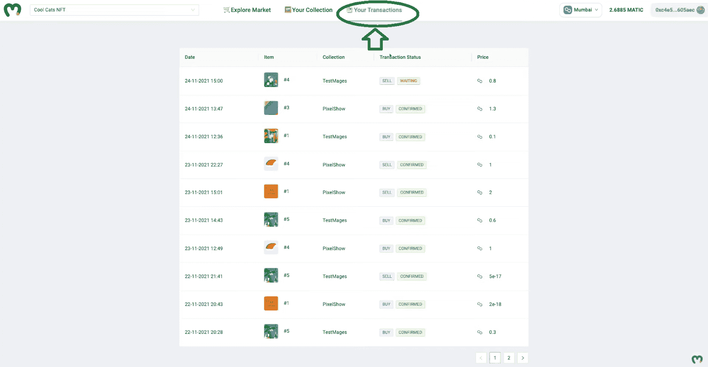

#### 选择你的区块链

接下来，我们还可以选择多个链(Moralis 支持的所有链)。为了这个示例项目的目的，我们添加了 Polygon 的 testnet(Mumbai)；但是，如果您添加了以太坊的一个网络，它就会包含在下拉菜单中，如下所示。用户可以通过点击他们选择的选项并在其元掩码扩展中确认切换来在支持的链之间切换。

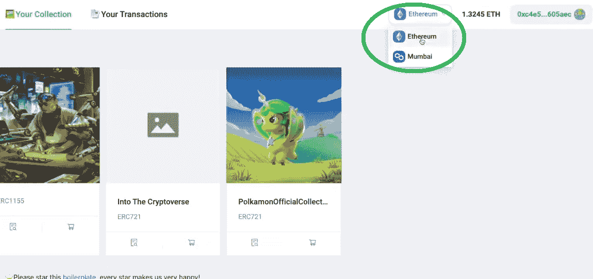

此外，用户还可以选择通过单击任何 NFT 下的购物车图标来列出他们的 NFT 进行销售:

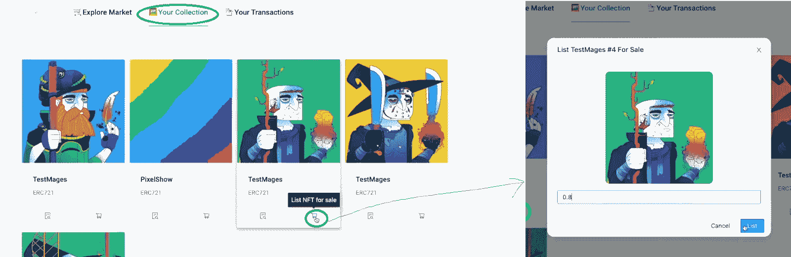

在弹出窗口中，他们可以输入价格，并通过单击“List”按钮来确认他们的操作。同样，MetaMask 会自动提示他们确认交易。其他用户可以购买列出的项目:

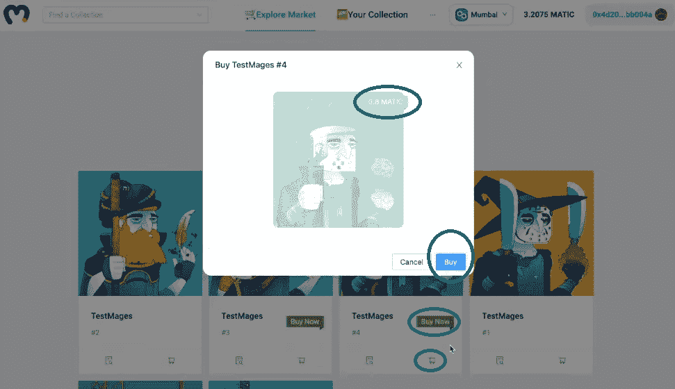

## 样板调整

我们不知道你怎么想，但我们认为我们的 OpenSea 克隆看起来相当不可思议。此外，最好的事情是我们使用我们的 Web3 样板的干净设计作为基础。此外，我们还使用了样板的登录选项，NFT 显示，网络切换按钮，和平衡显示。另一方面，样板文件的 dApp 提供了许多选项，我们没有在 OpenSea 克隆中使用。

如果您想使用最终的 Web3 样板创建自己的 OpenSea 克隆，请执行以下清理(观看 8:05 开始的视频):

1.  导航到代码编辑器中的“src”文件夹，选择“App.jsx”文件，开始删除我们不需要的东西。

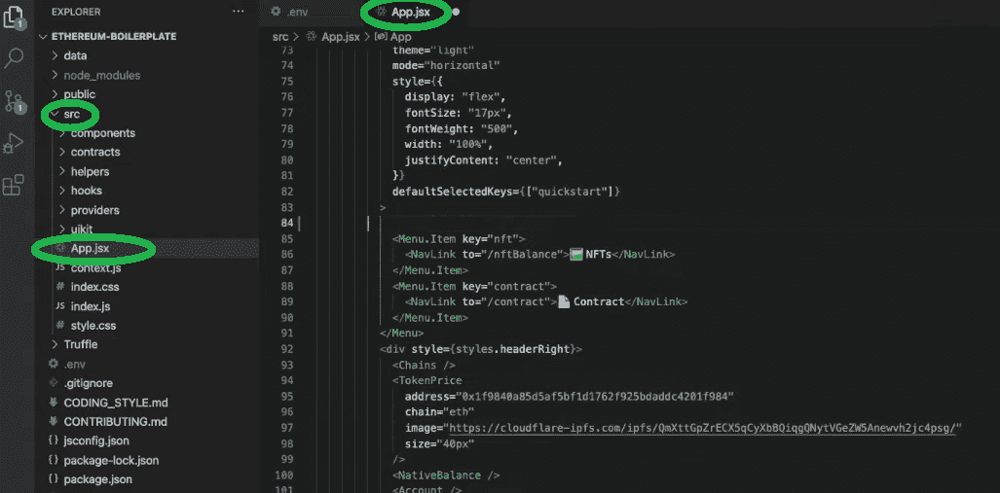

2.  在标题中，有许多你的 OpenSea 克隆版不需要的菜单项。因此，删除以下内容:

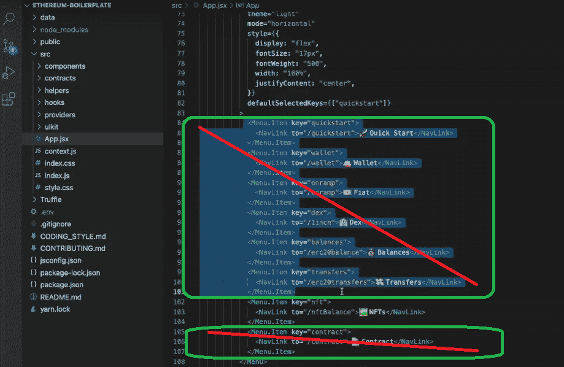

另外，删除“令牌价格”:

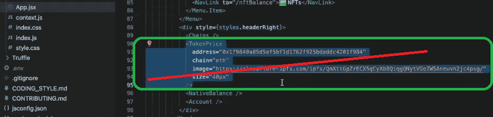

3.  接下来，删除与您刚刚在上面删除的路线相关的路线:

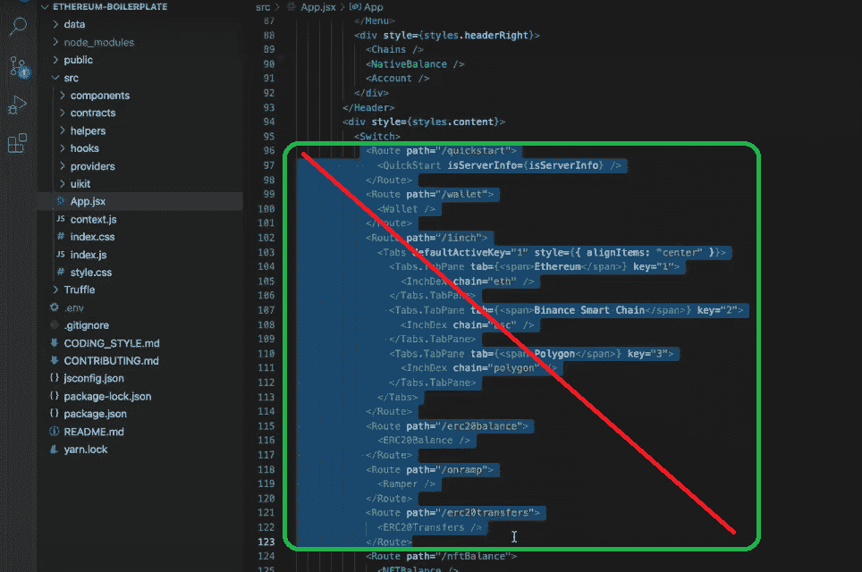

此外，删除“约定”和“非身份验证”路由:

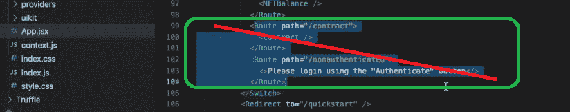

4.  现在，我们确保我们的 OpenSea 克隆在用户登录后重定向到“nftBalance ”:

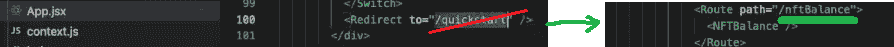

5.  接下来，有许多与上面删除的项目相关的“导入”行，我们现在可以去掉它们，使我们的代码更干净。删除不必要的行后，您应该会看到以下内容:

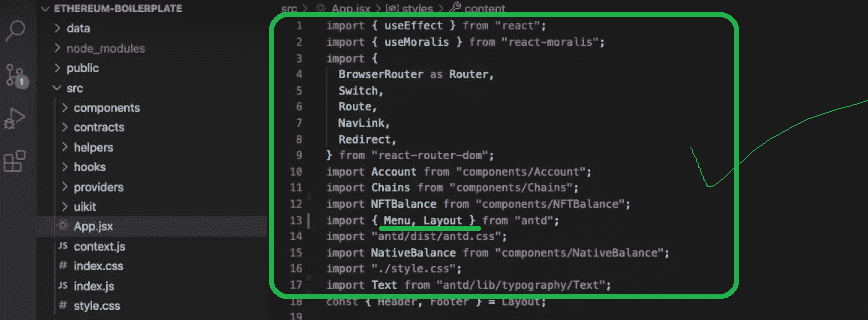

如果您现在刷新样板文件 dApp，您应该会看到以下内容:

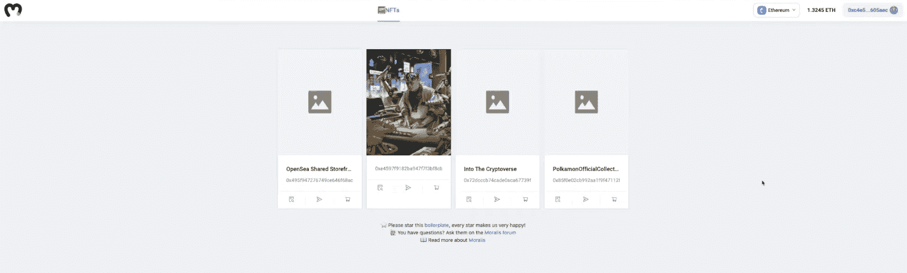

此时，您已经可以看到我们的 OpenSea 克隆的一些相似之处(如“OpenSea 克隆预览”一节所述)。因此，这是进一步编程以创建您自己的 OpenSea 克隆的极好起点。此外，我们将在下一节处理这个有趣的部分。

## 超越 Web3 样板

如前所述，我们现在将把你交给 Moralis 的一位专家，他将指导你完成这个项目的其余部分(下面的视频从 9:50 开始)。他将首先向您展示如何添加与 [NFT 市场](https://moralis.io/how-to-launch-an-nft-marketplace/)相关的菜单标签，并使它们发挥作用。一旦完成，他将向您展示在与 [Remix](https://moralis.io/remix-explained-what-is-remix/) (44:03)合作时，使用[智能合约](https://moralis.io/smart-contracts-explained-what-are-smart-contracts/)是多么简单。此外，为了获得您的 OpenSea 克隆的全部功能，他还将指导您完成为您的智能合约事件设置“监听器”的过程(46:30)。此外，这也是向您介绍 Moralis 数据库的地方，这是 Moralis SDK 的另一个强大方面。

下面是我们在整篇文章中引用的视频。它清楚地涵盖了上面提到的所有设置和预览，以及 Web3 样板调整和额外的编码，以在 Mumbai testnet 上创建一个全功能的 OpenSea 克隆。

https://www.youtube.com/watch?v=WZWCzsB1xUE

此外，我们还在 GitHub 上发布了“创建你自己的 OpenSea”任务的全部代码。

## 创建一个 OpenSea 克隆:建立一个像 OpenSea 一样的 NFT 市场-总结

如果您已经完成了上面的所有步骤，那么您现在应该已经有了一个全功能的 OpenSea 克隆版本。通过利用 Moralis 和最终的 Web3 样板文件，您已经能够完全避免处理区块链开发中无数繁琐耗时的步骤。事实上，除了使用智能合同模板，您只需要处理前端开发。此外，通过使用 Web3 样板文件的组件，您还可以获得一个干净的用户界面。

如果你喜欢这个例子项目，我们邀请你访问[Moralis 的 YouTube 频道](https://www.youtube.com/c/MoralisWeb3)和[Moralis 的博客](https://moralis.io/blog/)。在这两个网站上，你可以找到大量免费内容，解释区块链发展的各个方面和各种示例项目。例如，你可以学习如何[创造无汽油费的 NFT](https://moralis.io/how-to-mint-nfts-without-gas-fees/)([懒惰的 mint NFT](https://moralis.io/how-to-lazy-mint-nfts/))，如何[为 Web3](https://moralis.io/create-a-reddit-clone-for-web3-step-by-step-guide/) 创建 Reddit 克隆，如何[用一行代码发送以太坊交易](https://moralis.io/ethereum-send-transaction-basics-send-ethereum-with-one-line-of-code/)，如何[生成数千个 NFT](https://moralis.io/how-to-generate-thousands-of-nfts/)，如何[创建以太坊聊天应用](https://moralis.io/how-to-create-an-ethereum-chat-app/)，等等。

任何精通 JavaScript 并能使用 T2 元掩码的人都有资格与 Moralis 合作。此外，他们可以随后创建各种非凡的分散式应用程序。然而，如果你还不知道 JavaScript，我们鼓励你参加 Moralis 学院的 [2021 区块链开发者 JavaScript 编程](https://academy.moralis.io/courses/javascript-programming-for-blockchain-developers)课程。通过这样做，您将学习这种易于使用的通用编程语言，并尽可能以最好的方式将其用于区块链开发。此外，如果你想成为全职加密员，一定要去看看[Moralis 学院](https://academy.moralis.io/)的其他有价值的课程。

**