# 如何在 10 分钟内部署你自己的 Testnet 加密令牌

> 原文：<https://moralis.io/create-free-token-how-to-deploy-your-own-testnet-crypto-token-in-10-mins/>

**无论你是在开发** [**dApps**](https://moralis.io/decentralized-applications-explained-what-are-dapps/) **，** [**NFTs**](https://moralis.io/non-fungible-tokens-explained-what-are-nfts/) **，还是想创建免费令牌，在区块链开发中有一个至关重要的部分是程序员不能忽视的——使用测试网。在 testnet 上部署您自己的令牌可以确保在将它发送到 mainnet 之前一切顺利。而且，有了**[](https://moralis.io/)****(**[**Firebase for crypto**](https://moralis.io/firebase-for-crypto-the-best-blockchain-firebase-alternative/)**)及其**[**ultimate web 3 SDK**](https://moralis.io/exploring-moralis-sdk-the-ultimate-web3-sdk/)**和**[**web 3 API**](https://docs.moralis.io/moralis-server/web3-sdk/intro)**，就可以克服所有 RPC 节点** [**的局限性**因此，对于任何想要全职加密并开始他们的区块链之旅的人来说，一个很好的方法是利用 Moralis 的工具，它可以帮助你免费创建自己的加密令牌。因此，本文将着重向您展示如何在 10 分钟内创建免费令牌并部署您自己的 testnet 加密令牌。](https://moralis.io/exploring-the-limitations-of-rpc-nodes-and-the-solution-to-them/)**

**在本文中，您将发现创建免费令牌需要什么。此外，由于最终的 Web3 开发平台——Moralis，您将看到您可以在十分钟内准备好您的加密令牌。除了学习与 Moralis 合作，我们还将向您展示如何充分利用另一个优秀的工具，即“ETH [Brownie](https://moralis.io/eth-brownie-explained-what-is-brownie/) ”。这个基于 Python 的框架非常适合测试和开发 dApps(去中心化应用)，包括“创建免费令牌”。此外，我们将使用 [OpenZeppelin](https://moralis.io/what-is-openzeppelin-the-ultimate-guide/) ，这是一个用于构建安全 dApps 的开源平台，其中有无数智能合约代码模板可用。也就是说，我们邀请你跟随我们的领导，自己实施同样的行动步骤，以最好地学习如何创建免费代币。然而，在我们深入我们的示例项目之前，让我们确保你们都知道什么是 testnet 令牌。**

**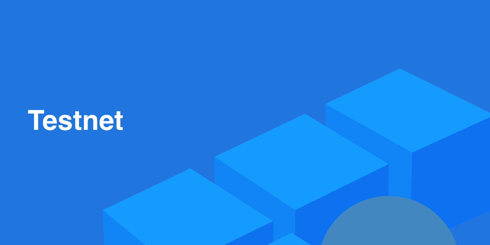

### 什么是 Testnet 令牌？

可以想象，testnet 令牌是在 testnet 上使用的加密令牌。然而，为了正确地解释什么是 testnet 标记，我们需要仔细看看这两个词。所以，我们先从“代币”说起。在加密领域，令牌指的是非本地加密货币，这意味着它们没有自己的区块链。相反，它们是在其他现存的区块链之上铸造的。最常见的一种是基于 [ERC-20 令牌标准](https://moralis.io/erc20-exploring-the-erc-20-token-standard/)的令牌，它们是在[以太坊](https://moralis.io/full-guide-what-is-ethereum/)链上构建的。而且，我们还要提一下，以以太坊为例，它的原生令牌(币)是 ETH。现在你知道什么是令牌，我们可以继续讨论“testnet”这个词。

出于开发过程和测试的目的，大多数区块链都有一个(testnet)甚至更多的测试环境(testnet)，它们试图以最好的方式模拟真实的网络(也称为 mainnet)。此外，由于以太坊是最受欢迎的可编程区块链，让我们简单介绍一下。首先，你需要知道以太坊有几个测试网——Kovan、Ropsten、Rinkeby 和 gorli。此外，由于每个测试网都有自己的优点和缺点，所以知道哪个[以太坊测试网](https://moralis.io/ethereum-testnet-guide-connect-to-ethereum-testnets/)用于您的特定项目是很重要的。

### 为什么可以在测试网上创建免费令牌？

现在，我们终于可以把它们放在一起了。Testnet 令牌是部署在 testnet 上的令牌，旨在覆盖用于测试目的的事务。记住这一点，您还可以看到使用 testnets 是创建免费令牌的正确方法。你可能会问，为什么？嗯，当你铸造代币时(执行一个在链上存储代币的交易)，你需要支付汽油费。现在，虽然有交易费用低的区块链，但也有费用高得令人难以置信的，如以太坊。当然，如果你使用它的 mainnet，它将花费你真实的货币价值(以真实 ETH 的形式)。然而，当使用 testnets 时，您可以免费“测试”本地硬币(“play”或“testnets)。您可以通过使用水龙头获得测试 ETH。然而，你需要为每个以太坊测试网使用正确的水龙头。

既然您已经知道了什么是 testnet 加密令牌，以及为什么您可以免费创建它们，那么是时候开始一个示例项目了。我们的任务是在以太坊试验网上创建我们自己的 ERC-20 令牌(我们将与 Ropsten 合作)。因此，我们邀请你跟随并创建你自己的 testnet 令牌。然后，一旦你学会了创建一个免费令牌，你将能够使用这些知识，并应用基本相同的步骤在 mainnet 上创建 ERC-20 令牌。

## 创建免费令牌–示例项目

如前所述，我们将依靠 Brownie 的测试环境、OpenZeppelin 和 [Moralis Speedy Nodes](https://moralis.io/speedy-nodes/) ，在 Ropsten testnet 上创建免费令牌。*当然，你也可以使用这里提出的同样的智能合约* [*Remix*](https://moralis.io/remix-explained-what-is-remix/) *。*除了这三个工具，我们将使用[元掩码](https://moralis.io/metamask-explained-what-is-metamask/)作为认证工具和钱包来查看我们在特定地址的余额。此外，我们还将使用代码编辑器(我们更喜欢 Visual Studio 代码[VSC])。

### 使用 Moralis 快速节点创建免费令牌

除了为开发者提供终极的 Web3 SDK，Moralis 还是一个节点提供商(一个 [Infura 替代方案](https://moralis.io/infura-alternatives-and-blockchain-node-providers/))。此外，通过创建您的免费 Moralis 帐户，您可以访问 Moralis 的快速节点。因此，只需遵循以下步骤:

1.  [**点击链接，创建您的免费 Moralis 账户**](https://admin.moralis.io/register) 。然后，输入您的电子邮件地址，创建您的密码，并点击确认电子邮件中的链接。如果您已经有了一个有效的 Moralis 帐户，只需[登录](https://admin.moralis.io/login)。

2.  一旦进入你的管理区，选择“快速节点”标签，如下图所示，点击“ETH 网络”下的“端点”按钮。

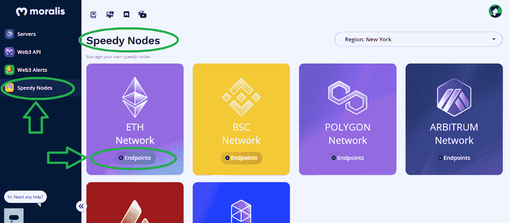

3.  因此，您将看到所有以太坊网络的列表。因为我们决定在我们的例子中使用 Ropsten testnet 来创建免费令牌，所以这是我们要关注的。默认情况下，所有以太坊测试网都应该添加到您的元掩码扩展中；但是，如果您没有它，请单击 Ropsten 网络旁边的“添加到元掩码”按钮。但更重要的是，复制 URL 地址:

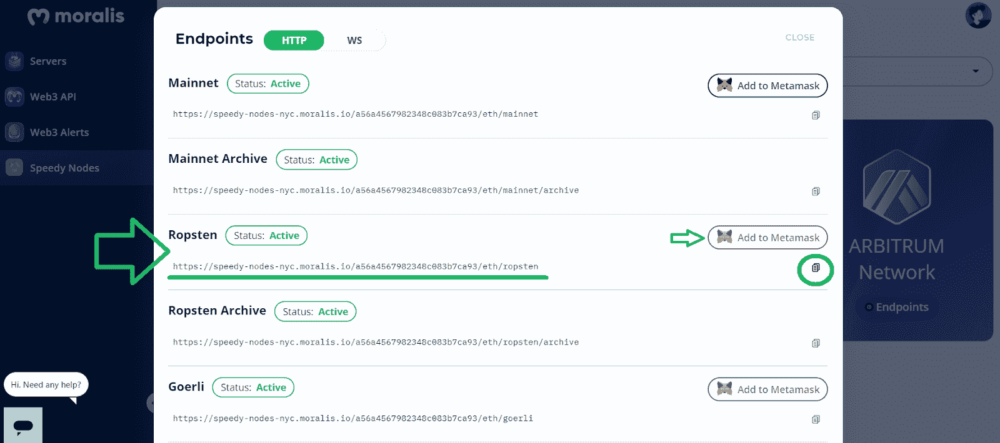

4.  将上面复制的地址粘贴到您在代码编辑器中创建的" [network_setting.bash](https://github.com/DanielMoralisSamples/Video_Tutorials/blob/main/04-my_token/scripts/network_settings.bash) "文件中(您可以从 GitHub 使用我们的文件；请务必添加您的详细信息)。因此，代码如下:

```js
#!/bin/bash
brownie networks add Ethereum ropsten_test host='YOUR LINK' chainid=3 explorer='https://api-ropsten.exit'
```

*注意* *:如果您不熟悉 Brownie 但知道如何使用 Remix，您可以在下一节中使用后者来部署智能合约。但是，请记住，在那种情况下，您需要在 Ropsten (* [*Ropsten 水龙头*](https://faucet.ropsten.be/) *)上获得“播放”ETH。此外，我们在 GitHub* *上提供了其他网络的代码，因此您可以在其他支持 Moralis 的网络上轻松创建免费令牌。*

## 创建免费令牌的智能合约

智能合约是可编程区块链的重要组成部分。这些自动化的“条件执行”程序确保事情按照预先定义的方式和特定的链运行。当谈到在以太坊上创建代币时，它为可替换的代币设置了一个特殊的标准(ERC-20)。因此，我们可以使用 OpenZeppelin 提供的 ERC-20 合同模板，并添加几行代码来针对我们的特定情况进行调整。

我们将使用 VSC 来创建名为“ [my_token.sol](https://github.com/DanielMoralisSamples/Video_Tutorials/blob/main/04-my_token/contracts/my_token.sol) ”的智能合约。您可以自己键入，或者简单地复制下面的代码行，并根据您的详细信息进行更改:

```js
// SDPX-License-Identifier: MIT
pragma solidity ^0.8.0;

import "OpenZeppelin/[email protected]/contracts/token/ERC20/ERC20.sol";

contract TheFellowShip is ERC20 {
    constructor(uint256 initialSupply) ERC20("LordOFTheRings", "Tolkien") {
        _mint(msg.sender, initialSupply);
    }
}
```

查看上面的代码，我们可以看到第一行定义了一个许可证。第二行代表编译器(任何高于定义的版本都将被接受)。然后，可以看到“导入”。后者是至关重要的，因为它通过使用 OpenZeppelin 的 ERC-20 令牌标准模板来完成所有繁重的工作。但是，为了使导入正常工作，您需要安装正确的软件包。此外，在本文后面的视频中提供了如何做到这一点的说明，从 2:45 开始。本质上，您需要安装一个正确版本的 OpenZeppelin 契约(在我们的例子中是“T0”[email protected]):


### 我们的智能合同

接下来，在“import”下面是三行代码，在这里我们实际上为我们的示例创建了免费令牌。此外，“船舶所有权”是我们的令牌合同示例名称。然而，这可以是你想要的任何东西。接下来，我们使用“构造函数”来定义令牌的初始供应。在同一行上，我们有“LordOfTheRings”，这是我们令牌的名称，还有“Tolkien”，这是符号(ticker)。这两者都可以是你想要的任何东西。然而，当在 mainnets 上创建令牌时，建议使用较短的名称，并坚持使用三到四个字符作为符号。我们代码的最后一行是构造函数的主体，用来确保标记的生成。此外，多亏了 OpenZeppelin，我们只需要三行代码就可以创建我们自己的智能契约，这将使我们能够创建免费令牌。

## 使用布朗尼创建免费令牌

让我们首先通过使用我们的编辑器中的终端并在“brownie console”中键入来确保一切设置正确(参见 5:52 的视频):

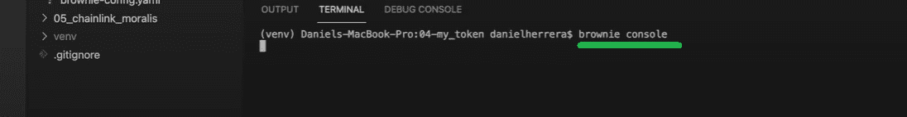

如果一切都设置好了，您应该会看到“核仁巧克力饼环境准备就绪”消息:

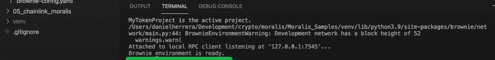

此外，为了能够将我们的令牌部署到一个活动的 testnet(在我们的例子中是 Ropsten)，我们还需要准备好一个帐户(我们需要一个私钥)。为此，我们使用终端和适当的命令。首先，我们使用“brownie accounts new”，后跟我们的帐户名称(我们使用“testing_account”):

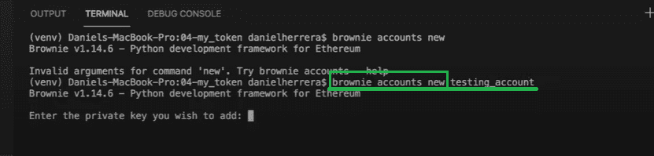

看上面的图片，你可以看到终端提示我们输入我们的私钥。要获得它，您可以转到 MetaMask 并导出您的私钥。您需要点击您的帐户，然后点击您的帐户详细信息:

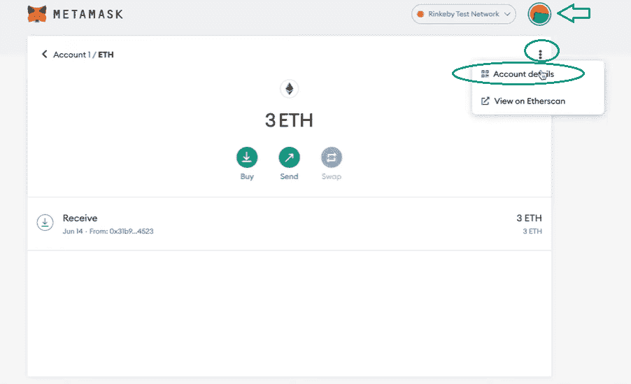

在弹出窗口中，您会看到“导出私钥”按钮:

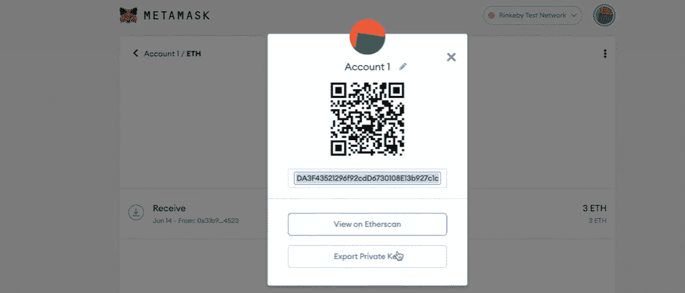

现在，将私钥粘贴到终端中。此外，您还需要创建您的密码(确保记住/写下它)。因此，这将创建部署所需的帐户。

### 部署我们的智能合同

接下来，我们将在命令行中输入“brownie 控制台–网络 ropsten_test ”:

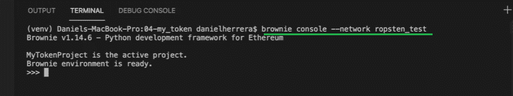

一旦你看到“Brownie 环境准备就绪”，这意味着我们的项目在 Ropsten testnet 网络中正确加载。接下来，我们需要加载我们的帐户(在上一步中创建的帐户)，以便我们可以使用它来部署令牌:

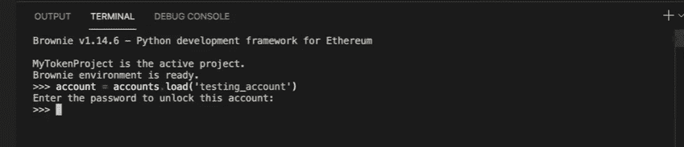

终端将提示您输入您的帐户密码(您在上面创建的密码)。因此，输入密码并继续部署您的令牌，这是我们“创建免费令牌”任务的最后一步:

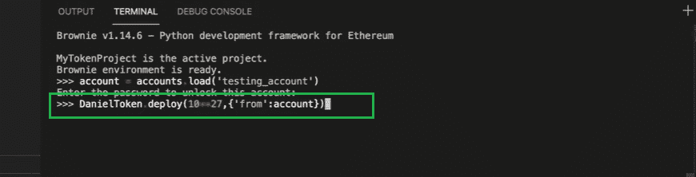

查看上图，您可以看到我们使用了智能合约的名称(“TheFellowShip”如上所定义)。但是，请确保使用您选择的名称。“10**27”部分(10 的 27 次方)是指初始数量供应。对于我们的例子，我们决定使用 10 亿个令牌，也就是 10 的 9 次方。然而，我们还需要考虑 18 位小数，这样我们就得到了 27 位。最后，我们使用“account”来指示 Brownie 控制台，登录的帐户是我们希望用于部署的帐户。如果一切正常，这就是我们获得令牌合同地址的地方:

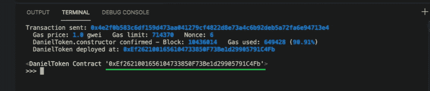

如果您遵循了上述步骤，现在您可以使用您的令牌合同地址来查看余额。只需进入你的元掩码，选择 Ropsten testnet，点击“添加令牌”按钮，并在顶部粘贴你的令牌地址。您的代币符号和小数将自动添加。然后，点击“下一步”，再点击“添加代币”(9:36 看视频)。

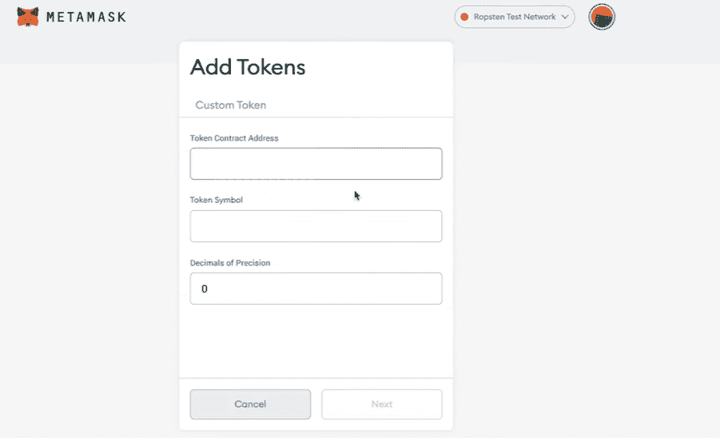

这是我们在整篇文章中引用的视频。在这里，你可以看到 Moralis 专家完成了上述所有步骤:

https://www.youtube.com/watch?v=KNBneUpFaGo

## 创建免费令牌–如何在 10 分钟内部署您自己的 Testnet 加密令牌–总结

此时，您应该知道什么是 testnet 令牌，为什么可以自由创建它们，以及如何自己创建自由令牌。多亏了 Brownie、Moralis Speedy Nodes 和 OpenZeppelin，一旦你习惯了这个概念，完成这个过程应该不会超过 10 分钟。同样的原则也可以用于其他测试网，在那里你可以创建免费的令牌。

如果你喜欢这个示例项目，并希望进一步提高你的区块链开发技能，我们建议查看 [Moralis 的 YouTube 频道](https://www.youtube.com/c/MoralisWeb3)和 [Moralis 的博客](https://moralis.io/blog/)。这两家网站每天都会发布新的视频和文章，提供大量高质量的内容。除了示例项目，这也是了解不同加密术语的好方法。例如，我们的一些最新主题涵盖了如何[在币安智能链上创建 NFTs】，如何](https://moralis.io/create-nft-on-binance-smart-chain-full-guide/)[在不支付汽油费的情况下免费创建 NFTs】，如何](https://moralis.io/how-to-mint-nfts-for-free-without-paying-gas-fees/)[使用共价 API](https://moralis.io/how-to-build-with-the-covalent-api/) ，如何[同步和索引智能合约事件](https://moralis.io/sync-and-index-smart-contract-events-full-guide/)，如何[构建跨链 dApp](https://moralis.io/how-to-build-cross-chain-dapps/)，如何[托管 dApp](https://moralis.io/how-to-host-a-dapp-dapp-hosting-explained/) ，如何[构建去中心化消息应用](https://moralis.io/build-a-decentralized-messaging-app-in-5-steps/)等等

**