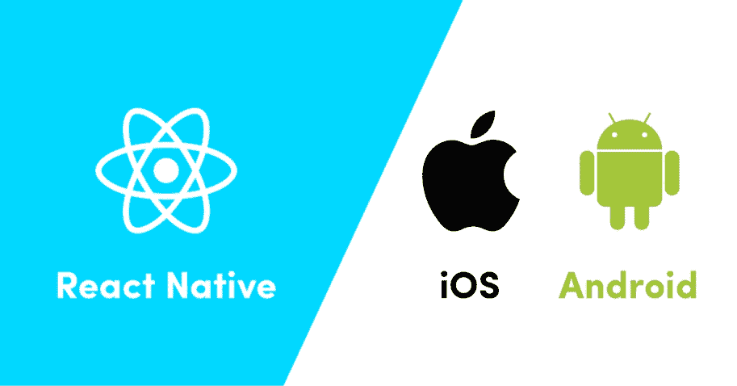
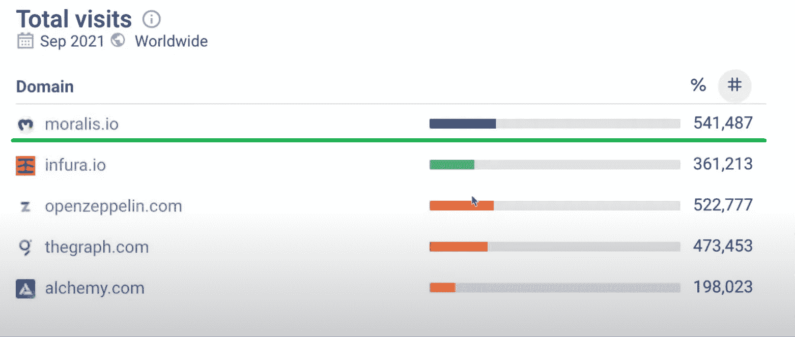
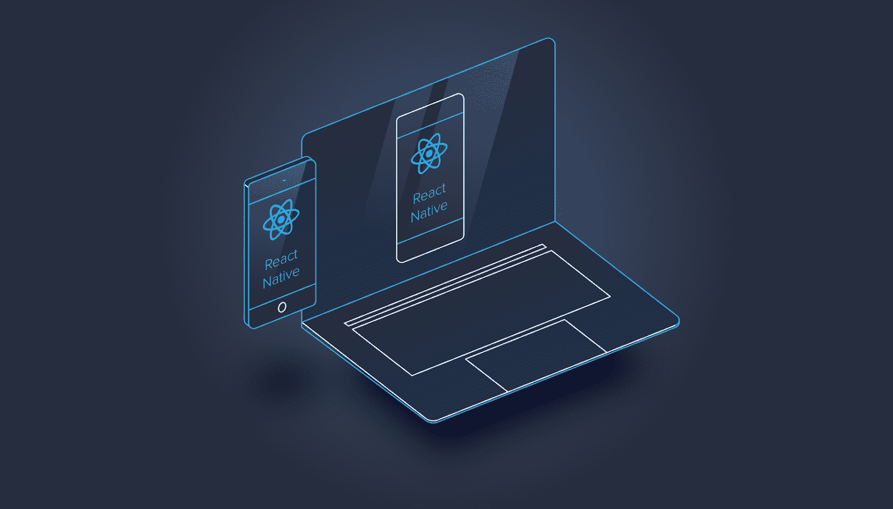
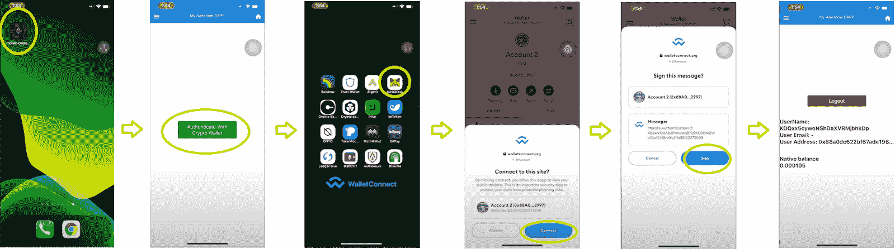

# 用 React 本地模板创建移动以太坊 dApp

> 原文：<https://moralis.io/create-mobile-ethereum-dapp-with-react-native-template/>

**在创建** [**去中心化应用**](https://moralis.io/decentralized-applications-explained-what-are-dapps/)**(dApps)**[**以太坊**](https://moralis.io/full-guide-what-is-ethereum/) **仍然是最受开发者欢迎的选项。然而，许多开发人员在开发 dApps 时没有移动优先的方法，这是一个相当大的问题，因为大多数用户在他们的移动设备上花费更多的时间。此外，如果**[**web 3**](https://moralis.io/the-ultimate-guide-to-web3-what-is-web3/)**应用确实支持移动用户，它们通常会提供糟糕的用户体验，首先是登录复杂和有缺陷的钱包集成。这导致有经验的和新的加密用户离开你的 dApp 去竞争。幸运的是，有一个实用的解决方案可以让你轻松地创建用户友好的移动 dApps。此外，这个出色的解决方案还让您有机会在其他领先的连锁店上部署任何移动以太坊 dApp。当使用诸如 Moralis 和 React 本地模板这样的工具时，这是可能的。因此，我们将在这里展示如何使用 React 本地模板创建一个移动以太坊 dApp。**



除非你一直生活在岩石下，否则你可能听说过 Moralis。这个终极的 Web3 开发平台使前端开发人员能够轻松地过渡到区块链开发，并显著更快地交付非凡的 dApps。这要感谢 Moralis 的服务，包括 [Moralis Speedy Nodes](https://moralis.io/speedy-nodes/) 、服务器、强大的 [Web3 SDK](https://moralis.io/exploring-moralis-sdk-the-ultimate-web3-sdk/) 和广泛的 API。通过这些工具的力量，Moralis 使区块链开发变得尽可能简单。此外，随着其最新添加的 [React 原生支持](https://moralis.io/moralis-introduces-react-native-support/)，它还涵盖了移动以太坊 dApp 开发。通过使用 React 本地模板，您可以用最少的努力创建用户友好的移动 dApps。此外，Moralis 从一开始就考虑到了跨链的互操作性。因此，你的移动以太坊 dApp，由 Moralis 构建，可以部署在其他著名的连锁店。这样，你也可以让你的 dApps 适应未来，并在任何连锁店失去人气的情况下消除很多风险。



## 什么是 React 原生模板？

在我们给你机会仔细查看一个示例项目之前，我们使用上面提到的工具创建了一个简单的移动以太坊 dApp，我们必须首先让你熟悉这个项目。因此，我们需要涵盖一些基础知识，以确保您对移动 dApps 开发有一个正确的理解。那么，什么是 React 原生模板呢？

第一，你需要知道 React Native 和 React 类似；然而，它利用本地组件而不是 web 组件作为构建块。它使您能够开发在不同平台上工作的移动应用程序。如果您不熟悉 React，并希望深入了解这个主题，我们建议您查看我们的文章“[什么是 React？](https://moralis.io/react-explained-what-is-react/)”。然而，我们可以简单地描述一下 React，它基本上是一个开源的、声明性的 [JavaScript](https://moralis.io/javascript-explained-what-is-javascript/) (JS)用户界面(UI)库。它使用一种叫做“JSX”的模板语言，将代码编译成普通的 JavaScript 函数。因此，通过了解 React，您就知道了使用任何 React 本机模板的基础。此外，还应该学习一些 React 本机特有的方面，尤其是本机组件。



因此，React 原生模板是为移动应用预先编写的 React 原生代码，带有文档和一组基于移动应用设计的功能。像任何模板一样，这是一个极好的起点；然而，它需要一些调整来满足您的需求。查看我们的 [React dApp 模板](https://moralis.io/react-dapp-template-how-to-build-a-react-dapp/)获得逐步指导！

如果你是一个完全的初学者，想要成为一名区块链开发人员，你首先需要确保你知道至少一种 T2 最好的区块链开发语言。JavaScript 结合 React 相当强大；因此，我们建议报名参加[Moralis 学院](https://academy.moralis.io/)的[区块链开发者 JavaScript 编程](https://academy.moralis.io/courses/javascript-programming-for-blockchain-developers)和 [React Web 开发 101](https://academy.moralis.io/courses/react-web-development-101) 课程。

## react-Moralis–移动 dApps 开发变得简单

什么是[反应——Moralis](https://github.com/MoralisWeb3/react-moralis)？React-Moralis 是指 Moralis 对 React 和 React Native 的支持，使移动以太坊 dApp 开发者能够使用 Moralis 强大的平台轻松调用功能和显示数据。本质上，React-Moralis 使您能够在任何移动平台上使用 Moralis 和 Web3 的力量。通过使用这种集成，您可以轻松克服大多数 dApps 面临的限制。因此，您可以满足网络和移动用户的需求。这样，您就可以轻松地为对分散式应用感兴趣的移动设备用户提供出色的用户体验。

### 创建一个用户友好的移动以太坊 dApp-React-Moralis 快速入门

首先，您需要确保“react”、“react-dom”和“moralis”依赖项安装在您的代码编辑器中(我们通常使用 Visual Studio 代码[VSC])。接下来，安装“react-moralis”依赖项。通过在 VSC 的终端中输入以下内容，可以涵盖所有这些内容:

*   如果使用 npm 包管理器: ***npm 安装 react react-DOM moralis react-moralis***
*   如果使用纱包管理器: ***纱添加 react react-DOM moralis react-moralis***

然后，你需要把你的 app 用一个“ ***<Moralis 提供者>*** ”包装起来。此外，您应该提供您的“appId”和“serverUrl”(更多信息，请参见下一小节):

```js
import React from "react";
import ReactDOM from "react-dom";
import { MoralisProvider } from "react-moralis";

ReactDOM.render(
  <MoralisProvider appId="xxxxxxxx" serverUrl="xxxxxxxx">
    <App />
  </MoralisProvider>,
  document.getElementById("root"),
);
```

现在剩下要做的就是调用应用程序中的钩子:

```js
import React from "react";
import { useMoralis } from "react-moralis";

function App() {
  const { authenticate, isAuthenticated, user } = useMoralis();

  if (!isAuthenticated) {
    return (
      <div>
        <button onClick={() => authenticate()}>Authenticate</button>
      </div>
    );
  }

  return (
    <div>
      <h1>Welcome {user.get("username")}</h1>
    </div>
  );
}
```

#### Moralis 设置–获取应用程序 ID 和服务器 URL

要获取 Moralis 服务器的应用程序 ID 和服务器 URL，请按照下列步骤操作:

1.  [**创建你的 Moralis 家账户**](https://admin.moralis.io/register)——如果你还没有创建你的 Moralis 家账户，请确保现在就创建。只需点击上面的链接，输入您的电子邮件地址，并创建您的密码。然后，确认您的电子邮件地址(您将收到一封带有确认链接的电子邮件)。如果你已经有一个 Moralis 账户，只需[登录](https://admin.moralis.io/login)。
2.  **创建新服务器**–登录您的 Moralis 帐户后，您想要创建一个新服务器。只需点击右上角的“+创建新服务器”按钮，并从下拉菜单中选择首选网络类型(见下图)。在开发一个新项目时,“Testnet Server”选项是一个很好的选择。


接下来，输入所需的详细信息，包括服务器名称(可以是您想要的任何名称)，选择区域、网络、链(您可以选择一个或多个选项)，然后单击“添加实例”。


3.  **访问服务器详细信息**–要获取服务器的 URL 和应用程序 ID，只需点击服务器名称旁边的“查看详细信息”按钮。将出现一个包含所有信息的弹出窗口(见下图)。*如果你以前用过 Moralis，你可能已经设置了一个或多个服务器。在那种情况下，你可以使用它们中的任何一个。*


4.  **初始化 Moralis**–现在，您需要用 Moralis 服务器详细信息(应用程序 ID 和服务器 URL)填充您的代码。这样，您就获得了所需的后端功能:


*注意* *:不要从上图中复制服务器细节。您需要使用特定服务器的详细信息。*

# 使用 React 本地模板创建移动以太坊 dApp 一个示例项目

现在，终于到了使用 React 原生模板并创建一个移动以太坊 dApp 作为示例项目的时候了。这样，你会看到 Moralis 如何简化事情。例如，Moralis 还使 dApp 的[以太坊认证](https://moralis.io/ethereum-authentication-full-tutorial-to-ethereum-login-programming/)的实现变得简单明了。对于我们的演示 dApp，我们将使用 [WalletConnect](https://moralis.io/how-to-connect-users-with-walletconnect/) 。这是我们的演示应用程序的样子:



在上面显示的步骤中，我们首先启动我们的演示移动 dApp。接下来，我们点击“使用加密钱包验证”按钮。这将激活 WalletConnect 身份验证选项，该选项提供了各种备选方案。出于这个例子的目的，我们使用 [MetaMask](https://moralis.io/metamask-explained-what-is-metamask/) 的钱包应用。然后，我们需要点击“连接”按钮，然后在自动启动的 MetaMask 钱包应用程序中点击“签名”按钮。最后，我们可以看到我们的移动以太坊 dApp 已经登录，并显示了几个细节。后者包括用户名(存储在 Moralis 的数据库中)、用户电子邮件(如果提供的话)、用户地址和本机余额。

这是一个移动以太坊 dApp 的基本示例，但是它向您展示了它获取链上数据的主要目的。现在让我们仔细看看创建这样的移动 dApps 所需的代码。

## React 移动 dApps 本机模板–代码演练

为了创建上面介绍的移动友好的以太坊 dApp，我们使用了多个类型脚本(。tsx)文件，其中包含所有需要的代码。此外，我们在 GitHub([React Native boilerplate](https://github.com/MoralisWeb3/demo-apps/tree/main/react-native-boilerplate))为您提供了所有这些文件。请随意将它们用作您的移动 dApps 的 React 原生模板。

查看" [Providers.tsx](https://github.com/MoralisWeb3/demo-apps/blob/main/react-native-boilerplate/frontend/Providers.tsx) "文件(单击上面的链接查看完整代码)，代码中有一些部分值得特别注意。首先，我们需要初始化 Moralis(这是我们使用“Moralis 设置-获取应用程序 ID 和服务器 URL”小节中获得的详细信息的地方):

```js
const appId = "INSERT_APP_ID"; // Application ID from moralis.io
const serverUrl = "INSERT_SERVER_URL"; // Server URL from moralis.io
const environment = "native";
const getMoralis = () => Moralis;
// Initialize Moralis with AsyncStorage to support react-native storage
Moralis.setAsyncStorage(AsyncStorage);
// Replace the enable function to use the react-native WalletConnect
// @ts-ignore
Moralis.setEnableWeb3(enableViaWalletConnect);
```

这为您提供了对 Moralis API 的完全访问，包括其先进的 [NFT API](https://moralis.io/ultimate-nft-api-exploring-moralis-nft-api/) 、[以太坊 API](https://moralis.io/ethereum-api-develop-ethereum-dapps-with-moralis/) 以及许多其他强大的快捷方式。现在，让我们看看代码的另一个重要部分，确保我们初始化 Moralis 和 WalletConnect:

```js
export const Providers = ({ children }: ProvidersProps) => {
  return (
    <WalletConnectProvider {...walletConnectOptions}>
      <MoralisProvider appId={appId} serverUrl={serverUrl} environment={environment} getMoralis={getMoralis}>
        {children}
      </MoralisProvider>
    </WalletConnectProvider>
  );
};
```


### React 移动 dApps 本机模板——“app . tsx”文件

“ [App.tsx](https://github.com/MoralisWeb3/demo-apps/blob/main/react-native-boilerplate/frontend/App.tsx) ”文件包含为我们的示例应用程序提供所有功能和 UI 组件的代码。整个代码太广泛了，我们无法在这里完全覆盖(要查看完整的代码，请单击上面的链接)；然而，让我们来看看“挂钩调用”的代码行:

```js
import React, { useEffect } from "react";
import { StyleSheet, Text, TouchableOpacity, View } from "react-native";
import { useMoralis, useMoralisWeb3Api, useMoralisWeb3ApiCall } from "react-moralis";
import { useWalletConnect } from "./WalletConnect";
```

此外，该文件包含的代码可确保正确获取和显示用户详细信息，并确保 WalletConnect 用于对用户进行身份验证:

*   包含令牌余额的函数(只显示了一部分代码):

```js
    Moralis.Web3API.account.getTokenBalances({ address: "" }).then(console.log);
  }, []);
```

*   负责验证和显示用户详细信息的功能:

```js
function App(): JSX.Element {
  const connector = useWalletConnect();
  const { authenticate, authError, isAuthenticating, isAuthenticated, logout, Moralis } = useMoralis();

  return (
    <View style={[StyleSheet.absoluteFill, styles.center, styles.white]}>
      <View style={styles.marginLarge}>
        {authError && (
          <>
            <Text>Authentication error:</Text>
            <Text style={styles.margin}>{authError.message}</Text>
          </>
        )}
        {isAuthenticating && <Text style={styles.margin}>Authenticating...</Text>}
        {!isAuthenticated && (
          // @ts-ignore
          <TouchableOpacity onPress={() => authenticate({ connector })}>
            <Text>Authenticate</Text>
          </TouchableOpacity>
        )}
        {isAuthenticated && (
          <TouchableOpacity onPress={() => logout()}>
            <Text>Logout</Text>
          </TouchableOpacity>
        )}
      </View>
      {isAuthenticated && (
        <View>
          <UserExample />
          <Web3ApiExample />
        </View>
      )}
    </View>
  );
}
```

如果你喜欢看视频解说，我们推荐你看 f 跟随*的视频:*

https://youtu.be/FRilwynjW1c

## 移动 dApps–电子邮件认证

我们这些深深卷入区块链和加密应用程序的人往往会忘记，一般人不知道什么是加密钱包。对于这些用户，您可能希望在 dApp 中提供使用[电子邮件认证](https://docs.moralis.io/moralis-server/users/email-login)的选项。这样，你就可以模糊 Web2 和 Web3 之间的界限，为更广泛的人群提供最好的用户体验。此外，通过提供他们知道的电子邮件登录选项，然后指导他们完成连接钱包的过程，您可以让新的加密用户加入进来。这将是一个很好的方式让他们进入加密领域，让他们立刻欣赏你的移动以太坊 dApp。


*如果您有兴趣了解更多关于* [*基本用户注册和登录选项*](https://youtu.be/aYi1_moT4kI) *，请务必点击链接。*

## 使用 React 本机模板创建移动以太坊 dApp–摘要

Moralis 让创建移动 dApps 变得更加容易。通过使用 Moralis 支持 React Native 的终极 Web3 开发平台，您可以利用并受益于最先进的 [Web3 API](https://docs.moralis.io/moralis-server/web3-sdk/intro) 。通过使用简短的代码片段，您可以涵盖单调乏味且耗时的区块链相关后端编码。这些代码片段整齐地提供在 [Moralis 的文档](https://docs.moralis.io/)中，并附有例子来帮助你快速理解。有了 Moralis 的 React 原生支持，您可以抢先运行其他项目，这些项目仅限于 web 用户或那些不知道如何为其移动用户提供访问 Web3 世界的简单方法的用户。

此外，请记住，有了 Moralis，你绝不是局限于以太坊链条上的移动 dApps。Moralis 的创建是为了完全跨链互操作，并不断增加对新的声誉良好的链的支持。虽然以太坊被认为是本机选项，但您可以通过简单地添加一个指定另一个链的附加参数来关注任何其他受支持的链。此外，这种跨链的互操作性使得 Moralis 成为 Avalanche 的最佳 [Infura 和 BSC](https://moralis.io/infura-for-avalanche-exploring-infura-avalanche-alternatives/) 的最佳 [Infura。因此，它也使您能够克服 RPC 节点](https://moralis.io/infura-bsc-alternatives-the-best-alternative-to-infura-for-bsc/)的所有[限制。](https://moralis.io/exploring-the-limitations-of-rpc-nodes-and-the-solution-to-them/)

此外，我们建议探索我们继续在 [Moralis 的博客](https://moralis.io/blog/)和 [Moralis 的 YouTube 频道](https://www.youtube.com/c/MoralisWeb3)上提供的免费内容。除了解释区块链发展的各个方面，我们还涵盖了许多范例项目，这些项目可能是很好的学习和启发材料。

