# 在币安智能链上创造 NFT——完整指南

> 原文：<https://moralis.io/create-nft-on-binance-smart-chain-full-guide/>

由于在以太坊上购买或创建 NFT 的高昂费用，用户和开发者将目光转向了币安智能链(BSC)。通过提供低费用和兼容[**【EVM】**](https://moralis.io/evm-explained-what-is-ethereum-virtual-machine/)**【的方式，使得能够利用 ERC 标准，BSC 获得了超越以太坊的竞争优势。这并不奇怪，BSC 正在为各种各样的 NFT 创作者赢得通往顶端的道路，因为他们希望尽可能地盈利并具有成本效益。因此，任何想要深入研究** [**NFT 令牌开发**](https://moralis.io/nft-token-development-the-ultimate-guide/) **的人都应该学习如何用 Moralis 来创建币安智能链上的 NFT。Moralis 的 ultimate**[**web 3**](https://moralis.io/the-ultimate-guide-to-web3-what-is-web3/)**平台提供了对币安智能链的全面支持，使得在 BSC 上创建 NFT 的过程极其简单。因此，这篇“在币安智能链上创建 NFTs 完整指南”文章对于那些想要探索创建 BSC NFTs 任务的人来说将是一个极好的起点。**

知道如何使用 Moralis 创建币安智能链 NFTs，无论是对您自己的项目还是对您想涉足加密领域的客户，都将是非常有益的。幸运的是，在币安智能链上创建 NFT 比大多数初学者想象的要简单得多。如今，您已经有了优秀的工具，可以在几分钟内启动 NFTs(假设您已经准备好了数字文件[NFTs])。然而，真正让事情变得尽可能简单的工具是 [Moralis](https://moralis.io/) ，也被称为“ [Firebase for crypto](https://moralis.io/firebase-for-crypto-the-best-blockchain-firebase-alternative/) ”。这个终极的 Web3 开发平台是完全跨链互操作的，这意味着您在 BSC 上完成的所有开发项目，包括 BSC NFTs，都可以很容易地部署在其他兼容 [EVM](https://moralis.io/evm-explained-what-is-ethereum-virtual-machine/) 的区块链上。因此，你将学习如何使用 Moralis 在币安智能链上创建 NFT。

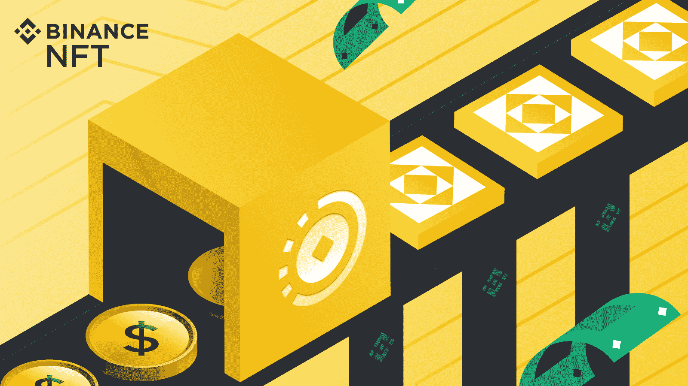

## 用 Moralis 创造币安智能链上的 NFT

如前所述，Moralis 是开发者为开发者打造的终极 Web3 开发平台。此外，它为大多数著名的领先区块链提供全面支持。此外，你可以访问 [Moralis 的 SDK](https://moralis.io/exploring-moralis-sdk-the-ultimate-web3-sdk/) ，包括它的[终极 NFT API](https://moralis.io/ultimate-nft-api-exploring-moralis-nft-api/) 。后者使您能够轻松地将 BSC NFTs 整合到独特的[分散式应用](https://moralis.io/decentralized-applications-explained-what-are-dapps/) (dApps)中。总而言之，就 Web3 开发而言，在与 Moralis 合作时，天空是唯一的限制。但是，我们今天不会创建 dApps 相反，我们将通过一个简单的示例项目向您展示如何在币安智能链上创建 NFT。

此外，除了使用 Moralis，我们还将通过使用 [OpenZeppelin](https://moralis.io/what-is-openzeppelin-the-ultimate-guide/) 来获得智能合约模板，以及使用 [Remix](https://moralis.io/remix-explained-what-is-remix/) 来毫不费力地部署相关的[智能合约](https://moralis.io/smart-contracts-explained-what-are-smart-contracts/)，从而简化我们的工作。此外，我们鼓励您尽最大努力，自己实施所有步骤。通过这种方式，你将学会如何轻松地为你自己或你的客户在币安智能链上创建 NFT，这可能是你在职业生涯中学到的最好的技能之一。

总的来说，下面是我们今后将完成的任务:

1.  创建一个 Moralis 服务器来访问数据库和后端功能。
2.  从 OpenZeppelin 获取智能合同模板，并使用 Remix 根据我们的需求调整智能合同。
3.  使用您的 Moralis 仪表板和云函数选项来存储 NFTs 元数据并获取其 URI。
4.  使用 [Moralis Speedy Nodes](https://moralis.io/speedy-nodes/) ， [MetaMask](https://moralis.io/metamask-explained-what-is-metamask/) ，混搭[mint NFT](https://moralis.io/how-to-mint-nfts-full-tutorial-to-minting-an-nft/)。
5.  探索如何更进一步，创造更多的 BSC NFTs。

## 创建金融智能链 nfts–示例项目

我们将使用一个公开可用的图像文件，并将其转换成几个 BSC NFTs(它们将代表剑)，这可能会进一步用于 [NFT 游戏开发](https://moralis.io/nft-game-development-how-to-build-an-nft-game-app-in-minutes/)。然而，在我们继续之前，请记住，为了这个示例项目的目的，我们将在 BSC 的 testnet 上部署 NFTs。我们建议你也这样做，直到你学会如何正确地在币安智能链上创建 NFT。然而，即使这样，在 BSC 的 mainnet 上创建 NFT 之前，首先在 testnet 上部署 NFT 以确保一切正常可能更明智。也就是说，让我们创建一些 BSC NFTs，好吗？如前所述，我们将通过创建一个 Moralis 服务器来开始我们的探索。

### Moralis 服务器的初始设置

为了获得 Moralis 的完整后端功能，您需要创建一个 Moralis 服务器。通过创建服务器，您将获得对其数据库的访问权限以及添加云功能的选项，我们将使用这两者来创建币安智能链 NFTs。因此，按照以下步骤完成初始 Moralis 设置:

1.  [**创建一个免费的 Moralis 账户**](https://admin.moralis.io/register)——只需点击左边的链接，然后输入您的电子邮件地址并创建您的密码。此外，不要忘记确认您的帐户-您需要单击将发送给您的确认电子邮件中的确认链接。然而，如果你已经创建了你的 Moralis 账户，只需[登录](https://admin.moralis.io/login)。

2.  [**创建一个 Moralis 服务器**](https://docs.moralis.io/moralis-server/getting-started/create-a-moralis-server)–登录到您的 Moralis 管理区域后，导航到“服务器”选项卡(见下图)。在那里，单击右上角的“+创建新服务器”按钮。接下来，从下拉菜单中选择一个网络选项。出于示例项目的目的，我们建议选择“Testnet 服务器”选项。*然而，当您准备好将您的 NFTs 部署到任何 mainnet 时，您将需要使用“Mainnet 服务器”选项。*

选择网络类型后，您需要输入您的服务器的名称(这可以是您想要的任何名称)，选择区域、网络和链(我们将在这个项目中使用 BSC 的 testnet)。要完成此步骤，请单击“添加实例”来启动服务器。 *T2】*

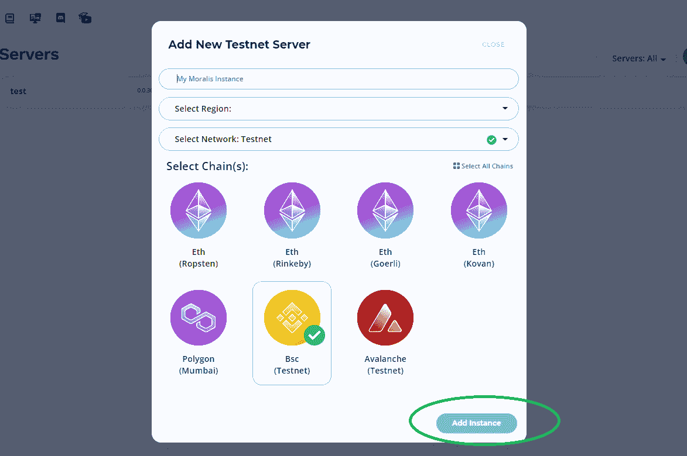

通过创建您的 Moralis 服务器，您将获得对 Moralis 后端功能的访问。例如，如果您要[构建您的第一个 dApp](https://moralis.io/build-your-first-dapp-ethereum-tutorial/) ，您需要获得您现在可以获得的服务器的详细信息。然而，为了创建 BSC NFTs，我们需要访问服务器的数据库并创建一个云函数。这是我们在前进过程中会涉及到的内容。

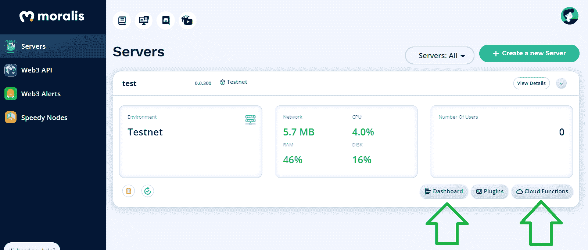

## 利用 moralis 智能合同在金融智能链上创建 nft

现在是时候签订一份合适的智能合同了。正如承诺的那样，您不需要从头开始创建自己的智能合同。相反，您可以使用 OpenZeppelin 来获取用于各种目的的智能合同模板。在我们的例子中，我们将使用 GitHub 上提供的" [ERC1155.sol](https://github.com/OpenZeppelin/openzeppelin-contracts/blob/master/contracts/token/ERC1155/ERC1155.sol) "智能合约。尽管该合同的以太坊标准(ERC-1155)，它将使我们能够铸造我们的币安智能链 NFTs，因为 BSC 是 EVM 兼容的。

使用上面的链接，您可以将这个智能合同导入到 Remix。首先，在 Remix 中创建新文件，并添加顶部的 pragma 行。然后，键入“import”并将 GitHub 的“ERC1155.sol”智能合同的 URL 粘贴到它旁边:

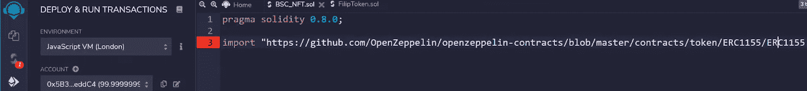

有了 OpenZeppelin 提供的智能契约，我们就可以应用必要的调整来服务我们的示例项目了。遵循 [Solidity](https://moralis.io/solidity-explained-what-is-solidity/) 编码语言的规则，事情相当简单:

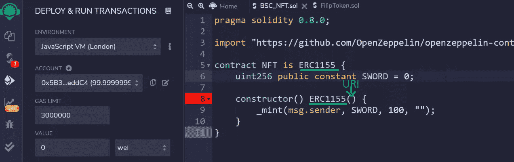

查看上图，您可以看到我们引用了带有“ERC1155”的导入智能合同。此外，我们将我们的 NFTs 命名为“剑”,并决定铸造 100 个实例。然而，在我们铸造币安智能链 NFT 之前，我们需要提供一个适当的 URI。

NFT 的 URIs 提供了它们的元数据，这些元数据以 JSON 文件的形式存储。这意味着我们需要在某个地方托管我们想要转换为 BSC NFTs(或任何其他链上的 NFT)的文件，以便获得它们的链接(URIs)。这就是 Moralis 家让我们变得简单的地方。因此，让我们来看看如何使用 Moralis 仪表板(数据库)。

### 为 BSC NFTs 元数据使用 Moralis 仪表板

此时，您应该已经创建了 Moralis 服务器，这意味着您可以访问它的仪表板。为此，只需点击“查看详情”旁边的箭头即可查看其他选项。然后，点击“仪表板”:

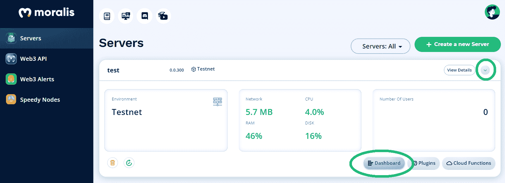

进入服务器的仪表板后，您需要创建一个新类:

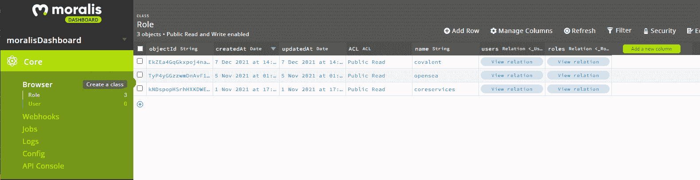

你可以跟随我们的脚步，称它为“NFT”:

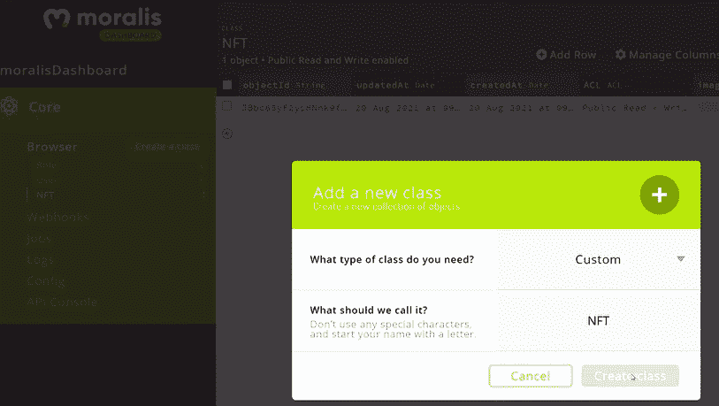

创建了一个新类后，您可以通过单击“Add a new column”按钮在其中添加列(然后，选择数据类型并添加描述)。这些列将代表您的币安智能链 NFTs 的详细信息。同样，我们建议您按照我们的建议添加“图像”、“nft_id”和“损害”列:

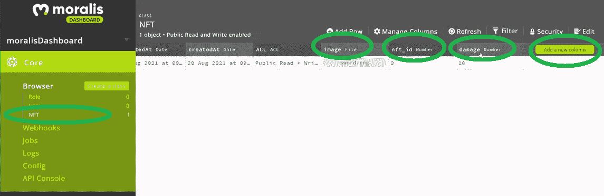

一定要注意列名，因为在创建云函数时会用到它们。对于这个示例项目，我们手动填充了第一行(上传图像文件，键入 NFT ID，并输入 damage)。要创建多个 NFT，我们需要为每个 NFT 创建一行。*如果你想* [*散装薄荷 NFTs*](https://moralis.io/how-to-bulk-mint-nfts-batch-minting-guide/) *，还有更高级的解决方案。*

### 使用云函数生成 BSC NFTs 元数据

将必要的信息和图像文件上传到服务器的仪表板后，您就可以生成元数据文件(包括 URI 链接)了。为此，您可以使用云函数:

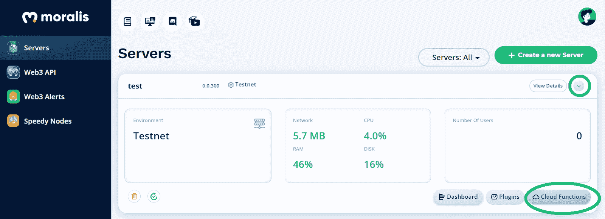

点击“云功能”按钮后，可以立即开始输入代码。以下几行将帮助您在币安智能链上创建 NFT:

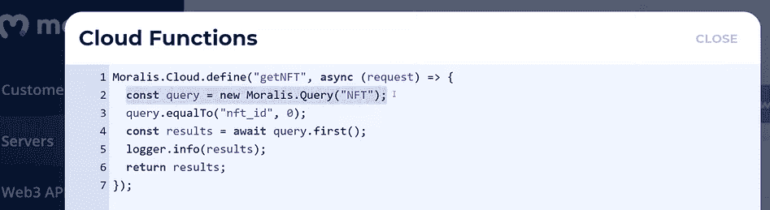

如上所述，在这里您可以访问“NFT”类的特定列和行，而无需服务器的仪表板。上面介绍的云函数将为您的 NFT 提供一个 JSON 文件。但是，为了查看它，您需要使用服务器的 URL，后跟:" */functions/getNFT/？_ application id =[your moralisappid]&id = 0 "*(更多详情，请查看我们的 [Moralis 的文档](https://docs.moralis.io/moralis-server/cloud-code/cloud-functions#calling-via-rest-api))。因此，您应该获得您的 Moralis 服务器 URL 和应用程序 ID。为此，我们使用“查看详情”按钮:

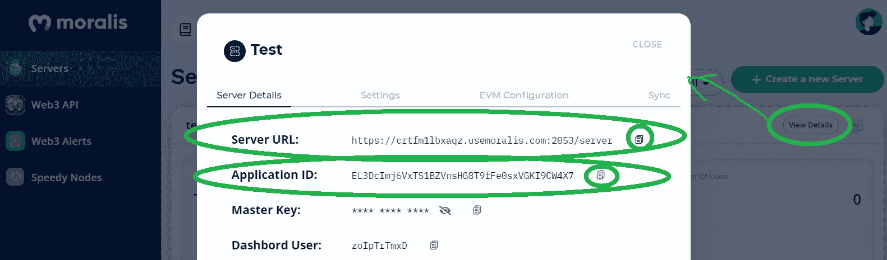

*注意* *:确保使用你服务器的详细信息和* ***而不是上面显示的*** *。*

通过在浏览器中输入这个复杂的 URL，您将看到潜在的 NFT 元数据:

### 与 moralis 一起在金融智能链上创建 nft–打造您的 NFT

此外，上面介绍的复杂 URL 是您在 Remix 内的智能合约中用作 URI 的 URL(参见上面的“使用 Moralis 在币安智能链上创建 NFT-智能合约”部分)。然而，由于我们正在铸造 100 个 NFT，我们需要根据 ERC-1155 标准使用 ID 固定器。为此，我们将 URI 中的“0”替换为“{id}”:

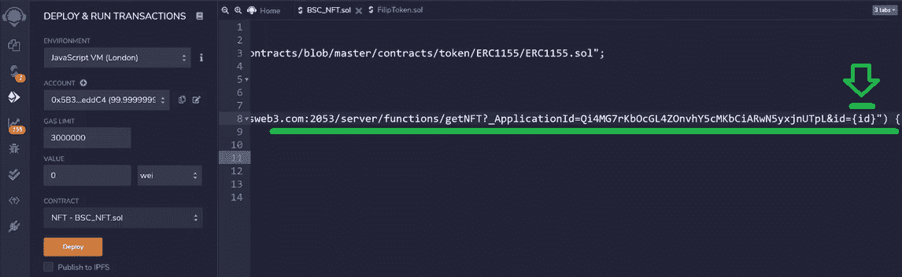

#### Moralis 快速节点

现在，您已经将 URI 插入到“构造函数”中，您几乎已经准备好部署您的契约，并最终创建您的 BSC NFTs。但是，您首先需要使用一个 BSC 节点。幸运的是，Moralis 又一次支持了你。通过使用 Moralis Speedy Nodes，只需点击一个按钮，就可以将任何支持的网络添加到元掩码中。在我们的例子中，您需要为 BSC 的 testnet 这样做:

1.  进入你的 Moralis 管理区的“快速节点”标签:

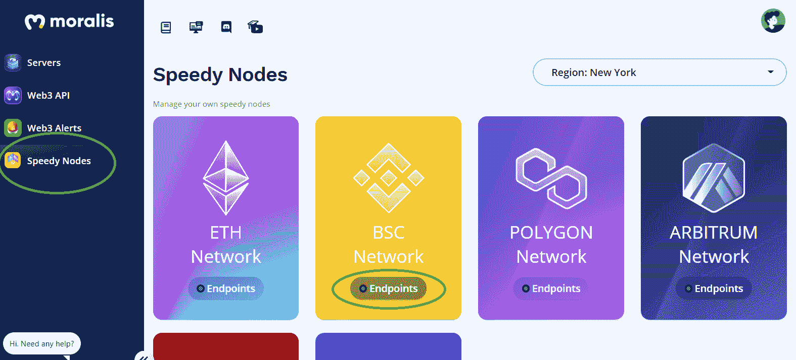

2.  单击“BSC 网络”下的“端点”按钮。

3.  点击 testnet 的“添加到元掩码”按钮:

*出现提示时，确认/允许元掩码添加网络。*

4.  转到 MetaMask 并选择“BSC Testnet”:

*注意* *:如果这是你第一次在 BSC 的 testnet 上使用元掩码，你还需要获得一些“测试”BNB 令牌。您可以通过访问“*[*【https://testnet.binance.org/faucet-smart*](https://testnet.binance.org/faucet-smart)*”并输入您的元掩码地址来完成此操作。*

#### 部署您的智能合同，打造您的金融智能链 nfts

一旦您将 BSC testnet 添加到元掩码扩展中，并获得了一些“播放”BNB 令牌，您就可以部署您的智能合约并创建您的 NFT 了。为此，请确保您在混音中的设置与下图中的设置相匹配:

点击“部署”按钮后，将会提示您的元掩码扩展。只需点击“确认”即可最终在币安智能链上创建 NFT。现在，您可以使用您的“造币交易散列”在 [BscScan](https://moralis.io/exploring-bscscan-full-guide/) 上查看它(确保选择 testnet):

今天的任务到此结束。如果你想对 Remix 和上述云函数中使用的代码行进行额外的代码演练，请确保查看下面的视频。此外，您还可以在这里观看 Moralis 专家向您展示如何将您的 BSC NFTs 任务提升到下一个级别(从 19:48 开始)。

https://www.youtube.com/watch?v=02VnfTIomn8

## 在币安智能链上创建 NFT-完整指南-摘要

将创建 NFT 的过程分成多个步骤后，看起来可能需要做很多工作；然而，正如你在上面的视频中看到的，你可以在大约 20 分钟内轻松完成所有这些。此外，通过完成上面的步骤，您现在意识到在使用 Moralis 时创建 NFT 只需要最少的编码。多亏了 Moralis 的 SDK，你可以通过复制和粘贴代码片段来完成大部分任务。此外，通过使用 OpenZeppelin 提供的智能合同模板，您可以在没有 Solidity 专业知识的情况下工作。

事实上， [JavaScript](https://moralis.io/javascript-explained-what-is-javascript/) 的熟练程度和使用元掩码的能力是你用 Moralis 创建各种各样的区块链项目和非凡的 dApps 所需要的。然而，如果你还不知道 JavaScript，我们建议你参加 Moralis 学院的 [2021 区块链开发者 JavaScript 编程](https://academy.moralis.io/courses/javascript-programming-for-blockchain-developers)课程。此外，你可能想看看[Moralis 学院](https://academy.moralis.io/)的其他高价值课程，以帮助你尽早成为全职加密员。另一方面，你可以在 [Moralis YouTube 频道](https://www.youtube.com/c/MoralisWeb3)和 [Moralis 博客](https://moralis.io/blog/)上获得大量免费的高质量内容。这包括各种加密领域术语和概念的简单解释以及许多示例项目。例如，您可以学习[使用共价 API](https://moralis.io/how-to-build-with-the-covalent-api/) 构建、[同步和索引智能合约事件](https://moralis.io/sync-and-index-smart-contract-events-full-guide/)、[构建跨链 dApp](https://moralis.io/how-to-build-cross-chain-dapps/)、如何[托管 dApp](https://moralis.io/how-to-host-a-dapp-dapp-hosting-explained/) 、[构建去中心化消息应用](https://moralis.io/build-a-decentralized-messaging-app-in-5-steps/)、[创建 OpenSea 克隆](https://moralis.io/create-an-opensea-clone-build-an-nft-marketplace-like-opensea/)，等等。

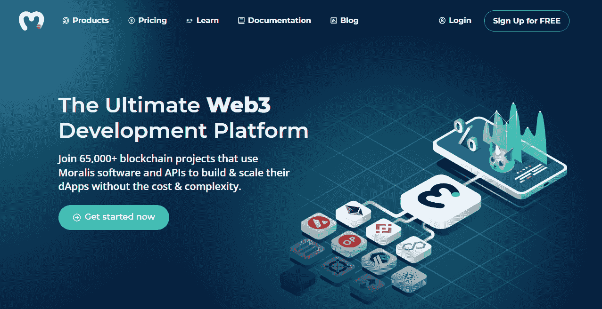