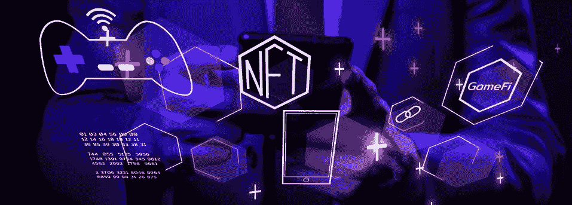
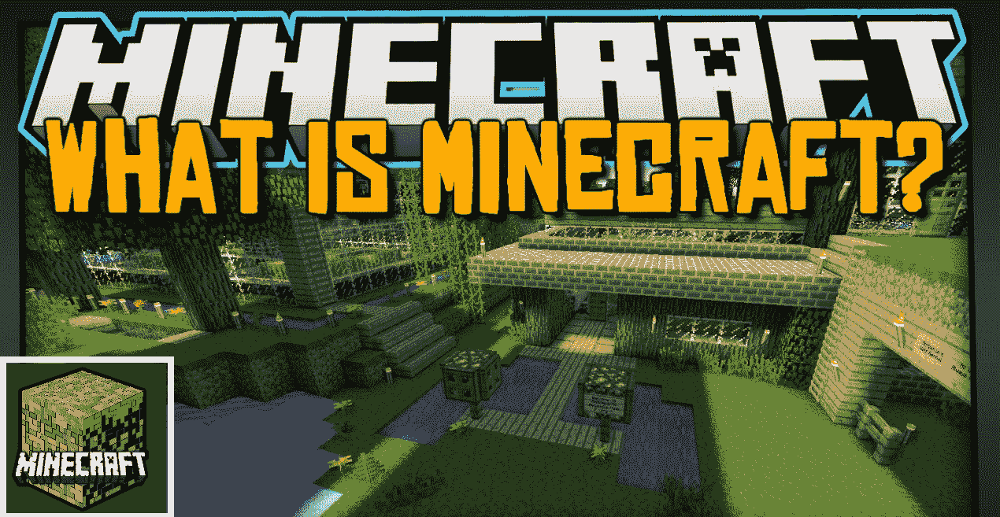
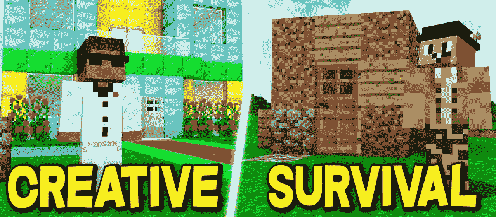
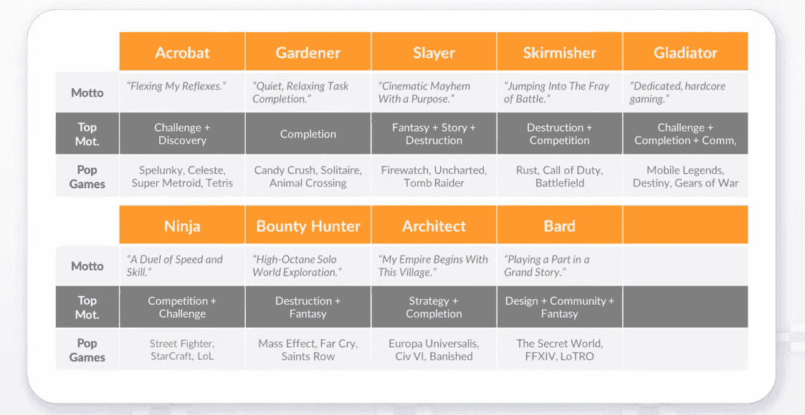
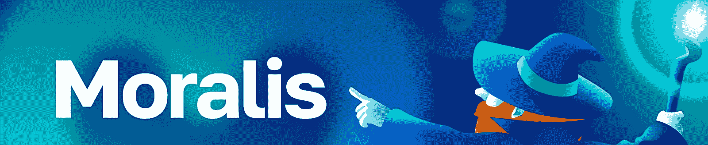
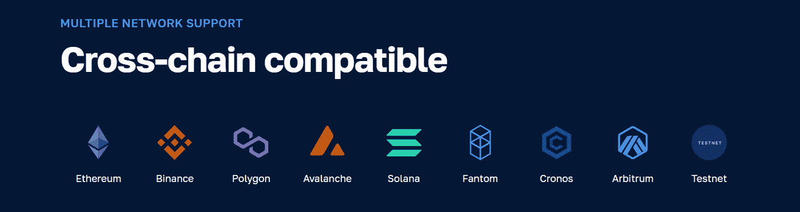

# 创作《我的世界》Web3 游戏——将创意投入生产

> 原文：<https://moralis.io/creating-a-minecraft-web3-game-take-ideas-into-production/>

随着一些已经开发的 Web3 游戏取得巨大成功，传统游戏领域的知名公司已经在探索如何将区块链应用到他们的游戏模式中。因此，现在是探索区块链游戏和学习如何创建一个 Web3 游戏的绝佳时机。此外，与任何过程一样，这一切都始于一个想法。然而，启动创造性思维和开发一个 Web3 游戏的想法可能具有挑战性。如果你需要一些灵感，你来对地方了。在这篇文章中，我们来看看《我的世界》的 Web3 游戏是什么样子的。《《我的世界》》的伟大之处在于，这款游戏包含了众多与 Web3 概念完美契合的元素。因此，在整篇文章中，我们将专注于一个理论上的 Web3《我的世界》游戏，并探索概念和工具来创建不只是一个《我的世界》Web3 游戏，而是任何你能想到的基于区块链的游戏！

接下来，我们将首先确保你们都知道什么是 Web3 游戏。此外，虽然大多数人都知道这个游戏是关于什么的，我们将很快解释什么是《我的世界》。毕竟，如果你想深入“《我的世界》网络 3”的讨论，正确理解这些基础知识是至关重要的。此外，我们将从回答《我的世界》是否是元宇宙开始。然后，我们将仔细看看一些伟大的想法和工具，以帮助您创建一个 Web3《我的世界》游戏没有出汗。在这里，你将了解到更多关于 [Moralis](https://moralis.io/) 的信息——最终的 Web3 API 提供者。最终，Moralis 让您通过使用您的遗留开发技能来快速轻松地创建 dapps，从而在 Web2 和 Web3 之间架起一座桥梁。因此，确保[创建你的免费 Moralis 账户](https://admin.moralis.io/register)！

[**Join Moralis’ Discord Channel and Moralis Magazine**](https://moralis.io/joindiscord/)

## 什么是 Web3 游戏？

既然你知道什么是游戏，我们需要把重点放在“Web3”组件上，以便你理解什么是 Web3 游戏。因此，请记住，Web3 是最新一代的互联网。与全是集中式应用的 Web2 不同，Web3 基于去中心化和区块链理工大学。因此，它旨在增加真正的所有权、透明度、内在经济等要素。然而，值得注意的是，Web3 的主要焦点是在后端。因此，前端将简单地采用 web 2.0 带来的大部分内容。

虽然区块链网络和节点是区块链技术栈的极其重要的基础层，但是你不需要处理它们。至少不是直接的。相反，您可以利用强大的 Web3 APIs 和其他开发工具来关注顶层——去中心化应用程序(dapps)。毕竟，Web3 游戏只是 dapps 的特殊类型。因此，像所有的 dapps 一样，他们为玩家提供了一种与区块链网络互动的方式。虽然 Web3 游戏的链上交互的细节各不相同，但一旦玩家完成 Web3 认证过程，它们都成为可能。因此，每一个 Web3 游戏都必须有一个可靠的和用户友好的方式让用户连接他们的 Web3 钱包。

除了 Web3 认证，Web3 游戏必须能够获取链上数据。此外，为了增加更高级的 Web3 功能，区块链游戏还需要一种方法来监听和触发链上程序，称为智能合约，这是将游戏内资产转换为 NFT 的方法。因此，它为玩家提供了真正的所有权，这是一款《我的世界》Web3 游戏应该提供的。

## 什么是《我的世界》？

尽管《我的世界》很受欢迎，但仍有许多人不知道它是什么。因此，值得指出的是，《我的世界》是一个沙盒视频游戏。这意味着游戏包含了为玩家提供高度创造力的游戏元素。此外，没有预先确定的目标。相反，玩家可以自己设定目标。此外，沙盒电子游戏通常被称为非游戏或软件玩具。

莫江工作室开发了《《我的世界》》,幕后黑手是马库斯·“诺奇”·佩尔森。这位开发者使用 JavaScript 编程语言创建了这款流行的游戏。此外，该游戏于 2009 年 5 月上市；但是，两年半后全面放开了。从那时起，《我的世界》开始涉足数字世界，这导致微软以超过 20 亿美元的价格收购了 Mojang 和《我的世界》的知识产权。此外，《《我的世界》》成为有史以来最畅销的视频游戏。因此，《我的世界》是许多玩家最喜欢的游戏也就不足为奇了。

此外，《我的世界》允许玩家探索一个块状的，程序生成的 3D 世界。后者包括几乎无限的地形。玩家可以发现和提取原材料、工艺工具/物品，建造建筑、土木工程和简单的机器。当然，具体细节取决于玩家选择的游戏模式，包括以下两个选项:

*   **生存模式**–*玩家必须获得资源来建造世界并维持健康。*
*   **创意模式**–*玩家拥有无限的资源和飞行权限。*

根据选择的游戏模式，玩家可以与敌对的小怪战斗，或者与同一世界的其他玩家合作或竞争。此外，《我的世界》附带了各种用户生成的内容，这扩大了游戏的可能性。有了所有这些特征，一款 Web3《我的世界》游戏就很有意义了。

### 《我的世界》和 web 3——《我的世界》被认为是元宇宙吗？

下一节将讨论一些潜在的《我的世界》Web3 克隆的特殊想法。但是在我们进入那部分之前，我们想回答《我的世界》是不是元宇宙。很不幸，这个问题有一个更复杂的答案。毕竟，关于什么是元宇宙有太多的解释，这完全取决于你的看法。

例如，如果你决定坚持最核心的元宇宙定义(想想" *Ready Player One* ")，你就不可能相信《我的世界》是元宇宙。另一方面，如果你像我们一样喜欢元宇宙(一个交互式虚拟世界)的宽松定义，那么你会同意《我的世界》是某种中央集权的元宇宙。这就是为什么我们相信 Web3《我的世界》版本会是一个更棒的游戏。

## 创建 Web3《我的世界》游戏的想法和工具

无论你是在开发 Web3 游戏还是 Web2 游戏，事情都是从灵感开始的。不过，在创建 Web3 游戏时，您可以轻松地克隆现有的传统游戏，并通过实现 Web3 功能使其独一无二。因此，你可以从流行的 Web2 游戏中获得灵感。如果你要开发一个《我的世界》Web3 游戏，这正是你要做的。

通过这样做，你可以在等式中去掉很多猜测。毕竟，鉴于《我的世界》的成功，很明显这种游戏在情感上与玩家有联系。此外，《我的世界》的两种游戏模式也适合广泛的玩家动机和玩家类型。

为了更好地理解这一点，看看“Bartle 分类法”会有所帮助。后者将玩家分为“社交者”、“探索者”、“成功者”和“杀手”:

上面的图片也清楚地表明，大多数人(大约 80%)是“社交者”，他们主要只是想和朋友们玩得开心。此外，《我的世界》非常适合这类球员。

除了上面的划分，还有其他方法来划分玩家类型和动机。例如，根据 Quantic Foundry 的最新研究，有 12 种玩家动机与 9 种玩家类型相匹配:

*   玩家动机:

*   玩家类型:

通过观察上面的两张图片，可以肯定地说《我的世界》覆盖了相当大的范围。然而，如果你设法创建一个《我的世界》Web3 的克隆，你将添加一个全新的维度:

上图清楚地展示了 Web3 游戏(如果有适当的激励机制)如何不仅仅服务于玩家。相反，投资者和盈利者也可能进入竞技场(GameFi)。这清楚地向你展示了 Web3 的功能如何扩展了传统的游戏概念。

### 克隆《我的世界》Web3 的想法

在像《我的世界》这样的游戏中，有如此多的游戏内资产和无数的选项来标记这些资产。根据游戏内资产的类型，它们可以被转换成 NFT 或可替换的代币(例如，ERC-20 代币)。对于独特的游戏内物品，如地图、世界等，NFTs 是最好的选择。另一方面，可替换的代币可以作为游戏的货币。然而，与 Web2 游戏不同，当涉及到链上令牌时，它们可以兑换为菲亚特，将它们的价值带到现实世界中。

此外，通过将游戏中的资产转换为 NFTs，玩家将真正拥有他们游戏进程的所有权。由于 NFT 将存储在玩家的 Web3 钱包中，他们可以将它们发送给其他玩家，或者用它们交换其他 NFT 或可替换的令牌。后者可以通过内置市场或第三方 NFT 市场完成。最终，在《我的世界》Web3 克隆版中，有无数可替换和不可替换令牌的实用选项。

有了标记化，您可以轻松地实现所有三个当前的 GameFi 模型，包括:

*   **游戏赚取**–*玩家通过完成游戏中的各种动作来赚取现实世界的货币收入。*
*   游戏拥有权(Play-to-Own)–*这允许玩家将他们的游戏内资产转化为 NFT，作为所有权的证明。当然，游戏中的物品可以在市场上出售或点对点交易。*
*   **边玩边赚**–*这种 GameFi 模式专注于游戏性和游戏进程。它围绕着玩家通过游戏的故事、任务和目标获得奖励、代币和 NFT。*

### 创建 Web3《我的世界》游戏的工具

我们已经提到过，如果你想简单地创建 Web3 游戏，Moralis 是一个终极工具。这个企业级 Web3 API 提供程序使您能够集成上一节中介绍的所有特性。然而，第一步是设置好 [Web3 认证](https://moralis.io/authentication/)，其中 Moralis 的 Web3 认证 API 是首选。然后，您可以使用 Moralis 的 [NFT API](https://moralis.io/nft-api/) 和[令牌 API](https://moralis.io/token-api/) 来获取与这些加密资产相关的链上数据。要轻松地与智能合约交互并将其用作触发器，Moralis [Streams API](https://moralis.io/streams/) 是最佳选择。

此外，Moralis SDK 支持所有领先的 Web2 开发平台。这意味着你可以用 Firebase、Supabase、Unity、React Native 等传统工具来制作 Web3 游戏。因此，通过这种跨平台的互操作性，Moralis 使您能够在 Web2 和 Web3 之间架起一座桥梁。

尽管如此，同样值得一提的是，Moralis 是完全跨链互操作的。这意味着你可以将你的 Web3 游戏部署到所有领先的可编程区块链上。此外，你的工作是面向未来的，因为你永远不会被任何特定的链条所束缚。

#### 成为一名 Dapp 或 Web3 游戏开发者

此外，Moralis 还附带一套完整的学习资源。这些包括[Moralis 文件](https://docs.moralis.io/)，它的[区块链博客](https://moralis.io/blog/)， [Web3 YouTube 频道](https://www.youtube.com/c/MoralisWeb3)，以及[Moralis 学院](https://academy.moralis.io/)。前三个出口是完全免费的，并附带了无数的 Web3 概念和教程的解释。因此，他们可以免费帮助你成为 Web3 开发者。

另一方面，你可以通过报名参加 Moralis 学院，以更专业的方式接受你的加密教育。鉴于你似乎对创作一个《我的世界》Web3 游戏感兴趣，以太坊游戏编程课程可能正是你所需要的。

最后但并非最不重要的是，下面是一个视频的 Moralis 团队成员解释为什么《我的世界》是他最喜欢的游戏。这可能会激发一些额外的“网络 3《我的世界》”的想法。

[https://www.youtube.com/embed/BpimlpUPqDU?feature=oembed](https://www.youtube.com/embed/BpimlpUPqDU?feature=oembed)

## 创建《我的世界》Web3 游戏–将创意投入生产–总结

通过以上几节，你有机会获得一些关于潜在的《我的世界》Web3 克隆的好主意。不过，我们先解释一下什么是 Web3 游戏。这是你了解 Web3 的地方，也是你了解它是如何给网络和现实世界带来变革的地方。我们还提供了一些关于《我的世界》的基本信息。此外，我们还解释说，根据我们对元宇宙的理解，《我的世界》可以被归入“元宇宙”一类。然后，我们仔细研究了一些关于如何将游戏中的资产令牌化，并为玩家提供他们在玩游戏中投资的真正所有权的想法。最后，我们对 Moralis 做了一个快速的概述，它是一个简单的创建 Web3 游戏的工具。

如果今天的文章启发了你，让你真正去解决创建一个《我的世界》Web3 游戏这样一个具有挑战性的壮举，你可能已经有了令人印象深刻的开发技能。因此，只需创建你的 Moralis 帐户，并开始“建设”。然而，如果你是 Web3 开发的新手，我们建议你从一些简单的教程开始。例如，使用 Moralis 文档来创建你的第一个 dapp。当然，欢迎在 Moralis 博客上探索其他区块链发展话题。一些最新的文章关注于[跨链桥接](https://moralis.io/cross-chain-bridging-deep-dive/)、[在索拉纳上编程智能合约](https://moralis.io/how-to-program-smart-contracts-and-implement-them-on-solana/)、[上传文件到 IPFS](https://moralis.io/how-to-upload-files-to-ipfs-full-guide/) 、[在索拉纳上铸造硬币](https://moralis.io/how-to-mint-a-coin-on-solana-in-5-steps/)、 [Aptos](https://moralis.io/what-is-aptos-full-guide-to-the-aptos-blockchain/) 和[隋](https://moralis.io/what-is-sui-blockchain-the-ultimate-guide/)区块链等等。