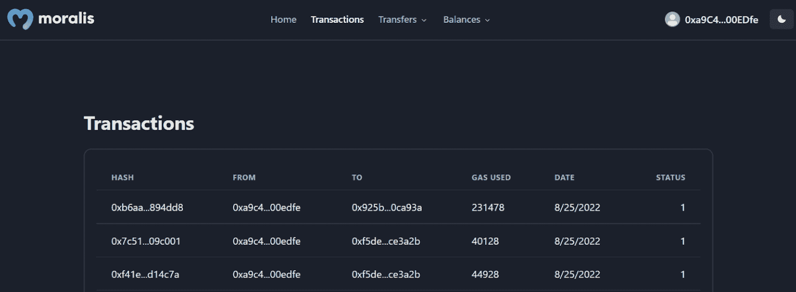
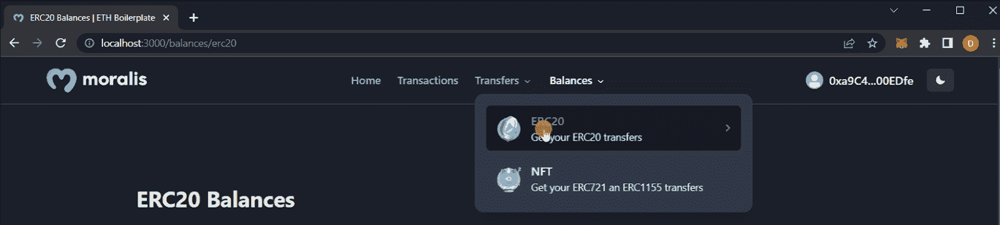
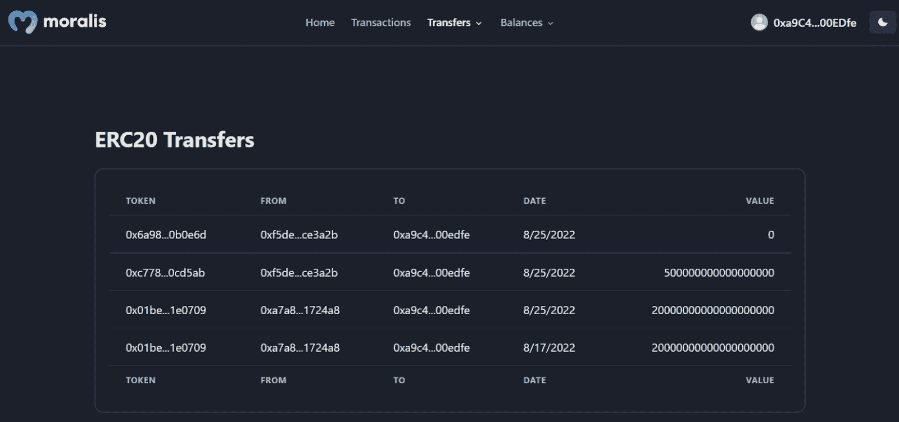
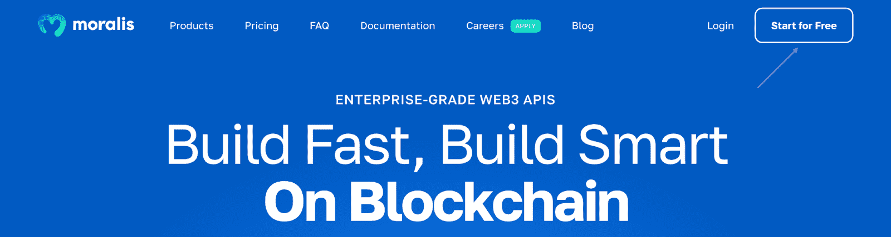

# Cronos 样板文件——如何创建 Cronos Dapps

> 原文：<https://moralis.io/cronos-boilerplate-how-to-create-cronos-dapps/>

构建您的第一个 Cronos dapp 可能会显得繁琐和令人畏惧。然而，如果有适当的指导和强大的开发工具，这个过程并不一定很困难。事实上，有了[](https://moralis.io)****，你现在就有可能在几分钟内打造 Cronos dapps！此外，Moralis 还提供企业级**[**web 3 API**](https://moralis.io/web3-apis-exploring-the-top-5-blockchain-apis/)**和 Cronos 样板文件，使开发人员能够高效地构建 dapps。如果您想了解更多关于构建 Cronos dapps 的最快方法，请跟随我们提供的完整的过程演示！****

**对于门外汉，我们将从简要解释 Cronos 网络开始。接下来，我们将快速浏览 Moralis 的 Cronos 样板文件，其中涵盖了您将创建的 dapp 的主要特性。此外，假设您不想跟随并立即检查项目的代码。在这种情况下，您将在“*探索 Cronos 样板文件*”一节中找到 GitHub 存储库的链接。一旦你熟悉了你要做的事情，我们将通过立刻创建一个 Cronos dapp 来展示 Moralis 的力量！**

**该流程的可访问性部分源于 Cronos 样板文件。然而，还有额外的 Moralis 工具在这个过程中提供帮助。例如， [Web3 认证 API](https://moralis.io/authentication/) 允许我们轻松集成各种认证机制。默认情况下，Cronos dapp 将使用元掩码，但是您可以，例如，[添加比特币基地钱包登录功能](https://moralis.io/how-to-add-coinbase-wallet-login-functionality/)，如果您愿意的话。此外，Moralis 的各种 API 并不局限于 Cronos 样板，可以让您将任何技术栈连接到多个网络！**

**因此，无论您计划用 Cronos 样板创建 dapps，还是接手任何其他 Web3 项目，都没有关系；Moralis 为您服务。因此，立即注册 Moralis，奖励自己一个更容易获得的开发者体验！**

## **什么是 Cronos 网络？**

**Cronos 网络最初于 2021 年推出，自那以来，它一直与 Crypto.org 的区块链并行运行，为其“支付”功能提供动力。此外，上述链条背后的组织是 Crypto.com，该组织自 2016 年 6 月以来一直存在。**

**

Cronos 区块链与 EVM 兼容，支持基于 Cosmos SDK 的 IBC(区块链间通信)网络。因此，该网络与以太坊和基于宇宙的生态系统兼容。此外，这允许以太坊智能合约和 dapps 的轻松移植。

以太薄荷支持 Cronos，这是一个可伸缩的、高吞吐量的区块链框架，可与以太坊互操作和兼容。以太币是从 EVM 兼容链(当然也包括以太坊)轻松快速移植 dapps 和智能合约的来源。这是 Crypto.org 的区块链和 Cronos 的主要区别，因为前者不是基于 Ethermint 的。因此，Crypto.org 的区块链不支持为基于 EVM 的平台和其他框架创建的 dapps。

此外，Cronos 使用 PoS(利害关系证明)共识机制。因此，该网络的验证者在验证交易时，会拿出一部分资产来诱导良好的行为。PoS 系统的主要好处是它比其他替代方案(如 PoW(工作证明))提供了更高的可伸缩性。

然而，这涵盖了 Cronos 的基础知识和网络如何运行。随着对 Cronos 网络有了更深刻的理解，是时候更深入地研究用 Moralis 的 Cronos 样板创建 dapps 的过程了。但是，在这样做之前，我们将更详细地研究 Cronos 样板文件，因为这将为您的工作提供一个好主意！

## 探索 Cronos 样板文件

Moralis 的 Cronos 样板文件为 dapp 提供了极好的基础，具有大多数 dapp 需要的一些基本特性。在本节中，我们将介绍 Cronos 样板文件的一些核心功能，让我们从模板的登录页面开始:


上图展示了一旦你启动 Cronos dapp，你将在哪里着陆。正如您在顶部看到的，有几个选项卡我们可以进一步探索。但是，在我们开始之前，您需要使用顶部的“连接钱包”按钮进行身份验证:


这将提示您的元掩码钱包，允许您签名。一旦签署，Cronos dapp 将自动在各个标签中填写与您的钱包相关的信息。例如，如果您单击“交易”选项卡，它将如下所示:



上图中的表格显示了之前使用钱包进行的交易。该表显示了与每笔交易相关的信息，如地址、日期等。此外，您还可以查看带有下拉菜单的“转账”选项卡:



如您所见，样板文件将允许您在 ERC-20 令牌和 NFT 之间进行筛选。例如，如果您点击“ERC-20”选项，它将显示该令牌类型的转移历史记录:



然而，如果你想跳过教程直接进入 Cronos 样板代码，你可以在下面找到 GitHub 库的链接。然而，你可能会很快注意到回购的名称是“以太坊-样板”，这可能会让你迷惑。然而，样板文件是跨链兼容的，这意味着它同样适用于构建 Cronos dapps！

**完整的 Cronos 样板文档—**[**https://github . com/以太坊-样板/以太坊-样板**](https://github.com/ethereum-boilerplate/ethereum-boilerplate)

## 用 Moralis 的 Cronos 样板文件构建 Cronos Dapps

如果您决定跟随，下面几节将说明如何使用 Moralis 的 Cronos 样板文件构建 dapp。此外，为了使本指南更加直观，我们将本文分为三个步骤:

1.  克隆 Cronos 样板文件
2.  配置样板代码
3.  运行 Cronos Dapp

遵循这些步骤将允许您在几分钟内构建一个具有上一节中描述的特性的 Cronos dapp！此外，完成本教程所需要的只是基本的编程知识和一个 Moralis 帐户。所以，如果你还没有，请立即创建你的 Moralis 账户。您只需点击 Moralis 网站顶部的“[免费开始](https://admin.moralis.io/register)”按钮，然后按照说明进行操作:



如果你喜欢看视频来学习，看看下面这个来自 YouTube 频道的视频:

[https://www.youtube.com/embed/Bb5Pc--kyAY?feature=oembed](https://www.youtube.com/embed/Bb5Pc--kyAY?feature=oembed)

在上面的片段中，Moralis 开发人员带您完成了使用样板文件创建 dapp 的过程。但是，它不能直接与 Cronos 网络兼容。因此，如果您需要帮助来配置代码，请跟随我们，我们将为您提供一个完整的使用 Moralis 的 Cronos 样板构建 Cronos dapps 的演练！

### 步骤 1:克隆 Cronos 样板文件

克隆 Cronos 样板文件相对简单。首先，打开您首选的 IDE(集成开发环境)并为项目创建一个新文件夹。在这种情况下，我们将使用 VSC (Visual Studio 代码)。如果您选择另一种替代方案，请注意，该过程有时可能会略有不同。

打开 IDE 后，下一步是获取存储库 URL。您可以使用“*探索 Cronos 样板文件*一节末尾的链接找到 GitHub repo。打开此回购后，您可以通过点击绿色的“代码”按钮，然后点击复制图标来复制 URL:


有了 URL，导航回您的 IDE 并打开一个新的终端。如果您使用的是 VSC，请点击顶部的“终端”并点击“新建终端”，打开一个新的终端:


接下来，确保您位于正确的位置，对应于您刚刚创建的文件夹，并在终端中输入以下带有 repo URL 的命令:

```js
git clone “BOILERPLATE_URL”
```

如果您运行上面的命令，它应该会将 GitHub repo 克隆到您的本地目录中。在那里，确保通过下面的命令再次导航到正确的文件夹:

```js
cd ethereum-boilerplate 
```

如果您正确执行所有这些命令，它应该会产生一个类似于下图所示的结构:


### 步骤 2:配置样板代码

接下来，项目位于本地目录中，是时候对代码进行一些必要的配置了。更具体地说，您必须打开“. env.local.example”文件，并首先将文件名更改为“. env.local”。以下是该文件的初始代码:

```js
APP_CHAIN_ID=0x1
APP_DOMAIN=ethereum.boilerplate
MORALIS_API_KEY= # Get your KEY https://admin.moralis.io/account/profile
NEXTAUTH_SECRET= # Linux: `openssl rand -hex 32` or go to https://generate-secret.now.sh/64
NEXTAUTH_URL=http://localhost:3000 # replace for production

```

总共有五个环境变量。但是，您现在只需要配置其中的三个，我们将仔细研究的第一个是“ *APP_CHAIN_ID* ”。默认情况下，该变量设置为“ *0x1* ”，这是以太坊链 ID。因此，如果您希望构建一个 Cronos dapp，就必须更改这个变量。Cronos 链 ID 是“ *0x19* ”，您可以继续将变量改为等于这个值。

接下来，您需要向变量“ *MORALIS_API_KEY* 添加一个值。您可以通过登录 Moralis，点击“帐户”选项卡，导航到“密钥”，然后复制 Web3 API 密钥来获取您的密钥:


有了密钥，剩下的工作就是将它粘贴到代码中。最后，您必须向变量" *NEXTAUTH_SECRET* 添加一个密钥。此外，如果您需要生成值的帮助，请使用下面的链接:“【https://generate-secret.now.sh/32】*”。*

*最后一个变量是" *NEXTAUTH_URL* "，您可以暂时保持不变。该变量被设置为“ *http://localhost:3000* ，允许您在本地主机上测试您的 Cronos dapp。但是，当您计划启动 dapp 时，您需要更改这个值，以便它等于您的 dapp 的 URL。*

*这涵盖了您需要处理的所有配置！最后，您的" . env.local "文件应该类似于以下内容:*

```js
*APP_CHAIN_ID=0x19
APP_DOMAIN=ethereum.boilerplate
MORALIS_API_KEY= "YOUR_API_KEY"
NEXTAUTH_SECRET= b8e786967d7bcbc0f920d35bcc3f891c
NEXTAUTH_URL=http://localhost:3000* 
```

### *步骤 3:运行 Cronos Dapp*

*完成所有配置后，Cronos dapp 就完成了。但是，在运行 dapp 之前，您还必须安装几个依赖项。为此，在终端中运行以下命令之一，具体取决于您使用的是" *npm"* 还是" *yarn"* :*

```js
*npm i*
```

```js
*yarn* 
```

*接下来，剩下的工作就是通过以下命令之一在本地主机上运行 dapp:*

```js
*npm run dev*
```

```js
*yarn run dev*
```

*最后，要启动 dapp 并确保一切按预期运行，请使用您之前指定的链接来启动您的 Cronos dapp:"[*http://localhost:3000*](http://localhost:3000/)"。*

*这涵盖了使用 Moralis 的 Cronos 样板文件创建 dapp 的完整过程。剩下的工作就是实现或删除样板文件中的特性，以确保它符合客户群的需求！*

*如果还有问题，我们建议查看之前的视频或 GitHub 资源库中的官方文档。这样做应该有希望回答你的任何问题。否则，考虑加入 Moralis 的不和谐频道，联系我们有才华的社区工程师之一，因为他们将能够帮助您解决大多数问题！*

## *总结——使用 Moralis 的 Cronos 样板文件构建 Dapps*

*创建 Cronos dapps 并不困难，尤其是在与 Moralis 一起工作时。事实上，多亏了 Moralis 的许多工具和 Cronos 样板文件，只需三个步骤就可以建立一个 dapp:*

1.  *克隆 Cronos 样板文件*
2.  *配置样板代码*
3.  *运行 Cronos Dapp*

*

如果您遵循上面的步骤，您将创建一个 Cronos dapp，用户可以使用他们的 Web3 钱包登录。通过身份验证后，他们可以查看交易历史、余额等信息。这为任何 Web3 项目提供了一个很好的基础；你现在需要做的就是全力以赴！

如果你觉得用 Moralis 的 Cronos 样板文件构建 dapps 的教程很有帮助，可以在 Moralis 的 [Web3 博客](https://moralis.io/blog/)查看其他指南。例如，你可以通过五个步骤学会如何[建造雪崩 dapp](https://moralis.io/complete-guide-how-to-build-an-avalanche-dapp-in-3-steps/) 或者[建造以太坊 dapp](https://moralis.io/full-guide-how-to-build-an-ethereum-dapp-in-5-steps/) ！你还可以阅读 Web3 行业中其他令人兴奋的领域。如果你喜欢 Web3 游戏，学习如何[用 Web3](https://moralis.io/how-to-connect-playfab-with-web3-using-azure-functions/) 连接 PlayFab 或者[构建一个 Web3 FIFA 克隆](https://moralis.io/how-to-build-a-web3-fifa-clone/)。

因此，如果你对 Web3 开发感兴趣，并且想获得更快的方式来[构建 Web3 应用](https://moralis.io/fastest-way-to-build-a-web3-app/)，[注册 Moralis](https://admin.moralis.io/register) 。创建一个帐户是免费的，只需点击几下，所以你不会有任何损失！***