# Cronos 开发–将 Dapps 连接到 Cronos

> 原文：<https://moralis.io/cronos-development-connect-dapps-to-cronos/>

随着最近推出的 Cronos 链，许多开发人员希望构建他们的 dapps 并将其连接到 Cronos。如果这是你想完成的任务，那你来对地方了。在本文中，您将学习如何以一种快速简单的方式将 dapps 连接到 Cronos。事实上，通过跟随我们的领导，您将能够在不到 7 分钟的时间内完成这一过程，这要归功于最终的 Web3 技术堆栈！此外，堆栈中的一些工具是 Moralis 的企业级 Web3 APIs，使您能够使用传统的开发技能和工具深入 dapp 开发。T3】

Moralis 是跨平台互操作的，允许您将其功能与所有领先的 Web2 开发平台相结合。此外，通过 Moralis 的 Web3 API，您可以用简短的代码片段覆盖区块链后端功能。反过来，这将节省您的时间和资源，因此您可以专注于创建最好的前端。此外，通过 Moralis 的跨链互操作性，您可以将 dapps 连接到 Cronos 和其他链，如 Ethereum、Solana 和 Moralis 支持的所有其他领先的 EVM 兼容链。事实上，您可以使用相同的代码行，稍加修改，就可以在许多链上部署您的 dapps。因此，这也是你工作的未来证明。

考虑到这一点，你可以放松地知道，当你用 Moralis 将 dapp 与 Cronos 联系起来时，事情并不是一成不变的。您可以随时连接到其他受支持的链。然而，Cronos 是一个具有巨大潜力的可靠链。因此，请务必[创建您的免费 Moralis 帐户](https://admin.moralis.io/register),并跟随我们学习如何将 dapps 连接到 Cronos。

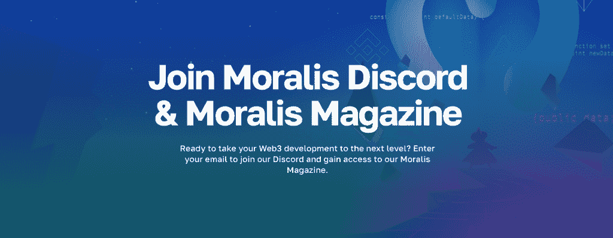

<figcaption>*If you want to get the latest in Web3 development, make sure to join the Moralis Discord channel and sign up for Moralis Magazine!*</figcaption>

[**Join Moralis Magazine**](https://moralis.io/joindiscord/) 

## 克罗诺斯网络解释说

在我们向您展示如何将 dapp 连接到 Cronos 之前，我们应该向您提供一些关于这个开发链的基本信息。因此，让我们用这一节来简要解释 Cronos 需要什么。

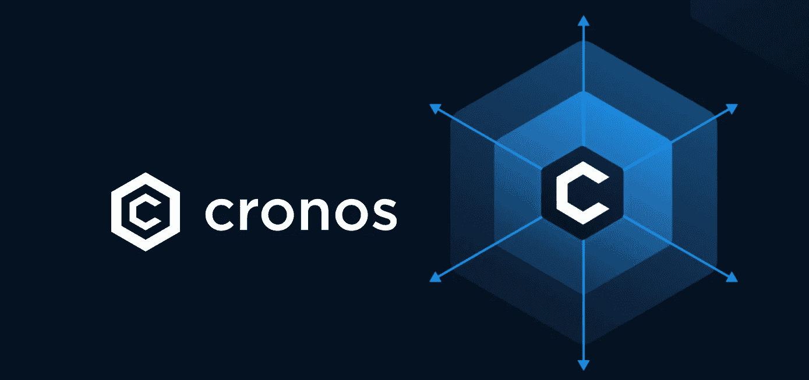

Cronos 网络于 2021 年推出。从那时起，它就与 Crypto.org 区块链平行运行。此外，克罗诺斯与 Crypto.com 关系密切；毕竟，它为该交易所的“付费”功能提供了动力。此外，值得指出的是，Crypto.com 自 2016 年以来就一直存在。此外，这是 Crypto.org 和克罗诺斯区块链背后的组织。

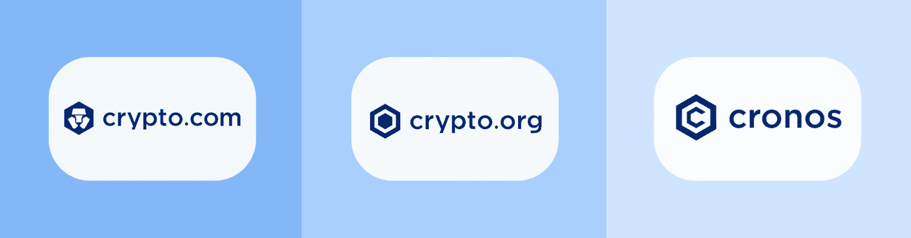

此外，请记住，克罗诺斯区块链是 EVM 兼容。它支持基于 Cosmos SDK 的区块链国家间(IBC)网络通信。毕竟，Cronos 是建立在 Cosmos 之上的，反过来，Cronos 与以太坊和基于 Cosmos 的生态系统是兼容的。因此，这种高度的互操作性使开发人员能够毫不费力地移植以太坊 dapps 和智能合约。

此外，你可能听说过“CRO”。后者作为 Cronos 网络的基础结算货币。然而，CRO 最初是(现在仍然是)Crypto.org 链的本土标志。因此，CRO 是 Crypto.org 和克罗诺斯生态系统的重要组成部分。

就共识机制而言，Cronos 依赖于利益证明(PoS)概念。这意味着 Cronos 网络验证器会将部分资产用于验证交易。这也加强了网络参与者的良好行为。尽管如此，值得指出的是使用 PoS 的主要好处是可伸缩性。毕竟，这是以太坊从其工作验证(PoW)机制过渡到 PoS(合并)的主要原因之一。当然，PoS 对环境也更友好。

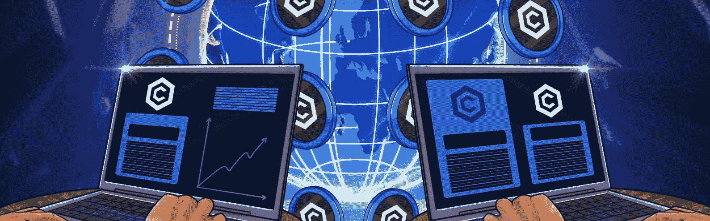

### 为什么要构建 Dapps 并将其连接到 Cronos 网络？

区块链技术已经提供了巨大的机会和许多可靠的链。然而，没有一个区块链是完美的——每个都有它的优点和缺点。因此，由你来决定你想关注哪条链。幸运的是，当你使用 Moralis 时，你不会被任何特定的链所束缚。那么，为什么要构建 dapps 并将其连接到 Cronos 呢？Cronos.org 提供的以下论点可能有助于你决定是否要给克罗诺斯一个机会。

*   Cronos 构建于 Ethermint 之上，支持快速移植来自以太坊和其他 EVM 兼容链的 dapps 和智能合约。
*   Cronos 网络每分钟可以处理比以太坊更多的交易。因此，它更快更便宜。
*   在 Cronos 网络上执行智能合约也是碳中性的。
*   Crypto.org 链和其他支持 IBC 的链(如 Cosmos Hub)可通过 IBC 协议实现互操作性和桥接。
*   Cronos 网络是开源的。欢迎来自社区的任何人评论并提供建议来加强 Cronos。

## 如何将 Dapps 连接到 Cronos——开发教程

使用本文或本文底部的视频教程，您可以在不到 7 分钟的时间内构建 dapps 并将其连接到 Cronos。本质上，您需要完成以下三个步骤:

1.  克隆最终的 EVM 样板文件——你可以在 [GitHub](https://github.com/ethereum-boilerplate/ethereum-boilerplate) 上找到。
2.  定制特定的环境变量，并连接到 Cronos 或任何其他支持的 EVM 兼容链。
3.  启动你的 Cronos dapp。

然而，在我们更详细地向您介绍上述步骤之前，我们想快速演示一下样板文件 dapp。这样，您将确切地知道会发生什么，并且它将帮助您决定是否要将您的 dapp 连接到 Cronos。

### 演示兼容 EVM 的 Dapp

下面的截图显示了我们的样板文件 dapp 的主页:

*注意* *:不要让“以太坊样板”的名字欺骗了你。我们用这个名字是因为以太坊仍然是最受欢迎的连锁店。然而，如前所述，这个样板文件支持其他 EVM 兼容的链，包括 Cronos。*

看上面的截图，你可以看到主页模板列出了这个样板文件的主要特性和好处。上图还显示了顶部导航栏。后者包括以下页面的链接:“主页”、“交易”、“转账”和“余额”。此外，在右上角，你可以看到“连接钱包”按钮，它使用户能够完成他们的 [Web3 认证](https://moralis.io/authentication/)。因此，点击那个按钮后，用户可以在最受欢迎的 Web3 钱包之间进行选择，以连接到这个 dapp。尽管如此，您还可以在顶部导航栏的最右侧看到暗/亮主题开关:

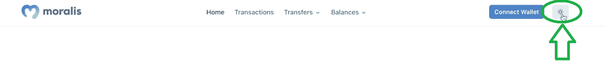

为了便于演示，我们使用元掩码身份验证方法。因此，在点击“连接钱包”按钮后，我们选择了元掩码。因此，我们的元掩码扩展是由 Moralis Auth API 促成的:

为了确认我们的认证，我们需要签署上述签名请求。点击“签名”按钮后，我们可以在之前点击“连接钱包”按钮的位置看到我们的钱包地址:

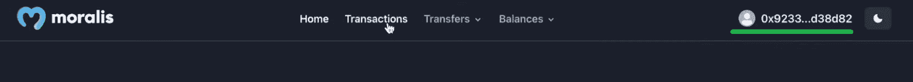

此外，我们可以用连接到样板文件 dapp 的钱包浏览其他页面。因此，我们可以通过点击顶部菜单中的“交易”选项来查看所连接地址的交易:

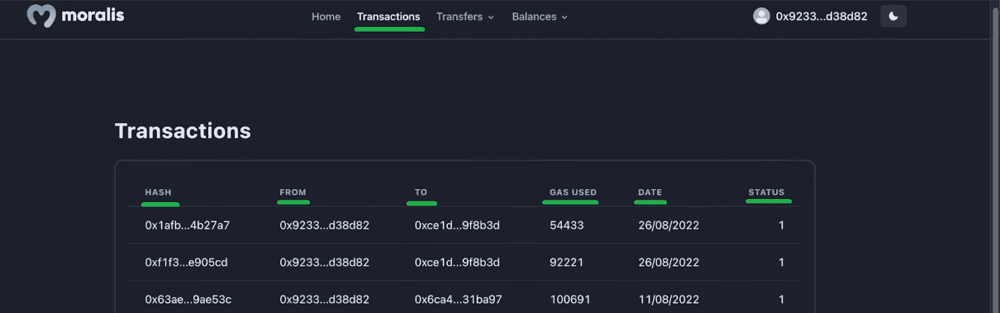

上面的屏幕截图显示了我们的示例 dapp 如何显示事务。此外，您可以看到交易细节包括交易散列，例如“发件人”地址、“收件人”地址、使用的气体量、交易日期和交易状态。

#### 查看 ERC-20 和 NFT 转移和余额

除了上面演示的交易，我们的样板 dapp 显示 ERC-20 和 NFT 转移和余额。当然，显示的细节取决于连接的钱包地址的活跃度和余额。例如，这些是我们在本次演示中使用的钱包上的 NFT 转账:

要进入“NFT 转会”页面，我们需要点击“转会”选项，并从下拉菜单中选择“NFT”:

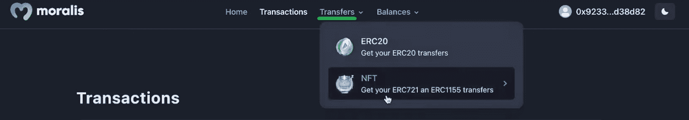

我们还可以通过“余额”菜单查看我们的 ERC-20 代币和 NTF 余额。此外，就像“转移”一样，我们可以在“ERC-20”和“NFT”选项之间进行选择:

因此，当我们决定查看“ERC-20 平衡”页面时，我们会得到以下结果:

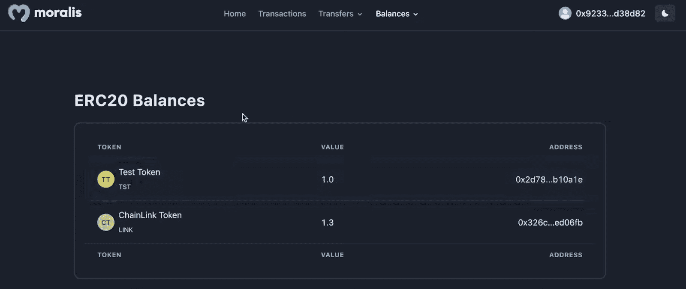

此外，当我们关注“NFT 余额”页面时，我们会看到一些存储在联网钱包中的非功能性转账示例:

查看上面“ERC-20 余额”和“NFT 余额”页面的截图，您可以看到我们的样板文件 dapp 也提供了某些令牌细节。这些包括代币名称、符号和数量。

现在你已经知道从这个终极 EVM 样板文件中可以期待什么了，是时候卷起袖子把你的 dapp 连接到 Cronos 了。

### 使用 Moralis 构建 Dapps 并将其连接到 Cronos 遵循说明

在这一节中，您将学习使用上述样板文件将 dapps 连接到 Cronos 所需的值。此外，我们还将为您提供该流程的清晰概述。但是，要获得详细的后续说明，请使用下面的视频。从 2:00 开始，您将学习如何访问样板文件并克隆代码。接下来，您需要调整“. env.local.example”文件。从 3:20 开始，您将了解该文件中的变量及其值:

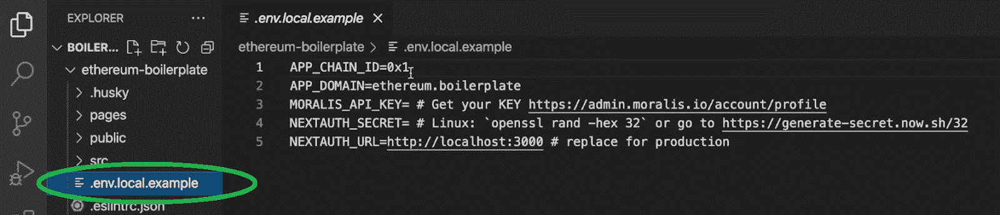

就您将 dapp 连接到 Cronos 的目标而言，这一步意义重大。看上面的截图，可以看到“. en.local.example”文件顶部的变量是“ *APP_CHAIN_ID* ”。因此，这是您需要输入与 Cronos 链匹配的细节的地方。当然，您可以将 dapp 连接到 Cronos mainnet 或 testnet:

*   **Cronos Mainnet 链 ID: 0x19**
*   **Cronos Testnet 链 ID: 0x152**

***注意*** *:如上面演示部分所述，以太坊(0x1)是这个样板文件的默认选项。而且视频教程里的专家重点讲的是多边形 testnet (0x13881)。此外，在 Moralis 文档中，您可以探索所有* [*支持的链*](https://docs.moralis.io/reference/supported-chains-evm) *的链 id。*

一旦指定了上述 Cronos 链 id 之一，还需要注意其他值。此外，至于“ *NEXTAUTH_SECRET* ”和“ *NEXTAUTH_URL* ”变量，仅“. env.local.example”文件就为您提供了所需的所有指令。然而，如果你是 Moralis 的新手，你可能需要帮助来获得你的 Web3 API 密匙。但不要害怕；这也是一项简单的任务。

#### 获取您的 Web3 API 密钥

为了获得您的 Moralis Web3 API 密钥，您需要您的 Moralis 帐户。如果您还没有创建免费帐户，现在就创建吧。你应该不会花超过一分钟左右的时间来设置好你的账户。因此，您可以通过使用简介中的“创建您的免费 Moralis 帐户”链接或点击 Moralis 主页上的“[免费开始](https://admin.moralis.io/register)”按钮开始:

一旦你有了你的帐户，用你的凭证登录进入你的 Moralis 管理区。从那里，您将能够通过这两个简单的步骤获得您的 Web3 API 密钥:

返回到" . env.local.example "文件，用上面复制的密钥替换" *MORALIS_API_KEY* 旁边的占位符内容。

一旦您正确地调整了“. env.local.example”，您还会希望将其重命名为“. env.local”。然后，在 4:42，您将学习如何安装所有的依赖项。有了所有的依赖项，您终于可以运行您的 Cronos dapp 了。为此，您必须在终端中输入“*纱线运行开发”*或“ *npm 运行开发*”。

下面是视频教程，其中包含了构建 dapps 并将其连接到 Cronos 所需的所有细节:

https://www.youtube.com/watch?v=Bb5Pc–kyAY

## Cronos 开发–将 Dapps 连接到 Cronos–总结

在这篇文章中，我们带您进行了一次不寻常的旅行。首先，我们向您提供了一些关于 Cronos 网络的基本信息。因此，您发现 Cronos 是一个基于 Cosmos 的 EVM 兼容链。我们还研究了这个可编程链的一些关键优势，这些优势可能会启发您构建 dapps 并将它们连接到 Cronos。此外，有了这些基础知识，您就有机会查看我们样板文件的演示。最后，我们为您提供了使用这个样板文件在不到 7 分钟的时间内将 dapp 连接到 Cronos 所需的所有细节。

如果你喜欢今天的教程，并想更深入地研究 Cronos 开发，请务必访问 [Moralis YouTube 频道](https://www.youtube.com/c/MoralisWeb3)和 [Moralis 博客](https://moralis.io/blog/)。毕竟，您现在知道可以使用 Moralis 的 EVM API 来构建 Cronos 和其他网络。因此，您可以按照关注其他链的其他教程，更改链 id，使其与 Cronos 相匹配。当然，上面说的这两个出口，也是你想要专注于其他支持的连锁所需要的。一些最新的主题向您展示了如何[将 dapp 连接到以太坊网络](https://moralis.io/set-up-and-connect-a-dapp-to-the-ethereum-network/)，如何[将 dapp 连接到 Polygon](https://moralis.io/tutorial-how-to-connect-a-dapp-to-polygon-network/) ，如何[克隆 Zapper](https://moralis.io/how-to-clone-zapper-in-less-than-1-hour/) ，如何[使用 Azure 函数将 PlayFab 与 Web3 连接](https://moralis.io/how-to-connect-playfab-with-web3-using-azure-functions/)，如何[使用 NextJS 将 MetaMask 连接到网站](https://moralis.io/how-to-connect-metamask-to-website-with-nextjs/)，等等。

另一方面，你可能对更专业的加密教育感兴趣。如果是这样的话，莫拉斯学院是你应该去的地方。这个在线区块链发展教育平台提供几门顶级课程。例如，“ [Moralis Web3 Dapp 编程](https://academy.moralis.io/courses/moralis-web3-dapp-programming)”课程真的可以推动你前进。

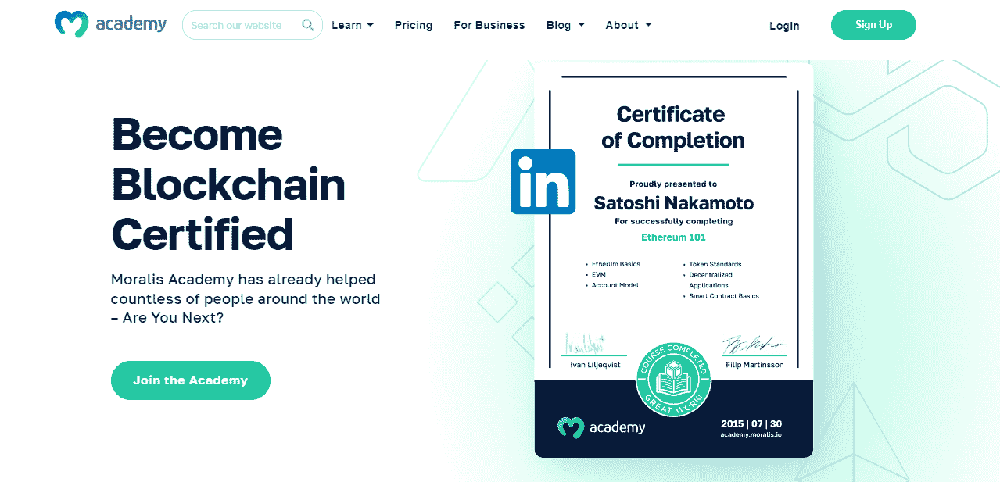