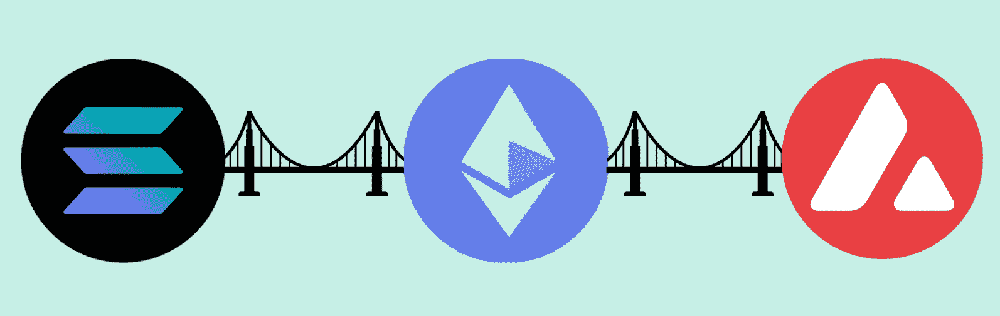
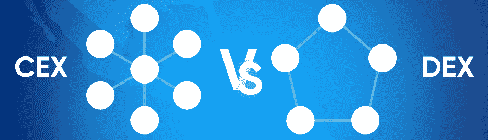
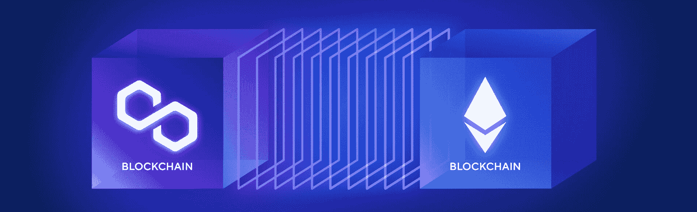
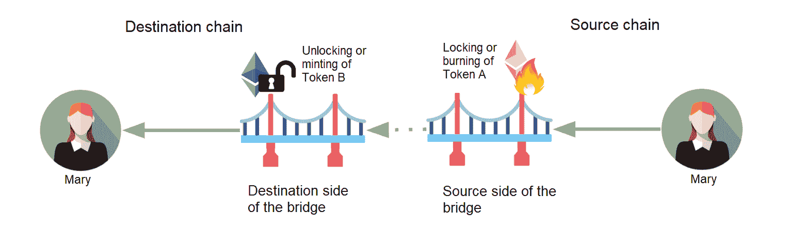
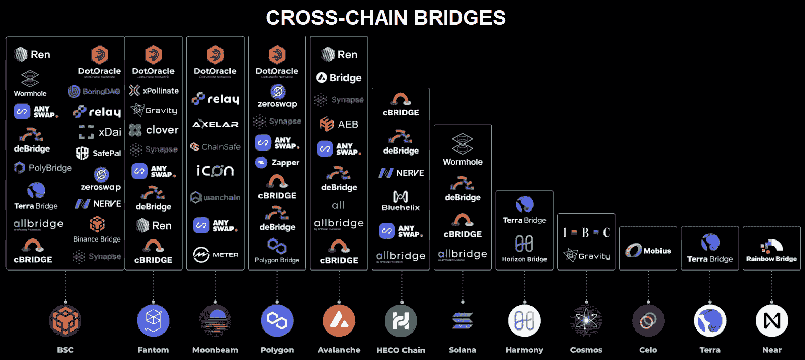
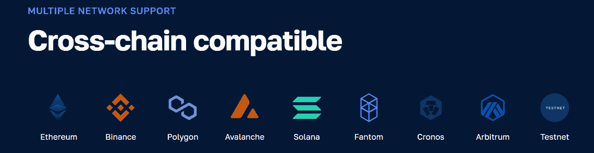
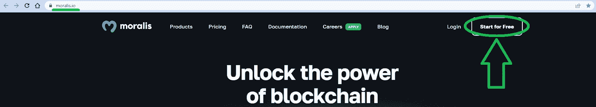

# 跨链桥接深潜

> 原文：<https://moralis.io/cross-chain-bridging-deep-dive/>

**简而言之，跨链桥使用户能够在区块链之间传输令牌和数据。也就是说，这些桥的基本原理超出了最初的解释，可能相当复杂。不幸的是，许多想要找到什么是跨链桥接以及桥如何工作的直接答案的人经常遇到复杂的文章，留给读者更多的问题，而不是理解主题。因此，如果你想要一个简单而彻底的答案来回答“什么是跨链桥？”问题，这篇文章送给你！**

接下来，我们将从基础开始，首先解释什么是跨链桥接。接下来，我们将回答“什么是加密桥，它是如何工作的？”问题。然后，我们来看看这些桥的好处。在本文中，您还有机会了解一些最流行的跨链桥解决方案。最后但同样重要的是，我们将专注于发展。在这里，您将了解到最终的 Web3 API 提供商 [Moralis](https://moralis.io/) 。毕竟，后者是用于创建 dapps(分散应用程序)的领先 Web3 工具，您可以用它来创建一个加密桥。

尽管如此，如果您拥有扎实的编程技能，并且想直接开始使用 Moralis 的跨链 API，请放心地直接进入“构建”阶段。你只需要你的[免费 Moralis 账户](https://admin.moralis.io/register)和[Moralis 文件](https://docs.moralis.io/)就可以开始了！

## 跨链桥接–它是什么？

跨链桥接意味着在独立的区块链之间传输加密资产和信息，使用户能够访问不同的协议并与之交互。如您所知，第 1 层(L1)区块链是彼此独立的网络，无法相互通信。例如，你不能在以太坊上使用 SOL，或者在索拉纳上使用 ETH，这对于来自传统 Web2 生态系统的普通人来说是相当令人不快的。

当然，在以太坊的早期阶段，事情相当简单。毕竟，以太坊——第一个可编程链——专注于 dapp 开发，而比特币服务于高价值转移。因此，没有跨链桥接的实际需要。然而，以太坊链无法成功地管理开发者在 Web3 开发中表现出的高兴趣。此外，当网络繁忙时，许多用户负担不起高昂的煤气费。于是，出现了很多所谓的“以太坊杀手”。除了许多新 L1 区块链，一些团队还专注于创建第二层(L2)链。因此，现在有超过 125 个区块链，其中大多数链都有自己的加密货币。因此，非常需要支持所有这些链的互操作性的解决方案和工具。

在跨链桥接之前，您需要做的不仅仅是将资产从一个链转移到另一个链。这不仅仅是 L1 的情况。事实上，你甚至不能在 L2 和他们的 L1 之间这样做。在跨链桥接解决方案之前，您必须使用集中式交换来交换资产，然后将它们转移到另一个链(*参见下面的示例)。*这不仅耗时，还会导致费用上的浪费。

#### 跨链桥接–在跨链桥接存在之前

所以，假设你在以太坊上有一些资金，想要或者需要使用一个第二层，比如 Polygon(以前的 Matic)。在跨链桥之前将你的资金从以太坊转移到 Matic 的最好方法是使用一个集中的交易所(CEX)，比如币安或比特币基地。在那里你可以使用自动交易对(如果有的话)。否则，你必须用 ETH 换 BTC 或 USDT，然后用 BTC 或 USDT 买 MATIC。最后，你可以把你的 MATIC 撤回到它的 L2 连锁店。

也就是说，让我们看看什么是加密桥以及它是如何工作的！

## 什么是加密桥，它是如何工作的？

如果您已经阅读了上面的部分，那么您可能已经对“什么是跨链桥”有了答案问题。因此，你最有可能理解的是，加密桥是开发者、投资者和所有其他区块链用户毫不费力地将数字资产从一个链转移到另一个链的解决方案。此外，跨链桥接解决方案有不同的形式，如 dapps、开发平台或 Web3 wallets。简而言之，对于用户来说，加密桥通常是一个 dapp，而对于开发者来说，它通常是一个平台或服务，使开发者能够将多个网络添加到他们的 dapp 中。此外，由于所有跨链桥都需要执行链上事务，因此涉及到了智能契约。因此，跨链桥开发也需要创建和部署 Web3 契约。

既然我们已经回答了“什么是跨链桥？”问题，让我们把重点放在它是如何工作的。尽管如此，重要的是要注意，如前所述，有不同类型的跨链桥解决方案。因此，交叉链桥接过程背后的确切机制可以变化。

### 跨链桥接——普通加密桥的工作原理

假设 Mary 在源链上拥有本地“Token A”资产，但希望在另一个链上使用她的资金:

1.  Mary 将一定数量的令牌 A 发送到源链上的特定区块链地址，并支付交易费。
2.  智能契约(由可信验证者或托管者拥有)锁定 Mary 发送的令牌 A 的数量。
3.  另一个智能合约在目的链上铸造等价的令牌 B 单元。
4.  然后，Mary 在她的钱包地址中收到令牌 B。她可以自由地使用令牌 B 在新区块链上执行交易。

在使用跨链桥之前理解上面的过程是很重要的，尤其是如果您打算投入跨链桥开发的话。另外，请注意，如果您尝试向区块链发送不支持的令牌，您的交易将会失败，甚至可能会损失资金。

因此，有了上面的解释，另一个值得解决的问题是，“什么是跨链桥的核心机制？”。简而言之，这是一个智能契约，它“包装”传入的令牌，以发布可以在目标链上使用的本机资产。例如，你可能听说过包装 BTC (wBTC)。在许多情况下，后者是一种 ERC 20 代币，用 BTC 作为抵押品。此外，用户发送 BTC 和接收 wBTC，他们可以在以太坊区块链使用。此外，另一个流行的包装令牌是 wETH，它是 ETH 在其他 EVM 兼容链上的“桥接”版本，如 Avalanche、Arbitrum 等。

尽管如此，可以使用跨链桥“传输”的确切令牌取决于不同跨链桥解决方案的细节。

### 加密桥的好处

既然你已经知道了*什么是*交叉链桥以及*如何工作*的答案，那么是时候看看交叉链桥解决方案的一些好处了。如果加密桥设计正确，它们具有以下优点:

*   **提高资产的生产效率**–随着 DeFi 的发展，越来越多类型的赌注替代方案出现。诸如农业生产、赌博和借贷等服务在多个网络上提供了无数的机会。有了加密桥，用户可以在不同的网络上使用任意多的平台。另一个很好的例子是使用不同链上的 NFT 作为抵押品。

*   **提供更好的用户体验**–在过去几年中，加密领域变得更加用户友好。此外，用户可以在不同的链之间桥接他们的资产是一个很大的贡献因素。毕竟，没有上述加密桥的转换过程是相当令人不快的。

*   **帮助实现流动性最大化**——你可能知道，crypto 仍处于起步阶段，用户数量可能相当有限。因此，如果用户可以跨不同的链使用他们的资产，这将是有益的，这有助于提高流动性。毕竟，ETH 和 BTC 仍然是占主导地位的加密货币，能够将它们与其他即将到来的链连接起来会非常有益。

然而，我们还必须指出，攻击者可以利用跨链桥开发中的任何缺陷。事实上，最近发生的大多数加密攻击都是因为跨链桥及其开发结构中的缺陷。从积极的方面来看，这告诉我们还有改进的空间，而且对 Web3 开发者的需求很大。

## 跨链平台

如果你真的想掌握跨链桥接的概念，你应该带着一些流行的跨链桥接兜一圈。因此，测试一下下面列出的一些桥，以便掌握跨链桥平台的工作方式。*请注意，如果您测试这些桥中的任何一个，您必须自担风险*。

此外，请注意，有许多加密桥可供您使用，尤其是对于最流行的链:

决定在本文中列出哪些跨链桥解决方案是一个挑战。然而，以下是我们认为值得您关注的内容:

*   **Polygon PoS Bridge**–*专注于桥接 Polygon (L2)和以太坊 mainnet (L1)*
*   **币安桥**–*重点打造 BNB 链和以太坊*
*   **Synapse**–*支持多个链*
*   **虫洞**–*主要致力于连接索拉纳和以太坊*
*   **任桥**–*支持多条链条*

除了跨链桥，还有许多跨链平台和 dapps 可以探索。在大多数情况下，你需要一个 Web3 浏览器，比如 Brave，和你的 Web3 钱包，比如 MetaMask。然后，如果您看到 dapp 允许您选择不同的链，这意味着它是跨链互操作的。此外，如果你想构建这样的 dapps，Moralis 的 Web3 APIs 可以帮助你用剩余的时间和资源到达终点。

## 所有跨链功能解决方案的首选

从目前的情况来看，跨链的未来似乎是不可避免的。将你的 Web3 开发限制在任何特定的链上是没有意义的。当然，这听起来很有挑战性，也很复杂，因为您可能认为这种方法需要您掌握大量的工具。然而，多亏了 Moralis，跨链桥开发变得简单明了。

毕竟，Moralis 支持所有领先的区块链，全力支持新的声誉良好的连锁店不断增加。因此，有了 Moralis，你的 dapp 开发永远不会被任何特定的链所束缚。此外，您可以让您的用户在各种链之间切换，或者您可以集中在一个受支持的链上开始。然后，如果需要的话，您可以调整一行代码并转换到另一个链。

Moralis 也是关于跨平台互操作性的。您可以开始使用您喜欢的编程语言和开发平台创建杀手级应用程序。事实上，Moralis 本身是一种“加密桥”,因为它通过使您能够使用遗留开发工具加入 Web3 革命，在 Web2 和 Web3 之间架起了桥梁。

使用免费的 Moralis 帐户，您可以访问 ultimate Web3 APIs 的 Moralis 工具箱。其中包括 EVM API、索拉纳 API、 [NFT API](https://moralis.io/nft-api/) 、Auth API ( [Web3 认证](http://v)解决方案)、 [Streams API](https://moralis.io/streams/) 和 Token API。因此，无论您是想专注于跨链桥开发还是创建其他优秀的 dapps，Moralis 的力量都会让事情变得简单很多。

## 跨链桥接深入探讨—总结

我们在今天的文章中谈了相当多的内容。最终，您有机会从学习跨链桥接的基础知识到学习这个过程是如何工作的，以及您可能想要测试哪些加密桥。在此过程中，您还了解了这些跨链解决方案的主要优势。最后但同样重要的是，您发现跨链开发比大多数开发人员想象的要容易得多。当然，如果您想专注于跨链桥开发，您还必须使用智能契约。然而，要创建多链 dapps，你只需要一个 Moralis 的 Web3 APIs 和一套你喜欢的遗留工具的组合。

如果你想开始建立跨链 dapps 的简单方法，创建您的免费 Moralis 帐户。此外，跟随我们的一个优秀教程，看看 Moralis 的跨链功能是如何工作的。你可以在 Moralis 的文档、 [Moralis YouTube 频道](https://www.youtube.com/c/MoralisWeb3)和 [Moralis 博客](https://moralis.io/blog/)中找到教程。后者也是一个免费扩展你的区块链发展知识的好地方。例如，我们的一些最新文章教你如何用 MetaMask 创建一个 [Web3 Firebase 登录，如何](https://moralis.io/create-a-web3-firebase-login-with-metamask/)[在以太坊](https://moralis.io/how-to-create-a-decentralized-website-on-ethereum/)上创建一个分散式网站，如何开始使用 [Solana 智能合同构建](https://moralis.io/solana-smart-contract-building/)，如何将[动态 Web3 认证](https://moralis.io/add-dynamic-web3-authentication-to-a-website/)添加到网站，等等。

另一方面，你可能有兴趣尽快成为全职加密员。在这种情况下，你可能想成为区块链认证，这大大增加了你在 Web3 中找到梦想工作的机会。如果这引起了你的共鸣，考虑报名参加 Moralis 学院。你可以选择初级、中级和高级课程。但是，如果你是 crypto 新手，可以从“[区块链&比特币 101](https://academy.moralis.io/courses/blockchain-bitcoin-101) 课程开始。