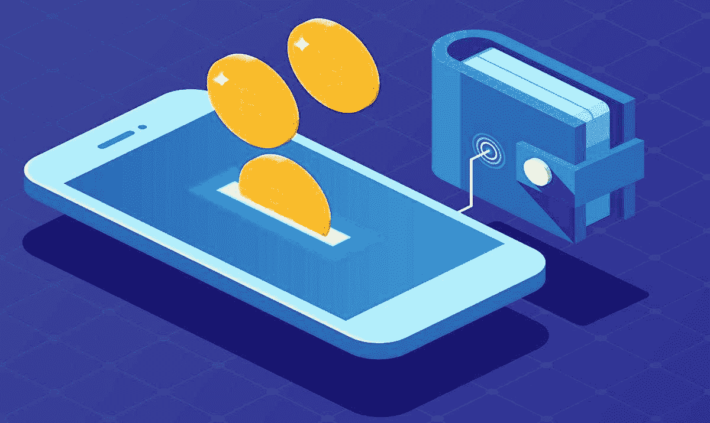
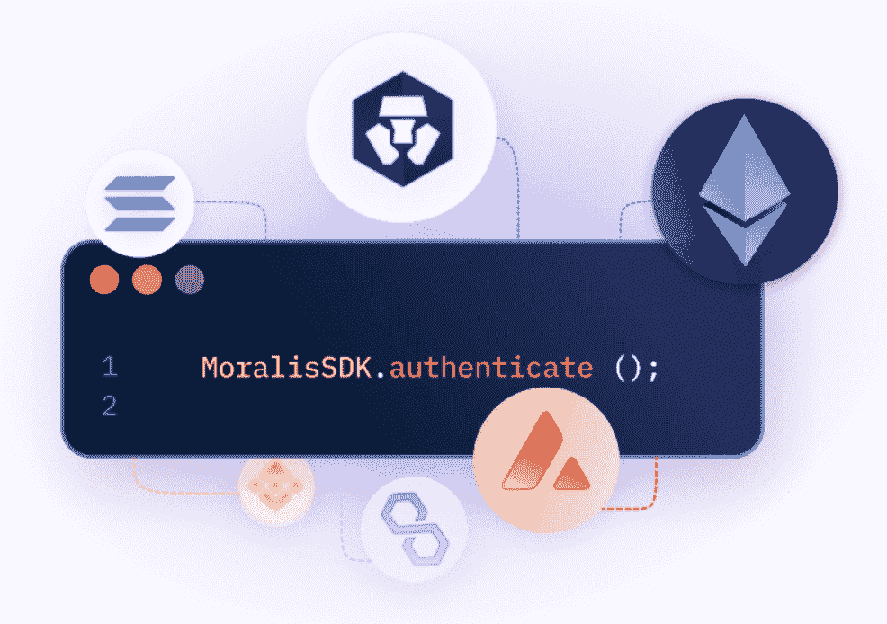
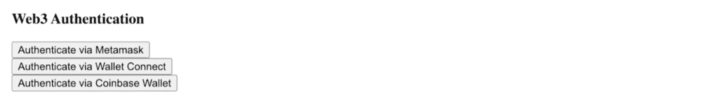
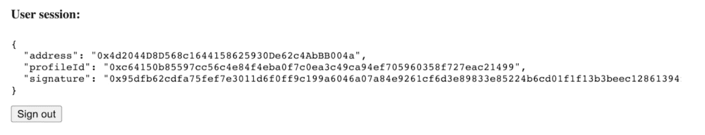
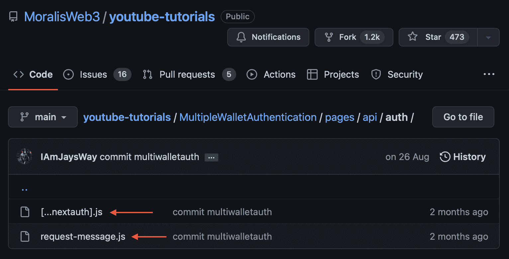
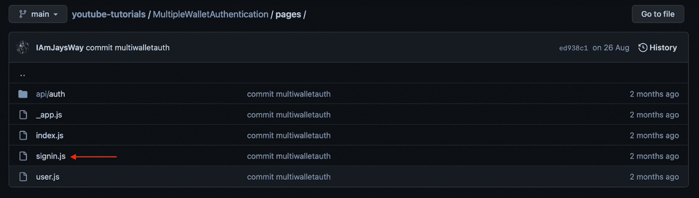

# 使用最佳加密钱包 API 的加密钱包集成

> 原文：<https://moralis.io/crypto-wallet-integration-using-the-best-crypto-wallet-api/>

本指南涵盖了加密钱包集成的复杂性，并演示了[Moralis](https://moralis.io)web 3 Auth API。为了展示最佳加密钱包 API 的强大功能，您将学习如何创建一个简单的 web 应用程序来实现三种身份验证方法:MetaMask、WalletConnect 和比特币基地钱包。如果你想直接进入本教程的中心部分，可以直接进入“*如何添加加密钱包集成*”部分！您也可以在下面的 GitHub 资源库中直接访问代码:

**全加密钱包集成文档—**[**https://github . com/moralisweb 3/YouTube-tutorials/tree/main/MultipleWalletAuthentication**](https://github.com/MoralisWeb3/youtube-tutorials/tree/main/MultipleWalletAuthentication)

**Web3 身份验证对 Web3 开发至关重要，它允许用户使用他们的加密钱包进行身份验证，并提供统一的 Web3 身份层。这为整个 Web3 生态系统提供了更无缝的用户体验，并降低了入门摩擦，突出了对可访问的加密钱包集成的需求。因此，对于区块链开发来说，这是一项如此重要的任务，本文将深入研究加密钱包集成，并探索最佳的加密钱包 API！**

**一旦您熟悉了 crypto wallet 集成及其需要的内容，我们将向您展示如何创建一个简单的 web 应用程序，允许用户使用三种不同的身份验证方法登录。此外，由于 Moralis 的 Auth API，您可以在几分钟内创建这个应用程序！然而，这只是 Moralis 的[Web3 API](https://moralis.io/web3-apis-exploring-the-top-5-blockchain-apis/)中的一个，使得 web 3 开发更加容易。例如，你也应该检查一下 Moralis 的[流 API](https://moralis.io/streams/) ，允许你通过 [Web3 webhooks](https://moralis.io/web3-webhooks-the-ultimate-guide-to-blockchain-webhooks/) 将区块链数据流式传输到你的项目后端！**

**然而，如果您正在寻找一个可访问的加密钱包集成工作流程，[注册 Moralis](https://admin.moralis.io/register) 并立即获得最佳加密钱包 API！**

## **什么是加密货币钱包？**

**对于任何有兴趣探索 Web3 生态系统或从事区块链开发的人来说，第一步是获得一个加密钱包。加密钱包，也被称为“ [Web3 钱包](https://moralis.io/what-is-a-web3-wallet-web3-wallets-explained/)”，通常被认为是用于存放虚拟资产的简单数字钱包。然而，它们不仅如此，而且在访问各种 Web3 生态系统中发挥着重要作用！**

**

尽管加密货币钱包不仅仅是简单地持有虚拟资产，但它们仍然配备了简单的数字钱包所应有的一切。它们提供存储数字资产的功能，如可替换令牌和 NFT(不可替换令牌)。除了持有资产，加密钱包还充当了通往 Web3 庞大的 dapps 生态系统的门户。因此，它们打开了密码世界的大门，使你能够与 dapps、DeFi 平台等交互。，在各种区块链网络上。

加密货币钱包通常是“非托管的”，这表明作为钱包所有者的你可以在没有中间人的情况下处理资产。因此，你保持对所有虚拟资产的完全控制。然而，这种独家访问让你承担了更多的责任。因此，记录你的私人密钥并且不与任何人分享它们是至关重要的。

由于加密货币钱包是通往 Web3 生态系统的门户，它们对于该空间的统一识别层至关重要。此外，dapps 和其他 Web3 项目实现了基于加密钱包的认证方法。这意味着用户可以在多个平台上使用一个钱包登录并验证他们的 Web3 身份。这使得用户更容易尝试平台，并提供更无缝的用户体验。

此外，由于 Web3 钱包对 Web3 生态系统至关重要，因此需要简单的加密钱包集成，这就是加密钱包集成 API 的用途！

## 什么是加密钱包集成 API？

随着对加密钱包及其在 Web3 空间中的重要性有了更深刻的理解，是时候探索加密钱包集成 API 的复杂性了。然而，在我们进入细节之前，我们将回答这个问题，“什么是 API？”。

API 是“应用编程接口”的缩写，它们是促进软件系统之间通信的工具。每当你与一个应用程序或 dapp 交互时，该软件必须通过互联网向服务器传输数据。然后，在发送回响应之前，接收端必须解释数据并执行一组操作。因此，您的设备会接收响应并进行分析，然后以可读的方式呈现出来。


上述过程通常由负责传递或翻译指令以便相互理解的 API 来促进。使用 API 为开发人员在开发过程中提供了一系列可用的操作。因此，开发人员不需要从头开始构建一切，从而实现更易于访问的开发人员体验。

因此，在加密钱包集成的上下文中，API 使得开发人员可以更容易地将来自各种加密钱包提供者的认证方法添加到他们的 Web3 项目中。因此，在使用加密钱包集成 API 时，您不需要担心在设置身份验证流时构建底层基础设施！

现在，在我们仔细研究最佳加密钱包 API 之前，让我们深入下一节，看看一些最流行的加密钱包提供者！

### 加密钱包提供商

本节探讨一些最著名的加密钱包提供商。然而，由于市场上有许多替代品，我们只能涵盖其中的一部分。也就是说，这一部分主要关注元掩码、比特币基地钱包和信任钱包！

*   **meta mask**–meta mask 是最成熟的加密货币钱包之一，在全球拥有超过 3000 万可信用户。结合提供数字钱包的传统功能，例如持有、发送、交换资产等。，MetaMask 充当了通往区块链应用广泛生态系统的门户。


*   **比特币基地钱包**–比特币基地钱包是一款自我保管的多资产加密货币钱包，支持数十万个 dapps 和代币。此外，比特币基地钱包提供了你在 Web3 钱包中需要的一切，例如交易、购买和出售 NFT 和加密货币的功能。


*   **Trust Wallet**–Trust Wallet 是币安官方的非托管、多重加密钱包。该钱包支持数百万种货币，并提供出色的功能，如赌注代币、购买代币、访问 dapps 等。


现在，我们已经简要介绍了市场上最著名的加密钱包提供商的一些例子，是时候探索最好的加密钱包 API 了:Moralis 的 Auth API！

## 探索开发人员的最佳加密钱包 API

Moralis 的 [Web3 认证 API](https://moralis.io/authentication/) 是向任何 dapp 或 Web3 项目添加加密钱包集成的最简单方法。无论您是希望构建一个新的 Web3 应用程序，将您现有的 Web2 用户数据库与 Web3Auth 连接起来，还是使用认证聚合器，Moralis 的加密钱包集成 API 都能满足您的需求！



Moralis crypto wallet 集成 API 消除了一些与 Web3 身份验证相关的常见问题。这包括将用户重定向到第三方认证接口，理解 Web3 认证流程，了解钱包如何签名和验证消息，等等。因此，当与 Moralis 工作时，你可以通过避免这些多余的任务来节省大量的时间！

Moralis Web3 身份验证 API 为所有身份验证方法提供了统一的 API，以及用于轻松集成加密钱包的全面 SDK。此外，Moralis 的 Web3 Auth API 还在不断发展。因此，在一个快速发展的 Web3 行业中，Web3 Auth API 使您能够让所有身份验证流程面向未来。

随着对最佳加密钱包 API 的更好理解，让我们更仔细地看看如何使用这个令人难以置信的工具来添加加密钱包集成！

## 如何添加加密钱包集成

既然您已经对 Moralis 的 Auth API 更加熟悉，那么是时候通过向您展示如何设置加密钱包集成来使用它了。在此过程中，您将学习如何创建一个简单的 web 应用程序，允许用户使用三种加密钱包方案进行身份验证:MetaMask、WalletConnect 和比特币基地钱包。

你会在下面找到两张 dapp 的 UI(用户界面)截图来说明你正在努力的方向。第一个显示登录页面；同时，第二个图像显示了用户页面，该页面显示了包含地址、配置文件 ID 和签名的用户会话:

**登录页面:**



**用户页面:**



当使用最好的加密钱包 API 时，创建上面的 web 应用程序并设置加密钱包集成相对简单。要构建该应用程序，您可以首先访问 crypto wallet integration[GitHub repository](https://github.com/MoralisWeb3/youtube-tutorials/tree/main/MultipleWalletAuthentication)页面，然后将项目克隆到您的本地目录。然后，您可以通过在代码编辑器的终端中运行“*NPM I”*来安装必要的依赖项。

这就是设置应用程序的基本内容。现在，通过在终端中运行“ *npm run dev* ，您应该能够在“*本地主机 3000* 上启动应用程序。

但是，您可能仍然对 Auth API 的实际工作方式有疑问。如果是这样，下面几节将更深入地探讨应用程序的代码。如果您遵循，您可以应用相同的原则将 crypto wallet 集成到所有未来的项目中！

不幸的是，由于该项目的代码相对广泛，我们只能涵盖其中的一部分。因此，以下各节将重点介绍添加加密钱包集成的基本功能。

### 后端代码演练

首先，我们将从覆盖 web 应用程序的后端代码开始。“api/auth”文件夹包含后端代码，它由两个文件组成:“[…nextauth]。js”和“request-message.js”:



本节从“request-message.js”开始，分别剖析每个文件，以提供后端功能的详细概述。此外，该文件包含请求消息的端点，这是它的全部代码:

```js
import Moralis from 'moralis';

const config = {
    domain: process.env.APP_DOMAIN,
    statement: 'Web Login.',
    uri: process.env.NEXTAUTH_URL,
    timeout: 60,
};

export default async function handler(req, res) {
    const { address, chain, network } = req.body;

    await Moralis.start({ apiKey: process.env.MORALIS_API_KEY });

    try {
        const message = await Moralis.Auth.requestMessage({
            address,
            chain,
            network,
            ...config,
        });

        res.status(200).json(message);
    } catch (error) {
        res.status(400).json({ error });
        console.error(error);
    }
}
```

上面的代码触发了 Moralis 的" *Moralis。Auth.requestMessage()* "函数，带有用户的地址和链 ID。该代码还创建了一个发送到客户端的新消息。一旦用户在消息上签名，就会发送一个 post 请求，将我们带到“[…nextauth]。js "代码:

```js
import CredentialsProvider from 'next-auth/providers/credentials';
import NextAuth from 'next-auth';
import Moralis from 'moralis';

export default NextAuth({
    providers: [
        CredentialsProvider({
            name: 'MoralisAuth',
            credentials: {
                message: {
                    label: 'Message',
                    type: 'text',
                    placeholder: '0x0',
                },
                signature: {
                    label: 'Signature',
                    type: 'text',
                    placeholder: '0x0',
                },
            },
              async authorize(credentials) {
                try {
                  // "message" and "signature" are needed for authorization
                  // we described them in "credentials" above
                  const { message, signature } = credentials;

                  await Moralis.start({ apiKey: process.env.MORALIS_API_KEY });

                  const { address, profileId } = (
                    await Moralis.Auth.verify({ message, signature, network: 'evm' })
                  ).raw;

                  const user = { address, profileId, signature };
                  // returning the user object and creating  a session
                  return user;
                } catch (e) {
                  console.error(e);
                  return null;
                }
              },
        }),
    ],
    // adding user info to the user session object
    callbacks: {
        async jwt({ token, user }) {
            user && (token.user = user);
            return token;
        },
        async session({ session, token }) {
            session.user = token.user;
            return session;
        },
    },
});
```

正如该文件的代码所示，它向" *Moralis 发送另一个请求。Auth.verify()* "函数与来自初始请求的响应。这是一个消息和在客户端唱消息的签名。

接下来，代码使用带有用户地址、配置文件 ID 和签名的“ *next.auth* 生成一个新的“*用户*”对象。然后，我们将新用户存储在 JWT (JSON web token)的 web 会话中。

这涵盖了后端代码的基本部分。因此，让我们继续前进到前端！

### 前端代码演练

app 的前端由“_app.js”、“index.js”等几个设置文件组成。但是，对于本教程，我们将把注意力放在“signin.js”文件上，因为在这里您可以找到大多数身份验证方法的逻辑:



最初，该文件包含一些导入。在这种情况下，我们对用于引入使用 wagmi 的各种身份验证方法的连接器特别感兴趣。这基本上就是您用于客户端 Web3 连接的内容:

```js
import { signIn } from "next-auth/react";
import { useAccount, useConnect, useSignMessage, useDisconnect } from "wagmi";
import { useRouter } from "next/router";
import { MetaMaskConnector } from "wagmi/connectors/metaMask";
import { CoinbaseWalletConnector } from "wagmi/connectors/coinbaseWallet";
import { WalletConnectConnector } from "wagmi/connectors/walletConnect";
import axios from "axios";
```

#### “handleAuth(wal)”函数

在必要的导入之后，我们将探索" *handleAuth(wal)* "函数。该功能负责连接不同的钱包连接器。函数将“ *wal* ”参数作为参数，指定要使用哪个备选项。然而，在连接建立之前，代码创建了一个“*用户数据*”对象来存储关于用户的信息。下面是函数的初始部分:

```js
 const handleAuth = async (wal) => {
    if (isConnected) {
      await disconnectAsync();
    }

    console.log("Connect To Site Via Wallet");

    const userData = { network: "evm" };
```

接下来，该函数包含三个“ *if* ”语句，用于本教程中使用的三个备选项:

```js
 if (wal === "meta") {
      const { account, chain } = await connectAsync({
        connector: new MetaMaskConnector({}),
      });
      userData.address = account;
      userData.chain = chain.id;
    }

    if (wal === "coin") {
      const { account, chain } = await connectAsync({
        connector: new CoinbaseWalletConnector({}),
      });
      userData.address = account;
      userData.chain = chain.id;
    }

    if (wal === "wal") {
      const { account, chain } = await connectAsync({
        connector: new WalletConnectConnector({ options: { qrcode: true } }),
      });
      userData.address = account;
      userData.chain = chain.id;
    }
```

让我们分解第一个陈述作为例子。第一个" *if (wal === "meta")* "语句指定将使用" *MetaMaskConnector* "作为身份验证方法。一旦用户通过身份验证，代码就可以访问用户的钱包地址和链 ID，它们被添加到“*用户数据*对象中。

该信息用于向 Moralis 的 Auth API 发送 post 请求:

```js
console.log("Sending Connected Account and Chain ID to Moralis Auth API");

    const { data } = await axios.post("/api/auth/request-message", userData, {
      headers: {
        "Content-Type": "application/json",
      },
    });
```

有了消息后，代码再次使用 wagmi 对消息进行签名，向 Moralis 发送最终的 post 请求进行验证，并创建用户 JWT，该用户将被推送到用户页面:

```js
console.log("Received Signature Request From Moralis Auth API");

    const message = data.message;

    const signature = await signMessageAsync({ message });

    console.log("Succesful Sign In, Redirecting to User Page");

    const { url } = await signIn("credentials", {
      message,
      signature,
      redirect: false,
      callbackUrl: "/user",
    });

    push(url);
```

最后，代码还包括三个按钮，连接到不同的选项。每个按钮运行“ *handleAuth(wal)* 函数，不同的参数对应于之前指定的“ *if* 语句:

```js
<div>
      <h3>Web3 Authentication</h3>
      <button onClick={() => handleAuth("meta")}>
        Authenticate via Metamask
      </button>
      <br />
      <button onClick={() => handleAuth("coin")}>
        Authenticate via Coinbase
      </button>
      <br/>
      <button onClick={() => handleAuth("wal")}>
        Authenticate via Wallet Connect
      </button>
    </div>
```

最终，“signin.js”文件看起来是这样的:

```js
import { signIn } from "next-auth/react";
import { useAccount, useConnect, useSignMessage, useDisconnect } from "wagmi";
import { useRouter } from "next/router";
import { MetaMaskConnector } from "wagmi/connectors/metaMask";
import { CoinbaseWalletConnector } from "wagmi/connectors/coinbaseWallet";
import { WalletConnectConnector } from "wagmi/connectors/walletConnect";
import axios from "axios";

function SignIn() {
  const { connectAsync } = useConnect();
  const { disconnectAsync } = useDisconnect();
  const { isConnected } = useAccount();
  const { signMessageAsync } = useSignMessage();
  const { push } = useRouter();

  const handleAuth = async (wal) => {
    if (isConnected) {
      await disconnectAsync();
    }

    console.log("Connect To Site Via Wallet");

    const userData = { network: "evm" };

    if (wal === "meta") {
      const { account, chain } = await connectAsync({
        connector: new MetaMaskConnector({}),
      });
      userData.address = account;
      userData.chain = chain.id;
    }

    if (wal === "coin") {
      const { account, chain } = await connectAsync({
        connector: new CoinbaseWalletConnector({}),
      });
      userData.address = account;
      userData.chain = chain.id;
    }

    if (wal === "wal") {
      const { account, chain } = await connectAsync({
        connector: new WalletConnectConnector({ options: { qrcode: true } }),
      });
      userData.address = account;
      userData.chain = chain.id;
    }

    console.log("Sending Connected Account and Chain ID to Moralis Auth API");

    const { data } = await axios.post("/api/auth/request-message", userData, {
      headers: {
        "	": "application/json",
      },
    });

    console.log("Received Signature Request From Moralis Auth API");

    const message = data.message;

    const signature = await signMessageAsync({ message });

    console.log("Succesful Sign In, Redirecting to User Page");

    const { url } = await signIn("credentials", {
      message,
      signature,
      redirect: false,
      callbackUrl: "/user",
    });

    push(url);
  };

  return (
    <div>
      <h3>Web3 Authentication</h3>
      <button onClick={() => handleAuth("meta")}>
        Authenticate via Metamask
      </button>
      <br />
      <button onClick={() => handleAuth("coin")}>
        Authenticate via Coinbase
      </button>
      <br/>
      <button onClick={() => handleAuth("wal")}>
        Authenticate via Wallet Connect
      </button>
    </div>
  );
}

export default SignIn;
```

这就是使用最佳加密钱包 API 的"*加密钱包集成"教程！如果你对代码有任何进一步的问题，或者想要更详细的添加加密钱包集成的过程，请查看下面的[Moralis YouTube](https://www.youtube.com/c/MoralisWeb3) 视频！*

[https://www.youtube.com/embed/BmxD9KTHEGI?start=471&feature=oembed](https://www.youtube.com/embed/BmxD9KTHEGI?start=471&feature=oembed)

## 加密钱包集成–摘要

Web3 身份验证对于区块链开发至关重要，它允许用户使用来自各种加密钱包提供商的 Web3 钱包进行登录和身份验证。因此，Web3 开发人员需要简单的加密钱包集成，以使他们的区块链开发工作更容易实现，这就是 API 进入等式的地方。

加密钱包集成 API 允许开发人员快速实现来自各种加密钱包提供商的认证方法。本文通过向您展示如何创建一个用户可以使用 MetaMask、WalletConnect 或比特币基地钱包登录的应用程序，展示了 Moralis 的 Web3 Auth API(最好的加密钱包 API)的强大功能。此外，由于 Moralis 的能力，您可以在创纪录的时间内创建这个应用程序！

如果您觉得本教程很有帮助，并想了解 Moralis 为您带来的更多精彩内容，请关注 Moralis 的 [Web3 博客](https://moralis.io/blog/)，它展示了独特的 Web3 开发内容。例如，查看我们关于 [Dogechain](https://moralis.io/build-with-dogecoin-on-evm-what-is-dogechain/) 的文章或者学习如何[上传文件到 IPFS](https://moralis.io/how-to-upload-files-to-ipfs-full-guide/) ！

此外，如果你想成为一名更熟练的 Web3 开发者，可以考虑去看看 Moralis 学院。该学院为新的和更有经验的开发人员提供业界领先的区块链课程。例如，报名参加“[区块链&比特币 101](https://academy.moralis.io/courses/blockchain-bitcoin-101) ”课程，开始你的 Web3 开发者之旅。

然而，你是否希望进入 Web3 开发，并希望利用区块链技术的力量？如果是这样，[立即与 Moralis](https://admin.moralis.io/register) 签约，使用企业级开发工具来增强您的 Web3 项目！**