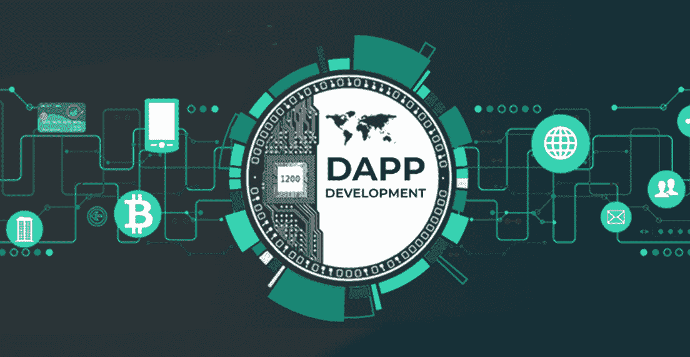
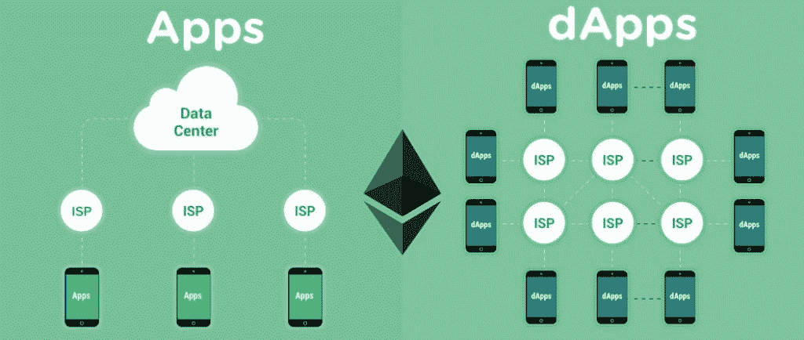
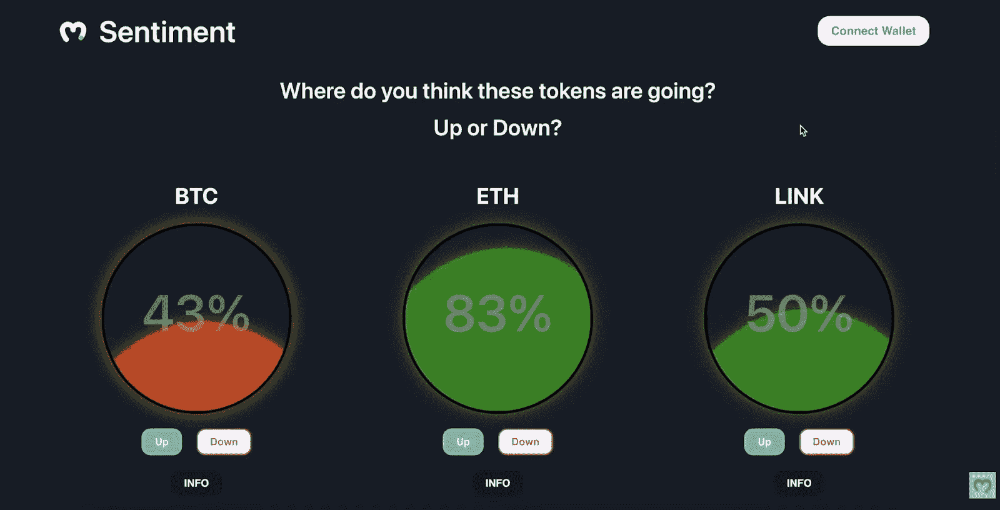
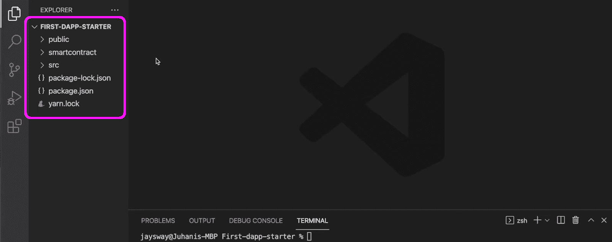
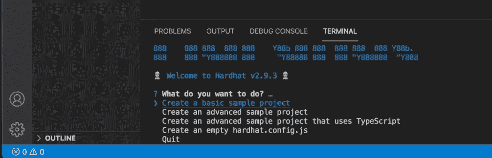
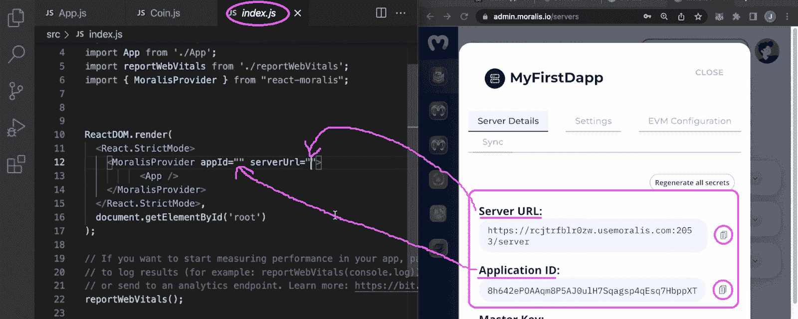
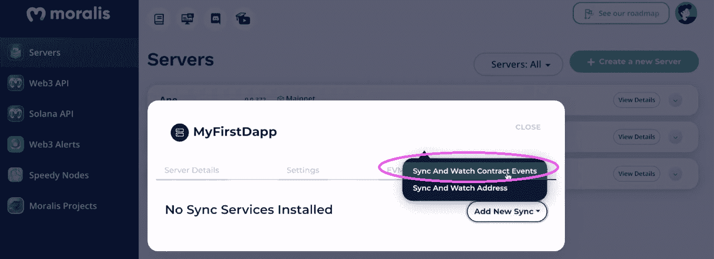
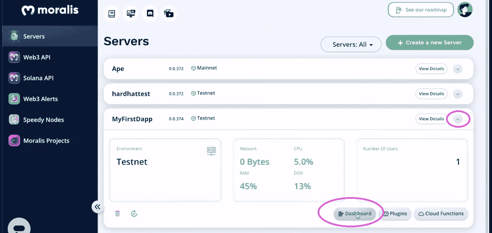

# Dapp 开发教程——构建 Dapp 的完整指南

> 原文：<https://moralis.io/dapp-development-tutorial-full-guide-to-building-a-dapp/>

**第一个可编程区块链的诞生，******，标志着** [**Web3**](https://moralis.io/the-ultimate-guide-to-web3-what-is-web3/) **的真正开始。因此，Web2 程序员开始将他们的编程努力转向区块链和 dapp 开发。由于我们还处于 Web3 时代的相对早期，并且正徘徊在** [**Web2 和 Web3**](https://moralis.io/what-is-web2-and-web3-explaining-web3/) **时代之间，现在是学习 dapp 开发的绝佳时机。此外，这个 dapp 开发教程是一个很好的起点！本指南将带你经历构建 dapp 的必要阶段，包括使用******【智能合约】——分散应用的主干。此外，即将发布的 dapp 开发教程将展示如何利用你现有的**[**JavaScript**](https://moralis.io/javascript-explained-what-is-javascript/)**(JS)技能** [**成为一名 Web3 开发者！**](https://moralis.io/how-to-become-a-web3-developer-full-guide/)****

****由于最终的 Web3 后端平台–[Moralis 规范](https://moralis.io/)，后者成为可能。这个“ [Firebase for crypto](https://moralis.io/firebase-for-crypto-the-best-blockchain-firebase-alternative/) ”操作系统为您提供了最轻松地创建 dapps 的工具。因此，您不需要处理 RPC 节点的[限制。此外，当前](https://moralis.io/exploring-the-limitations-of-rpc-nodes-and-the-solution-to-them/) [Web3 技术栈](https://moralis.io/exploring-the-web3-tech-stack-full-guide/)的这一巅峰为构建高性能 dapps 提供了单一的工作流程。此外，您可以毫不费力地使用[索引区块链](https://moralis.io/how-to-index-the-blockchain-the-ultimate-guide/)、[存储链外数据](https://moralis.io/how-to-store-off-chain-data-unity-web3-database/)，以及管理[链上库存](https://moralis.io/create-an-nft-on-chain-inventory-system-for-gaming/)。此外，Moralis 完全是关于跨平台和跨链的互操作性。因此，你可以使用你喜欢的平台，而不局限于任何特定的链。尽管如此，由于我们在本文中处理 dapp 开发教程时将使用 Moralis，请确保在继续之前[创建您的免费 Moralis 帐户](https://admin.moralis.io/register)。****

****

## 什么是 Dapps？

在我们继续下一步之前，让我们确保你们都知道基础知识。那么，[什么是 dapps](https://moralis.io/decentralized-applications-explained-what-are-dapps/) ？仅仅是分解“dapp”这个词就已经让你有了更深刻的理解。“d”代表“去中心化”，“app”代表“应用”。此外，就像常规应用程序一样，分散式应用程序也可以有多种形式。Dapps 可以是 Web3 网站、Web3 移动应用、Web3 游戏等。最终，如果一个应用程序以任何方式与任何特定的区块链交互，它就会被标记为 dapp。

说到分散式应用，它们都整合了 [Web3 认证](https://moralis.io/web3-authentication-the-full-guide/)。一个 [Web3 钱包](https://moralis.io/what-is-a-web3-wallet-web3-wallets-explained/)比如[元掩码](https://moralis.io/metamask-explained-what-is-metamask/)使 dapps 能够执行 [Web3 登录](https://moralis.io/how-to-build-a-web3-login-in-5-steps/)并认证用户。然而，我们必须指出，大多数互联网用户目前使用更熟悉的方法，Web2 登录。因此，包含熟悉的网关通常是有意义的(取决于您的受众)。幸运的是，您可以使用正确的工具创建包含通过电子邮件进行 [Web3 身份验证的 dapps。当然，你可以通过实现](https://moralis.io/how-to-do-web3-authentication-via-email/) [Web3 社交登录](https://moralis.io/web3-social-login-sign-in-dapp-users-with-google-email-or-twitter/)来进一步[促进 Web3 用户的加入](https://moralis.io/how-to-boost-web3-user-onboarding-success-rates/)。尽管如此，大多数 dapp[仍然使用元掩码](https://moralis.io/how-to-authenticate-with-metamask/)进行认证。

## Dapp 开发教程–演示

从结尾开始可能违反直觉。但是，我们重视您的时间；因此，我们希望确保您知道从这个 dapp 开发教程中可以期待什么。此外，它还会帮助你决定是否要卷起袖子继续前进。

这就是我们的 dapp 前端示例的要点:

看上面的截图，你可以看到你将有机会[建立一个秘密情感 dapp](https://moralis.io/how-to-create-a-crypto-sentiment-dapp/) 。后者拥有简洁的设计和直观的用户界面。此外，每个气泡内的“液体”实际上是动画。*为了说明后者，你可能想看看文章结尾的视频，从 0:19 开始。*除了上述硬币(BTC、瑞士法郎和林克)，当用户向下滚动页面时，我们的 dapp 还会显示其他几种领先的硬币:

***注:*** *我们设计了我们的智能合约，使其所有者能够轻松添加其他报价机。你会在下面的 dapp 开发教程中看到。*

如你所见，气泡内有百分比值。它们表明了选民的意见。例如，当超过 50%的投票者认为一枚硬币的价格会上涨时，“液体”就会变成绿色。另一方面，当大多数选民认为价格会下降时,“液体”会变红。此外，我们的示例 dapp 有四种类型的按钮。这些是每个滚动条的“向上”、“向下”和“信息”按钮，以及右上角的“连接钱包”按钮。多亏了 Moralis 和 [web3uikit](https://moralis.io/web3ui-kit-the-ultimate-web3-user-interface-kit/) ，后者负责认证用户。至于“信息”按钮，它们在一个新的弹出窗口中打开“关于”信息和当前价格:

### Web3 登录和投票演示

如“什么是 Dapps？”部分，用户需要执行 Web3 身份验证才能使用 dapp。因此，如果用户在注销时试图投票，他们将收到一条警告消息:

因此，用户需要使用“连接钱包”按钮来验证自己:

如上图所示，示例用户选择元掩码，提示他的元掩码扩展。因此，用户需要签署签名请求才能继续:

登录后，用户可以使用“向上”和“向下”按钮投票。如果示例用户决定投票支持 LINK 的价格下降，他单击 LINK 下的“down”。此外，你应该记住，我们的 dapp 包括链上投票。因此，用户需要确认他的投票:

在用户确认了与其投票相关的链上交易后，硬币的情绪发生变化；当然，改变的意义取决于总票数。尽管如此，我们在 dapp 背后的智能合约也阻止了用户对每个股票进行多次投票。因此，示例用户不能再次为 LINK 投票:

这就是我们的示例 Web3 应用程序的 UI 演示。不过，让我们确认一下，上面演示的交易确实被记录到了孟买区块链(Polygon 的 testnet)。为此，我们使用多边形扫描(testnet)。

看上面的截图，你可以看到我们的智能合约的事件。市值是与林克的反对票相关的那一个。

## Dapp 开发教程——使用安全帽、反应和 Moralis

我们希望你渴望构建你自己的上面演示的 dapp 版本。正如您所看到的，这是一个功能齐全的应用程序，它有几个活动的部分。因此，这不是最基本的 dapp 开发教程。然而，这是了解分散式应用程序所有最常见特性的最佳方式之一。因此，如果你决定卷起袖子，你将学会如何:

*   使用 [Hardhat](https://moralis.io/hardhat-explained-what-is-hardhat/) 创建、编译和部署智能合同。
*   使用 [React](https://moralis.io/react-explained-what-is-react/) 和 web3uikit 创建一个整洁的 Web3 前端。
*   使用 [Moralis SDK](https://moralis.io/exploring-moralis-sdk-the-ultimate-web3-sdk/) 来[同步和索引智能合约事件](https://moralis.io/sync-and-index-smart-contract-events-full-guide/)。

*注* *:即将发布的 dapp 开发教程基于本文底部的视频。因此，对于更多的细节，请确保将它与时间戳结合使用，您将看到向前发展。以下章节和视频教程假设您将使用我们的* [*启动代码*](https://github.com/MoralisWeb3/youtube-tutorials/tree/main/FirstDapp-Starter) *。当然，这并不意味着你不能使用我们的* [*最终码*](https://github.com/MoralisWeb3/youtube-tutorials/tree/main/FirsrDapp-Final) *来快进你的进度。*

## 我们的 Dapp 开发教程的初始设置

首先，克隆我们的起始代码，并在您最喜欢的代码编辑器中打开项目。*我们正在使用 Visual Studio 代码(VSC):*

上面的屏幕截图标记了我们的示例项目的初始布局。此外，由于我们将使用 Hardhat 来处理我们的智能合同，您还需要完成一些与开发环境相关的设置。从 4:16 开始使用下面的视频。使用*CD smartcontract*命令导航至“smart contract”文件夹。然后，输入“ *npm i -D 安全帽”*安装安全帽:

接下来，使用“ *npx hardhat* ”命令启动一个新的 hardhat 项目。然后，选择“创建一个基本的示例项目”,并在阅读终端询问您的内容时按几次“enter ”:

成功创建新的 Hardhat 项目后，您可以在“smartcontract”文件夹中看到一些新元素:

最后，您需要安装另外两个依赖项。使用以下命令:

*   " *npm i -D dotenv*
*   "*NPM I-D @ nomic labs/hard hat-ethers can*"

## 使用 Hardhat 创建、编译和部署智能合同

使用下面的视频，从 5:35 开始，你将学习如何创建一个合适的智能合同。您将使用一个现有的模板文件(“Greeter.sol”)，将其重命名，并删除其内容。如果您想自己编写合同，请使用下面的视频教程来获得详细的代码演练。然而，你经常可以通过复制已经验证过的智能合同来创建杀手级的 dapps。这种 [Web3 合同](https://moralis.io/what-are-web3-contracts-exploring-smart-contracts/)的绝佳去处是 [OpenZeppelin](https://moralis.io/what-is-openzeppelin-the-ultimate-guide/) 。因此，你也可以复制我们在 GitHub 上提供的整个代码(“[市场情绪. sol](https://github.com/MoralisWeb3/youtube-tutorials/blob/main/FirsrDapp-Final/src/smartcontract/MarketSentiment.sol) ”)。

*注意* *:如果您熟悉* [*Remix*](https://moralis.io/remix-explained-what-is-remix/) *，也可以使用该 IDE 编译部署上述智能合约。*

准备好 [Solidity](https://moralis.io/solidity-explained-what-is-solidity/) 代码后，您需要使用 Hardhat 来编译和部署智能合约。您可以使用 Moralis 支持的任何网络；然而，我们建议你跟随我们的领导，专注于孟买(多边形的测试网)。要成功做到这一点，您需要调整“sample-script.js”文件。基本上，您需要更新它以匹配您的新名称”。sol”文件(16:58)。从 18:05 开始，您将开始调整“hardhar.config.js”文件。在那里，你还将学会创造你的”。env”文件，它将包含三条重要的信息:

*   PolygonScan 验证您的智能合约的 API 密钥(19:08)
*   孟买测试网的终点(19:54)
*   您的加密钱包的私钥(20:40)

### 环境变量

要获得 PolygonScan 的 API 密钥，您必须创建免费的 PolygonScan 帐户。此外，要获得 Mumbai testnet 的端点，您可以使用 [Moralis Speedy Nodes](https://moralis.io/speedy-nodes/) (假设您已经创建了您的免费 Moralis 帐户):

点击“端点”按钮后，您将看到这个弹出屏幕，在这里您可以复制 URL:

至于您的钱包的私钥，您可以使用元掩码将其导出:

此时，您应该已经准备好了上面列出的所有三个环境变量的值:

然后，您将返回到“hardhat.config.js”进行一些最后的调整(21:10):

最后，从 22:38 开始，下面的视频 dapp 开发教程将向您展示如何部署和验证您的合同。一旦您的合同在孟买上线，您可以使用 PolygonScan (23:38)与之交互:

## Dapp 开发教程-前端

有了 smart contract live，您就有了 dapp 运行的引擎。因此，是时候创建一个合适的前端来让用户与您的智能合约进行交互了。以下是主要阶段，下面的视频将带您了解这些阶段:

*   初始化 React 应用程序(29:01)
*   创建您的单页 dapp 页眉(30:03)
*   添加硬币组件(32:26)
*   实施投票按钮(38:23)

有了前端，您就可以开始运行应用程序了。为此，您需要[创建一个 Moralis 服务器](https://docs.moralis.io/moralis-dapp/getting-started/create-a-moralis-dapp) (40:12)并将服务器的详细信息复制到“index.js”文件中:

然后，从 41:26 开始，你将负责信息模型。尽管如此，您将使用强大的 [Moralis Web3 API](https://docs.moralis.io/moralis-dapp/web3-api) 来确保“info”模态包括令牌价格(47:27)。

## Dapp 开发教程–后端

随着您的智能合同的启动和运行，您的前端准备就绪，您的 Moralis 服务器开始运行，是时候完成最后一块拼图了。因此，您需要将 React 应用程序连接到智能合约(50:30)。这一部分将帮助您将 React 应用程序转变为 dapp。幸运的是，由于 Moralis 的“同步”功能和仪表盘，你可以不费吹灰之力地做到这一点。

从 50:45 开始，本 dapp 开发教程将向您展示如何创建新的同步事件:

成功创建新同步后，Moralis 仪表板将自动进行索引。此外，您可以在 dapp 中轻松使用与智能合约事件相关的所有细节。因此，您的前端可以反映实时的链上数据，这是百分比情感分数的基础。

一旦您的 Moralis 服务器启动并运行，您就可以访问您的 Moralis 仪表板:

如果您在“sync”设置中对“TableName”使用了相同的名称，那么现在您的 Moralis 仪表板中就有了“Votes”类:

https://www.youtube.com/watch?v=MI_Se26Sfmo

## Dapp 开发教程–构建 Dapp 的完整指南–摘要

我们必须承认，这个 dapp 开发教程相当广泛。然而，它仍然让你在不到 70 分钟内完成所有步骤。它涵盖了 dapp 开发的所有关键部分——智能联系、前端和后端。这样，您现在对 Web3 应用程序开发背后的过程有了全面的了解。如果您喜欢本教程，我们建议您查看我们的“克隆”dapp 开发教程:

*   [Web3 推特克隆](https://moralis.io/how-to-build-a-web3-twitter-clone/)
*   [Uniswap DEX 克隆](https://moralis.io/build-a-uniswap-dex-clone-with-html-css-javascript-moralis-on-the-ethereum-network/)
*   [Web3 网飞克隆](https://moralis.io/how-to-develop-a-web3-netflix-clone/)
*   [Web3 Spotify 克隆版](https://moralis.io/how-to-build-a-web3-spotify-clone/)
*   [比特币基地克隆](https://moralis.io/cloning-coinbase-wallet-how-to-create-a-coinbase-clone/)
*   [网站 3 的 Reddit 克隆](https://moralis.io/create-a-reddit-clone-for-web3-step-by-step-guide/)
*   [OpenSea 克隆](https://moralis.io/create-an-opensea-clone-build-an-nft-marketplace-like-opensea/)

另一方面，您可能希望从更简单的示例项目开始。也许，你现在想避免处理智能合同。如果是这样的话，你应该使用终极的 [Web3 样板](https://moralis.io/web3-boilerplate-beginners-guide-to-web3/)在几分钟内创建你自己的 dapp。或者，使用我们的[以太坊移动样板](https://moralis.io/ethereum-mobile-boilerplate-full-guide-to-ethereum-for-mobile/)创建一个[移动以太坊 dapp](https://moralis.io/create-mobile-ethereum-dapp-with-react-native-template/) 。此外，你可以在 [Moralis YouTube 频道](https://www.youtube.com/c/MoralisWeb3)和 [Moralis 博客](https://moralis.io/blog/)上找到许多其他简单的 dapp 开发教程。一些最新的文章集中在 [blockend 开发](https://moralis.io/blockend-development-what-is-it-and-how-to-become-a-blockend-developer/)，如何[用幻影钱包](https://moralis.io/how-to-authenticate-solana-users-with-the-phantom-wallet/)认证 Solana 用户，如何创建 NFT [链上库存系统](https://moralis.io/create-an-nft-on-chain-inventory-system-for-gaming/)， [SPL vs ERC20 令牌](https://moralis.io/spl-vs-erc20-tokens-comparing-solana-and-ethereum-tokens/)，构建 [DAO](https://moralis.io/how-to-build-a-decentralized-autonomous-organization-dao/) ，以及如何[将游戏资产铸造为 NFTs](https://moralis.io/how-to-mint-game-assets-as-nfts/) 。此外，成为区块链开发者最简单的方法就是去 Moralis 学院。****