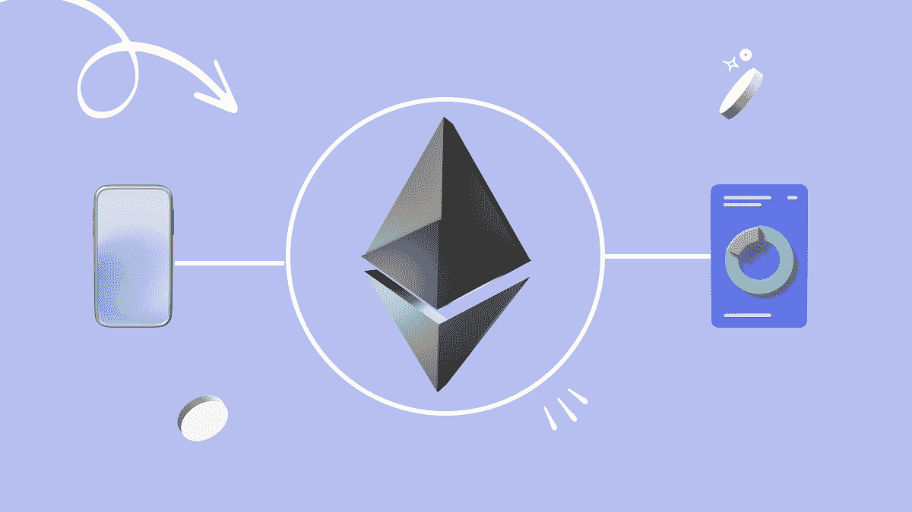
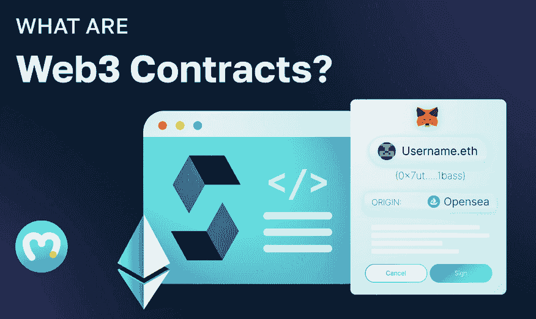
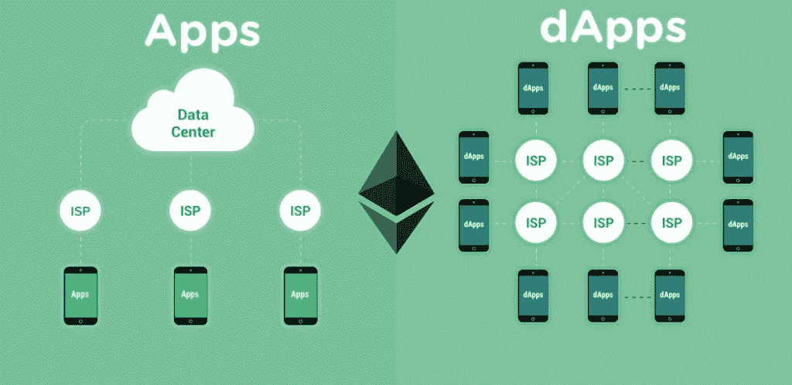
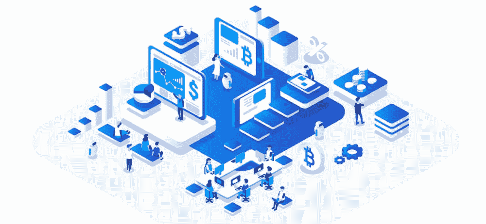

# 解释分散式应用——什么是 dApps？

> 原文：<https://moralis.io/decentralized-applications-explained-what-are-dapps/>

分散式应用程序是互联网下一阶段的重要组成部分——web 3。然而，许多人仍然不熟悉 dapps 是什么，就像他们在 iPhone 推出之前不熟悉“应用程序”一样。因此，我们将把这篇文章致力于探索 dapp 的来龙去脉，并回答这个问题:“什么是 dapp？”。

结合对错综复杂的 Web3 应用程序的深入研究，我们将更仔细地研究智能合同。此外，为了充分理解 dapps 的价值，我们将比较这种新一代应用程序和更传统的 Web2 应用程序。接下来，文章探讨了 dapps 的主要好处和一些突出的发展区块链。最重要的是，我们将探索构建 dapps 最简单的方法: [Moralis](https://moralis.io/) ！所以，如果你想知道这个问题的答案，“dapps 是什么？”，请继续阅读，我们将探索 Web3 应用的复杂性。

如果您已经熟悉了 dapps，并且想要立即开始创建 Web3 项目，您可能会发现查看 Moralis 很有帮助。除此之外，Moralis 还提供企业级[web 3 API](https://moralis.io/web3-apis-exploring-the-top-5-blockchain-apis/)，提供了更易访问的开发人员体验。因此，您可以轻松地将各种类型的[链上数据](https://moralis.io/on-chain-data-the-ultimate-guide-to-understanding-and-accessing-on-chain-data/)集成到任何项目中。更重要的是，使用 Moralis，你可以[只用三个步骤就能创建一个 Web3 dapp](https://moralis.io/how-to-create-a-web3-dapp-in-3-steps/) ！这种可能性部分归功于 Moralis 的各种工具，比如终极的 [Web3 网站模板](https://moralis.io/web3-template-build-a-dapp-using-a-web3-website-template/)！

所以，如果你想进入 dapp 开发，立即注册 Moralis。Moralis 将使你所有的 Web3 开发工作更加无缝，创建一个帐户是免费的！

## 什么是 Dapps？

让我们从基础开始，回答这个问题，“什么是 dapps？”。Dapps，或“分散式应用程序”，与你可能更熟悉的传统应用程序并没有什么不同。此外，dapps 提供了与传统应用相同的功能，有时，用户无法分辨其中的区别。然而，最明显的区别是 dapps 配备了 Web3 和区块链功能。

这种高级区块链功能源自开发人员用来构建 dapps 的对等(P2P)区块链网络。此外，Web2 和 Web3 开发之间还有其他相似之处，开发人员使用一些相同的编程语言来构建与传统应用程序相同的 dapps。然而，由于 dapp 是以区块链为基地的，dapp 的一个普遍特点是权力下放。

权力下放将 dapps 置于拥有中央权力的单一实体的范围和控制之外。此外，dapp 的代码通常是开源的、可共享的和可堆叠的，这极大地有助于开发人员构建他们的第一个 dapp。此外，区块链网络的分散性和开放性确保了透明度，因为交易数据可通过区块链探索者公开获得。这为 dapps 的内部经济提供了高度的开放性和安全性。

此外，我们需要提到的 Web3 开发行业的另一个重要组成部分是智能合同。Web3 应用程序利用智能合约在这些 P2P 区块链网络上协调交易。然而，作为该行业如此重要的组成部分，我们将在接下来的章节中进一步探索智能合约的复杂性，以全面回答“什么是 dapps？”。

### 什么是智能合约？

智能合约，也称为 [Web3 合约](https://moralis.io/what-are-web3-contracts-exploring-smart-contracts/)，本质上是存储在区块链网络上的程序，当满足预定义的条件时，这些程序会执行预定义的操作。智能合同通常用于自动执行协议，以便参与者确定结果。更重要的是，由于代码调解这些协议，参与者不需要担心中介的参与或时间损失。

为了让智能合约更容易理解，我们将使用以太坊作为例子，因为这是区块链最流行的开发。以太坊智能合约是用编程语言 Solidity 编写的。这些合同是在以太坊区块链运行的程序。

此外，以太坊上的智能合约由两部分组成:代码(合约的功能)和数据(合约的状态)的集合。这两个组件组成一个契约，驻留在特定的以太坊地址上。此外，以太坊智能合约是一种以太坊账户。因此，他们可能会有一个平衡，并可以进行交易。然而，与其他以太坊账户不同，智能合约不受用户控制，而是按照编程运行。因此，用户可以通过提交资金与智能合同进行交互，反过来，合同执行代码中定义的功能。

智能合约的一个很好的比喻是自动售货机。有了智能合约，你就能保证得到正确输入的特定输出，就像自动售货机一样。如果你投入适量的资金，选择一种零食，你就会收到想要的输出。与自动售货机类似，智能合约也有类似的、但往往更复杂的编程逻辑。

此外，由于智能合同存在于链上，网络确保交易完全透明。因此，这些合同有助于 Web3 生态系统的开放和透明！

### Dapps 与 Apps–有什么区别？

随着对 dapps 和智能合约的更好理解，将 dapps 与传统的 Web2 应用进行比较是有益的。那么，dapps 和 app 有什么区别呢？中央应用程序，也就是我们通常所说的“应用程序”，由特定的公司拥有。应用背后的组织通常将应用软件存储在公司控制的中央服务器上。

世界各地的人们每天都在使用手机、平板电脑和电脑与应用程序进行交互。而且，大部分公司都有自己的应用。因此，应用程序在人们与各种企业的互动中至关重要。

此外，Web2 应用程序通过将互联网引入云，在 Web 的发展中扮演了重要角色。他们对脸书(现在是 Meta)、Instagram 等知名社交媒体集团的崛起以及整个社交媒体革命至关重要。然而，由于 Web2 给 Web1 的静态状态增加了困难，Web3 应用程序或 dapps 做得更多。

正如“去中心化应用”这个名字所暗示的，新一代的应用是去中心化的。这消除了与集中化相关的一些负面影响，例如单点故障。此外，apps 和 dapps 之间最重要的区别之一是，后者的后端代码运行在 P2P 区块链网络上，而不是集中的服务器上。

Web3 应用程序的这些方面实现了中央应用程序所不具备的强大功能。这里有几个例子:

*   **去中心化**–Dapps 通过节点网络分配计算能力。
*   **透明**–Dapps 提供所有交易的不可变且透明的记录。
*   **智能合约**–智能合约实现了功能自动化，消除了中介。
*   抵制审查–没有单点故障会使审查 dapp 的内容变得困难。
*   **代币经济**–dapp 连接到 Web3 的金融基础设施。

## Dapps 有什么好处？

dapps 提供的许多优势都围绕着保护用户隐私。使用 Web3 应用程序，用户通常不需要提交任何个人信息来访问 dapps 的功能。这在一定程度上是可能的，这要归功于智能合约，它可以在没有中央机构或中介的情况下完成匿名双方之间的交易。

相反，用户可以使用他们的 Web3 钱包来验证他们的身份。这对企业非常有利，因为它降低了入职摩擦。你可以在 Moralis 了解更多关于 [Web3 认证](https://moralis.io/authentication/)的信息。例如，学习如何[用 RainbowKit](https://moralis.io/how-to-add-a-sign-in-with-rainbowkit-to-your-project-in-5-steps/) 添加登录，或者[如何用 NextJS 将 MetaMask 连接到网站](https://moralis.io/how-to-connect-metamask-to-website-with-nextjs/)。

此外，与传统应用相比，去中心化和智能合同为 dapps 提供了大量好处。以下是一些最突出的例子:

*   **抗审查**–除了作为 dapps 的一个显著特征，避免审查的能力也是这些应用程序最显著的优势之一。由于没有单点故障，政府或个人几乎不可能关闭网络。
*   **基于区块链的**–由于 dapp 通过智能合约发挥作用，因此很容易将加密货币集成到 dapp 的功能中。
*   **开源**–dapp 通常是开源的，对该领域的发展贡献巨大，是创新的驱动力。
*   **无停机时间**–由于 dapps 建立在由许多节点组成的 P2P 网络上，因此即使网络部分瘫痪，它们也会继续工作。

有了对 dapps 是什么和它们的好处的更好的理解，我们将在下面的部分探索一些最流行的 Web3 开发区块链！

## Dapp 开发中最受欢迎的区块链–什么是 Dapp？

本节研究区块链发展的三个最突出的网络。作为区块链的第一个也是最重要的发展，我们将从探索以太坊开始。

*   以太坊–开发 dapps 的第一个也是最著名的区块链是以太坊网络。以太坊是一个分散的区块链平台，以智能合约的形式验证和执行应用程序代码。

以太坊网络的原生货币——ETH(以太)保持网络安全。此外，用户可以利用本地加密货币来支付以太坊上发生的交易。此外，所有交易记录都是可验证的、不可变的，并且分布在网络的节点上。

*   **BNB 链**–BNB 链(BSC，前身为币安智能链)是币安区块链生态系统的一部分，该平台支持智能合约和 dapps 等。此外，BSC 与 BNB 链并行运行，前者支持 dapp 开发，后者支持高交易量。此外，BSC 是 EVM 兼容的，表明该网络支持以太坊智能合约。Moralis 为 BNB 链提供全面支持，并拥有权威的 [BNB NFT API](https://moralis.io/binance-nft-api-what-is-it-and-how-does-it-work/) 。

*   **Polygon**–Polygon "*信奉一个 Web3 for all* ，是一个去中心化的以太坊缩放平台。Polygon 使开发人员能够以较低的交易费用构建用户友好的、可扩展的 dapps。此外，由于这是一个以太坊扩展平台，Polygon 可以在不牺牲安全性的情况下促进更高的可伸缩性，因为网络利用了以太坊。Moralis 使得[构建多边形 dapp](https://moralis.io/how-to-build-a-polygon-dapp-in-3-steps/) 变得异常容易。

简要总结了 Web3 开发的三个最流行的区块链，我们将在接下来的部分探索构建 Web3 应用程序的最快方法！

## 构建 Web3 应用的最简单方法——探索 Moralis

回答“什么是 dapps？”问题，本节将探索构建应用程序的最简单方法。开发你的第一个 Web3 应用程序似乎是一项艰巨的任务；然而，有了适当的工具和指导，你将能够立即启动 dapps。现在，你可能已经猜到了，构建 dapps 最简单的方法就是借助 Moralis！

Moralis 提供企业级 Web3 APIs，允许您将任何技术栈连接到几个不同的区块链网络。Moralis 提供的全天候全球支持可确保您的项目顺利启动。此外，Moralis 的工具包弥合了 Web2 和 Web3 开发之间的差距，支持将 NFTs、令牌和其他区块链相关数据集成到您的任何项目中！

以下是 Moralis 最著名的 Web3 APIs 列表:

*   [EVM API](https://docs.moralis.io/reference/evm-api-overview)
*   [授权 API](https://docs.moralis.io/reference/auth-api-overview)
*   [索拉纳 API](https://docs.moralis.io/reference/solana-api)
*   [流 API](https://moralis.io/streams/)
*   [NFT API](https://docs.moralis.io/reference/nft-api)

此外，Moralis 具有跨链兼容性，允许您为多个网络构建 dapps。比如 Moralis 支持以太坊，多边形，雪崩，克罗诺斯等。所以，如果你想开发 dapps，一定要和 Moralis 签约。这将使你能够[快速构建一个多边形 dapp](https://moralis.io/how-to-build-a-polygon-dapp-in-3-steps/) ！

## 总结–什么是 Dapps 及其优势？

这篇文章旨在回答这个问题，“什么是 dapps？”。为了回答这个问题，我们在文章的开头部分解释了 dapps 的复杂性。在这样做的过程中，我们发现它们就像传统的 Web2 应用程序，但具有区块链功能。此外，为了充分回答“什么是 dapps？”问题，我们将它们与您可能更熟悉的传统应用程序进行了比较。这篇文章还深入探讨了 dapps 的主要优势。在这样做的过程中，你发现 dapps 是分散的，这有几个好处。例如，dapps 没有单点故障。因此，它们比传统应用更安全，也更能抵御审查。

此外，一旦我们回答了这个问题，“dapps 是什么？”，我们探索了区块链的一些最突出的发展。具体来说，我们仔细观察了以太坊、BNB 智能链和 Polygon。最重要的是，我们深入研究了 Moralis，这是开发 dapps 最简单的方法。

如果你觉得这个指南有帮助，可以考虑进一步浏览 Moralis 的 [Web3 博客](https://moralis.io/blog/)。您可以探索更多的 Web3 开发内容，成为一名更熟练的区块链开发人员。例如，我们建议查看我们的指南，了解如何[用 Web3](https://moralis.io/how-to-connect-playfab-with-web3-using-azure-functions/) 连接到 PlayFab 或者[构建以太坊 dapp](https://moralis.io/full-guide-how-to-build-an-ethereum-dapp-in-5-steps/) ！更重要的是，如果你想磨练你的 Web3 开发技能，去看看[Moralis 学院](https://academy.moralis.io/)令人惊叹的区块链课程。

然而，如果你对 Web3 开发感兴趣，并想开发自己的 Web3 应用程序，请立即注册 Moralis 。Moralis 的 API，以及其他突出的工具，将使您的 Web3 开发工作更加容易。更重要的是，创建帐户是免费的，所以你没有什么损失！