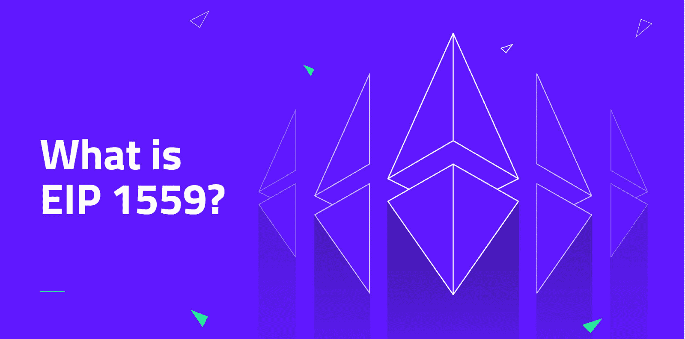
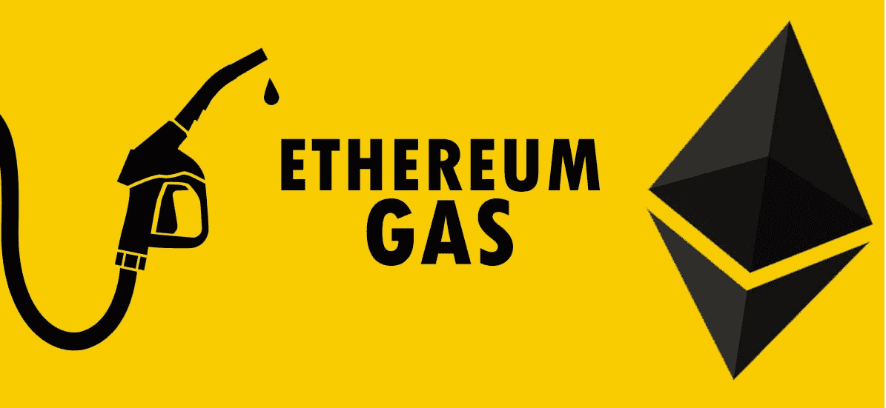
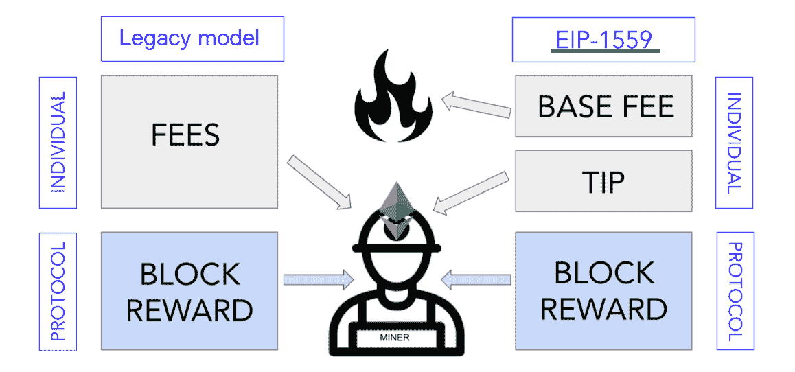
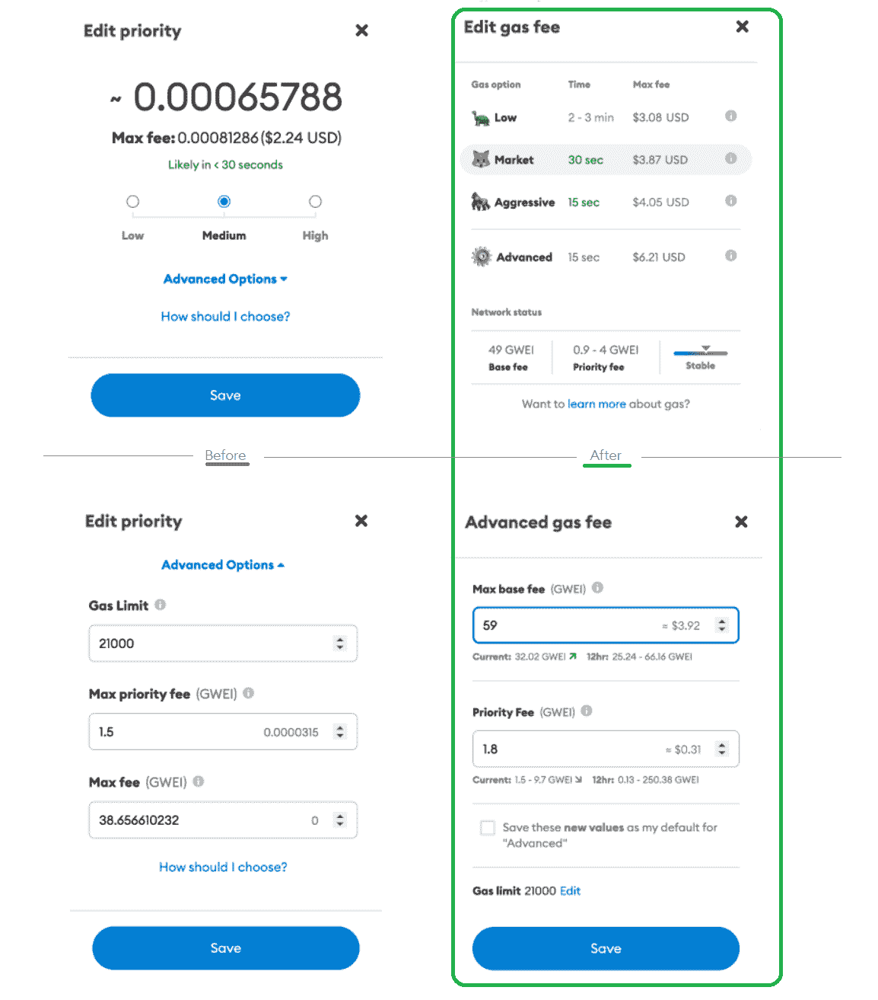
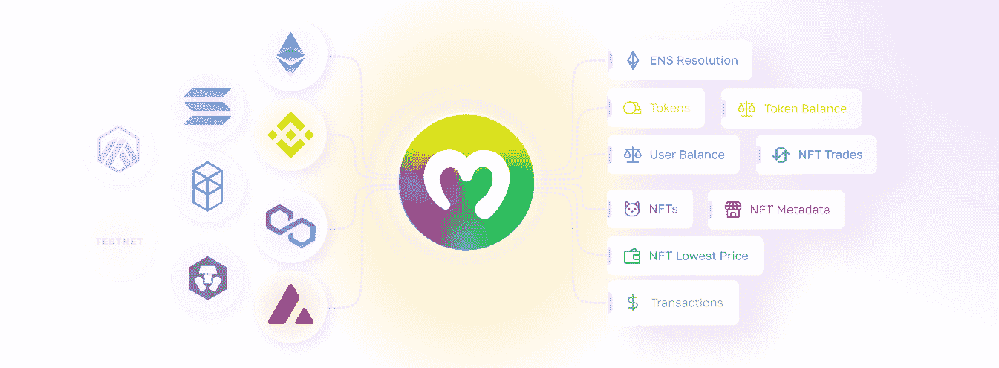

# EIP 1559 的例子-什么是 EIP-1559？

> 原文：<https://moralis.io/eip-1559-example-what-is-eip-1559/>

**距离 2021 年 8 月的** [**以太坊**](https://moralis.io/full-guide-what-is-ethereum/) **【伦敦】更新已经快一年了。升级包含了几个需要实施的改进建议，包括 EIP 1559。这次升级对** [**以太气费**](https://moralis.io/ethereum-gas-fees-the-ultimate-2022-guide/) **产生了不小的影响。然而，事实证明，许多用户仍然不知道这次伦敦 hardfork 升级到底意味着什么。因此，我们决定以 EIP 1559 的费用计算为例来解释什么是 EIP 1559。结果，你将最终理解以太坊的这个相当重要的更新。首先，我们将回答“什么是 EIP 1559？”这样即使是完全的初学者也能跟上。一旦覆盖，它将帮助您决定以太坊是否是您想要重点发展的链。此外，它将使您能够像专业人士一样处理您的燃气费用，甚至在 Solidity** **中执行** [**燃气优化。**](https://moralis.io/gas-optimizations-in-solidity-top-tips/)

如果你想成为一名 Web3 开发人员，你应该学习 EIP 1559 范例。毕竟会帮你认识到以太坊气费还是比较高的。因此，考虑其他 [EVM](https://moralis.io/evm-explained-what-is-ethereum-virtual-machine/) 兼容链很有意义。幸运的是，有终极的 [Web3 后端平台](https://moralis.io/exploring-the-best-web3-backend-platform/)、[Moralis 观](https://moralis.io/)，任你处置。这个“ [Firebase for crypto](https://moralis.io/firebase-for-crypto-the-best-blockchain-firebase-alternative/) ”平台完全是关于跨链互操作性的，使您能够使用相同的代码(在某些情况下，只需稍作调整)跨多个链部署杀手级 dapp([分散应用](https://moralis.io/decentralized-applications-explained-what-are-dapps/))。可以开始关注[多边形](https://moralis.io/how-to-build-polygon-dapps-easily/)、[雪崩](https://moralis.io/how-to-build-avalanche-dapps-in-minutes/)、 [BNB 链](https://moralis.io/how-to-create-a-bnb-chain-token-in-5-minutes/)等交易费用实惠的区块链。然而，当你设法增加预算时，你可以很容易地在以太坊上部署相同的 dapps。因此，[创建你的免费 Moralis 账户](https://admin.moralis.io/register)，用它在几分钟内[创建一个 Moralis dapp](https://docs.moralis.io/moralis-dapp/getting-started/create-a-moralis-dapp) 。不过，请确保您首先涵盖我们的 EIP 1559 年的例子。

## 什么是 EIP-1559？

如上所述，EIP 1559 是以太坊的区块链的硬分叉升级，被称为“伦敦升级”。实施发生在 2021 年 8 月。它对支付交易费用的市场机制产生了巨大影响。这个以太坊改进提案(EIP)最初是由以太坊的创始人之一维塔利克·布特林提交的。他的意图是降低每笔交易的成本。他计划通过不向矿工支付天然气费来做到这一点，而在旧的以太坊交易收费机制中，用户正在竞标天然气费。Vitalik 预计，如果用户不经常为汽油多付钱，交易费用就会降低。因此，实施基本费用是必要的。

维塔利克的建议实施得很成功。虽然它没有显著影响交易费用的降低，但它确实让用户更容易预测费用。我们将继续讨论 EIP 1559 的要点，并在我们的 EIP 1559 示例中更全面地讨论改进建议。但是，我们需要先确定你了解以太气。

***注:*** *想了解使用智能合约确定以太坊气的当前价格？查看本文末尾的视频。在那里，您可以查看 EIP 1559 示例的完整代码！*

### 以太气是什么？

为了正确理解 EIP 1559 是什么，并从 EIP 1559 的例子中得到最大的收获，你需要知道以太气是什么。记住以太坊网络的基础知识，你可能知道 EVM 是一个全球处理器，矿工为这个分散的处理器供电。相应地，强大的计算机执行 EVM [智能合约](https://moralis.io/smart-contracts-explained-what-are-smart-contracts/)。因此，他们通过区块链以太坊的新积木实现了 [Web3 契约](https://moralis.io/what-are-web3-contracts-exploring-smart-contracts/)效果。此外，我们必须指出，我们用气体单位来衡量 EVM 的用法。因此，如果使用量增加，天然气的消耗量也会增加。

简言之，天然气基本上是 EVM 的燃料。但是让事情有点混乱的是，气体同时也是燃料的计量单位。此外，以太气的单位是 gwei，即千兆维(**1 gwei**= 0.000000001 ETH = 10-9ETH)。至于以太坊燃气费，这是用户需要支付的费用，以补偿执行交易所需的计算能量。

大多数人都不知道以太坊网络上的每个特定操作都有固定的天然气价格。以太坊的黄皮书对此有明确定义。所以，不是气的价格*变了，而是*气的价格*变了，随供求关系波动。因此，以 gwei 表示的一笔天然气交易的价值是不断变化的。此外，用于执行包含在任何给定块中的一组事务的 gas 总量会影响该块的大小。因此，每个块的容量(它保存的数据量)是由所涉及的事务的计算决定的。*

### EIP 1559 的要旨

现在你知道以太坊燃气和燃气费是什么，我们可以涵盖 EIP 1559 的要点。以下是传统天然气定价模式的主要变化:

*   EIP 1559 引入了更好的交易费用估算(它使得交易费用更可预测)。
*   **伦敦更新总体上加快了交易的包容性。**
*   **EIP 1559 也引入了抵消联邦政府债券的发行。**它通过燃烧一定比例的交易费(基础费)来做到这一点。
*   **更新后，以太坊交易有基础费用，由网络计算。其计算基于对当前块空间的需求。**
*   基本饲料被完全烧掉(销毁或停止流通)。因此，以太坊曾有过通货紧缩的日子。
*   EIP 1559 也通过优先付费引入了小费制度。希望优先处理事务的用户可以使用此选项。这些费用归矿工所有，因此得名“小费”。
*   **伦敦 hardfork 也实现了“maxFeePerGas”。**该功能使用户能够设置他们愿意为交易的执行支付多少费用。因此，他们能够确保支付的价格不会高于天然气的市场价格(“baseFeePerGas”)。因此，任何额外支付的费用，减去他们的小费，退还给用户。

尽管如此，这张图片还是简洁地展示了 EIP 1559 更新的一些最重要的方面:

## EIP 1559 年的例子——天然气费是如何运作的，如何计算

知道了以太坊气费是什么，我们就准备学习它们是如何运作的。后者将使你最大限度地利用即将到来的 EIP 1559 示例计算。让我们首先指出以太坊使用工作证明(PoW)共识机制。因此，矿工和他们的计算能力起着至关重要的作用。他们使用强大的计算机验证和处理交易。毕竟，每个事务都需要一个 miner 来验证并添加到当前块中。从逻辑上讲，矿工们会从他们的工作中得到某种补偿。如果什么都不做，他们的电费就不会自己付了。

考虑到这一点，你可以将网络天然气费视为对矿工的奖励。事实上，遗留系统正是如此。然而，在 EIP 1559 年更新后，只有小费给了矿工。但是，基本费用金额仍然取决于两个因素:

1.  网络的堵塞决定了 gwei 目前的天然气价格。
2.  你试图执行的合同的规模以及你希望合同执行的速度。这决定了所需的气体量。

我们相信，看一看 EIP 1559 年的交易实例将有助于你理解以太坊煤气费是如何运作的。因此，让我们假设“Joe”想要向“Lisa”发送一个 ETH。如果他想让 Lisa 得到一个 ETH，他需要一个 ETH，外加以太坊的煤气费。为了这个例子，让我们假设 Joe 有足够的 ETH。因此，Lisa 将获得一份 ETH，而其余部分(基本费用+小费)将被分摊，如上图所示。

## 燃气费是如何计算的——EIP 1559 示例

在伦敦升级之前，天然气费用是用所谓的“一级价格拍卖模式”计算的。后者现在被称为传统天然气定价模型。传统定价模型的主要问题是缺乏准确性。因此，实际的天然气价格和计算的天然气价格经常不匹配。当在提交交易请求和实际交易期间出现偏差时，就会给用户带来问题。因此，许多用户最终白交了煤气费。最重要的是，交易经常长时间停滞不前。幸运的是，EIP 1559 解决了这些问题。然而，它也引入了额外的复杂性。因此，EIP 1559 年后总交易费的计算遵循以下等式:

***总交易费=用气单位(限额)×(基础费+小费)***

让我们剖析一下上面的等式:

*   **气体单位、**或气体限值在以太坊黄皮书的附录“G”中定义。
*   **基本费用**(由 EIP 1559 引入)是当前区块包含的每单位天然气的最低价格。此外，网络根据当前对块空间的需求来计算基本费用。
*   **优先权费**(小费)是给用户的交易优先权。而且，它也是奖励矿工的费用的一部分。

#### EIP 1559 示例计算

现在，让我们用上面的等式和前面的交易例子(乔和丽莎)来计算以太坊燃气费。要做到这一点，我们需要知道进入方程的所有变量的确切值。因此，我们需要汽油限额、基本费用和小费。为了这个 EIP 1559 的例子，我们可以假设目前的基本费用-让我们说它是 100 千兆瓦。还有，让我们把乔的小费定在 10 gwei。尽管如此，我们使用以太坊黄皮书，它告诉我们交易的气体限制是 21，000。最后，我们可以把它们放在一起:

***21000 x(100+10)gwei = 2310000 gwei = 0.00231 ETH***

查看我们的 EIP 1559 示例计算，Joe 需要在他的钱包中有 1.00231 ETH 来发送一个 ETH 给 Lisa。而且，0.00231 ETH 的总交易费包括 0.0021 ETH 基础费和 0.00021 ETH 小费。

## 以太坊天然气价格估算工具

经过 EIP 1559 年的更新，汽油费的预测更加准确了。这主要是由于使用了前一个块的细节，而不是当前块的细节。此外，这也使每个人能够计算他们的 EIP 1559 示例交易的燃气费。首先，你需要上面的等式。你还需要以太坊黄皮书和以太坊扫描上的[以太坊气体追踪器](https://etherscan.io/gastracker)。这些工具的组合将使您能够正确地估计天然气费用。另一个神奇的工具是 [MetaMask](https://moralis.io/metamask-explained-what-is-metamask/) 。这款最受欢迎的 [Web3 钱包](https://moralis.io/what-is-a-web3-wallet-web3-wallets-explained/)定期更新其用户界面。事实上，他们的团队最近实施了一些与 EIP 1559 相关的变更:

尽管如此，为了正确地确定当前的以太坊天然气价格，你也可以将你的[可靠性](https://moralis.io/solidity-explained-what-is-solidity/)基础知识与特定的智能合同结合起来使用。然后，你可以在其他智能合约和 dapps 中使用后者作为工具。这就是[混音](https://moralis.io/remix-explained-what-is-remix/)能帮你大忙的地方。如果你想了解更多关于使用智能合约来确定以太坊天然气的当前价格，请查看下面的视频(14:08)。此外，下面 EIP 1559 例子中使用的全部代码都在 [GitHub](https://github.com/DanielMoralisSamples/29_Gas_Full_Course) 上等着你。

https://www.youtube.com/watch?v=t9Gii8JWEvY

## EIP 1559 的例子-什么是 EIP-1559？–总结

在这一点上，你知道 EIP 1559 是以太坊网络的更新之一。EIP 1559 的实施发生在 2021 年 8 月，主要集中在以太坊气费的机制上。此外，它改变了天然气费用的计算和分配。这使得汽油费的估算更加准确，并开始消耗基本费用的一部分。在这里，我们也涵盖了 EIP 1559 年的例子计算。最后，您还了解了一些可以帮助您计算油费的优秀工具。

有了本文中获得的知识，您就可以开始您的区块链开发之旅了。因此，使用 [Moralis YouTube 频道](https://www.youtube.com/c/MoralisWeb3)和 [Moralis 博客](https://moralis.io/blog/)来探索这项颠覆性技术的其他方面。例如，一些最新的文章将向您展示如何[将游戏资产铸造为 NFT](https://moralis.io/how-to-mint-game-assets-as-nfts/)、[建立一个分散的自治组织(DAO)](https://moralis.io/how-to-build-a-decentralized-autonomous-organization-dao/) 、建立一个[索拉纳令牌仪表板](https://moralis.io/how-to-build-a-solana-token-dashboard/)、[创建您自己的元宇宙](https://moralis.io/how-to-create-your-own-metaverse/)、创建一个 [BNB NFT](https://moralis.io/how-to-create-a-bnb-nft/) 、建立一个[玩即赚(P2E)游戏智能合同](https://moralis.io/how-to-build-a-play-to-earn-p2e-game-smart-contract/)，或者一个 [Uniswap DEX 克隆](https://moralis.io/build-a-uniswap-dex-clone-with-html-css-javascript-moralis-on-the-ethereum-network/)。此外，这些也是了解加密主题的渠道，如[动态 NFT](https://moralis.io/what-are-dynamic-nfts-the-ultimate-2022-guide/)、 [NFT 会员资格](https://moralis.io/what-are-nft-based-memberships-full-guide/)、[分数 NFT](https://moralis.io/what-are-fractional-nfts-the-ultimate-2022-f-nft-guide/)、 [SPL vs ERC20 代币](https://moralis.io/spl-vs-erc20-tokens-comparing-solana-and-ethereum-tokens/)等。

我们强烈鼓励你采取一些更先进的例子项目。这些包括建立一个 [Web3 Twitter 克隆](https://moralis.io/how-to-build-a-web3-twitter-clone/)、 [Web3 网飞克隆](https://moralis.io/how-to-develop-a-web3-netflix-clone/)和 [Web3 Spotify 克隆](https://moralis.io/how-to-build-a-web3-spotify-clone/)等等。另一方面，如果你想自信地成为一名区块链开发者，你需要采取更专业的方法。因此，你应该考虑报名参加 Moralis 学院。

