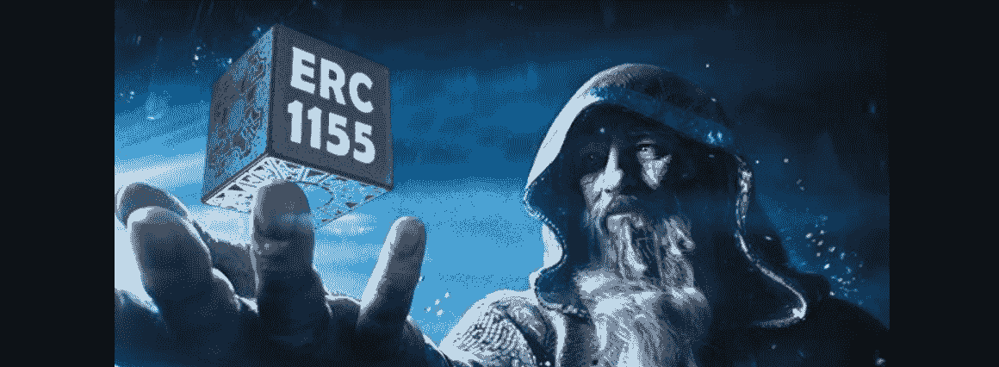
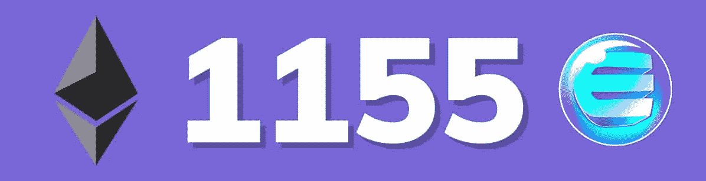
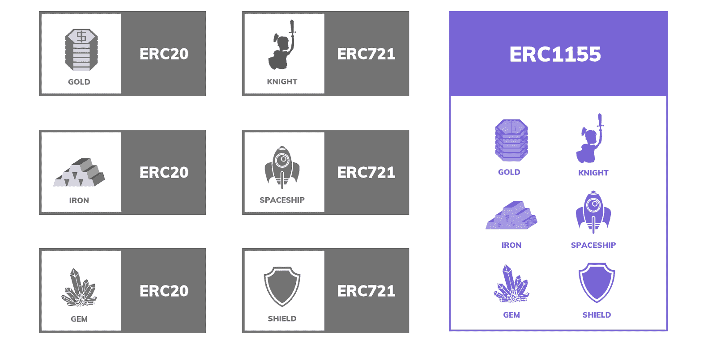
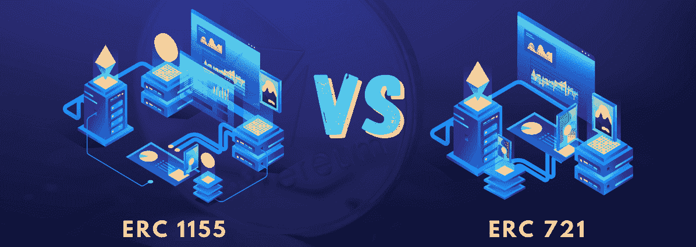
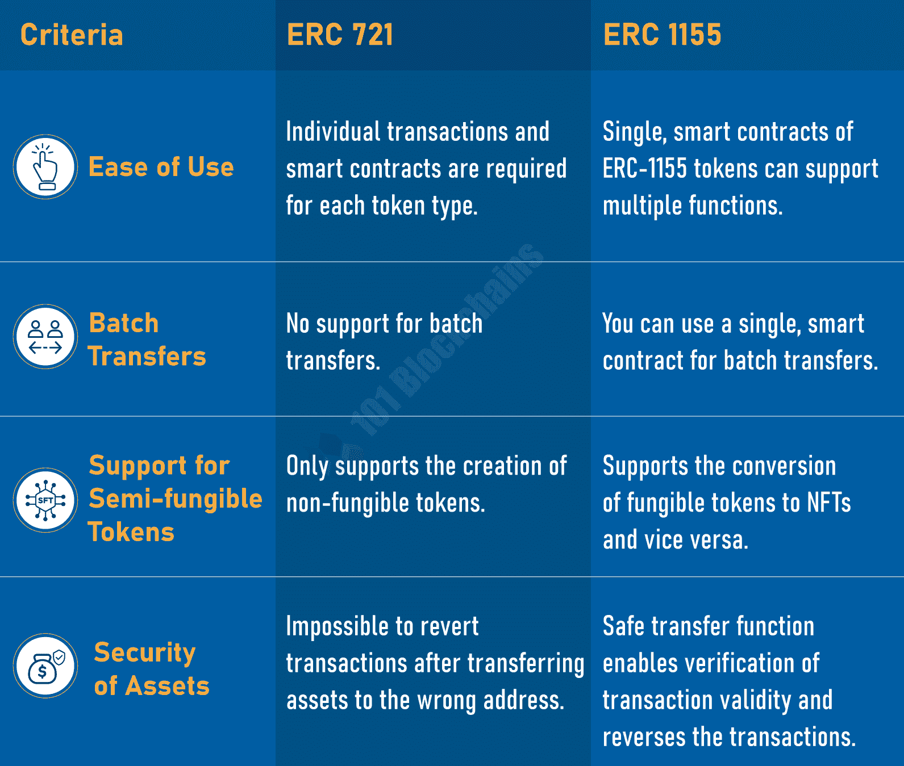
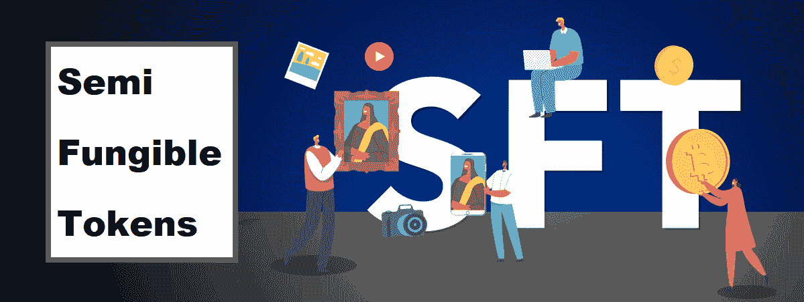
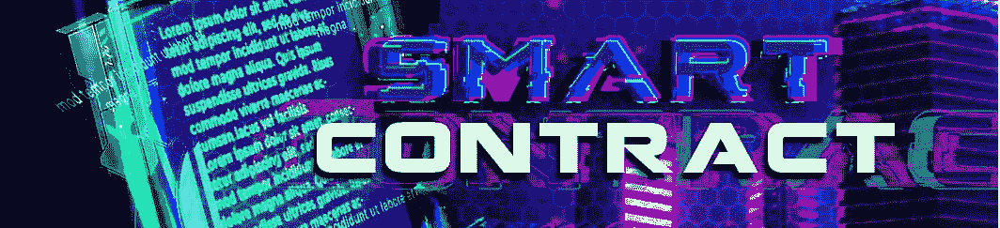
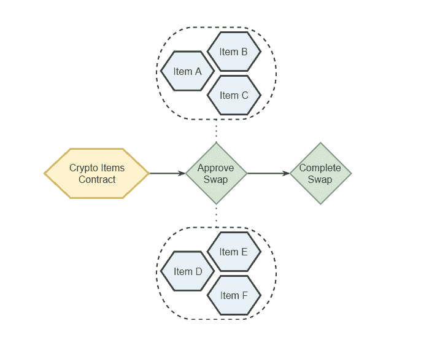
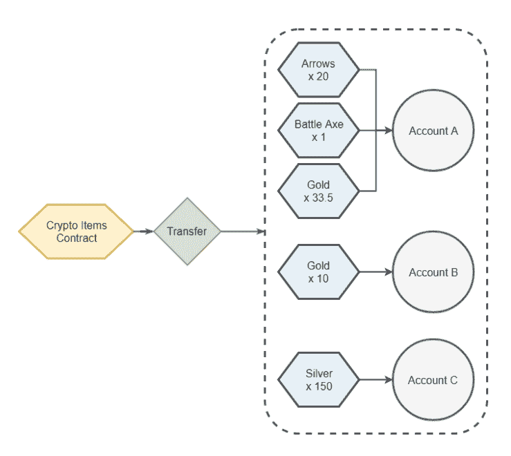
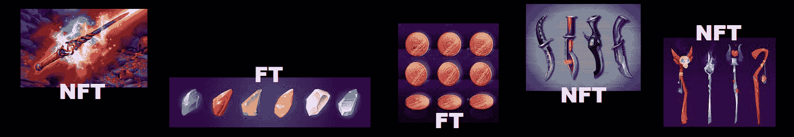

# ERC 1155 NFTs–什么是 ERC-1155 标准？

> 原文：<https://moralis.io/erc-1155-nfts-what-is-the-erc-1155-standard/>

NFT(不可替换的令牌)的独特性提供了无数的机会，开发者可以构建各种与 NFT 相关的项目，并围绕这些项目使用各种用例。也就是说，当您 [**创建一个 NFT 项目**](https://moralis.io/how-to-create-an-nft-project-get-started-and-launch-successfully/) **时，无论是显示** [**NFT 收集数据的 dapp**](https://moralis.io/nft-collection-data-how-to-get-nft-collection-data/)**还是使用户能够** [**通过一个地址获得所有的 NFT**](https://moralis.io/how-to-get-all-nfts-owned-by-an-address-3-step-process/)**，正确理解各种 NFT 标准都很重要。一个这样的标准是 ERC 1155，这是本文的主要焦点！**

接下来，我们将首先回答“什么是 ERC-1155？”问题。接下来，我们将确保您了解 ERC 721 和 ERC 1155 的区别。您还将有机会了解半可替换令牌。我们还将确保您熟悉 ERC 1155 智能合同。此外，除了确保您理解理论和概念，我们还将查看一个合同样本。最后，我们将探索获得 ERC-1155 钱包地址的最简单的方法。在这里，您将了解一些终极 Moralis 标准 [NFT API](https://moralis.io/nft-api/) 端点，以及如何轻松实现钱包平衡。

说了这么多，我们需要涵盖一些理论，以确保您正确理解 ERC 1155 标准。然而，如果你喜欢边做边学，[创建你的免费 Moralis 账户](https://admin.moralis.io/register),学习 Moralis 文档中的许多优秀教程。例如，用 NodeJS 和 NextJS 构建你的[第一个 dapp 是一个很好的起点。然后，您可以继续阅读](https://docs.moralis.io/docs/your-first-dapp-nodejs) [NFT API 教程](https://docs.moralis.io/docs/nft-api)，并在“什么是 ERC-1155？”时返回本文问题出现了。



## 什么是 ERC-1155？

简而言之，对 ERC 1155(又名 ERC-1155)最常见的解释是将其定义为 NFT 令牌标准。虽然这是正确的，但它同时只是一个部分的定义。毕竟，ERC (" *以太坊征求意见稿*")实际上为多令牌管理和交易搭建了舞台，这意味着该标准的单个合同可以包括不可替代、可替代和半可替代令牌的不同组合。

此外，值得指出的是，ERC 1155 源自金恩团队，该团队从各种令牌标准中汲取了概念和想法，主要是 ERC 20 和 ERC 721。然而，除了结合现有的概念，新 ERC 标准还引入了一些改进。例如，在 ERC-20 和 ERC-721 下，开发人员必须为每个可替换和不可替换的令牌部署单独的合同。后者经常导致以太坊的区块链被冗余的字节码淹没。此外，将每个合同分成单独的地址也带来了某些功能限制。



因此，金恩团队认为，如果 NFT 和更广泛的令牌生态系统要成长并扩展到其他应用程序，就需要一个新的标准。因此，我们的目标是找到一种新的方法来最小化交易量和合同的低效率。通过实现这一目标，Web3 游戏平台和其他类型的基于令牌的 dapps(去中心化应用)可以包含 NFTs。幸运的是，这种进步的思维方式导致了 ERC 1155 的诞生。

那么，什么是 ERC-1155？这是一种通用令牌标准，支持在单个实例中传输不同类型的令牌。这种效率的提高降低了交易成本，减轻了以太坊链条上的负担。此外，该 ERC 还支持原子交换和多个令牌的 escrows。此外，由于有了 ERC 1155，系统不再需要单独批准象征性合同。



### 非功能性测试的黄金标准

ERC 1155 是唯一的令牌标准，使您能够创建各种类型的令牌化资产，从货币和房地产到数字艺术和游戏项目。反过来，这也使它成为非功能性测试的黄金标准。此外，它的一个关键优势是，它允许用户创建新项目，而不必部署新合同，这是许多 NFT 市场所利用的。此外，由于在 NFT 市场项目中应用此功能更有意义，因此 ERC 1155 成为 NFT 平台的高级标准。

最终，这个强大的 ERC 标准可以将您的区块链开发游戏提升到一个新的水平，特别是如果您利用它的优势和先进的工具，比如 Moralis。因此，可以肯定地说，没有什么理由回到旧的、更麻烦的标准。然而，如果 ERC-20 和 ERC-721 能满足你对简单项目的需求，你可能还是想用它们。对于所有区块链开发新手来说，更简单的标准也是有用的学习工具。尽管如此，为了帮助您进一步理解两个领先的 NFT 标准，让我们一起来看看它们。



## ERC 1155 对 721

即使你只是浏览了一下铸造 NFT，你也一定会发现 ERC-721 和 ERC-1155 是最流行的 NFT 标准。然而，ERC 721 是第一个出现在现场的，因此也是许多老 NFT 项目的幕后推手。

ERC 721 最初是以 EIP 草案的形式出现的(“*以太坊改进提案*”)。后者由 Dapper Labs 首席技术官 Dieter Shirley 发布。此外，除了 William Entriken、Jacob Evans 和 Nastassia Sachs，Dieter Shirley 也被认为是 ERC-721 标准的作者之一。此外，这一提议成为游戏 CryptoKitties 的基础。

从技术角度来看，ERC 721 标准定义了智能合约必须实现的最小接口。当达到这个最低要求时，它允许 Web3 钱包拥有、交易和管理 NFT。此外，ERC-721 不需要与令牌相关的元数据标准，也不限制添加补充最低要求的功能。此外，请记住，NFT 的智能合约不包含代表 NFT 的文件。这些文件太大了，把它们保存在区块链上在技术上和经济上都不合理。因此，NFT 契约只包括到这些文件及其元数据的链接或 URIs。通过采用这种方法，NFTs 引用链外资源，并确保区块链不负责托管这些数据。

可以肯定地说，ERC 1155 在某些方面是 ERC 721 的改进。毕竟，它可以达到同样的目的。但是，它也支持不可替换和半可替换的令牌。通过查看下图，我们还可以比较这两种标准:



*注:如果你更喜欢视频，我们推荐你观看以下视频:*

**ERC 1155 的解释:**

[https://www.youtube.com/embed/XNWd8Nl3rhA?feature=oembed](https://www.youtube.com/embed/XNWd8Nl3rhA?feature=oembed)

**ERC 721 的解说:**

[https://www.youtube.com/embed/QFYU81zM_jA?feature=oembed](https://www.youtube.com/embed/QFYU81zM_jA?feature=oembed)

## 半可替换的 ERC 1155 代币

除此之外，ERC 1155 还引入了一种创建半可替代代币(sft)的新方法。后者是合并了可替换和不可替换令牌的不同属性的特定类型的令牌。反过来，这使得两全其美成为可能。

为了帮助你理解 SFTs，让我们考虑一个“商店优惠券”的类比。商店优惠券是“可替换的”,因为它具有特定的价值，可以用来交换同等价值的物品。一旦赎回，其价值降至零，不再作为可替代物品有效。现在，假设我们有一张商店优惠券，一旦兑现，它的属性就会改变。例如，它改变了关于商品、顾客、价格等的优惠券信息。反过来，它变得不可替代。本质上，半可替换令牌标准(如 ERC1155)能够表示这两种属性，使您能够创建 SFTs 以可替换令牌开始，以 NFT 结束的令牌。



## ERC 1155 的主要优点

既然你可以回答“什么是 ERC-1155 和 ERC-721 标准？”问题，是时候看看 ERC 1155 的主要优势列表了:

*   使您能够部署 NFT、可替换令牌和半可替换令牌
*   使您能够在智能合约中部署多种令牌类型
*   更高级别的安全性
*   降低汽油费
*   增强了对分散交易所(dex)的支持
*   工作量减少
*   动态元数据

上述优点使 ERC 1155 成为最终的令牌标准。然而，ERC 721 和 ERC 20 仍然是发行单个不可替代和可替代代币的完美选择。因此，项目的性质会告诉你应该关注哪个标准。



## ERC 1155 智能合约

至此，您知道 ERC 1155 智能合约同时支持多种类型的令牌转移。这些类型的 Web3 契约还使您能够构建诸如原子交换和 escrows 之类的功能。此外，这使您无需单独授权单个令牌合约，而 ERC-721 就是这种情况。

尽管如此，请务必看看下面的金恩图表，它显示了 ERC 1155 如何简化任意数量的令牌(甚至不同种类)的令牌交换:



上图展示了整个批处理获得批准并通过两个简单的步骤进行交易，这两个步骤被称为多个令牌的“原子交换”。这就是为什么 ERC1155 合同节省了大量以太坊燃气费。

此外，由于 ERC 1155 合同，用户可以在一次交易中向不同的收件人发送多个项目。下图展示了这种性质的一个例子:



令人惊讶的是，一个智能合约和一个交易可以处理不同类型的转让给多个用户。

### 智能合同示例

如果你想回答“什么是 ERC-1155？”自信地提问，看看以下标准的合同样本会有所帮助。以下代码行代表了一个游戏中令牌化物品的简单 ERC 1155 契约的示例:

```js
// contracts/GameItems.sol
// SPDX-License-Identifier: MIT
pragma solidity ^0.6.0;

import "@openzeppelin/contracts/token/ERC1155/ERC1155.sol";

contract GameItems is ERC1155 {
    uint256 public constant COPPER = 0;
    uint256 public constant CRYSTAL = 1;
    uint256 public constant ELDER_SWORD = 2;
    uint256 public constant KNIFE = 3;
    uint256 public constant WAND = 4;

    constructor() public ERC1155("https://game.example/api/item/{id}.json") {
        _mint(msg.sender, COPPER, 10**18, "");
        _mint(msg.sender, CRYSTAL, 10**27, "");
        _mint(msg.sender, ELDER_SWORD, 1, "");
        _mint(msg.sender, KNIFE, 10**9, "");
        _mint(msg.sender, WAND, 10**9, "");
    }
}
```

正如您在顶部看到的，上面的示例利用了 OpenZeppelin 的强大功能，它为您提供了经过验证的智能合同模板。此外，上述合同包括可替代和不可替代的游戏项目。比如铜是可替代的，而“ *Elder_Sword* 是不可替代的。

使用“ *GameItems* ”，上面的契约给每个物品类型分配一个编号。这样一来，每个整数("*铜*"，"*晶*"等等。)成为“ *0* ”、“ *1* ”等的别名。在后端，这些项目名称简单地读作“ *0* ”、“ *1* ”、“ *2* ”、“ *3* ”、“ *4* ”。



智能合约中实际创建令牌的部分是“ *mint* ”调用“*构造器*”。mint 调用以所提供的数量创建新的令牌类型。因此，铜的铸造数量是 10 的 18 次方。水晶的铸造数量是 10 的 27 次方。然而，老剑是单量铸造的。这清楚地表明，这个项目是独一无二的-一个 NFT。

此外，请记住，同一个代表 NFT 的文件可能有多个实例，每个实例都有一个惟一的链上 ID。所以，即使刀和魔杖被大量铸造，它们也是 NFT。因此，它们代表彼此独立的个别项目，而不是货币。

## 如何获得 ERC-1155 钱包地址余额

如果您已经阅读了上面的章节，那么您现在应该知道 ERC-1155 是什么，以及它的用处。看了上面的例子，你可能已经对如何写这类合同有了一个恰当的理解，特别是如果你知道 Solidity 的话。如果您不知道但想知道，请理解智能契约的创建和 NFT 的铸造超出了本文的范围。

相反，我们想用这最后一节来解释如何轻松获得 ERC-1155 钱包地址。这就是 Moralis 简化事情的地方。但是在我们告诉您哪个 NFT API 端点将为您获取一个 ERC-1155 钱包地址之前，我们需要解释一些事情。

首先，请记住，用于铸造非功能性交易的智能合约也管理相应的非功能性交易的转移。这意味着您可以根据智能合约地址(也称为收集地址)来搜索 NFT。然而，一旦用户或玩家购买或以其他方式获得特定 NFT 的所有权，后者就被分配给用户的钱包。所以，当你得到一个 ERC-1155 钱包地址时，你实际上是在获取这个令牌的所有者。此外，多亏了 Moralis，您可以用一行代码以两种不同的方式做到这一点:

*   **通过合同获得一个 ERC-1155 钱包地址:**

```js
const response = await Moralis.EvmApi.nft.getNFTOwners({
    address,
    chain,
});
```

*   **通过令牌 ID** 获取 ERC-1155 钱包地址:

```js
const response = await Moralis.EvmApi.nft.getNFTTokenIdOwners({
    address,
    chain,
    tokenId,
});
```

*注意:您可以在 Moralis 的文档中查看“*[*【getNFTOwners*](https://docs.moralis.io/reference/getnftowners)*”、“*[*getnfttokenidomains*](https://docs.moralis.io/reference/getnfttokenidowners)*”以及所有其他 NFT API 端点的详细信息。*

作为奖励，这里还有一个视频将告诉你如何获得任何钱包的原生余额:

[https://www.youtube.com/embed/sL5t07JE0aE?feature=oembed](https://www.youtube.com/embed/sL5t07JE0aE?feature=oembed)

## ERC 1155 NFTs–什么是 ERC-1155 标准？–总结

我们在今天的文章中谈了相当多的内容。你首先知道了“什么是 ERC-1155”的答案是什么让它成为非功能性测试的黄金标准。接下来，我们看了“ERC 1155 与 721”的对比。您还有机会了解什么是半可替换令牌。在介绍了基础知识之后，是时候概述 1155 标准的主要优点了。尽管如此，我们还是讨论了执行 ERC 标准的智能合约。在这里，您还有机会探索一个示例合同。最后但同样重要的是，我们解释了如何简单地获得 ERC-1155 钱包地址余额和本机余额。

展望未来，我们建议您采取以下两种选择之一:

*   开始建造杀手 dapps
*   探索其他区块链发展主题

如果你渴望开始构建，你在一开始就发现你只需要创建你的免费 Moralis 帐户，并遵循我们的教程。另一方面，如果你有兴趣探索其他加密话题，请访问[Moralis 伦理 YouTube 频道](https://www.youtube.com/@MoralisWeb3)和[Moralis 伦理博客](https://moralis.io/blog/)。一些最新的话题涵盖了 [web3.storage](https://moralis.io/an-introduction-to-web3-storage-what-is-it-and-how-does-it-work/) 和 [Web3 storage](https://moralis.io/web3-storage-how-web3-data-storage-works/) 、 [ethers.js vs Web3 streams](https://moralis.io/ethers-js-vs-web3-streams-the-best-option-for-blockchain-developers/) 、 [Palm NFT 工作室](https://moralis.io/exploring-the-palm-network-what-is-palm-nft-studio/)等等。此外，您可能希望以更专业的方式探索不同的区块链发展主题。如果是这样，考虑报名[Moralis 学院](https://academy.moralis.io/)。这是获得区块链认证并从专业人士那里学习[以太坊基础知识](https://academy.moralis.io/courses/ethereum-101)的地方。